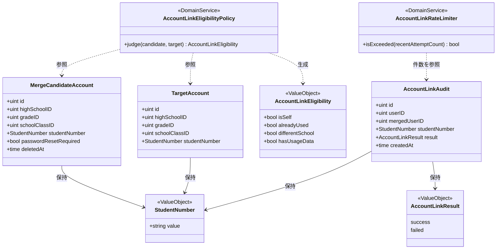
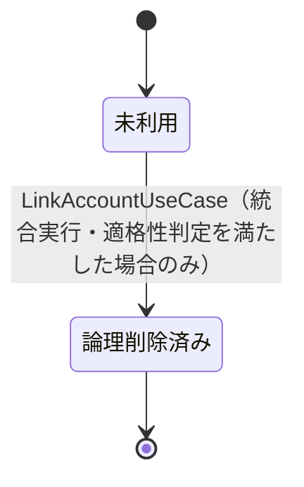
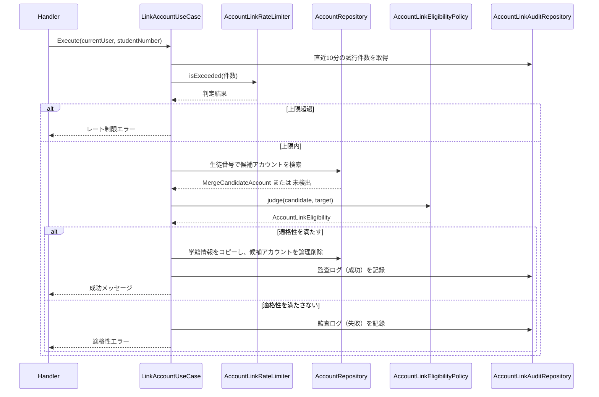
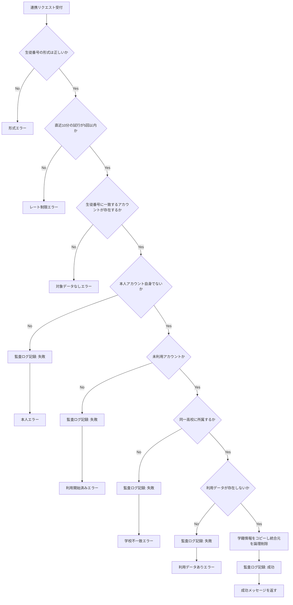

# アカウント連携機能 Go移行・設計仕様書

---

# 1. 機能概要

## 機能概要

教員によって事前に招待登録された未利用の生徒アカウント（学籍情報のみが設定された仮アカウント）を、生徒番号をキーに検索し、現在ログイン中のアカウントへ統合する機能である。Rails現行仕様では、統合対象アカウントが5つの適格性条件（本人でない・未利用・同一高校・利用データなし・生徒番号の書式）をすべて満たす場合にのみ統合を実行し、学籍情報（高校・学年・クラス・生徒番号）をログイン中アカウントへコピーしたうえで、統合元アカウントを論理削除する。統合の成否にかかわらず、試行内容を監査ログ（`account_link_audits`）へ記録する。

## 利用者

- 生徒ユーザー（student ロール）
- 自分がログイン中のアカウントに対してのみ統合を実行できる

## 業務上の目的

- 転入・進級時等に教員が発行した仮アカウントの学籍情報を、生徒が実際に利用しているアカウントへ正しく引き継ぐ
- 誤った統合・不正な統合試行を適格性判定によって防止する
- 統合試行の成功・失敗を監査ログとして残し、追跡可能性を確保する

---

# 2. 設計方針

本機能は、複数の適格性条件が絡む業務ルールと、統合対象・統合元・監査ログという複数Entityにまたがる整合性要求を持つため、業務ルールをドメイン側へ明確に集約する設計とする。

- 責務分離: 適格性判定・学籍情報コピー・論理削除・監査記録・試行回数制限を分離する
- 保守性: 適格性条件が将来追加されても、判定ロジックが1箇所に閉じるようにする
- テスト容易性: 5つの適格性条件をそれぞれ独立に検証できるようにする
- API互換性: 既存エンドポイント・エラーレスポンス（HTTPステータスの使い分け）を維持する
- 安全性: 失敗時も統合元・統合先のデータを変更しないという現行仕様の原則を、Transaction設計で明示的に保証する

---

# 3. Bounded Context

## Context名

- account-linking

## Contextの責務

- 生徒番号による統合対象候補アカウントの検索
- 統合対象候補の適格性判定（本人チェック・利用開始状況・所属高校・利用データ有無）
- 適格な場合の学籍情報コピーと統合元アカウントの論理削除
- 統合試行結果（成功・失敗）の監査記録
- 試行回数制限（レート制限）の判定

## 他Contextとの依存関係

- User Context（②は`ユーザー基盤機能_Go移行・設計仕様書.md`。参照とアカウント作成を担い、アカウントの更新・論理削除は同Contextの責務に含まれない）: 本機能は統合対象・統合先いずれもUser実体（アカウント）の学籍情報を直接参照・更新する。これは他機能のような「参照専用の依存」ではなく、User Context本来のデータに対する書き込みを本機能が担う数少ない例外である
- School Context（高校）: 統合対象候補とログイン中アカウントが同一高校に所属するかどうかの判定に、高校IDの参照が必要なため依存する

## 依存する理由

アカウント統合は、その定義上「2つのUserレコードの学籍情報を1つに集約する」業務であり、User実体への依存を切り離すことができない。User Contextの②（`ユーザー基盤機能_Go移行・設計仕様書.md`）は参照とアカウント作成を担い、アカウントの更新・論理削除は本Contextの外に残す例外として位置づけている。したがって、本機能が必要とする範囲（生徒番号検索・学籍情報更新・論理削除）に限定したRepositoryを本Context内に定義する。

---

# 4. 設計パターン

## 採用パターン

Domain Model

## 判断根拠

本機能は、単一の統合操作の中に「自分自身でないこと」「対象アカウントが未利用であること」「同一高校に所属すること」「利用データが存在しないこと」という4つの適格性条件（生徒番号の書式検証を含めると5条件）が集約されており、これらはいずれも2つのアカウント（統合元候補・統合先）の属性を比較して判定する業務ルールである。単なる入力値検証ではなく、業務上の妥当性判定であるため、ドメインルールとして明示する価値が高い。

- 業務ルール: 5つの適格性条件が1つの統合操作に集約されており、条件同士の組み合わせが複雑である
- 状態管理: 統合対象候補は「未利用」から「論理削除済み」へ、統合先は「学籍情報未設定/旧学籍情報」から「新学籍情報」へと、それぞれ状態が変化する
- 将来拡張: 適格性条件の追加（例: 学年の一致チェック等）が将来発生しうる
- テスト容易性: 適格性判定をEntity・Domain Serviceとして切り出すことで、条件ごとに独立したテストが可能になる

## 採用しなかったパターン

### Transaction Script

5条件の判定・2つのEntityの状態変更・監査記録という複合処理を単一の手続きとして書くと、条件が追加されるたびに手続きが肥大化し、条件間の見通しが悪くなる。また「失敗時も統合元・統合先のデータを変更しない」という厳密な整合性要件を手続き内で安全に表現し続けるのは保守性の観点で不利である。

### Active Record

適格性判定は単一モデルの検証（バリデーション）にとどまらず、統合先アカウントと統合元アカウント候補という2つのEntity間の比較ロジックである。どちらか一方のモデルのメソッドとして閉じ込めると、責務の所在が不自然になる。

### Event Sourcing

統合試行の履歴は`account_link_audits`テーブルへの記録で監査要件を満たしており、状態変化の再構築・イベント再生の要件は現行仕様に存在しない。

---

# 5. Aggregate設計

## Aggregate Root

- AccountLinkAudit

## Aggregateに含めるEntity

- AccountLinkAuditのみ。TargetAccount・MergeCandidateAccountはUser Context本来の所有物であるため、本Contextのアグリゲートには含めず「本機能の業務目的に限定して更新する外部参照Entity」として扱う

## Aggregate境界

- AccountLinkAudit自体は「誰が・いつ・どの候補に対して・どの結果で試行したか」を記録する単位として独立している
- TargetAccount・MergeCandidateAccountの更新は、AccountLinkAuditの生成と密接に関連するが、所有Context上はAggregate外部として扱う

## 整合性を保証する単位

1回の連携試行（適格性判定 → 学籍情報コピー → 統合元アカウントの論理削除 → 監査ログ記録）を1つの業務処理単位として扱う。適格性判定に成功した場合、この4ステップは一貫して実行されるか、まったく実行されないかのいずれかでなければならない。

理由: Rails現行仕様書5章の処理内容7項目に「上記2〜6の過程でエラーが発生した場合（中略）処理全体を取り消す（統合元・統合先いずれのデータも変更されない）」と明記されており、部分的な適用は業務上許容されないため。ただし、失敗時の監査ログ記録についてはこの単位の外側で扱う（詳細は「14. Transaction設計」）。

---

# 6. Entity設計

## MergeCandidateAccount（統合元アカウント候補）

- 役割: 生徒番号によって検索される、統合対象候補のアカウント
- ライフサイクル: 検索 → 適格性判定 → （適格な場合のみ）学籍情報のコピー元として利用され、論理削除される
- 状態変化: 未利用（`password_reset_required = true`、`deleted_at = nil`） → 論理削除済み（`deleted_at`設定、`student_number`クリア）
- 保持する責務:
  - 学籍情報（高校・学年・クラス・生徒番号）を保持する
  - 適格性判定に必要な属性（本人一致判定用のID、利用開始状況、所属高校、業務データ有無）を提供する
  - TargetAccountとの比較により、自身が統合元として適格かどうかを判定する振る舞いを持つ
- 判断根拠: 複数の適格性ルールが集中する対象であり、Domain Model化によって判定ロジックを一箇所に集約できるため

## TargetAccount（統合先＝ログイン中アカウント）

- 役割: 統合先となる、現在ログイン中の生徒アカウント
- ライフサイクル: 参照 → 学籍情報の更新（統合実行時のみ）
- 状態変化: 高校・学年・クラス・生徒番号が、統合元候補の値で上書きされる
- 保持する責務:
  - 自分自身の識別情報を保持し、MergeCandidateAccountとの本人一致判定・同一高校判定の材料を提供する
  - 統合実行時に学籍情報を更新される対象としての責務を持つ
- 判断根拠: 統合処理によって状態が変化する当事者であり、適格性判定（「本人ではないか」等）にも関与するため

## AccountLinkAudit

- 役割: 連携試行の結果（成功・失敗）を記録する監査ログの中心的な概念
- ライフサイクル: 生成のみ（追記型。作成後の更新・削除は行わない）
- 状態変化: なし（`result`は生成時に確定する）
- 保持する責務:
  - 試行者（ログイン中アカウント）・統合元候補・生徒番号・学籍情報・結果（成功／失敗）を保持する
  - レート制限判定のための検索対象データを提供する
- 判断根拠: 監査要件を満たす永続化対象であると同時に、レート制限判定の材料としても再利用されるため

---

# 7. Value Object設計

## StudentNumber

- 採用理由: 生徒番号は「英数字1文字以上-英数字1文字以上」のハイフン区切り形式という書式ルールを持ち、検索キーとしての妥当性を型として保証する必要があるため
- 独自ルール: 正規表現による形式検証を行い、不正な形式の値は生成できない
- Entity属性ではなくValue Objectにする理由: 形式検証ロジックをPresentation層・Domain層の双方で同じルールとして再利用するため

## AccountLinkEligibility（適格性判定結果）

- 採用理由: 5条件の判定結果を単一の真偽値ではなく、どの条件が不適格の原因になったかを明示できる形で扱うため
- 独自ルール: 「本人一致」「利用開始済み」「所属高校不一致」「利用データ有無」の各条件について判定結果を保持する
- Entity属性ではなくValue Objectにする理由: 判定結果とその理由を、エラーレスポンスの生成（どのエラーケースに該当するか）に再利用しやすくするため

## AccountLinkResult

- 採用理由: 監査ログの結果を文字列のまま扱わず、許容値を型として明示するため
- 独自ルール: `success` / `failed`のいずれかのみ許容する
- Entity属性ではなくValue Objectにする理由: 許容値の妥当性検証を一元管理するため

## Value Objectを採用しないもの

- 高校ID・学年ID・クラスID: 単純な外部キー参照であり、独自の業務ルール・比較ロジックを持たないため、Value Object化は不要とする

---

# 8. Domain Service

## AccountLinkEligibilityPolicy

- 責務: MergeCandidateAccountとTargetAccountを比較し、4つの適格性条件（本人一致・利用開始状況・所属高校・利用データ有無）を判定し、AccountLinkEligibilityを生成する
- Entityへ持たせない理由: 判定は単一Entityの属性だけでなく、2つのEntity間の比較（本人一致・学校一致）を要するため、どちらか一方のEntityへ責務を寄せると不自然になる
- 判断根拠: 複数Entityを横断する業務ルールを扱う典型例であり、Domain Serviceとして独立させることで、条件の追加・変更時の影響範囲をこのService内に限定できるため

## AccountLinkRateLimiter

- 責務: 直近10分間の試行回数が上限（5回）を超えていないかを判定する
- Entityへ持たせない理由: 判定にはAccountLinkAuditの検索結果（直近時間内の件数）が必要であり、単一Entityの属性だけでは完結しないため
- 判断根拠: 横断的な回数制限ルールであり、UseCaseがAccountLinkAuditRepositoryから取得した件数を渡して判定させることで、ルール自体を独立してテストできる形に分離できるため

---

# 9. クラス図

Goのstruct定義（フィールドの可視性・タグ等）は③Go実装仕様書で扱う。

---

# 10. 状態遷移図

MergeCandidateAccountは以下の状態を持つ（「6. Entity設計」の状態変化を可視化したもの）。

遷移条件:

- 「未利用→論理削除済み」は、AccountLinkEligibilityPolicyの4条件をすべて満たし、かつAccountLinkRateLimiterが上限超過でないと判定した場合のみ許可される

禁止される組み合わせ:

- 適格性条件を1つでも満たさない場合、状態遷移は発生しない（統合元・統合先いずれのデータも変更されない）

---

# 11. Repository設計

## AccountRepository

- 管理対象: User（本機能内ではMergeCandidateAccount／TargetAccountとして扱う）
- 責務:
  - 生徒番号（未削除のアカウントに限る）による検索
  - 本人チェック・適格性判定に必要な属性の取得
  - 学籍情報（高校・学年・クラス・生徒番号）の更新
  - 論理削除（`deleted_at`設定・`student_number`クリア）
- 保持する検索機能:
  - `student_number`（未削除）による単一検索
- 保持しない責務:
  - 認証・パスワード管理等、本機能に無関係なUser操作
  - 適格性そのものの判定（AccountLinkEligibilityPolicyの責務）
- 判断根拠: 「3. Bounded Context」のとおり、User Contextの②（`ユーザー基盤機能_Go移行・設計仕様書.md`）は参照とアカウント作成を担い、更新・論理削除は本Contextに残す例外であるため、本機能が必要とする範囲（学籍情報の参照・更新・論理削除）に限定したRepositoryとして定義する

## AccountLinkAuditRepository

- 管理対象: AccountLinkAudit
- 責務:
  - 試行結果（成功・失敗）の記録
  - 指定ユーザーの直近時間内（10分間）の試行件数取得
- 保持する検索機能:
  - `user_id`と作成日時範囲による件数取得
- 保持しない責務:
  - レート制限の可否判断そのもの（AccountLinkRateLimiterの責務）
- 判断根拠: 監査ログの永続化と、レート制限判定に必要な件数取得に責務を限定するため

---

# 12. UseCase設計

## LinkAccount

- 目的: 生徒番号を指定してアカウント統合を実行する
- 入力: current user（TargetAccount）、student_number
- 出力: 成功メッセージ、またはエラー
- トランザクション範囲: レート制限チェックを通過した後、適格性判定〜学籍情報コピー〜統合元論理削除〜監査ログ（成功）記録までを1トランザクションで扱う。適格性判定に失敗した場合、または技術的エラーが発生した場合は、統合処理（学籍情報コピー・論理削除）を行わず、監査ログ（失敗）の記録のみを別途行う（詳細は「14. Transaction設計」）
- 呼び出すRepository: AccountRepository、AccountLinkAuditRepository
- 判断根拠: Rails現行仕様書5章の「処理内容2〜6の過程でエラーが発生した場合は処理全体を取り消す」という要件を、統合処理と監査ログ記録という2つの異なる整合性要求として正確に表現するため

---

# 13. シーケンス図・処理フロー図

## シーケンス図（LinkAccount）

## 処理フロー図（LinkAccount）

適格性判定の分岐が多いため、フローチャートで可視化する。

---

# 14. Transaction設計

## Transaction開始位置

- 適格性判定をすべて満たしたことが確定した時点（学籍情報コピーの直前）

## Transaction終了位置

- 統合元アカウントの論理削除と監査ログ（成功）の記録が完了した時点でコミットする

## 理由

- 「統合元・統合先いずれのデータも変更されない」という現行仕様の原則を守るため、学籍情報のコピー・論理削除・成功ログの記録は1つの単位として扱い、途中で失敗した場合はすべてロールバックされなければならない
- 一方、適格性判定に失敗した場合（あるいは統合処理自体がロールバックされた場合）でも、失敗した旨の監査ログは必ず残す必要がある（Rails現行仕様書5章）。そのため、失敗時の監査ログ記録は、統合処理のトランザクションとは独立して（その前または後に）コミットする設計とする。レート制限チェックそのものも、統合処理のトランザクションの外側で行う
- この分離により、「統合処理の原子性」と「監査ログの完全性（失敗時も必ず記録される）」という2つの異なる整合性要求を、それぞれ矛盾なく満たすことができる

---

# 15. Validation設計

## Presentation

- 型チェック: `student_number`が文字列であることを検証する
- 必須チェック: `student_number`の必須確認
- フォーマットチェック: 基本的な空文字・過長文字列のチェックのみ行い、詳細な書式（ハイフン区切り英数字）検証はDomain側のStudentNumber Value Objectに委ねる

## Domain

- 業務ルール: StudentNumberの書式（英数字-英数字のハイフン区切り）
- 状態チェック: 対象アカウントが未利用（`password_reset_required = true`）であること
- 整合性チェック: 本人一致でないこと、同一高校に所属すること、利用データが存在しないこと、直近10分の試行回数が5回以内であること

## 責務分離

- Presentationは「入力値の形式が最低限正しいか」を担当する
- Domainは「統合対象として業務的に妥当か」を担当する
- これにより、単純な入力エラーと、業務ルール違反によるエラーを明確に区別できる

## バリデーション仕様

|フィールド|検証層|ルール|エラーメッセージ方針|
|-|-|-|-|
|student_number|Presentation|必須|「生徒番号を入力してください」|
|student_number|Domain|英数字-英数字のハイフン区切り形式|「生徒番号の形式が不正です」|
|student_number（検索結果）|Domain|一致するアカウントが存在すること|「対象のアカウントが見つかりません」|
|対象アカウント|Domain|本人アカウント自身でないこと|「自分自身は連携できません」|
|対象アカウント|Domain|未利用（利用開始前）であること|「既に利用が開始されているアカウントです」|
|対象アカウント|Domain|ログイン中アカウントと同一高校であること|「所属する高校が一致しません」|
|対象アカウント|Domain|利用データが存在しないこと|「このアカウントは統合できません」|
|試行回数|Domain|直近10分間で5回以内であること|「しばらく時間をおいてから再度お試しください」|

---

# 16. Authorization設計

## Middleware

- 認証済みユーザーを特定し、コンテキストに保持する
- 役割がstudentであることを確認する

## Handler

- APIの入口としてリクエストを受け取り、レスポンスを整える
- 業務権限判定は持たせない

## UseCase

- current userを常にTargetAccount（統合先）として扱い、統合元候補との適格性判定を実行する
- 統合先を自由に指定させず、必ずcurrent userに固定することで、他人のアカウントへ勝手に統合させないようにする

## Domain

- AccountLinkEligibilityPolicyが、MergeCandidateAccountとTargetAccountの関係（本人一致・所属高校一致）を判定する
- AccountLinkAuditが、誰が実行した試行かを記録し、事後の追跡を可能にする

## 判断理由

統合先を常にcurrent userに固定するという制約は、認可の中でも特に重要な業務ルールであるため、UseCaseの入力設計自体でこれを保証し、誤って他ユーザーのアカウントを指定できないようにする。

---

# 17. Error設計

## Domain Error

- 責務: 適格性判定違反（本人一致・利用開始済み・学校不一致・利用データあり）、生徒番号の書式違反を表現する
- 判断理由: 業務ルール違反をアプリケーション層に漏らさず、ドメイン側で明示的に扱うため

## Application Error

- 責務: 対象アカウントが存在しない場合、レート制限超過の場合を表現する
- 判断理由: ユースケースの実行可否に関わる失敗をHTTPレスポンスへ変換しやすくするため

## Infrastructure Error

- 責務: DB接続失敗・監査ログ書き込み失敗などの技術的障害を表現する
- 判断理由: 永続化層の失敗をドメインに漏らさず、技術的な障害として切り分けるため

## エラー仕様

|業務シナリオ|エラー種別|発生層|想定するHTTPステータス|
|-|-|-|-|
|生徒番号の形式が不正|Validation|Domain|400|
|生徒番号に一致するアカウントが存在しない|NotFound|Application|404|
|本人アカウント自身を指定した|Validation|Domain|400|
|統合対象アカウントが既に利用開始済み|Validation|Domain|400|
|統合対象アカウントの所属高校が異なる|Validation|Domain|400|
|統合対象アカウントに利用データが存在する|Validation|Domain|400|
|直近10分の試行回数が上限を超過|RateLimit|Application|429|
|生徒以外のロールでアクセス|Forbidden|Middleware|403|
|未認証|Unauthorized|Middleware|401|

---

# 18. Domain Event

不要と判断する。

理由: Rails現行仕様書9章に「`AccountLinksController`の処理に紐づくJob/Mailerは見当たらない」と明記されており、本機能には通知等の非同期副作用が存在しない。将来的に、統合完了を契機とした通知（教員への完了報告等）が必要になった場合は、Domain Event化を検討する。

---

# 19. API仕様

## エンドポイント一覧

|エンドポイント|HTTP Method|概要|
|-|-|-|
|/api/v1/student/account_link|POST|生徒番号を指定してアカウント連携を実行|

## 各エンドポイントの仕様

- アカウント連携: ボディに`student_number`。成功時は完了メッセージを返す
- Status Code: 200（成功）、400（形式不正・適格性違反）、404（対象アカウントなし）、429（レート制限超過）、403（権限なし）、401（未認証）
- Error Response方針: 既存のエラーレスポンス形式を踏襲し、フロントエンド互換性を優先する

## Railsとの差分

- Rails仕様: 上記1エンドポイントをそのまま維持する
- Go設計での変更: なし（URL・HTTP Method・エラーステータスの使い分けを維持する）
- 変更理由: フロントエンドとの互換性を優先するため
- 影響範囲: なし

JSONスキーマの厳密な型定義・Goの構造体は③Go実装仕様書で扱う。

---

# 20. DB設計方針

## 現行DBを利用するか

- 既存Rails DBを継続利用する

## Schema変更有無

- 変更なし

## 変更理由

- 現行の`users`テーブル（学籍情報カラム群）・`account_link_audits`テーブルで本機能の要件を満たしているため

## 変更を提案しない理由

- 適格性判定・監査記録のいずれも、既存カラムの参照・更新で完結し、構造的な問題は現行仕様書から確認できないため

---

# 21. DB操作仕様

|Repository|対象テーブル|操作種別|主な検索条件|関連テーブルとの結合|ページネーション/ソート|
|-|-|-|-|-|-|
|AccountRepository|users|参照・更新・論理削除|student_number（未削除）、id|学習履歴等の業務データ存在確認のため、goals/tasks等との存在確認クエリが必要|不要|
|AccountLinkAuditRepository|account_link_audits|作成・参照|user_id、created_at範囲|なし|不要（件数集計のみ）|

具体的なSQL・GORMのクエリコードは③Go実装仕様書（`規約/Gorm規約.md`）で扱う。

---

# 22. テスト戦略

## Domain Test

- 目的: AccountLinkEligibilityPolicyの4条件判定、AccountLinkRateLimiterの上限判定、StudentNumberの書式検証を検証する

## UseCase Test

- 目的: LinkAccountUseCaseの正常系（統合成功）と各異常系（本人一致・利用開始済み・学校不一致・利用データあり・レート制限超過・対象なし）を検証し、失敗時に統合先・統合元のデータが変更されないことを確認する

## Repository Test

- 目的: AccountRepositoryの生徒番号検索・学籍情報更新・論理削除、AccountLinkAuditRepositoryの件数取得の正確性を検証する

## Handler Test

- 目的: リクエストパラメータの検証結果とHTTPステータスへの変換を検証する

## Integration Test

- 目的: エンドポイント経由で統合成功・各種失敗パターンが一貫して動作し、失敗時に監査ログのみが記録されデータが変更されないことを確認する

---

# 23. Railsとの責務対応

| Rails | Go | 設計方針 |
|---|---|---|
| Controller | Handler | HTTP入力の受け取りとレスポンス整形に限定する |
| Service（`Student::AccountLinkService`） | UseCase + Domain Service（AccountLinkEligibilityPolicy / AccountLinkRateLimiter） | 適格性判定・レート制限判定をドメインルールとして分離する |
| Model（`User`の学籍情報更新） | Entity（MergeCandidateAccount / TargetAccount） + Repository | 学籍情報の意味と永続化操作を分離する |
| Model（`AccountLinkAudit`） | Entity（AccountLinkAudit） + Repository | 監査記録を独立したEntityとして扱う |

---

# 24. 採用しなかった設計

## Transaction Script

- 採用しなかった理由: 5条件の判定と複数Entityの状態変更を手続きに集約すると、条件追加時の保守性が低下するため
- 将来的に採用する可能性: 適格性条件が将来的に単純化された場合は再検討の余地がある

## Active Record

- 採用しなかった理由: 適格性判定が単一モデルの検証にとどまらず、2つのアカウント間の比較ロジックであるため
- 将来的に採用する可能性: 判定条件が「単一アカウントの属性チェックのみ」に簡略化された場合は再検討できる

## Event Sourcing

- 採用しなかった理由: 監査ログテーブルへの記録で追跡要件を満たしており、イベント再構築の要件がないため
- 将来的に採用する可能性: 統合処理の詳細な変更履歴を時系列で再構築する要件が生じた場合に有効な可能性がある

---

# 25. 設計判断サマリー

| 項目 | 採用 | 判断理由 |
|-|-|-|
| 設計パターン | Domain Model | 5つの適格性条件が2つのEntity間の比較ロジックとして集約されているため |
| Aggregate | AccountLinkAudit単体 | 統合先・統合元はUser Context本来の所有物であり、本Contextのアグリゲートには含めないため |
| Transaction境界 | 統合処理（コピー・削除・成功ログ）とレート制限判定・失敗ログ記録を分離 | 「失敗時はデータを変更しないが、失敗ログは必ず残す」という現行仕様の原則を両立するため |
| Domain Event | 未採用 | 現行仕様に非同期副作用が存在しないため |
| Value Object | StudentNumber / AccountLinkEligibility / AccountLinkResultを採用 | 書式・判定結果・結果値の意味を型として明示するため |
| Authorization | UseCase入力で統合先をcurrent userに固定 | 他ユーザーのアカウントへの誤統合を防ぐため |

---

# 設計差分管理

## Rails現行仕様

- `Student::AccountLinkService`が適格性判定・学籍情報コピー・論理削除・監査記録をすべて手続き的に実行している
- 適格性判定の5条件がService内のメソッド・条件分岐として実装されている

## Go設計での変更内容

- 適格性判定をAccountLinkEligibilityPolicy（Domain Service）として独立させる
- レート制限判定をAccountLinkRateLimiter（Domain Service）として独立させる
- 「統合処理の原子性」と「失敗時の監査ログの完全性」という2つの整合性要求を、それぞれ独立したトランザクション境界として明示する

## 変更理由

- RailsのService一枚岩の実装は、条件追加のたびに手続きが複雑化しやすいため、業務ルールをドメイン層の明示的な概念として分離する
- 失敗時にもログを残すという要件を、実装者が誤ってロールバックに巻き込まないよう、設計段階でトランザクション境界を明示する

## 影響範囲

- フロントエンドから見たAPIの外部仕様（エンドポイント・エラーステータスの使い分け）は変更しない
- 既存DBスキーマは維持するため、データ移行は不要
