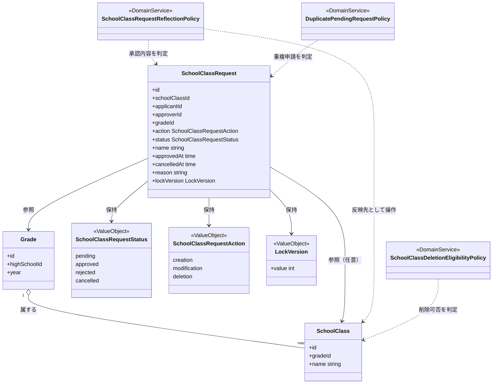
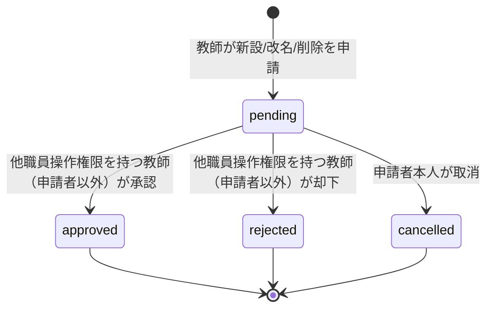
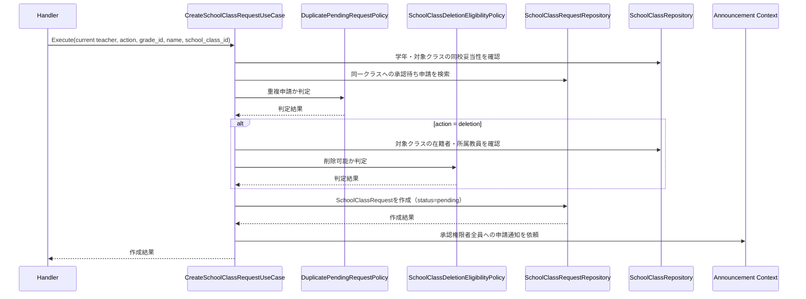
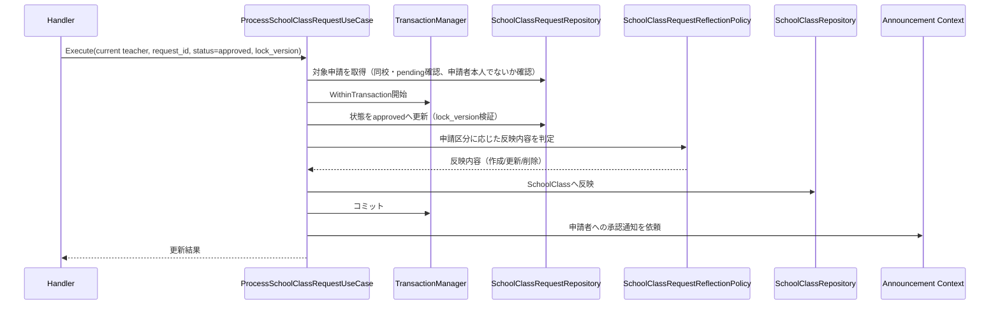
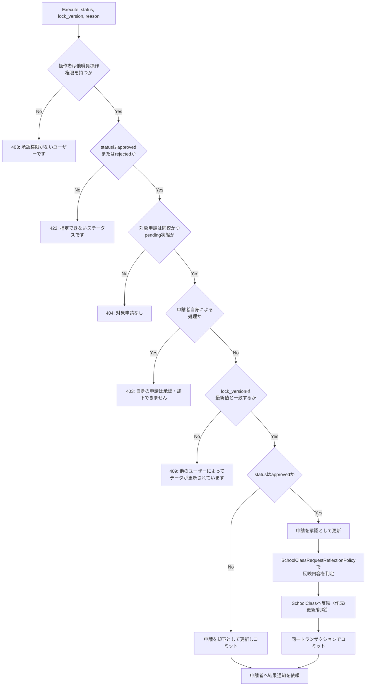

# クラス編成機能 Go移行・設計仕様書

---

# 1. 機能概要

## 機能概要

学校の学年・クラス（組）の構成を管理する機能である。Rails現行仕様では、教師がクラスの新設・改名・削除を「申請」として提出し、他職員操作権限を持つ教師が承認・却下することでクラス構成（`school_classes`）へ反映する、承認ワークフーク型の機能となっている。承認された申請の内容（新設・改名・削除）は、申請レコードの更新と同一の処理単位でクラスデータへ反映される。

## 利用者

- `teacher` ロールのユーザー（教師）
- 参照・申請は同校の教師であれば誰でも行える。申請の承認・却下は、他職員操作権限（`manage_other_teachers`）を持つ教師のみが行える

## 業務上の目的

- クラス編成の変更を、独断ではなく承認プロセスを経て安全に行えるようにする
- 削除申請については在籍者・所属教員がいないことを保証し、データの整合性を保つ
- 承認・却下の結果を申請者へ、新規申請の発生を承認権限者全員へ、それぞれ適時に通知する

---

# 2. 設計方針

- 責務分離: HTTP入出力、入力形式検証、申請の状態遷移ルール、承認時のクラスデータ反映ロジック、永続化、通知連携を分離する
- 保守性: 「pending→approved/rejected/cancelled」という状態遷移ルールと、承認時のクラスデータ反映ロジックをドメイン側に集約し、Controller/Service群に分散している現行ロジックを一箇所に統合する
- テスト容易性: 状態遷移、楽観ロックによる競合検出、承認時の反映ロジックをドメイン層で単体テスト可能な形にする
- API互換性: 既存フロントエンドとの接続を維持するため、エンドポイント・リクエスト構造・レスポンス構造は概ね維持する
- 拡張性: 将来的に申請区分（新設・改名・削除以外）が増えた場合にも対応しやすい構造とする

---

# 3. Bounded Context

## Context名

- school-class

## Contextの責務

- 学年・クラスの参照（学年一覧、学年別クラス一覧、クラス詳細）
- クラス編成申請（新設・改名・削除）の受付・承認・却下・取消
- 承認された申請内容のクラスデータへの反映

## 他Contextとの依存関係

- User Context: 申請者・承認者・生徒の識別情報、教師の所属校情報の参照に依存する
- Teacher Permission Context: 承認・却下操作に必要な「他職員操作権限（`manage_other_teachers`）」の参照に依存する
- Announcement Context（`announcement`）: 申請受付時・承認/却下結果通知時のお知らせ送信に依存する

## 依存する理由

クラス編成申請の承認可否は、操作する教師が「他職員操作権限」を持つかどうかというTeacher Permission Contextの情報を前提として成立する。また、Rails現行仕様書が「いずれも、お知らせの実体作成はお知らせ機能と共通の仕組みを利用する」と明記する他機能（教師面談機能等）と同様、本機能の通知もAnnouncement Contextが提供する仕組みへ委譲することで、通知の実体作成ロジックを重複実装しない。

---

# 4. 設計パターン

## 採用パターン

Domain Model

## 判断根拠

- SchoolClassRequestは「pending→approved/rejected/cancelled」という明示的な状態遷移ルールを持ち、承認・却下は他職員操作権限を持つ教師のみが行え、かつ申請者自身は自分の申請を承認・却下できないという当事者制約を持つ
- 承認時には、申請レコードの状態更新と、申請区分（新設・改名・削除）に応じたクラスデータ（`school_classes`）への反映を「一つの処理としてまとめて行い、途中で失敗した場合は両方とも反映されない」という、複数Entityにまたがる整合性ルールが存在する
- 削除申請は「対象クラスに在籍する生徒・所属する教員がいないこと」という、他Context（在籍・所属情報）を参照する業務ルールを満たさなければ受け付けられない
- 更新系操作（承認・却下）には楽観ロック（`lock_version`）による競合検出が必須である
- 申請区分（新設・改名・削除）ごとに必要な入力項目（クラス名、対象クラスID）の組み合わせルールが異なる

以上のように、状態遷移・当事者制約・複数Entityにまたがる整合性ルール・楽観ロックという複数の業務ルールが密接に関連するため、Domain Modelを採用する。

## 採用しなかったパターン

### Transaction Script

承認時のクラスデータ反映ロジック（新設・改名・削除の3分岐）と状態遷移・楽観ロック・当事者制約が複雑に絡み合っており、手続き型に書くと承認処理の関数が肥大化し、テスト単位が不明瞭になるため不採用とする。

### Active Record

承認時の「申請レコードの更新とクラスデータへの反映を1つの処理としてまとめて行う」という複数Entityにまたがる整合性要件は、単一モデルの属性検証だけでは表現しきれない。承認ロジックをモデルの外に置くと、状態遷移の妥当性を保証する責務が分散するため不採用とする。

### Event Sourcing

現行仕様は「現在の状態」（申請の状態、クラスの現況）を管理すれば業務要件を満たしており、申請・承認履歴の全件再構築要件は明示されていない。将来的に編成履歴の監査要件が生じた場合は検討の余地があるが、現時点では過剰な設計である。

---

# 5. Aggregate設計

## Aggregate Root

- SchoolClass（学年・クラスの参照構造）
- SchoolClassRequest（クラス編成申請の状態管理）

## Aggregateに含めるEntity

- SchoolClass Aggregate: SchoolClass単体（Gradeは外部参照）
- SchoolClassRequest Aggregate: SchoolClassRequest単体（対象SchoolClass・Gradeは外部参照）

## Aggregate境界

- SchoolClassは学年に属するクラスという参照構造そのものであり、申請とは独立したAggregateとして扱う
- SchoolClassRequestは1件の申請とその状態遷移を管理する整合性単位であり、対象クラス・学年はAggregateの外部参照として扱う
- 承認時のみ、SchoolClassRequest Aggregateの状態更新とSchoolClass Aggregateへの反映（作成・更新・削除）を、UseCaseの処理単位で1トランザクションとしてまとめる（Aggregateとしては別だが、1回の業務操作としては整合性を保証する）

## 整合性を保証する単位

- 申請時: 申請区分（新設・改名・削除）に応じた入力項目の整合性と、同一クラスに対する重複申請がないことを1つの単位として保証する
- 承認時: 申請レコードの状態更新（楽観ロック込み）と、クラスデータへの反映（作成・更新・削除）を1つの処理単位として保証する
- 取消時: 申請者自身による、承認待ち状態の申請のみを対象とした状態更新を保証する

理由: SchoolClassとSchoolClassRequestは、通常時は別々に参照・操作される独立したAggregateであるが、承認という1つの業務操作の瞬間だけ両者の整合性を同時に保証する必要がある。この整合性はAggregate境界としてではなく、UseCase単位のトランザクション境界（「14. Transaction設計」参照）で保証する。

---

# 6. Entity設計

## Grade

- 役割: 学校の学年を表す参照用の概念
- ライフサイクル: 本機能内では作成・更新・削除されない（実体はSchool Contextが管理する）
- 状態変化: なし
- 保持する責務: 学年の識別情報・所属校を保持する
- 判断根拠: 学年情報の真正な管理は他Context（School/Grade Context）に属し、本機能では参照専用として扱うため

## SchoolClass

- 役割: 学年内のクラス（組）を表す中心的なドメイン概念
- ライフサイクル: SchoolClassRequestの承認によってのみ作成・更新・削除される。本機能に直接クラスを作成・更新・削除するAPIは存在しない
- 状態変化: 本機能内では明示的な状態を持たないが、SchoolClassRequestの承認内容に応じて作成・名称/学年変更・削除のいずれかが行われる
- 保持する責務: 学年・クラス名を保持する
- 判断根拠: クラス参照・詳細取得の中心的な対象であり、承認された申請の反映先であるため

## SchoolClassRequest

- 役割: クラスの新設・改名・削除の申請とその承認状況を表す中心的なドメイン概念
- ライフサイクル: 申請（pending）→ 承認（approved）/却下（rejected）/取消（cancelled）
- 状態変化:
  - pending → approved
  - pending → rejected
  - pending → cancelled
  - approved / rejected / cancelled は最終状態であり、以降の遷移は許可されない
- 保持する責務:
  - 申請区分（creation/modification/deletion）、対象学年、対象クラス（改名・削除時）、クラス名（新設・改名時）、申請者・承認者・理由・楽観ロック用バージョンを保持する
  - 許可された状態遷移のみを受け付ける
  - 申請区分に応じて必要な入力項目（クラス名・対象クラス）が過不足なく設定されていることを保持する
- 判断根拠: 承認プロセスという業務要件の中心的な概念であり、状態遷移の正しさ・入力項目の整合性を保証する責務が本Entityに強く関連するため

---

# 7. Value Object設計

## SchoolClassRequestStatus

- 採用理由: 状態を文字列のまま扱うと、許可されない遷移（例: approved→pendingへの後退）が実装のあちこちで再チェックされ、抜け漏れが起きやすいため
- 独自ルール: pending/approved/rejected/cancelledのいずれかのみ許容し、pendingからのみ他の状態へ遷移できる
- Entity属性ではなくValue Objectにする理由: 状態遷移という業務ルールそのものを型として表現し、承認・却下・取消の各UseCaseから同じ判定ロジックを再利用できるようにするため

## SchoolClassRequestAction

- 採用理由: 申請区分（creation/modification/deletion）ごとに必要な入力項目の組み合わせが異なり、誤った組み合わせを防ぐ必要があるため
- 独自ルール:
  - `creation`（新設）: クラス名が必須、対象クラスは不要
  - `modification`（改名）: クラス名・対象クラスの両方が必須
  - `deletion`（削除）: 対象クラスが必須、クラス名は不要
- Entity属性ではなくValue Objectにする理由: 申請区分と入力項目の整合性を単体で検証できるようにし、SchoolClassRequest Entityの責務を「保持」に集中させるため

## LockVersion

- 採用理由: 承認・却下操作における楽観ロックによる競合検出は、複数の更新系操作に共通する業務ルールであるため
- 独自ルール: 更新系操作は必ずクライアントから提示されたバージョンを要求し、永続化層の最新バージョンと一致しない場合は競合として扱う
- Entity属性ではなくValue Objectにする理由: バージョン不一致の判定ロジックを型に閉じ込め、他機能（教師面談機能等）とも判定ロジックの考え方を揃えるため

## Value Objectを採用しないもの

- クラス名: 255文字以内という長さの制約はあるが、Presentation層での形式チェックで十分に表現でき、独自の業務ルールを持たないためValue Object化は不要とする

---

# 8. Domain Service

## SchoolClassRequestReflectionPolicy

- 責務: 承認された申請（申請区分＋入力項目）から、実際に行うべきSchoolClassへの操作（作成・更新・削除のいずれか）を決定する
- Entityへ持たせない理由: この判定はSchoolClassRequest（申請内容）とSchoolClass（反映先）の両方の情報を横断して必要とし、いずれか一方の単体の責務に寄せると不自然であるため
- 判断根拠: 承認時の反映ロジックは業務上重要なルールであり、UseCaseに直接書くと再利用性・テスト容易性が下がるため、独立したポリシーとして切り出す

## SchoolClassDeletionEligibilityPolicy

- 責務: 削除申請の対象クラスに、在籍する生徒または所属する教員が1人もいないことを判定する
- Entityへ持たせない理由: 判定にはUser Context（生徒の在籍情報・教員の所属情報）という、SchoolClass単体では保持しない外部情報が必要なため
- 判断根拠: 削除可否の判定は申請時・承認時のいずれにも関わる可能性がある業務ルールであり、独立したポリシーとして一箇所に集約することで判定ロジックの重複を防ぐ

## DuplicatePendingRequestPolicy

- 責務: 同一クラスに対して、承認待ち（pending）の申請が既に存在しないかを判定する
- Entityへ持たせない理由: 判定には対象クラスに対する既存の申請レコード群の参照が必要であり、単一のSchoolClassRequest Entityの責務を超えるため
- 判断根拠: 重複申請の防止は新規申請UseCaseから呼び出される共通ルールであり、独立したポリシーとして切り出すことでテストと再利用を容易にする

---

# 9. クラス図

---

# 10. 状態遷移図

禁止される遷移: pending以外の状態からの遷移（approved/rejected/cancelledから他の状態への変更）はすべて禁止する。

---

# 11. Repository設計

## SchoolClassRepository

- 管理対象: Grade（参照）、SchoolClass
- 責務:
  - 同校の学年一覧・学年別クラス一覧・クラス詳細の取得
  - 承認された申請内容に基づくクラスの作成・更新・削除
- 保持する検索機能: high_school_idによる絞り込み、grade_idによる絞り込み
- 保持しない責務: 申請の状態遷移・承認可否の判定
- 判断根拠: クラスデータの参照・反映に責務を限定し、承認可否の判断はSchoolClassRequest Aggregate/Domain Serviceに残すため

## SchoolClassRequestRepository

- 管理対象: SchoolClassRequest
- 責務:
  - 申請の作成
  - 楽観ロック付きの状態更新（承認・却下・取消）
  - 同一クラスに対する承認待ち申請の存在確認
- 保持する検索機能: high_school_idによる絞り込み、statusによる絞り込み
- 保持しない責務: クラスデータへの反映そのもの（SchoolClassRepositoryの責務）
- 判断根拠: 申請の永続化・検索に責務を限定するため

## 外部参照Repository（Student / Teacher所属）

- 管理対象: User Contextが所有するエンティティ（本Contextからは参照のみ）
- 責務: 削除申請の対象クラスに在籍する生徒・所属する教員が存在しないことの確認
- 判断根拠: 他Contextの所有物への書き込みを行わず、参照のみに責務を限定するため

---

# 12. UseCase設計

## ListGradesUseCase

- 目的: 同校の学年一覧を取得する
- 入力: current teacher
- 出力: 学年一覧
- トランザクション範囲: 読み取りのみ、トランザクション不要
- 呼び出すRepository: SchoolClassRepository
- 判断根拠: 単純な参照処理であるため

## ListSchoolClassesUseCase

- 目的: 同校の学年一覧を、各学年に属するクラス一覧を含めて取得する
- 入力: current teacher
- 出力: 学年＋クラス一覧
- トランザクション範囲: 読み取りのみ
- 呼び出すRepository: SchoolClassRepository
- 判断根拠: 単純な参照処理であるため

## ShowSchoolClassUseCase

- 目的: 指定クラスの詳細を取得する
- 入力: current teacher, school_class_id
- 出力: クラス詳細
- トランザクション範囲: 読み取りのみ
- 呼び出すRepository: SchoolClassRepository
- 判断根拠: 同校のクラスのみを対象とする単純な参照処理であるため

## CreateSchoolClassRequestUseCase

- 目的: 教師がクラスの新設・改名・削除を申請する
- 入力: current teacher, action, grade_id, name（新設・改名時）, school_class_id（改名・削除時）
- 出力: 作成結果
- トランザクション範囲: SchoolClassRequestの作成を1トランザクションで扱う
- 呼び出すRepository: SchoolClassRepository（学年・対象クラスの存在確認、削除時の在籍者確認）、SchoolClassRequestRepository（重複申請確認・作成）
- 判断根拠: SchoolClassRequestAction・SchoolClassDeletionEligibilityPolicy・DuplicatePendingRequestPolicyによる判定を踏まえ、申請を一貫して作成する必要があるため

## ProcessSchoolClassRequestUseCase

- 目的: 他職員操作権限を持つ教師が、クラス編成申請を承認または却下する
- 入力: current teacher, school_class_request_id, status（approved/rejected）, lock_version, reason（任意）
- 出力: 更新結果
- トランザクション範囲: SchoolClassRequestの状態更新と、承認時のSchoolClassへの反映（作成・更新・削除）を1トランザクションで扱う
- 呼び出すRepository: SchoolClassRequestRepository（状態更新）、SchoolClassRepository（承認時のクラスデータ反映）
- 判断根拠: 「他職員操作権限を持つこと」「申請者自身でないこと」「承認待ち状態であること」「lock_versionが一致すること」という複数の前提条件を満たした上で、申請レコードとクラスデータを一貫して更新する必要があるため。承認時のクラスデータ反映はSchoolClassRequestReflectionPolicyの判定結果に従う

## CancelSchoolClassRequestUseCase

- 目的: 申請者自身が、承認待ちの申請を取り消す
- 入力: current teacher, school_class_request_id, reason（任意）
- 出力: 更新結果
- トランザクション範囲: SchoolClassRequestの状態更新を1トランザクションで扱う
- 呼び出すRepository: SchoolClassRequestRepository
- 判断根拠: 取消可否の判定（申請者本人かつ承認待ちであること）はEntityが担い、UseCaseは所有者確認と永続化のみを担当するため

---

# 13. シーケンス図・処理フロー図

## シーケンス図

### CreateSchoolClassRequestUseCase

### ProcessSchoolClassRequestUseCase（承認）

## 処理フロー図

### ProcessSchoolClassRequestUseCase

---

# 14. Transaction設計

## Transaction開始位置

- 書き込みを伴うUseCase（CreateSchoolClassRequestUseCase / ProcessSchoolClassRequestUseCase / CancelSchoolClassRequestUseCase）の開始時にトランザクションを開始する

## Transaction終了位置

- CreateSchoolClassRequestUseCase / CancelSchoolClassRequestUseCaseでは、SchoolClassRequestの作成・更新が完了した時点でコミットする
- ProcessSchoolClassRequestUseCaseでは、SchoolClassRequestの状態更新と（承認の場合の）SchoolClassへの反映の両方が完了した時点でコミットする。アーキテクチャ規約11章のTransactionManagerを用いて、SchoolClassRequestRepositoryとSchoolClassRepositoryにまたがる処理を1トランザクションにまとめる
- 参照系UseCase（ListGradesUseCase / ListSchoolClassesUseCase / ShowSchoolClassUseCase）ではトランザクションを使用しない

## 理由

承認は「申請レコードの更新とクラスデータへの反映のいずれか一方のみが成功する」という不整合を防ぐ必要があるため、複数Repositoryにまたがる処理を1トランザクションで実行する。これはRails現行仕様書が「承認時は、対象クラスデータへの反映と申請レコードの更新を一つの処理としてまとめて行い、途中で失敗した場合は両方とも反映されない」と明記している業務要件そのものである。

---

# 15. Validation設計

## Presentation

- 型チェック: grade_id / school_class_id / lock_versionが整数であることを検証する
- 必須チェック: 申請時のaction / grade_id、承認・却下時のstatus / lock_versionを検証する
- フォーマットチェック: actionが定義済みの値（creation/modification/deletion）であること、クラス名（255文字以内）、reason（10,000文字以内）の形式チェック

## Domain

- 業務ルール: 申請区分に応じた入力項目の整合性（SchoolClassRequestAction）、削除申請の在籍者・所属教員不在チェック（SchoolClassDeletionEligibilityPolicy）、同一クラスへの重複申請チェック（DuplicatePendingRequestPolicy）
- 状態チェック: 状態遷移が許可された組み合わせかどうか（承認・却下はpendingからのみ）、承認・却下時の操作者が申請者本人でないこと
- 整合性チェック: 承認・却下・取消の各操作におけるlock_versionの一致チェック

## バリデーション仕様

|フィールド|検証層|ルール|エラーメッセージ方針|
|-|-|-|-|
|action|Presentation|必須・creation/modification/deletionのいずれか|`errors`（申請区分不正）|
|grade_id|Presentation|必須・整数|`errors`（学年未指定）|
|grade_id の同校妥当性|Domain|操作する教師の所属校の学年であること|`errors`（学年不一致）|
|name（新設・改名時）|Presentation|必須・255文字以内|`errors`（クラス名不正）|
|school_class_id（改名・削除時）|Presentation|必須・整数|`errors`（対象クラス未指定）|
|school_class_id の学年整合性|Domain|指定学年に属するクラスであること|`errors`（学年不一致）|
|削除申請の対象クラス|Domain|在籍する生徒・所属教員がいないこと|`errors`（在籍者ありの削除申請不可）|
|同一クラスへの重複申請|Domain|承認待ちの申請が存在しないこと|`errors`（重複申請不可）|
|status（承認・却下）|Presentation|必須・approved/rejectedのいずれか|「指定できないステータスです」|
|lock_version|Presentation|必須・整数|楽観ロック競合時「他のユーザーによってデータが更新されています。再読み込みしてください」|
|承認・却下の操作者|Domain|他職員操作権限を持ち、申請者本人でないこと|「承認権限がないユーザーです」/「自身の申請は承認・却下できません」|

---

# 16. Authorization設計

## Middleware

- 認証済みユーザーを特定し、`teacher` ロールであることを確認する

## Handler

- ルーティングとHTTP入出力の変換のみを担当し、業務権限判定は持たせない

## UseCase

- 参照系（学年・クラス一覧/詳細）は、current teacherの所属校にスコープする
- 申請の作成は同校の教師であれば誰でも実行できる
- 承認・却下は、current teacherが「他職員操作権限（`manage_other_teachers`）」を保持しているかを確認し、保持していない場合は処理を中断する
- 承認・却下時、申請者自身（applicant_id == current teacher）による処理でないことを確認する
- 取消は、申請者自身（applicant_id == current teacher）による処理のみ許可する

## Domain

- SchoolClassRequest Entityが、pending以外からの状態遷移を拒否する
- SchoolClassDeletionEligibilityPolicyが、在籍者・所属教員が存在するクラスの削除申請を拒否する

## 判断理由

「他職員操作権限」の要否は、ロール（`teacher`であるか）のような粗い認可ではなく、教員個人が持つ業務権限に基づく判定であるため、Middlewareのロールチェックとは別に、UseCase内で確認する（アーキテクチャ規約7章「認可（所有権・業務権限）」の配置方針に従う）。申請者自身による自己承認の禁止も同様に、UseCase内の当事者確認として扱う。

---

# 17. Error設計

## Domain Error

責務: 業務ルール違反を表現する

- 不正な状態遷移（pending以外からの承認・却下・取消試行）
- 申請区分に応じた入力項目の不整合
- 削除申請の対象クラスに在籍者・所属教員が存在する
- 同一クラスへの重複申請

## Application Error

責務: ユースケース実行時の失敗を表現する

- 対象申請が存在しない、承認待ちでない、または同校でない
- 操作者が「他職員操作権限」を持たないまま承認・却下を試みた（Forbidden）
- 申請者自身が自分の申請を承認・却下しようとした（Forbidden）
- 楽観ロック競合（lock_versionの不一致）

## Infrastructure Error

責務: DB接続・永続化・外部Context（Announcement Context）連携時の技術的失敗を表現する

## 判断理由

業務ルール違反（Domain）とリソース未存在・権限欠如・競合（Application）を区別することで、HTTPステータス変換（422 / 403 / 404 / 409）を一貫した基準で行える。「他職員操作権限がない」「自身の申請である」という2つのケースは、いずれも入力値の誤りではなく操作者の資格に起因する失敗であるため、Domain Errorではなくアプリケーション実行可否の失敗（Application Error）として扱い、403に変換する。

## エラー仕様

|業務シナリオ|エラー種別|発生層|想定するHTTPステータス|
|-|-|-|-|
|操作者が他職員操作権限を持たずに承認・却下を試みた|Forbidden|Application|403|
|申請者自身が自分の申請を承認・却下しようとした|Forbidden|Application|403|
|指定できない状態を指定|Validation|Presentation|422|
|申請区分に応じた入力項目が不整合|Validation|Domain|422|
|削除申請の対象クラスに在籍者・所属教員が存在する|Validation|Domain|422|
|同一クラスへの重複申請|Validation|Domain|422|
|承認待ちでない申請の取消|Validation|Domain|422|
|lock_versionが最新値と不一致（楽観ロック競合）|Conflict|Application|409|
|対象の申請が存在しない、または同校でない|NotFound|Application|404|

---

# 18. Domain Event

必要と判断し、採用する。

## イベント名

- SchoolClassRequestSubmitted
- SchoolClassRequestResolved

## 発火タイミング

- SchoolClassRequestSubmitted: CreateSchoolClassRequestUseCaseによって申請がpending状態で作成された直後
- SchoolClassRequestResolved: ProcessSchoolClassRequestUseCaseによって申請がapproved/rejectedのいずれかに更新された直後

## 利用目的

- Announcement Context（お知らせ機能と共通の仕組み）への通知依頼を、同期的な業務処理から切り離すため

## 採用理由

Rails現行仕様書は、申請提出時（同校で他職員操作権限を持つ教師全員への通知）と承認/却下時（申請者への結果通知）のそれぞれについて、非同期ジョブによる通知送信を明記している（「9. 非同期処理」参照）。特に申請提出時の通知は「同校で他職員操作権限を持つ教師全員」という複数の宛先へ波及する処理であり、規約5章の「複数の処理へ波及する非同期通知が必要な場合」というDomain Event採用条件を満たす。

実装上は、アーキテクチャ規約13章（非同期ジョブ実行パターン）の「ベストエフォートで良い処理」に分類する。通知の送達に失敗しても、申請・承認自体の状態は正しく確定しており、対象者はアプリ上で申請一覧・履歴から最新状態を確認できるため、確実な再試行（`jobs`テーブル）までは必須としない（推測: Rails現行仕様書は「非同期ジョブで送信する」としか記載しておらず、リトライ要件の明記はないため）。

---

# 19. API仕様

## エンドポイント一覧

|エンドポイント|HTTP Method|概要|
|-|-|-|
|/api/v1/teacher/grades|GET|同校の学年一覧を取得|
|/api/v1/teacher/school_classes|GET|同校の学年別クラス一覧を取得|
|/api/v1/teacher/school_classes/:id|GET|クラス詳細を取得|
|/api/v1/teacher/school_class_requests|POST|クラス編成（新設・改名・削除）を申請|
|/api/v1/teacher/school_class_requests/:id|PATCH|申請を承認・却下する|
|/api/v1/teacher/school_class_requests/:id|DELETE|申請を取り消す|

## 各エンドポイントの仕様

### GET /api/v1/teacher/grades

- Request: なし
- Response: 学年一覧（id, year, 表示名）
- Status Code: 200
- Error Response: なし（認証前提）

### GET /api/v1/teacher/school_classes

- Request: なし
- Response: 学年一覧（各学年に所属クラス一覧を含む）
- Status Code: 200
- Error Response: なし（認証前提）

### GET /api/v1/teacher/school_classes/:id

- Request: id（route）
- Response: クラス詳細（id, name）
- Status Code: 200 / 404
- Error Response: 既存のerrors形式を踏襲する

### POST /api/v1/teacher/school_class_requests

- Request: action, grade_id, name（新設・改名時）, school_class_id（改名・削除時）
- Response: message（「学級作成申請を受け付けました」相当）
- Status Code: 201 / 422
- Error Response: 既存のerrors形式を踏襲する

### PATCH /api/v1/teacher/school_class_requests/:id

- Request: status（approved/rejected）, lock_version, reason（任意）
- Response: message（「申請が承認されました」または「申請が却下されました」）
- Status Code: 200 / 403 / 404 / 409 / 422
- Error Response: 既存のerrors形式を踏襲する

### DELETE /api/v1/teacher/school_class_requests/:id

- Request: reason（任意）
- Response: message（「申請を取り消しました」相当）
- Status Code: 200 / 404 / 422
- Error Response: 既存のerrors形式を踏襲する

## Railsとの差分

現時点でRails仕様からの変更はない。エンドポイント・リクエスト構造・レスポンス構造・ステータスコードはRails現行仕様を維持する。

---

# 20. DB設計方針

## 現行DBを利用するか

- 既存Rails DBを継続利用する

## Schema変更有無

- 変更なし

## 変更理由

- 現行の `grades` / `school_classes` / `school_class_requests` テーブルは、参照・承認ワークフローという業務要件を満たしており、追加のスキーマ変更は不要である

---

# 21. DB操作仕様

## SchoolClassRepository

- 対象テーブル: `grades`, `school_classes`
- 操作種別: 参照（学年一覧、クラス一覧、クラス詳細）、承認時の作成・更新・削除
- 主な検索条件・絞り込み条件: `high_school_id`, `grade_id` による絞り込み
- 関連テーブルとの結合: 学年別クラス一覧取得時に `grades` と `school_classes` を結合する
- ページネーション・ソート: 不要（学年・クラスとも全件取得が前提）

## SchoolClassRequestRepository

- 対象テーブル: `school_class_requests`
- 操作種別: 作成、参照（同一クラスへの承認待ち申請の存在確認）、楽観ロック付き更新
- 主な検索条件・絞り込み条件: `high_school_id`（Gradeを介した間接的な絞り込み）, `status`, `school_class_id`
- 関連テーブルとの結合: 不要
- ページネーション・ソート: 不要（Rails現行仕様に申請一覧取得APIは存在しない）

---

# 22. テスト戦略

## Domain Test

- 目的: SchoolClassRequestの状態遷移ルール、SchoolClassRequestActionの入力項目整合性、SchoolClassRequestReflectionPolicy・SchoolClassDeletionEligibilityPolicy・DuplicatePendingRequestPolicyの判定ロジックを検証する

## UseCase Test

- 目的: ListGradesUseCase / ListSchoolClassesUseCase / ShowSchoolClassUseCase / CreateSchoolClassRequestUseCase / ProcessSchoolClassRequestUseCase（承認時のクラスデータ反映を含む）/ CancelSchoolClassRequestUseCaseの業務振る舞いを検証する

## Repository Test

- 目的: SchoolClassRepositoryによる参照・反映の正確性、SchoolClassRequestRepositoryによる楽観ロック付き更新の正確性を検証する

## Handler Test

- 目的: API入力のバリデーション結果とHTTPステータス（200/201/403/404/409/422）の変換を検証する

## Integration Test

- 目的: エンドポイント経由での申請・承認・却下・取消が、状態遷移ルールとクラスデータ反映を含めて正しく連携して動作することを確認する

---

# 23. Railsとの責務対応

| Rails | Go | 設計方針 |
|---|---|---|
| Controller（GradesController, SchoolClassesController, SchoolClassRequestsController） | Handler | HTTP入出力のみを担当する |
| Form（Teacher::CreateSchoolClassRequestForm） | Request DTO + Presentation Validation | 入力形式の検証を分離する |
| Service（Teacher::CreateSchoolClassRequestService） | UseCase（CreateSchoolClassRequestUseCase）+ Domain Service | 申請作成の起点として扱い、業務ルール判定はDomain Serviceに集約する |
| Service（Teacher::ProcessSchoolClassRequestService） | UseCase（ProcessSchoolClassRequestUseCase）+ Domain Service（SchoolClassRequestReflectionPolicy） | 承認時のクラスデータ反映ロジックをDomain Serviceとして明確化する |
| Service（Teacher::CancelSchoolClassRequestService） | UseCase（CancelSchoolClassRequestUseCase） | 取消処理の起点として扱う |
| Service/Job（Teacher::CreateSchoolClassRequestNotificationService, Teacher::CreateSchoolClassRequestResultNotificationService, Teacher::CreateSchoolClassRequestNotificationJob） | Domain Event（SchoolClassRequestSubmitted / SchoolClassRequestResolved）購読による非同期実行 | 通知の実体作成をAnnouncement Contextへ委譲し、発火のみを本Contextの責務とする |
| Model（SchoolClassRequest）の状態遷移バリデーション | SchoolClassRequest Entity | 状態遷移ルールをEntityの責務として明確化する |
| Model（Grade, SchoolClass） | Grade（参照）/ SchoolClass Entity + Repository | データ表現と永続化アクセスの責務を分離する |
| Serializer | Presenter / Response DTO | レスポンス整形を分離する |

---

# 24. 採用しなかった設計

## Transaction Script

- 採用しなかった理由: 承認時のクラスデータ反映ロジックと状態遷移・楽観ロックが複雑に絡み合い、手続き型で書くと承認処理の関数が肥大化するため
- 将来的に採用する可能性: 承認ワークフロー自体が撤廃され、教師が直接クラスを編集できる単純なCRUD機能になった場合は検討できる

## Active Record

- 採用しなかった理由: 承認時の「申請レコードとクラスデータの整合的な更新」という複数Entityにまたがる要件を、単一モデルの属性検証だけでは表現しきれないため
- 将来的に採用する可能性: 承認プロセスが撤廃され、単純な自己申告制のクラス編集になった場合は検討の余地がある

## Event Sourcing

- 採用しなかった理由: 申請・承認履歴の全件再構築要件が現行仕様上明示されていないため
- 将来的に採用する可能性: クラス編成の変更履歴に対する監査要件が生じた場合に有効な可能性がある

---

# 25. 設計判断サマリー

|項目|採用|判断理由|
|-|-|-|
|設計パターン|Domain Model|状態遷移・当事者制約・複数Entityにまたがる整合性ルール（承認時の反映）が密接に関連するため|
|Aggregate|SchoolClass / SchoolClassRequest（承認時のみUseCase単位で整合性を橋渡し）|通常時は独立したAggregateだが、承認という業務操作の瞬間のみ両者の整合性を保証する必要があるため|
|Transaction境界|UseCase単位（承認時はTransactionManagerで複数Repositoryを1トランザクション化）|承認時の申請更新とクラスデータ反映を不可分な1操作として扱う必要があるため|
|Domain Service|SchoolClassRequestReflectionPolicy / SchoolClassDeletionEligibilityPolicy / DuplicatePendingRequestPolicy|複数Entity・複数Contextにまたがる判定を分離するため|
|Domain Event|採用（SchoolClassRequestSubmitted / SchoolClassRequestResolved）|複数宛先への非同期通知が必要であり、規約が定めるベストエフォートパターンで実現するため|
|Value Object|採用（SchoolClassRequestStatus / SchoolClassRequestAction / LockVersion）|状態遷移・申請区分ごとの入力整合性・楽観ロックを型として表現するため|
|Authorization|Middleware + UseCase + Domain|ロール確認・業務権限（他職員操作権限）確認・当事者確認・業務ルール判定を層ごとに分離するため|

---

# 設計差分管理

## Rails現行仕様

- Controllerが各アクションで、対象学年・クラスの同校確認、他職員操作権限の確認、楽観ロック検証を個別に実装している
- Service群（Teacher::CreateSchoolClassRequestService, Teacher::ProcessSchoolClassRequestService, Teacher::CancelSchoolClassRequestService等）に、申請の状態遷移ルールと承認時のクラスデータ反映ロジックが分散している
- 通知はJob（Teacher::CreateSchoolClassRequestNotificationJob）による非同期送信で実現されている

## Go設計での変更内容

- 入力形式検証をPresentation層に寄せる
- 状態遷移ルール・楽観ロック検証をSchoolClassRequest Entityの責務として明確化する
- 承認時のクラスデータ反映ロジックをSchoolClassRequestReflectionPolicy（Domain Service）に集約する
- 削除可否・重複申請の判定をそれぞれ独立したDomain Serviceに集約する
- 通知トリガーをDomain Event（SchoolClassRequestSubmitted / SchoolClassRequestResolved）として明示的にモデル化し、実体作成はAnnouncement Contextへ委譲する

## 変更理由

Rails実装ではService層に申請の状態遷移ルールと承認時の反映ロジックが分散しており、ルール変更時の影響範囲が把握しにくい。Go設計では、状態遷移はEntity、反映ロジック・削除可否・重複判定はDomain Service、通知トリガーはDomain Eventに責務を集約することで、業務ルール変更時の修正箇所を明確にし、保守性・テスト容易性を高める。

## 影響範囲

- フロントエンドから見たAPI外部仕様は維持する
- 既存DBスキーマは維持するため、データ移行は不要
- 通知の実体作成ロジックの変更は、本機能・お知らせ機能（Announcement Context）に影響しうる
