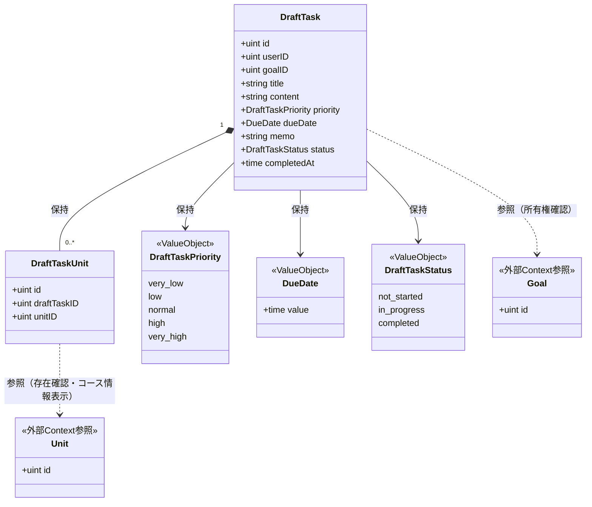
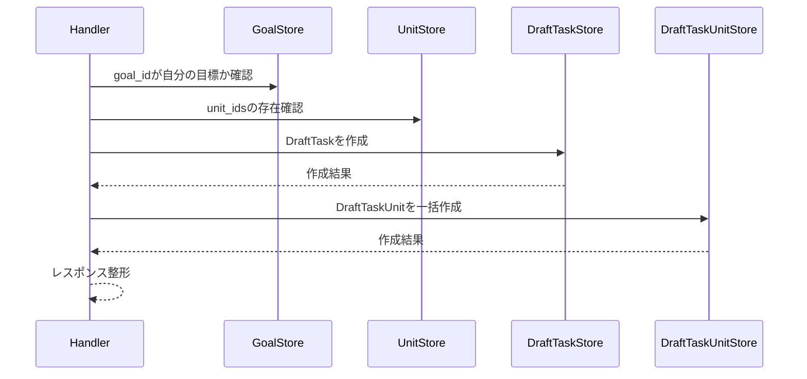

# タスク下書き機能 Go移行・設計仕様書

---

# 1. 機能概要

## 機能概要

生徒が学習タスクを正式に登録する前段階として、内容を下書きの状態で保存できる機能である。Rails現行仕様では、下書きタスクの詳細取得（紐づく単元・コース情報を含む）と新規作成の2操作を提供する。ルーティング上は一覧取得・更新・削除を含む`resources :draft_tasks`が定義されているが、現時点で実装されているアクションは詳細取得・新規作成のみであり、本書もこの2操作を設計対象とする。

## 利用者

- 生徒ユーザー（student ロール）
- 自分が作成した下書きタスクのみ操作可能

## 業務上の目的

- 生徒が学習タスクの内容を、正式登録前に一時保存できるようにする
- 下書き段階でも、紐づける目標・単元との関連を確認できるようにする

---

# 2. 設計方針

本機能は、現時点では詳細取得・新規作成というCRUDの一部のみを提供する機能であるため、過剰な抽象化を避け、将来の一覧取得・更新・削除の追加を見据えつつも現状の業務範囲に忠実な設計とする。

- 責務分離: HTTP・入力検証・所有権チェック・単元関連付け・永続化を分離する
- 保守性: 下書きタスクの基本情報と単元関連付けの同期をEntity/Storeに集約し、変更に強い構造とする
- テスト容易性: 作成・詳細取得の振る舞いを独立して検証できるようにする
- 拡張性: ルーティング上定義されている一覧取得・更新・削除が将来実装される場合に備え、責務分離の構造自体はタスク管理機能・目標管理機能と同様の形にしておく
- API互換性: 既存エンドポイントと主要なリクエスト・レスポンス構造を維持する

---

# 3. Bounded Context

## Context名

- draft-task

## Contextの責務

- 下書きタスクの新規作成
- 下書きタスクの詳細参照（紐づく単元・コース情報を含む）
- 下書きタスクと単元の関連付け管理

## 他Contextとの依存関係

- Goal Context: 下書きタスク作成時に、紐づける目標が生徒自身の目標であることの確認に依存する
- Unit Context（curriculum）: 下書きタスク作成時に指定する単元の存在確認、および詳細取得時のコース情報表示に依存する
- User Context: 認証済み生徒の識別と所有権の確認に依存する

## 依存する理由

下書きタスクは、目標に紐づく形で作成される（Rails現行仕様書6章`belongs_to :goal`）。また、下書きタスクの詳細表示では、紐づく単元とそのコース情報を含めて返却する業務要件がある（Rails現行仕様書5章のResponse定義）。そのため、作成時にはGoal Context・Unit Contextへの存在確認依存が、詳細取得時にはUnit Contextへの参照依存が発生する。ただし、下書きタスク自体の作成・参照が目標やコースの状態を変更することはなく、依存は「存在確認・参照のための依存」に限定される。

なお、目標管理機能（goal-management Context）の②文書では、目標に下書きタスクが紐づき得る旨（Rails現行仕様書`has_many :draft_tasks`）を参照関係として記載しており、本Contextと目標管理機能は互いに整合した形で依存関係を記載している。

---

# 4. 設計パターン

## 採用パターン

Active Record

## 判断根拠

本機能の主要操作は、下書きタスクの作成と詳細取得というCRUDの一部であり、業務ルールは「必須項目の検証」「紐づける目標が自分のものであること」「期限日が日付として解釈できること」「関連付ける単元IDが実在すること」という、いずれもバリデーションに近い水準にとどまる。Rails現行仕様書7章に明記されているとおり、`status`属性は存在するものの、下書きタスクの作成処理自体はこの値を明示的に更新せず、初期値のまま保存される。つまり本機能のスコープ内には状態遷移ロジックが存在しない。

- 主要操作が作成・参照というCRUD中心の業務である
- 単元との関連付け（`draft_task_units`）は、作成時にまとめて登録するデータの整合性を保つ範囲にとどまり、複雑な業務ルールを伴わない
- 状態属性（`status`）はあるが、本機能のスコープ内で遷移ロジックを持たない

このため、目標管理機能（goal-management）と同様に、状態を持つEntityであっても直ちにDomain Modelを選択すべきではない典型例であり、「Domain Model採用基準」（状態遷移ルールが存在する場合に採用する）を満たさない。したがって、単純な手続き型のTransaction Scriptよりも、下書きタスクの保存・関連付けの責務をEntity/Storeに寄せやすいActive Recordを採用する。

## 採用しなかったパターン

### Transaction Script

作成時の目標所有権チェック・期限日検証・単元存在確認をユースケースに直接書き続けることもできるが、下書きタスクと単元関連付けの同期処理をEntity/Storeに寄せた方が、タスク管理機能（task-management）と一貫した設計にでき、将来一覧取得・更新・削除が実装された際の再利用性も高い。

### Domain Model

`status`属性は保持されるが、現行業務仕様には本機能スコープ内での遷移ルール・遷移条件が存在しない（Rails現行仕様書7章）。DDDを目的化してEntityに振る舞いを持たせることは「Domain Model採用基準」に反するため見送る。ただし、将来的に下書きから正式タスクへの変換操作が実装され、その過程で`status`の意味のある遷移が発生する場合は、Domain Model化を再検討する対象とする（推測を含む将来拡張の想定）。

### Event Sourcing

下書き保存の変更履歴の再構築・監査要件は現行仕様に存在しない。

---

# 5. Aggregate設計

Aggregateを大きく分ける必要はなく、DraftTaskを中心に扱う。

## Aggregate Root

- DraftTask

## Aggregateに含めるEntity

- DraftTask
- DraftTaskUnit（関連情報として扱う）

## Aggregate境界

- DraftTaskが自身の基本情報（目標・タイトル・内容・優先度・期限日・メモ）と、関連付けた単元（DraftTaskUnit）の整合性を保証する単位とする
- 目標・単元そのものはAggregateの外部の参照情報として扱い、DraftTaskの整合性を保つための制約条件として利用する
- `draft_task_courses`（コースとの関連付けテーブル）は、Rails現行仕様書6章に「現行実装の下書き作成処理ではコースの関連付けは行われておらず、テーブル自体はモデル上の関連として定義されている」と明記されており、現時点の業務スコープでは使用されないため、本Aggregateには含めない

## 整合性を保証する単位

- 下書きタスク作成時に、DraftTaskとDraftTaskUnitの同期を一貫して実行する

理由: 作成時に指定された単元をこの下書きタスクに関連付けるという業務要件（Rails現行仕様書3章）があり、DraftTask本体と関連単元の整合性を1つの処理単位で保証する必要があるため。

---

# 6. Entity設計

## DraftTask

- 役割: 生徒の学習タスクの下書き内容を表す中心的なドメイン概念
- ライフサイクル: 作成 → 参照（本機能のスコープ内では更新・削除は扱わない）
- 状態変化: `status`（not_started / in_progress / completed）を保持するが、本機能のAPI内では遷移ロジックを持たず、作成時の初期値として保持されるのみ（現行Rails仕様に準拠した設計判断）
- 保持する責務:
  - 目標ID・タイトル・内容・優先度・期限日・メモ等の基本情報を保持する
  - 必須項目（goal_id, title, content, priority, due_date）の整合性を維持する
  - 所有者（user_id）を保持する
- 判断根拠: 下書きタスクの主要な業務データであり、作成・参照の中心対象であるため

## DraftTaskUnit

- 役割: 下書きタスクと単元の関連付けを表す概念
- ライフサイクル: 作成のみ（本機能のスコープ内では更新・削除は扱わない）
- 状態変化: 追加のみ
- 保持する責務:
  - どの下書きタスクにどの単元が紐づいているかを保持する
- 判断根拠: 単元紐付けは単なる外部キーの羅列ではなく、詳細取得時にコース情報とあわせて返却される、業務上意味のある関連情報であるため

## Goal / Unit（参照専用）

- 役割: 参照対象として利用する外部概念。Goalは作成時の所有権確認対象、Unitは作成時の存在確認対象・詳細取得時のコース情報表示対象
- 判断根拠: 本機能の中心はDraftTaskそのものであり、Goal・Unitの実体管理はそれぞれ別Contextの責務であるため、本機能では参照専用として扱う

---

# 7. Value Object設計

## DraftTaskPriority

- 採用理由: 優先度は`very_low` / `low` / `normal` / `high` / `very_high`という許容値が定まった属性であり、無効な値の混入を防ぐ必要があるため
- 独自ルール: 上記5値のいずれかのみ許容する
- Entity属性ではなくValue Objectにする理由: 許容値の妥当性検証を一元管理し、タスク管理機能のPriorityと同様に、優先度という概念を型として明示するため

## DueDate

- 採用理由: Rails現行仕様では期限日を`YYYY/MM/DD`形式で表示しており、表示・保存・妥当性検証の扱いを一元化する必要があるため
- 独自ルール: 「日付として解釈できる値であること」という検証ルールを持ち、保存値と表示用フォーマットを分離する
- Entity属性ではなくValue Objectにする理由: 期限日の意味が業務上重要であり、フォーマット変換・妥当性検証ロジックを分離して再利用しやすくするため

## DraftTaskStatus

- 採用理由: 状態値を文字列のまま扱うと無効な値が混入する余地があるため、許容値を型として明示する
- 独自ルール: not_started / in_progress / completedのいずれかのみ許容する。ただし現行仕様どおり、本機能では遷移ルールは持たせない（許容値の集合と初期値の表現のみ）
- Entity属性ではなくValue Objectにする理由: 許容値の妥当性検証をEntity内に散在させず一元化するため。将来、下書きから正式タスクへの変換等で遷移ルールが追加された場合の受け皿としても位置づける

## Value Objectを採用しないもの

- タイトル・内容・メモ: 単純な文字列表現であり、追加の業務ルールを持たないため、Value Object化は不要とする

---

# 8. Domain Service

不要と判断する。

理由: 現状、複数Entityを横断する業務ルール（下書きから正式タスクへの変換判定等）は本機能のスコープに存在しない。将来的にそのような変換機能が実装された場合は、DraftTaskPromotionPolicyのようなDomain Serviceの新設を検討する余地がある（推測を含む将来拡張の想定）。

---

# 9. クラス図

Active Record採用のため実装時はDraftTask/DraftTaskUnitが同一packageのstructとメソッドに統合されるが（4章参照）、業務概念としての関係は以下のとおり整理する。

Goal・Unitは他Context（goal-management Context、Unit/curriculum Context）が所有するデータであり、参照のみ行うため外部参照として示している。Goのstruct定義（フィールドの可視性・タグ等）は③Go実装仕様書で扱う。

---

# 10. 状態遷移図

省略する。

理由: Rails現行仕様書7章に「下書きタスクの作成処理自体はこの値（status）を明示的に更新しておらず、初期値のまま保存される。下書き段階での状態変更操作は、現行実装のこの機能内には存在しない」と明記されており、本機能のスコープ内でDraftTaskStatusが遷移することはない。状態は作成時の初期値を保持するのみであるため、状態遷移図として可視化すべき遷移が存在しない。将来的に下書きから正式タスクへの変換操作等が実装され、状態変更ロジックが追加された場合は、あらためて状態遷移図を作成する。

---

# 11. Repository設計

**実装上の位置づけ**: 本機能はActive Record採用のため、Repository Interfaceをdomain層に定義しない。以下は永続化・検索責務の設計意図であり、実装時はEntity相当のstructと同一packageに置くStore(例: `〇〇Store`)として直接実装する(規約: アーキテクチャ規約.md「3. 設計パターンごとの構造適用方針」)。

## DraftTaskStore

- 管理対象: DraftTask
- 責務:
  - 生徒の下書きタスクの作成
  - 指定下書きタスクの取得（紐づく単元・コース情報を含む）
- 保持する検索機能:
  - user_id + idによる単一取得（所有権確認を兼ねる）
  - 詳細取得時の単元・コース情報の結合取得
- 保持しない責務:
  - 一覧取得・更新・削除（現行実装で未提供のため、本書のスコープ外とする）
  - 業務ルール判定（所有権・期限日妥当性等はDraftTask/UseCase側で扱う）
- 判断根拠: 永続化と検索に特化させ、業務ロジックを持たせないため

## DraftTaskUnitStore

- 管理対象: DraftTaskUnit
- 責務:
  - 下書きタスク作成時の単元関連付けの一括作成
  - 下書きタスクに紐づく単元一覧取得（詳細取得時）
- 保持する検索機能:
  - draft_task_idによる関連単元取得
- 保持しない責務:
  - 関連付けの更新・削除（現行実装に存在しないため）
- 判断根拠: 関連関係の同期処理を担当させるため

## GoalStore（参照用）

- 管理対象: Goal（本Contextでは読み取り専用）
- 責務: 指定goal_idが現在の生徒に属するか確認する
- 保持しない責務: 下書きタスクの作成可否判断そのもの
- 判断根拠: 目標の存在・所有権確認に必要な参照に限定するため

## UnitStore（参照用）

- 管理対象: Unit（本Contextでは読み取り専用）
- 責務: 指定単元の存在確認、詳細取得時のコース情報取得
- 保持しない責務: 単元の作成・更新（Unit Contextの責務）
- 判断根拠: 対象確認・表示に必要な参照に限定するため

---

# 12. UseCase設計

**実装上の位置づけ**: 本機能はActive Record採用のため、UseCase層(struct)を設けない。以下はHandlerが行う業務操作の設計意図であり、実装時はHandlerがStoreを直接呼び出す処理として実装する。

## ShowDraftTask(Handler処理)

- 目的: 指定下書きタスクの詳細を、紐づく単元・コース情報とあわせて取得する
- 入力: current user, draft_task id
- 出力: 下書きタスク詳細情報と紐づく単元一覧（コース情報を含む）
- トランザクション範囲: 読み取りのみ、トランザクション不要
- 呼び出すStore: DraftTaskStore, DraftTaskUnitStore
- 判断根拠: 単元・コース情報を含めた詳細表示に必要な関連情報をまとめて取得するため

## CreateDraftTask(Handler処理)

- 目的: 新しい下書きタスクを作成する
- 入力: current user, 下書きタスク作成リクエスト（goal_id, title, content, priority, due_date, memo, unit_ids）
- 出力: 作成結果（id）
- トランザクション範囲: DraftTask作成とDraftTaskUnit一括作成を1トランザクションで扱う
- 呼び出すStore: GoalStore, UnitStore, DraftTaskStore, DraftTaskUnitStore
- 判断根拠: 作成時にはDraftTask本体と関連単元の整合性を同時に保証する必要があるため（タスク管理機能のCreateTaskと同様のパターン）

---

# 13. シーケンス図・処理フロー図

## シーケンス図（CreateDraftTask）

Active Record採用のためUseCase層はなく、Handlerが各Storeを直接呼び出す（4章参照）。

## 処理フロー図（CreateDraftTask）

検証項目が複数あるが、いずれも直列的な存在確認であり、タスク管理機能のUpdateTaskのような削除可否判定を伴う複雑な分岐は存在しない。そのため、フローチャートは省略し、シーケンス図の説明で十分に表現できると判断する。

---

# 14. Transaction設計

## Transaction開始位置

- Handlerの処理単位に対応するStoreメソッド内でトランザクションを開始する

## Transaction終了位置

- CreateDraftTaskの処理では、DraftTaskと関連単元（DraftTaskUnit）の作成が完了した時点でコミットする
- ShowDraftTaskの処理ではトランザクションを使用しない

## 理由

- 1つの作成操作に対して、下書きタスクと関連単元の整合性を保つため
- Handlerの処理単位で境界を明確にし、テスト・保守のしやすさを確保するため

---

# 15. Validation設計

## Presentation

- 型チェック: HTTP入力の型を検証する
- 必須チェック: goal_id / title / content / priority / due_dateの必須項目を検証する
- フォーマットチェック: unit_idsの配列形式を検証する

## Domain

- 業務ルール: 指定されたgoal_idが自分の目標かどうか
- 状態チェック: 特になし（本機能のスコープ内で状態遷移を扱わないため）
- 整合性チェック: due_dateが日付として解釈できる値であること、unit_idsがすべて実在する単元のIDであること

## 責務分離

- Presentationは「入力が正しいか」を担当する
- Domainは「業務的に妥当か（所有権・関連データの実在性）」を担当する

## バリデーション仕様

|フィールド|検証層|ルール|エラーメッセージ方針|
|-|-|-|-|
|goal_id / title / content / priority / due_date|Presentation|必須・型チェック|「必須項目が未入力です」|
|unit_ids|Presentation|配列形式（任意項目）|「単元の指定が不正です」|
|goal_id|Domain|current userの目標であること|「指定された目標にアクセスできません」|
|due_date|Domain|日付として解釈できる値であること|「期限日の形式が不正です」|
|unit_ids|Domain|すべて実在する単元のIDであること|「指定された単元が見つかりません」|

---

# 16. Authorization設計

## Middleware

- 認証済みユーザーを特定し、ユーザー情報をコンテキストに保持する
- 役割がstudentであることを確認する

## Handler

- ルーティング層でAPIの入口を担当し、認証失敗時のHTTP応答を整える
- 具体的な業務権限判定は持たせない

## UseCase

- current userのスコープに基づいて、自分の下書きタスクのみ取得できるようにする
- 作成時に指定する目標が自分の目標かどうかをHandler/Store側で判断する

## Domain

- DraftTask Entityが所有者（user_id）を保持し、Handler側からの所有権確認の材料を提供する

## 判断理由

Rails現行仕様も「`current_user`本人の下書きタスク」「`current_user`本人の目標」を起点に検索・検証を行うシンプルな設計であり、これをHandlerでのスコープ限定としてそのまま踏襲するのが自然である。

---

# 17. Error設計

## Domain Error

- 責務: ドメインルール違反を表現する
- 例: 不正なdue_date、所有者外の目標参照、実在しない単元IDの指定
- 判断理由: 業務ルール違反をアプリケーション層に漏らさず、ドメイン側で明示的に扱うため

## Application Error

- 責務: ユースケース実行時の失敗を表現する
- 例: 対象下書きタスクが存在しない、または他ユーザーのものである場合の404相当のエラー、バリデーション失敗の422相当のエラー
- 判断理由: ユースケースの失敗理由をHTTPレスポンスに変換しやすくするため

## Infrastructure Error

- 責務: DB接続失敗・永続化失敗を表現する
- 判断理由: 永続化層の失敗をドメインに漏らさず、技術的な障害として切り分けるため

## エラー仕様

|業務シナリオ|エラー種別|発生層|想定するHTTPステータス|
|-|-|-|-|
|対象下書きタスクが存在しない、または自分のものでない|NotFound|Application|404|
|必須項目の不足|Validation|Presentation|422|
|指定goal_idが自分の目標でない|Validation|Domain|422|
|due_dateが日付として不正|Validation|Domain|422|
|unit_idsに実在しない単元が含まれる|Validation|Domain|422|

---

# 18. Domain Event

本機能では現時点でDomain Eventを採用しない。理由は、Rails現行仕様書9章に「下書きタスクの取得・作成に紐づくJob/Mailerは見当たらない」と明記されており、他処理への通知のような非同期の副作用が存在しないためである。

将来的に、下書きから正式タスクへの変換完了を契機に通知を送る要件が生まれた場合は、イベント化を検討する。

---

# 19. API仕様

## エンドポイント一覧

|エンドポイント|HTTP Method|概要|
|-|-|-|
|/api/v1/student/draft_tasks/:id|GET|下書きタスク詳細取得|
|/api/v1/student/draft_tasks|POST|下書きタスク新規作成|

## 各エンドポイントの仕様

- 下書きタスク詳細取得: パスパラメータ`id`。レスポンスは下書きタスク詳細（id, user_id, goal_id, title, content, due_date, priority, status, completed_at）と紐づく単元一覧（各単元のコース情報を含む）
- 下書きタスク新規作成: ボディに`goal_id`/`title`/`content`/`priority`/`due_date`/`memo`（任意）/`unit_ids`（任意）。レスポンスは作成結果（id）

Status Code:

- 200: 取得成功
- 201/200: 作成成功の扱いは既存仕様に合わせて統一する
- 422: 入力・業務ルール違反
- 404: 対象下書きタスク不存在

Error Response方針: 既存のerrors形式をそのまま踏襲し、フロントエンド互換性を優先する。

## Railsとの差分

- Rails仕様: ルーティング上は`resources :draft_tasks`として一覧取得・更新・削除を含むエンドポイントが定義されているが、現時点で実装されているのは詳細取得・新規作成の2操作のみである（Rails現行仕様書4章の補足）
- Go設計での変更: 現行の実装範囲（詳細取得・新規作成）のみを設計対象とし、URL・HTTP Method・意味は維持する。一覧取得・更新・削除については本書では設計しない
- 変更理由: 実装されていない業務仕様を推測で設計することを避けるため。未実装機能を設計する必要が生じた場合は、あらためて要件を確認したうえで本書を拡張する
- 影響範囲: 一覧取得・更新・削除が将来実装される場合、本書の「11. Repository設計」「12. UseCase設計」に該当操作を追加する必要がある

JSONスキーマの厳密な型定義・Goの構造体は③Go実装仕様書で扱う。

---

# 20. DB設計方針

## 現行DBを利用するか

- 既存Rails DBを継続利用する

## Schema変更有無

- 変更なし

## 変更理由

- 現行の`draft_tasks`・`draft_task_units`テーブルで本機能（詳細取得・新規作成）の要件を満たしているため
- `draft_task_courses`テーブルは現行実装で未使用だが、モデル上の関連として維持されているため、スキーマとしてはそのまま残す

## 変更を提案しない理由

- 今回の移行対象はRails現行仕様に実装されている範囲（詳細取得・新規作成）に限定されており、構造的な問題は現行仕様書から確認できないため

---

# 21. DB操作仕様

|Store|対象テーブル|操作種別|主な検索条件|関連テーブルとの結合|ページネーション/ソート|
|-|-|-|-|-|-|
|DraftTaskStore|draft_tasks|参照・作成|user_id, id|なし|不要（単一下書きタスク単位）|
|DraftTaskUnitStore|draft_task_units|参照・作成|draft_task_id|なし|不要|
|GoalStore|goals|参照|goal_id, user_id|なし|不要|
|UnitStore|units|参照|unit_id|コース（courses）との結合が必要（詳細取得時のコース情報表示のため）|不要|

具体的なSQL・GORMのクエリコードは③Go実装仕様書（`規約/Gorm規約.md`）で扱う。

---

# 22. テスト戦略

## Domain Test

- 目的: DraftTaskPriority / DueDate / DraftTaskStatusの許容値・妥当性検証ロジックを検証する

## UseCase Test

- 目的: ShowDraftTask / CreateDraftTaskの業務振る舞いと所有権チェックを検証する

## Repository Test

- 目的: DraftTaskStore / DraftTaskUnitStoreによる作成・検索（単元・コース情報の結合取得を含む）の正確性を検証する

## Handler Test

- 目的: API入力のバリデーション結果とHTTPステータスの変換を検証する

## Integration Test

- 目的: エンドポイント経由で詳細取得・作成が正常に動作し、他ユーザーの下書きタスクにアクセスできないことを確認する

---

# 23. Railsとの責務対応

| Rails | Go | 設計方針 |
|---|---|---|
| Controller | Handler | HTTP入力の受け取りとレスポンス整形に限定する |
| Form（`Student::CreateDraftTaskForm`） | Request DTO + Validation | 入力検証をPresentation層で分離する |
| Service（`Student::CreateDraftTaskService`） | Handler + Store | 業務処理を担当（Active Record採用のためusecase層は設けない） |
| Model（`DraftTask`, `DraftTaskUnit`） | struct + Store（同一package） | 業務ルールはstructのメソッド、永続化・関連付けはStoreの責務として整理する |
| Serializer（`DraftTaskSerializer`） | Presenter / Response DTO | 画面に返すレスポンス整形を分離する |

---

# 24. 採用しなかった設計

## Domain Model

- 採用しなかった理由: statusという状態属性は存在するが、現行仕様には本機能スコープ内での遷移ルール・遷移条件が一切存在せず、Domain Model採用基準を満たさないため
- 将来的に採用する可能性: 下書きから正式タスクへの変換機能が実装され、その過程でstatusの意味のある遷移が発生する場合は再検討する

## Transaction Script

- 採用しなかった理由: 単元関連付けの同期処理をEntity/Storeに寄せた方が、タスク管理機能と一貫した設計にでき、将来の機能拡張時の再利用性も高いため
- 将来的に採用する可能性: 機能が極めて単純化された場合には再検討できる

## Event Sourcing

- 採用しなかった理由: 下書き保存の変更履歴の再構築・監査要件が現行仕様に存在しないため
- 将来的に採用する可能性: 下書きの変更履歴を監査する要件が生じた場合に有効な可能性がある

---

# 25. 設計判断サマリー

| 項目 | 採用 | 判断理由 |
|-|-|-|
| 設計パターン | Active Record | CRUD中心の業務であり、statusに本機能スコープ内の遷移ルールが存在しないため |
| Aggregate | DraftTask（DraftTaskUnitを含む） | 作成時に単元関連付けとの整合性を保証する必要があるため |
| Transaction境界 | Handlerの処理単位（Storeメソッド内） | 1業務処理と整合性保証の単位として自然なため |
| Domain Event | 未採用 | 現行仕様に非同期の副作用が存在しないため |
| Value Object | DraftTaskPriority / DueDate / DraftTaskStatusを採用 | 優先度・期限日・状態の許容値と意味を明示するため |
| Authorization | Handler/Store + Middleware | 認証と業務スコープを分離して管理しやすくするため |
| 設計対象範囲 | 詳細取得・新規作成の2操作のみ | ルーティング上定義されているが未実装の一覧取得・更新・削除は、実装されていない業務仕様を推測しないため対象外とする |

---

# 設計差分管理

## Rails現行仕様

- `Student::CreateDraftTaskForm`と`Student::CreateDraftTaskService`がControllerから呼ばれ、入力検証・保存処理を担っている
- `resources :draft_tasks`としてルーティングは一覧・更新・削除を含めて定義されているが、実装されているのは詳細取得・新規作成のみである

## Go設計での変更内容

- 入力検証をPresentation層に集約する
- 所有権チェック・関連データの実在性チェックをDomain/UseCase（Active Record採用のためHandler/Store）に集約する
- 未実装の一覧取得・更新・削除は設計対象に含めず、実装済みの範囲に限定して設計する

## 変更理由

- Railsの実装構造をそのままGoに写すと責務が曖昧になりやすいため、Goでは責務を明確に分けた方がテストと保守性に優れる
- 未実装の機能を推測で設計すると、実際の業務要件と乖離した設計になるリスクがあるため、現時点の実装範囲に忠実に設計する

## 影響範囲

- フロントエンドから見たAPIの外部仕様（詳細取得・新規作成の2エンドポイント）は変更しない
- 既存DBスキーマは維持するため、データ移行やマイグレーションの追加は不要
- 将来的に一覧取得・更新・削除が実装される場合は、本書の該当セクション（Repository設計・UseCase設計等）の追加が必要になる点を影響範囲として明記する
