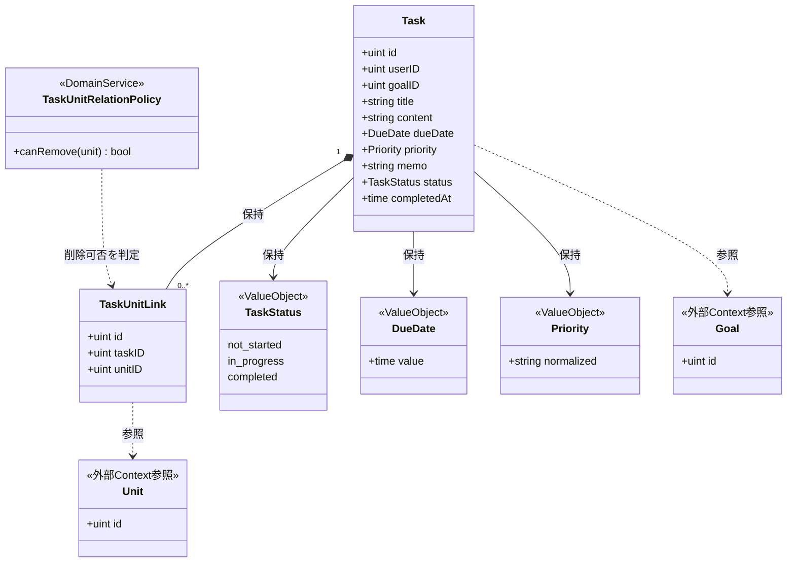
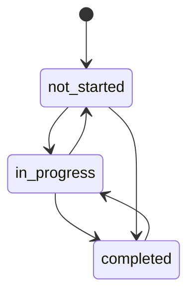
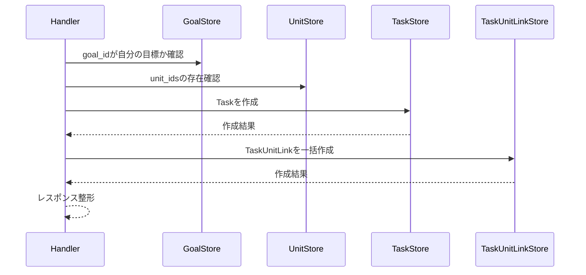
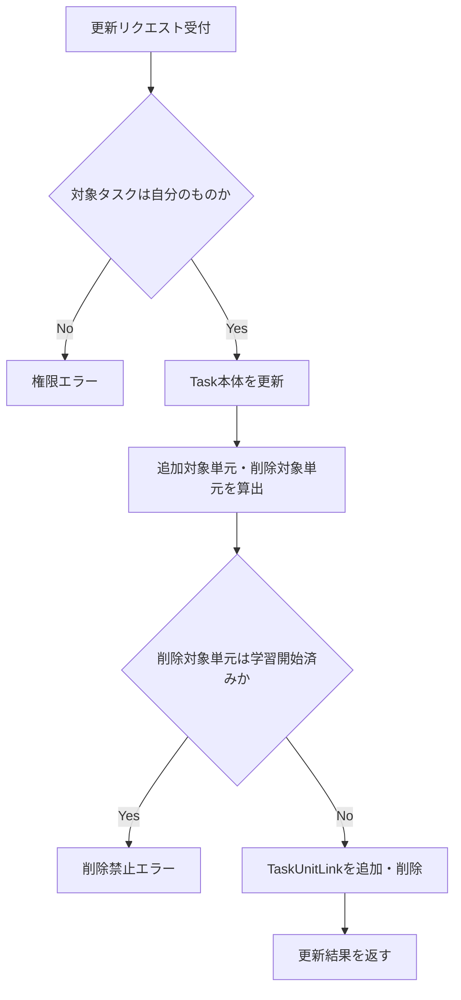

# タスク管理機能 Go移行・設計仕様書

---

# 1. 機能概要

## 機能概要

生徒が自分の学習タスクを登録・参照・更新できる機能である。Rails現行仕様では、一覧・詳細・作成・更新の4操作を提供しており、タスクに紐づく目標・単元情報を含めて扱う。

## 利用者

- 学生ユーザー（student ロール）
- 自分が作成したタスクのみ操作可能

## 業務上の目的

- 学習計画をタスクとして可視化し、期限と優先度を管理する
- 単元と目標に紐づく学習行動を一元管理する
- 生徒自身が自身のタスク状態を確認・更新できるようにする

---

# 2. 設計方針

本機能は、Rails実装の構造をそのまま置き換えるのではなく、業務上の責務を明確に分離したGo設計とする。

主な設計思想は以下のとおりである。

- 責務分離: HTTP・入力検証・認可・業務ルール・永続化を分離する
- 保守性: タスク状態や単元紐付けルールをドメイン側に集約し、変更に強い構造とする
- テスト容易性: ユースケース単位で振る舞いを検証できるようにする
- 拡張性: 目標や単元の関係が増えても、タスクのコアロジックを壊しにくい構造にする
- API互換性: 既存フロントエンドとの整合を保つため、エンドポイントと主要なリクエスト・レスポンス構造は概ね維持する

---

# 3. Bounded Context

## Context名

- task-management

## Contextの責務

- 生徒のタスクの作成・参照・更新
- タスクの状態管理
- タスクと単元の関連関係管理
- タスクに対する所有者スコープの管理

## 他Contextとの依存関係

- Goal Context: タスクが紐づく目標の存在確認と所有者確認に依存する
- Unit Context: タスクに紐づける単元の存在確認と、学習開始済み単元に対する制約判定に依存する
- User Context: 認証済み生徒の識別と所有権の確認に依存する

## 依存する理由

本機能は、タスク単体だけで完結するのではなく、目標・単元・ユーザーの存在と所有権を前提として動作するためである。これらを別Contextとして扱い、タスクContextでは「自分のタスクに関するルール」を中心に設計する。

---

# 4. 設計パターン

## 採用パターン

Active Record

## 判断根拠

本機能は、タスクの作成・一覧・詳細・更新というCRUD中心の業務であり、業務領域としては「補完CRUDが中心」に近い。状態遷移は「未着手・進行中・完了」の3段階に限定されるものの、主たる価値はタスクの登録・参照・更新と関連単元の同期にあり、複雑なドメイン振る舞いよりもデータの永続化・関連付け・更新の扱いが中心である。

このため、業務領域の分類に基づけば、単純な手続き処理よりも、Entity／モデルに対する保存・更新・関連付けの責務を寄せるActive Record寄りの構造が自然である。特に以下の理由がある。

- 主要操作がCRUD中心で、作成・取得・更新の流れが明確である
- タスクと単元との関連付けは、データの整合性を保つために集約しやすい
- Handlerが直接Storeを呼び出し、認可・入力検証はHandler／Store側で行うことで、データアクセスの振る舞いを一元化しやすい

したがって、過剰なDomain Modelや、手続き型に寄りすぎるTransaction Scriptではなく、Active Recordを採用する。

## 採用しなかったパターン

### Transaction Script

- 手続き型に寄りすぎるため、タスクの作成・更新・関連単元同期の挙動がユースケースに偏りやすい
- データの保存・更新・関連付けの責務が分散し、再利用性が低下しやすい
- CRUD中心の業務に対して、Active Recordほど自然に責務を集約しにくい

### Domain Model

- 状態遷移ルールは存在するが、現時点では複雑なビジネスルールが多いわけではない
- Entityに振る舞いを集約するメリットが限定的で、設計コストに対して恩恵が小さい
- 将来的にルールが増えた場合でも、まずは手続き型で十分に保守しやすい

### Event Sourcing

- 本機能ではイベント連携や多段の状態追跡が必要ない
- 現状の業務要件では過剰な設計である
- 監査性や再構築性の要件がないため、採用の妥当性が低い

---

# 5. Aggregate設計

本機能では、Aggregateを明示的に分ける必要はない。Task単体を中心に扱い、単元との紐付け関係はTaskの一部として扱う。

## Aggregate Root

- Task

## Aggregateに含めるEntity

- Task
- TaskUnitLink（関連情報として扱う）

## Aggregate境界

- Taskが自身の状態と関連単元を整合させる単位とする
- 目標や単元そのものはAggregateの外部の参照情報として扱い、Taskの整合性を保つための制約条件として利用する

## 整合性を保証する単位

- タスク作成・更新時に、TaskとTaskUnitLinkの同期を一貫して実行する

理由: 1つのユースケース内で、タスク本体と関連単元の整合性を保証するためである。

---

# 6. Entity設計

## Task

- 役割: 生徒の学習タスクの中心的なドメイン概念
- ライフサイクル: 作成 → 参照 → 更新 → 状態変更
- 状態変化: not_started / in_progress / completed へ遷移する
- 保持する責務:
  - タイトル・内容・期限・優先度・メモ等の基本情報を保持する
  - 状態遷移ルールを保持する
  - 完了状態では完了日時の整合性を管理する
- 判断根拠: タスクの主要な業務情報と状態変化の中心であるため

## TaskUnitLink

- 役割: タスクと単元の関連付けを表す概念
- ライフサイクル: 作成・削除
- 状態変化: 追加・削除
- 保持する責務:
  - どのタスクにどの単元が紐づいているかを保持する
  - 削除可能性の判定に必要な参照情報を提供する
- 判断根拠: 単元紐付けは単なる外部キーではなく、業務ルールの対象となるため

## Goal / Unit

- 役割: 参照対象として利用する外部概念
- 判断根拠: 本機能の中心はタスクそのものなので、直接の管理対象にしない

---

# 7. Value Object設計

## TaskStatus

- 採用理由: 状態値を文字列のまま扱うと、無効な値や状態遷移の誤りが起きやすいため
- 独自ルール:
  - not_started / in_progress / completed のいずれかのみ許容する
  - completed では completed_at を設定し、それ以外ではクリアする
- Entity属性ではなくValue Objectにする理由: 状態の意味と遷移ルールを型として明示し、業務ルールを再利用しやすくするため

## DueDate

- 採用理由: 日付の表現が画面表示・永続化・比較で異なる可能性があるため
- 独自ルール:
  - 画面表示用のフォーマットと永続化用の値を分ける
  - 期限の比較演算を一元化する
- Entity属性ではなくValue Objectにする理由: 期限の意味が単なる文字列ではなく、業務上の比較対象として重要であるため

## Priority

- 採用理由: 優先度は文字列・整数の両方で受け取る現行仕様があるため、正規化の対象として扱うと整合しやすい
- 独自ルール:
  - 受け取った値をドメイン上の一貫した値へ正規化する
- Entity属性ではなくValue Objectにする理由: 入力の多様性をドメイン内部で吸収し、判定ロジックを分離するため

## Value Objectを採用しないもの

- タイトル・内容・メモ: 文字列そのものの意味が強く、別途複雑なルールを持たないため、Value Object化は不要とする

---

# 8. Domain Service

## TaskUnitRelationPolicy

- 責務: タスクに紐づく単元の追加・削除可否を判定する
- Entityへ持たせない理由: 単元削除可否はTask単体の属性だけではなく、関連する単元の状態や業務ルールに依存するため
- 判断根拠: 関連関係の制約はTaskの単純な属性ではなく、業務上のポリシーとして扱う方が自然であるため

## 追加で必要としないService

- 状態遷移の単純な変更はTaskエンティティ側に寄せる
- 複数Entityをまたぐ複雑な業務ルールがないため、過剰なDomain Serviceは持たない

---

# 9. クラス図

Active Record採用のため実装時はTask/TaskUnitLinkが同一packageのstructとメソッドに統合されるが（4章参照）、業務概念としての関係は以下のとおり整理する。

Goalは他Context（Goal Context）、Unitは他Context（Unit/curriculum Context）が所有するデータであり、参照のみ行うため外部参照として示している。Goのstruct定義（フィールドの可視性・タグ等）は③Go実装仕様書で扱う。

---

# 10. 状態遷移図

Task.statusは以下の状態を持つ（「6. Entity設計」の状態変化を可視化したもの）。

遷移条件:

- `completed`への遷移時は`completed_at`を設定する
- `completed`以外への遷移時は`completed_at`をクリアする

厳密な遷移制約（元の状態に応じて許可される遷移の組み合わせ）は①未提供のため参照不可であり、`UpdateTask`が任意の状態値を受け付ける前提とした（推測。詳細は既存の②文書の記載範囲に準じる）。

---

# 11. Repository設計

**実装上の位置づけ**: 本機能はActive Record採用のため、Repository Interfaceをdomain層に定義しない。以下は永続化・検索責務の設計意図であり、実装時はEntity相当のstructと同一packageに置くStore(例: `〇〇Store`)として直接実装する(規約: アーキテクチャ規約.md「3. 設計パターンごとの構造適用方針」)。

## TaskStore

- 管理対象: Task
- 責務:
  - 生徒のタスク一覧取得
  - 特定タスクの取得
  - 作成・更新
  - 所有者スコープでの検索
- 保持する検索機能:
  - status絞り込み
  - due_date昇順
  - pageネーション
  - user_idによる絞り込み
- 保持しない責務:
  - 業務ルール判定
  - 認可判定
  - 状態遷移の判断
- 判断根拠: 永続化と検索に特化させ、業務ロジックを持たせないため

## TaskUnitLinkStore

- 管理対象: TaskUnitLink
- 責務:
  - 紐付けの追加
  - 紐付けの削除
  - タスクに紐づく単元一覧取得
- 保持する検索機能:
  - タスクIDによる関連単元取得
- 保持しない責務:
  - 追加・削除の可否判定
- 判断根拠: 関連関係の同期処理を担当させるため

## GoalStore

- 管理対象: Goal
- 責務:
  - 指定のgoal_idが現在の生徒に属するか確認する
- 保持しない責務:
  - タスクの作成可否判断そのもの
- 判断根拠: 目標の存在確認はHandlerの処理に必要だが、タスクドメインの中心ではないため

## UnitStore

- 管理対象: Unit
- 責務:
  - 指定単元の存在確認
  - 学習開始済み単元かどうかの情報取得
- 保持しない責務:
  - 削除可否の最終判断
- 判断根拠: 単元情報の参照と存在確認に集中させるため

---

# 12. UseCase設計

**実装上の位置づけ**: 本機能はActive Record採用のため、UseCase層(struct)を設けない。以下はHandlerが行う業務操作の設計意図であり、実装時はHandlerがStoreを直接呼び出す処理として実装する。

## ListTasks(Handler処理)

- 目的: 生徒のタスク一覧を取得する
- 入力: current user, status, page
- 出力: タスク一覧とページ情報
- トランザクション範囲: 読み取りのみ、トランザクションは不要
- 呼び出すStore:
  - TaskStore
- 判断根拠: 一覧取得は単純な読み取り処理であり、業務ルールが少ないため

## ShowTask(Handler処理)

- 目的: 指定タスクの詳細を取得する
- 入力: current user, task id
- 出力: タスク詳細情報
- トランザクション範囲: 読み取りのみ
- 呼び出すStore:
  - TaskStore
  - TaskUnitLinkStore
- 判断根拠: 関連単元情報も含めて取得するため

## CreateTask(Handler処理)

- 目的: 新しいタスクを作成する
- 入力: current user, task creation request
- 出力: 作成結果
- トランザクション範囲: Task作成とTaskUnitLink同期を1トランザクションで扱う
- 呼び出すStore:
  - GoalStore
  - UnitStore
  - TaskStore
  - TaskUnitLinkStore
- 判断根拠: 作成時にはタスク本体と関連単元の整合性を同時に保証する必要があるため

## UpdateTask(Handler処理)

- 目的: 既存タスクを更新する
- 入力: current user, task id, update request
- 出力: 更新結果
- トランザクション範囲: Task更新とTaskUnitLink同期を1トランザクションで扱う
- 呼び出すStore:
  - TaskStore
  - TaskUnitLinkStore
  - UnitStore
- 判断根拠: 単元紐付けの差分反映と、削除禁止ルールの判定を一貫して行うため

---

# 13. シーケンス図・処理フロー図

## シーケンス図（CreateTask）

Active Record採用のためUseCase層はなく、Handlerが各Storeを直接呼び出す（4章参照）。

## 処理フロー図（UpdateTask）

単元紐付けの差分反映と削除禁止ルールの判定は分岐が多いため、フローチャートで可視化する。

---

# 14. Transaction設計

## Transaction開始位置

- Handlerの処理単位に対応するStoreメソッド内でトランザクションを開始する

## Transaction終了位置

- CreateTask / UpdateTaskの処理では、Taskと関連単元の同期が完了した時点でコミットする
- ListTasks / ShowTaskの処理ではトランザクションを使用しない

## 理由

- 1つの業務操作に対して、タスクと関連単元の整合性を保つため
- Handlerの処理単位で境界を明確にし、テスト・保守のしやすさを確保するため

---

# 15. Validation設計

## Presentation

- 型チェック: HTTP入力の型と必須項目を検証する
- 必須チェック: title / content / due_date / priority などの必須項目を検証する
- フォーマットチェック: 日付形式、priorityの値形式、unit_idsの配列形式を検証する

## Domain

- 業務ルール: 指定されたgoal_idが自分の目標かどうか
- 状態チェック: completed状態での日時整合性
- 整合性チェック: 学習開始済み単元を削除しようとした場合の禁止判定

## 責務分離

- Presentationは「入力が正しいか」を担当する
- Domainは「業務的に妥当か」を担当する
- これにより、HTTP依存の検証と業務ルールを分離できる

## バリデーション仕様

|フィールド|検証層|ルール|エラーメッセージ方針|
|-|-|-|-|
|title / content / due_date / priority|Presentation|必須・型チェック|「必須項目が未入力です」|
|priority|Presentation|文字列または整数の形式|「優先度の形式が不正です」|
|unit_ids|Presentation|配列形式|「単元の指定が不正です」|
|goal_id|Domain|current userの目標であること|「指定された目標にアクセスできません」|
|status（completed）|Domain|completed_atとの整合性|「完了日時の整合性が取れていません」|
|unit_ids（削除対象）|Domain|学習開始済み単元は削除不可|「学習を開始した単元は削除できません」|

---

# 16. Authorization設計

## Middleware

- 認証済みユーザーを特定し、ユーザー情報をコンテキストに保持する
- 役割がstudentであることを確認する

## Handler

- ルーティング層でAPIの入口を担当し、認証失敗時のHTTP応答を整える
- 具体的な業務権限判定は持たせない

## UseCase

- current userのスコープに基づいて、自分のタスクのみ取得・更新できるようにする
- 取得対象のタスクが自分のものかどうかをHandler/Store側で判断する

## Domain

- Taskや関連情報に対して、所有者外のアクセスが行われないようにする
- ただし、認可の本体はHandler・Middleware側に寄せ、Domainは業務上の所有権ルールを補助的に扱う

## 判断理由

認可はHTTPレベル・業務レベル・ドメインレベルで責務を分けることで、権限の変更に強い構造とするためである

---

# 17. Error設計

## Domain Error

- 責務: ドメインルール違反を表現する
- 例: 不正な状態遷移、学習開始済み単元の削除試行、所有者外の目標参照
- 判断理由: 業務ルール違反をアプリケーション層に漏らさず、ドメイン側で明示的に扱うため

## Application Error

- 責務: ユースケース実行時の失敗を表現する
- 例: タスク未存在、作成・更新処理の失敗、依存先リソースの不整合
- 判断理由: ユースケースの失敗理由をHTTPレスポンスに変換しやすくするため

## Infrastructure Error

- 責務: DB接続失敗・永続化失敗・外部依存の不整合を表現する
- 判断理由: 永続化層の失敗をドメインに漏らさず、技術的な障害として切り分けるため

## エラー仕様

|業務シナリオ|エラー種別|発生層|想定するHTTPステータス|
|-|-|-|-|
|対象タスクが存在しない、または自分のものでない|NotFound|Domain|404|
|不正な状態遷移|Validation|Domain|422|
|学習開始済み単元を削除しようとした|Validation|Domain|422|
|指定goal_idが自分の目標でない|Forbidden|Domain|403|
|作成・更新処理の失敗|Internal|Infrastructure|500|

---

# 18. Domain Event

本機能では現時点でDomain Eventを採用しない。理由は、タスク作成・更新に対して他処理へ通知するような非同期の副作用が明示されていないためである。

将来的に、タスク完了時に学習履歴や通知を送る要件が増えた場合は、イベント化を検討する。

---

# 19. API仕様

## エンドポイント一覧

|エンドポイント|HTTP Method|概要|
|-|-|-|
|/api/v1/student/tasks|GET|タスク一覧取得|
|/api/v1/student/tasks/:id|GET|タスク詳細取得|
|/api/v1/student/tasks|POST|タスク作成|
|/api/v1/student/tasks/:id|PATCH|タスク更新|

## 各エンドポイントの仕様

- タスク一覧取得: クエリパラメータ`status`/`page`。レスポンスはタスク一覧とページ情報
- タスク詳細取得: パスパラメータ`id`。レスポンスはタスク詳細と関連単元
- タスク作成: ボディに`title`/`content`/`due_date`/`priority`/`memo`/`goal_id`/`unit_ids`。レスポンスは作成結果
- タスク更新: 作成と同様のボディ。レスポンスは更新結果

Status Code:

- 200: 取得成功
- 201/200: 作成・更新成功の扱いは既存仕様に合わせて統一する
- 422: 入力・業務ルール違反
- 404: 対象タスク不存在

Error Response方針: 既存のerrors形式をそのまま踏襲するか、Goの実装に合わせて再構成する。フロントエンド互換性を優先し、エラーメッセージのキー構造は可能な限り維持する。

## Railsとの差分

- Rails仕様: 上記4エンドポイントをそのまま維持する
- Go設計での変更: なし（URL・HTTP Method・意味を維持する）。`task[xxx]`形式のリクエストパラメータはGo側で入力DTOとして吸収する
- 変更理由: フロントエンドとの互換性を優先するため
- 影響範囲: なし

JSONスキーマの厳密な型定義・Goの構造体は③Go実装仕様書で扱う。

---

# 20. DB設計方針

## 現行DBを利用するか

- 既存Rails DBを継続利用する

## Schema変更有無

- 変更なし

## 変更理由

- 現行仕様でtasks / task_units を利用しており、移行対象の業務要件を満たしているため
- 追加スキーマは不要であり、既存データとの整合性を維持する方が安全である

## 変更を提案しない理由

- 今回の移行対象はCRUD中心であり、業務ルールの複雑化に応じたスキーマ拡張は現時点では不要である

---

# 21. DB操作仕様

|Store|対象テーブル|操作種別|主な検索条件|結合|ページネーション/ソート|
|-|-|-|-|-|-|
|TaskStore|tasks|参照・作成・更新|user_id, status|なし|due_date昇順、ページネーションあり|
|TaskUnitLinkStore|task_units|参照・作成・削除|task_id|なし|不要|
|GoalStore|goals|参照|goal_id, user_id|なし|不要|
|UnitStore|units|参照|unit_id|学習履歴との結合で開始済み判定が必要|不要|

具体的なSQL・GORMのクエリコードは③Go実装仕様書（`規約/Gorm規約.md`）で扱う。

---

# 22. テスト戦略

## Domain Test

- 目的: Taskの状態遷移、completed_atの整合性、単元削除ルールを検証する

## UseCase Test

- 目的: ListTasksUseCase / ShowTaskUseCase / CreateTaskUseCase / UpdateTaskUseCase の業務振る舞いを検証する

## Repository Test

- 目的: TaskRepository と TaskUnitLinkRepository による永続化・検索の正確性を検証する

## Handler Test

- 目的: API入力のバリデーション結果とHTTPステータスの変換を検証する

## Integration Test

- 目的: エンドポイント経由で作成・更新・取得が正常に動作することを確認する

---

# 23. Railsとの責務対応

| Rails | Go | 設計方針 |
|---|---|---|
| Controller | Handler | HTTP入力の受け取りとレスポンス整形に限定する |
| Form Object | Request DTO + Validation | 入力検証をPresentation層で分離する |
| Service | Handler + Store | 業務処理を担当（Active Record採用のためusecase層は設けない） |
| Model | struct + Store（同一package） | 業務ルールはstructのメソッド、永続化と関連付けはStoreの責務として整理する |
| Serializer | Presenter / Response DTO | 画面に返すレスポンス整形を分離する |
| Form Concern | Domain Service / Validation Policy | ルールに応じて業務ポリシーとして扱う |

---

# 24. 採用しなかった設計

## Domain Model

- 採用しなかった理由: 現状の業務ルールは状態遷移と関連制約があるものの、複雑なドメインモデルを構築するほどではないため
- 将来的に採用する可能性: タスク完了時の学習履歴連携や、複雑な条件付きタスク生成が増えた場合は再検討する余地がある

## Event Sourcing

- 採用しなかった理由: 現状の要件にはイベント履歴の再構築が不要であり、過剰な設計であるため
- 将来的に採用する可能性: 監査要件や履歴追跡要件が増えた場合に有効な可能性がある

## Active Record寄りの設計

- 採用しなかった理由: モデル中心に業務ルールを寄せると、テストと保守性が低下しやすいため
- 将来的に採用する可能性: 機能が極めて単純な場合には、簡略化の観点から再検討できる

---

# 25. 設計判断サマリー

| 項目 | 採用 | 判断理由 |
|---|---|---|
| 設計パターン | Active Record | CRUD中心の業務であり、永続化・関連付けの責務を集約しやすいため |
| Aggregate | Task単位 | タスクと関連単元の整合性を担保する単位として十分 |
| Transaction境界 | Handlerの処理単位（Storeメソッド内） | 1業務処理と整合性保証の単位として自然 |
| Domain Event | 未採用 | 現時点で他処理への通知要件がない |
| Value Object | 一部採用 | 状態・期限・優先度のルールを明示したいため |
| Authorization | Handler/Store + Middleware | 認証と業務権限を分離して管理しやすい |

---

# 設計差分管理

## Rails現行仕様

- Form ObjectとServiceがControllerから呼ばれ、入力検証と業務処理が分散している
- モデル側に一部の業務ルールが寄りやすい

## Go設計での変更内容

- 入力検証はPresentation層に寄せる
- 業務処理はUseCaseに集約する
- ドメインルールはEntityとDomain Serviceに分離する
- 認可はMiddlewareとUseCaseで管理する

## 変更理由

- Railsの実装構造をそのままGoに写すと、責務が曖昧になりやすいため
- Goでは責務を明確に分けた方が、テストと保守性に優れるため

## 影響範囲

- フロントエンドから見たAPIの外部仕様は概ね維持するが、内部構造はGoらしい責務分割に変更する
- 既存DBスキーマは維持するため、データ移行やマイグレーションの追加は不要
