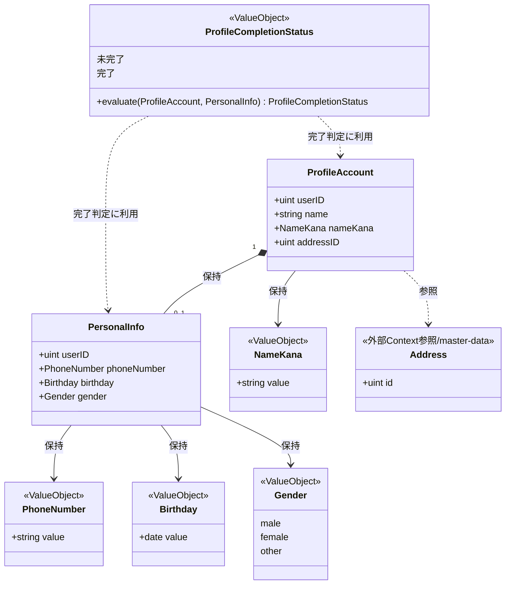
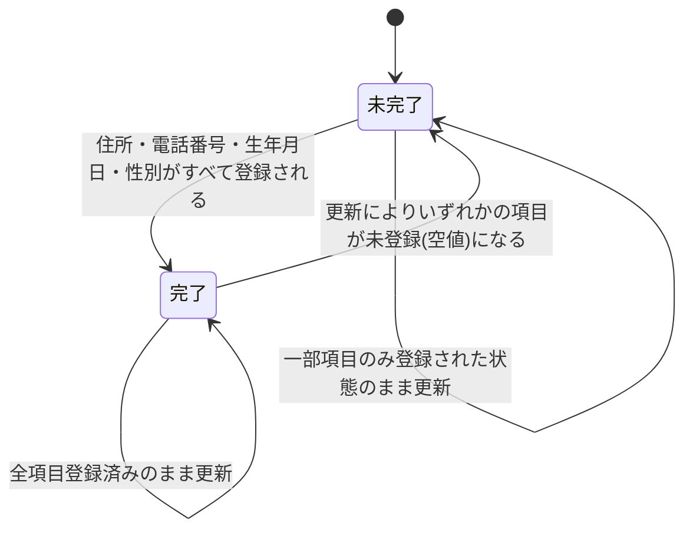
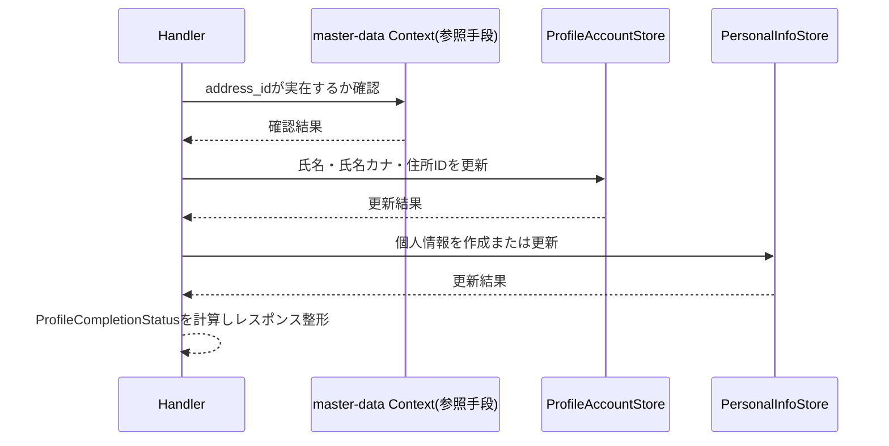
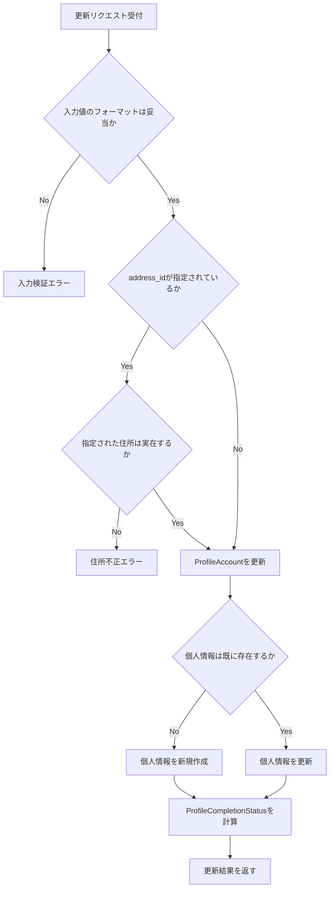

# プロフィール管理機能 Go移行・設計仕様書

---

# 1. 機能概要

## 機能概要

ログイン中のユーザーが、自分自身の基本情報（氏名・氏名カナ）、個人情報（電話番号・生年月日・性別）、住所を更新できる機能である。Rails現行仕様では、氏名・個人情報・住所を一括で検証し、同一トランザクションで更新する。更新は全項目置換方式であり、未指定の項目は空値として更新される。また、住所・電話番号・生年月日・性別がすべて登録済みかどうかによって、プロフィール登録が完了しているか（`profile_completed`）を都度判定する。

ログイン中ユーザー自身の情報の参照（`GET /api/v1/me`）は、Rails現行仕様では本機能と認証機能の双方から言及されているが、実体は単一のControllerが担っている。認証機能側の設計（認証機能_Go移行・設計仕様書）において、このエンドポイントはauthentication Contextが所有する参照エンドポイントとして整理されている。本機能（profile Context）は、この整理を前提として、プロフィール項目（氏名・個人情報・住所）の更新（`PATCH /api/v1/profile`）にのみ責務を持ち、参照そのものは独自のHTTPエンドポイントを設けない。

## 利用者

- ログイン中の `student` / `teacher` / `admin` ロールのユーザー（自分自身の情報のみ操作可能）

## 業務上の目的

- ログイン中ユーザーが自分自身の基本情報・個人情報・住所を最新の状態に保てるようにする
- 氏名・個人情報・住所を一括で検証し、整合性を保ったまま更新する
- 住所・個人情報の登録状況から、プロフィール登録が完了しているかどうかを判定できるようにする

---

# 2. 設計方針

本機能は、Rails実装の構造をそのまま置き換えるのではなく、業務上の責務を明確に分離したGo設計とする。認証情報（メールアドレス・パスワード・ロール・セッション状態）そのものの真正な情報源はauthentication Contextであり、本機能はプロフィール項目（氏名・氏名カナ・住所・個人情報）の参照・更新に責務を限定する。

- 責務分離: HTTP・入力検証・業務ルール（フォーマット・整合性）・永続化を分離する
- Context境界の明確化: 認証コンテキストが所有する資格情報・所属高校・学年には関与せず、本機能が更新対象とする項目（氏名・氏名カナ・住所・個人情報）にのみ責務を持つ
- 保守性: 氏名・個人情報・住所という複数テーブルにまたがる更新を、一貫した手続きとして集約する
- テスト容易性: フォーマット検証・プロフィール完了判定を、DBに依存せず検証できるようにする
- 拡張性: 将来的に更新対象項目が増えても、既存の検証・更新の枠組みに追加できる構造とする
- API互換性: 既存フロントエンドとの整合を保つため、エンドポイント・リクエスト構造・レスポンス構造・全項目置換という更新セマンティクスを維持する

---

# 3. Bounded Context

## Context名

- profile

## Contextの責務

- ログイン中ユーザー自身の基本情報（氏名・氏名カナ・住所ID）の更新
- ログイン中ユーザー自身の個人情報（電話番号・生年月日・性別）の作成・更新
- プロフィール登録が完了しているかどうかの判定（`profile_completed`）

## 他Contextとの依存関係

- authentication Context: ユーザーの認証情報（メールアドレス・パスワードハッシュ・ロール・`jti`・所属高校・学年）自体の真正な情報源はauthentication Contextである。本Contextはそのうち氏名・住所という一部のカラムを更新するにとどまり、認証・セッション・所属高校・学年の更新には関与しない。また、ログイン中ユーザー自身の情報参照（`GET /api/v1/me`）はauthentication Contextが所有するエンドポイントであり、本Contextはこれを実装しない
- master-data Context: 住所ID（`address_id`）の指定時、指定された住所が実在するかどうかの確認に依存する
- Notification Context: 依存なし（本機能に関連する非同期メール送信は現行仕様に存在しない）

## 依存する理由

ユーザーというデータは、資格情報（authentication）・プロフィール項目（profile）という複数の関心事にまたがって存在するが、これらを単一のContextで扱うと、認証ロジックの変更とプロフィール更新ロジックの変更が互いに影響し合う。本Contextは「ログイン中本人によるプロフィール項目の更新」という業務目的に責務を限定し、資格情報の真正性はauthentication Contextに委ねる。住所の実在確認は、住所マスタを所有するmaster-data Contextへの参照専用の依存とする。

---

# 4. 設計パターン

## 採用パターン

Active Record

## 判断根拠

本機能は、氏名・氏名カナ・住所・個人情報（電話番号・生年月日・性別）という同一のデータ構造に対する「参照（内部利用）」と「一括更新」という2つの操作で構成される、CRUD中心の業務である。状態遷移としては、プロフィール登録の完了状態（`profile_completed`）が「未完了→完了」（および項目が未登録に戻った場合の「完了→未完了」）という単純な導出値を持つが、これは複数のEntityにまたがる複雑な業務ルールではなく、氏名・個人情報・住所という単一の構造の属性が揃っているかどうかを判定するだけの振る舞いである。

- 業務ルールの複雑さ: 氏名カナのフォーマット・電話番号の桁数・性別の列挙値・生年月日の未来日禁止・住所IDの実在確認という、いずれもフィールド単位で完結するバリデーション相当のルールが中心であり、複数のEntityをまたぐ複雑な業務ルールは存在しない
- 状態管理の有無: `profile_completed` という導出的な状態は持つが、明示的なトリガーによる遷移ルール（タスクの状態遷移のような、許可された遷移パターンの制約）は存在せず、更新結果から都度計算されるのみである
- 将来の拡張性: 現行仕様には、更新対象項目の追加以外の拡張ポイントは明記されていない。項目が増えた場合も、structのフィールドとバリデーションメソッドの追加で対応できる
- テスト容易性: 氏名・個人情報・住所という同一データ構造に対する検証ロジック（NameKana・PhoneNumber・Gender・Birthdayの各フォーマットルール、ProfileCompletionStatusの判定）を、struct自身のメソッドとして単体テストできる

氏名・個人情報・住所という同じデータ構造に対する検証・更新ロジックが「参照時の完了判定」「更新時の検証」の双方で再利用されるため、関数ごとに手続きを分散させるTransaction Scriptよりも、structとそのメソッドに責務を集約するActive Recordが自然である。一方で、状態遷移ルール・複数業務ルールの相互作用といったDomain Model採用基準を満たさないため、Domain Modelは過剰である。

## 採用しなかったパターン

### Transaction Script

- 氏名カナ・電話番号・性別・生年月日のフォーマット検証と、`profile_completed` の判定ロジックが、参照（内部利用）・更新の双方で再利用されるため、関数ごとに手続きとして分散させると重複や実装漏れが生じやすい
- 氏名（`users`テーブル）と個人情報（`user_personal_infos`テーブル）という2つのテーブルにまたがる整合性のある更新を、単純な手続きの羅列として表現すると、更新順序やトランザクション境界の意図が読み取りにくくなる

### Domain Model

- `profile_completed` は明示的な遷移トリガー（ユーザー操作による状態変更の意図的な選択）を持たず、単に「登録済み項目が揃っているかどうか」を都度計算する導出値であり、タスクの状態遷移のような「許可された遷移の組み合わせ」という業務ルールを持たない
- 複数の業務ルールがEntityをまたいで相互作用する場面（例: 住所の変更が個人情報の検証に影響する等）は現行仕様に存在しない
- Entityに振る舞いを集約するメリットが限定的であり、設計コストに対して恩恵が小さい

### Event Sourcing

- プロフィール変更履歴の再構築・監査要件は現行仕様に存在しない
- 現状の業務要件では過剰な設計である

---

# 5. Aggregate設計

## Aggregate Root

- ProfileAccount（`users`テーブルのうち、本Contextが更新対象とする氏名・氏名カナ・住所IDのサブセット）

## Aggregateに含めるEntity

- ProfileAccount
- PersonalInfo（`user_personal_infos`。ProfileAccountに従属する個人情報）

## Aggregate境界

- ProfileAccountとPersonalInfoが、1回の更新操作の中で整合性を保つ単位とする
- `users`テーブルの他のカラム（メールアドレス・パスワードハッシュ・`jti`・ロール・所属高校・学年等）は、authentication Contextが所有する範囲であり、本Aggregateには含めない。本Contextが読み書きする範囲は、氏名・氏名カナ・住所ID（`users`テーブルの一部カラム）とuser_personal_infosの全カラムに限定する
- 住所（Address）はAggregateの外部参照とし、存在確認のための制約条件としてのみ利用する

## 整合性を保証する単位

- プロフィール更新時、ProfileAccount（氏名・氏名カナ・住所ID）とPersonalInfo（電話番号・生年月日・性別）の更新を1トランザクションで行う。個人情報が未登録の場合は新規作成する

理由: 現行仕様が「氏名・個人情報・住所の更新は一括で行われ、一部項目のみを更新することはできない」という全項目置換の方針を持つため、2つのテーブルにまたがる更新が部分的にしか反映されない状態を許容できない。

---

# 6. Entity設計

## ProfileAccount

- 役割: ユーザーの基本情報（氏名・氏名カナ・住所ID）を表す概念。`users`テーブルを認証コンテキストと共有するが、本Contextが読み書きするのはこのサブセットに限られる
- ライフサイクル: 認証コンテキストによるアカウント作成時に初期値（氏名・氏名カナは登録時の入力値、住所IDは未設定）が生成され、以降は本Contextの更新操作によってのみ変更される
- 状態変化: 氏名・氏名カナ・住所IDの値そのものが更新されるのみで、明示的な状態遷移（ステータス値の遷移）は持たない
- 保持する責務:
  - 氏名・氏名カナ・住所IDを保持する
  - 氏名カナのフォーマット妥当性を判定する
- 判断根拠: プロフィール更新の対象となる基本情報の中心であるため

## PersonalInfo

- 役割: ユーザーの個人情報（電話番号・生年月日・性別）を表す概念
- ライフサイクル: 未登録（作成前） → 作成（初回更新時） → 更新の繰り返し
- 状態変化: 各フィールドが未登録から登録済みへ、または登録済みの値から別の値へ変化する
- 保持する責務:
  - 電話番号・生年月日・性別を保持する
  - 電話番号の桁数フォーマット、性別の列挙値、生年月日が未来日でないことを判定する
- 判断根拠: 個人情報という業務上独立した意味を持つデータであり、`users`テーブルとは別テーブル（`user_personal_infos`）として管理されているため

## ProfileCompletionStatus（導出概念）

- 役割: ProfileAccountの住所ID、およびPersonalInfoの電話番号・生年月日・性別がすべて登録済みかどうかを表す導出的な状態
- ライフサイクル: 更新のたびに、現在のProfileAccount・PersonalInfoの値から都度計算される（永続化されたステータスカラムを持たない）
- 状態変化: 「未完了」⇔「完了」
- 保持する責務: 完了判定に必要な項目（住所ID・電話番号・生年月日・性別）がすべて存在するかどうかを判定する
- 判断根拠: `profile_completed` はRails現行仕様でも専用カラムを持たず都度計算される値であり、Entityというよりは計算結果を表すValue Object相当の概念として扱う方が実態に即している（詳細は「7. Value Object設計」を参照）

## 外部参照Entity（本Contextが所有しない概念）

- Address（master-data Context）: 住所IDの実在確認にのみ用いる参照専用の外部概念であり、本Contextは作成・更新しない
- HighSchool / Grade（master-data Context経由、authentication Context所有）: `GET /api/v1/me` のレスポンスには含まれるが、本Contextの更新対象ではない

---

# 7. Value Object設計

## NameKana

- 採用理由: 氏名カナはカタカナ・長音符・中黒・空白のみで構成されるという独自のフォーマットルールを持つため
- 独自ルール:
  - カタカナ・長音符（ー）・中黒（・）・空白のみで構成されていることを保証する
- Entity属性ではなくValue Objectにする理由: フォーマット検証ロジックを型に閉じ込め、参照時の検証と更新時の検証で再利用可能にするため

## PhoneNumber

- 採用理由: 電話番号は未入力を許容しつつ、入力する場合は10〜11桁の数字であるという条件付きのフォーマットルールを持つため
- 独自ルール:
  - 未入力（空値）を許容する
  - 入力する場合は10〜11桁の数字であることを保証する
- Entity属性ではなくValue Objectにする理由: 「空値は許容するが、入力時は形式を検証する」という条件分岐を型に閉じ込め、Entityのメソッドを単純に保つため

## Gender

- 採用理由: 性別は `male` / `female` / `other` という定義済みの選択肢に限定されるため
- 独自ルール:
  - 定義された選択肢以外の値を許容しない
- Entity属性ではなくValue Objectにする理由: 列挙値としての妥当性検証を型で保証し、不正な文字列がそのまま保存されることを防ぐため

## Birthday

- 採用理由: 生年月日は「未来日を指定できない」という比較的単純だが明確な業務ルールを持つため
- 独自ルール:
  - 未来日を許容しない
- Entity属性ではなくValue Objectにする理由: 日付の妥当性判定ロジックを一箇所に集約し、比較ロジックの重複を避けるため

## ProfileCompletionStatus

- 採用理由: 「住所・電話番号・生年月日・性別がすべて登録されているか」という判定結果を、単なるbool値ではなく業務上意味のある値として明示するため
- 独自ルール:
  - 住所ID・電話番号・生年月日・性別のいずれかが未登録の場合は「未完了」と判定する
  - 上記すべてが登録されている場合は「完了」と判定する
- Entity属性ではなくValue Objectにする理由: 永続化されたステータスカラムを持たない導出値であり、ProfileAccount・PersonalInfoという複数のEntityの状態から都度計算されるため、単一Entityの属性としてではなく、計算結果を表す独立した型として扱う方が実態に即している

## Value Objectを採用しないもの

- 氏名（漢字表記）: 文字列そのものの意味が強く、フォーマットルールを持たないため、Value Object化は不要とする
- 住所ID: 単なる外部キーであり、実在確認はmaster-data Context参照によって行うため、本Context内で独自のValue Objectとしては扱わない

---

# 8. Domain Service

不要と判断する。

理由: 氏名カナ・電話番号・性別・生年月日のフォーマット検証、および住所IDの実在確認はいずれも単一のstruct（ProfileAccount・PersonalInfo）のメソッド、またはRepository経由の単純な存在確認で完結し、複数Entityにまたがる業務ルールの調整や、Entity単体では表現しきれない判断は存在しない。Active Record採用のため、これらのルールはstructのメソッドとして表現する（「4. 設計パターン」参照）。

---

# 9. クラス図

Active Record採用のため実装時はProfileAccount/PersonalInfoが同一packageのstructとメソッドに統合されるが（4章参照）、業務概念としての関係は以下のとおり整理する。

Addressはmaster-data Contextが所有するデータであり、参照のみ行うため外部参照として示している。Goのstruct定義（フィールドの可視性・タグ等）は③Go実装仕様書で扱う。

---

# 10. 状態遷移図

ProfileCompletionStatusは、更新のたびに現在の登録状況から都度計算される導出値であり、「6. Entity設計」で整理したとおり明示的な遷移トリガー（許可された遷移パターンの制約）を持たない。参考として、更新結果に応じた値の変化を以下に示す。

遷移条件:

- 現行仕様の更新は全項目置換方式であるため、「完了」状態から一部項目を空値で更新すると「未完了」に戻り得る
- 遷移そのものに禁止される組み合わせはない（どの状態からどの状態へも、更新結果次第で到達し得る）

ProfileAccount・PersonalInfo自体は、値の更新以外に明示的な状態（ステータス値）を持たないため、個別の状態遷移図は省略する。

---

# 11. Repository設計

**実装上の位置づけ**: 本機能はActive Record採用のため、Repository Interfaceをdomain層に定義しない。以下は永続化・検索責務の設計意図であり、実装時はEntity相当のstructと同一packageに置くStore（例: `〇〇Store`）として直接実装する（規約: アーキテクチャ規約.md「3. 設計パターンごとの構造適用方針」）。

## ProfileAccountStore

- 管理対象: ProfileAccount（`users`テーブルのうち氏名・氏名カナ・住所IDのサブセット）
- 責務:
  - user_idによる取得
  - 氏名・氏名カナ・住所IDの更新
- 保持する検索機能:
  - user_idによる一意検索
- 保持しない責務:
  - メールアドレス・パスワードハッシュ・`jti`・ロール・所属高校・学年の読み書き（authentication Contextの責務）
- 判断根拠: `users`テーブルを認証コンテキストと共有するが、本Contextが操作できるカラムを明示的に限定し、Context間の書き込み責務の混在を防ぐため

## PersonalInfoStore

- 管理対象: PersonalInfo
- 責務:
  - user_idによる取得
  - 存在しない場合の新規作成
  - 電話番号・生年月日・性別の更新
- 保持する検索機能:
  - user_idによる一意検索
- 保持しない責務:
  - フォーマット妥当性の最終判断（PhoneNumber/Gender/Birthdayの責務）
- 判断根拠: 個人情報の永続化に特化させ、業務ロジックを持たせないため

## master-data Context参照（Repositoryとしては持たない）

- 住所ID（`address_id`）の実在確認は、master-data Contextが公開する参照手段（規約「5. Context間連携ルール」）を呼び出す形で行う
- 判断根拠: 住所マスタの真正な所有者はmaster-data Contextであり、本Contextが独自のAddress Repositoryを持つと、住所データの参照経路が重複するため

---

# 12. UseCase設計

**実装上の位置づけ**: 本機能はActive Record採用のため、UseCase層（struct）を設けない。以下はHandlerが行う業務操作の設計意図であり、実装時はHandlerがStoreを直接呼び出す処理として実装する。

## UpdateProfile（Handler処理）

- 目的: ログイン中ユーザー自身の氏名・氏名カナ・住所・個人情報を一括で更新する
- 入力: current user, name, name_kana, address_id（任意）, phone_number（任意）, birthday（任意）, gender（任意）
- 出力: 更新後のプロフィール情報（ProfileCompletionStatusを含む）
- トランザクション範囲: ProfileAccountStoreによる氏名・氏名カナ・住所IDの更新と、PersonalInfoStoreによる個人情報の作成・更新を1トランザクションで扱う
- 呼び出すStore:
  - ProfileAccountStore
  - PersonalInfoStore
  - master-data Context参照（住所ID実在確認）
- 判断根拠: 現行仕様が「一括更新・全項目置換」という方針を持つため、2つのテーブルへの書き込みを1つの業務操作として一貫させる必要がある

## 参照（内部利用のみ、独立したHandler処理は設けない）

- 目的: `UpdateProfile` の実行前後で現在の登録状況（ProfileCompletionStatus）を把握するため、ProfileAccountStore・PersonalInfoStoreの取得メソッドを内部的に利用する
- 判断根拠: ログイン中ユーザー自身の情報参照は、authentication Contextが所有する `GET /api/v1/me` によって提供されるため（「3. Bounded Context」参照）、本Contextでは独立したHTTPエンドポイント・Handler処理としての参照系UseCaseを設けない。ただし更新結果を返却する際にProfileCompletionStatusを計算する必要があるため、Store自体の取得メソッドは保持する

---

# 13. シーケンス図・処理フロー図

## シーケンス図（UpdateProfile）

Active Record採用のためUseCase層はなく、Handlerが各Storeを直接呼び出す（4章参照）。master-data Contextへの参照が発生する点を示す。

## 処理フロー図（UpdateProfile）

住所実在確認・個人情報の作成/更新分岐・完了判定という複数の分岐を伴うため、フローチャートで可視化する。

---

# 14. Transaction設計

## Transaction開始位置

- Handlerの処理単位に対応するStoreメソッド呼び出しの起点でトランザクションを開始する

## Transaction終了位置

- UpdateProfileの処理では、ProfileAccountの更新と個人情報の作成・更新が完了した時点でコミットする

## 理由

- 現行仕様が「氏名・個人情報・住所の更新は一括で行われ、一部項目のみを更新することはできない」という全項目置換の方針を持つため、2つのテーブルへの書き込みのいずれかが失敗した場合に更新全体を取り消す必要がある

---

# 15. Validation設計

## Presentation

- 型チェック: HTTP入力の型を検証する
- 必須チェック: 現行仕様上、更新項目はすべて任意項目であるため、Presentation層での必須チェックは行わない
- フォーマットチェック: 氏名カナのカタカナ形式、電話番号の桁数形式、性別の列挙値形式、生年月日の日付形式を検証する

## Domain

- 業務ルール: 全項目置換であることを前提とした更新（未指定項目は空値になる）の整合性
- 状態チェック: 特になし（明示的な状態遷移を持たないため）
- 整合性チェック: 住所IDが実在すること、生年月日が未来日でないこと

## 責務分離

- Presentationは「入力が正しいか（形式）」を担当する
- Domainは「業務的に妥当か（住所が実在するか、日付が未来でないか）」を担当する
- これにより、フォーマット検証と、他Context（master-data）を参照する必要がある検証を分離できる

## バリデーション仕様

|フィールド|検証層|ルール|エラーメッセージ方針|
|-|-|-|-|
|name_kana|Presentation|カタカナ・長音符・中黒・空白のみ|「氏名カナの形式が不正です」|
|phone_number|Presentation|未入力または10〜11桁の数字|「電話番号の形式が不正です」|
|gender|Presentation|male / female / other のいずれか|「性別の指定が不正です」|
|birthday|Domain|未来日でないこと|「生年月日は未来の日付にできません」|
|address_id|Domain|存在する住所であること（master-data Context参照）|「指定された住所が存在しません」|
|name / name_kana / address_id / phone_number / birthday / gender|Domain|一括更新（全項目置換）であり、未指定項目は空値になることを前提とした整合性|（個別のエラーメッセージは持たず、更新結果としてそのまま反映する）|

---

# 16. Authorization設計

## Middleware

- 認証済みユーザーを特定し、ユーザー情報をコンテキストに保持する（authentication Contextが提供するJWT検証を利用する）
- ロールによる制限は行わない（`student` / `teacher` / `admin` いずれも利用可能）

## Handler

- ルーティング層でAPIの入口を担当し、認証失敗時のHTTP応答を整える
- 具体的な業務権限判定は持たせない

## UseCase（Handler処理）

- current userのuser_idに基づいて、自分自身のProfileAccount・PersonalInfoのみを更新できるようにする
- 他ユーザーのプロフィールを更新できないことをStore呼び出し時のスコープとして保証する

## Domain

- ProfileAccount・PersonalInfoは、所有者（user_id）以外からの更新が行われないよう、所有権の前提を保持する。ただし認可の本体はHandler・Middleware側に寄せる

## 判断理由

本機能は「本人のみが自分自身のプロフィールを操作できる」という単純な所有権制御であり、ロールによる権限分岐が存在しないため、HTTPレベルでの本人確認（Middleware）とHandler側でのスコープ限定（current userのuser_idを起点とする）のみで十分である。

---

# 17. Error設計

## Domain Error

- 責務: プロフィール更新における業務ルール違反を表現する
- 例: 指定された住所が存在しない、生年月日が未来日である
- 判断理由: 業務ルール違反をアプリケーション層に漏らさず、ドメイン側（struct上のバリデーションメソッド）で明示的に扱うため

## Application Error

- 責務: 更新処理実行時の失敗を表現する
- 例: 個人情報の新規作成・更新処理の失敗
- 判断理由: 処理の失敗理由をHTTPレスポンスに変換しやすくするため

## Infrastructure Error

- 責務: DB接続失敗・永続化失敗を表現する
- 判断理由: 永続化層の失敗をドメインに漏らさず、技術的な障害として切り分けるため

## エラー仕様

|業務シナリオ|エラー種別|発生層|想定するHTTPステータス|
|-|-|-|-|
|氏名カナ・電話番号・性別の形式が不正|Validation|Presentation|422|
|生年月日が未来日|Validation|Domain|422|
|指定された住所が存在しない|Validation|Domain|422|
|未ログイン|Unauthorized|Presentation(Middleware)|401|
|更新処理の失敗|Internal|Infrastructure|500|

---

# 18. Domain Event

本機能では現時点でDomain Eventを採用しない。理由は、プロフィール更新に対して他処理へ通知するような非同期の副作用が現行仕様に明記されていないためである（Rails現行仕様書「9. 非同期処理」でも「本機能に関連するJob・Mailerは存在しない」と明記されている）。

将来的に、住所変更時の関連データ更新通知等の要件が増えた場合は、イベント化を検討する。

---

# 19. API仕様

## エンドポイント一覧

|エンドポイント|HTTP Method|概要|
|-|-|-|
|/api/v1/profile|PATCH|ログイン中ユーザー自身の基本情報・個人情報・住所を更新|

`GET /api/v1/me`（ログイン中ユーザー自身の情報参照）は、authentication Contextが所有する参照エンドポイントであり、本書の対象ではない。詳細は認証機能_Go移行・設計仕様書「19. API仕様」を参照する。

## 各エンドポイントの仕様

- プロフィール更新: Request Bodyに `name`（任意）/`name_kana`（任意）/`address_id`（任意）/`birthday`（任意）/`gender`（任意）/`phone_number`（任意）を含む。すべて任意項目だが、更新は全項目置換方式であり、未指定の項目は空値として更新される。Responseはログイン・`GET /api/v1/me`と同形式のユーザー情報一式（`id`, `name`, `name_kana`, `email`, `profile_completed`, `user_personal_info`, `user_role`, `high_school`, `address`, `grade`）

Status Code:

- 200: 更新成功
- 422: 入力値検証エラー（氏名カナ形式不正、電話番号形式不正、性別不正、住所ID不正、生年月日が未来日など）
- 401: 未ログイン

Error Response方針: 既存のerrors形式をそのまま踏襲し、フロントエンド互換性を優先する。

## Railsとの差分

- Rails仕様: `Api::V1::ProfilesController#update` が氏名・個人情報・住所の一括更新を担い、`Api::V1::UsersController#show`（`GET /api/v1/me`）が参照を担う。両者は別Controllerだが、参照系は認証機能のRails現行仕様書とも重複して記載されている
- Go設計での変更: 参照系（`GET /api/v1/me`）はauthentication Context側のエンドポイントとしてのみ実装し、profile Contextでは独自の参照用HTTPエンドポイントを設けない。更新系（`PATCH /api/v1/profile`）のみをprofile Contextの責務とする。更新のセマンティクス（全項目置換）自体は変更しない
- 変更理由: 1つのHTTPエンドポイント（`GET /api/v1/me`）を複数Contextが二重に実装することを避け、規約「4. Bounded Context構成」の分割基準（誰が・何を・どの業務目的で扱うか）に沿って責務を一箇所に集約するため
- 影響範囲: フロントエンドから見たエンドポイント・レスポンス構造には影響しない。内部的な実装の所属Contextが変わるのみである

JSONスキーマの厳密な型定義・Goの構造体は③Go実装仕様書で扱う。

---

# 20. DB設計方針

## 現行DBを利用するか

- 既存Rails DBを継続利用する

## Schema変更有無

- 変更なし

## 変更理由

- `users` テーブルの `name`, `name_kana`, `address_id`、および `user_personal_infos` テーブルの `phone_number`, `birthday`, `gender` で、本機能の要件をすべて満たしている
- `profile_completed` は専用カラムを持たず都度計算される値であり、スキーマ変更を要しない

## 変更を提案しない理由

- 本機能はCRUD中心であり、現行スキーマに構造的な問題は確認できないため

---

# 21. DB操作仕様

|Store|対象テーブル|操作種別|主な検索条件・絞り込み条件|関連テーブルとの結合|ページネーション/ソート|
|-|-|-|-|-|-|
|ProfileAccountStore|users|参照・更新|user_id|なし|不要|
|PersonalInfoStore|user_personal_infos|参照・作成・更新|user_id|なし|不要|
|master-data Context参照|（本Contextの直接操作対象外）|—|—|—|—|

住所（addresses）の実在確認はmaster-data Contextが公開する参照手段を通じて行うため、本ContextのDB操作仕様には含めない。具体的なSQL・GORMのクエリコードは③Go実装仕様書（`規約/Gorm規約.md`）で扱う。

---

# 22. テスト戦略

## Domain Test

- 目的: NameKana・PhoneNumber・Gender・Birthdayの各フォーマット判定、ProfileCompletionStatusの完了判定ロジックを検証する

## UseCase Test

- 目的: UpdateProfile（Handler処理）が、氏名・個人情報・住所の一括更新、個人情報の新規作成/更新の分岐、ProfileCompletionStatusの再計算を正しく行うことを検証する

## Repository Test

- 目的: ProfileAccountStore・PersonalInfoStoreによる永続化・検索の正確性を検証する

## Handler Test

- 目的: API入力のバリデーション結果とHTTPステータスの変換を検証する

## Integration Test

- 目的: エンドポイント経由でプロフィール更新が正常に動作し、全項目置換のセマンティクス（未指定項目が空値になること）が維持されていることを確認する

---

# 23. Railsとの責務対応

| Rails | Go | 設計方針 |
|---|---|---|
| Controller（`Api::V1::ProfilesController`） | Handler | HTTP入力の受け取りとレスポンス整形に限定する |
| Controller（`Api::V1::UsersController#show`） | （本Contextでは実装しない） | authentication Contextの責務として整理する |
| Form（`ProfileUpdateForm`） | Request DTO + Validation | 入力検証をPresentation層で分離する |
| Model（`User`の一部カラム, `UserPersonalInfo`） | struct + Store（同一package） | 業務ルールはstructのメソッド、永続化はStoreの責務として整理する |
| Serializer（`CurrentUserSerializer`, `UserPersonalInfoSerializer`, `AddressSerializer`） | Response DTO | レスポンス整形を分離する |

---

# 24. 採用しなかった設計

## Transaction Script

- 採用しなかった理由: フォーマット検証・完了判定ロジックが参照（内部利用）・更新の双方で再利用されるため、関数ごとに手続きを分散させると重複が生じやすいため
- 将来的に採用する可能性: 更新対象項目がさらに減り、単純な1テーブル更新のみになった場合は再検討できる

## Domain Model

- 採用しなかった理由: `profile_completed` は明示的な遷移トリガーを持たない導出値であり、複数Entityにまたがる複雑な業務ルールも存在しないため
- 将来的に採用する可能性: プロフィール承認フロー等、明示的な状態遷移を伴う業務ルールが追加された場合は再検討する余地がある

## Event Sourcing

- 採用しなかった理由: プロフィール変更履歴の再構築・監査要件が現行仕様に存在しないため
- 将来的に採用する可能性: 現時点では想定していない

---

# 25. 設計判断サマリー

| 項目 | 採用 | 判断理由 |
|---|---|---|
| 設計パターン | Active Record | 同一データ構造に対するCRUD中心の業務であり、フォーマット検証・完了判定の再利用に適するため |
| Aggregate | ProfileAccount + PersonalInfo | 一括更新（全項目置換）の整合性を担保する単位として適切 |
| Transaction境界 | Handlerの処理単位（Storeメソッド呼び出し） | 2テーブルへの書き込みを1つの業務操作として一貫させるため |
| Domain Event | 未採用 | 現時点で他処理への通知要件がない |
| Value Object | 採用（NameKana, PhoneNumber, Gender, Birthday, ProfileCompletionStatus） | フォーマットルールと完了判定を型として明示するため |
| `GET /api/v1/me` の扱い | 本Contextでは実装しない | authentication Contextが所有するエンドポイントとして整理し、更新責務のみを本Contextに残すため |

---

# 設計差分管理

## Rails現行仕様

- `Api::V1::UsersController#show` と `Api::V1::ProfilesController#update` が、参照と更新でそれぞれ別Controllerとして存在するが、いずれも `CurrentUserSerializer` を用いて同形式のレスポンスを返す
- `ProfileUpdateForm` が氏名・氏名カナ・住所・個人情報の検証を一括で担う
- 更新は全項目置換方式であり、未指定項目は空値になる

## Go設計での変更内容

- 参照系（`GET /api/v1/me`）はauthentication Context側のエンドポイントとして一本化し、profile Contextでは実装しない
- 氏名カナ・電話番号・性別・生年月日の検証ロジックを、ProfileAccount・PersonalInfoのstructメソッド（Value Object活用）として分離する
- `profile_completed` の判定ロジックをProfileCompletionStatusという明示的な概念として整理する

## 変更理由

- Railsの実装構造（単一Controllerでの参照・更新の混在）をそのままGoに写すと、Context間の責務境界が曖昧になるため
- 全項目置換という現行の更新セマンティクスは、フロントエンドとの互換性を優先し維持する

## 影響範囲

- フロントエンドから見たAPIの外部仕様（`PATCH /api/v1/profile`のリクエスト・レスポンス構造、全項目置換のセマンティクス）は維持するため、影響はない
- 既存DBスキーマは維持するため、データ移行やマイグレーションの追加は不要
- 認証機能_Go移行・設計仕様書側の`GET /api/v1/me`所有権の整理と、本書の記載内容は整合させる必要がある
