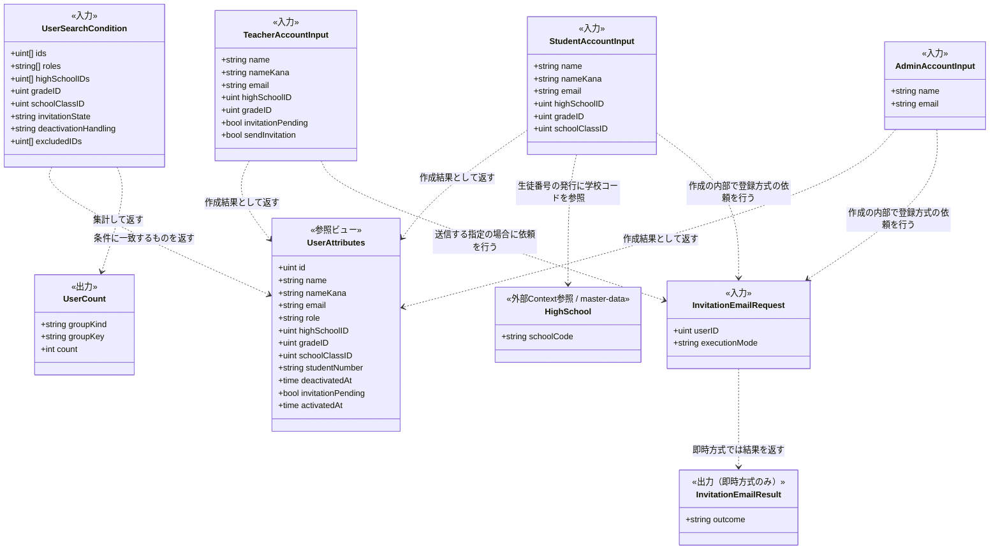
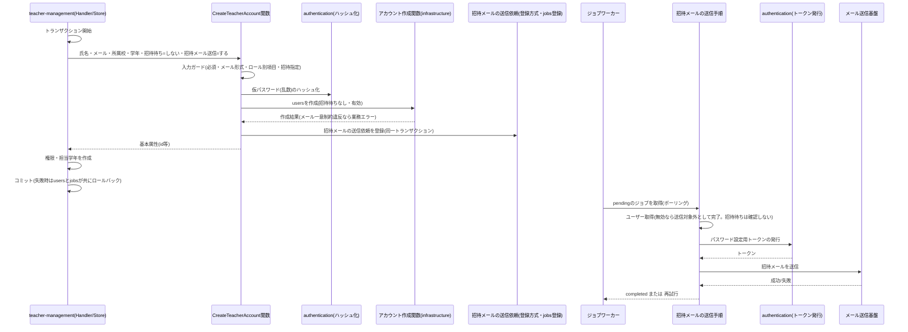
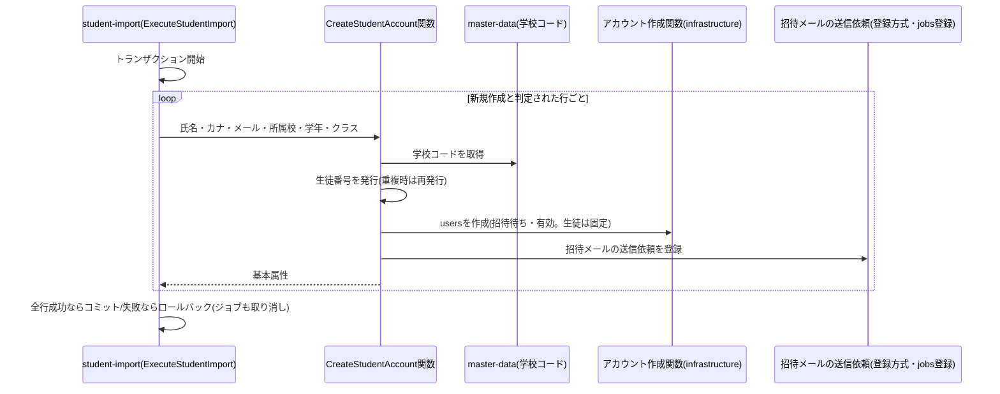
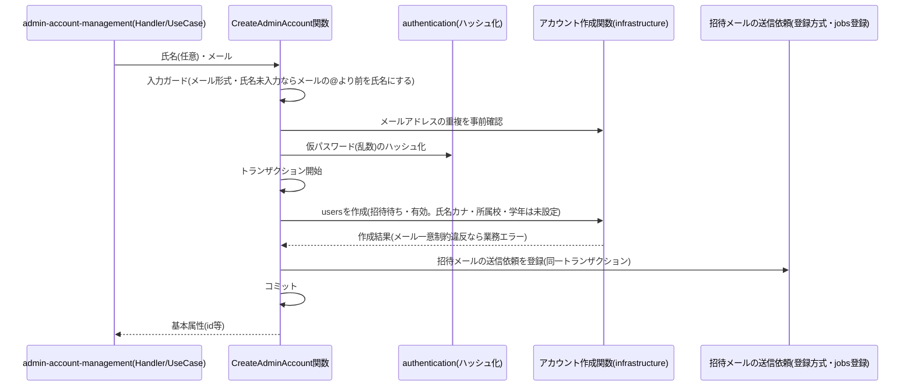
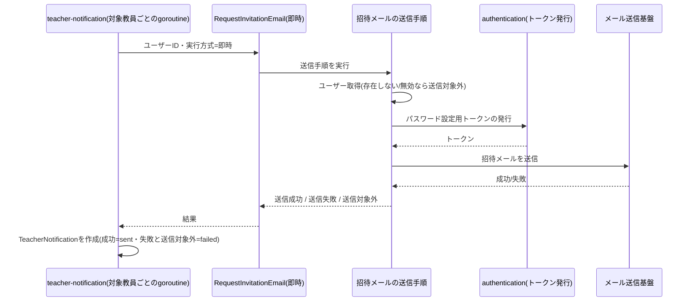
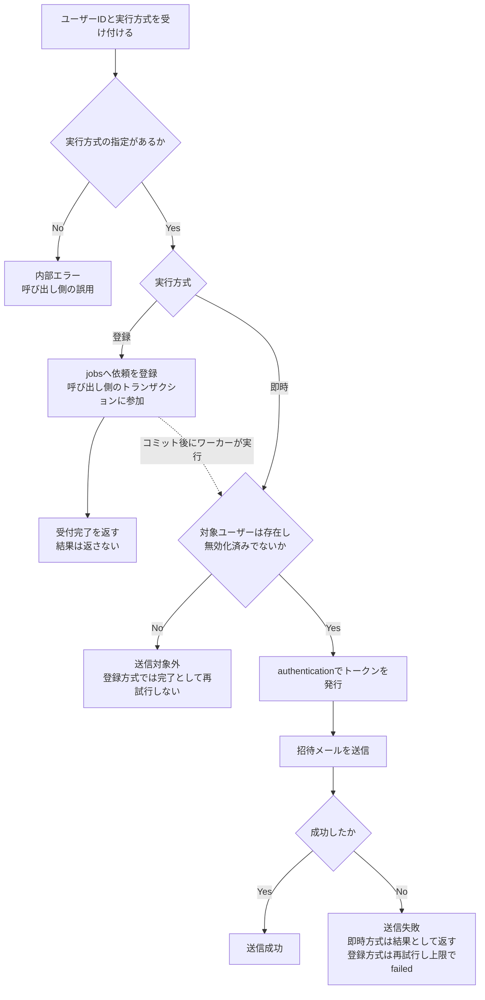

# ユーザー基盤機能 Go移行・設計仕様書

---

# 1. 機能概要

## 機能概要

複数の機能が共通して必要とする「ユーザーアカウント」の基本属性を他Contextへ参照させる手段と、生徒・教員・管理者のアカウント本体を作成する共通処理、および招待メールの送信依頼を提供する、内部向けの基盤機能である。HTTPエンドポイントは持たず、他Contextから呼び出される業務操作として提供する。

Rails現行実装には、この基盤機能に対応する単一の機能・Controllerは存在しない。以下の3つが、それぞれ複数の機能に分散して実装されている。

- **参照**: `User`モデルのscope（`students` / `teachers` / `admins` / `active` / `invitation_pending` / `by_high_school`）と、`user_roles`（`admin` / `student` / `teacher` / `guardian`の4値）を、各機能のController・Queryが組み合わせて利用している
- **アカウント作成**: `Common::CreateUserService`が、仮パスワードの発行・ロールの解決・DBトランザクション・`User`の保存・招待メールの送信という共通の流れを持ち、`Student::CreateStudentService`（生徒）・`Admin::CreateTeacherService`（管理者による教員作成）・`Admin::CreateAdminService`（管理者作成）がこれを継承して、ロールごとの属性設定と後続処理（教員の権限・担当学年の作成等）を差し込んでいる
- **招待メールの送信**: 同じメール（`AuthMailer.invite_user`）を、アカウント作成時（`Common::CreateUserService`。`deliver_later`）と、教員招待通知による再送（`Teacher::TeacherNotificationJob`。`deliver_now`）の2箇所が、別々の仕組みで送っている

Rails現行実装（`main`の`7a424a1e`時点）の作成処理の要点は以下のとおりである。

|項目|Rails現行実装|
|-|-|
|仮パスワード|`SecureRandom.hex(16)`（128bitの乱数）を設定し、利用者へは開示しない。パスワードは招待メールのリンクから利用者本人が設定する|
|ロールの解決|`UserRole.find_or_create_by!`（ロールマスタに存在しなければ作成する）|
|トランザクション|`ActiveRecord::Base.transaction`内で、`User`の保存・ロールごとの後続処理（`after_create`）・招待を実行する。呼び出し元がすでにトランザクションを開始していれば、それに参加する|
|招待待ちの状態|`password_reset_required`を真にする（生徒・管理者作成時）。管理者による教員作成（`Admin::CreateTeacherService`）は設定しない（偽のまま。`User.invitation_pending`scopeの対象にならない）。教師による教員作成（`Teacher::CreateTeacherForm`）は`Common::CreateUserService`を経由せず、真にして作成する。招待待ちはこの列のみで表し、`activated_at`は使わない|
|`activated_at`|作成時は設定しない（NULL）。生徒コード（`student_number`）による仮アカウントの有効化（`Auth::SignUpService`）でのみ設定される|
|生徒番号の発行|生徒の作成時のみ、`高校の学校コード-8桁の英数字大文字`の形式で発行する。既存の全`User`に対して一意になるまで再発行する。生徒以外への設定はモデル検証で禁止される|
|招待メール|`Common::CreateUserService`を経由する作成（生徒・管理者・管理者による教員）は、トランザクション内でパスワード設定用トークン（Deviseのリセットトークン。有効期間6時間）を発行し、`AuthMailer.invite_user`（件名「edu platform へのご招待」。本文は、パスワード設定のリンク`{FRONTEND_URL}/password/reset/{トークン}?email={メールアドレス}`を含む）を`deliver_later`で送る。`enqueue_after_transaction_commit = :always`のため、実際のジョブ登録はコミット後になり、ロールバック時は送信されない（`config/application.rb`のコメントに明記）。教師による教員作成は作成時に送らず、教員招待通知（`Teacher::TeacherNotificationJob`）が後から同じメールを送る|
|招待メールの再送（教員招待通知）|`Teacher::TeacherNotificationSenderService`が`Teacher::TeacherNotificationJob`を`perform_later`で登録し、ジョブが対象教員ごとに、トークン発行（`set_reset_password_token`）→`AuthMailer.invite_user`を`deliver_now`（同期送信）の順に実行する。**送信の成否は、その場で（同じ処理の中で）判定して`TeacherNotification`に記録する**（成功は`status = sent`と`sent_at`、例外が起きた場合は`status = failed`で`sent_at`なし。`pending`で作成されることはない）。1人の失敗は他の教員の処理に影響せず、ジョブ内の再試行もない|
|管理者の作成|`Admin::AdminForm`（`name` / `email`のみを受け取る）→`Admin::CreateAdminService`。`name`が未入力ならメールアドレスの`@`より前の部分を氏名にする。`name_kana`・`high_school_id`・`grade_id`は設定しない（管理者は`name_kana`の作成後の必須検証からも除外される）。`password_reset_required`は真、作成時に招待メールを送る（`Common::CreateUserService`の共通手順のまま）|
|メールアドレスの重複|Devise `validatable`の一意性検証（メールアドレスは小文字化・前後空白除去して保存）と`users.email`の一意インデックスで拒否される。論理削除済みのアカウントもこの制約の対象である|
|氏名の必須|`name` / `name_kana`の必須検証は`on: :update`のみで、作成時のモデル検証にはない。生徒は`Teacher::CreateStudentForm`（`NameValidatable`）が、管理者による教員作成は`Admin::CreateTeacherService`が、作成前に氏名を検証している。管理者は氏名を必須とせず、未入力ならメールアドレスから補完する（上記）|

## 利用者

- 他のBounded Context（内部呼び出しのみ。エンドユーザーが直接操作する画面・APIは持たない）
  - 参照: お知らせ・面談・クラス編成・教師権限管理・教員招待通知・管理者高校学年参照・各ダッシュボード等
  - アカウント作成: 教員管理（`teacher-management`）・生徒CSVインポート（`student-import`）・教師生徒参照（`student-directory`）・管理者アカウント管理（`admin-account-management`）
  - 招待メールの再送: 教員招待通知（`teacher-notification`）

## 業務上の目的

- 他Contextが共通して必要とするユーザーの基本属性（識別・役割・所属校・学年・クラス・生徒番号・無効化状態・招待完了状態）の参照手段を1箇所で定め、各Contextが`users`テーブルを個別に解釈して同じ判断（「有効なユーザーとは何か」「招待未完了とは何か」等）を重複実装することを防ぐ
- 生徒・教員・管理者アカウントの作成に共通する規則（仮パスワードの発行、招待待ちの初期状態、生徒番号の発行、招待メールの送信）を1箇所に集約し、CSV一括登録・単体登録・教員作成・管理者作成の各経路で同じ手順・同じ規則が使われることを保証する。経路ごとに異なる「招待待ちで作成するか」「作成時に招待メールを送るか」は、Rails現行の挙動のまま入力で指定させる（12章）
- 招待メールの内容（件名・本文・リンク・トークンの有効期間）と送信手順を1箇所に集約し、アカウント作成時の送信と教員招待通知による再送が、同じメールを同じ手順で送ることを保証する
- 作成をロールバックしたときに招待メールが送信されないことを、共通処理の側で保証する

---

# 2. 設計方針

本機能は、業務ルールの複雑さではなく「複数のContextが共通して頼る、小さく安定した窓口を持つこと」に価値がある。過剰な構造を持ち込まず、公開する操作の数と範囲を絞る。

- 責務の限定: 「参照」「アカウント作成」「招待メールの送信依頼」の3つに責務を限定する。認証情報・セッション・パスワードリセット（`authentication`）、プロフィール項目（`profile`）、教員の権限・担当学年（`teacher-management` / `teacher-permission`）、アカウントの更新・論理削除は持たない
- 公開範囲の最小化: 他Contextへ公開する属性は、他の②が実際に必要としているもの（3章の集約表）に限る。パスワードハッシュ・リセットトークン・`jti`・個人情報・住所は公開しない
- 呼び出し側の判断を奪わない: 参照操作は認可・スコープ判定（誰の所属校を見てよいか）を持たない。「無効化済みのユーザーを含めるか」も、Rails現行実装では参照箇所ごとに異なる（3章参照）ため、本Contextが既定値を決めず、呼び出し側に明示させる
- 呼び出し側の整合性を壊さない: アカウント作成は、呼び出し側のトランザクション（教員の権限・担当学年の作成、CSVの全件成功・全件失敗など）に参加できる。招待メールの送信は、そのトランザクションがコミットされた場合にのみ行われる
- 招待メールの一本化: 招待メールの内容・トークンの発行・送信手順の定義は、本Contextの「招待メールの送信依頼」の1箇所に置く。アカウント作成（内部）と教員招待通知の再送（外部から呼ぶ）は、どちらもこれを使う。送信結果（成功・失敗）の記録は、再送の当事者である`teacher-notification`が持ち、本Contextは記録を持たない。呼び出し側が結果を必要とするかどうかは、依頼の実行方式（12章）で選ばせる
- API互換性: HTTPエンドポイントを持たないため、フロントエンドから見たAPIの外部仕様には影響しない。各呼び出し元機能のAPI仕様は、呼び出し元の②が定めたものを維持する
- テスト容易性: 参照操作は条件と結果、作成操作は入力ごとの規則（ロール別の必須項目・生徒番号の発行・招待メールの登録有無）、招待メールの送信依頼は実行方式ごとの結果を、HTTPやメール送信基盤なしに検証できるようにする
- 拡張性: 公開操作を「参照4つ・作成3つ・招待メールの送信依頼1つ」に絞り、ロールごとの差はロール別の規則表（15章）で表現する。作成対象のロールが増える場合は、規則表への行の追加で対応できる構造とする

---

# 3. Bounded Context

## Context名

- user

規約「4. Bounded Context構成」の命名規則（kebab-case）に従う。ディレクトリ構成が確定していないため、`internal/`配下の物理配置との対応は本書では定めない。

## Contextの責務

- 他Contextへの、ユーザー基本属性の参照手段の公開（ID指定・メールアドレス指定・条件指定の一覧・人数集計）
- 生徒・教員・管理者アカウント本体（氏名・メールアドレス・ロール・所属校・学年・クラス）の作成
- 作成に伴う仮パスワードの発行、招待待ちの初期状態の設定（呼び出し側の指定に従う）、生徒番号の発行、招待メールの送信依頼（呼び出し側の指定に従う。規約13「非同期ジョブ実行パターン」の`jobs`テーブルへの登録）
- 招待メールの送信依頼の公開と、その実行（トークン発行と送信）。アカウント作成時（内部）と、教員招待通知の再送（外部から呼ぶ）の双方が、同じ依頼を使う

## 本Contextが持たない責務

|責務|担当|理由|
|-|-|-|
|認証情報（パスワードハッシュの照合・`jti`・セッション）・パスワードリセットのライフサイクル（トークンの発行・検証・消費）・自己登録・仮アカウントの有効化|`authentication`|認証②が`Account`集約として状態遷移とセキュリティ上の不変条件を持つと定めているため|
|プロフィール項目（氏名・氏名カナ・住所ID・個人情報）の更新|`profile`|プロフィール②が定めているため|
|教員の権限（`grade_scope` / `manage_other_teachers`）・担当学年|`teacher-management` / `teacher-permission`|各②が定めているため|
|アカウントの更新・論理削除|各機能のContext。現状の②では、アカウント連携（`account-linking`）が学籍情報の更新と統合元アカウントの論理削除を担う|下記「アカウントの更新・論理削除の扱い」を参照|
|招待メールの送信結果（成功・失敗）の記録と履歴の参照（`TeacherNotification`の`pending` / `sent` / `failed`）|`teacher-notification`|再送の当事者が、送信結果を業務の履歴として持つため。本Contextは、依頼を受けた送信の結果を呼び出し側へ返すのみで、記録は持たない（12章の`RequestInvitationEmail`）|
|画面向けの一覧（ページネーション・他テーブルとの結合・並び替えを伴うもの）|一覧を必要とする各機能のContext|生徒一覧・教員一覧は`student-directory` / `teacher-management`が、それぞれの②で自前の参照モデルとして定めている。本Contextは公開しない|

### アカウントの更新・論理削除の扱い

アカウントの更新・論理削除は、本Contextの責務に含めない。現状の②では、以下の機能がそれぞれ自Contextの業務目的に限定して`users`テーブルを書き換えており、本②はこれらを変更しない。

|機能（Context）|書き換える内容|根拠となる②|
|-|-|-|
|アカウント連携（`account-linking`）|学籍情報（高校・学年・クラス・生徒番号）の更新、統合元アカウントの論理削除（`deleted_at`設定・`student_number`クリア）。本Contextの外に残す例外として、自前のRepositoryを持つ|アカウント連携②「3. Bounded Context」「11. Repository設計」|
|プロフィール管理（`profile`）|氏名・氏名カナ・住所ID|プロフィール②「3. Bounded Context」|
|認証（`authentication`）|パスワードハッシュ・`jti`・リセットトークン・`activated_at`・仮アカウントの有効化時の入力内容|認証②「5. Aggregate設計」|
|生徒CSVインポート（`student-import`）|既存生徒の氏名・氏名カナ・メールアドレス・学年・クラスの上書き|生徒CSVインポート②「11. Repository設計」|
|管理者アカウント管理（`admin-account-management`）|管理者の基本情報の更新・論理削除（作成は本Contextの`CreateAdminAccount`を呼ぶ）|管理者管理者ユーザー②「3. Bounded Context」|
|教員管理（`teacher-management`）|教員のプロフィール（氏名・メールアドレス）の更新|管理者教員管理②「10. UseCase設計」|

`users`テーブルは複数のContextが列ごとに異なる責務で書き込む共有テーブルである。列ごとの書き込み主体は「20. DB設計方針」に整理した。この整理は各②から読み取れる範囲の集約であり、`users`テーブル全体の所有関係の最終決定ではない（未解決の論点1）。

## 他Contextからの依存の集約（Userに関する言及の全件）

他の②が`users`のデータを「User Context」等として参照している箇所を、実際に必要としている内容ごとに集約した。②での呼称は文書によって「User Context」「User/Account Context」「Account/Authentication Context」「Student/School Context」と揺れているが、いずれも`users`テーブルの情報を指している。

|依存元（機能・Context）|②での呼称|必要としている内容|種別|本②での扱い|
|-|-|-|-|-|
|お知らせ（`announcement`）|User Context|生徒の所属高校・役割・学年（お知らせの対象判定）、発行者の氏名・氏名カナ（表示）|参照|GetUserAttributes|
|教師お知らせ（`announcement`）|User Context|発行者・閲覧者の識別と`high_school_id` / `user_role_id` / `grade_id`、対象ユーザー（`by_user`）が存在し発信者と同校であることの確認|参照|GetUserAttributes（複数ID）|
|管理者お知らせ管理（`announcement`）|User Context|発行者（管理者）の識別、発行者アカウントの無効化状態（発行者が無効化されている場合に他の管理者へ操作を許可する判定）|参照|GetUserAttributes（無効化済みも返す）|
|面談・教師面談（`interview-request`）|User Context|生徒・教員の識別、教員の所属校、生徒の所属学年、メッセージ送信者名の表示|参照|GetUserAttributes（複数ID）|
|クラス編成（`school-class`）|User Context|申請者・承認者・生徒の識別、教師の所属校、削除申請の対象クラスに在籍する生徒がいないことの確認|参照|GetUserAttributes、CountUsers（クラス指定。Rails現行は`school_class.users.exists?`で無効化済みも含む）|
|教師権限管理（`teacher-permission`）|User Context|操作者の識別・所属校、校内に他の有効な教員が存在するかの確認（最後の有効教員の保護）|参照|GetUserAttributes、CountUsers（除外ID指定）|
|教員招待通知（`teacher-notification`）|User Context|同校の招待未完了（初回パスワード未設定）の教員一覧、教員の識別・所属校、招待メールの再送とその成否|参照・招待メールの送信依頼|参照はSearchUsers（役割・所属校・招待完了状態）。再送はRequestInvitationEmail（即時方式。成否は結果として返り、`TeacherNotification`への記録は`teacher-notification`が行う）|
|管理者高校学年参照（`school-directory`）|User/Account Context|高校ごとの生徒数（有効な生徒のみ）と教員数（Rails現行は無効化済みを含む）|参照（集計）|CountUsers（所属校別）|
|管理者ダッシュボード（`admin-dashboard`）|User Context|役割ごとの人数（Rails現行は無効化済みを含む全ユーザー）|参照（集計）|CountUsers（役割別）|
|教師ダッシュボード（`teacher-dashboard`）|Student/School Context（実体は`users`。推測）|同校の学年別生徒数（Rails現行は無効化済みを含み、1〜3年のみ）|参照（集計）|CountUsers（学年別。学年の年次への変換は呼び出し側）|
|教師生徒参照（`student-directory`）|User Context|生徒・学年・所属校の実体情報（一覧・詳細）、生徒アカウント本体の作成|参照・作成|作成はCreateStudentAccount。一覧・詳細はページネーション・結合を伴うため自前の参照モデルを持つ（本Contextの外）|
|生徒CSVインポート（`student-import`）|User Context|生徒アカウント本体の作成・更新、仮パスワード発行・招待メール送信、メールアドレスが既存アカウントと重複するかの確認|作成・参照・更新|作成はCreateStudentAccount、既存アカウントの確認はFindUserByEmail。既存生徒の更新は本Contextの外|
|教員管理（`teacher-management`。教師教員管理・管理者教員管理）|User Context（教師側）／Account/Authentication Context（管理者側）|教員アカウント本体（氏名・メールアドレス・ロール）の作成|作成|CreateTeacherAccount|
|アカウント連携（`account-linking`）|User Context|生徒番号による検索、学籍情報の更新、統合元の論理削除|参照・更新・論理削除|本Contextの外に残す例外（上記）。自前のRepositoryを維持する|
|認証（`authentication`）|User/Account Context|アカウント基礎情報（メール・パスワードハッシュ・ロール・`jti`）の作成・更新、仮アカウントの有効化|作成（自己登録）・更新|本Contextの外。認証②の`Account`集約が担う（未解決の論点1・3）|
|プロフィール管理（`profile`）|authenticationを`users`の情報源と記述|氏名・氏名カナ・住所IDの更新|更新|本Contextの外|
|管理者アカウント管理（`admin-account-management`）|Account/Authentication Context|管理者アカウントの作成・更新・論理削除|作成・更新・論理削除|作成はCreateAdminAccount。更新・論理削除は本Contextの外|
|タスク管理・タスク下書き・目標管理・学習ログ・問題解答|User Context|認証済み生徒の識別と所有権の確認|識別のみ|本Contextの操作は不要。識別は認証Middlewareが`current user`として渡し（規約7）、所有権は各Contextが自身のテーブルの`user_id`で判定するため|

この表から、公開する参照操作は「ID指定の取得」「メールアドレス指定の取得」「条件指定の一覧」「人数集計」の4つで、上記の全ての参照ニーズを満たせると判断した。作成操作は生徒・教員・管理者の3つ、招待メールの送信依頼は1つとし、他の②が必要とする範囲に限る。

## 他Contextとの依存関係（本Contextが依存する側）

- master-data Context: 生徒番号の発行に必要な高校の学校コード（`school_code`）の取得に依存する。master-data②の公開参照は高校の`id` / `name` / `csv_managed`を挙げており、`school_code`の取得は明記されていない（未解決の論点10）
- authentication Context: (1) 仮パスワードのハッシュ化方式（認証②「設計差分管理」の影響範囲が示すbcrypt等の方式を維持する前提）、(2) 招待メールのリンクで利用するパスワード設定用トークンの発行、の2点に依存する。招待メールのリンクは認証②の`ChangePasswordUseCase`が消費するため、トークンの状態遷移（発行・期限・消費）の責務は認証②に置く。認証②は本Contextを参照しない前提とし、依存は本Context→authenticationの一方向とする（規約5の循環依存禁止）。トークン発行を認証が公開する形にする点は、認証②に記載がなく、未解決の論点3として残す
- 非同期ジョブ基盤（規約13）・メール送信基盤（Notification）: 招待メールの送信に依存する。招待メールの送信は本Contextが持つため、`teacher-notification`は、招待メールについてはメール送信基盤を直接呼ばず、本Contextの送信依頼を呼ぶ（依存の向きは`teacher-notification`→`user`の一方向。本Contextは`teacher-notification`を参照しない）

## 依存する理由

参照・作成の両方が、他の②で個別に想定されているにもかかわらず定義する文書がなかった。定義がないままだと、各Contextが`users`テーブルを直接解釈し、「有効なユーザー」「招待未完了」の判断や、仮パスワード・生徒番号・招待メールの規則が機能ごとに乖離する（Rails現行実装でも、無効化済みの扱いが参照箇所ごとに異なる）。本Contextは、規約4章のContext分割基準に従い「常に一体で扱われるデータ」を1つの窓口にまとめる。ただし、認証・プロフィール・教員権限・更新・論理削除は、それぞれ責務を持つContextが別にあるため、無理に統合せず本Contextの外に置く。

なお、Rails現行実装では`users`テーブルへのアクセスが全機能に分散しており、依存の向きを完全に一本化するには各機能の③で参照手段の呼び出しへ置き換える必要がある。既存の②のうち`student-directory`・`teacher-management`・`school-directory`等は、画面向けの参照を`users`テーブルへの自前のクエリとして持っている。これは各②の判断を維持し、本②は変更しない。

---

# 4. 設計パターン

## 採用パターン

Transaction Script

## 判断根拠

- ドメインロジックの複雑さ: 参照側は、絞り込み条件の組み立てと集計のみである。作成側も、ロール別の必須項目の確認、仮パスワードの発行、生徒番号の発行、`users`への保存、招待メールの送信依頼の登録という手続きの連なりであり、各規則は1〜2文で説明できる（規約3「Transaction Script」の対象条件）
- 状態管理の有無: 本Contextは状態遷移を持たない。「招待待ち→招待完了」の遷移は`authentication`（パスワード設定時に`password_reset_required`を偽にする。Rails現行の`Auth::ChangePasswordService`）、「有効→無効」の遷移は論理削除を行う各Contextが担う。本Contextは作成時の初期状態（呼び出し側の指定に従う招待待ちまたは招待完了、および有効）を設定し、現在の状態を参照させるのみである
- 業務ルールの複雑さ: 複数のEntityにまたがる不変条件はない。複数のRailsサービスにまたがっていた共通手順（仮パスワード・招待メール）が1箇所に集まるだけで、ロールごとの差は必須項目の違いに限られる
- 将来の拡張性: 作成対象のロールが増える場合も、規則表の行を追加する変更にとどまる。招待の失効管理や、更新・論理削除が本Contextに移る場合は、下記「格上げの目安」に従い再検討する。招待メールの再送は、送信の手順を本Contextが持つにとどまり（結果の記録は`teacher-notification`）、本Contextに状態を持ち込まない
- テスト容易性: 関数ごとに入力条件と結果を検証でき、状態遷移の検証が不要である

### 参照と作成の扱い

参照と作成では性質が異なる。参照は読み取りのみで状態も規則もなく、作成は書き込み・乱数生成・非同期ジョブ登録を伴う。ただし、作成側の複雑さもTransaction Scriptの範囲に収まる（上記）。パターンは1つに定め、以下のとおり扱う。

- 参照側: 構造を持ち込まない。他Contextへは参照用の関数として公開する（規約5）。公開する戻り値は、`users`の全列に対応する構造ではなく、公開範囲（1章）に限った参照専用の形とする
- 作成側: 手続きとして関数にまとめ、ロールごとの差は関数内のガード節と規則表（15章）で表現する。Value Object・Entityは作らない（規約3「Transaction Script」: 入力検証は関数内のガード節で行う）
- トランザクション: Transaction Scriptは原則として単一操作のため、トランザクションはinfrastructure関数内で扱うのが規約11の適用範囲だが、本Contextの作成は呼び出し側のトランザクションに参加する必要がある（14章）。引き渡しの方式は未解決の論点9とする

### 格上げの目安

以下のいずれかが本Contextの責務になった場合は、Active RecordまたはDomain Modelへの格上げを再検討する（規約3「パターンの格上げ・格下げ」）。

- アカウントの更新・論理削除を本Contextに集約する（現在は各Contextが担う）
- 招待の失効管理や送信履歴の保持など、招待に固有の状態遷移が加わる
- ロールごとの作成規則が増え、関数内のガード節では追えなくなる

## 採用しなかったパターン

### Active Record

- 採用しなかった理由: Active Recordは、`User`相当のstructと永続化操作（Store）を同じpackageに置き、保存・取得・更新・削除を一体で提供する構造である。本Contextは更新・削除を持たず、CRUDを中心とする業務ではない。また、Storeが保存・更新の操作を公開すると、`users`テーブルを書き換える他のContext（認証・プロフィール・アカウント連携等）の責務との境界が曖昧になる。他Contextには内部のEntityを公開しない（規約5）ため、`User`相当のstructを共通の型として公開する構造とも合わない

### Domain Model

- 採用しなかった理由: 本Contextは状態遷移・複数の業務ルールが結びつく集約を持たない。認証②が状態遷移と不変条件を持つ`Account`集約をすでに持っており、本Contextで同じ`users`に対する集約を定義すると、集約の二重定義になる。複雑さのない領域に、複雑さを管理するための構造（集約・Repository Interface・UseCase層）を持ち込むことは規約3が禁じる過剰設計に当たる

### Event Sourcing

- 採用しなかった理由: アカウントの状態変化の履歴を再構築する要件が現行仕様にない

---

# 5. Aggregate設計

不要と判断する。

理由: 本Contextは状態遷移を持たず、整合性を保証すべき集約の不変条件が存在しない。作成時に保証すべき整合性（アカウント・招待メールの送信依頼（登録方式のジョブ）・呼び出し側が作成する権限や担当学年が、全て作成されるか全て作成されないか）は、トランザクション境界（14章）で扱う。`users`のアカウントを表す集約は、認証②が`Account`として定義している。

---

# 6. Entity設計

Transaction Script採用のため、Entityは設けない。以下は、本Contextが扱う業務概念の整理であり、実装上の型を定めるものではない。

## ユーザーアカウント（`users`の1行。共有テーブル）

- 役割: 生徒・教員・管理者・保護者の別を問わず、システムを利用する人を表す概念
- ライフサイクル: 作成 → 招待待ち → 招待完了 → （論理削除による）無効化
- 状態変化と、遷移を担うContext:

|状態|判定|遷移を担うContext|
|-|-|-|
|招待待ち|`password_reset_required`が真|本Context（作成時に、呼び出し側の指定で設定する。生徒・管理者・教師経路の教員は真、管理者経路の教員は偽で作成される（12章）。自己登録（認証）で作成されたアカウントも偽で始まる）|
|招待完了|`password_reset_required`が偽|`authentication`（パスワード設定に成功したとき、生徒・教員について偽にする。Rails現行の`Auth::ChangePasswordService`。管理者は偽にされない）。認証②にこの遷移の記載はない（推測。未解決の論点1）|
|有効化済み（生徒コードによる仮アカウントの有効化）|`activated_at`が設定済み|`authentication`（Rails現行の`Auth::SignUpService`）。作成時は未設定|
|無効|`deleted_at`が設定済み|論理削除を行う各Context（アカウント連携・管理者アカウント管理）|

- 本Contextが保持する責務: 作成時の初期状態（指定に従う招待待ちの有無・有効・`activated_at`未設定）の設定と、現在の状態の参照
- 判断根拠: `users`は複数Contextが列単位で書き込む共有テーブルであり、状態遷移の各段階の担い手が異なる。本Contextが全遷移を持つEntityを定義すると、認証②の`Account`集約と責務が重複する

## ユーザー基本属性（参照専用の公開ビュー）

- 役割: 他Contextへ公開する属性の集合。`users`と`user_roles`から導出する
- 公開する属性: `id`・氏名（`name` / `name_kana`）・`email`・役割（`admin` / `student` / `teacher` / `guardian`のいずれか）・所属校（`high_school_id`）・学年（`grade_id`）・クラス（`school_class_id`）・生徒番号（`student_number`）・無効化状態（`deleted_at`）・招待完了状態（`password_reset_required`）・有効化日時（`activated_at`）
- 公開しない属性: パスワードハッシュ、リセットトークンと発行日時、`jti`、`remember_created_at`、住所ID、個人情報
- 判断根拠: 3章の集約表のとおり、他の②が必要とする範囲に限った。公開範囲を最小に保ち、認証情報を扱うContext（authentication）の外へ資格情報が出ないようにするため。`email`は、メールアドレスの重複確認（`student-import`）と招待通知の送信記録（`teacher-notification`）で必要になる

## 招待メール送信依頼（登録方式の場合は`jobs`テーブルの1行）

- 役割: 対象のアカウントに招待メールを送る処理の依頼を表す。実行方式（12章）が「登録」の場合は、非同期処理の依頼として規約13の標準基盤の`jobs`の行になる（本Contextの固有のテーブルではない）。「即時」の場合は、行を作らず、その場で送信して結果を返す
- ライフサイクル（登録方式）: 登録（`pending`、呼び出し側のトランザクションと同一）→ ワーカーによる実行（`processing`）→ `completed`または`failed`（規約13）。即時方式には状態がない
- 保持する責務: 対象のユーザーIDのみを依頼内容として持つ。パスワード設定用トークンは依頼に含めず、実行時に発行する（14章・設計差分管理）。送信結果の履歴は持たない（`teacher-notification`が持つ）
- 判断根拠: 依頼に生のトークンを含めると、有効期間（6時間）の起点が登録時になり、実行が遅れた場合に利用者が期限切れのリンクを受け取る。また`jobs`テーブルに秘匿すべき値を保存することになる

---

# 7. Value Object設計

不要と判断する。

理由: Transaction Script採用のため、Value Objectを設けない（規約3）。個別の値の規則は、作成関数内のガード節で扱う。

- メールアドレス: 前後空白の除去・小文字化と、`[^@\s]+@[^@\s]+`の形式確認のみ。認証②が`Email`をValue Objectとしているが、本Contextでは複数の操作で独自の判定を再利用する構造がない（Rails現行実装の根拠: `config/initializers/devise.rb`の`email_regexp` / `case_insensitive_keys` / `strip_whitespace_keys`）
- 生徒番号: 発行のみを担う。書式は`高校の学校コード-8桁の英数字大文字`。検証は`authentication`（認証②の`StudentNumber`）と`account-linking`（書式`[A-Z0-9]+-[A-Z0-9]+`の確認）が担う。3つのContextが同じ書式を共有する点は、未解決の論点7とする

将来、共通の書式定義を切り出す場合は、Value Objectの採用を再検討する。

---

# 8. Domain Service

不要と判断する。

理由: Transaction Script採用のためDomain Serviceを設けない。複数のEntityにまたがる業務ルールがなく、判断はすべて関数内のガード節で完結する。

---

# 9. クラス図

Transaction Script採用のため、Entity・集約・Domain Serviceの関係を表すクラス図は省略する。以下は、他Contextとの間でやり取りする概念（公開ビュー・条件・作成の入出力）の関係を概要レベルで示したものである。



`invitationState`と`deactivationHandling`は、列挙値（招待待ち／招待完了／指定なし、有効のみ／無効化済みを含む）を取る条件である。`executionMode`は「登録」「即時」、`outcome`は「送信成功」「送信失敗」「送信対象外」の列挙値を取る（12章）。Goのstruct定義は③Go実装仕様書で扱う。

---

# 10. 状態遷移図

該当なし。本Contextは状態遷移を持たない（6章）。「招待待ち→招待完了」「有効→無効」の遷移は、それぞれ`authentication`・論理削除を行う各Contextの責務であり、遷移図は各Contextの②が扱う（認証②の「10. 状態遷移図」等）。

---

# 11. Repository設計

**実装上の位置づけ**: 本機能はTransaction Script採用のため、Repository Interfaceをdomain層に定義しない。以下は永続化・検索責務の設計意図であり、実装時はinfrastructure層の関数として直接実装する（規約: アーキテクチャ規約.md「3. 設計パターンごとの構造適用方針」）。

## ユーザー参照（`users` / `user_roles`）

- 管理対象: ユーザー基本属性（公開ビュー）
- 責務: 公開ビューの取得（ID指定・メールアドレス指定・条件指定）と、条件に一致する人数の集計
- 保持する検索機能:
  - ID（複数）による絞り込み
  - メールアドレス（小文字化・前後空白除去した値）による一致検索（無効化済みを含む）
  - 役割（複数）・所属校（複数）・学年・クラス・招待完了状態・無効化の扱い・除外IDによる絞り込み
  - 役割別・所属校別・学年別の人数集計
- 保持しない責務: 作成・更新・論理削除、認可・スコープの判定、「有効なユーザーとして扱うか」の既定値の決定（呼び出し側が明示する）
- 判断根拠: 参照処理に特化させ、業務ロジックを持たせないため。共通マスタ参照機能②の参照関数と同じ位置づけである

## アカウント作成（`users`への保存・`user_roles`の参照）

- 管理対象: 作成する`users`の1行
- 責務:
  - ロールマスタ（`user_roles`）からロールIDを取得する
  - 生徒番号の一意性の確認と`users`への保存（メールアドレスと生徒番号の一意制約違反を、業務エラーへ変換して返す）
- 保持しない責務: ロール別の必須項目の判断・生徒番号の生成規則・招待メールの登録（それらは作成関数の責務）、既存アカウントの更新・削除
- 判断根拠: データアクセスに特化させ、業務ルールの判断を持たせないため

## 招待メール送信依頼の登録（`jobs`。規約13）

- 責務: 実行方式が「登録」の招待メール送信依頼を、呼び出し側のトランザクション内で`jobs`へ登録する（規約13の`JobPublisher`の利用）。「即時」の依頼は本Repositoryを使わない
- 判断根拠: 「アカウントは保存されたが依頼が登録されない」「依頼は登録されたがアカウントが保存されない」不整合を防ぐため（規約13のTransactional Outbox）

## 外部への依存（本Contextが所有しない）

- master-data: 高校の学校コードの取得
- authentication: 仮パスワードのハッシュ化、パスワード設定用トークンの発行
- メール送信基盤: 招待メールの送信

---

# 12. UseCase設計

**実装上の位置づけ**: 本機能はTransaction Script採用のため、UseCase層（struct）を設けない。以下は業務操作の設計意図であり、実装時はapplication層の関数として直接実装する。他Contextからは公開関数として呼ばれる（規約5）。

## 参照操作

### GetUserAttributes

- 目的: 指定したユーザーの基本属性を取得する
- 入力: ユーザーID（1件以上）
- 出力: 見つかったユーザーの基本属性の一覧。見つからないIDは結果に含めない（エラーにしない）。無効化済みのユーザーも返し、無効化状態を属性として含める
- トランザクション範囲: 読み取りのみ、トランザクションは不要
- 呼び出す関数: ユーザー参照関数
- 判断根拠: 3章の集約表のうち、お知らせ・面談・クラス編成・教師権限管理が「識別・所属・役割・無効化状態」を必要としているため。管理者お知らせ管理は無効化済みの発行者の状態を必要とするため、無効化済みを除外せず属性で判断させる。複数IDを許す理由は、メッセージ送信者名の表示や`by_user`対象の存在・同校確認で、N件を1回で解決する必要があるため

### FindUserByEmail

- 目的: メールアドレスに一致するユーザーを1件取得する
- 入力: メールアドレス（前後空白除去・小文字化して照合する）
- 出力: ユーザーの基本属性、または「存在しない」
- トランザクション範囲: 読み取りのみ、トランザクションは不要
- 呼び出す関数: ユーザー参照関数
- 判断根拠: 生徒CSVインポート・教師生徒参照が、メールアドレスが既存アカウントで使用済みか（他校か・生徒以外か・同校の生徒か）を判断する必要があるため。Rails現行実装は`User.find_by(email:)`で、無効化済みのアカウントも対象になる。`users.email`の一意制約が論理削除済みのアカウントにも及ぶため、無効化済みの場合もそのメールアドレスは使用済みであることを呼び出し側が知る必要があり、無効化済みを除外しない

### SearchUsers

- 目的: 条件に一致するユーザーの一覧を取得する
- 入力: 絞り込み条件（ID・役割・所属校・学年・クラス・招待完了状態・除外ID）と、無効化の扱い（有効のみ／無効化済みを含む。必須）
- 出力: ユーザーの基本属性の一覧（ID昇順。ページネーションなし）
- トランザクション範囲: 読み取りのみ、トランザクションは不要
- 呼び出す関数: ユーザー参照関数
- 判断根拠: 教員招待通知が「同校・教員・招待完了状態が招待待ち」の一覧と、`teacher_ids`との突き合わせを必要とするため。用途を1校程度の範囲に限定し、ページネーション・結合・並び替えを伴う画面向けの一覧は公開しない。ID・役割・所属校のいずれの絞り込みもない全件取得は拒否する（誤って全ユーザーを取得しないためのガード）。並び順（ID昇順）は、Rails現行実装で教員招待通知の対象取得に並び順の指定がないことから、決定的にするための設計判断である（推測）

### CountUsers

- 目的: 条件に一致するユーザーの人数を数える（グループ別の集計を含む）
- 入力: SearchUsersと同じ絞り込み条件、無効化の扱い（必須）、集計の単位（なし／役割別／所属校別／学年別）
- 出力: 集計の単位が「なし」なら人数1件、それ以外ならグループごとの人数。人数が0のグループは結果に含めない（Rails現行の`group.count`と同じ）
- トランザクション範囲: 読み取りのみ、トランザクションは不要
- 呼び出す関数: ユーザー参照関数
- 判断根拠: 管理者ダッシュボード（役割別）、管理者高校学年参照（所属校別）、教師ダッシュボード（学年別）、教師権限管理（除外IDを指定した有効教員の存在確認）、クラス編成（クラス指定の在籍確認）が、それぞれ人数の集計または存在確認を必要とするため。人数が0より大きいかどうかで存在確認を兼ねる。Rails現行実装の集計は、参照箇所ごとに無効化済みの扱いが異なる（管理者ダッシュボード・教師ダッシュボード・教員数は含み、生徒数は除外）ため、無効化の扱いを呼び出し側に必須で指定させる

## 作成操作

### CreateStudentAccount

- 目的: 生徒アカウント本体を作成し、招待メールの送信を依頼する
- 入力: 氏名・氏名カナ・メールアドレス・所属校ID・学年ID・クラスID（任意）
- 出力: 作成された生徒の基本属性（生徒番号を含む）
- トランザクション範囲: 呼び出し側がトランザクションを開始していればそれに参加し、なければ本操作が開始する。アカウントの保存と招待メール送信依頼の登録を同一トランザクションで扱う
- 呼び出す関数: ユーザー参照関数（メールアドレスの重複の事前確認）、アカウント作成関数、招待メールの送信依頼（実行方式は「登録」）、外部依存（学校コードの取得、仮パスワードのハッシュ化）
- 判断根拠: Rails現行の`Student::CreateStudentService`と`Common::CreateUserService`の流れを、ロール固有の部分（招待待ちの初期状態・生徒番号の発行）を含めて1つの関数にまとめる。生徒はRails現行の全経路（生徒CSVインポート・教師による単体登録）で、招待待ちで作成され、作成時に招待メールが送られる。このため、招待待ちにするか・送信するかは入力に持たず、常に「招待待ち・送信する」とする（下記の経路別の指定表を参照）

### CreateTeacherAccount

- 目的: 教員アカウント本体を、指定された初期状態で作成し、指定に応じて招待メールの送信を依頼する
- 入力: 氏名・氏名カナ・メールアドレス・所属校ID・学年ID（任意）・招待待ち状態で作成するか・作成時に招待メールを送信するか
- 出力: 作成された教員の基本属性（招待待ちの状態を含む）
- トランザクション範囲: CreateStudentAccountと同じ
- 呼び出す関数: CreateStudentAccountと同じ（生徒番号の発行・学校コードの取得を除く）
- 判断根拠: Rails現行実装で、教員作成の2つの経路は動きが異なる。教師による教員作成（`Teacher::CreateTeacherForm`）は`password_reset_required`を真にして作成するが、作成時にはメールを送らない（招待は教員招待通知機能が後から送る。教員一覧の招待状況が「未送信」から始まる）。管理者による教員作成（`Admin::CreateTeacherService`）は、作成時にメールを送るが、`password_reset_required`は偽のまま（招待待ちにならない）。この2つを維持するため、「招待待ち状態で作成するか」と「作成時に招待メールを送るか」を、互いに独立した必須の入力にする。教員の権限・担当学年の作成は、Rails現行の`after_create`に相当するフックを本操作に持たせず、呼び出し側（`teacher-management`）が同一トランザクションで実行する

### CreateAdminAccount

- 目的: 管理者アカウント本体を、招待待ちで作成し、招待メールの送信を依頼する
- 入力: 氏名（任意。未入力ならメールアドレスの`@`より前の部分を氏名とする）・メールアドレス。氏名カナ・所属校・学年・クラスは入力に持たない。招待待ちにするか・送信するかも入力に持たない
- 出力: 作成された管理者の基本属性（招待待ちの状態を含む）。氏名カナ・所属校・学年・クラス・生徒番号は未設定
- トランザクション範囲: CreateStudentAccountと同じ
- 呼び出す関数: ユーザー参照関数（メールアドレスの重複の事前確認）、アカウント作成関数、招待メールの送信依頼（実行方式は「登録」）、外部依存（仮パスワードのハッシュ化）。学校コードの取得・生徒番号の発行はない
- 判断根拠: Rails現行の`Admin::CreateAdminService`は`Common::CreateUserService`を継承し、生徒・教員と同じ共通手順（仮パスワードの発行・ロールの解決・トランザクション・招待メールの送信）を通っている。同じ手順を管理者作成のために別の場所に持つと、規約と実装が乖離するため、本Contextの作成操作に含める。管理者は、Rails現行の唯一の経路（`Admin::AdminForm`→`Admin::CreateAdminService`）で常に「招待待ち・作成時に送信」であるため、生徒と同じく指定を入力に持たない。氏名の補完（Rails現行の`Admin::CreateAdminService#build_user`）は、作成手順の一部として本操作が行う。氏名カナは、Rails現行の管理者作成が受け取らず設定しないため、入力に持たず未設定で作成する。所属校・学年は、Rails現行で管理者に要求されないため持たない。教員の権限のような後続処理は管理者にはなく、呼び出し側は作成結果のみを使う。管理者アカウント管理（`admin-account-management`）が、管理者ロールによる操作であることの認可を行った上で呼び出す（16章）

### 経路ごとの指定値（Rails現行の挙動）

各経路が指定する値は、次のとおりである。いずれもRails現行の挙動と同じ結果になる。

|経路（呼び出し元）|Rails現行の処理|操作|招待待ちで作成するか|作成時に招待メールを送るか|補足（Rails現行）|
|-|-|-|-|-|-|
|教師による教員作成（`teacher-management`）|`Teacher::CreateTeacherForm`|CreateTeacherAccount|する|しない|学年ID・氏名カナは入力値を設定する。招待メールは教員招待通知が後から送る|
|管理者による教員作成（`teacher-management`）|`Admin::CreateTeacherService`|CreateTeacherAccount|しない|する|学年IDは設定しない。氏名カナは氏名と同じ値を設定する（15章）|
|生徒CSVインポート（新規作成の行。`student-import`）|`Student::CreateStudentService`|CreateStudentAccount|する（固定）|する（固定）|既存生徒の更新は本Contextの外（更新時に招待メールは送られない）|
|教師による生徒の単体登録（`student-directory`）|`Student::CreateStudentService`|CreateStudentAccount|する（固定）|する（固定）|—|
|管理者による管理者の作成（`admin-account-management`）|`Admin::AdminForm`→`Admin::CreateAdminService`|CreateAdminAccount|する（固定）|する（固定）|氏名が未入力ならメールアドレスの`@`より前の部分を設定する。氏名カナ・所属校・学年は設定しない。管理者は招待完了後も`password_reset_required`が偽にならない（6章）|

## 招待メールの送信依頼

### RequestInvitationEmail

- 目的: 指定したユーザーへ、パスワード設定用のリンクを含む招待メールを送る。招待メールの内容（件名・本文・リンク・トークンの有効期間）と送信手順を、本Contextの1箇所に定める
- 入力: ユーザーID（1件）、実行方式（必須。「登録」または「即時」）
  - 登録: `jobs`へ依頼を登録し、送信はワーカーが非同期に行う。結果は返さない（受け付けたことのみを返す）
  - 即時: その場で送信し、結果を返す
- 出力:
  - 登録: なし（受付の完了のみ。登録に失敗した場合は内部エラー）
  - 即時: 結果（送信成功／送信失敗／送信対象外）。送信失敗（トークン発行の失敗・メール送信基盤の失敗）は、エラーではなく結果として返す。送信対象外は、対象のユーザーが存在しない、または無効化済みの場合（送信していない）
- 呼び出し元:
  - 登録: CreateStudentAccount / CreateTeacherAccount（送信する指定の場合） / CreateAdminAccount（いずれも本Contextの内部）
  - 即時: 教員招待通知（`teacher-notification`。教員招待通知の再送）
- トランザクション範囲:
  - 登録: 呼び出し元の作成操作と同じ（呼び出し側のトランザクションに参加し、なければ開始する）。ロールバック時は依頼も取り消される
  - 即時: 使用しない。呼び出し側のトランザクションの外で呼ぶ（コミット前に送信されてはならないため）。トークン発行は`authentication`の書き込みであり、本Contextでは包まない
- 呼び出す関数: 登録は招待メール送信依頼の登録関数。即時は、送信手順（後述の内部処理）を直接実行する。どちらも同じ送信手順を使う
- 認可: 行わない（16章）。「その教員へ送ってよいか」（他職員操作権限・同校・招待未完了）は呼び出し元が判定済みとして扱う
- 判断根拠（一本化）: Rails現行では、同じ`AuthMailer#invite_user`の送信（トークン発行＋メール）が、アカウント作成時と教員招待通知の再送の2箇所に別々に実装されている。送信依頼を本Contextに1つだけ置くことで、文面・リンク・トークンの有効期間・無効化済みの扱いの定義が1箇所になる
- 判断根拠（実行方式と、再送の結果の受け渡し）:
  - 現行の挙動: 再送は、`Teacher::TeacherNotificationJob`の中で、トークン発行→`deliver_now`（同期送信）→その場で`TeacherNotification`へ`sent` / `failed`を記録する。**再送の成否はその場で判定され、記録されている。再試行もない**。作成時の送信は、コミット後に登録される非同期処理（`deliver_later`）であり、成否を呼び出し元が受け取る必要がない
  - 両者は、「結果を呼び出し元が必要とするか」と「コミットの前後どちらで呼ばれるか」が異なる。作成時は、トランザクションの中から呼ばれ、コミットされた場合にのみ送る必要があり、結果は不要である（規約13の「確実に実行したい処理」→`jobs`への登録）。再送は、トランザクションの外から呼ばれ、結果を`TeacherNotification`に記録する必要がある。`teacher-notification`②は、この処理を規約13の「ベストエフォートで良い処理」（対象教員ごとのgoroutine。失敗しても操作者が再送できる）と位置づけている
  - このため、送信手順は1つとし、呼び出し側が実行方式を選ぶ。登録方式では、`jobs`を基本として、作成時の送信を確実に行う。即時方式では、`teacher-notification`のgoroutine内から呼ばれた結果（成功・失敗）を、そのまま受け取って`TeacherNotification`へ記録する。**結果の受け渡しは、呼び出しの戻り値である**
  - 採用しなかった案は24章に示す。要点は、再送の結果を非同期に返す仕組み（完了の通知・`jobs`の状態の参照）は、`user`と`teacher-notification`の間に依存の向きの逆転か、状態遷移・ジョブの状態参照という新たな複雑さを持ち込むが、現行の挙動（同期判定）はそれを必要としないことである
  - 再送の挙動は、再試行がないこと、失敗がその場で記録されること、1人の失敗が他に影響しないことを、Rails現行のまま維持する。変わるのは、無効化済みのユーザーには送信しない（送信対象外）点のみである。Rails現行の再送は、無効化済みの教員にも送る。無効化済みのアカウントへ招待を送る意味は薄く、送信手順を1つにするため、作成時の送信と同じ扱い（送信しない）に統一する（推測: 現行の挙動が意図的かは確認できていない。設計差分管理）

## 内部処理（公開しない）

### 生徒番号の発行

- 目的: 生徒に一意の生徒番号を割り当てる
- 規則: `高校の学校コード-8桁の英数字大文字`の形式で乱数を生成し、既存の全`users`（論理削除済みを含む）と重複しなければ採用する。重複した場合は再発行する（再試行の上限を超えた場合は内部エラー）。保存時の`student_number`の一意制約違反も、再発行の対象とする
- 判断根拠: Rails現行の`User#generate_student_number`。生徒以外への発行は行わない（`StudentNumberable`のモデル検証が禁じる）。既存生徒の更新経路（`Teacher::StudentCsvImportService`が`student_number`が空の場合に発行する）は本Contextの外にあり、発行規則を共有する方式は未解決の論点6とする

### 招待メールの送信手順（`RequestInvitationEmail`の両方式が共有する）

- 目的: 招待メールを送る。実行方式が「登録」の場合は`jobs`のワーカーが、「即時」の場合は呼び出しの中で、同じ手順を実行する
- 入力: ユーザーID
- 処理: 対象ユーザーを取得する → 存在しない、または無効化済みであれば、送信せず「送信対象外」とする（招待待ちかどうかは確認しない。管理者経路の教員は招待待ちでなくても送信する） → `authentication`へパスワード設定用トークンの発行を依頼する → メール（件名「edu platform へのご招待」・本文・リンク`{FRONTEND_URL}/password/reset/{トークン}?email={メールアドレス}`はRails現行の`AuthMailer#invite_user`を踏襲する）を送信する
- 登録方式の失敗時: 規約13のリトライ（`attempts`が`max_attempts`に達するまで再試行）に従い、上限を超えた場合は`failed`とする。送信対象外の場合は、完了として扱い、再試行しない。アカウントは有効なまま残る
- 即時方式の失敗時: 再試行せず、「送信失敗」として呼び出し元へ返す（再試行するかは、呼び出し元が再送の操作として判断する）
- 判断根拠: 14章のとおり、登録方式はコミット後の送信をトランザクションと切り離して保証するため。即時方式は、Rails現行の再送と同じ「その場での同期送信と成否の判定」を保つため。手順を共有することで、2つの方式が同じメールを送ることを保証する

---

# 13. シーケンス図・処理フロー図

## シーケンス図

### CreateTeacherAccount（管理者経路の教員作成）

呼び出し側（`teacher-management`）が、教員の権限・担当学年の作成を同一トランザクションで行う場合の流れを示す。管理者経路は「招待待ちにしない・作成時に招待メールを送る」を指定する。教師経路（招待待ちにする・作成時に送らない）は、下記の流れのうち、jobs登録とジョブの実行（図の後半）がなく、`users`が招待待ちで作成される点のみが異なる（招待は教員招待通知が後から送る）。



### CreateStudentAccount（CSV一括登録経由）

`student-import`は全行を1トランザクションで扱う（生徒CSVインポート②「14. Transaction設計」）。1行でも失敗すればトランザクション全体がロールバックされ、それまでに作成したアカウントとジョブ登録も取り消される。



### CreateAdminAccount（管理者アカウント管理からの作成）

管理者の作成は、後続処理（教員の権限・担当学年のような別データの作成）がなく、呼び出し側は作成結果のみを使う。呼び出し側がトランザクションを開始していなければ、本操作が開始する（下図は本操作が開始する場合）。管理者ロールによる操作であることの認可は呼び出し側が済ませている。



### RequestInvitationEmail（教員招待通知の再送。即時方式）

`teacher-notification`が、対象教員ごとのgoroutine（規約13のベストエフォート）から、トランザクションの外で呼ぶ。送信の結果は戻り値として返り、`teacher-notification`が`TeacherNotification`へ記録する。



## 処理フロー図

### CreateStudentAccount / CreateTeacherAccount / CreateAdminAccount

ロール別の必須項目・重複確認・生徒番号の発行・招待指定という分岐が複数あるため、フローチャートで示す。管理者は、招待指定を持たず（常に招待待ち・送信する）、氏名が未入力なら補完し、氏名カナ・所属校・学年は持たない。

```mermaid
flowchart TD
    A[入力を受け付ける] --> B{ロールは生徒/教員/管理者か}
    B -- No --> Z0[内部エラー<br/>呼び出し側の誤用]
    B -- Yes --> C{ロール別の必須項目・招待指定を<br/>満たすか}
    C -- No --> Z1[Validationエラー]
    C -- Yes --> C2{管理者で氏名が未入力か}
    C2 -- Yes --> C3[メールの@より前を氏名にする]
    C2 -- No --> D
    C3 --> D[メールアドレスを<br/>前後空白除去・小文字化]
    D --> E{メール形式は正しいか}
    E -- No --> Z1
    E -- Yes --> F{既存の全アカウントで<br/>メールが未使用か}
    F -- No --> Z2[メール重複のValidationエラー<br/>無効化済みも対象]
    F -- Yes --> G{生徒か}
    G -- Yes --> H[学校コードを取得し<br/>生徒番号を発行]
    G -- No --> I
    H --> I[仮パスワードを乱数で生成しハッシュ化]
    I --> J[usersを作成<br/>招待待ちは指定に従う・有効・activated_at未設定]
    J --> K{保存時の一意制約違反か}
    K -- メール --> Z2
    K -- 生徒番号 --> H
    K -- なし --> L{招待メールを送信するか<br/>指定に従う。生徒・管理者は常に送信}
    L -- Yes --> M[招待メールの送信依頼を登録<br/>登録方式]
    L -- No --> N
    M --> N[基本属性を返す]
```

### RequestInvitationEmail

実行方式と対象ユーザーの状態による分岐があるため、フローチャートで示す。



---

# 14. Transaction設計

## Transaction開始位置

- 参照操作（GetUserAttributes / FindUserByEmail / SearchUsers / CountUsers）は使用しない
- 作成操作（CreateStudentAccount / CreateTeacherAccount / CreateAdminAccount）は、呼び出し側がすでに開始したトランザクションがあればそれに参加し、なければ操作の開始時に開始する
- 招待メールの送信依頼（RequestInvitationEmail）は、実行方式が「登録」の場合は作成操作の中で行うため、作成操作のトランザクションに含まれる。単独で呼ばれた場合は、呼び出し側のトランザクションに参加し、なければ開始する。「即時」の場合は使用しない（呼び出し側のトランザクションの外で呼ぶ）
- 招待メールの送信手順（ジョブの実行時・即時方式の実行時）は、送信前にトークン発行（`authentication`側の書き込み）を行うが、本Contextでは全体を包むトランザクションを設けない

## Transaction終了位置

- 作成操作が自身で開始した場合は、アカウントの保存と招待メール送信依頼の登録が完了した時点でコミットする
- 呼び出し側のトランザクションに参加した場合は、呼び出し側のコミット・ロールバックに従う

## 理由

- Rails現行実装では、`Common::CreateUserService`が`transaction`内で`User`の保存・`after_create`・招待を実行し、呼び出し元がトランザクションを開始していればそれに参加する。この性質は、教員作成（`User` + `TeacherPermission` + `TeacherGrade`を1つの業務操作として作成する）と生徒CSVインポート（全件成功・全件失敗）が必要としているため、本Contextも維持する
- 招待メールは、アカウントがコミットされた場合にのみ送る必要がある（Railsは`enqueue_after_transaction_commit = :always`で実現している）。規約13の「確実に実行したい処理」（`jobs`テーブルのTransactional Outbox）を用いると、ジョブの登録がアカウントの保存と同じトランザクションになり、ロールバック時はジョブの登録も取り消される。ワーカーはコミット後にのみジョブを取得する
- 作成時の招待メールは規約13の分類表では明示されていない。作成時の送信にベストエフォート（goroutine起動）を採らない理由は以下のとおりである
  - 仮パスワードは利用者に開示されないため、招待メールの喪失は、そのアカウントが再招待（教員は教員招待通知機能、生徒はパスワードリセットの申請）されるまで使えない状態を意味する
  - goroutineは呼び出し側のトランザクションのコミット後に起動する手段を持たない。本Contextの作成操作はコミット前に呼ばれる
  - CSV一括登録は大量のアカウントを1トランザクションで作成するため、規約13が大量送信は`jobs`テーブル側に倒すと定めている
- 教員招待通知の再送は、上記の作成時の送信とは条件が異なる。呼び出し元が作成のトランザクションの外にいて、送信の結果（成功・失敗）を`TeacherNotification`へ記録する必要があり、Rails現行でも、送信の成否をその場で判定して記録している。`teacher-notification`②は、この処理を規約13のベストエフォート（対象教員ごとのgoroutine。失敗しても操作者が再送できる）として位置づけている。このため、再送は`jobs`を経由せず、「即時」の実行方式で送信手順を直接実行し、結果を戻り値として返す（12章）。作成時の送信は`jobs`（確実に実行したい処理）、再送は即時（ベストエフォート）と、それぞれの呼び出し元が持つ規約13の分類を維持しつつ、送信手順は1つにする
- パスワード設定用トークンは、作成時ではなくジョブの実行時（即時方式では送信の直前）に発行する。Rails現行実装は作成時に発行した生のトークンを`deliver_later`の引数として渡しているが、Goでは生のトークンを`jobs`に保存しない。また、ジョブの実行が遅れても、トークンの有効期間（6時間）の起点が送信時になる
- 呼び出し側（教員管理はActive Record、生徒CSVインポートはDomain Model、教師生徒参照はTransaction Script）ごとにトランザクションを引き継ぐ方式が異なる。規約11のTransactionManagerはDomain Model採用機能に限った定めであるため、他パターンからの引き継ぎ方式は未解決の論点9とする

---

# 15. Validation設計

## Presentation

該当なし。本ContextはHTTPエンドポイントを持たず、Request DTO・型チェックのPresentation層が存在しない。入力の形式確認は、呼び出し元Contextの各機能のPresentationが行う（生徒CSVインポート②・教師生徒参照②・教員管理②・管理者管理者ユーザー②・教員招待通知②）。

## Domain（関数内ガード）

Transaction Script採用のためdomain層を持たない。業務ルールの検証は、規約7に従いapplication関数内のガード節で行う。呼び出し元が検証済みの内容も、公開操作として単独で安全に動作するよう、本Contextで最低限の検証を行う。

- 業務ルール: ロール別の必須項目、管理者の氏名の補完、メールアドレスの正規化と形式・一意性、教員の招待指定（招待待ち・招待メール送信）の有無、招待メールの送信依頼の実行方式の指定の有無
- 状態チェック: 該当なし（作成のみ）
- 整合性チェック: 生徒番号の一意性

以下は、本Contextが検証しない項目と、その理由である。

- 学級が学年に属すること、学年が所属校に属すること、所属校・学年・クラスの実在: 呼び出し元の`student-import`（`StudentRowValidationPolicy`）・`student-directory`（同校妥当性検証）・`teacher-management`が、それぞれの②で検証している。本Contextで再検証するには、School Contextの参照が新たに必要になり、同じ規則が複数Contextに分散する。Rails現行では`User`モデルの`school_class_belongs_to_grade`検証が最後の砦だが、Goでは呼び出し元に寄せる（設計差分管理）。存在しないIDは、DBの外部キー制約が最終的に拒否する
- 氏名カナのカタカナ形式: 呼び出し元が検証する（`NameValidatable`）。管理者による教員作成では、氏名カナ欄がないため氏名カナに氏名と同じ値を設定しており（`Admin::CreateTeacherService`）、非カタカナが渡される場合がある
- 氏名の最大文字数以外の内容: 文字数の上限（100文字。`users.name` / `name_kana`の列定義）のみを確認する

## バリデーション仕様

|フィールド|検証層|ルール|エラーメッセージ方針|
|-|-|-|-|
|氏名（`name`）|application関数（ガード）|生徒・教員は必須（空白のみ不可）、100文字以内。管理者は任意で、未入力（空白のみを含む）ならメールアドレスの`@`より前の部分を設定し、補完後も100文字以内|「氏名は必須です」「氏名は100文字以内で入力してください」|
|氏名カナ（`name_kana`）|application関数（ガード）|生徒・教員は必須（空白のみ不可）、100文字以内。形式は検証しない。管理者は入力を持たず、未設定で作成する|「氏名（カナ）は必須です」|
|メールアドレス（`email`）|application関数（ガード）|必須、前後空白除去・小文字化した上で`[^@\s]+@[^@\s]+`の形式、255文字以内|「メールアドレスの形式が不正です」|
|メールアドレス（重複）|application関数（事前確認）+ infrastructure（一意制約違反の変換）|論理削除済みを含む全アカウントで未使用であること|「メールアドレスは既に使用されています」。使用中のアカウントの所属・役割・状態は含めない|
|ロール|application関数（ガード）|生徒・教員・管理者のみ（呼び出す関数がロールを決める）。指定は誤用時に内部エラー|（呼び出し側の誤用のため利用者向けの文言なし）|
|所属校ID（`high_school_id`）|application関数（ガード）|生徒・教員は必須。実在は呼び出し元が検証済みとして扱い、外部キー制約で最終確認する。管理者は入力を持たず、未設定で作成する|「所属高校は必須です」|
|学年ID（`grade_id`）|application関数（ガード）|生徒は必須。教員は任意。管理者は入力を持たず、未設定で作成する|「学年は必須です」（生徒のみ）|
|クラスID（`school_class_id`）|application関数（ガード）|任意（Rails現行は`User`モデルで任意）。指定する場合の学年との整合は呼び出し元が検証済みとして扱う。管理者は入力を持たない|—|
|招待待ちの指定・招待メール送信の指定（教員）|application関数（ガード）|それぞれ必須（招待待ちにする／しない、送信する／しない）で、互いに独立した指定（4通りの組み合わせのいずれも許す）。生徒・管理者は入力を持たず、常に招待待ち・送信する|（誤用時は内部エラー）|
|招待メールの送信依頼の対象ユーザーID|application関数（ガード）|必須（1件）。存在しない・無効化済みの場合は、エラーではなく「送信対象外」（即時方式は結果として返し、登録方式のジョブは完了として扱う）|（利用者向けの文言なし。呼び出し元が結果を扱う）|
|招待メールの送信依頼の実行方式|application関数（ガード）|必須（登録／即時）|（誤用時は内部エラー）|
|生徒番号|application関数（生成規則）|入力を受け取らず、本Contextが発行する。形式は`学校コード-8桁の英数字大文字`|—|
|参照の無効化の扱い（SearchUsers / CountUsers）|application関数（ガード）|必須（有効のみ／無効化済みを含む）|（誤用時は内部エラー）|
|参照の絞り込み条件（SearchUsers）|application関数（ガード）|ID・役割・所属校のいずれかを必ず指定する|（誤用時は内部エラー）|

---

# 16. Authorization設計

## Middleware

該当なし。本Contextは外部からのHTTPリクエストを受けないため、認証・ロールのMiddlewareを持たない。

## Handler

該当なし。

## UseCase（application関数）

本Contextの関数は、認可・スコープ判定を行わない。呼び出し元が、自身の業務権限（教員の作成に必要な他職員操作権限、所属校のスコープ、担当学年制限等）を判定し、判定済みの入力を渡す。

- 参照操作は、呼び出し元が所属校・学年などの絞り込みを条件として必ず渡す前提で動作する。条件がない全件取得は拒否する（15章）が、条件の妥当性（「その所属校を参照してよいか」）は判断しない
- 作成操作は、呼び出し元が所属校を実行者の所属校に固定する（生徒CSVインポート②・教師生徒参照②・教員管理②が、それぞれ定めている）ことを前提とし、入力された所属校にそのまま作成する。管理者の作成（CreateAdminAccount）は、所属校を持たず、管理者ロールによる操作であることの認可は、呼び出し元の`admin-account-management`が行う
- 招待メールの送信依頼は、呼び出し元が「その対象へ送ってよいか」を判定済みとして扱う。教員招待通知の再送では、`teacher-notification`が、操作者の他職員操作権限・対象が同校かつ招待未完了であることを判定した上で呼ぶ。本Contextが確認するのは、対象ユーザーが存在し無効化されていないことのみである

## Domain

該当なし。

## 判断理由

- 認可の主体は「誰が何を操作してよいか」を知る呼び出し元のContextである。本Contextは操作者を知らず、判断に必要な情報（教員の権限等）も持たない。本Contextに認可を持たせると、呼び出し元と判断が重複し、権限の変更が2箇所に波及する
- HTTPを持たないため、Casbinによるロール判定（規約7）の対象外である
- 参照の公開範囲を「公開ビュー」（6章）に絞ることで、認可を持たない状態でも認証情報が他Contextへ漏れない構造としている

---

# 17. Error設計

## Domain Error

該当なし。Transaction Script採用のためdomain層を持たない（規約7: Domain Errorに相当する層がない場合、関数側で発生したエラーをApplication Error相当として扱う）。

## Application Error

- 責務: 入力の業務上の不備（必須項目の欠如・メール形式・メール重複・ロール別の項目不足）と、呼び出し側の誤用（許可しないロール・条件の欠如・招待メールの送信依頼の実行方式の欠如）を表現する。呼び出し元が自身のエラー変換（規約12）にそのまま利用できる形にする
- 判断理由: 呼び出し元は、本Contextのエラーを利用者向けのエラーへ変換する必要がある（例: 教員作成はRails現行で`RecordInvalid`を422へ変換している）。エラーの種別（Validation／Internal）を保ったまま返すことで、呼び出し元が種別に基づいて変換できる

## Infrastructure Error

- 責務: DB接続失敗・一意制約違反以外のDBエラー・`jobs`登録の失敗・学校コードの取得失敗・ハッシュ化の失敗を表現する（内部エラー）。招待メールの送信失敗は、実行方式によって扱いが異なる。登録方式（ジョブ実行時）は、呼び出し元へ返らず、ジョブの再試行とログ（規約7・13）で扱う。即時方式は、エラーではなく「送信失敗」の結果として呼び出し元へ返す（`teacher-notification`が、失敗を業務結果として記録するため）
- 判断理由: 技術的な障害を業務エラーと切り分け、呼び出し元では5xx相当として扱えるようにするため

## エラー仕様

本Contextは関数として呼び出されるため、「想定するHTTPステータス」は、呼び出し元がAPIとして返す場合の想定である。

|業務シナリオ|エラー種別|発生層|想定するHTTPステータス|
|-|-|-|-|
|必須項目（氏名・氏名カナ・メール・所属校・生徒の学年）が欠けている|Validation|application関数|422|
|メールアドレスの形式が不正|Validation|application関数|422|
|メールアドレスが既存アカウント（無効化済みを含む）で使用済み|Validation|application関数（事前確認）/ infrastructure（一意制約違反の変換）|422|
|氏名・氏名カナが100文字を超える|Validation|application関数|422|
|作成を許可しないロールの指定・必須の指定（教員の招待待ち・招待メール送信、招待メールの送信依頼の実行方式、無効化の扱い等）の欠如・条件のない全件取得|Internal（呼び出し側の誤用）|application関数|500|
|ロールマスタ（`user_roles`）に該当のロールが存在しない|Internal|infrastructure|500|
|高校の学校コードを取得できない（生徒番号を発行できない）|Internal|infrastructure|500|
|生徒番号の再発行が上限を超えた|Internal|application関数|500|
|`jobs`への招待メール送信依頼の登録に失敗|Internal|infrastructure|500（トランザクションはロールバックされ、アカウントも作成されない）|
|参照で該当するユーザーが存在しない|—（正常系。存在しない結果・空の結果を返す）|—|（呼び出し元が判断）|
|招待メールの送信が失敗（登録方式のジョブ実行時）|—（呼び出し元へは返らない）|infrastructure（ジョブ）|（HTTPなし。ジョブが再試行され、上限で`failed`となる。アカウントは維持される）|
|招待メールの送信が失敗（即時方式）|—（エラーではなく、結果「送信失敗」として返す）|infrastructure（トークン発行・メール送信基盤）|（HTTPなし。呼び出し元が業務結果として扱う。`teacher-notification`は`failed`として記録し、全体は202のまま）|
|招待メールの対象ユーザーが存在しない・無効化済み|—（エラーではなく、結果「送信対象外」として返す。登録方式のジョブは完了として再試行しない）|application関数|（HTTPなし。呼び出し元が扱う。`teacher-notification`は`failed`として記録する）|

メールアドレス重複のエラーには、使用中のアカウントの所属・役割・無効化状態を含めない。Rails現行実装の教員・生徒作成のエラーも、存在の有無を示すメッセージにとどまる。使用中のアカウントの区別（他校・生徒以外）は、呼び出し元がFindUserByEmailで判断して自身のエラーとして表現する（生徒CSVインポート②・教師生徒参照②）。

---

# 18. Domain Event

不要と判断する。

理由: 作成に伴う後続処理は招待メールの送信のみで、購読者が1つである。複数の処理へ波及する通知が必要な場合にのみDomain Eventを検討する（規約5）。招待メールは、Domain Eventではなく規約13の`jobs`テーブルへの依頼登録（`JobPublisher`）として直接扱う。将来、アカウント作成を契機とする後続処理（監査ログ・歓迎通知等）が複数になった場合は、アカウント作成イベントの導入を検討する。

---

# 19. API仕様

## エンドポイント一覧

対象外。本Contextは、HTTPエンドポイントを持たない。

理由:

- `GET /api/v1/me`（ログイン中ユーザー自身の基礎情報）は、認証②が`authentication`のエンドポイントとして定めている（Railsも単一のController（`UsersController#show`）が担う）。プロフィール項目の更新（`PATCH /api/v1/profile`）は`profile`の責務である
- 生徒・教員・管理者の作成・一覧・詳細のAPIは、それぞれ`student-directory`・`teacher-management`・`admin-account-management`等が、業務権限（他職員操作権限・所属校スコープ・担当学年制限）を伴って提供している。本Contextは認可の主体になれない（16章）ため、HTTPとして公開すると、呼び出し元の認可を迂回する経路になる
- 内部の呼び出しに限定することで、公開範囲（1章の公開属性）を、他の②が必要とする範囲に固定できる

## 内部操作一覧（他Contextに公開）

|操作|種別|概要|主な呼び出し元|
|-|-|-|-|
|GetUserAttributes|参照|ユーザーIDによる基本属性の取得（複数可）|announcement / interview-request / school-class / teacher-permission|
|FindUserByEmail|参照|メールアドレスによる基本属性の取得|student-import / student-directory|
|SearchUsers|参照|条件による基本属性の一覧|teacher-notification|
|CountUsers|参照|条件による人数の集計|admin-dashboard / school-directory / teacher-dashboard / teacher-permission / school-class|
|CreateStudentAccount|作成|生徒アカウントの作成と招待メール送信依頼の登録|student-import / student-directory|
|CreateTeacherAccount|作成|教員アカウントの作成（招待待ちにするかは指定）と、（指定時の）招待メール送信依頼の登録|teacher-management|
|CreateAdminAccount|作成|管理者アカウントの作成（常に招待待ち）と招待メール送信依頼の登録|admin-account-management|
|RequestInvitationEmail|招待メールの送信依頼|指定したユーザーへの招待メールの送信。実行方式は「登録」（`jobs`へ登録。結果は返さない）または「即時」（その場で送信し、結果を返す）|CreateStudentAccount / CreateTeacherAccount / CreateAdminAccount（登録。内部）、teacher-notification（即時）|

## 各操作の仕様

### GetUserAttributes

- 入力: ユーザーID（1件以上）
- 出力: 基本属性の一覧（6章の公開属性）。見つからないIDは含めない
- エラー: 入力にIDが含まれない場合は内部エラー（誤用）

### FindUserByEmail

- 入力: メールアドレス
- 出力: 基本属性、または存在しない
- エラー: メールアドレスが空の場合は内部エラー（誤用）。形式が不正な場合は存在しないとして扱う

### SearchUsers

- 入力: 絞り込み条件（ID・役割・所属校・学年・クラス・招待完了状態・除外ID）、無効化の扱い（必須）
- 出力: 基本属性の一覧（ID昇順、ページネーションなし）
- エラー: ID・役割・所属校のいずれの絞り込みもない、または無効化の扱いがない場合は内部エラー（誤用）

### CountUsers

- 入力: SearchUsersと同じ絞り込み条件、無効化の扱い（必須）、集計の単位（なし／役割別／所属校別／学年別）
- 出力: 人数（集計の単位が「なし」の場合）、またはグループごとの人数
- エラー: 無効化の扱いがない場合は内部エラー（誤用）

### CreateStudentAccount

- 入力: 氏名・氏名カナ・メールアドレス・所属校ID・学年ID・クラスID（任意）
- 出力: 作成された生徒の基本属性（生徒番号・招待待ちの状態を含む）
- エラー: Validation（必須項目の欠如・メール形式・メール重複・文字数）、Internal（17章）

### CreateTeacherAccount

- 入力: 氏名・氏名カナ・メールアドレス・所属校ID・学年ID（任意）・招待待ち状態で作成するか・作成時に招待メールを送信するか（後2つは独立した必須の指定。経路ごとの指定値は12章）
- 出力: 作成された教員の基本属性（招待待ちの状態を含む）
- エラー: CreateStudentAccountと同じ（学年は任意）。招待に関する2つの指定の欠如は内部エラー（誤用）

### CreateAdminAccount

- 入力: 氏名（任意。未入力ならメールアドレスの`@`より前の部分を設定する）・メールアドレス
- 出力: 作成された管理者の基本属性（招待待ちの状態を含む。氏名カナ・所属校・学年・クラス・生徒番号は未設定）
- エラー: Validation（メール形式・メール重複・氏名の文字数）、Internal（17章）。氏名・氏名カナ・所属校・学年の欠如はエラーにならない

### RequestInvitationEmail

- 入力: ユーザーID（1件）、実行方式（必須。「登録」または「即時」）
- 出力: 登録方式は受付の完了のみ。即時方式は、結果（送信成功／送信失敗／送信対象外）
- エラー: 実行方式の欠如・ユーザーIDの欠如は内部エラー（誤用）。登録方式で`jobs`への登録に失敗した場合は内部エラー。即時方式の送信失敗と、対象が存在しない・無効化済みの場合は、エラーではなく結果として返す

## Railsとの差分

HTTPエンドポイントを持たないため、Rails APIとの差分は存在しない。各呼び出し元機能のAPI仕様は、その機能の②が定めたものを維持する。内部操作としては、Rails現行実装で複数のサービス・モデルに分散していた共通の手順（アカウント作成・招待メールの送信）と絞り込み条件を、公開関数として切り出したものである（設計差分管理を参照）。

---

# 20. DB設計方針

## 現行DBを利用するか

- 既存Rails DBを継続利用する

## Schema変更有無

- 変更なし

## 変更理由

- 現行の`users` / `user_roles`テーブルで、参照と作成の要件（公開属性・招待待ち・生徒番号・メールアドレスの一意性）をすべて満たしている
- 招待メールの送信依頼（実行方式「登録」）は、規約13の標準基盤（`jobs`テーブル）を利用する。`jobs`テーブルは複数機能で共有する基盤であり、本機能固有のSchema変更ではない

## 本Contextが依存するDB制約

|制約|役割|
|-|-|
|`users.email`の一意インデックス（論理削除済みのアカウントにも及ぶ）|メールアドレスの重複の最終的な拒否|
|`users.student_number`の一意インデックス|生徒番号の重複の最終的な拒否（発行時の再試行の契機）|
|`users.jti`の一意インデックス（NOT NULL）|作成時に一意な識別子を設定する（セッション無効化用。以後の管理は`authentication`）|
|`users`の外部キー（`user_roles` / `high_schools` / `grades` / `school_classes`）|存在しないIDの拒否|
|`user_roles.name`（整数。`admin`=0 / `student`=1 / `teacher`=2 / `guardian`=3）|ロール名との対応はRails現行の`enum`と同じ|

## `users`の列ごとの書き込み主体（各②から読み取れる範囲）

|列|作成時に設定するContext|作成後に更新するContext|
|-|-|-|
|`email`|本Context（招待経路。管理者の作成を含む）／`authentication`（自己登録）|`student-import`（既存生徒）・`teacher-management`・`admin-account-management`|
|`encrypted_password`・`jti`・`reset_password_token`・`reset_password_sent_at`・`remember_created_at`|本Context（仮パスワードのハッシュ・`jti`）／`authentication`（自己登録）|`authentication`|
|`name`・`name_kana`|本Context（管理者の`name_kana`は設定しない）／`authentication`|`profile`・`student-import`・`teacher-management`・`admin-account-management`|
|`user_role_id`|本Context／`authentication`|（更新しない）|
|`high_school_id`・`grade_id`・`school_class_id`|本Context（生徒・教員。管理者は設定しない）／`authentication`|`account-linking`・`student-import`（`grade_id` / `school_class_id`）|
|`student_number`|本Context（生徒）|`account-linking`（統合時にクリア・引き継ぎ）・`student-import`（空の場合に発行）|
|`password_reset_required`|本Context（真）／`authentication`（偽）|`authentication`|
|`activated_at`|（設定しない）|`authentication`|
|`deleted_at`|（設定しない）|`account-linking`・`admin-account-management`|
|`address_id`|（設定しない）|`profile`|

---

# 21. DB操作仕様

|Repository（関数）|対象テーブル|操作種別|主な検索条件・絞り込み条件|関連テーブルとの結合|ページネーション/ソート|
|-|-|-|-|-|-|
|ユーザー参照（GetUserAttributes / FindUserByEmail / SearchUsers）|`users`|参照|ID・メールアドレス（一致）・役割・所属校・学年・クラス・招待完了状態（`password_reset_required`）・無効化の扱い（`deleted_at`）・除外ID|`user_roles`との結合（役割名の取得・役割による絞り込み）|ページネーションなし。ID昇順|
|ユーザー参照（CountUsers）|`users`|参照（集計）|SearchUsersと同じ絞り込み条件。集計の単位は役割別・所属校別・学年別|`user_roles`との結合（役割別集計・役割による絞り込み）|不要|
|アカウント作成|`users`、`user_roles`|作成（`users`）、参照（`user_roles`。ロール名からIDを取得）|メールアドレスの重複の事前確認、生徒番号の重複の事前確認|なし|不要|
|招待メール送信依頼の登録（実行方式「登録」のみ）|`jobs`（規約13）|作成|—|なし|不要|
|招待メールの送信手順（登録方式のジョブ実行時・即時方式の実行時の対象取得）|`users`|参照|ユーザーID|`user_roles`との結合は不要（存在と無効化済みの状態のみ確認。招待待ちかどうかは確認しない）|不要|

学校コードの取得（`high_schools`）・トークン発行（`users`のリセットトークン列）・パスワードのハッシュ化は、それぞれmaster-data・authenticationの責務であり、本ContextのDB操作仕様には含めない。具体的なSQL・GORMのクエリコードは③Go実装仕様書（`規約/Gorm規約.md`）で扱う。

---

# 22. テスト戦略

## Domain Test

- 対象なし（domain層を持たないため）。値の規則（メールアドレスの正規化・生徒番号の形式）は、application関数のテストで検証する

## UseCase Test

- 目的: application関数（公開操作）の業務振る舞いを検証する。
  - 作成: ロール別の必須項目、メールアドレスの正規化・形式・重複（無効化済みを含む）、生徒番号の形式と重複時の再発行・上限超過、`activated_at`未設定、生徒は常に招待待ち・招待メール送信依頼の登録あり、教員は招待待ちの指定と招待メール送信の指定の4通りの組み合わせ（教師経路＝招待待ち・送信なし、管理者経路＝招待待ちなし・送信あり）が、それぞれRails現行の結果になること、管理者は常に招待待ち・招待メール送信依頼の登録あり・氏名カナ・所属校・学年が未設定で、氏名が未入力（空白のみを含む）ならメールアドレスの`@`より前の部分が設定されること
  - 招待メールの送信依頼: 実行方式の欠如の拒否、登録方式が`jobs`へ登録され結果を返さないこと、即時方式が送信成功・送信失敗（トークン発行の失敗・メール送信基盤の失敗）・送信対象外（存在しない・無効化済み）を結果として返し、エラーにしないこと
  - 参照: 無効化の扱い・絞り込み条件の必須指定、条件のない全件取得の拒否、無効化済みユーザーが存在しないIDと区別されて返ること、集計で人数0のグループが含まれないこと

## Repository Test

- 目的: infrastructure関数の正確性を検証する。メールアドレス・生徒番号の一意制約違反の業務エラーへの変換、役割との結合による絞り込み、所属校別・役割別・学年別の集計、招待待ち・無効化状態による絞り込み、`user_roles`のマスタ不在時の内部エラー

## Handler Test

- 対象なし（HTTPエンドポイントを持たないため）

## Integration Test

- 目的: 呼び出し元と組み合わせた一貫性を確認する。
  - 教員管理: アカウント・権限・担当学年・招待メール送信依頼が、全て作成されるか全て作成されないか
  - 生徒CSVインポート: 1行でも失敗した場合に、アカウントも招待メール送信依頼も残らないこと
  - 管理者アカウント管理: 管理者の作成でアカウントと招待メール送信依頼が同時に作成され、メール重複で失敗した場合はどちらも残らないこと
  - ジョブ実行: 依頼から、無効化済みの場合の送信の省略、招待待ちでない教員（管理者経路）でも送信されること、トークン発行、メール送信（テスト用のスタブ）、失敗時の再試行までが機能すること
  - 教員招待通知の再送: 即時方式の結果（送信成功・送信失敗・送信対象外）が、`teacher-notification`の`TeacherNotification`の`sent` / `failed`として記録されること、1人の失敗が他の対象の処理に影響しないこと。作成時の送信と再送で、同じ件名・本文・リンクのメールが送られること

---

# 23. Railsとの責務対応

| Rails | Go | 設計方針 |
|---|---|---|
|`Common::CreateUserService`（仮パスワード・ロール解決・トランザクション・招待）|CreateStudentAccount / CreateTeacherAccount / CreateAdminAccount（application関数）+ 内部処理|継承によるテンプレートメソッドではなく、ロールごとの作成関数と共通の内部手順にする。`after_create`に相当するフックは持たず、後続処理は呼び出し側が同一トランザクションで実行する|
|`Student::CreateStudentService`|CreateStudentAccount|生徒固有の初期状態（招待待ち）と生徒番号の発行を、作成関数の中で扱う|
|`Admin::CreateTeacherService`（`User`の部分）／`Teacher::CreateTeacherForm`（`User`の部分）|CreateTeacherAccount|2つの経路の差（招待待ちにするか・作成時に招待メールを送るか）を、Rails現行のまま、独立した入力の指定で再現する（12章の経路別の指定表）。権限・担当学年の作成は`teacher-management`が担う|
|`Admin::CreateAdminService`（`Admin::AdminForm`の作成部分）|CreateAdminAccount|管理者も生徒・教員と同じ共通手順（仮パスワード・招待待ち・招待メール）を通る。氏名の補完（未入力ならメールの`@`より前）は作成手順の一部として本Contextが行う。入力項目の受け取りと形式確認は`admin-account-management`が担う|
|`User.generate_student_number`（`StudentNumberable`）|生徒番号の発行（内部処理）|作成時のみ本Contextで発行する|
|`User`のscope（`students` / `teachers` / `admins` / `active` / `invitation_pending` / `by_high_school`）|SearchUsers / CountUsersの絞り込み条件|scopeの組み合わせを呼び出し側が暗黙に選ぶ構造を、無効化の扱いを含む明示的な条件に変える|
|`User.find_by(email:)`（`ExistingUserValidatable`）|FindUserByEmail|無効化済みを含めて返す性質を維持する|
|`UserRole`（`enum`）|参照結果の役割|役割名の集合（`admin` / `student` / `teacher` / `guardian`）を維持する|
|`AuthMailer#invite_user` + `deliver_later`（コミット後にジョブ登録）|RequestInvitationEmail（実行方式「登録」。規約13の`jobs`テーブル）|コミット後の送信を、Transactional Outboxで実現する|
|`Teacher::TeacherNotificationJob`の送信部分（トークン発行 + `AuthMailer#invite_user` + `deliver_now`）|RequestInvitationEmail（実行方式「即時」）|再送と作成時の送信で、同じメールを同じ手順で送る。送信の成否は戻り値として返し、`TeacherNotification`への記録（`TeacherNotificationJob`の記録部分）は`teacher-notification`が担う|
|`Devise`のトークン発行（`set_reset_password_token`）|`authentication`が公開するトークン発行（未解決の論点3）|トークンの状態遷移の責務を認証に寄せる|

---

# 24. 採用しなかった設計

## 本Contextを設けず、各Contextが`users`テーブルを直接参照する

- 採用しなかった理由: 「有効なユーザー」「招待未完了」「所属校」の判断が機能ごとに乖離する。Rails現行でも、無効化済みの扱いが参照箇所ごとに異なる（管理者ダッシュボード・教員一覧は含み、生徒数は除外）。共通の窓口を持たないと、この乖離が意図的か偶発かを区別できない
- 将来的に採用する可能性: 既存②のうち画面向けの一覧は、引き続き各Contextが自前の参照モデルを持つ。すべてを本Contextの経由に統一するかは、③の実装の状況を見て判断する

## `authentication`に本Contextの責務を統合する

- 採用しなかった理由: 認証②は状態遷移を持つ`Account`集約（セッション・トークン・仮アカウントの有効化）に責務を絞っている。生徒・教員の作成・参照まで持たせると、認証のセキュリティ上のロジックと、他機能が頼る基本属性の参照が混在し、参照の変更が認証ロジックへ波及する
- 将来的に採用する可能性: 未解決の論点1の決定次第では、`users`テーブルの所有をどちらかに一本化する際に再検討する

## HTTPエンドポイントとして公開する

- 採用しなかった理由: 認可の主体になれないため、公開すると呼び出し元の認可を迂回する経路になる（19章）
- 将来的に採用する可能性: 想定しない

## 招待メールをgoroutineによるベストエフォート送信とする

- 採用しなかった理由: コミット前に呼ばれる作成操作からコミット後の送信を保証できず、CSV一括登録の大量送信にも適さない（14章）
- 将来的に採用する可能性: 想定しない

## 招待メールの送信を作成とは別の操作として呼び出し側に委ねる

- 採用しなかった理由: 呼び出し側が生徒・教員の作成のたびに送信を忘れる・重複させる恐れがあり、「ロールバック時は送信されない」保証も呼び出し側に分散する。共通処理の意義（1章の目的）に反する
- 将来的に採用する可能性: 想定しない。作成時の送信は作成操作の中で登録し、送信のみを単独で呼ぶ用途（教員招待通知の再送）には、招待メールの送信依頼（RequestInvitationEmail）を公開して対応した

## 管理者アカウントの作成を`admin-account-management`が自前で行う

- 採用しなかった理由: Rails現行の`Admin::CreateAdminService`は、生徒・教員と同じ共通手順（仮パスワード・招待待ち・招待メール）を通っている。管理者だけ別に持つと、同じ規則が2箇所に分かれ、招待メールの欠落（管理者管理者ユーザー②の現行の記載）のような乖離が起きやすい。作成手順は生徒・教員と同じで、規則表への行の追加で対応できる
- 将来的に採用する可能性: 管理者の作成手順が、生徒・教員と大きく異なるようになった場合

## 再送用と作成用で、招待メールの送信を別々に持つ

- 採用しなかった理由: Rails現行の重複（アカウント作成時と教員招待通知の再送の2箇所に、同じ文面・トークン・送信手順がある）を、Goへそのまま持ち込むことになる。文面・トークンの有効期間・無効化済みの扱いを変更するときに、2箇所を直す必要が生じる
- 将来的に採用する可能性: 想定しない

## 再送も`jobs`へ登録し、結果を非同期に`teacher-notification`へ返す

- 採用しなかった理由: 再送の結果は、Rails現行では送信の直後に同期で判定され、`TeacherNotification`に記録されている。`jobs`を経由すると、結果が非同期に確定するため、`teacher-notification`へ返す仕組みが別に必要になる。以下のいずれの方式も、現行にない複雑さを持ち込む
  - 完了の通知: `user`が完了時に`teacher-notification`を呼ぶと、依存の向きが逆転し循環依存になる（規約5で禁止）。呼び出し側が完了時に実行する後続ジョブの種別を渡す方式は、`jobs`のジョブの連鎖と、`teacher-notification`のジョブの実装が必要になる。加えて、`TeacherNotification`を`pending`で作成して後から`sent` / `failed`へ更新することになり、`teacher-notification`②が定める「作成時に一度だけ確定し、以後遷移しない」構造が崩れる
  - `jobs`の状態の参照: `teacher-notification`が`jobs`の`status`を参照して結果を記録するには、`teacher_notifications`と`jobs`の対応付け（スキーマ変更）と、完了を待つ仕組み（ポーリング等）が必要になる。`jobs`は`user`の実装の詳細であり、他Contextが参照するとContextの境界が崩れる
- 将来的に採用する可能性: 再送に確実な再試行（プロセス再起動後の再実行）が求められるようになった場合。その際は、`teacher-notification`が自身の記録の作成と依頼の登録を同一トランザクションで行い、完了の受け渡し方式を含めて再設計する

## 再送の結果を、依頼の受付時点で`sent`として記録する

- 採用しなかった理由: `sent`が「メール送信基盤への送信が成功した」ことを表さなくなり、履歴画面の成否の意味が現行と変わる。ジョブの上限超過による最終的な失敗が履歴に残らず、操作者が再送の要否を判断できなくなる
- 将来的に採用する可能性: 履歴の意味を「依頼の受付」に変更することが、業務上受け入れられた場合

## 更新・論理削除を本Contextに集約する

- 採用しなかった理由: 各Contextが自身の業務目的（プロフィール・学籍情報の統合・管理者の削除保護ルール等）に限定して行っており、本Contextに集約すると、それぞれの業務ルールを持つ必要が生じる
- 将来的に採用する可能性: アカウント連携の更新・論理削除など、複数Contextに同じ規則が重複した場合は、格上げの目安（4章）に従い再検討する

## Domain Event（アカウント作成イベント）を採用する

- 採用しなかった理由: 購読者が招待メール送信の1つのみ（18章）
- 将来的に採用する可能性: 後続処理が複数になった場合

---

# 25. 設計判断サマリー

|項目|採用|判断理由|
|-|-|-|
|Context名|`user`|規約4章の命名規則（kebab-case）に従い、他の②が「User Context」と呼ぶ依存先を定義するため|
|責務|参照・アカウント作成・招待メールの送信依頼|他の②が実際に必要としている範囲（3章の集約表）に限定するため|
|設計パターン|Transaction Script|状態遷移・複数Entityにまたがる不変条件がなく、規則が1〜2文で説明できるため。参照・作成とも同じパターンで扱う|
|Aggregate|未採用|整合性を保証すべき集約の不変条件がなく、`Account`集約は認証②が持つため|
|Value Object / Domain Service|未採用|関数内のガード節で足りるため|
|公開する参照操作|GetUserAttributes / FindUserByEmail / SearchUsers / CountUsers|他の②の参照ニーズを4つで満たせるため|
|無効化ユーザーの扱い|呼び出し側が必須で指定|Rails現行で参照箇所ごとに異なり、本Contextが既定値を決められないため|
|公開する作成操作|CreateStudentAccount / CreateTeacherAccount / CreateAdminAccount|Rails現行の`Common::CreateUserService`を通る作成（生徒・教員・管理者）を、共通の手順として1箇所に集めるため|
|管理者アカウントの作成|本Contextに含める（CreateAdminAccount。常に招待待ち・作成時に送信。氏名未入力ならメールの`@`より前を補完、氏名カナ・所属校・学年は未設定）|Rails現行の`Admin::CreateAdminService`が、生徒・教員と同じ共通手順を通っているため。`admin-account-management`はこの操作を呼ぶ|
|招待メールの送信依頼|本Contextに1つ（RequestInvitationEmail）。アカウント作成時（内部）と教員招待通知の再送（外部）の双方が使う|文面・トークン・送信手順の定義を1箇所にするため。送信結果の記録は`teacher-notification`に残す|
|招待メールの実行方式と、再送の結果の受け渡し|実行方式は呼び出し側が選ぶ。「登録」（`jobs`。作成時の送信）と「即時」（再送。結果は戻り値で返し、`teacher-notification`が記録）|Rails現行の再送は、送信の成否をその場で判定して記録しており、`teacher-notification`②も再送をベストエフォート（規約13）としている。結果を非同期に返す仕組みを設けず、最小の構成で成立するため|
|作成時の初期状態|有効・`activated_at`未設定。招待待ちにするかは呼び出し側の指定（生徒は常に招待待ち）|Rails現行の教員作成2経路（教師経路は招待待ち、管理者経路は招待待ちにしない）を維持するため|
|招待待ちの指定と招待メール送信の指定（教員）|独立した必須の入力|教師経路（招待待ち・送信なし）と管理者経路（招待待ちなし・送信あり）をRails現行のまま再現するため|
|作成時の招待メールの送信|規約13の`jobs`テーブル（確実に実行したい処理）|コミット後の送信保証と、CSV一括登録の大量送信のため|
|パスワード設定用トークンの発行|送信の直前（ジョブの実行時、または即時方式の実行時）|生のトークンを`jobs`に保存せず、有効期間の起点を送信時にするため|
|Transaction境界|呼び出し側のトランザクションに参加（なければ開始）|教員作成・CSV一括登録の整合性を保つため|
|Domain Event|未採用|購読者が1つで、`jobs`への直接登録で足りるため|
|HTTPエンドポイント|持たない|認可の主体になれず、公開すると呼び出し元の認可を迂回するため|
|DB|既存を継続利用。Schema変更なし|現行の`users` / `user_roles`で要件を満たすため|

---

# 設計差分管理

## Rails現行仕様

- `Common::CreateUserService`を継承する各サービスが、ロールごとの属性設定（`build_user`）と後続処理（`after_create`）を差し込む。教師による教員作成（`Teacher::CreateTeacherForm`）は継承せず、`User.create!`で直接作成する
- 招待待ち（`password_reset_required`）は、生徒・管理者の作成で真、管理者による教員作成では偽のまま、教師による教員作成では真になる
- 招待メールは、作成時にトークンを発行し、`deliver_later`（コミット後にジョブ登録）で送る。教師による教員作成では作成時に送らず、教員招待通知（`Teacher::TeacherNotificationJob`）が、後から同じ`AuthMailer#invite_user`でトークンを発行して送る。再送は、`deliver_now`（同期送信）で送り、その成否（`sent` / `failed`）を同じ処理の中で`TeacherNotification`に記録する。作成時の送信と再送の手順は、別々に実装されている
- 管理者の作成（`Admin::AdminForm`→`Admin::CreateAdminService`）も`Common::CreateUserService`を通り、招待待ち・作成時の招待メール送信を行う。氏名が未入力ならメールアドレスの`@`より前を氏名にし、氏名カナ・所属校・学年は設定しない
- 教員作成の2経路は、動きが異なる。教師経路（`Teacher::CreateTeacherForm`）は招待待ち・作成時の送信なし、管理者経路（`Admin::CreateTeacherService`）は招待待ちにならず・作成時の送信あり。生徒（CSVインポート・教師による単体登録）は、どちらも「招待待ち・送信あり」
- ロールマスタは`find_or_create_by!`で、存在しなければ作成する
- 学級と学年の整合は、`User`モデルの検証（`school_class_belongs_to_grade`）が最終的に拒否する
- `User`のscopeの組み合わせと、無効化済みの扱いは、参照箇所ごとに個別に決められている（管理者ダッシュボード・教師ダッシュボード・管理者による教員一覧は無効化済みを含み、生徒数・教師の生徒一覧・パスワードリセット対象は有効のみ）

## Go設計での変更内容

- ロールごとの作成関数（生徒・教員）と共通の内部手順にまとめ、継承・`after_create`フックを持たない。後続処理は呼び出し側が同一トランザクションで実行する
- 招待メールの送信依頼を、本Contextに1つ（RequestInvitationEmail）だけ置き、アカウント作成時と教員招待通知の再送の双方が使う。作成時は実行方式「登録」で、規約13の`jobs`テーブルへ、アカウントの保存と同一トランザクションで依頼を登録する。再送は実行方式「即時」で、`teacher-notification`のgoroutineから呼び、成否を戻り値で受け取って`teacher-notification`が記録する。どちらも同じ送信手順（トークンの発行→メールの送信）を実行する。パスワード設定用トークンは送信の直前に発行する。送信対象のユーザーが存在しない、または無効化済みであれば送信しない（招待待ちかどうかは確認しない）
- 管理者の作成をCreateAdminAccountとして本Contextに含め、生徒・教員と同じ共通手順を通す。氏名の補完（未入力ならメールの`@`より前）は、作成手順の一部として本Contextが行う
- ロールマスタは参照のみとし、存在しなければ内部エラーとする（マスタは`db/seeds`で用意される固定の4行）
- 学級と学年の整合は、呼び出し元が検証済みとして扱う
- 参照は、無効化の扱いを含む明示的な条件を持つ4つの操作に集約する。無効化の扱いは呼び出し側に指定させ、既定値を持たない

## 差分なし（Rails現行の挙動を維持する点）

- 教員作成の経路ごとの差（教師経路は招待待ち・作成時の送信なし、管理者経路は招待待ちにならず・作成時の送信あり）は、Rails現行の挙動を維持する。Railsとの差分はない。「招待待ち状態で作成するか」と「作成時に招待メールを送るか」を独立した必須の入力とし、各経路が指定する値で再現する（12章）
- 生徒の作成は、Rails現行どおり全経路で「招待待ち・作成時に送信」とする
- 管理者の作成は、Rails現行どおり「招待待ち・作成時に送信」とし、氏名の補完・氏名カナ・所属校・学年の扱いも変えない
- 教員招待通知の再送は、Rails現行どおり、送信の成否をその場で判定して記録する（再試行なし、1人の失敗が他に影響しない）

## 変更理由

- 招待メールの送信依頼を1つにするのは、アカウント作成時と再送で同じ文面・トークン・送信手順の定義が2箇所に分かれている重複を解消するため。再送の結果は、Rails現行が同期で判定していることを踏まえ、実行方式「即時」の戻り値で受け渡し、`jobs`を介した非同期の結果通知（依存の向きの逆転・状態遷移・スキーマ変更を伴う）を避けるため
- 再送で、無効化済みのユーザーに送信しなくなるのは、送信手順を作成時の送信と共通にするため（Rails現行の再送は無効化済みの教員にも送る。意図的かは確認できていない。推測）
- 招待トークンの生成を送信の直前にするのは、生のトークンの保存を避け、有効期間の起点を送信時にするため
- 無効化済みの扱いの既定値を持たないのは、Rails現行の不統一が意図的か偶発かを本Contextでは判断できないため

## 影響範囲

- 教員の作成経路ごとの挙動は、Rails現行から変わらない。管理者経路の教員は招待待ちにならないため、教員招待通知の「招待未完了」一覧に現れない。教師経路の教員は招待待ちで作成されるため、その一覧に現れる（いずれもRails現行と同じ）
- 教員管理②が定めるActive Recordの`TeacherStore`による`users`の直接作成は、本Contextの作成操作の呼び出しへ置き換わる（③で反映する）
- 管理者管理者ユーザー②が定める`AdminAccountRepository`による`User`の直接作成は、CreateAdminAccountの呼び出しへ置き換わる。管理者の作成時に、仮パスワード・招待待ち・招待メールが、Rails現行と同じく実行される
- 教員招待通知②が定める、メール送信基盤を直接呼ぶ送信は、RequestInvitationEmail（即時方式）の呼び出しへ置き換わる。`TeacherNotification`の記録・送信対象の絞り込み・API仕様は変わらない。`teacher_notifications`テーブルのスキーマ変更もない
- 呼び出し元の②が持つ`users`テーブルへの自前の参照（生徒一覧・教員一覧等）は変更しない

---

# 未解決の論点

本②の作成にあたり、境界や仕様が確定できず、無理に決めなかった論点を示す。

## 1. `users`テーブルの所有関係（authentication・profileとの関係）

- 内容: 認証②は`Account`集約を`users`の認証関連スライスとして定め、「教員管理・管理者管理・生徒関連機能が参照する`User`レコードの生成起点」も認証コンテキストとしている（認証②「3. Bounded Context」）。プロフィール②も、authenticationを`users`の真正な情報源としている。本②は、参照の公開とアカウント作成を`user`が担うと定めた。`users`の同じ列に対する「真正な情報源」の記述が、②ごとに異なる
- 現時点の扱い: 列ごとの書き込み主体を、各②から読み取れる範囲で整理した（20章）。自己登録による`users`の作成（認証②の通常登録）と、招待経路の作成（本Context）が別の経路であることは前提とした
- 関連: 認証②に、招待完了への遷移（パスワード設定時に`password_reset_required`を偽にする。Rails現行の`Auth::ChangePasswordService`）の記載がない。本②は、この遷移が`authentication`の責務であると想定した（推測）

## 2. 管理者アカウントの作成（決定済み）

- 決定内容: 管理者アカウントの作成も、本Contextの作成操作（CreateAdminAccount）に含める。生徒・教員と同じ共通手順（仮パスワード・招待待ち・招待メールの送信依頼）を通り、常に「招待待ち・作成時に送信」とする（12章の経路別の指定表）。`admin-account-management`は、`AdminAccountRepository`による`User`の直接作成をやめ、この操作を呼ぶ
- 既知の事実: Rails現行の`Admin::CreateAdminService`は、`Common::CreateUserService`を継承し、仮パスワード・招待待ち・招待メール送信を共通処理として利用している。氏名は、未入力ならメールアドレスの`@`より前の部分を設定する（本Contextが、作成手順の一部として行う）。氏名カナ・所属校・学年は設定しない。管理者は招待完了後も`password_reset_required`が偽にならない（Rails現行の`Auth::ChangePasswordService`が生徒・教員のみを対象とする）。この扱いは、`authentication`の責務として変更しない（論点1）
- 関連: 管理者管理者ユーザー②は、`AdminAccountRepository`による直接作成を定めており、仮パスワード・招待メール・招待待ちの記載と、氏名の補完の規則を持つ。これらは、本Contextの決定に合わせて書き換える必要がある（保留事項の9章の食い違い5）

## 3. 招待用トークンの発行とパスワードのハッシュ化の所在

- 内容: 招待メールのリンクは、認証②の`ChangePasswordUseCase`が消費するトークンである。本Contextは、招待メールの送信手順（登録方式のジョブ実行時・即時方式の実行時の双方）で、この発行を呼ぶ。トークンの状態遷移（発行・期限・消費）は認証②の`PasswordResetToken`に置かれているが、認証②には、本Contextのような外部から呼べる発行操作の記載がない。仮パスワードのハッシュ化も同様に、認証と同じ方式を共有する必要がある
- 現時点の扱い: 本Context→authenticationの一方向の依存とし、authenticationが発行操作とハッシュ化を公開する前提とした。認証②が本Contextを参照する構造にすると循環依存になるため、その構造は採らない
- 選択肢: 発行操作を認証が公開する／本Contextがトークン列を直接書く（認証②の集約と責務が衝突するため推奨しない）

## 4. 招待メール送信の重複（作成時と教員招待通知の再送）（決定済み）

- 決定内容: 招待メールの送信依頼を、本Contextに1つ（RequestInvitationEmail）だけ置く。アカウント作成時（内部。実行方式「登録」）と、教員招待通知の再送（外部から呼ぶ。実行方式「即時」）の双方が、これを使う。送信結果（成功・失敗）の記録は、`teacher-notification`の`TeacherNotification`（`pending` / `sent` / `failed`）に残す
- 再送の結果の受け渡し: 呼び出しの戻り値で返す。Rails現行の再送は、送信の成否をその場（`deliver_now`の直後）で判定して記録しており、`teacher-notification`②も再送を規約13のベストエフォートとしているため、`jobs`を介した非同期の結果通知（依存の向きの逆転、`TeacherNotification`の状態遷移の導入、スキーマ変更のいずれかを伴う）を採らない（12章・24章）
- 既知の事実: Rails現行の再送は、無効化済みの教員にも送る。本Contextの送信手順は、無効化済みのユーザーを送信対象外とする。現行の挙動が意図的かは確認できていない（推測）
- 関連: 教員招待通知②は、メール送信基盤を独自に呼ぶ設計であり、RequestInvitationEmail（即時方式）を呼ぶ形への書き換えが必要である（保留事項の9章の食い違い7）。`teacher-notification`側に、送信結果（送信成功・送信失敗・送信対象外）から`TeacherNotification`の状態への対応づけが必要になる（送信成功は`sent`、送信失敗と送信対象外は`failed`）

## 5. 教員作成の2つの経路（決定済み）

- 決定内容: 教員作成の2経路は、Rails現行の動きをそのまま維持する。教師経路は招待待ちで作成し作成時にメールを送らず、管理者経路は招待待ちにせず作成時にメールを送る。CreateTeacherAccountは、「招待待ち状態で作成するか」と「作成時に招待メールを送るか」を独立した入力とし、経路ごとの指定値は12章の表のとおりとする
- 既知の事実: Rails現行では2経路の動きが異なる（詳細は12章・設計差分管理）。管理者経路の教員は招待待ちにならないが、招待メールは作成時に届く。この不一致は、統一せず維持する
- 関連: 招待メールの送信が作成時と教員招待通知の再送の2箇所にある点は、論点4で決定した（招待メールの送信依頼を本Contextに1つ置く）

## 6. 既存生徒の更新経路での生徒番号の発行

- 内容: Rails現行の`Teacher::StudentCsvImportService`は、既存の生徒の更新時に`student_number`が空であれば発行する。この更新は生徒CSVインポートの経路であり、本Contextは更新を持たない
- 選択肢: 生徒番号の発行のみを単独の操作として公開する／生徒CSVインポート側に発行規則を複製する
- 現時点の扱い: 決定しない。発行規則の重複を避けるなら前者が望ましい

## 7. 生徒番号の書式の共有

- 内容: 生徒番号の書式（`学校コード-8桁の英数字大文字`）を、発行（本Context）、検証（認証②の`StudentNumber`）、書式確認（アカウント連携②）の3つが個別に扱う。認証②は、将来の共通化の余地を推測として記載している
- 現時点の扱い: 書式の共有定義は設けない。発行側は、他の2つが検証できる形式で発行することを約束事とする

## 8. 無効化ユーザーの扱いの不統一

- 内容: 3章の集約表のとおり、Rails現行では、無効化済みを含めるかが参照箇所ごとに異なる（管理者ダッシュボードの役割別人数・教師ダッシュボードの学年別生徒数・管理者による教員一覧・教員招待通知の対象・クラス編成の在籍確認は含み、生徒数・教師の生徒一覧・パスワードリセット対象・最後の有効教員の確認は除外する）。意図的な区別か、実装の偶発かを確認できていない
- 現時点の扱い: 本Contextは既定値を持たず、呼び出し側に必須で指定させる。呼び出し元の②が、Rails現行の挙動を維持するか、統一するかを決める

## 9. 呼び出し側トランザクションの引き継ぎ方式

- 内容: 作成操作は、呼び出し側のトランザクションに参加する必要がある。規約11のTransactionManagerはDomain Model採用機能の定めで、呼び出し元の教員管理（Active Record）・教師生徒参照（Transaction Script）のトランザクションを本Contextへ引き継ぐ方式は規約にない
- 現時点の扱い: 決定しない。③Go実装仕様書で、規約11の方式（`context.Context`を介した引き継ぎ）に寄せることを検討する

## 10. master-dataの公開参照における学校コードの取得

- 内容: 生徒番号の発行に、高校の`school_code`が必要である。共通マスタ参照②は、高校の公開参照として`id` / `name` / `csv_managed`を挙げており、`school_code`の取得を明記していない（認証②も、同じ参照を前提としている）
- 現時点の扱い: master-dataが学校コードの取得手段を公開する前提とした

---

以上。
