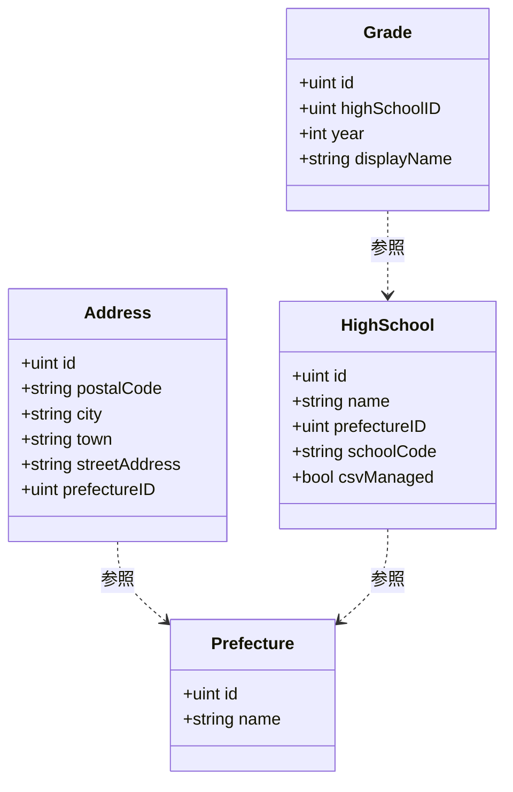
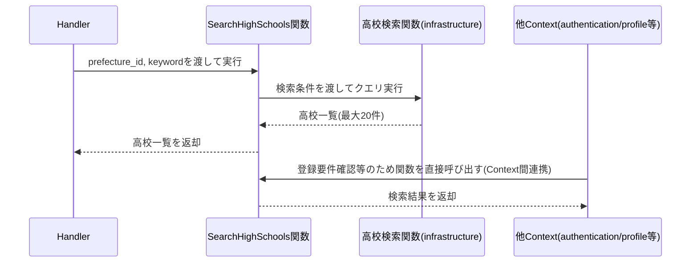

# 共通マスタ参照機能 Go移行・設計仕様書

---

# 1. 機能概要

## 機能概要

会員登録やプロフィール編集の際に、ユーザーが都道府県・住所・在籍高校・学年を選択肢として選べるように、これらのマスタ情報を検索・参照する機能である。Rails現行仕様では、都道府県一覧取得・住所検索（都道府県ID必須、市区町村・町域で絞り込み）・高校検索（都道府県ID・キーワードで絞り込み、最大20件）・学年一覧取得（高校ID指定）の4操作を提供する。いずれも新規データの作成・更新・削除は行わない参照専用の機能である。

## 利用者

- 会員登録前の未ログインユーザー（都道府県・高校・学年の検索）
- ログイン中のユーザー（住所の検索。プロフィール編集などで利用する）

## 業務上の目的

- ユーザーが会員登録・プロフィール編集の際に、都道府県・住所・在籍高校・学年を選択肢として選べるようにする
- 在籍高校が生徒コード管理対象校（`csv_managed`）かどうかを、登録フォーム側が判定できるようにする
- 高校配下の学年を、高校ごとに一意な選択肢として提供する

---

# 2. 設計方針

本機能はマスタデータの参照のみで完結するため、過度な抽象化を避け、シンプルな読み取り専用の構造とする。

- 責務分離: 検索条件の組み立てとレスポンス整形を分離する
- 保守性: 都道府県・住所・高校・学年の属性追加に対して変更範囲を限定する
- テスト容易性: 絞り込み条件ごとの取得結果を業務操作単位で検証できるようにする
- API互換性: 既存エンドポイント・レスポンス構造・認証要否（住所検索のみ認証必須）を維持する
- 拡張性: 将来的に他Contextからの参照が増えても、検索責務を各Repository（実装上は参照関数）に閉じ込めておくことで影響範囲を限定する

---

# 3. Bounded Context

## Context名

- master-data

## Contextの責務

- 都道府県一覧の保持・参照提供
- 住所（郵便番号・市区町村・町域）の保持・検索提供（都道府県必須、市区町村・町域による絞り込み）
- 在籍高校の保持・検索提供（都道府県・キーワードによる絞り込み、上限20件）
- 高校配下の学年一覧の保持・参照提供

## 他Contextとの依存関係

- 特になし（本Context自体は他Contextのデータや業務ルールに依存しない）
- 一方で、本Contextは以下の複数Contextから参照専用の依存を受ける立場にある
  - authentication Context: 新規登録時の高校・学年の実在確認、生徒コード指定時の学校コード整合確認（高校の`school_code`参照）に利用する
  - profile Context: プロフィール更新時の住所ID実在確認に利用する
  - 管理者ユーザー管理・教員管理系Context（推測: `管理者教員管理機能`, `管理者管理者ユーザー機能`等、高校・学年を選択項目として持つ管理画面）: ユーザー登録・編集時の高校・学年の選択肢として利用する可能性がある。具体的な参照方法は各Contextの②文書側で個別に整理する

## 依存する理由

都道府県・住所・在籍高校・学年は、どのユーザー種別の登録・編集フォームからも共通して参照される選択肢データであり、業務ドメインとしての固有の意思決定（作成・更新・削除、状態遷移）を持たない。Rails現行仕様書自体も、この4つのマスタを「共通マスタ参照機能」という1つの機能としてまとめて提供しており、常に一体で扱われるデータを無理に分割しない（規約「4. Bounded Context構成」のContext分割基準）という方針に沿って、1つのContextとして切り出す。他Contextからは、このContextが公開する参照手段を通じてのみアクセスされ、逆にmaster-data Context側は他Contextの内部実装に依存しない。

## 既知の関連Context

- school-directory Context（管理者高校学年参照機能）は、同じ `high_schools` / `grades` テーブルを参照するが、目的が異なる。master-data Contextは会員登録・プロフィール編集フォームの「選択肢提供」に特化した軽量な参照であるのに対し、school-directory Contextは管理者向けの高校・学年の一覧・詳細参照と、生徒数・教員数の集計という「運用状況の把握」を目的とする。両者は同一の物理テーブルに対する異なる切り口の参照Contextであり、責務は異なるが対象データが重複するという構造を持つ。現時点ではこの重複を統合する必要性は低いと判断し（推測: 集計要件の有無という明確な目的の違いがあるため）、別Contextとして維持する

---

# 4. 設計パターン

## 採用パターン

Transaction Script

## 判断根拠

本機能は、都道府県一覧取得・住所検索・高校検索・学年一覧取得という4つの参照操作のみで構成され、状態管理・権限制御（一部認証要否はあるが業務ルールとしての権限制御ではない）・複雑な業務ルールのいずれも現行仕様に存在しない。Prefecture・Address・HighSchool・Gradeはいずれも単純なマスタデータであり、更新や状態遷移を伴わない。

- ドメインロジックの複雑さ: 「都道府県IDで絞り込む」「市区町村・町域に部分一致する」「高校名に部分一致する」「上位20件に制限する」という、いずれも検索条件の組み立てレベルの単純な処理のみで構成される
- 状態管理の有無: 4つのEntityいずれも状態を持たない（Rails現行仕様書「7. 状態管理」にも「該当なし」と明記されている）
- 業務ルールの複雑さ: 住所検索における「都道府県ID必須」という制約以外に、複数のEntityが絡む業務ルールは存在しない
- 将来の拡張性: 将来的に検索条件（例: 郵便番号による絞り込み等）が追加される場合でも、参照ロジック自体は検索条件の追加で対応でき、Transaction Scriptのまま拡張可能である
- テスト容易性: 入力条件（都道府県ID・市区町村・町域・キーワード・高校ID等）に対する出力を検証するだけでよく、Entityの状態遷移を検証する必要がない

複数Contextから参照される共通データであるという性質は、Context分割の判断（「3. Bounded Context」）には影響するが、参照ロジック自体の複雑さには影響しない。参照専用かつ単純な検索条件のみで完結するマスタデータであるという性質から、Domain ModelやActive Recordのような、Entityへ振る舞いや永続化責務を集約するパターンを採用するメリットは薄く、Transaction Scriptを基本方針とする。

## 採用しなかったパターン

### Active Record

- 都道府県・住所・高校・学年に対する作成・更新・削除処理が本機能に存在しないため、モデルに保存・更新責務を持たせる意味がない

### Domain Model

- 都道府県・住所・高校・学年は状態も振る舞いも持たない完全なマスタ参照データであり、Entityに業務ルールを集約するメリットがない

### Event Sourcing

- 履歴管理・監査要件が現行仕様に存在しない

---

# 5. Aggregate設計

不要と判断する。

理由: 更新を伴わない参照専用データであり、整合性を保証すべき書き込み境界が存在しない。Prefecture・Address・HighSchool・Gradeは、それぞれ独立した検索対象として扱う（HighSchoolとGradeのみ「高校に属する学年」という1対多の参照関係を持つが、これも書き込み整合性の単位ではなく、単純な検索条件としての関係にとどまる）。

---

# 6. Entity設計

## Prefecture

- 役割: 都道府県のマスタ情報を表す概念
- ライフサイクル: 本機能では扱わない（参照専用）
- 状態変化: なし
- 保持する責務: 都道府県名の保持
- 判断根拠: 住所・高校の絞り込み条件として参照される、独立したマスタ概念であるため

## Address

- 役割: 住所（郵便番号・市区町村・町域・番地）のマスタ情報を表す概念
- ライフサイクル: 本機能では扱わない（参照専用）
- 状態変化: なし
- 保持する責務: 郵便番号・市区町村・町域・番地・都道府県IDの保持
- 判断根拠: プロフィール編集時の住所選択に用いる中心的な参照対象であるため

## HighSchool

- 役割: 在籍高校のマスタ情報を表す概念
- ライフサイクル: 本機能では扱わない（参照専用）
- 状態変化: なし
- 保持する責務: 高校名・都道府県ID・学校コード・`csv_managed`区分の保持
- 判断根拠: 会員登録時の高校選択、および生徒コード管理対象校かどうかの判定に用いる中心的な参照対象であるため

## Grade

- 役割: 高校ごとの学年のマスタ情報を表す概念
- ライフサイクル: 本機能では扱わない（参照専用）
- 状態変化: なし
- 保持する責務: 高校ID・学年（`year`）・表示名の保持
- 判断根拠: 会員登録・プロフィール編集時の学年選択に用いる参照対象であるため

---

# 7. Value Object設計

不要と判断する。

理由: 都道府県名・郵便番号・市区町村・町域・高校名・学校コード・`csv_managed`・学年（`year`）・表示名などの属性は、いずれも単純な値であり、独自の比較ロジックや業務ルールを持たない。都道府県・キーワードによる絞り込みも単純な等価条件・部分一致条件であり、Value Object化によるメリットが薄い。将来的に郵便番号のフォーマット検証など、検索条件自体に業務ルールが必要になった場合は、Value Object化を再検討する余地がある。

---

# 8. Domain Service

不要と判断する。

理由: 本機能には業務ルールと呼べる判定処理が存在せず、都道府県・市区町村・町域・キーワード・高校IDによる検索条件の組み立てのみで処理が完結するため。

---

# 9. クラス図

Transaction Script採用のため、実装時は各Entityに対応する検索専用の参照関数がinfrastructure層に直接実装されるが（4章参照）、業務概念としての関係は以下のとおり整理する。

Value Object・Domain Serviceは「7. Value Object設計」「8. Domain Service」のとおり不要と判断したため、クラス図には含めない。

---

# 10. 状態遷移図

該当なし。Prefecture・Address・HighSchool・Gradeはいずれも状態を持たない参照専用のマスタデータであり（Rails現行仕様書「7. 状態管理」にも「該当なし」と明記されている）、状態遷移という概念自体が存在しないため省略する。

---

# 11. Repository設計

**実装上の位置づけ**: 本機能はTransaction Script採用のため、Repository Interfaceをdomain層に定義しない。以下は永続化・検索責務の設計意図であり、実装時はinfrastructure層の関数として直接実装する（規約: アーキテクチャ規約.md「3. 設計パターンごとの構造適用方針」）。

## PrefectureRepository

- 管理対象: Prefecture
- 責務: 都道府県一覧の取得
- 保持する検索機能: なし（全件取得のみ）
- 保持しない責務: 都道府県の作成・更新・削除
- 判断根拠: 参照処理に特化させ、業務ロジックを持たせないため

## AddressRepository

- 管理対象: Address
- 責務: 都道府県ID・市区町村・町域による住所検索（都道府県情報を含めて返却する）
- 保持する検索機能:
  - prefecture_idによる絞り込み（必須）
  - cityによる部分一致絞り込み（任意）
  - townによる部分一致絞り込み（任意）
- 保持しない責務: 住所の作成・更新・削除
- 判断根拠: 参照処理に特化させ、prefecture_id必須という制約自体はPresentation層のバリデーションで扱う（「15. Validation設計」参照）ため

## HighSchoolRepository

- 管理対象: HighSchool
- 責務: 都道府県ID・キーワードによる高校検索（名称順・最大20件）
- 保持する検索機能:
  - prefecture_idによる絞り込み（任意）
  - キーワードによる高校名部分一致絞り込み（任意）
  - 名称昇順ソート・最大20件の件数制限
- 保持しない責務: 高校の作成・更新・削除、生徒数・教員数の集計（school-directory Contextの責務）
- 判断根拠: 会員登録フォーム向けの軽量な選択肢検索に特化させ、school-directory Contextが担う管理者向け集計とは責務を分離するため

## GradeRepository

- 管理対象: Grade
- 責務: 高校IDによる学年一覧取得
- 保持する検索機能:
  - high_school_idによる絞り込み（必須）
- 保持しない責務: 学年の作成・更新・削除
- 判断根拠: 参照処理に特化させ、業務ロジックを持たせないため

---

# 12. UseCase設計

**実装上の位置づけ**: 本機能はTransaction Script採用のため、UseCase層（struct）を設けない。以下は業務操作の設計意図であり、実装時はapplication層の関数として直接実装する。

## ListPrefectures

- 目的: 都道府県一覧を取得する
- 入力: なし
- 出力: 都道府県一覧
- トランザクション範囲: 読み取りのみ、トランザクションは不要
- 呼び出す関数: 都道府県検索関数（PrefectureRepositoryの設計意図をinfrastructure層の関数として実装）
- 判断根拠: 条件なしの全件取得であり、業務ルールが存在しないため

## SearchAddresses

- 目的: 都道府県・市区町村・町域で絞り込んで住所を検索する
- 入力: prefecture_id（必須）, city（任意）, town（任意）
- 出力: 住所一覧（都道府県情報を含む）
- トランザクション範囲: 読み取りのみ、トランザクションは不要
- 呼び出す関数: 住所検索関数（AddressRepositoryの設計意図をinfrastructure層の関数として実装）
- 判断根拠: 単一の検索条件による一覧取得であり、複数の検索関数を組み合わせる必要がないため

## SearchHighSchools

- 目的: 都道府県・キーワードで絞り込んで在籍高校を検索する
- 入力: prefecture_id（任意）, keyword（任意）
- 出力: 高校一覧（最大20件）
- トランザクション範囲: 読み取りのみ、トランザクションは不要
- 呼び出す関数: 高校検索関数（HighSchoolRepositoryの設計意図をinfrastructure層の関数として実装）
- 判断根拠: 単一の検索条件による一覧取得であり、件数制限（20件）も検索関数内で完結するため

## ListGrades

- 目的: 指定した高校に属する学年一覧を取得する
- 入力: high_school_id（必須）
- 出力: 学年一覧
- トランザクション範囲: 読み取りのみ、トランザクションは不要
- 呼び出す関数: 学年検索関数（GradeRepositoryの設計意図をinfrastructure層の関数として実装）
- 判断根拠: 単一の検索条件による一覧取得であり、業務ルールが存在しないため

---

# 13. シーケンス図・処理フロー図

## シーケンス図（SearchHighSchools）

Transaction Script採用のためUseCase層・Repository Interfaceはなく、Handlerがapplication層の関数を、application層の関数がinfrastructure層の検索関数を直接呼び出す（4章参照）。他Context（authentication, profile等）からの参照が発生する場合の呼び出し経路も併せて示す。

## 処理フロー図

単純な条件分岐（都道府県ID・キーワードの有無）のみで構成される参照処理であり、状態遷移や複雑な業務判断を伴わないため、処理フロー図は省略する。分岐は「検索条件が指定されているか」という単純なパラメータの有無のみであり、フローチャートによる可視化の必要性が低い。

---

# 14. Transaction設計

## Transaction開始位置

- なし

## Transaction終了位置

- なし

## 理由

状態を変更する処理が存在しないため、トランザクションによる整合性保証は不要である。

---

# 15. Validation設計

## Presentation

- 型チェック: prefecture_id・high_school_idが数値であること、city・town・keywordが文字列であることを検証する
- 必須チェック: 住所検索における`prefecture_id`、学年一覧取得における`high_school_id`の必須チェックを行う
- フォーマットチェック: 特になし

## Domain

- 業務ルール: 特になし
- 状態チェック: 特になし
- 整合性チェック: 特になし

## 責務分離

本機能は業務ルールを持たないため、Presentation層での型チェック・必須チェックのみで入力検証が完結する。Domain側で追加の妥当性判定は行わない。

## バリデーション仕様

|フィールド|検証層|ルール|エラーメッセージ方針|
|-|-|-|-|
|prefecture_id（住所検索）|Presentation|必須・数値|「都道府県は必須です。」|
|prefecture_id（高校検索）|Presentation|任意・数値|（未指定時は絞り込みなしとして扱う）|
|city / town|Presentation|任意・文字列（空文字は絞り込み条件として扱わない）|（エラーとしない）|
|keyword|Presentation|任意・文字列|（エラーとしない）|
|high_school_id（学年一覧取得）|Presentation|必須・数値|「高校の指定が不正です」|

---

# 16. Authorization設計

## Middleware

- `PrefecturesController#index` / `HighSchoolsController#index` / `GradesController#index` 相当のエンドポイントは認証チェックの対象外とし、未ログイン状態でも利用可能とする
- `AddressesController#index` 相当のエンドポイントのみ、認証済みユーザーであることを確認する

## Handler

- 業務権限判定は持たせない

## UseCase

- 権限判定は行わない（認証が必要な住所検索についても、ロールによる絞り込みは行わず、ログイン中であればどのロールでも利用可能）

## Domain

- 権限判定は行わない

## 判断理由

Rails現行仕様書「8. 権限制御」に「`AddressesController#index`のみ認証が必須であり、未ログインの場合は401エラーとなる。ログイン中であれば、ロールによらずいずれのユーザーも利用できる」「他の3エンドポイントは認証不要」と明記されており、本機能は会員登録前後を問わず広く参照される公開マスタ参照機能であるため、住所検索のみの認証要否という単純な制御にとどめる。

---

# 17. Error設計

## Domain Error

責務: 本機能では業務ルール違反が発生しないため、原則として使用しない

## Application Error

責務: 取得処理自体の失敗（想定外の検索条件など）を表現する

## Infrastructure Error

責務: DB接続失敗など、永続化層の技術的な障害を表現する

判断理由: 本機能は単純な参照処理であり、業務エラーがほぼ発生しないため、Application Error・Infrastructure Errorを中心としたシンプルなエラー設計とする。

## エラー仕様

|業務シナリオ|エラー種別|発生層|想定するHTTPステータス|
|-|-|-|-|
|住所検索でprefecture_id未指定|Validation|Presentation|400|
|住所検索で未ログイン|Unauthorized|Presentation(Middleware)|401|
|検索条件に一致するデータがない（高校検索・学年一覧取得）|—（正常系。空配列を返す）|—|200|
|DB接続失敗等の想定外エラー|Internal|Infrastructure|500|

住所検索の`prefecture_id`未指定エラーは、他機能の入力検証エラー（多くは422）とは異なりRails現行仕様上400を返す。フロントエンド互換性を優先し、本書ではこの挙動をそのまま維持する（ステータスコード規約の統一自体は、規約「アーキテクチャ規約.md」15章に挙げられているプロジェクト全体の未定義課題であり、本機能単独で解決する範囲を超えるため踏み込まない）。

---

# 18. Domain Event

不要と判断する。

理由: 参照のみの機能であり、他処理への通知が必要な副作用が現行仕様に存在しないため（Rails現行仕様書「9. 非同期処理」にも「本機能に関連するJob・Mailerは存在しない」と明記されている）。

---

# 19. API仕様

## エンドポイント一覧

|エンドポイント|HTTP Method|概要|
|-|-|-|
|/api/v1/prefectures|GET|都道府県一覧取得|
|/api/v1/addresses|GET|住所検索|
|/api/v1/high_schools|GET|高校検索|
|/api/v1/high_schools/:high_school_id/grades|GET|学年一覧取得|

## 各エンドポイントの仕様

- 都道府県一覧取得: パラメータなし。認証不要。Responseは都道府県の配列（`id`, `name`）
- 住所検索: クエリパラメータ`prefecture_id`（必須）/`city`（任意）/`town`（任意）。認証必須。Responseは住所の配列（`id`, `postal_code`, `city`, `town`, `prefecture`）
- 高校検索: クエリパラメータ`prefecture_id`（任意）/`keyword`（任意）。認証不要。Responseは高校の配列（`id`, `name`, `csv_managed`）、名称昇順・最大20件
- 学年一覧取得: パスパラメータ`high_school_id`（必須）。認証不要。Responseは学年の配列（`id`, `year`, `display_name`）

Status Code:

- 200: 取得成功（該当なしの場合も空配列で200）
- 400: 住所検索でprefecture_id未指定
- 401: 住所検索で未ログイン

## Railsとの差分

- Rails仕様: 上記4エンドポイントをそのまま維持する
- Go設計での変更: なし（URL・HTTP Method・認証要否・レスポンス構造・ステータスコードを維持する）
- 変更理由: フロントエンドとの互換性を優先するため
- 影響範囲: なし

JSONスキーマの厳密な型定義・Goの構造体は③Go実装仕様書で扱う。

---

# 20. DB設計方針

## 現行DBを利用するか

- 既存Rails DBを継続利用する

## Schema変更有無

- 変更なし

## 変更理由

- 現行の`prefectures`・`addresses`・`high_schools`・`grades`テーブルで本機能の要件を満たしているため
- 参照のみの機能であり、追加スキーマは不要である

## 変更を提案しない理由

- 参照専用の機能であり、現行スキーマに構造的な問題は確認できないため

---

# 21. DB操作仕様

|Repository|対象テーブル|操作種別|主な検索条件・絞り込み条件|関連テーブルとの結合|ページネーション/ソート|
|-|-|-|-|-|-|
|PrefectureRepository|prefectures|参照|なし（全件）|なし|ソート順は現行仕様に明記なし（推測: id昇順または登録順のまま返却する）|
|AddressRepository|addresses|参照|prefecture_id（必須）、city（部分一致・任意）、town（部分一致・任意）|prefecturesとの結合（都道府県情報を含めて返却するため）|明記なし（推測: 全件返却。件数上限の記載がないため）|
|HighSchoolRepository|high_schools|参照|prefecture_id（任意）、keyword（高校名部分一致・任意）|なし（レスポンスに`id`, `name`, `csv_managed`のみを含み、都道府県情報は含まれない仕様のため）|名称昇順、最大20件|
|GradeRepository|grades|参照|high_school_id（必須）|なし|明記なし（推測: `year`昇順が自然だが、現行仕様書に記載がないため未確定とする）|

具体的なSQL・GORMのクエリコードは③Go実装仕様書（`規約/Gorm規約.md`）で扱う。

---

# 22. テスト戦略

## Domain Test

- 対象なし（業務ルールが存在しないため、Domain層の単体テストは最小限とする）

## UseCase Test

- 目的: 各検索条件（prefecture_id・city・town・keyword・high_school_idの有無）による取得結果の違いを検証する

## Repository Test

- 目的: 各Repositoryの検索条件（都道府県絞り込み・部分一致・件数制限20件・prefecture結合）の正確性を検証する

## Handler Test

- 目的: リクエストパラメータの検証結果（住所検索のprefecture_id必須チェック等）と認証要否、レスポンス形式を検証する

## Integration Test

- 目的: エンドポイント経由で都道府県一覧・住所検索・高校検索・学年一覧が正しく取得できること、および住所検索の認証要否が正しく機能することを確認する

---

# 23. Railsとの責務対応

| Rails | Go | 設計方針 |
|---|---|---|
| Controller | Handler | HTTP入力の受け取りとレスポンス整形に限定する |
| Query（`AddressesQuery`, `HighSchoolsQuery`） | Repository（検索条件、実装上はinfrastructure層の関数） | 検索条件の組み立てを検索関数に集約する |
| Model | Entity + Repository（実装上は関数） | 属性保持はEntity、永続化・検索は検索関数として整理する |
| Serializer | Response DTO | レスポンス整形を明示的な層として分離する |

---

# 24. 採用しなかった設計

## Active Record

- 採用しなかった理由: 都道府県・住所・高校・学年に対する更新処理が存在しないため、モデルに保存・更新責務を持たせる意義がない
- 将来的に採用する可能性: 管理者向けのマスタ編集機能（都道府県・高校・学年の追加/修正）が同一Contextに実装される場合は再検討の余地がある

## Domain Model

- 採用しなかった理由: 都道府県・住所・高校・学年が状態も振る舞いも持たない完全なマスタ参照データであるため
- 将来的に採用する可能性: 現時点では想定していない

## Event Sourcing

- 採用しなかった理由: 履歴・監査要件が現行仕様に存在しないため
- 将来的に採用する可能性: 現時点では想定していない

---

# 25. 設計判断サマリー

| 項目 | 採用 | 判断理由 |
|---|---|---|
| 設計パターン | Transaction Script | 状態管理・複雑な権限制御・業務ルールがない単純な参照機能のため |
| Aggregate | 未採用 | 書き込みの整合性境界が不要なため |
| Transaction境界 | 未使用 | 状態変更を伴わないため |
| Domain Event | 未採用 | 他処理への通知要件がない |
| Value Object | 未採用 | 属性が単純な値であり、独自ルールを持たないため |
| Authorization | 住所検索のみ認証必須、他3エンドポイントは認証不要 | Rails現行仕様の権限制御をそのまま踏襲するため |
| Context構成 | Prefecture/Address/HighSchool/Gradeを単一Context（master-data）に統合 | 常に一体で扱われる選択肢データであり、複数Contextから共通参照されるため |

---

# 設計差分管理

## Rails現行仕様

- `AddressesQuery`・`HighSchoolsQuery`というQuery Objectで検索条件を組み立てている
- 各Controllerの`as_json`相当の処理でレスポンスを整形している
- 住所検索のprefecture_id未指定エラーのみ400、他の入力検証は多くの機能で422が使われるという、ステータスコードの不統一が既に現行仕様に存在する

## Go設計での変更内容

- Query Objectを個別に設けず、各検索責務をRepository（実装上はinfrastructure層の検索関数）の検索条件として統合する
- レスポンス整形をPresenter / Response DTOとして明示的な層に分離する
- ステータスコードの不統一（住所検索のみ400）は、フロントエンド互換性を優先しそのまま維持する

## 変更理由

- 本機能の検索条件はいずれも単純であり、Query Objectを独立させるほどの複雑さがないため、検索関数に統合することでレイヤーを簡潔に保つ
- レスポンス整形を明示的な層として分離することで、APIレスポンス構造の変更が検索ロジックに影響しないようにするため

## 影響範囲

- フロントエンドから見たAPIの外部仕様（エンドポイント・認証要否・レスポンス構造・ステータスコード）は変更しない
- 既存DBスキーマは維持するため、データ移行は不要
- 本Contextを参照する他Context（authentication, profile等）の②文書側では、本書で整理した参照手段（PrefectureRepository/AddressRepository/HighSchoolRepository/GradeRepositoryの設計意図）を、規約「5. Context間連携ルール」に従って呼び出す前提で設計されている
