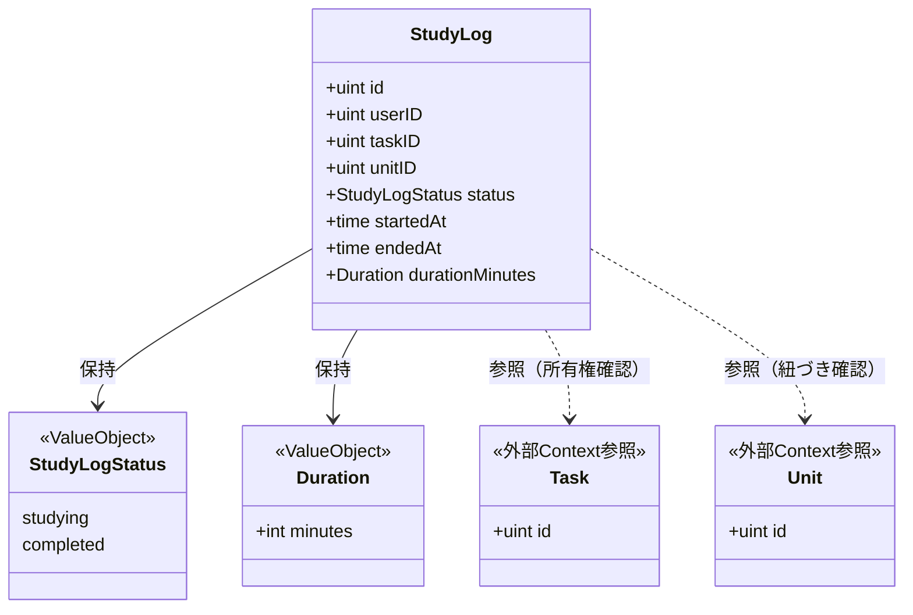
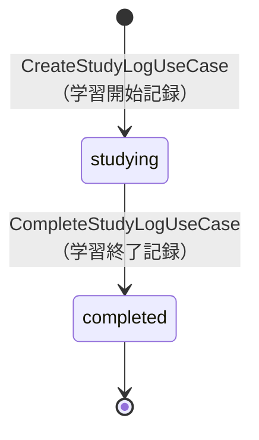
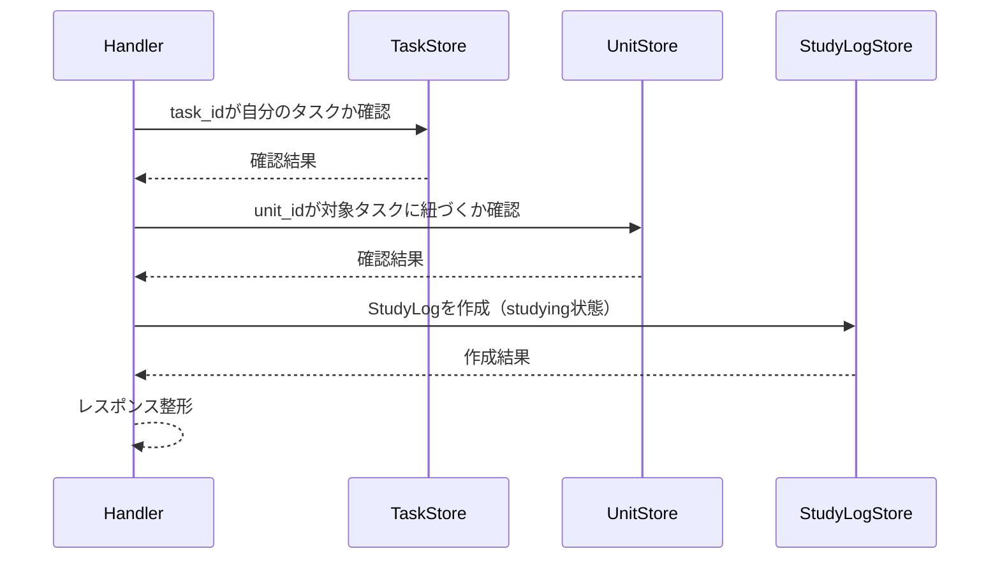

# 学習ログ機能 Go移行・設計仕様書

---

# 1. 機能概要

## 機能概要

生徒がタスク内の単元学習にどれだけ取り組んだかを記録する機能である。Rails現行仕様では、学習開始記録（作成）と学習終了記録（完了）の2操作を提供する。同一のタスク・単元に対して、学習セッションごとに複数の学習ログを作成できる。

## 利用者

- 生徒ユーザー（student ロール）
- 自分のタスク・単元・学習ログのみ操作可能

## 業務上の目的

- 生徒がどの単元学習にどれだけ時間をかけたかを可視化する
- 学習セッション単位で開始・終了・所要時間を記録し、将来の学習分析の基礎データとする

---

# 2. 設計方針

本機能は、開始・完了という2操作のみで完結し、業務ルールも「所有権の確認」「未完了であることの確認」「所要時間の算出」という単純な範囲にとどまるため、過剰な抽象化を避けたシンプルな設計とする。

- 責務分離: 所有権チェック・状態チェック・所要時間算出・永続化を分離する
- 保守性: 学習ログの状態と所要時間算出ロジックをEntity側に寄せ、変更に強い構造とする
- テスト容易性: 開始・完了それぞれの振る舞いを独立して検証できるようにする
- 拡張性: 将来的に学習セッションの一時中断・再開等が追加された場合でも、コアロジックへの影響を限定できる構造にする
- API互換性: 既存エンドポイントと主要なリクエスト・レスポンス構造を維持する

---

# 3. Bounded Context

## Context名

- study-log

## Contextの責務

- タスク内の単元学習の開始記録の作成
- 学習ログの完了（終了時刻・所要時間の記録）

## 他Contextとの依存関係

- Task Context: 対象タスクが生徒自身のものであることの確認に依存する
- Unit Context（curriculum）: 対象単元が指定タスクに紐づいていることの確認に依存する
- User Context: 認証済み生徒の識別に依存する

## 依存する理由

学習ログは単独で存在する概念ではなく、「どのタスクの、どの単元の学習か」という関係が前提となる。そのため、学習ログの作成・完了いずれの操作でも、対象タスク・単元の存在確認のためにTask Context・Unit Contextへの参照依存が発生する。ただし、学習ログ自体の作成・完了処理がタスクや単元の状態を変更することはなく、依存は「存在確認・所有権確認のための参照」に限定される。

なお、同じタスク・単元配下では、生徒が問題に解答し正誤判定・提出処理を行う問題解答機能（question-answering Context）も並行して提供されている。両Contextは同じタスク・単元を対象とするが、互いのデータを参照・更新することはなく、それぞれ独立して「学習時間の記録」「解答の正誤・提出」という別の業務関心を扱うため、依存関係としては扱わない。

---

# 4. 設計パターン

## 採用パターン

Active Record

## 判断根拠

本機能は、学習ログの作成（開始記録）と更新（完了記録）という2操作のみで構成される。状態は「学習中」「完了」の2つのみで、遷移も「学習中→完了」という一方向・単純な遷移であり、分岐や複数の遷移経路を持たない。業務ルールも「対象タスク・単元が自分のものであること」「既に完了している学習ログを重ねて完了させられないこと」という限定的な範囲にとどまる。

- 主要操作が開始・完了の2操作のみで、CRUDに近い単純さを持つ
- 状態遷移は存在するが、一方向・単一経路であり、複数の業務ルールが絡み合うものではない
- 所要時間の算出（開始時刻からの経過時間を分単位で算出）は、学習ログEntity自身の属性から導出できる単純な計算であり、Entityのメソッドとして自然に表現できる

このため、状態を持つEntityであっても直ちにDomain Modelを選択する必要はなく、「Domain Model採用基準」（状態遷移ルールが複数の業務ルールと絡み合う場合に採用する）には該当しない。CRUD中心の業務として、Entity/Storeに保存・更新の責務を寄せやすいActive Recordを採用する。

## 採用しなかったパターン

### Transaction Script

所有権チェック・完了済みチェック・所要時間算出をユースケースに直接書き続けることは可能だが、開始・完了それぞれの検証と算出ロジックをEntity側にまとめた方が、将来的なルール追加（例: 最小学習時間の検証等）に対して変更箇所を限定しやすい。

### Domain Model

状態は「学習中」「完了」の2つのみであり、遷移は一方向・単一経路で、複数の業務ルールが絡み合う複雑さは現行仕様に存在しない。DDDを目的化してEntityに過度な振る舞いを持たせることは「Domain Model採用基準」に反するため見送る。

### Event Sourcing

学習セッションの開始・終了イベントの再構築・監査要件は現行仕様に存在しない。

---

# 5. Aggregate設計

Aggregateを大きく分ける必要はなく、StudyLog単体を中心に扱う。

## Aggregate Root

- StudyLog

## Aggregateに含めるEntity

- StudyLogのみ（Task / Unitは含めない）

## Aggregate境界

- StudyLogは自身の状態（学習中／完了）・開始時刻・終了時刻・所要時間の整合性のみを保証する単位とする
- Task / Unitは、対象確認のための外部参照として扱い、それらの整合性はそれぞれのContextの責務とする

## 整合性を保証する単位

- StudyLog単体の作成・完了

理由: 学習ログの作成・完了は、タスクや単元の状態を変更する業務ルールを伴わないため、Task / UnitとStudyLogを1つのAggregateとして統合する必要はない。

---

# 6. Entity設計

## StudyLog

- 役割: 生徒がタスク内の単元学習に取り組んだ開始・終了・所要時間を表す中心的なドメイン概念
- ライフサイクル: 作成（学習中） → 完了
- 状態変化: `studying`（学習中） → `completed`（完了）
- 保持する責務:
  - user_id / task_id / unit_id、状態（`studying` / `completed`）、開始時刻・終了時刻・所要時間を保持する
  - 完了操作時に、既に完了状態でないことを検証する
  - 完了操作時に、開始時刻から終了時刻までの経過時間を分単位（切り捨て）で算出する
- 判断根拠: 学習ログの主要な業務情報と、単純ながら状態変化・所要時間算出という振る舞いの中心であるため

## Task（参照専用）

- 役割: 学習ログの作成・完了時に、対象タスクが生徒自身のものであることの確認対象として参照される
- 判断根拠: 本機能の中心はStudyLogであり、Taskの実体管理はTask Contextの責務であるため、本機能では参照専用として扱う

## Unit（参照専用）

- 役割: 学習ログの作成時に、対象単元が指定タスクに紐づいていることの確認対象として参照される
- 判断根拠: 本機能の中心はStudyLogであり、Unitの実体管理はUnit（curriculum）Contextの責務であるため、本機能では参照専用として扱う

---

# 7. Value Object設計

## StudyLogStatus

- 採用理由: 状態値を文字列のまま扱うと、無効な値の混入や、完了済みの学習ログを再度完了させるといった不正な遷移を防げないため
- 独自ルール: `studying` / `completed`のいずれかのみ許容し、`completed`から`studying`への逆遷移は許可しない
- Entity属性ではなくValue Objectにする理由: 状態の意味と許容される遷移方向を型として明示し、完了済みチェックのロジックを一元化するため

## Duration（所要時間）

- 採用理由: 所要時間は「開始時刻から終了時刻までの経過時間を分単位・切り捨てで算出する」という業務上のルールを持つ計算値であり、算出ロジックを一元化する必要があるため
- 独自ルール: 開始時刻・終了時刻から分単位（切り捨て）で算出する
- Entity属性ではなくValue Objectにする理由: 算出ロジックを一元化し、表示・保存の両方で同じ計算結果を再利用できるようにするため

## Value Objectを採用しないもの

- 開始時刻・終了時刻そのもの（`started_at` / `ended_at`）: 単純な日時属性であり、比較・算出以外の独自ルールを持たないため、Value Object化は不要とする（所要時間算出のロジックはDuration側に集約する）

---

# 8. Domain Service

不要と判断する。

理由: 所有権確認（対象タスク・単元が自分のものか）はTask Context・Unit Contextの参照結果に基づく単純な照合であり、複数のEntityを横断する業務ルールとしての複雑さを持たない。完了時の状態チェック・所要時間算出はいずれもStudyLog単体の振る舞いとして表現でき、独立したDomain Serviceを設ける必要はない。

---

# 9. クラス図

Active Record採用のため実装時はStudyLogが単一のstructとメソッドに統合されるが（4章参照）、業務概念としての関係は以下のとおり整理する。

Goのstruct定義（フィールドの可視性・タグ等）は③Go実装仕様書で扱う。

---

# 10. 状態遷移図

StudyLog.statusは以下の状態を持つ（「6. Entity設計」の状態変化を可視化したもの）。

遷移条件:

- `studying`から`completed`への遷移時は、終了時刻を記録し、所要時間（Duration）を算出する

禁止される組み合わせ:

- `completed`から`studying`への逆遷移、および`completed`状態の学習ログを再度完了させる操作は許可されない

---

# 11. Repository設計

**実装上の位置づけ**: 本機能はActive Record採用のため、Repository Interfaceをdomain層に定義しない。以下は永続化・検索責務の設計意図であり、実装時はEntity相当のstructと同一packageに置くStore(例: `〇〇Store`)として直接実装する(規約: アーキテクチャ規約.md「3. 設計パターンごとの構造適用方針」)。

## StudyLogStore

- 管理対象: StudyLog
- 責務:
  - 学習開始記録（新規作成）
  - 指定学習ログの取得
  - 完了記録（更新）
- 保持する検索機能:
  - user_id + task_id + unit_id + idによる単一取得
- 保持しない責務:
  - 所有権判定そのもの（Handlerが呼び出すTaskStore/UnitStoreの確認結果を前提とする）
  - 完了可否の最終判断（StudyLogのメソッドとしてEntity側が担う）
- 判断根拠: 永続化と検索に特化させ、業務ロジックを持たせないため

## TaskStore（参照用）

- 管理対象: Task（本Contextでは読み取り専用）
- 責務: 指定task_idのタスクが、current userのものであるかの確認
- 保持しない責務: タスクの作成・更新（Task Contextの責務）
- 判断根拠: 対象確認に必要な最小限の参照に限定するため

## UnitStore（参照用）

- 管理対象: Unit（本Contextでは読み取り専用）
- 責務: 指定unit_idの単元が、対象タスクに紐づいているかの確認
- 保持しない責務: 単元の作成・更新（Unit Contextの責務）
- 判断根拠: 対象確認に必要な最小限の参照に限定するため

---

# 12. UseCase設計

**実装上の位置づけ**: 本機能はActive Record採用のため、UseCase層(struct)を設けない。以下はHandlerが行う業務操作の設計意図であり、実装時はHandlerがStoreを直接呼び出す処理として実装する。

## CreateStudyLog(Handler処理)

- 目的: タスク内の単元学習の開始を記録する
- 入力: current user, task_id, unit_id
- 出力: 作成した学習ログのID
- トランザクション範囲: 対象タスク・単元の存在確認とStudyLogの作成を1トランザクションで扱う
- 呼び出すStore: TaskStore, UnitStore, StudyLogStore
- 判断根拠: 対象タスク・単元がユーザーの操作可能な範囲内であることを確認したうえで作成する必要があるため

## CompleteStudyLog(Handler処理)

- 目的: 開始済みの学習ログを完了させ、終了時刻と所要時間を記録する
- 入力: current user, task_id, unit_id, study_log_id
- 出力: 更新後の学習ログ情報（id, status, started_at, ended_at, duration_minutes）
- トランザクション範囲: 対象学習ログの取得・完了可否チェック・更新を1トランザクションで扱う
- 呼び出すStore: StudyLogStore
- 判断根拠: 既に完了している学習ログの二重完了を防ぐため、チェックと更新を一貫して行う必要があるため

---

# 13. シーケンス図・処理フロー図

## シーケンス図（CreateStudyLog）

Active Record採用のためUseCase層はなく、Handlerが各Storeを直接呼び出す（4章参照）。

## 処理フロー図（CompleteStudyLog）

完了可否の分岐が単純なため、フローチャートは省略する。理由: 「対象学習ログが自分のものか」「既に完了していないか」という2条件の直列判定のみであり、分岐が複雑化する要素がないため、「13. シーケンス図・処理フロー図」の説明で十分に表現できる。

---

# 14. Transaction設計

## Transaction開始位置

- Handlerの処理単位に対応するStoreメソッド内でトランザクションを開始する

## Transaction終了位置

- CreateStudyLogの処理では、対象確認とStudyLog作成が完了した時点でコミットする
- CompleteStudyLogの処理では、完了可否チェックと更新が完了した時点でコミットする

## 理由

- いずれも単一のStudyLogレコードに対する作成・更新であり、複数テーブルにまたがる整合性維持は不要である
- Handlerの処理単位で境界を明確にし、テスト・保守のしやすさを確保するため

---

# 15. Validation設計

## Presentation

- 型チェック: `task_id` / `unit_id` / `id`が数値であることを検証する
- 必須チェック: いずれのパスパラメータも必須であることを検証する
- フォーマットチェック: 特になし（数値形式チェックのみ）

## Domain

- 業務ルール: 対象タスクが自分のものであること、対象単元が対象タスクに紐づいていること
- 状態チェック: 完了操作時に、対象学習ログが既に完了状態でないこと
- 整合性チェック: 対象学習ログが自分のものであること

## 責務分離

- Presentationは「入力値の形式が正しいか」を担当する
- Domainは「その操作が業務的に妥当か（所有権・状態）」を担当する

## バリデーション仕様

|フィールド|検証層|ルール|エラーメッセージ方針|
|-|-|-|-|
|task_id|Presentation|必須・数値形式|「タスクの指定が不正です」|
|unit_id|Presentation|必須・数値形式|「単元の指定が不正です」|
|id（学習ログID）|Presentation|必須・数値形式（完了操作時）|「学習ログの指定が不正です」|
|task_id|Domain|current userのタスクであること|「対象のタスクが見つかりません」|
|unit_id|Domain|対象タスクに紐づく単元であること|「対象の単元が見つかりません」|
|study_log|Domain|current userの学習ログであること|「対象の学習ログが見つかりません」|
|status|Domain|完了操作時に未完了（studying）であること|「この学習ログはすでに完了しています」|

---

# 16. Authorization設計

## Middleware

- 認証済みユーザーを特定し、ユーザー情報をコンテキストに保持する
- 役割がstudentであることを確認する

## Handler

- ルーティング層でAPIの入口を担当し、認証失敗時のHTTP応答を整える
- 具体的な業務権限判定は持たせない

## UseCase

- current userのスコープに基づいて、自分のタスク・単元・学習ログのみ操作できるようにする
- 対象タスク・単元・学習ログが自分のものかどうかをHandler/Store側で判断する

## Domain

- StudyLogがuser_idを保持し、Handler側からの所有権確認の材料を提供する

## 判断理由

Rails現行仕様も「`current_user`本人のタスク・単元・学習ログ」を起点に全検索を行うシンプルな設計であり、これをHandlerでのスコープ限定としてそのまま踏襲するのが自然である。

---

# 17. Error設計

## Domain Error

- 責務: 状態ルール違反（完了済み学習ログの再完了試行）を表現する
- 判断理由: 業務ルール違反をアプリケーション層に漏らさず、ドメイン側で明示的に扱うため

## Application Error

- 責務: 対象タスク・単元・学習ログが存在しない、または自分のものでない場合の失敗を表現する
- 判断理由: ユースケースの失敗理由をHTTPレスポンスに変換しやすくするため

## Infrastructure Error

- 責務: DB接続失敗・永続化失敗を表現する
- 判断理由: 永続化層の失敗をドメインに漏らさず、技術的な障害として切り分けるため

## エラー仕様

|業務シナリオ|エラー種別|発生層|想定するHTTPステータス|
|-|-|-|-|
|対象タスクが存在しない、または自分のものでない|NotFound|Application|404|
|対象単元がタスクに紐づいていない|NotFound|Application|404|
|対象学習ログが存在しない、または自分のものでない|NotFound|Application|404|
|対象学習ログが既に完了している|Validation|Domain|400|
|未認証|Unauthorized|Middleware|401|

---

# 18. Domain Event

本機能では現時点でDomain Eventを採用しない。理由は、Rails現行仕様書9章に「`StudyLog`の作成・完了に紐づくJob/Mailerは見当たらない」と明記されており、他処理への通知のような非同期の副作用が存在しないためである。

将来的に、学習時間の集計・分析機能と連携する要件が生まれた場合は、イベント化を検討する。

---

# 19. API仕様

## エンドポイント一覧

|エンドポイント|HTTP Method|概要|
|-|-|-|
|/api/v1/student/tasks/:task_id/units/:unit_id/study_logs|POST|単元学習の開始を記録|
|/api/v1/student/tasks/:task_id/units/:unit_id/study_logs/:id|PATCH|学習ログを完了させる|

## 各エンドポイントの仕様

- 学習開始記録: パスパラメータ`task_id`/`unit_id`。レスポンスは作成した学習ログのID
- 学習終了記録: パスパラメータ`task_id`/`unit_id`/`id`。レスポンスは`id`, `status`, `started_at`, `ended_at`, `duration_minutes`

Status Code:

- 200/201: 作成・更新成功の扱いは既存仕様に合わせて統一する
- 400: 既に完了している学習ログへの完了操作
- 404: 対象タスク・単元・学習ログが存在しない、または自分のものでない
- 401: 未認証

Error Response方針: 既存のerrors形式をそのまま踏襲し、フロントエンド互換性を優先する。

## Railsとの差分

- Rails仕様: 上記2エンドポイントをそのまま維持する
- Go設計での変更: なし（URL・HTTP Method・意味を維持する）
- 変更理由: フロントエンドとの互換性を優先するため
- 影響範囲: なし

JSONスキーマの厳密な型定義・Goの構造体は③Go実装仕様書で扱う。

---

# 20. DB設計方針

## 現行DBを利用するか

- 既存Rails DBを継続利用する

## Schema変更有無

- 変更なし

## 変更理由

- 現行の`study_logs`テーブルで本機能の要件を満たしているため

## 変更を提案しない理由

- 今回の移行対象は開始・完了の2操作のみであり、既存カラムの参照・更新で完結するため、スキーマ拡張は不要である

---

# 21. DB操作仕様

|Store|対象テーブル|操作種別|主な検索条件|関連テーブルとの結合|ページネーション/ソート|
|-|-|-|-|-|-|
|StudyLogStore|study_logs|参照・作成・更新|user_id, task_id, unit_id, id|なし|不要（単一学習ログ単位）|
|TaskStore|tasks|参照|task_id, user_id|なし|不要|
|UnitStore|units|参照|unit_id, task_idとの紐づき|タスクに紐づく単元との結合が必要|不要|

具体的なSQL・GORMのクエリコードは③Go実装仕様書（`規約/Gorm規約.md`）で扱う。

---

# 22. テスト戦略

## Domain Test

- 目的: StudyLogStatusの遷移ルール（completedからの逆遷移禁止）、Durationの算出ロジック（分単位切り捨て）を検証する

## UseCase Test

- 目的: CreateStudyLog / CompleteStudyLogの業務振る舞いと所有権チェックを検証する

## Repository Test

- 目的: StudyLogStoreによる検索・作成・更新の正確性を検証する

## Handler Test

- 目的: API入力のバリデーション結果とHTTPステータスの変換を検証する

## Integration Test

- 目的: エンドポイント経由で学習開始・終了が正常に動作し、完了済みログの二重完了が防がれることを確認する

---

# 23. Railsとの責務対応

| Rails | Go | 設計方針 |
|---|---|---|
| Controller | Handler | HTTP入力の受け取りとレスポンス整形に限定する |
| Service（`Student::CreateStudyLogService` / `Student::CompleteStudyLogService`） | Handler + Store | 業務処理を担当（Active Record採用のためusecase層は設けない） |
| Model（`StudyLog`） | struct + Store（同一package） | 状態遷移・所要時間算出はstructのメソッド、永続化はStoreの責務として整理する |
| Serializer | Presenter / Response DTO | 画面に返すレスポンス整形を分離する |

---

# 24. 採用しなかった設計

## Domain Model

- 採用しなかった理由: 状態遷移が一方向・単一経路であり、複数の業務ルールが絡み合う複雑さが現行仕様に存在しないため
- 将来的に採用する可能性: 学習セッションの一時中断・再開や、複数の学習ログを横断した集計ルールが追加された場合は再検討する

## Transaction Script

- 採用しなかった理由: 状態チェック・所要時間算出をEntity側に寄せた方が、将来のルール追加時の変更範囲を限定しやすいため
- 将来的に採用する可能性: 機能がさらに単純化された場合には再検討できる

## Event Sourcing

- 採用しなかった理由: 学習セッションのイベント履歴再構築・監査要件が現行仕様に存在しないため
- 将来的に採用する可能性: 学習時間の詳細な履歴分析要件が生じた場合に有効な可能性がある

---

# 25. 設計判断サマリー

| 項目 | 採用 | 判断理由 |
|-|-|-|
| 設計パターン | Active Record | 開始・完了の2操作のみで、状態遷移も一方向・単一経路であるため |
| Aggregate | StudyLog単位 | Task/Unitとの関連は参照に留まり、統合する業務要件がないため |
| Transaction境界 | Handlerの処理単位（Storeメソッド内） | 単一レコードの作成・更新単位として自然なため |
| Domain Event | 未採用 | 現行仕様に非同期の副作用が存在しないため |
| Value Object | StudyLogStatus / Durationを採用 | 状態の許容遷移と所要時間算出ルールを明示するため |
| Authorization | Handler/Store + Middleware | 認証と業務スコープを分離して管理しやすくするため |

---

# 設計差分管理

## Rails現行仕様

- `Student::CreateStudyLogService` / `Student::CompleteStudyLogService`がController・Modelとは別にサービスとして処理を担っている
- 所要時間の算出ロジックがServiceの手続き内に存在する

## Go設計での変更内容

- 完了可否の状態チェックと所要時間の算出をStudyLog（struct）のメソッドとして集約する
- 対象タスク・単元の存在確認はHandlerがTaskStore/UnitStoreを直接呼び出す形に整理する

## 変更理由

- 状態チェックと算出ロジックをEntity側に集約することで、将来的なルール追加（最小学習時間の検証等）の変更範囲を限定できるため

## 影響範囲

- フロントエンドから見たAPIの外部仕様は変更しない
- 既存DBスキーマは維持するため、データ移行は不要
