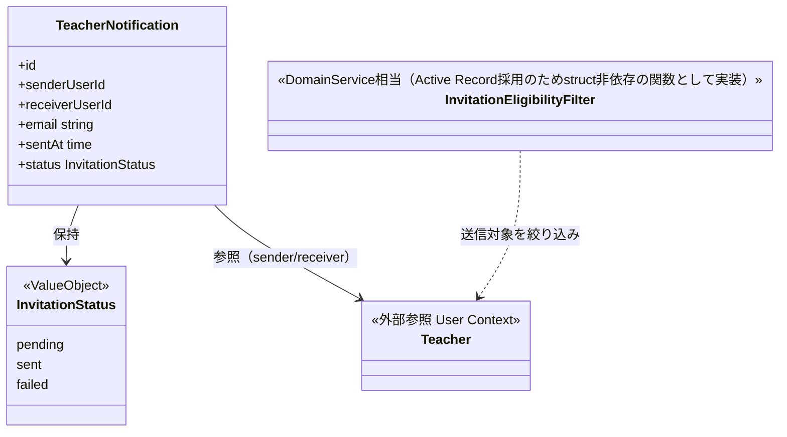
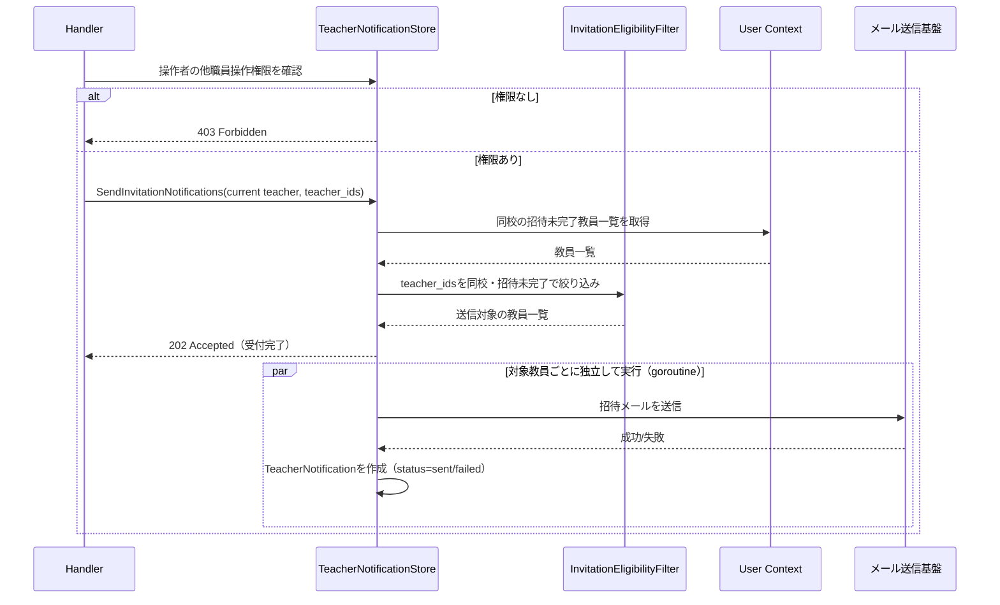

# 教員招待通知機能 Go移行・設計仕様書

---

# 1. 機能概要

## 機能概要

新規に登録されたものの、まだ招待（パスワード設定）を完了していない教員に対して、招待メールを再送・一括送信できる機能である。Rails現行仕様では、同校の招待未完了教員一覧を取得し、選択した教員へ一括送信（非同期、202 Accepted）を行い、送信結果（成功・失敗）を履歴として日付で絞り込んで参照できる。

## 利用者

- `teacher` ロールのユーザー（教師）
- 招待未完了教員一覧の取得・送信操作には、他職員操作権限（`manage_other_teachers`）が必要。送信結果履歴の参照には特別な権限は不要（同校の教師であれば閲覧できる）

## 業務上の目的

- パスワード未設定のまま招待が完了していない教員に対し、招待メールを再送できるようにする
- 一括送信操作を、対象教員の絞り込み（同校・招待未完了）を適切に適用した上で安全に行えるようにする
- 送信結果を履歴として残し、送信済み・未送信の状況を後から確認できるようにする

---

# 2. 設計方針

- 責務分離: HTTP入出力、入力形式検証、送信対象の絞り込み、送信結果の記録、通知連携を分離する
- 保守性: 「同校」「招待未完了」という送信対象の絞り込みルールを一箇所に集約する
- テスト容易性: 送信対象の絞り込みロジックと、送信結果記録の正確性を独立して検証できるようにする
- API互換性: 既存フロントエンドとの接続を維持するため、エンドポイント・リクエスト構造・レスポンス構造は概ね維持する
- 拡張性: 将来的に他の招待手段（SMS等）が追加された場合にも対応しやすい構造とする

---

# 3. Bounded Context

## Context名

- teacher-notification

## Contextの責務

- 同校の招待未完了教員一覧の取得
- 選択した教員への招待通知（招待メール）の一括送信
- 送信結果（成功・失敗）の履歴管理・参照

## 他Contextとの依存関係

- User Context: 教員アカウントの識別情報、所属校情報、招待完了状態（初回パスワード未設定かどうか）の参照に依存する

## 依存する理由

招待未完了かどうかの判定は、教員アカウント本体（User）が持つパスワード状態を前提とする。この情報の真正な管理はUser Contextに属するため、本Contextは参照のみ行い、教員アカウント自体の作成・更新は行わない。

なお、教師教員管理機能（`teacher-directory`）は、教員一覧表示のために本Context（`teacher-notification`）が管理する送信結果を参照する。本Contextから教師教員管理機能への依存は存在しない（依存の向きは一方向であり、アーキテクチャ規約5章が禁止する循環依存を避けるため、本Contextは教員一覧の取得を教師教員管理機能に依存せず、User Contextから直接行う）。

---

# 4. 設計パターン

## 採用パターン

Active Record

## 判断根拠

本機能が扱う操作は、招待未完了教員一覧の参照、選択教員への一括送信、送信結果履歴の参照という、状態遷移を伴わないCRUD中心の業務である。

- TeacherNotificationの状態（pending/sent/failed）は、送信処理の実行結果に応じて作成時点で一度だけ確定し、その後の遷移（ユーザー操作や別の業務イベントによる状態変更）は発生しない。複数の状態を跨いだ遷移ルールを持つEntityではなく、「結果を記録する1件のレコード」という性質が強い
- 送信対象の絞り込み（同校・招待未完了）は入力値と参照データの突き合わせであり、複雑なドメインロジックというよりは値の妥当性検証に近い
- 各教員への送信・記録は互いに独立しており（1人の送信失敗が他の対象者に影響しない）、複数Entityにまたがる整合性を保証する集約構造を必要としない

このため、以下の理由からActive Recordを採用する。

- 主要操作が一覧・一括送信・履歴参照というCRUD中心の操作であり、複雑な状態遷移が存在しない
- 送信対象の絞り込みロジック（同校・招待未完了）は、Entity（TeacherNotification）が保持する情報だけでは完結せず、User Context側の参照情報との突き合わせによる値の妥当性検証として十分に表現できる
- 各送信結果が独立したレコードとして記録されれば足り、複雑なドメイン振る舞いを必要としない

## 採用しなかったパターン

### Transaction Script

対象教員の絞り込み・他職員操作権限の確認という複数の判定を手続き型に寄せると、テスト単位が不明瞭になりやすい。送信結果の記録という永続化対象が明確に存在するため、structへ責務を持たせるActive Recordの方が適している。

### Domain Model

TeacherNotification自体に状態遷移や、複数Entityにまたがる複雑な業務ルールの蓄積は存在しない。送信対象の絞り込みは値検証に近く、Entityに振る舞いを集約するメリットが薄く、DDDを目的化した過剰設計になるため不採用とする。

### Event Sourcing

送信という単発の操作に対して、履歴の再構築や監査目的のイベント管理は現行仕様上求められていない。送信結果は`teacher_notifications`テーブルへの記録で十分に表現できるため、過剰な設計であり不採用とする。

---

# 5. Aggregate設計

不要と判断する。

理由: TeacherNotificationは1件ごとに独立したレコードであり、複数Entityにまたがる整合性を保証する必要がある集約構造を持たない。各教員への送信・記録が互いに独立している（1人の送信失敗が他の対象者の記録に影響しない）という業務要件そのものが、Aggregateとして境界を設ける必要性を排除している。

---

# 6. Entity設計

## TeacherNotification

- 役割: 教員への招待通知1件の送信結果を表す概念
- ライフサイクル: 一括送信処理の実行結果として1件ずつ作成される。作成後の更新・削除は行わない
- 状態変化: 送信結果に応じてpending（未送信、レコード上のデフォルト値）/sent（送信成功）/failed（送信失敗）のいずれかが作成時点で確定する。作成後の状態遷移は発生しない
- 保持する責務:
  - 送信者（sender）・送信先教員（receiver）・送信先メールアドレス・送信日時・送信結果（status）を保持する
- 判断根拠: 送信結果を1件ごとに記録するという業務要件の中心的な対象であるため

## Teacher（外部参照、招待未完了教員の一覧表示対象）

- 役割: 招待未完了かどうかの判定対象となる教員アカウント
- 判断根拠: 教員アカウント自体の真正な管理はUser Contextに属し、本ContextはUser Contextの`password_reset_required`相当の状態を参照するのみであるため（推測: 教師生徒参照機能・教師教員管理機能のデータモデルに記載された`password_reset_required`フィールドと同一の仕組みを、招待完了判定に用いると仮定する）

---

# 7. Value Object設計

## InvitationStatus

- 採用理由: 送信結果を文字列のまま扱うと、許容されない値が実装のあちこちで再チェックされ、抜け漏れが起きやすいため
- 独自ルール: pending/sent/failedのいずれかのみを許容する。作成時に送信結果（成功/失敗）から一意に決定され、以降変更されない
- Entity属性ではなくValue Objectにする理由: 許容値の妥当性チェックを型として表現し、送信処理・履歴参照双方のstructメソッドから再利用できるようにするため

## Value Objectを採用しないもの

- 送信先メールアドレス: 送信対象の教員アカウントに紐づく既存のメールアドレスをそのまま複写する値であり、本Context独自の検証ルールを持たないためValue Object化は不要とする

---

# 8. Domain Service

## InvitationEligibilityFilter

- 責務: 指定された教員ID一覧（`teacher_ids`）から、実際に送信対象とすべき教員（操作者と同校、かつ招待未完了）を絞り込む
- Entityへ持たせない理由: 判定にはTeacherNotification単体の情報ではなく、User Context側の教員アカウント情報（所属校・パスワード状態）が必要なため
- 判断根拠: 同校でない教員・既に招待完了済みの教員が指定されても、エラーとはせず単に送信対象から除外するという業務ルール（Rails現行仕様「業務ルール」節参照）を1箇所に集約し、一覧取得・一括送信の双方から再利用できるようにするため

---

# 9. クラス図

Active Record採用のため、Entity間の関係は単純である。TeacherNotificationは他Entityとの集約関係を持たず、送信対象の絞り込みに必要な外部参照（Teacher）のみを持つため、以下に簡略化して示す。

---

# 10. 状態遷移図

省略する。

理由: TeacherNotificationのstatus（pending/sent/failed）は、送信処理の実行結果に応じて作成時点で一度だけ確定する値であり、作成後にユーザー操作や別の業務イベントによって遷移する多段階の状態遷移ルールを持たない。「6. Entity設計」に記載のとおり作成時点で結果が確定する単純な結果値であるため、状態遷移図としての可視化は行わない。

---

# 11. Repository設計

**実装上の位置づけ**: 本機能はActive Record採用のため、Repository Interfaceをdomain層に定義しない。以下は永続化・検索責務の設計意図であり、実装時はEntity相当のstructと同一packageに置くStore（例: `〇〇Store`）として直接実装する（規約: アーキテクチャ規約.md「3. 設計パターンごとの構造適用方針」）。

## TeacherNotificationStore

- 管理対象: TeacherNotification
- 責務:
  - 送信結果の一括作成
  - 同校の招待未完了教員一覧の取得（User Context参照を含む）
  - 送信結果履歴の取得（送信者が同校、日付絞り込み任意）
- 保持する検索機能:
  - high_school_idによる絞り込み（招待未完了教員一覧・履歴の双方）
  - 招待未完了（パスワード未設定）による絞り込み
  - sent_atの日付絞り込み（履歴取得時）
  - 送信日時降順のソート
- 保持しない責務:
  - 送信対象の絞り込み判定そのもの（InvitationEligibilityFilterが担う）
  - 教員アカウント自体の作成・更新
- 判断根拠: 送信結果の永続化・検索に責務を限定し、絞り込みロジックはInvitationEligibilityFilter、教員アカウントの真正な管理はUser Contextに委ねるため

---

# 12. UseCase設計

**実装上の位置づけ**: 本機能はActive Record採用のため、UseCase層（struct）を設けない。以下はHandlerが行う業務操作の設計意図であり、実装時はHandlerがStoreを直接呼び出す処理として実装する。

## ListUnsentTeachers（Handler処理）

- 目的: 同校の招待未完了教員一覧を取得する
- 入力: current teacher
- 出力: 招待未完了教員一覧
- トランザクション範囲: 読み取りのみ、トランザクション不要
- 呼び出すStore: TeacherNotificationStore（current teacherが「他職員操作権限」を持つことをHandler処理内で確認したうえで呼び出す）
- 判断根拠: current teacherの所属校・招待未完了という条件で絞り込むだけの単純な参照処理であるため

## SendInvitationNotifications（Handler処理）

- 目的: 選択した教員に対して招待通知を一括送信する
- 入力: current teacher, teacher_ids（任意、配列）
- 出力: 受付結果（送信処理を開始した旨）
- トランザクション範囲: 使用しない（各教員への送信・記録は独立した処理であり、全体を1トランザクションにまとめる必要がない）
- 呼び出すStore: TeacherNotificationStore（current teacherの「他職員操作権限」確認、InvitationEligibilityFilterによる送信対象確定後、対象教員ごとに送信・記録）
- 判断根拠: 1人の教員への送信が失敗しても他の対象教員への送信処理が継続されるという業務要件（Rails現行仕様「業務ルール」節）があるため、対象教員ごとに独立した処理として扱う

## ListNotificationResults（Handler処理）

- 目的: 同校の教員宛てに送信された招待通知の結果履歴を取得する
- 入力: current teacher, sent_at（任意、日付）
- 出力: 送信結果一覧
- トランザクション範囲: 読み取りのみ
- 呼び出すStore: TeacherNotificationStore
- 判断根拠: 権限確認不要（同校の教師であれば誰でも閲覧できる）で、日付絞り込み・同校スコープの単純な参照処理であるため

---

# 13. シーケンス図・処理フロー図

## シーケンス図

### SendInvitationNotifications（Handler処理）

## 処理フロー図

単純なCRUD処理（絞り込み・一括送信・履歴参照）であり、状態遷移を伴わないため、条件分岐が多い複雑な業務ロジックは存在しない。処理フロー図は省略する。

---

# 14. Transaction設計

## Transaction開始位置

- ListUnsentTeachers / ListNotificationResultsでは使用しない
- SendInvitationNotificationsでは、対象教員ごとの送信・記録を独立した処理として扱うため、全体を1つのトランザクションにまとめない

## Transaction終了位置

- 対象教員ごとに、送信結果（TeacherNotification）の作成が完了した時点でその教員分の処理が完了する

## 理由

Rails現行仕様書は「1人の教員へのメール送信が失敗しても、他の対象教員への送信処理は継続される（1件ごとに成功・失敗が記録される）」と明記している。これは複数の独立した処理を1トランザクションにまとめてはならないという業務要件そのものであり、対象教員ごとに個別の書き込みとして扱う。

---

# 15. Validation設計

## Presentation

- 型チェック: teacher_idsが整数の配列であることを検証する
- 必須チェック: なし（teacher_idsが空でもエラーとしない。Rails現行仕様どおり）
- フォーマットチェック: sent_at（履歴取得時）が日付形式であることを検証する

## Domain

- 業務ルール: 操作者が「他職員操作権限」を持つこと（一覧取得・一括送信時）、送信対象が同校かつ招待未完了であること（InvitationEligibilityFilter）
- 状態チェック: 該当なし（TeacherNotificationは作成時に状態が確定するのみで、状態に対する事前チェックは発生しない）
- 整合性チェック: 該当なし

## バリデーション仕様

|フィールド|検証層|ルール|エラーメッセージ方針|
|-|-|-|-|
|teacher_ids|Presentation|任意・整数の配列|なし（空でもエラーとしない）|
|teacher_idsの送信対象|Domain|同校かつ招待未完了であること|エラーとせず対象から除外する|
|操作者の権限（一覧取得・一括送信）|Domain|「他職員操作権限」を保持すること|「他教員を招待する権限がありません」|
|sent_at|Presentation|任意・日付形式|なし（不正な場合は絞り込み条件として無視、またはPresentation層で422）|

---

# 16. Authorization設計

## Middleware

- 認証済みユーザーを特定し、`teacher` ロールであることを確認する

## Handler

- 招待未完了教員一覧の取得・一括送信の実行前に、current teacherが「他職員操作権限（`manage_other_teachers`）」を保持しているかを確認し、保持していない場合は処理を中断する
- 送信結果履歴の参照には、この権限確認を行わない（同校の教師であれば誰でも閲覧できる）

## UseCase

- （Active Record採用のためUseCase層は設けない。上記Handler処理内の確認がこれに相当する）

## Domain

- InvitationEligibilityFilterが、同校でない教員・招待完了済みの教員を送信対象から除外する

## 判断理由

「他職員操作権限」の要否は、ロール（`teacher`であるか）のような粗い認可ではなく、教員個人が持つ業務権限に基づく判定であるため、Middlewareのロールチェックとは別に、Handler処理内で確認する（アーキテクチャ規約7章「認可（所有権・業務権限）」の配置方針、Active Record採用時はHandler/Storeに従う）。送信結果履歴の参照にはこの権限を要求しないという非対称な権限設計は、Rails現行仕様「8. 権限制御」に明記された業務要件をそのまま踏襲したものである。

---

# 17. Error設計

## Domain Error

責務: 業務ルール違反を表現する

- 該当なし（送信対象の絞り込みはエラーとせず除外で処理するため、Domain Errorとして扱う業務ルール違反は本機能には存在しない）

## Application Error

責務: ユースケース実行時の失敗を表現する

- 操作者が「他職員操作権限」を持たないまま一覧取得・一括送信を試みた（Forbidden）

## Infrastructure Error

責務: メール送信基盤への送信失敗、DB接続・永続化失敗等の技術的障害を表現する

## 判断理由

本機能は「対象を絞り込んで記録する」という性質が強く、入力値そのものの業務ルール違反（Domain Error）はほぼ発生しない。唯一の業務的なエラーケースは操作者の権限欠如であり、これはリソースの状態ではなく操作者の資格に起因する失敗であるため、Application Errorとして扱い403に変換する。メール送信の失敗自体は、TeacherNotificationのstatus=failedとして正常に記録される業務結果であり、エラーとしては扱わない。

## エラー仕様

|業務シナリオ|エラー種別|発生層|想定するHTTPステータス|
|-|-|-|-|
|操作者が他職員操作権限を持たずに一覧取得・一括送信を試みた|Forbidden|Application|403|
|個々の教員への送信が失敗した|該当なし（正常な業務結果としてstatus=failedを記録）|-|202（受付自体は成功）|
|未認証|-|Middleware|401|

---

# 18. Domain Event

不要と判断する。

理由: 一括送信対象の教員ごとの送信・記録は互いに独立した処理であり、Rails現行仕様書も「対象教員ごとに、招待メールを送信し、送信結果を記録する」という単純なループ処理として記述している。生徒CSVインポート機能・教師面談機能・クラス編成機能のように「1つの状態変化が複数の異なるトリガー・複数の宛先へ波及する」構造を持たず、対象教員1人につき送信→記録という1対1の処理が繰り返されるのみである。そのため、規約5章のDomain Event採用条件（複数の処理へ波及する非同期通知が必要な場合）には該当しない。

実装上は、対象教員ごとの送信処理をアーキテクチャ規約13章（非同期ジョブ実行パターン）の「ベストエフォートで良い処理」として扱う。招待メールの送信は、失敗しても操作者が再度対象教員を選択して送信し直せる（Rails現行仕様「業務ルール」節: `teacher_ids`が空でもエラーにならない）ため、パスワードリセットメール送信と同様、確実な再試行（`jobs`テーブル）までは必須としない。

---

# 19. API仕様

## エンドポイント一覧

|エンドポイント|HTTP Method|概要|
|-|-|-|
|/api/v1/teacher/teacher_notifications|GET|招待未完了の教員一覧を取得|
|/api/v1/teacher/teacher_notifications|POST|選択した教員へ招待通知を送信|
|/api/v1/teacher/teacher_notification_results|GET|招待通知の送信結果履歴を取得|

## 各エンドポイントの仕様

### GET /api/v1/teacher/teacher_notifications

- Request: なし
- Response: 招待未完了の教員一覧（id, name, name_kana, email）
- Status Code: 200 / 403（他職員操作権限なし）
- Error Response: なし（他職員操作権限を持つ教師であることが前提。権限がない場合は既存のerrors形式を踏襲する）

### POST /api/v1/teacher/teacher_notifications

- Request: teacher_ids[]（任意、送信対象教員IDの配列）
- Response: message（「送信処理を開始しました」相当）
- Status Code: 202 / 403（他職員操作権限なし）
- Error Response: 既存のerrors形式を踏襲する

### GET /api/v1/teacher/teacher_notification_results

- Request: sent_at（任意、日付。指定日の0時〜24時に絞り込む）
- Response: 送信結果一覧（id, email, status, formatted_sent_at, 送信者(id, name), 送信先教員(id, name)）
- Status Code: 200
- Error Response: なし（認証前提）

## Railsとの差分

現時点でRails仕様からの変更はない。エンドポイント・リクエスト構造・レスポンス構造・ステータスコードはRails現行仕様を維持する。

---

# 20. DB設計方針

## 現行DBを利用するか

- 既存Rails DBを継続利用する

## Schema変更有無

- 変更なし

## 変更理由

- 現行の `teacher_notifications` テーブルは、送信結果の1件ごとの記録という業務要件を満たしており、追加のスキーマ変更は不要である

---

# 21. DB操作仕様

## TeacherNotificationStore

- 対象テーブル: `teacher_notifications`
- 操作種別: 作成（対象教員ごとに1件）、参照（招待未完了教員一覧、送信結果履歴）
- 主な検索条件・絞り込み条件:
  - 招待未完了教員一覧: `high_school_id`、教員ロール、パスワード未設定（User Context参照）
  - 送信結果履歴: `sender_user_id`が同校、`sent_at`の日付範囲（任意）
- 関連テーブルとの結合: `users`との結合（送信者名・送信先教員名の取得、招待未完了判定のため）
- ページネーション・ソート: 送信結果履歴は送信日時降順。招待未完了教員一覧・送信結果ともに、Rails現行仕様にページネーションの明記はないため、全件返却を前提とする（推測: 対象件数が少数であることを前提とした設計と推測される。データ量が増加した場合はページネーションの追加を検討する）

---

# 22. テスト戦略

## Domain Test

- 目的: InvitationStatusの許容値検証、InvitationEligibilityFilterによる送信対象の絞り込みロジック（同校・招待未完了の判定、指定外教員の除外）を検証する

## UseCase Test

- 目的: ListUnsentTeachers / SendInvitationNotifications（他職員操作権限の確認、送信対象の絞り込み、個々の送信失敗が他に影響しないこと）/ ListNotificationResultsの業務振る舞いを検証する

## Repository Test

- 目的: TeacherNotificationStoreによる招待未完了教員一覧の絞り込み、送信結果の一括作成、日付絞り込みを伴う履歴取得の正確性を検証する

## Handler Test

- 目的: teacher_idsの入力検証、他職員操作権限確認によるHTTPステータス（200/202/403）変換を検証する

## Integration Test

- 目的: エンドポイント経由で招待未完了教員一覧の取得・一括送信・送信結果履歴の参照が、権限制御と絞り込みルールに従って正しく連携して動作することを確認する

---

# 23. Railsとの責務対応

| Rails | Go | 設計方針 |
|---|---|---|
| Controller（TeacherNotificationsController, TeacherNotificationResultsController） | Handler | HTTP入出力のみを担当する |
| Controller内の他職員操作権限チェック | Handler処理内の権限確認（TeacherNotificationStore経由） | ロール確認（Middleware）とは別に、業務権限の判定として明示的に配置する |
| Service（Teacher::TeacherNotificationSenderService） | SendInvitationNotifications（Handler処理）+ InvitationEligibilityFilter | 送信対象の絞り込みロジックを独立させ、一覧取得・一括送信の双方から再利用する |
| Job（Teacher::TeacherNotificationJob） | ベストエフォート非同期処理（規約13章） | 対象教員ごとの独立した送信・記録処理として実装する |
| Model（TeacherNotification） | TeacherNotification（struct）+ TeacherNotificationStore（同一package） | 送信結果の保持と永続化をstruct/Storeに整理する |
| Serializer（Teacher::UnsentTeacherSerializer, Teacher::TeacherNotificationSerializer） | Presenter / Response DTO | レスポンス整形を分離する |

---

# 24. 採用しなかった設計

## Transaction Script

- 採用しなかった理由: 他職員操作権限の確認・送信対象の絞り込みという複数の判定を手続き型に寄せると、送信結果という明確な永続化対象を持つ本機能にはstructへの責務集約の方が適しているため
- 将来的に採用する可能性: 送信対象の絞り込みルールがさらに単純化された場合は検討できる

## Domain Model

- 採用しなかった理由: TeacherNotification自体に状態遷移や複雑な業務ルールの蓄積がなく、CRUD中心の構造で十分に保守可能であるため
- 将来的に採用する可能性: 招待フローが多段階（招待予約→送信中→送信済み等）の状態遷移を持つようになった場合は再検討の余地がある

## Event Sourcing

- 採用しなかった理由: 送信という単発操作に対する履歴再構築・監査要件が現時点で存在しないため
- 将来的に採用する可能性: 送信履歴の詳細な監査要件が生じた場合に有効な可能性がある

---

# 25. 設計判断サマリー

|項目|採用|判断理由|
|-|-|-|
|設計パターン|Active Record|状態遷移のないCRUD中心の業務であり、送信対象の絞り込みは値検証に近く十分に表現できるため|
|Aggregate|不要|TeacherNotificationが1件ごとに独立し、複数Entityにまたがる整合性単位が存在しないため|
|Transaction境界|対象教員ごとに独立（全体を1トランザクションにしない）|1人の送信失敗が他の対象者に影響しないという業務要件のため|
|Domain Event|未採用|対象教員1人につき送信→記録という1対1の処理であり、複数宛先への波及的な非同期通知に該当しないため|
|Value Object|採用（InvitationStatus）|許容される送信結果の値を型として明示するため|
|Domain Service|InvitationEligibilityFilter|送信対象の絞り込みがTeacherNotification単体の責務に収まらないため|
|Authorization|Middleware + Handler|ロール確認と、送信結果履歴参照には課さない非対称な業務権限確認を分離して管理しやすくするため|

---

# 設計差分管理

## Rails現行仕様

- Controllerのcreateアクション冒頭で「他職員操作権限」の有無をチェックしている
- Teacher::TeacherNotificationSenderServiceが送信対象の絞り込みと送信処理をまとめて担っている
- Teacher::TeacherNotificationJobが対象教員ごとの送信・記録をループで実行している

## Go設計での変更内容

- 送信対象の絞り込みロジックをInvitationEligibilityFilter（Domain Service相当）として独立させ、一覧取得・一括送信の双方から再利用する
- 対象教員ごとの送信・記録を、規約13章のベストエフォート非同期処理として明確化する
- 他職員操作権限の確認をHandler処理内の明示的なステップとして位置づける

## 変更理由

Rails実装ではSenderServiceに絞り込みロジックと送信処理が混在しており、絞り込みルールの変更時に送信処理へ影響が及びやすい。Go設計では絞り込みロジックを独立させることで、影響範囲を限定し保守性・テスト容易性を高める。

## 影響範囲

- フロントエンドから見たAPI外部仕様は維持する
- 既存DBスキーマは維持するため、データ移行は不要
- 送信対象の絞り込みロジックの変更は、教員一覧の招待状況表示（教師教員管理機能、`teacher-directory`）には影響しない（`teacher-directory`は本Contextの送信結果を参照するのみであり、絞り込みロジック自体には依存しないため）
