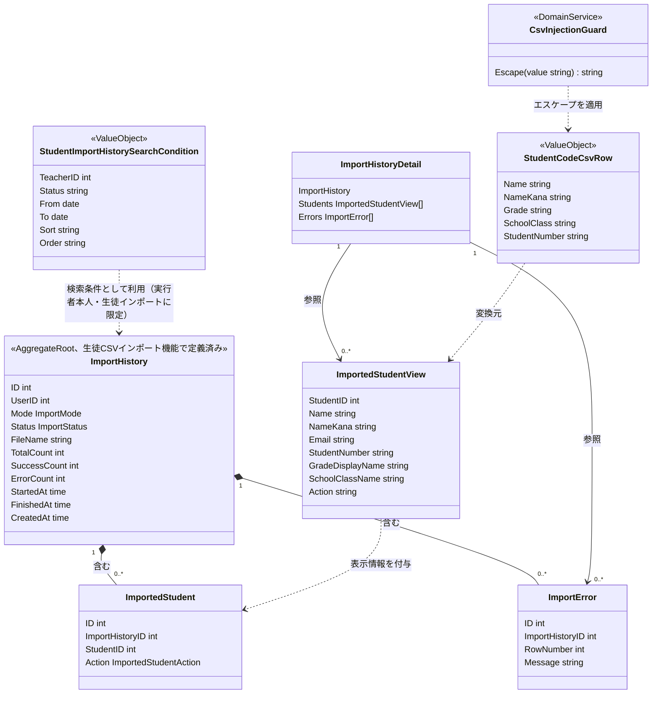
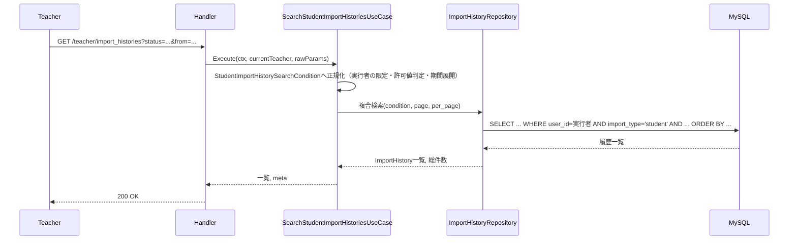
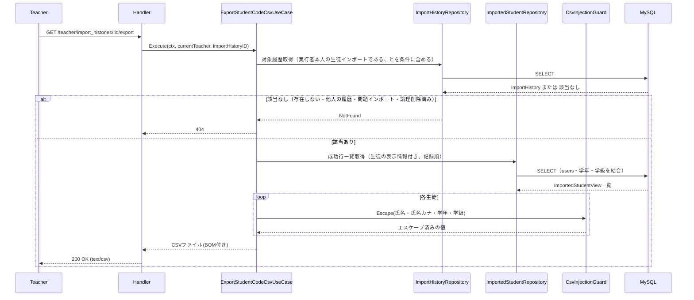

# 教師インポート履歴管理機能 Go移行・設計仕様書

---

# 1. 機能概要

## 機能概要

教師が、自身が実行した生徒CSVインポートの結果を確認し、インポートされた生徒に配布する生徒コードの一覧をCSVファイルとして取得できるようにする機能である。Rails現行仕様では、状態・期間で絞り込み・並び替えを行う一覧取得、実行結果の件数・インポートされた生徒の一覧（新規作成か更新か）・エラー明細を含む詳細取得、インポートされた生徒の氏名・氏名カナ・学年・学級・生徒コードをCSVファイルとして出力するエクスポートの3操作を提供する。

インポート履歴（`import_histories`）は問題インポート・生徒インポートの両方で共通して記録されるデータであるが、本機能が一覧・詳細・CSVエクスポートの対象として扱うのは、ログイン中の教師自身が実行した生徒インポートの履歴のみである。問題インポートは管理者が担当する別機能であり、その履歴は対象に含まれない。他の教師が実行した履歴は、同じ学校の教師であっても対象に含まれない。

インポートされた生徒（成功行）の記録は、生徒CSVインポート機能がインポート実行時に残す。本機能はその記録を参照するのみである。

## 利用者

- `teacher` ロールのユーザー（教師）

## 業務上の目的

- 自身が実行した生徒インポートの結果（成功・失敗、件数、エラー行の内容）を、あとから確認できるようにする
- インポートされた生徒（新規作成・更新）を特定し、生徒コードを生徒へ配布するためのCSVファイルとして取得できるようにする
- 参照範囲を自身が実行した生徒インポートの履歴に限定し、他の教師の履歴や問題インポートの履歴、生徒コードが不必要に閲覧されないようにする

---

# 2. 設計方針

本機能は、生徒CSVインポート機能_Go移行・設計仕様書で定義したImportHistory Aggregate（Domain Model採用。ImportError・ImportedStudentを含む）に対する、検索・詳細参照・CSVエクスポートという読み取り専用のUseCase群として設計する。新たな状態やAggregate境界を追加するものではなく、既存Aggregateへの参照手段を拡張する位置づけである（管理者インポート履歴管理機能が、管理者問題インポート機能のAggregateに対して行っているのと同じ関係）。

- 責務分離: 検索条件の解釈、参照範囲（自身が実行した生徒インポートの履歴）の限定、CSVエクスポート時のフォーマット・エスケープ処理、永続化アクセスを分離する
- 保守性: 参照範囲の限定を検索条件の必須項目として1箇所に集約し、範囲を限定し忘れた検索が書けない構造にする。数式注入対策のエスケープルールも1箇所に集約する
- テスト容易性: 検索条件の解釈結果、参照範囲の限定、エクスポート内容のエスケープ結果をユニットテストで検証できるようにする
- 拡張性: 将来的に検索条件・エクスポート形式が増えても、既存のImportHistory Aggregateの構造を変更せずに対応できるようにする
- API互換性: 既存エンドポイント・レスポンス構造・CSV出力形式（列構成・BOM・ファイル名）を維持する

---

# 3. Bounded Context

## Context名

- student-import

生徒CSVインポート機能と同一のContextとして扱う。管理者インポート履歴管理機能がquestion-importと同一Contextとした判断（参照専用の別Contextとして切り出さない）と同じ理由による。

## 判断根拠（Context統合の理由）

- 対象データが完全に同一である: 本機能が検索・参照・エクスポートするImportHistory / ImportError / ImportedStudentは、生徒CSVインポート機能_Go移行・設計仕様書で定義したImportHistory Aggregate（Aggregate Root: ImportHistory）そのものであり、新たなEntity・テーブルを導入しない
- 実行者（アクター）が同一である: 両機能とも`teacher`ロールのユーザーのみが操作する。同じ教師が、インポートを実行し、その結果を確認する。別のアクターが生成したデータを別の視点から参照する、という別Contextとして切り出す理由が本機能には当てはまらない
- 業務ルールが密結合している: 一覧の絞り込み条件（`status`）や検索対象の限定（`import_type`が生徒インポートであること）は、student-import Context側で定義される進行状態（ImportStatus）と、全件成功・全件失敗という結果の意味（`completed`の履歴にのみ成功行が存在し、`failed`の履歴には存在しない）に依存する。Contextを分けると、これらの意味論を2つのContextで重複して把握する必要が生じる
- アーキテクチャ規約.md「4. Bounded Context構成」の分割基準に照らしても、「常に一体で扱われるデータは無理に分割しない」という原則があり、ImportHistoryは進行状態と成功行・エラー行の書き込み（student-import本来の責務）と検索・参照（本機能）が同一ライフサイクルの中で一体的に扱われるデータである。「同一データに対する参照専用の切り口を、別の参照・集約専用Contextとして切り出してよい」という指針は、利用者・業務目的が異なる、または複数Contextの情報を新たに集約して見せる場合の切り出しであり、本機能は「生徒CSVインポートの実行結果を振り返る」という同一目的の延長線上にあるため該当しない

## Contextの責務（本機能が追加する部分）

- 自身が実行した生徒インポート履歴の検索（状態・期間による絞り込み、並び替え、ページング）
- 生徒インポート履歴の詳細参照（インポートされた生徒の一覧・エラー明細を含む）
- インポートされた生徒の生徒コード配布用CSVエクスポート

CSVアップロードの受付・進行状態管理・行単位の成功・失敗の記録という、Aggregateへの書き込みを伴う責務は、生徒CSVインポート機能_Go移行・設計仕様書で定義済みであり、本書では再定義しない。

## 他Contextとの依存関係

- User Context（`user`。②は`ユーザー基盤機能_Go移行・設計仕様書.md`）: 詳細表示・CSVエクスポートにおける、インポートされた生徒の氏名・氏名カナ・メールアドレス・生徒コードの参照に依存する（参照のみ）
- School/Grade Context: 同じく、インポートされた生徒の学年の表示名・学級名の参照に依存する（参照のみ。学年の表示名は共通マスタ参照機能が定める表記と同じものを用いる）

## 依存する理由

インポート履歴と成功行（ImportedStudent）は、`import_history_id`と生徒の`user_id`という外部キーのみを保持する（生徒の情報を複製しない。生徒CSVインポート機能②「6. Entity設計」）。表示に必要な氏名・生徒コード・学年・学級は、それぞれUser Context・School/Grade Contextが真正な情報源であるため、参照のみを行う。参照した時点の内容を返却する（インポート実行時点の内容の保存ではない）。

生徒の氏名等を含む一覧は、他テーブルとの結合を伴う画面向けの参照であるため、`user`②「3. Bounded Context」の「画面向けの一覧は、一覧を必要とする各Contextが自前の参照モデルとして持つ」に従い、本Contextが参照専用の参照モデルとして持つ。`user`の公開する参照操作（`GetUserAttributes`等）は用いない。

---

# 4. 設計パターン

## 採用パターン

Domain Model

## 判断根拠

本機能単体の業務ルール（検索条件の絞り込み、参照範囲の限定、CSVエスケープ）だけを見れば、状態を持たないTransaction Scriptでも表現は可能である。しかし、以下の理由から、管理者インポート履歴管理機能と同じ判断としてDomain Modelを採用する。

- ドメインロジックの複雑さ・状態管理: 本機能が検索・参照するImportHistoryは、既に生徒CSVインポート機能_Go移行・設計仕様書においてDomain Modelとして設計され、Aggregate Root・Repository Interfaceによる依存性逆転構造を持つ。同一Aggregateに対して、書き込み側はDomain Model、読み取り側はTransaction Scriptという異なる実装構造を採用すると、Repository Interfaceの置き場所（Domain層に定義するか、infrastructure層に直接関数を置くか）が機能ごとに矛盾し、同一Contextの内部構造が二重化する。また、ImportedStudentは`completed`の履歴にのみ存在するという整合性（全件成功・全件失敗）が本Aggregateの不変条件であり、参照側もこの意味を前提とする
- 業務ルールの複雑さ: 本機能には、(1)参照範囲の限定（自身が実行した・生徒インポートの・論理削除されていない履歴のみ。他人の履歴は存在しないものとして扱う）という授権に関わるルール、(2)表計算ソフトでの数式注入を防ぐエスケープ処理という、セキュリティ上重要なルールがある。いずれも単純な入出力変換ではなく、独立して明示的にテストされるべきルールであり、(1)は検索条件のValue Object、(2)はDomain Serviceとして切り出す価値がある
- 将来の拡張性: 将来的にインポート履歴の再実行・失敗行のみの再取り込みといった機能が追加される場合（推測）、検索・参照側もAggregateの状態（ImportStatus）を読み取って判断する必要が生じる可能性があり、Transaction Scriptとして分離していると再設計コストが増える
- テスト容易性: 検索条件の解釈・参照範囲の限定（検索条件のValue Object）とCSVエスケープ（Domain Service）を独立して切り出すことで、DBアクセスなしに単体テストできる

以上より、既存Context（student-import）との構造的一貫性を優先し、Domain Modelを採用する。なお、本機能自体は状態遷移を持たず、Domain Model採用基準のうち「Entityが状態を持つ」「状態遷移ルールが存在する」は、本機能が新たに満たす条件ではない。採用の根拠は、同一AggregateをDomain Modelとして扱う構造との一貫性と、上記の授権・セキュリティルールの独立したテスト容易性にある。

## 採用しなかったパターン

### Transaction Script

- 本機能単体の業務ルールの複雑さだけを見れば適用可能だが、同一Aggregate（ImportHistory）を扱う生徒CSVインポート機能がDomain Modelを採用しているため、Repository Interfaceの位置づけが機能間で矛盾してしまう。1つのAggregateに対する実装構造は、書き込み・読み取りに関わらず統一すべきであるため採用しない

### Active Record

- 本機能は集約横断の判定を必要としないため単純に見えるが、上記と同じ理由（同一AggregateがDomain Modelとして構造化されている）から、独立した永続化モデルとして再設計する妥当性がない

### Event Sourcing

- 履歴の再構築・監査要件は現行仕様に存在せず、ImportHistoryの現在状態と、行単位の成功・エラーの記録があれば業務要件を満たせるため、過剰設計と判断する

---

# 5. Aggregate設計

## Aggregate Root

- ImportHistory（生徒CSVインポート機能_Go移行・設計仕様書で定義済みのAggregateをそのまま参照する）

## Aggregateに含めるEntity

- ImportHistory
- ImportError
- ImportedStudent

本書では新たなAggregate境界を追加しない。検索・詳細参照・エクスポートはいずれも既存Aggregateへの読み取りアクセスであり、Aggregateの整合性単位（ImportHistoryの状態とImportError・ImportedStudentの一覧の整合性）は生徒CSVインポート機能_Go移行・設計仕様書の定義をそのまま踏襲する。

## 整合性を保証する単位

- 該当なし（本機能は読み取り専用であり、Aggregateへの書き込みを行わない）

---

# 6. Entity設計

ImportHistory・ImportError・ImportedStudentの役割・ライフサイクル・状態変化は生徒CSVインポート機能_Go移行・設計仕様書「6. Entity設計」の定義をそのまま用いる。本書では、本機能固有の参照用データ（Read Model）のみを追加で整理する。

## ImportedStudentView（参照用の構成データ）

- 役割: 詳細表示・CSVエクスポートのために、ImportedStudent（生徒ID・新規作成か更新か）に、参照時点の生徒の表示情報（氏名・氏名カナ・メールアドレス・生徒コード・学年の表示名・学級名）を組み合わせた参照用データ
- ライフサイクル: リクエストごとに構成され、永続化されない
- 状態変化: なし
- 保持する責務: 表示に必要な項目（生徒ID、氏名、氏名カナ、メールアドレス、生徒コード、学年の表示名、学級名（学級未所属の場合は「なし」）、新規作成か更新か）を保持するのみ
- 判断根拠: ImportedStudent Entity本体に表示専用の結合結果（氏名・学年・学級等）を持たせると、他Context（User・School/Grade）への参照責務がEntityに混入し、生徒情報の複製（インポート時点のスナップショット）と誤解されるため、application層の出力として分離する

## ImportHistoryの一覧・詳細の構成

- 一覧: 履歴の主要属性（ID・ファイル名・状態・モード・各種件数・作成日時）のみを返すため、ImportHistory Entityをそのまま用いる。結合結果を持たないため、一覧用の参照用データは設けない
- 詳細: ImportHistory Entityに、ImportError一覧と`ImportedStudentView`一覧を組み合わせて構成する（application層のDTOとして構成する）

---

# 7. Value Object設計

## StudentImportHistorySearchCondition

- 採用理由: 状態（status）・期間（from/to）・並び替え（sort/order）という複数の検索条件が組み合わさり、それぞれに「許可値以外は無視する／既定値にフォールバックする」という正規化ルールが存在する。加えて、参照範囲（実行者本人・生徒インポート・論理削除されていない履歴）の限定という、検索の必須条件を持つ。これらを単なる複数引数ではなく1つの概念としてまとめて扱う
- 独自ルール:
  - 実行者（現在ログイン中の教師のID）は必須項目であり、常に「その教師が実行した履歴」に限定する。実行者を指定せずに検索条件を生成できない
  - 検索対象は常に`import_type`が生徒インポートである履歴、かつ論理削除されていない履歴に限定する
  - `status`は許可値（`pending`/`processing`/`completed`/`failed`。Rails現行のenumの値）以外が指定された場合、絞り込み条件として適用しない。生徒インポートの履歴は`processing`で作成され`pending`にはならないため、`pending`を指定した場合は常に0件となる（許可値は生徒CSVインポート機能のImportStatus（`processing`/`completed`/`failed`）とは別に、絞り込み条件の許可値として保持する。API互換のため）
  - `sort`は許可値（`created_at`/`total_count`/`success_count`/`error_count`/`status`）以外の場合`created_at`にフォールバックし、同一条件時は`id`の降順を副次キーとする
  - `order`は`asc`/`desc`以外の場合`desc`にフォールバックする
  - `from`/`to`は日付単位の指定であり、開始日は当日0時、終了日は当日23時59分59秒までを含む期間へ展開する。日付として解釈できない値は指定されなかったものとして扱う（エラーにしない。Rails現行どおり）
  - 単元・コース・実行者による絞り込みは持たない（管理者向けの一覧にのみ存在する条件であり、本機能では受け付けない）
- Entity属性ではなくValue Objectにする理由: 複数の正規化ルールと参照範囲の限定をUseCase側の条件分岐として書くと、一覧取得UseCase内にルールが埋没し、範囲限定の書き忘れ（他人の履歴が見えてしまう不具合）が起こりやすい。検索条件という入力そのものを型として表現し、正規化と範囲限定を1箇所に閉じ込めることで、将来的に検索条件が増えてもUseCase本体を変更せずに済む

## StudentCodeCsvRow（エクスポート1行分の値）

- 採用理由: CSVエクスポートにおける氏名・氏名カナ・学年・学級・生徒コードの組み合わせに対し、数式注入対策のエスケープという独自の変換ルールが伴うため
- 独自ルール: 氏名・氏名カナ・学年・学級が`=`、`+`、`-`、`@`のいずれかで始まる場合、先頭に`'`を付与してエスケープする。生徒コードはシステムが発行する値であるためエスケープの対象としない。メールアドレスは持たない（出力しない）。学級が未所属の場合は空とする
- Entity属性ではなくValue Objectにする理由: ImportedStudentそのものの属性ではなく、CSV出力という特定の表現形式に変換する際にのみ発生するルールであるため、エクスポート専用のValue Objectとして分離する

## Value Objectを採用しないもの

- file_name・氏名・学年の表示名・学級名等の表示用文字列: 単純な文字列であり、独自の業務ルールを持たないためValue Object化は不要とする
- 新規作成か更新か（`action`）: 生徒CSVインポート機能②で定義済みのValue Object（ImportedStudentAction）をそのまま用いる

---

# 8. Domain Service

## CsvInjectionGuard

- 責務: CSV出力対象の文字列（氏名・氏名カナ・学年・学級）が表計算ソフトでの数式として解釈されうる先頭文字（`=`、`+`、`-`、`@`）を持つ場合に、`'`を付与してエスケープする
- Entityへ持たせない理由: この変換はImportedStudentが本来持つ業務的な意味（インポートされた生徒の記録）とは無関係な、CSV出力という表現形式固有のセキュリティ対策であるため、Entityの責務に含めるべきではない
- 判断根拠: 数式注入対策はセキュリティ上重要なルールであり、独立したDomain Serviceとして切り出すことで、対策の抜け漏れを防ぎ、単体テストで確実に検証できるようにする。Rails現行は、管理者向け・教師向けのCSV出力が同じエスケープ処理を共有している。Goでは、Context間で相手の内部のValue Object・Domain Serviceに依存しない（アーキテクチャ規約5章）ため、管理者インポート履歴管理機能（question-import）が持つ同名のDomain Serviceとは別に、本Contextが同じ規則のDomain Serviceを持つ。規則が食い違わないよう、両Contextのテストで同一のエスケープ対象・期待値を検証する（本書「22. テスト戦略」）

## StudentImportHistorySearchConditionNormalizer

本Domain Serviceは設けない。理由: StudentImportHistorySearchConditionのVO自体が正規化ルール（許可値判定・フォールバック・期間展開）と範囲限定を保持する設計とし、独立したDomain Serviceを介さずにVOのコンストラクタ相当の処理で完結させる。複数Entityにまたがる判断ではなく、入力値そのものの正規化であるため、VOへの集約で十分である。

---

# 9. クラス図



---

# 10. 状態遷移図

本機能はImportHistoryの状態を変更しないため、独自の状態遷移図は持たない。ImportHistoryの状態（processing/completed/failed）とその遷移条件は、生徒CSVインポート機能_Go移行・設計仕様書「10. 状態遷移図」の定義をそのまま参照する。本機能は、この状態を`status`検索条件として参照するのみである。

---

# 11. Repository設計

本機能は、生徒CSVインポート機能_Go移行・設計仕様書「11. Repository設計」で定義したImportHistoryRepository・ImportErrorRepository・ImportedStudentRepositoryを、検索・参照の用途で利用する。本書では、これらのRepositoryのうち本機能が追加で必要とする検索機能を明示する。

## ImportHistoryRepository（拡張部分）

- 管理対象: ImportHistory
- 責務（本機能が追加する部分）:
  - StudentImportHistorySearchConditionに基づく複合検索（状態・期間）
  - 並び替え・ページング付きの一覧取得
  - IDと実行者による詳細取得（実行者本人の生徒インポートの履歴のみ）
- 保持する検索機能:
  - 実行者（条件に含まれる教師のID）本人の履歴への絞り込み（他の教師が実行した履歴を除外する。授権に関わる業務ルールであり、検索条件に必須で含まれる）
  - `import_type`が生徒インポートであるものへの絞り込み（問題インポートを除外する）
  - 論理削除されていない履歴への絞り込み
  - `status`による絞り込み
  - `created_at`の期間絞り込み（日付単位、日境界を展開したうえでの範囲検索）
  - `sort`/`order`による並び替え（同条件時は`id`降順を副次キーとする）
  - ページング（`per_page`の既定20件、上限100件）
- 保持しない責務: インポート処理の実行、状態遷移の判定（生徒CSVインポート機能の責務）
- 判断根拠: 検索責務を、書き込み系（作成・状態更新）と同じRepositoryにまとめることで、ImportHistoryに対する永続化アクセスの窓口を1つに保つ。これはDomain Model採用時の標準的な方針（Repositoryは1つのAggregateにつき原則1つ）とも整合する。詳細取得は、実行者本人の履歴に限定した取得（IDのみによる取得ではない）を用いることで、他人の履歴IDを指定しても取得できない構造にする

## ImportErrorRepository（拡張部分）

- 管理対象: ImportError
- 責務（本機能が追加する部分）: ImportHistory IDによるエラー一覧取得（行番号順）。詳細取得で利用する（生徒CSVインポート機能で定義済みの取得をそのまま利用し、本書での追加はない）
- 保持しない責務: エラー内容の表示用への変換
- 判断根拠: 永続化と検索に責務を限定するため

## ImportedStudentRepository（拡張部分）

- 管理対象: ImportedStudent
- 責務（本機能が追加する部分）: ImportHistory IDによる成功行一覧の取得を、参照時点の生徒の表示情報（氏名・氏名カナ・メールアドレス・生徒コード・学年・学級）を付与した参照用データ（ImportedStudentView）として、記録された順に取得する。詳細取得・CSVエクスポートの両方で利用する
- 保持しない責務: 成功行の記録（インポート実行時の書き込み。生徒CSVインポート機能の責務）、CSV変換・エスケープ（CsvInjectionGuardの責務）、参照可否の判定（対象履歴が実行者本人のものであることの確認は、履歴の取得で行う）
- 判断根拠: 成功行の書き込みと参照を同じRepositoryにまとめ、ImportedStudentに対する永続化アクセスの窓口を1つに保つ。学年・学級・生徒の表示情報の結合は、参照用データの取得として本Repositoryが担う（生徒1人ごとに別の問い合わせを行わない）

---

# 12. UseCase設計

## SearchStudentImportHistoriesUseCase

- 目的: 検索条件・並び替え・ページングを適用して、自身が実行した生徒インポート履歴の一覧を取得する
- 入力: current teacher, status, from, to, sort, order, page, per_page
- 出力: ImportHistory一覧とページ情報
- トランザクション範囲: 読み取りのみ、トランザクションは不要
- 呼び出すRepository:
  - ImportHistoryRepository
- 判断根拠: リクエストパラメータと実行者（current teacher）をStudentImportHistorySearchConditionへ正規化したうえでRepositoryへ渡す、読み取り専用の処理であるため

## ShowStudentImportHistoryUseCase

- 目的: 指定された生徒インポート履歴の詳細（インポートされた生徒の一覧とエラー明細を含む）を取得する
- 入力: current teacher, import_history_id
- 出力: ImportHistoryDetail（履歴、インポートされた生徒の一覧、エラー明細）
- トランザクション範囲: 読み取りのみ
- 呼び出すRepository:
  - ImportHistoryRepository
  - ImportedStudentRepository
  - ImportErrorRepository
- 判断根拠: 対象が実行者本人の生徒インポートの履歴であることを確認したうえで、履歴・成功行・エラー明細をまとめて取得する処理であるため

## ExportStudentCodeCsvUseCase

- 目的: 指定された生徒インポート履歴でインポートされた生徒の一覧を、数式注入対策を施した生徒コード配布用CSVファイルとして出力する
- 入力: current teacher, import_history_id
- 出力: CSVファイル（ヘッダー行＋生徒の行、BOM付き。サマリー行は出力しない）
- トランザクション範囲: 読み取りのみ、トランザクションは不要
- 呼び出すRepository:
  - ImportHistoryRepository
  - ImportedStudentRepository
- 判断根拠: 対象履歴の確認後、成功行の取得とCsvInjectionGuardによるエスケープを適用してCSVを組み立てる処理であり、DBへの書き込みを伴わないため。エラー明細は出力しないため、ImportErrorRepositoryは呼び出さない

---

# 13. シーケンス図・処理フロー図

## シーケンス図（一覧検索）



## シーケンス図（生徒コード配布用CSVエクスポート）



## 処理フロー図（検索条件の正規化）

```mermaid
flowchart TD
    A[検索リクエスト受信] --> A1[実行者を検索条件に設定<br/>import_type=student AND 未削除を固定]
    A1 --> B{statusは許可値か}
    B -- No --> B1[status条件を適用しない]
    B -- Yes --> B2[status条件を適用]
    B1 --> C{sortは許可値か}
    B2 --> C
    C -- No --> C1[created_atにフォールバック]
    C -- Yes --> C2[指定されたsortを使用]
    C1 --> D{orderはasc/descか}
    C2 --> D
    D -- No --> D1[descにフォールバック]
    D -- Yes --> D2[指定されたorderを使用]
    D1 --> E{from/toは日付として<br/>解釈できるか}
    D2 --> E
    E -- Yes --> E1[日境界(0時〜23:59:59)へ展開]
    E -- No --> E2[その条件を適用しない]
    E1 --> F[検索実行]
    E2 --> F
```

---

# 14. Transaction設計

## Transaction開始位置・終了位置

- 本機能はすべて読み取り専用の処理であり、明示的なトランザクションを使用しない

## 理由

- 一覧検索・詳細取得・CSVエクスポートのいずれもImportHistory Aggregateへの書き込みを伴わないため、トランザクションによる整合性保証が不要である。詳細取得は履歴・成功行・エラー明細を別々に読み取るが、インポート処理の完了時に履歴の状態・成功行・エラー明細が同一トランザクションで確定する（生徒CSVインポート機能②「14. Transaction設計」）ため、`completed`または`failed`の履歴に対する参照結果は整合する

---

# 15. Validation設計

## Presentation

- 型チェック: `page`, `per_page`, `import_history_id`の型を検証する
- 必須チェック: 詳細取得・エクスポート時の`id`の必須性を検証する
- フォーマットチェック: なし（`from`/`to`は日付として解釈できない場合は指定されなかったものとして扱い、エラーにしない。Rails現行どおり）

## Domain

- 業務ルール: 検索対象を、実行者本人が実行した`import_type`が生徒インポートである履歴に限定する（StudentImportHistorySearchConditionが常に適用する条件）
- 状態チェック: `status`が許可値でない場合は絞り込み条件として無視する（StudentImportHistorySearchCondition）
- 整合性チェック: エクスポート・詳細取得時、対象履歴が存在し、かつ実行者本人の生徒インポートの履歴であることを確認する

## バリデーション仕様

|フィールド|検証層|ルール|エラーメッセージ方針|
|-|-|-|-|
|status|Domain|許可値（pending/processing/completed/failed）以外は絞り込み条件として無視|（形式エラーとしては扱わない）|
|from / to|Domain|日付として解釈できない値は指定されなかったものとして扱う|（形式エラーとしては扱わない）|
|sort|Domain|許可値（created_at/total_count/success_count/error_count/status）以外は`created_at`にフォールバック|（形式エラーとしては扱わない）|
|order|Domain|`asc`/`desc`以外は`desc`にフォールバック|（形式エラーとしては扱わない）|
|page / per_page|Presentation|0以下・数値以外は既定値を使用（`per_page`の既定は20件、上限は100件）|（形式エラーとしては扱わない。規約15章「ページネーション」）|
|import_history_id（詳細・エクスポート）|Presentation|必須。整数形式であること|「対象インポート履歴のIDが不正です」|
|対象履歴の範囲|Domain|実行者本人の生徒インポートの履歴であること（他の教師の履歴・問題インポートの履歴・論理削除済みの履歴のIDを指定した場合は取得不可）|（存在しないものとして404を返す）|

## 責務分離

- Presentationは「入力が正しいか（型・形式）」を担当する
- Domainは「検索条件として妥当か（許可値・対象範囲）」を担当し、不正な値は無視またはフォールバックすることで、Rails現行仕様の「許可されていない値は既定の絞り込み・並び替えを適用する」という寛容な挙動を維持する

---

# 16. Authorization設計

## Middleware

- 認証済みユーザーを特定し、`teacher`ロールであることを確認する

## Handler

- ルーティング層でAPIの入口を担当する
- 業務権限判定は持たせない。本機能は、他の教師の操作を許可する権限（他職員操作権限）や担当学年による範囲制限を要求しない（Rails現行どおり）

## UseCase

- 参照範囲を、current teacherが実行した生徒インポートの履歴に限定する。current teacherのIDを、一覧検索では検索条件へ、詳細取得・エクスポートでは対象履歴の取得条件へ、必ず含める
- 対象が範囲外（存在しない・他の教師の履歴・問題インポートの履歴・論理削除済み）の場合は、いずれも「存在しない」として扱い、他の教師の履歴の存在を推測できないようにする（403ではなく404）

## Domain

- StudentImportHistorySearchConditionが「実行者本人・生徒インポート・未削除」という範囲の条件を常に内包する

## 判断理由

本機能は「teacherロールであること」に加え、「自身が実行した履歴であること」という、所有者に基づく制限を持つ。これは所有権・業務権限の判定であり、アーキテクチャ規約7章のとおりMiddleware（ロール確認）とは分け、UseCase・Domainに置く。「対象は生徒インポートの履歴のみ」という種別の限定も同様に、業務上のデータ範囲の定義であるためDomain（検索条件）に組み込む。他人の履歴が存在することを示さないため、範囲外は403ではなく404とする（Rails現行どおり）。

---

# 17. Error設計

## Domain Error

- 責務: 本機能では業務ルール違反そのものが発生しないため、Domain Errorは定義しない（不正な検索条件は無視・フォールバックで吸収するため、エラーとして扱わない）
- 判断理由: Rails現行仕様も、許可されない検索条件値をエラーではなく無視・既定値適用としているため、その挙動を維持する

## Application Error

- 責務: ユースケース実行時の失敗を表現する
- 例: 対象インポート履歴が存在しない、または実行者本人の生徒インポートの履歴でない
- 判断理由: 存在確認・範囲確認の失敗をHTTPレスポンス（404）に変換しやすくするため

## Infrastructure Error

- 責務: DB接続失敗・CSV生成失敗を表現する
- 判断理由: 技術的な障害を業務エラーと切り分けるため

## エラー仕様

|業務シナリオ|エラー種別|発生層|想定するHTTPステータス|
|-|-|-|-|
|対象インポート履歴が存在しない|Application Error|UseCase|404|
|対象インポート履歴が他の教師が実行した履歴である|Application Error|UseCase（実行者本人に限定した取得により、存在しないものとして扱う）|404|
|対象インポート履歴が問題インポートの履歴である、または論理削除済みである|Application Error|UseCase（生徒インポート・未削除に限定した取得により、存在しないものとして扱う）|404|
|未認証|-|Middleware|401|
|教師以外のアクセス|-|Middleware|403|
|検索・参照クエリの実行に失敗する|Infrastructure Error|Infrastructure|500|
|CSV生成処理に失敗する|Infrastructure Error|Infrastructure|500|

---

# 18. Domain Event

本機能ではDomain Eventを採用しない。理由は、参照・エクスポート専用の機能であり、状態変化そのものが発生しないため、イベントとして発行すべき事実が存在しないためである。生徒CSVインポート機能側で定義したStudentImportRequestedイベントとは無関係である。

---

# 19. API仕様

## エンドポイント一覧

|エンドポイント|HTTP Method|概要|
|-|-|-|
|/api/v1/teacher/import_histories|GET|自身が実行した生徒インポート履歴の一覧を取得|
|/api/v1/teacher/import_histories/:id|GET|生徒インポート履歴の詳細を取得|
|/api/v1/teacher/import_histories/:id/export|GET|生徒コード配布用CSVを出力|

## 各エンドポイントの仕様

### GET /api/v1/teacher/import_histories

- Request: `status`, `from`, `to`, `sort`, `order`, `page`, `per_page`（いずれも任意。`per_page`の既定は20件、上限は100件）。単元・コース・実行者による絞り込み（`unit_id`, `course_id`, `user_id`）は受け付けない（指定されても無視する）
- Response: `import_histories`（各履歴の`id`, `file_name`, `status`, `mode`, `total_count`, `success_count`, `error_count`, `created_at`）+ `meta`（`current_page`, `total_pages`, `total_count`, `per_page`）
- Status Code: 200（取得成功）、401（未認証）、403（教師以外）
- Error Response方針: 既存のエラー形式を踏襲する

### GET /api/v1/teacher/import_histories/:id

- Request: `id`（必須）
- Response: 履歴詳細（`id`, `file_name`, `status`, `mode`, `total_count`, `success_count`, `error_count`, `started_at`, `finished_at`, `created_at`）、`students`（インポートされた生徒の一覧。各生徒の`id`, `name`, `name_kana`, `email`, `student_number`, `grade`（学年の表示名）, `school_class`（学級名。未所属は`null`）, `action`（`created`/`updated`））、`errors`（`row_number`, `message`）。管理者向けと異なり`warnings`は含まない
- Status Code: 200（取得成功）、404（対象履歴不存在・範囲外）、401、403
- Error Response方針: 既存のエラー形式を踏襲する

### GET /api/v1/teacher/import_histories/:id/export

- Request: `id`（必須）
- Response: `import_history_<id>.csv`（`text/csv; charset=UTF-8`、添付ファイル、BOM付き。1行目はヘッダー行（氏名・氏名カナ・学年・学級・生徒コード）、以降は生徒の行。メールアドレスは含めず、サマリー行は出力しない。氏名・氏名カナ・学年・学級は数式注入対策のエスケープを適用する）
- Status Code: 200（取得成功）、404（対象履歴不存在・範囲外）、401、403
- Error Response方針: 既存のエラー形式を踏襲する

## Railsとの差分

差分なし。Rails現行仕様のエンドポイント・レスポンス構造・CSV出力形式（列構成・BOM・数式注入エスケープ・ファイル名）をそのまま維持する。

---

# 20. DB設計方針

## 現行DBを利用するか

- 既存Rails DBを継続利用する（`import_histories` / `import_errors` / `imported_students`テーブルは生徒CSVインポート機能と共有する）

## Schema変更有無

- 変更なし（生徒CSVインポート機能_Go移行・設計仕様書「20. DB設計方針」で提案するファイル参照方法の変更を除き、本機能単独でのスキーマ変更は不要）

## 変更理由

- 検索・絞り込みに必要なカラム（`user_id`, `import_type`, `status`, `created_at`, `deleted_at`）、および成功行の参照に必要な`imported_students`は既存スキーマに存在する

---

# 21. DB操作仕様

## ImportHistoryRepository（本機能が利用する検索操作）

- 対象テーブル: import_histories
- 操作種別: 参照
- 主な検索条件・絞り込み条件: `user_id`（実行者本人）、`import_type = 'student'`、`deleted_at IS NULL`、`status`（許可値のみ）、`created_at`の期間（日境界展開後）
- 関連テーブルとの結合: 不要
- ページネーション・ソート: `sort`（`created_at`/`total_count`/`success_count`/`error_count`/`status`、既定`created_at`）・`order`（既定`desc`）による並び替え、同条件時は`id`降順を副次キーとする。`per_page`（既定20件、上限100件）のページネーションを行う。詳細取得では`id`と上記の固定条件（実行者・種別・未削除）で1件取得する

## ImportErrorRepository（本機能が利用する検索操作）

- 対象テーブル: import_errors
- 操作種別: 参照
- 主な検索条件・絞り込み条件: `import_history_id`による絞り込み
- 関連テーブルとの結合: 不要
- ページネーション・ソート: `row_number`昇順。詳細取得では全件取得を基本とする

## ImportedStudentRepository（本機能が利用する検索操作）

- 対象テーブル: imported_students（users・学年・学級との結合を含む）
- 操作種別: 参照
- 主な検索条件・絞り込み条件: `import_history_id`による絞り込み
- 関連テーブルとの結合: `users`と結合して氏名・氏名カナ・メールアドレス・生徒コードを取得し、学年（`grades`）・学級（`school_classes`。未所属の生徒を除外しないよう、学級は外部結合とする）と結合して学年の表示名・学級名を取得する。生徒ごとの個別問い合わせは行わない
- ページネーション・ソート: 記録された順（`imported_students`のID昇順）。ページネーションは行わない（詳細・CSVとも全件）

---

# 22. テスト戦略

## Domain Test

- 目的: StudentImportHistorySearchConditionの正規化ルール（許可値判定、フォールバック、期間展開、日付として解釈できない値の扱い、実行者・対象種別・未削除の限定）、CsvInjectionGuardのエスケープルール（`=`/`+`/`-`/`@`で始まる場合の`'`付与）、StudentCodeCsvRowの変換（氏名・氏名カナ・学年・学級にのみエスケープを適用し、生徒コードには適用しないこと、学級が未所属の場合に空となること）を検証する。CsvInjectionGuardは、管理者インポート履歴管理機能（question-import）の同名のDomain Serviceと同じエスケープ対象・期待値のケースを含め、規則の食い違いを防ぐ

## UseCase Test

- 目的: SearchStudentImportHistoriesUseCase / ShowStudentImportHistoryUseCase / ExportStudentCodeCsvUseCaseの業務振る舞いを検証する。特に、他の教師が実行した履歴のID、問題インポートの履歴のID、論理削除済みの履歴のIDを指定した場合に取得できないこと（一覧に含まれず、詳細・エクスポートで`ErrImportHistoryNotFound`となること）を重点的に検証する

## Repository Test

- 目的: ImportHistoryRepositoryの複合検索・並び替え・ページングと、実行者本人・生徒インポート・未削除の限定の正確性、ImportedStudentRepositoryの生徒の表示情報付き取得（記録順、学級未所属の生徒が除外されず学級が空になること、生徒数に依存して問い合わせ数が増えないこと）、ImportErrorRepositoryの行番号順取得を検証する

## Handler Test

- 目的: クエリパラメータの解釈とHTTPステータス（200/404/401/403）変換、CSVエクスポート時のContent-Type・Content-Disposition・ファイル名を検証する

## Integration Test

- 目的: エンドポイント経由で一覧・詳細・CSVエクスポートが正しく動作し、CSV内の数式注入対策エスケープが実際に適用されていること、メールアドレスがCSVに含まれないこと、教師以外のロールでのアクセスが拒否されること、他の教師の履歴が見えないこと、生徒CSVインポートの成功後に、成功行が詳細・CSVに反映されること（失敗したインポートでは生徒の一覧が空であること）を確認する

---

# 23. Railsとの責務対応

| Rails | Go | 設計方針 |
|---|---|---|
| Controller（`Api::V1::Teacher::ImportHistoriesController`） | Handler | HTTP入出力の受け取りとレスポンス整形に限定する |
| Query（`Teacher::ImportHistoriesQuery`、共通の`ImportHistoriesFilterable`） | StudentImportHistorySearchCondition（Value Object）+ ImportHistoryRepository | 検索条件の正規化と参照範囲（実行者本人）の限定をValue Objectに、検索実行をRepositoryに分離する |
| Service（`Teacher::ImportHistoryCsvExporterService`、共通の`Csv::FormulaEscaping`） | ExportStudentCodeCsvUseCase + StudentCodeCsvRow（Value Object）+ CsvInjectionGuard（Domain Service） | CSV組み立ての手続きとセキュリティ上のエスケープルールを分離する |
| Serializer（`Teacher::ImportHistoryListSerializer` / `ImportHistoryDetailSerializer`） | Response DTO | レスポンス整形をPresentation層に分離する |
| Model（`ImportHistory`, `ImportError`, `ImportedStudent`） | 生徒CSVインポート機能で定義済みのEntity/Aggregateを再利用 | 同一Aggregateへの参照であることを明示し、二重管理を避ける |
| `authorize :teacher_service`（教師ロールの確認）と、Query内の`user_id`による限定 | Middleware（ロール確認）+ UseCase・Domain（実行者本人への限定） | ロール確認と所有者の限定を別の層で判定する |

---

# 24. 採用しなかった設計

## student-importとは別の参照専用Context（例: import-history）として切り出す案

- 採用しなかった理由: 「3. Bounded Context」で述べたとおり、対象データ・実行者が完全に同一であり、同一Aggregateに対する実装構造（Repository Interfaceの位置づけ）が機能間で矛盾することを避けるため
- 将来的に採用する可能性: インポート履歴の管理が問題インポート・生徒インポートを横断して扱うようになり、単一Aggregateへの参照という前提が崩れた場合は、独立Contextとしての切り出しを再検討する（管理者インポート履歴管理機能_Go移行・設計仕様書「24. 採用しなかった設計」と同一の判断）

## 管理者向けの検索条件・CSVエスケープ（question-import）を共有して再利用する案

- 採用しなかった理由: Rails現行は管理者向け・教師向けが同じ絞り込み・ソートの処理とエスケープ処理を共有しているが、Goでは、Context間で相手の内部のValue Object・Domain Serviceに依存しない（アーキテクチャ規約5章）。検索条件も、本機能は実行者の限定を必須とし、単元・コース・実行者の絞り込みを持たない点が管理者向けと異なる
- 将来的に採用する可能性: 複数Contextで同一規則の複製が増え、食い違いのリスクが高まった場合は、Contextに属さない共通のパッケージ（アーキテクチャ規約に共通コードの置き場を定めたうえで）への切り出しを検討する

## 生徒の表示情報をインポート実行時に成功行へ複製して保存する案

- 採用しなかった理由: Rails現行は、成功行に生徒のIDのみを保持し、表示時点の生徒情報を参照している。氏名等を複製すると、生徒情報の更新との二重管理となり、既存DBのスキーマ変更も必要になる
- 将来的に採用する可能性: 「インポート時点の内容を後から確認したい」という要件が追加された場合に検討する

## Transaction Script

- 採用しなかった理由: 本機能単体では業務ルールが単純だが、同一AggregateをDomain Modelとして扱う生徒CSVインポート機能との構造的一貫性を優先したため
- 将来的に採用する可能性: 低い。ImportHistory Aggregateの実装パターンが変わらない限り、本機能も追従してDomain Modelを維持する

## Active Record / Event Sourcing

- 採用しなかった理由: 「4. 設計パターン」の判断根拠のとおり
- 将来的に採用する可能性: 現時点では想定しない

---

# 25. 設計判断サマリー

|項目|採用|判断理由|
|-|-|-|
|設計パターン|Domain Model|同一Aggregate（ImportHistory）を扱う生徒CSVインポート機能との構造的一貫性を優先するため。本機能単体はTransaction Scriptでも表現可能であるが、授権・セキュリティルールの独立したテスト容易性も踏まえた|
|Bounded Context|student-importと同一Context|対象データ・実行者が完全に同一であり、参照・集約専用Contextへの分割基準に該当しないため|
|Aggregate|追加なし（ImportHistoryを再利用）|本機能は読み取り専用であり、新たな整合性単位を必要としないため|
|Transaction境界|未使用（読み取りのみ）|Aggregateへの書き込みを伴わないため|
|Domain Event|未採用|状態変化が発生しないため|
|Value Object|採用（StudentImportHistorySearchCondition, StudentCodeCsvRow）|検索条件の正規化ルール・参照範囲の限定、CSVエスケープルールを型として明示するため|
|Domain Service|採用（CsvInjectionGuard。question-importの同名Serviceとは別に、本Contextが持つ）|数式注入対策というセキュリティ上重要なルールを独立して検証可能にするため。Context間の内部への依存を避けるため|
|Authorization|Middleware（ロール確認）+ UseCase・Domain（実行者本人・生徒インポートへの限定）|所有者に基づく制限は業務権限であり、ロール確認とは別の層で判定するため。範囲外は存在しないものとして404にする|
|参照用データ|ImportedStudentView（application層のDTO）|Entityに他Contextの表示情報を持たせないため|

---

# 設計差分管理

## Rails現行仕様

- `Teacher::ImportHistoriesQuery`というQuery Objectが、実行者本人・生徒インポート・未削除の限定と、共通の絞り込み・並び替え処理（`ImportHistoriesFilterable`。管理者向けと共有）を組み立てている
- `Teacher::ImportHistoryCsvExporterService`がCSV生成を行い、数式注入対策のエスケープ処理（`Csv::FormulaEscaping`。管理者向けと共有）を用いている
- 他の教師の履歴・問題インポートの履歴は、Queryの限定条件により、存在しないものとして404になる
- 詳細・CSVの生徒の表示情報は、参照時点の生徒情報を、成功行（`imported_students`）から辿って取得している

## Go設計での変更内容

- 検索条件の正規化ルール（許可値判定・フォールバック・期間展開）と参照範囲の限定（実行者本人・生徒インポート・未削除）をStudentImportHistorySearchConditionというValue Objectとして明示し、実行者を必須項目とする
- CSVの数式注入対策エスケープを、CsvInjectionGuardという独立したDomain Serviceとして切り出す。管理者向け（question-import）とは共有せず、本Contextが同じ規則を持つ
- 生徒の表示情報を付与した参照用データ（ImportedStudentView）を、application層のDTOとして分離する

## 変更理由

- Railsの`Query`/`Service`オブジェクトに暗黙に含まれていた範囲限定・変換ルールを、Value Object・Domain Serviceとして明示することで、ルールの見落とし（例: 実行者の限定条件を書き忘れて他人の履歴が見える）を防ぐため
- Goのアーキテクチャ規約上、Context間で内部の実装に依存できないため、Railsの共通モジュール（管理者向け・教師向けの共有）は、規則を同じにした各Contextの実装として表現する

## 影響範囲

- フロントエンドから見たAPIの外部仕様（エンドポイント・レスポンス構造・CSV出力形式）は維持するため、影響はない
- 既存DBスキーマは維持するため、データ移行やマイグレーションの追加は不要
- 管理者向けの機能と、絞り込み・並び替え・エスケープの規則が同一であることを、両Contextのテストで担保する必要がある
