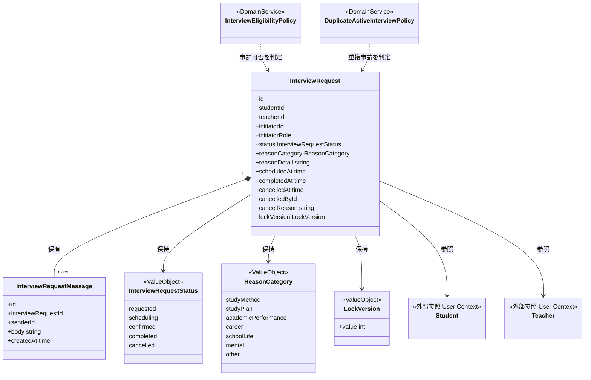
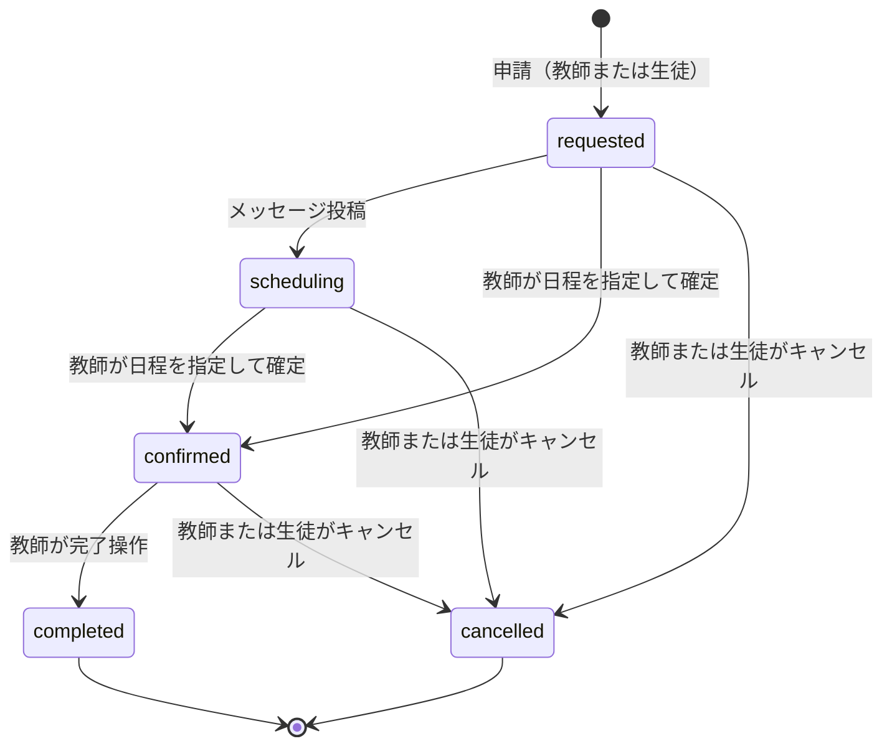
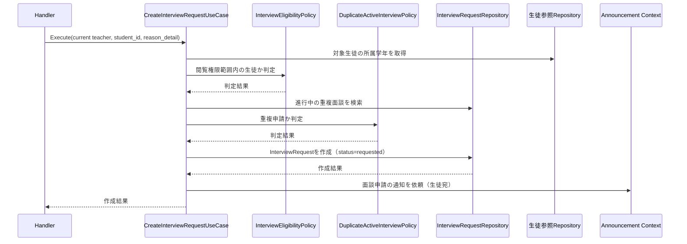
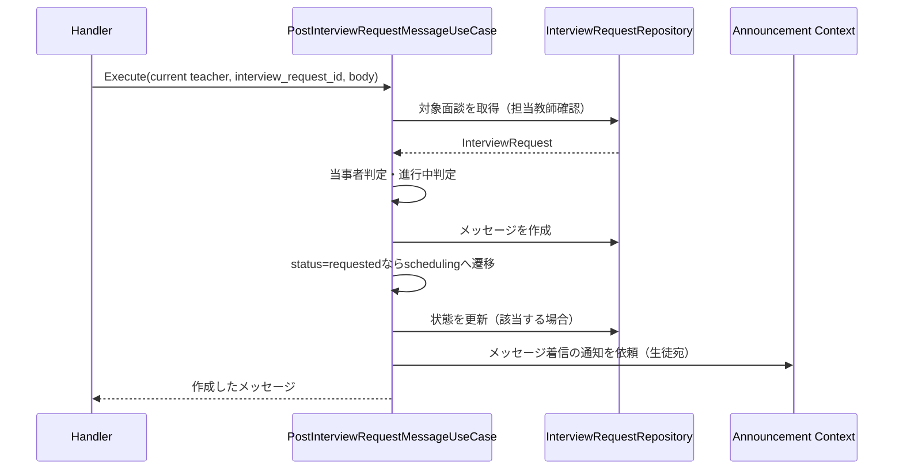
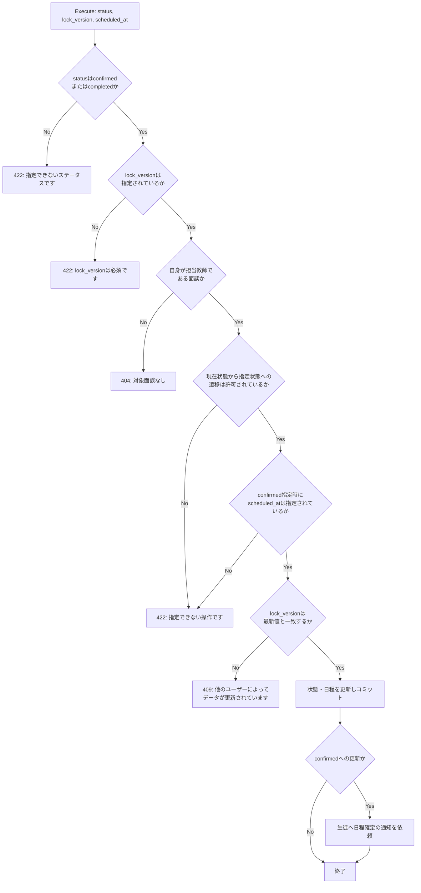

# 教師面談機能 Go移行・設計仕様書

---

# 1. 機能概要

## 機能概要

教師と生徒の間で行われる面談（進路相談・学習相談など）の申請・日程確定・完了・キャンセル、および面談ごとのメッセージのやり取りを管理する機能である。Rails現行仕様では、面談は「申請中（requested）→日程調整中（scheduling）→確定（confirmed）→完了（completed）」という状態を進み、いずれの進行中状態からも「キャンセル（cancelled）」へ遷移できる。本書は教師視点の操作（一覧・詳細取得、教師からの新規申請、確定・完了、キャンセル、メッセージ一覧取得・投稿）を対象とする。

## 利用者

- `teacher` ロールのユーザー（教師）
- 本書は教師視点の操作を対象とする。生徒視点の操作（生徒からの新規申請・取り消し）は「面談機能」仕様書の責務である。ただし、面談の状態遷移や通知など、教師・生徒間で共有される業務ルールは本書でも正確に記載する

## 業務上の目的

- 教師・生徒間の面談を、申請から完了まで一貫した状態管理のもとで進行させる
- 教師が担当範囲内の生徒に対してのみ面談を申請できるようにし、閲覧権限の範囲を業務ルールとして担保する
- 日程確定・完了・キャンセルという操作を適切な当事者（担当教師）に限定する
- 面談の進行に応じて相手方へ適時に通知を届ける

---

# 2. 設計方針

- 責務分離: HTTP入出力、入力形式検証、状態遷移ルール、当事者・スコープ認可、永続化、通知連携を分離する
- 保守性: 「requested→scheduling→confirmed→completed」および各進行中状態からの「cancelled」という状態遷移ルールをドメイン側に集約し、Controller/Service群に分散している現行ロジックを一箇所に統合する
- テスト容易性: 状態遷移・楽観ロックによる競合検出・当事者判定をドメイン層で単体テスト可能な形にする
- API互換性: 既存フロントエンドとの接続を維持するため、エンドポイント・リクエスト構造・レスポンス構造は概ね維持する
- 拡張性: 生徒視点の操作（面談機能）と状態遷移ルールを共有しつつ、教師視点固有の操作（確定・完了）を独立して拡張できる構造とする

---

# 3. Bounded Context

## Context名

- interview-request

## Contextの責務

- 面談（InterviewRequest）本体の状態管理（申請・日程調整・確定・完了・キャンセル）
- 面談メッセージ（InterviewRequestMessage）の管理
- 教師視点での面談一覧・詳細の参照、教師による新規申請・確定・完了・キャンセル・メッセージ投稿

本Contextは面談という単一の業務領域を、教師・生徒双方の視点から扱う。生徒視点の操作（生徒による新規申請・取り消し・メッセージ投稿）は「面談機能」仕様書が同一Context内の別ユースケース群として整理しており、本書はそのうち教師視点の操作を扱う。両書は同一のContext名（`interview-request`）・同一のEntity設計・同一の状態遷移ルールを前提とする。

## 他Contextとの依存関係

- User Context: 生徒・教師の識別情報、教師の所属校情報の参照に依存する
- Teacher Permission Context: 教師が新規申請可能な生徒の範囲（担当学年制限の有無）判定に依存する
- Announcement Context（`announcement`）: 面談の申請・確定・キャンセル・メッセージ投稿の都度、相手方へのお知らせ送信に依存する

## 依存する理由

面談の当事者・閲覧範囲の判定は、教師・生徒の所属情報（User Context）と教師の権限情報（Teacher Permission Context）を前提として成立する。これらの情報は本Contextの外側が真正な情報源であるため、本Contextはそれらを参照のみ行う。

また、Rails現行仕様書に「いずれも、お知らせの実体作成はお知らせ機能と共通の仕組み（システムお知らせ作成処理）を利用する」と明記されているとおり、面談状態の変化に伴う通知はAnnouncement Contextが提供する仕組みへ委譲する。これにより、お知らせの実体作成ロジックを本Context内に重複実装することを避ける。

---

# 4. 設計パターン

## 採用パターン

Domain Model

## 判断根拠

- InterviewRequestは「requested→scheduling→confirmed→completed」および各進行中状態からの「cancelled」という明示的な状態遷移ルールを持ち、不正な遷移（例: completedからconfirmedへ戻す）を防ぐ必要がある
- 確定・完了・キャンセルの各更新操作には楽観ロック（`lock_version`）による競合検出が必須であり、単純な属性更新だけでは扱いきれない整合性ルールを持つ
- メッセージ投稿は「本文を保存する」だけでなく「申請中の面談を日程調整中へ進める」という状態遷移を伴う副作用を持ち、複数の業務ルールが1つのEntityに関連する
- 新規申請には「担当範囲内の生徒であること」「同じ生徒・教師の組み合わせで進行中の面談が重複しないこと」という、複数Entity・複数Contextにまたがる業務ルールが存在する
- 教師視点・生徒視点の双方から同一Entityが操作されるため、状態遷移ルールをEntityに集約することで、教師面談機能・面談機能という2つの仕様書間でルールが重複・乖離することを防止できる

以上より、状態を持ち、状態遷移ルールと複数の業務ルールがEntityに関連し、将来的な拡張（面談種別の追加等）が見込まれるため、Domain Modelを採用する。

## 採用しなかったパターン

### Transaction Script

状態遷移・楽観ロック・当事者判定という複数の判定が、教師視点・生徒視点双方の複数のUseCaseに重複して発生する。手続き型に書くとロジックが分散し、教師面談機能・面談機能という2つの仕様書間で判断基準がずれるリスクが高いため不採用とする。

### Active Record

状態遷移の正しさを保証する責務をモデルの単純な属性更新に任せると、不正な状態遷移が容易に発生しうる。特に本機能は教師・生徒双方から更新されるため、遷移ルールをモデルの外（Handler層）に置くと、教師視点・生徒視点それぞれで重複実装するリスクが増す。

### Event Sourcing

現行仕様は「現在の状態」を管理すれば業務要件を満たしており、状態遷移の全履歴を再構築する要件は明示されていない。将来的に面談の実施履歴に対する監査要件が生じた場合は検討の余地があるが、現時点では過剰な設計である。

---

# 5. Aggregate設計

## Aggregate Root

- InterviewRequest

## Aggregateに含めるEntity

- InterviewRequest（本体）
- InterviewRequestMessage（メッセージ、複数）

## Aggregate境界

- 面談本体とそれに紐づくメッセージ群を1つの整合性単位として扱う
- メッセージの投稿は必ず面談に従属し、単独では存在しない
- メッセージ投稿時の状態遷移（requested→scheduling）は、面談本体の状態と同時に整合させる必要がある
- 対象として参照される生徒・教師・権限情報はAggregateの外部参照であり、Aggregateには含めない

## 整合性を保証する単位

- 新規申請時: 面談本体の作成と、重複申請チェックの結果を同一の業務操作の中で整合させる
- 更新時（確定・完了・キャンセル）: 状態遷移の可否判定と楽観ロックの検証を1つの単位として保証する
- メッセージ投稿時: メッセージの作成と、それに伴う面談本体の状態遷移（該当する場合）を1つの単位として保証する

理由: メッセージの投稿は面談の状態に直接影響を与える。面談本体とメッセージを別々のAggregateとして扱うと、両者の整合性を保証する層が分散し、「メッセージは保存されたが状態遷移が反映されない」といった不整合が生じうるため、1つのAggregateとして扱う。

---

# 6. Entity設計

## InterviewRequest

- 役割: 教師と生徒の面談1件分の申請・状態・日程を表す中心的なドメイン概念
- ライフサイクル: 申請（requested）→（メッセージ投稿により）日程調整中（scheduling）→（教師が日程を確定）確定（confirmed）→（教師が完了操作）完了（completed）。上記のいずれの進行中状態からもキャンセル（cancelled）へ遷移できる
- 状態変化:
  - requested → scheduling
  - requested/scheduling → confirmed
  - confirmed → completed
  - requested/scheduling/confirmed → cancelled
  - completed / cancelled は最終状態であり、以降の遷移は許可されない
- 保持する責務:
  - 生徒・教師・申請者（initiator）区分・状態・申請理由・日程・完了日時・キャンセル情報・楽観ロック用バージョンを保持する
  - 許可された状態遷移のみを受け付ける
  - `confirmed` への遷移時は `scheduled_at` の指定を必須とする
  - 楽観ロック用バージョン（`lock_version`）の不一致を検出する
- 判断根拠: 状態そのものが業務的な意味を持ち、遷移の正しさ・当事者制約・日程整合性を保証する責務が本Entityに強く関連するため

## InterviewRequestMessage

- 役割: 面談ごとの教師・生徒間のメッセージ1件を表す概念
- ライフサイクル: 面談が進行中（requested/scheduling/confirmed）のときに当事者が投稿し、以降は変更・削除されない
- 状態変化: なし（作成のみ）
- 保持する責務: 本文・送信者・投稿日時を保持する。投稿時に面談が「申請中」であれば「日程調整中」への遷移を促す
- 判断根拠: メッセージ投稿は単なる記録ではなく面談本体の状態遷移を誘発する行為であり、InterviewRequestと密接に関連するAggregate内Entityとして扱う必要があるため

## 参照専用の外部概念（Student / Teacher / TeacherPermission）

- 役割: 申請対象の妥当性判定・当事者判定の材料として参照する
- 判断根拠: これらは他Context（User Context, Teacher Permission Context）が真正な管理主体であり、本Contextでは書き込みを行わない参照専用の情報として扱う

---

# 7. Value Object設計

## InterviewRequestStatus

- 採用理由: 状態を文字列のまま扱うと、許可されない遷移が実装のあちこちで再チェックされ、抜け漏れが起きやすいため
- 独自ルール: requested/scheduling/confirmed/completed/cancelledのいずれかのみ許容し、「6. Entity設計」で整理した遷移パターンのみ許可する
- Entity属性ではなくValue Objectにする理由: 状態遷移という業務ルールそのものを型として表現し、教師視点・生徒視点それぞれのUseCaseから同じ判定ロジックを再利用できるようにするため

## LockVersion

- 採用理由: 楽観ロックによる更新競合の検出は、更新系操作（確定・完了・キャンセル）すべてに共通する業務ルールであるため
- 独自ルール: 更新系操作は必ずクライアントから提示されたバージョンを要求し、永続化層の最新バージョンと一致しない場合は競合として扱う
- Entity属性ではなくValue Objectにする理由: バージョン不一致の判定ロジックを型に閉じ込め、複数の更新系UseCase間で重複実装しないようにするため

## ReasonCategory

- 採用理由: 相談理由の種別は生徒からの申請時のみ使用される定義済みの値（学習方法/学習計画/成績/進路/学校生活/メンタル/その他）であり、教師からの申請では指定できないという制約があるため
- 独自ルール: 定義済み7種別のいずれかのみ許容し、`initiator_role=teacher` の場合は値を持たない
- Entity属性ではなくValue Objectにする理由: 「誰が申請したかによって許容される値が変わる」という制約を型として表現し、教師視点・生徒視点それぞれのUseCaseで一貫して扱うため

## Value Objectを採用しないもの

- 申請理由の詳細（`reason_detail`）・メッセージ本文（`body`）: 2000文字以内という長さの制約はあるが、Presentation層での形式チェックで十分に表現でき、独自の業務ルールを持たないためValue Object化は不要とする

---

# 8. Domain Service

## InterviewEligibilityPolicy

- 責務: 教師が新規申請できる相手の生徒かどうか（教師の閲覧権限範囲内の生徒か）を判定する
- Entityへ持たせない理由: 判定には教師の権限情報（Teacher Permission Context）という、InterviewRequest単体では保持しない外部情報が必要なため
- 判断根拠: 教師生徒参照機能におけるGradeScopeと同様、「担当学年制限」を参照する業務ルールであり、UseCaseに直接書くと再利用性・テスト容易性が下がるため独立したポリシーとして切り出す

## DuplicateActiveInterviewPolicy

- 責務: 同じ生徒・教師の組み合わせで、進行中（requested/scheduling/confirmed）の面談が既に存在しないかを判定する
- Entityへ持たせない理由: 判定には対象の生徒・教師の組み合わせに対する既存レコード群の参照が必要であり、単一のInterviewRequest Entityの責務を超えるため
- 判断根拠: 重複申請の防止は教師視点・生徒視点いずれの新規申請UseCaseからも呼び出される共通ルールであり、独立したポリシーとして一箇所に集約することで、教師面談機能・面談機能の両仕様書間でルールが乖離することを防ぐ

---

# 9. クラス図

---

# 10. 状態遷移図

禁止される遷移: 上記以外の組み合わせ（例: completed→confirmed、cancelled→requested、confirmed→requestedへの後退等）はすべて禁止する。

---

# 11. Repository設計

## InterviewRequestRepository

- 管理対象: InterviewRequest, InterviewRequestMessage
- 責務:
  - 担当教師による面談一覧・詳細の検索
  - 面談の新規作成
  - 状態・日程・キャンセル情報の楽観ロック付き更新
  - メッセージの作成・一覧取得
- 保持する検索機能:
  - teacher_idによる絞り込み
  - statusによる絞り込み
  - 申請日時降順のページネーション
  - メッセージの投稿日時昇順のページネーション
- 保持しない責務:
  - 状態遷移の可否判定
  - 当事者判定
- 判断根拠: 永続化と検索条件の実行に責務を限定し、業務ルールの判断はEntity/Domain Serviceに残すため

## 外部参照Repository（Student / TeacherPermission）

- 管理対象: 各Contextが所有するエンティティ（本Contextからは参照のみ）
- 責務: 新規申請時、対象生徒が教師の閲覧権限範囲内であることの確認に必要な参照を提供する
- 保持しない責務: 申請可否そのものの判断（InterviewEligibilityPolicyが担う）
- 判断根拠: 他Contextの所有物への書き込みを行わず、参照のみに責務を限定するため

---

# 12. UseCase設計

## ListInterviewRequestsUseCase

- 目的: 自身が担当教師である面談の一覧を、状態で絞り込んで取得する
- 入力: current teacher, status（任意）, page, per_page
- 出力: 面談一覧、ページ情報
- トランザクション範囲: 読み取りのみ、トランザクション不要
- 呼び出すRepository: InterviewRequestRepository
- 判断根拠: 単一条件での検索・ページネーションのみであり、書き込みを伴わないため

## ShowInterviewRequestUseCase

- 目的: 指定面談の詳細を取得する
- 入力: current teacher, interview request id
- 出力: 面談詳細
- トランザクション範囲: 読み取りのみ
- 呼び出すRepository: InterviewRequestRepository
- 判断根拠: 自身が担当教師である面談のみを対象とする単純な参照処理であるため

## CreateInterviewRequestUseCase

- 目的: 教師が担当範囲内の生徒に対して面談を申請する
- 入力: current teacher, student_id, reason_detail
- 出力: 作成結果
- トランザクション範囲: InterviewRequestの作成を1トランザクションで扱う
- 呼び出すRepository: InterviewRequestRepository（重複チェック・作成）、生徒参照Repository、TeacherPermission参照Repository
- 判断根拠: InterviewEligibilityPolicy・DuplicateActiveInterviewPolicyによる判定を踏まえ、面談を一貫して作成する必要があるため

## UpdateInterviewRequestStatusUseCase

- 目的: 自身が担当教師である面談を確定（confirmed）または完了（completed）状態に更新する
- 入力: current teacher, interview request id, status（confirmed/completedのいずれか）, lock_version, scheduled_at（confirmed指定時は必須）
- 出力: 更新結果
- トランザクション範囲: InterviewRequestの状態更新を1トランザクションで扱う
- 呼び出すRepository: InterviewRequestRepository
- 判断根拠: 状態遷移の可否・楽観ロック検証はInterviewRequest Entityが判定し、UseCaseは所有者確認と永続化のみを担当するため

## CancelInterviewRequestUseCase

- 目的: 自身が担当教師である進行中の面談をキャンセルする
- 入力: current teacher, interview request id, lock_version, reason（任意）
- 出力: 更新結果
- トランザクション範囲: InterviewRequestの状態更新を1トランザクションで扱う
- 呼び出すRepository: InterviewRequestRepository
- 判断根拠: キャンセル可否の判定（進行中であること）はEntityが担い、UseCaseは所有者確認と永続化のみを担当するため

## ListInterviewRequestMessagesUseCase

- 目的: 自身が担当教師である面談に紐づくメッセージ一覧を取得する
- 入力: current teacher, interview request id, page, per_page
- 出力: メッセージ一覧、ページ情報
- トランザクション範囲: 読み取りのみ
- 呼び出すRepository: InterviewRequestRepository
- 判断根拠: 単純な参照処理であるため

## PostInterviewRequestMessageUseCase

- 目的: 面談にメッセージを投稿し、必要に応じて状態遷移を行う
- 入力: current teacher, interview request id, body
- 出力: 作成したメッセージ
- トランザクション範囲: メッセージの作成と（該当する場合の）状態遷移を1トランザクションで扱う
- 呼び出すRepository: InterviewRequestRepository
- 判断根拠: 当事者判定・進行中判定・状態遷移はInterviewRequest Aggregateが一貫して担う必要があるため

---

# 13. シーケンス図・処理フロー図

## シーケンス図

### CreateInterviewRequestUseCase（教師からの申請）

### PostInterviewRequestMessageUseCase

## 処理フロー図

### UpdateInterviewRequestStatusUseCase

---

# 14. Transaction設計

## Transaction開始位置

- 書き込みを伴うUseCase（CreateInterviewRequestUseCase / UpdateInterviewRequestStatusUseCase / CancelInterviewRequestUseCase / PostInterviewRequestMessageUseCase）の開始時にトランザクションを開始する

## Transaction終了位置

- 各UseCaseの永続化（面談の作成・更新、メッセージの作成）が完了した時点でコミットする
- ListInterviewRequestsUseCase / ShowInterviewRequestUseCase / ListInterviewRequestMessagesUseCaseではトランザクションを使用しない

## 理由

1回の業務操作（申請・確定・完了・キャンセル・メッセージ投稿）に対して、状態・楽観ロック・メッセージの整合性を保つため、UseCase単位で境界を統一する。通知（Announcement Contextへの依頼）は業務データの確定後に行うベストエフォート処理であるため、トランザクション範囲には含めない（詳細は「18. Domain Event」を参照）。

---

# 15. Validation設計

## Presentation

- 型チェック: page / per_page / lock_versionが整数であること、statusが文字列であることを検証する
- 必須チェック: 新規申請時の student_id / reason_detail、更新時の status / lock_version（confirmed指定時はscheduled_atも必須）、メッセージ投稿時のbodyを検証する
- フォーマットチェック: reason_detail / bodyの2000文字以内チェック、statusが定義済みの値（confirmed/completed）であることの形式的な検証

## Domain

- 業務ルール: 申請先の生徒が教師の閲覧権限範囲内であるか（InterviewEligibilityPolicy）、同一生徒・教師の組み合わせで進行中の面談が重複していないか（DuplicateActiveInterviewPolicy）
- 状態チェック: 状態遷移が許可された組み合わせかどうか（InterviewRequest Entity）、メッセージ投稿時に面談が進行中であるか
- 整合性チェック: confirmed遷移時のscheduled_at必須チェック、更新系操作全般のlock_version一致チェック

## バリデーション仕様

|フィールド|検証層|ルール|エラーメッセージ方針|
|-|-|-|-|
|student_id（新規申請）|Presentation|必須・整数|「生徒を指定してください」相当|
|reason_detail|Presentation|必須・2000文字以内|「申請理由を入力してください」相当|
|reason_detail の対象生徒|Domain|教師の閲覧権限範囲内の生徒であること|`errors`（担当外の生徒への申請不可）|
|同一生徒・教師の重複申請|Domain|進行中の面談が既に存在しないこと|`errors`（重複申請不可）|
|status（更新）|Presentation|必須・confirmed/completedのいずれか|「指定できないステータスです」|
|lock_version（更新・キャンセル）|Presentation|必須・整数|「lock_versionは必須です」|
|scheduled_at（confirmed指定時）|Domain|confirmed指定時は必須|「指定できない操作です」|
|状態遷移の組み合わせ|Domain|許可された遷移のみ|「指定できない操作です」|
|lock_versionの整合性|Domain|最新バージョンと一致すること|「他のユーザーによってデータが更新されています。再読み込みしてください」|
|キャンセル対象の状態|Domain|進行中（requested/scheduling/confirmed）であること|「進行中の面談のみキャンセルできます」|
|body（メッセージ）|Presentation|必須・2000文字以内|「本文を入力してください」相当|
|メッセージ投稿時の面談状態|Domain|進行中であること|`errors`（進行中でない面談への投稿不可）|

---

# 16. Authorization設計

## Middleware

- 認証済みユーザーを特定し、`teacher` ロールであることを確認する

## Handler

- ルーティングとHTTP入出力の変換のみを担当し、業務権限判定は持たせない

## UseCase

- 一覧・詳細・更新・キャンセル・メッセージの閲覧/投稿は、いずれも自身が担当教師（`teacher_id`）である面談のみを対象とする
- 新規申請時、申請先の生徒が閲覧権限範囲内（InterviewEligibilityPolicyの判定）かどうかを確認する
- 対象面談が権限範囲外である場合は、存在しない場合と同様に扱う（404）

## Domain

- InterviewRequest Entityが、許可されない状態遷移を拒否する
- InterviewRequestMessage投稿時、投稿者が面談の当事者（担当教師または対象生徒）であることを判定する

## 判断理由

「担当教師の面談のみを対象とする」というスコープ制御はUseCase側で一貫して適用し、状態遷移・当事者判定という具体的な業務ルールはDomain側に配置することで、認可のスコープ判定と業務ルール判定を分離する。確定・完了への変更は教師のみが行える操作としてRails現行仕様上も明示されており、本Contextの教師向けUseCase群にのみ実装する（生徒向けの確定・完了操作は存在せず、「面談機能」側にも実装されない）。

---

# 17. Error設計

## Domain Error

責務: 業務ルール違反を表現する

- 不正な状態遷移
- confirmed遷移時のscheduled_at未指定
- 閲覧権限範囲外の生徒への新規申請
- 同一生徒・教師の重複申請
- 進行中でない面談へのメッセージ投稿・キャンセル
- メッセージ投稿における当事者性の欠如

## Application Error

責務: ユースケース実行時の失敗を表現する

- 対象面談が存在しない、または自身が担当教師でない
- 楽観ロック競合（lock_versionの不一致）

## Infrastructure Error

責務: DB接続・永続化・外部Context（Announcement Context）連携時の技術的失敗を表現する

## 判断理由

業務ルール違反（Domain）とリソース未存在・競合（Application）を区別することで、HTTPステータス変換（422 / 404 / 409）を一貫した基準で行える。楽観ロック競合は、Domainの業務ルール違反ではなく「同時実行環境における実行タイミングの衝突」であるため、Application Errorとして扱い、409に変換する。

## エラー仕様

|業務シナリオ|エラー種別|発生層|想定するHTTPステータス|
|-|-|-|-|
|対象面談が存在しない、または担当教師でない|NotFound|Application|404|
|指定できない状態を指定|Validation|Presentation|422|
|lock_version未指定|Validation|Presentation|422|
|許可されない状態遷移、confirmed時のscheduled_at未指定|Validation|Domain|422|
|lock_versionが最新値と不一致（楽観ロック競合）|Conflict|Application|409|
|進行中でない面談のキャンセル|Validation|Domain|422|
|閲覧権限範囲外の生徒への新規申請|Validation|Domain|422|
|同一生徒・教師で進行中の面談が重複|Validation|Domain|422|
|メッセージ投稿の当事者でない、または面談が進行中でない|Validation|Domain|422|

---

# 18. Domain Event

必要と判断し、採用する。

## イベント名

- InterviewRequested
- InterviewConfirmed
- InterviewCancelled
- InterviewRequestMessagePosted

## 発火タイミング

- 各対応するUseCase（CreateInterviewRequestUseCase / UpdateInterviewRequestStatusUseCase[confirmed時] / CancelInterviewRequestUseCase / PostInterviewRequestMessageUseCase）の永続化完了直後

## 利用目的

- Announcement Context（お知らせ機能と共通の仕組み）への通知依頼を、同期的な業務処理から切り離すため

## 採用理由

Rails現行仕様書は、申請・確定・キャンセル・メッセージ投稿という4つの異なるトリガーそれぞれについて、非同期ジョブによる通知送信を明記している（「9. 非同期処理」参照）。これは複数の処理（4つの異なる状態変化）へ波及する非同期通知であり、アーキテクチャ規約5章・本書「Domain Model採用基準」の採用条件を満たすため、Domain Eventとして明示的にモデル化する。

実装上は、アーキテクチャ規約13章（非同期ジョブ実行パターン）の「ベストエフォートで良い処理」に分類する。通知の送達に失敗しても面談自体の状態（申請・確定・キャンセル・メッセージ）は正しく確定しており、ユーザーはアプリ上で最新状態を確認できるため、確実な再試行（`jobs`テーブル）までは必須としない（推測: Rails現行仕様書は「非同期ジョブで送信する」としか記載しておらず、リトライ要件の明記はないため、通知の性質上パスワードリセットメール送信と同様のベストエフォート処理として扱うのが妥当と判断した）。

---

# 19. API仕様

## エンドポイント一覧

|エンドポイント|HTTP Method|概要|
|-|-|-|
|/api/v1/teacher/interview_requests|GET|担当面談の一覧を取得|
|/api/v1/teacher/interview_requests/:id|GET|面談詳細を取得|
|/api/v1/teacher/interview_requests|POST|面談を申請|
|/api/v1/teacher/interview_requests/:id|PATCH|面談を確定・完了にする|
|/api/v1/teacher/interview_requests/:id|DELETE|面談をキャンセルする|
|/api/v1/teacher/interview_requests/:interview_request_id/messages|GET|面談メッセージ一覧を取得|
|/api/v1/teacher/interview_requests/:interview_request_id/messages|POST|面談にメッセージを投稿|

## 各エンドポイントの仕様

### GET /api/v1/teacher/interview_requests

- Request: status（任意、状態での絞り込み）、page（任意）、per_page（任意、未指定時20件・最大100件）
- Response: 面談一覧（状態・申請理由・希望日時・確定日時・完了日時・キャンセル情報・生徒名・教師名等を含む）、ページ情報
- Status Code: 200
- Error Response: なし（認証前提）

### GET /api/v1/teacher/interview_requests/:id

- Request: id（route）
- Response: 面談詳細
- Status Code: 200 / 404（対象面談なし、または担当教師でない）
- Error Response: 既存のerrors形式を踏襲する

### POST /api/v1/teacher/interview_requests

- Request: student_id、reason_detail
- Response: message（「面談を申請しました」相当）
- Status Code: 201 / 422（バリデーション失敗）
- Error Response: 既存のerrors形式を踏襲する

### PATCH /api/v1/teacher/interview_requests/:id

- Request: status（confirmed/completedのいずれか）、lock_version、scheduled_at（confirmed指定時必須）
- Response: message（「ステータスを更新しました」相当）
- Status Code: 200 / 404 / 409（楽観ロック競合）/ 422
- Error Response: 既存のerrors形式を踏襲する

### DELETE /api/v1/teacher/interview_requests/:id

- Request: reason（任意）、lock_version（任意、Rails現行仕様では明示必須とはされていないが、他ユーザーによる状態変化との競合検出のため指定を推奨する）
- Response: message（「面談をキャンセルしました」相当）
- Status Code: 200 / 404 / 422（進行中でない面談へのキャンセル試行）
- Error Response: 既存のerrors形式を踏襲する

### GET /api/v1/teacher/interview_requests/:interview_request_id/messages

- Request: interview_request_id（route）、page（任意）、per_page（任意、未指定時20件・最大100件）
- Response: メッセージ一覧（本文・投稿者ID・投稿者名・投稿日時）、ページ情報
- Status Code: 200 / 404
- Error Response: 既存のerrors形式を踏襲する

### POST /api/v1/teacher/interview_requests/:interview_request_id/messages

- Request: interview_request_id（route）、body
- Response: 作成したメッセージ
- Status Code: 201 / 404 / 422
- Error Response: 既存のerrors形式を踏襲する

## Railsとの差分

現時点でRails仕様からの変更はない。エンドポイント・リクエスト構造・レスポンス構造・ステータスコードはRails現行仕様を維持する。

---

# 20. DB設計方針

## 現行DBを利用するか

- 既存Rails DBを継続利用する

## Schema変更有無

- 変更なし

## 変更理由

- 現行の `interview_requests` / `interview_request_messages` テーブルは、状態遷移・楽観ロック（`lock_version`）・メッセージ管理という業務要件を満たしており、追加のスキーマ変更は不要である

---

# 21. DB操作仕様

## InterviewRequestRepository

- 対象テーブル: `interview_requests`, `interview_request_messages`
- 操作種別:
  - 作成（面談本体、メッセージ）
  - 参照（一覧・詳細・メッセージ一覧）
  - 更新（状態・日程・完了日時・キャンセル情報、楽観ロック付き）
- 主な検索条件・絞り込み条件: `teacher_id` による絞り込み、`status` による絞り込み、`interview_request_id` によるメッセージの紐付け
- 関連テーブルとの結合: メッセージ一覧取得時に `interview_request_id` で `interview_request_messages` と結合する
- ページネーション・ソート: 面談一覧は申請日時降順、メッセージ一覧は投稿日時昇順でページネーションする

## 外部参照Repository（Student / TeacherPermission）

- 対象テーブル: `users`（生徒）, `teacher_permissions`
- 操作種別: 参照のみ
- 主な検索条件: 対象生徒の所属学年、教師の権限区分（`own_grade_restriction` 相当）
- 関連テーブルとの結合: 不要
- ページネーション・ソート: 不要

---

# 22. テスト戦略

## Domain Test

- 目的: InterviewRequestの状態遷移ルール、楽観ロックの検証ロジック、InterviewEligibilityPolicy・DuplicateActiveInterviewPolicyの判定ロジックを検証する

## UseCase Test

- 目的: ListInterviewRequestsUseCase / ShowInterviewRequestUseCase / CreateInterviewRequestUseCase / UpdateInterviewRequestStatusUseCase / CancelInterviewRequestUseCase / ListInterviewRequestMessagesUseCase / PostInterviewRequestMessageUseCaseの業務振る舞いを検証する

## Repository Test

- 目的: InterviewRequestRepositoryによる担当教師・状態での絞り込み、ページネーション、楽観ロック付き更新の正確性を検証する

## Handler Test

- 目的: API入力のバリデーション結果とHTTPステータス（200/201/404/409/422）の変換を検証する

## Integration Test

- 目的: エンドポイント経由での申請・確定・完了・キャンセル・メッセージ投稿が、状態遷移ルールに従って正しく連携して動作することを確認する

---

# 23. Railsとの責務対応

| Rails | Go | 設計方針 |
|---|---|---|
| Controller（InterviewRequestsController, InterviewRequestMessagesController） | Handler | HTTP入出力のみを担当する |
| Form（Teacher::CreateInterviewRequestForm） | Request DTO + Presentation Validation | 入力形式の検証を分離する |
| Service（Teacher::CreateInterviewRequestService, Teacher::ProcessInterviewRequestService, Teacher::CancelInterviewRequestService, Teacher::CreateInterviewRequestMessageService） | UseCase | 業務処理の起点として扱う |
| Model（InterviewRequest）の状態遷移バリデーション | InterviewRequest Entity | 状態遷移ルールをEntityの責務として明確化する |
| Model（InterviewRequestMessage） | InterviewRequestMessage Entity | メッセージの保持責務として整理する |
| Common::CreateInterview*NotificationService / Job | Domain Event（InterviewRequested等）購読による非同期実行 | 通知の実体作成をAnnouncement Contextへ委譲し、発火のみを本Contextの責務とする |
| Serializer | Presenter / Response DTO | レスポンス整形を分離する |

---

# 24. 採用しなかった設計

## Transaction Script

- 採用しなかった理由: 状態遷移・楽観ロック・当事者判定が教師視点・生徒視点双方の複数のUseCaseに重複して発生し、手続き型で書くとロジックが分散・乖離しやすいため
- 将来的に採用する可能性: 機能が大幅に単純化され、教師・生徒間の状態共有が不要になった場合には再検討できるが、現状は見込みが低い

## Active Record

- 採用しなかった理由: 状態遷移の妥当性・楽観ロック・当事者判定をモデル属性の検証だけに任せると、教師視点・生徒視点で実装が重複し、責務が肥大化するため
- 将来的に採用する可能性: 状態遷移ルールが撤廃され、単純な予約フォームのような機能になった場合は検討の余地がある

## Event Sourcing

- 採用しなかった理由: 状態遷移の履歴管理・監査要件が現時点で存在しないため
- 将来的に採用する可能性: 面談実施履歴の監査要件が生じた場合に有効な可能性がある

---

# 25. 設計判断サマリー

|項目|採用|判断理由|
|-|-|-|
|設計パターン|Domain Model|状態遷移ルールと楽観ロック・当事者判定という業務ルールが明確に存在し、教師・生徒双方から操作されるため|
|Aggregate|InterviewRequest + InterviewRequestMessage|メッセージ投稿が面談本体の状態遷移を誘発し、両者の整合性を1単位で保証する必要があるため|
|Transaction境界|UseCase単位|申請・確定・完了・キャンセル・メッセージ投稿それぞれが1つの整合性単位であるため|
|Domain Service|InterviewEligibilityPolicy / DuplicateActiveInterviewPolicy|複数Context・複数レコードにまたがる判定を分離するため|
|Domain Event|採用（InterviewRequested / InterviewConfirmed / InterviewCancelled / InterviewRequestMessagePosted）|4つの異なる状態変化それぞれについて非同期通知が必要であり、規約が定めるベストエフォートパターンで実現するため|
|Value Object|採用（InterviewRequestStatus / LockVersion / ReasonCategory）|状態遷移・楽観ロック・申請者区分ごとの許容値を型として表現するため|
|Authorization|Middleware + UseCase + Domain|認証・所有権確認（担当教師スコープ）・業務ルール判定（状態遷移・当事者性）を層ごとに分離するため|
|Context名|interview-request|生徒視点の「面談機能」と同一Context・同一Entity設計を共有するため|

---

# 設計差分管理

## Rails現行仕様

- Controllerが各アクションで対象面談の取得・楽観ロック検証・状態遷移可否判定を個別に実装している
- Service群（Teacher::CreateInterviewRequestService, Teacher::ProcessInterviewRequestService, Teacher::CancelInterviewRequestService, Common::CancelInterviewRequestService等）に、状態遷移ルールと通知トリガーが分散している
- 通知の実体作成はお知らせ機能と共通の仕組み（システムお知らせ作成処理）を利用し、Job経由で非同期に送信される

## Go設計での変更内容

- 入力形式検証をPresentation層に寄せる
- 状態遷移ルール・楽観ロック検証をInterviewRequest Entityの責務として明確化する
- 申請可否判定（閲覧権限範囲・重複申請）をInterviewEligibilityPolicy / DuplicateActiveInterviewPolicy（Domain Service）に集約する
- 通知トリガーをDomain Event（InterviewRequested等）として明示的にモデル化し、実体作成はAnnouncement Contextへ委譲する

## 変更理由

Rails実装ではService/Job/Common配下に状態遷移・通知トリガーのロジックが分散しており、ルール変更時の影響範囲が把握しにくい。Go設計では、状態遷移・楽観ロックはEntity、申請可否の判定はDomain Service、通知トリガーはDomain Eventに責務を集約することで、業務ルール変更時の修正箇所を明確にし、保守性・テスト容易性を高める。また、教師面談機能・面談機能という2つの仕様書が同一のEntity設計・状態遷移ルールを共有することを明示することで、両者の実装が乖離するリスクを低減する。

## 影響範囲

- フロントエンドから見たAPI外部仕様は維持する
- 既存DBスキーマは維持するため、データ移行は不要
- 通知の実体作成ロジックの変更は、本機能・面談機能・お知らせ機能（Announcement Context）の3機能に影響しうる
