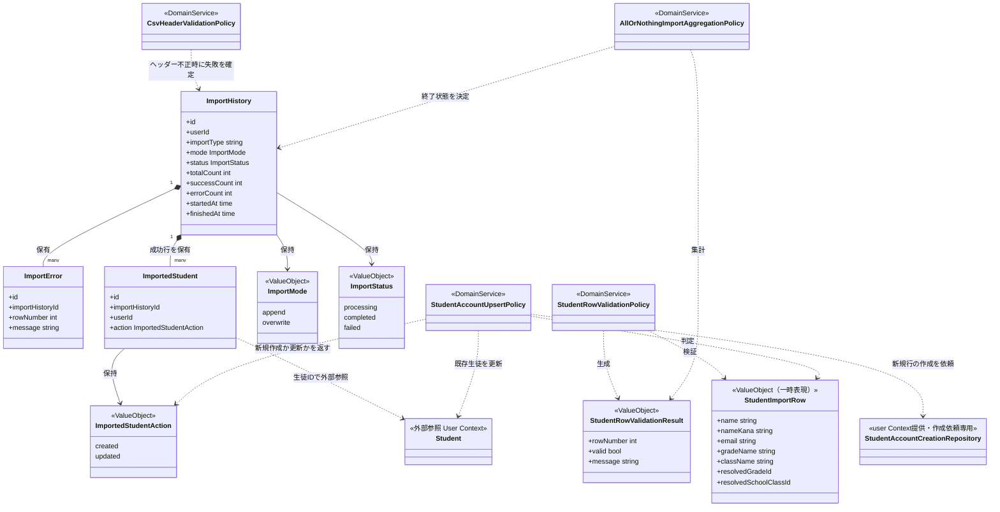
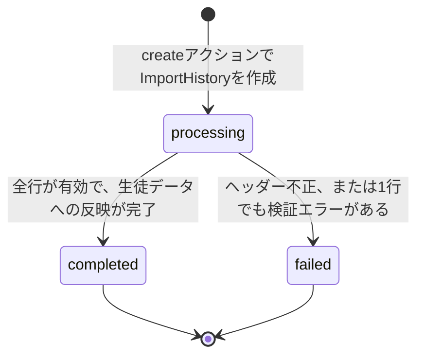
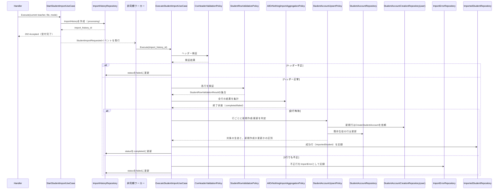
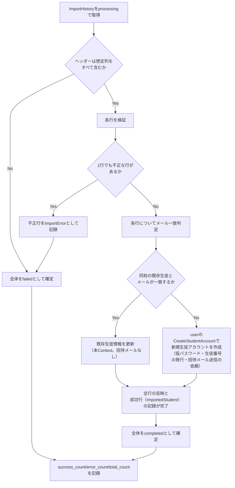

# 生徒CSVインポート機能 Go移行・設計仕様書

---

# 1. 機能概要

## 機能概要

教師がCSVファイルを使って、同校の生徒アカウントをまとめて登録・更新できる機能である。Rails現行仕様では、実際のインポート前に内容を検証する事前検証（dry run、同期・DB書き込みなし）と、インポート履歴（ImportHistory）を作成した上で非同期にCSVを処理するインポート実行（create、202 Accepted）の2操作を提供する。行単位のエラーはImportErrorとして記録される。全行が有効でインポートが成功した場合は、インポートされた各生徒（新規作成か既存生徒の更新か）が成功行（ImportedStudent）として履歴ごとに記録される。この記録は、教師がインポート結果を確認し、生徒コードを配布するために、教師インポート履歴管理機能が参照する。インポートによって新規作成された生徒アカウントには、仮パスワード発行と招待メール送信が行われる。

## 利用者

- `teacher` ロールのユーザー（教師）

## 業務上の目的

- 大量の生徒データを一括で登録・更新できるようにし、手動登録の工数を削減する
- 実行前に内容を検証できるようにし、誤ったデータの投入を防ぐ
- 処理結果を履歴として残し、失敗した行を特定できるようにする
- 成功した行の生徒を履歴ごとに記録し、インポート後に、どの生徒が新規作成・更新されたかを確認できるようにする
- 実行した教師の所属高校に対象を厳密にスコープし、他校データへの誤登録を防止する

---

# 2. 設計方針

本機能は、管理者問題インポート機能と同様に「CSVアップロードの受付」と「CSV処理の実行」という2つの業務局面を明確に分離したGo設計とする。一方で、管理者問題インポート機能が行単位の部分的成功を許容するのに対し、本機能は「1件でも不正な行があれば全体を失敗とし、有効な行についても一切反映しない」という全件成功・全件失敗（all-or-nothing）の業務ルールを持つ点が明確に異なる。この違いを設計上も区別して扱う。

主な設計思想は以下のとおりである。

- 責務分離: リクエスト受付（同期）とCSV処理実行（非同期）を明確に分離する
- 保守性: 全件成功・全件失敗という集計ルールと、行単位の検証ロジックをドメイン側に集約する
- テスト容易性: インポートの進行状態（processing→completed/failed）と、事前検証（dry run）の結果算出ロジックを独立してテストできるようにする
- 拡張性: 将来的に他リソース（教員等）のCSVインポートが追加された場合にも、進行状態管理の考え方を再利用しやすい構造とする
- API互換性: 同期リクエスト部分（202 Accepted、dry runの200）のAPI仕様を維持する

---

# 3. Bounded Context

## Context名

- student-import

管理者問題インポート機能が採用した `question-import` という命名パターン（対象リソース名＋`-import`）に倣い、生徒データを対象とする本機能は `student-import` とする。

## Contextの責務

- CSVアップロードの受付（事前検証・インポート実行の両方）
- インポート処理の進行状態管理
- 行単位の成功・失敗記録（失敗はImportError、成功は、インポートされた生徒の記録であるImportedStudent）
- 本Contextが記録したインポート履歴（実行結果・成功行・エラー明細）の教師向け参照は、教師インポート履歴管理機能（同一Contextの参照専用のUseCase群）が担う
- 新規行の生徒アカウント作成の依頼（`user` Contextの`CreateStudentAccount`を呼ぶ。仮パスワードの発行・生徒番号の発行・招待メール送信の依頼は`user`が行う）
- 既存生徒情報（氏名・氏名カナ・メールアドレス・学年・クラス）の更新（`user` Contextは更新を持たないため、本Contextの責務とする。招待メールは送らず、`password_reset_required`にも触れない）

## 他Contextとの依存関係

- User Context（`user`。②は`ユーザー基盤機能_Go移行・設計仕様書.md`）: 新規行の生徒アカウント作成を、公開操作`CreateStudentAccount`の呼び出しで依頼する。この操作が、仮パスワードの発行・生徒番号の発行・招待メール送信の依頼を行い、生徒は常に招待待ち・作成時に招待メールを送る（入力で指定しない）。所属校・学年・クラスの実在と整合は、本Contextが検証済みの内容を渡す（`user`②「15. Validation設計」）。`user`は既存アカウントの更新を持たないため、既存生徒の更新は本Contextが自身で行う（`user`②「3. Bounded Context」の「アカウントの更新・論理削除の扱い」）
- School/Grade Context: CSV上の学年名・学級名から、実在する学年・クラスを解決する（表示名からIDへの解決）ことに依存する

## 依存する理由

本Contextの中心はCSVの検証・インポート進行管理であり、新規の生徒アカウントの本体情報（仮パスワードの発行・生徒番号の発行・招待メール送信の依頼）はUser Contextの責務に委ねる。これにより、student-import Contextがアカウント生成の詳細（パスワードハッシュ化方式やメール送信基盤等）の知識を過度に持たずに済む。一方、既存生徒の氏名・氏名カナ・メールアドレス・学年・クラスの上書きは、CSVインポート固有の処理であり、`user`が更新を持たないため、本Contextが担う。学年・クラスの名称解決はSchool/Grade Contextが真正なデータを持つため、そちらに問い合わせる。

Rails現行実装では、生徒アカウントの新規作成（`Student::CreateStudentService`。`Common::CreateUserService`を継承）を、CSV一括登録（`Teacher::StudentCsvImportService`）と教師生徒参照機能の単体登録（`Teacher::CreateStudentForm`）の双方が呼んでいる。Goでは、この共通のアカウント作成処理を`user` Contextの`CreateStudentAccount`が担い、本Contextと`student-directory`は、それぞれ`user`を直接呼ぶ（本Contextは作成処理の提供元ではない）。既存生徒の更新（Rails現行の`Teacher::StudentCsvImportService#update_existing_user`）は、新規作成と異なり招待メールを送らず、`password_reset_required`にも触れない。この処理は`user`の範囲に含まれないため、本Contextが持つ。

---

# 4. 設計パターン

## 採用パターン

Domain Model

## 判断根拠

本機能は単純なCRUDではなく、以下のような業務上意味のある状態管理・業務ルールを含む。

- ImportHistoryは「processing→completed/failed」という進行状態を持ち、業務上意味のある状態遷移を伴う。ただし管理者問題インポート機能とは異なり「一部失敗」という中間的な終了状態は存在せず、全件成功か全件失敗のいずれかに二分される
- 「1行でも不正な行があれば全体を失敗とし、有効な行についても生徒データへの反映を一切行わない」という全件成功・全件失敗の集計ルールは、単純なデータ保存以上の業務ルールである
- 行ごとに「メールアドレスが同校の既存生徒と一致すれば更新、一致しなければ新規作成」という判定ロジックが発生し、これも単純な保存ではなく業務的な判断を要する
- 事前検証（dry run）は、インポート実行時と同一の検証ロジックを再利用しつつ、DB書き込みを行わずに結果のみを返すという、検証ロジックと実行ロジックの分離を要求する
- 将来的に他リソース（教員等）のCSVインポートが増えることを想定すると、進行状態管理ロジックを汎用的なドメイン概念として独立させておく方が拡張しやすい

以上のとおり、業務領域の複雑さ・状態管理の必要性・将来の拡張性の観点から、Domain Modelを採用する。

## 採用しなかったパターン

### Transaction Script

CSV行の処理自体は手続き的だが、全件成功・全件失敗の集計ルールや、行ごとの新規作成/更新判定ロジックを直接UseCaseに書き込むと、dry runとインポート実行の双方でロジックが重複し、乖離しやすくなる。これらは業務上重要なルールであるため、手続きから独立させる必要がある。

### Active Record

ImportHistoryを単なる永続化モデルとして扱うと、全件成功・全件失敗の判定ロジックや、行単位の検証ロジックがモデルに寄りすぎるか、あるいはdry run・インポート実行それぞれのUseCaseに散在しやすくなる。CSV処理の複雑さに対してモデルが肥大化しやすいため見送る。

### Event Sourcing

CSV行単位の処理操作をすべてイベントとして永続化・再生する要件は現行仕様には存在せず、成功件数・失敗件数の集計結果とエラー一覧があれば業務要件を満たせる。現時点では過剰設計と判断する。

---

# 5. Aggregate設計

## Aggregate Root

- ImportHistory

## Aggregateに含めるEntity

- ImportHistory
- ImportError（行単位のエラー情報）
- ImportedStudent（成功行の記録。インポートされた生徒と、新規作成か更新かの区別）

## Aggregate境界

- ImportHistoryが「1回のインポート処理の進行状態・結果集計」を一貫して管理する単位とする
- ImportErrorとImportedStudentはImportHistoryに従属し、単独では存在しない
- 生徒アカウント（User）はAggregateに含めない。生徒アカウントの真正な管理はUser Contextの責務であり、student-import Contextからは、新規行については「作成を依頼する対象」（`user`の`CreateStudentAccount`）、既存生徒については「更新する対象」（本Contextが`users`の限定した列を書き換える）として外部参照する

## 整合性を保証する単位

- 1回のインポート処理におけるImportHistoryの状態（status / success_count / error_count / total_count）とImportErrorの一覧、およびImportedStudentの一覧が常に整合していること（`completed`の履歴にのみImportedStudentが存在し、`failed`の履歴には存在しない）
- 全行の検証結果が確定するまで生徒データへの反映を一切行わないという、全件成功・全件失敗の整合性

理由: ImportHistoryの状態は全行の検証結果に依存して決定され、1行でも失敗があれば生徒データに一切反映しないという強い整合性要件があるため、ImportHistoryとImportError・ImportedStudentを1つのAggregateとして扱い、集計結果と状態の不整合を防ぐ。ImportedStudentは、生徒データへの反映と同じ全件成功・全件失敗の単位で確定する必要があるため、生徒アカウントの反映と同一トランザクションで記録する。生徒データ自体の整合性はUser Context側の責務であるため、Aggregateを分離する。

---

# 6. Entity設計

## ImportHistory

- 役割: 1回のCSVインポート処理の実行単位を表す中心的な概念
- ライフサイクル: 作成（processing）→ 全行の検証・反映 → 終了（completed / failed）
- 状態変化: processingから開始し、全行の検証結果に基づいて終了状態へ遷移する。管理者問題インポート機能と異なり「一部失敗」に相当する中間状態は持たない
- 保持する責務:
  - mode（append/overwrite。ただし現行仕様では処理内容の分岐には使用されず、値として保持されるのみ）、file情報、進行状態を保持する
  - success_count / error_count / total_countの整合性を管理する
  - 開始・終了日時を保持する
- 判断根拠: インポート処理全体の進行と結果を代表する中心的な業務データであるため

## ImportError

- 役割: 特定の行が処理に失敗した理由を表す概念
- ライフサイクル: 行処理失敗時に作成される。更新・削除は行わない
- 状態変化: なし（作成のみ）
- 保持する責務: row_number、失敗理由（message）を保持する
- 判断根拠: 失敗行の特定と原因把握という業務要件を満たすための情報であり、ImportHistoryに従属する意味のある業務データであるため

## ImportedStudent

- 役割: インポートが成功した行の生徒を表す概念。どの生徒が、その履歴で新規作成されたか、既存生徒の更新として扱われたかを記録する
- ライフサイクル: 全行が有効でインポートが成功した場合に、生徒データへの反映と同時に、行ごとに1件作成される。更新・削除は行わない（履歴の一部として保持される）
- 状態変化: なし（作成のみ）
- 保持する責務: 対象の生徒（生徒IDのみ。氏名・学年等の生徒情報は保持しない）と、新規作成か更新かの区別（`ImportedStudentAction`）を保持する。同じ履歴に同じ生徒を重複して記録しない
- 判断根拠: 教師が、インポート結果として「誰が新規作成・更新されたか」を確認し、生徒コードを配布できるようにするための業務データであり、ImportHistoryに従属する意味のある記録であるため。生徒の氏名等はUser Contextが真正な情報源であるため、参照時に解決し、ImportedStudent自体には複製しない（参照時点の生徒情報を表示する。教師インポート履歴管理機能を参照）

## StudentImportRow（インポート処理中の一時的な行表現）

- 役割: CSVの1行をパースした結果（氏名・氏名カナ・メール・学年名・学級名、および解決済みのgrade_id/school_class_id）を表す
- ライフサイクル: 検証・反映処理の過程で一時的に生成され、永続化されない
- 判断根拠: dry runとインポート実行の双方で同一の行表現・検証ロジックを再利用するための共通の入出力単位として必要であるため

## 生徒アカウント（User、外部参照）

- 役割: インポートによって作成・更新される対象
- 判断根拠: 本Contextの中心はImportHistoryであり、生徒アカウントそのものの構造・整合性管理はUser Contextの責務であるため、本機能では、新規行は`user`へ「作成を依頼する対象」、既存生徒は「更新する対象」として扱う

---

# 7. Value Object設計

## ImportMode

- 採用理由: append/overwriteという2値だが、不正な値が渡された場合にappendとして扱うというデフォルト解決ルールが業務上存在するため、単純な文字列ではなく明示的な型として扱う。管理者問題インポート機能と同じValue Objectの考え方を踏襲する
- 独自ルール: append/overwrite以外の値はappendとして正規化する。ただし生徒CSVインポートの現行仕様では、overwrite指定時に既存データを事前削除するような処理は行われず、行ごとのメールアドレス一致判定のみで新規作成/更新が決まる（Rails現行仕様書に明記された事実であり推測ではない）
- Entity属性ではなくValue Objectにする理由: モード判定（デフォルト解決）ロジックを一元化し、将来overwriteモード固有の挙動が追加された場合の変更箇所を型に閉じ込めるため

## ImportStatus

- 採用理由: 進行状態を文字列のまま扱うと、不正な遷移や表記揺れが起きやすいため
- 独自ルール: processingから開始し、全行の検証結果によってcompleted/failedのいずれかに確定する。終了後の再遷移は許容しない。管理者問題インポート機能の「一部失敗」に相当する状態は持たない
- Entity属性ではなくValue Objectにする理由: 状態遷移という意味をコード上に明示し、業務ルールの変更に対する影響範囲を型に閉じ込めるため

## ImportedStudentAction

- 採用理由: インポートされた生徒が「新規作成」か「既存生徒の更新」かの2値であり、判定は`StudentAccountUpsertPolicy`が行う。文字列のまま扱うと表記揺れが起きやすく、教師向けの参照でも同じ2値をそのまま使うため
- 独自ルール: `created`（新規作成）・`updated`（既存生徒の更新）の2値のみ。これ以外の値は許容しない
- Entity属性ではなくValue Objectにする理由: 2値に業務上の意味があり、生成元（Upsert判定）と参照先（教師インポート履歴管理機能のレスポンス）で同じ意味を共有するため。ImportModeと異なり、不正値のデフォルト解決は行わない（不正値は許容しない）

## StudentRowValidationResult

- 採用理由: 行単位の成功・失敗・エラー内容を統一的な形で扱い、全件成功・全件失敗の判定をシンプルにするため
- 独自ルール: 成功時は解決済みの学年・クラスIDと行データを、失敗時はrow_numberとエラーメッセージを保持する
- Entity属性ではなくValue Objectにする理由: 永続化される概念ではなく、検証過程で一時的に生成される結果表現であるため

## Value Objectを採用しないもの

- ファイル名・ファイルサイズ等: 単純な属性値であり、独自の業務ルールを持たないため、Value Object化は不要とする

---

# 8. Domain Service

## CsvHeaderValidationPolicy

- 責務: CSVのヘッダーが、想定される列（氏名・氏名カナ・メール・学年・学級）をすべて含んでいるかを判定する
- Entityへ持たせない理由: ImportHistory（進行状態管理）にもStudentImportRow（行データ）にも一元的に属さない、ファイル全体に対する構造検証であるため
- 判断根拠: ヘッダー不正はその時点でインポート全体を失敗とする重要な判定であり、独立したポリシーとして切り出すことでdry run・インポート実行の双方から再利用できる

## StudentRowValidationPolicy

- 責務: CSV1行のデータについて、氏名・氏名カナ・メールアドレスの形式、学年名・学級名の自校内存在確認、メールアドレスの他校/他ロールでの使用有無、CSV内でのメールアドレス重複の有無を判定する
- Entityへ持たせない理由: この判定はStudentImportRow単体の情報に加え、School/Grade Context・User Contextの参照情報を必要とするため
- 判断根拠: 行単位の検証ロジックはdry run・インポート実行の双方で完全に同一である必要があり、UseCaseに直接書くと重複・乖離のリスクが高いため、独立したポリシーとして切り出す

## AllOrNothingImportAggregationPolicy

- 責務: 全行の検証結果（StudentRowValidationResultの集合）から、1件でも失敗があれば全体をfailedとし、全行が有効であればcompletedとする、という集計ルールを判定する
- Entityへ持たせない理由: ImportHistoryに直接持たせることも可能だが、管理者問題インポート機能のImportResultAggregationPolicy（一部失敗を許容する集計ルール）とは判定基準が明確に異なり、将来的に生徒インポート側にも部分的成功の許容が導入される可能性（推測）を考慮すると、集計ルールを独立させておく方が変更に強い
- 判断根拠: 集計ルールの変更がEntity本体に影響しないようにするため

## StudentAccountUpsertPolicy

- 責務: 検証済みの行データについて、メールアドレスが同校の既存生徒と一致するかどうかから、新規作成すべきか既存生徒情報を更新すべきかを判定し、反映した結果（対象の生徒と、新規作成か更新かの区別）を呼び出し元へ返す。返却された結果は、UseCaseがImportedStudentとして記録する
- Entityへ持たせない理由: この判定はStudentImportRow（行データ）とUser Context側の既存生徒データの両方を横断して必要とするため
- 判断根拠: 新規作成/更新の判定は業務上重要なルールであり、UseCaseに直接書くと再利用性・テスト容易性が下がるため独立したポリシーとして切り出す。判定結果に応じて、新規作成は`user`の`CreateStudentAccount`、既存生徒の更新は本Contextの`StudentAccountRepository`を呼び分ける

---

# 9. クラス図

---

# 10. 状態遷移図

禁止される遷移: processing以外からの遷移、completed/failedから他の状態への変更はすべて禁止する。管理者問題インポート機能に存在する「一部失敗」に相当する状態は本機能には存在しない。

---

# 11. Repository設計

## ImportHistoryRepository

- 管理対象: ImportHistory（ImportErrorを含む）
- 責務:
  - ImportHistoryの作成
  - 状態・カウントの更新
  - IDによる取得
- 保持する検索機能: user_idによる絞り込み、作成日時降順取得
- 保持しない責務: モード判定、全件成功・全件失敗の判断そのもの
- 判断根拠: 永続化と検索に特化させ、業務ロジックを持たせないため

## ImportErrorRepository

- 管理対象: ImportError
- 責務: 行単位エラーの一括作成、ImportHistory IDによるエラー一覧取得
- 保持しない責務: エラー内容の妥当性判断
- 判断根拠: 永続化に特化させるため

## ImportedStudentRepository

- 管理対象: ImportedStudent（成功行の記録）
- 責務:
  - 成功行の作成（インポート実行時に、生徒データへの反映と同一トランザクションで、行ごと、または一括で記録する）
  - ImportHistory IDによる成功行一覧の取得（記録された順。教師インポート履歴管理機能の詳細取得・CSVエクスポートで、生徒の表示情報を付与した参照用の形として取得する）
- 保持しない責務: 新規作成か更新かの判定（`StudentAccountUpsertPolicy`の責務）、生徒アカウント自体の作成・更新、CSV出力形式への変換
- 判断根拠: ImportHistory・ImportErrorと同じく、永続化と検索に特化させる。書き込み（本機能）と読み取り（教師インポート履歴管理機能）が同じAggregateへのアクセスであるため、同じRepositoryにまとめる

## GradeClassResolutionRepository（School/Grade Context提供・参照専用）

- 管理対象: Grade, SchoolClass（参照専用）
- 責務: CSV上の学年名・学級名から、実在するgrade_id/school_class_idを解決する
- 保持しない責務: 学年・クラス自体の作成・更新
- 判断根拠: 名称解決という参照確認に責務を限定するため

## StudentAccountRepository（本Contextが提供）

- 管理対象: Student（既存生徒アカウントの更新と照合）
- 責務:
  - 既存生徒アカウントの更新（氏名・氏名カナ・メールアドレス・学年・クラスの上書き。招待メールは送らず、`password_reset_required`にも触れない。Rails現行は、更新時に生徒番号が空であれば発行する。発行規則の共有方式は`user`②の未解決の論点6）
  - 同校内でのメールアドレス一致確認
- 保持しない責務: 新規生徒アカウントの作成（下記`StudentAccountCreationRepository`が`user`へ依頼する）、CSV解析、行単位の検証（StudentRowValidationPolicyの責務）
- 判断根拠: `user` Contextは更新を持たない（`user`②「3. Bounded Context」）ため、CSVインポート固有の既存生徒の更新は本Contextに置く。作成と更新を同じRepositoryに混在させず、作成は`user`の責務として切り分ける

## StudentAccountCreationRepository（`user` Context提供・作成依頼専用）

- 管理対象: Student（新規の生徒アカウント。`users`の書き込み自体は`user`が行う）
- 責務: 新規行の生徒アカウントの作成を、`user`の`CreateStudentAccount`へ依頼する（氏名・氏名カナ・メールアドレス・所属校ID・学年ID・クラスIDを渡し、作成された生徒の基本属性を受け取る）。仮パスワードの発行・生徒番号の発行・招待待ちの設定・招待メール送信の依頼は`user`が行い、本Contextは指定しない（生徒は常に招待待ち・作成時に送信）
- 保持しない責務: 更新、既存アカウントの確認、CSV解析、行単位の検証
- 判断根拠: 生徒アカウントの作成規則を1箇所（`user`）に集約するため。`user`の作成操作は呼び出し側のトランザクションに参加するため、全件成功・全件失敗の単一トランザクション（14章）に含まれ、ロールバック時は招待メールの送信依頼も取り消される

---

# 12. UseCase設計

## DryRunStudentImportUseCase

- 目的: CSVの内容を検証し、実際の登録・更新を行わずに検証結果を返す
- 入力: current teacher, file
- 出力: total_count, valid_count, rows（エラー行、最大100件）
- トランザクション範囲: 使用しない（DB書き込みを一切行わない）
- 呼び出すRepository: GradeClassResolutionRepository（学年・学級名の解決）、StudentAccountRepository（同校内でのメールアドレス一致確認のみ、参照目的）
- 判断根拠: CsvHeaderValidationPolicy・StudentRowValidationPolicyによる検証結果をそのまま返却するだけの処理であり、永続化を伴わないため

## StartStudentImportUseCase

- 目的: CSVアップロードを受け付け、インポート処理を開始する
- 入力: current teacher, file, mode
- 出力: 受付結果（ImportHistory id等）
- トランザクション範囲: ImportHistoryの作成（processing状態）とファイル情報の保存を1トランザクションで実施する
- 呼び出すRepository: ImportHistoryRepository
- 判断根拠: 同期処理としてはファイルの形式的妥当性確認とImportHistoryの作成のみを行い、重い処理（全行検証・反映）は非同期に委譲するため、トランザクション範囲を小さく保つ

## ExecuteStudentImportUseCase

- 目的: 非同期ワーカーから呼び出され、CSVのヘッダー・全行を検証し、全行が有効な場合のみ生徒データへ反映して結果をImportHistoryへ反映する
- 入力: import history id
- 出力: 更新後のImportHistory（状態・カウント）
- トランザクション範囲: ヘッダー検証・全行検証・（全行有効な場合の）生徒データへの反映と成功行（ImportedStudent）の記録・ImportHistoryの終了状態更新を1つのトランザクションで扱う
- 呼び出すRepository: ImportHistoryRepository, ImportErrorRepository, ImportedStudentRepository（全行有効な場合の成功行の記録）, GradeClassResolutionRepository, StudentAccountRepository（既存生徒の更新）, StudentAccountCreationRepository（新規行の作成。`user`の`CreateStudentAccount`）
- 判断根拠: 「1行でも不正な行があれば全体を失敗とし、有効な行についても一切反映しない」という全件成功・全件失敗の業務要件があるため、管理者問題インポート機能とは異なり行/バッチ単位に分割せず、UseCase全体を1トランザクションとする（詳細は「14. Transaction設計」を参照）

---

# 13. シーケンス図・処理フロー図

## シーケンス図

### StartStudentImportUseCase → ExecuteStudentImportUseCase

## 処理フロー図

### ExecuteStudentImportUseCase

---

# 14. Transaction設計

## Transaction開始位置

- DryRunStudentImportUseCaseは使用しない
- StartStudentImportUseCaseはUseCase開始時にトランザクションを開始する
- ExecuteStudentImportUseCaseはUseCase開始時にトランザクションを開始する

## Transaction終了位置

- StartStudentImportUseCaseはImportHistory作成完了時にコミットする
- ExecuteStudentImportUseCaseは、ヘッダー検証・全行検証・（全行有効な場合の）生徒データへの反映と成功行（ImportedStudent）の記録・ImportHistoryの終了状態更新までを1つのトランザクションとしてコミットする

## 理由

基本方針は「UseCase単位」でのトランザクション管理であり、管理者問題インポート機能とは異なり本機能はこの基本方針からの逸脱を必要としない。むしろ「1行でも不正な行があれば、有効な行についても生徒データへの反映を一切行わない」という全件成功・全件失敗の業務要件そのものが、UseCase全体を1つのトランザクションとすることと合致する。管理者問題インポート機能が行/バッチ単位にトランザクションを分割したのは「部分的成功を許容する」業務要件のためであり、本機能にはその要件がないため、単一トランザクションのままで業務要件を満たせる。新規行の作成を依頼する`user`の`CreateStudentAccount`は、呼び出し側のトランザクションに参加する（`user`②「14. Transaction設計」）ため、1行でも失敗した場合は、それまでに作成したアカウントと招待メールの送信依頼、および記録した成功行（ImportedStudent）もロールバックされる（失敗した履歴に成功行は残らない）。

---

# 15. Validation設計

## Presentation

- 型チェック: fileの必須チェック
- 必須チェック: fileの存在確認
- フォーマットチェック: ファイル形式（`text/csv`、拡張子`.csv`）、5MB以内であることの検証、mode値の形式チェック（append/overwrite以外の値は後続でappendへ正規化されるため、Presentationでは形式のみ検証する）

## Domain

- 業務ルール: CSVヘッダーの構造的妥当性（CsvHeaderValidationPolicy）、行内容の業務的妥当性（StudentRowValidationPolicy）
- 状態チェック: 全行の検証結果に基づく終了状態の決定（AllOrNothingImportAggregationPolicy）
- 整合性チェック: 新規作成/更新の判定（StudentAccountUpsertPolicy）、CSV内でのメールアドレス重複チェック

## バリデーション仕様

|フィールド|検証層|ルール|エラーメッセージ方針|
|-|-|-|-|
|file|Presentation|必須・CSV形式（`text/csv`、拡張子`.csv`）・5MB以内|`errors`（ファイル不正）|
|mode|Presentation|任意・append/overwrite以外は後続でappendへ正規化|なし（形式エラーとしない）|
|CSVヘッダー|Domain|氏名・氏名カナ・メール・学年・学級の5列を含むこと|「CSVのフォーマットが不正です」|
|氏名・氏名カナ・メール（行内容）|Domain|各項目の形式妥当性|行単位のエラーとしてImportErrorに記録|
|学年名・学級名（行内容）|Domain|自校に実在し、学級は指定学年に属すること|行単位のエラーとしてImportErrorに記録|
|メールアドレス（行内容）|Domain|他校/他ロールで未使用、CSV内で重複していないこと|行単位のエラーとしてImportErrorに記録|
|全行の検証結果|Domain|1件でも不正があれば全体をfailedとする|インポート履歴上のエラーメッセージとして記録|

---

# 16. Authorization設計

## Middleware

- 認証済みユーザーを特定し、`teacher` ロールであることを確認する

## Handler

- APIエントリポイントで認証失敗時のレスポンスを整える
- 業務権限の判定は持たせない（本機能は「他職員操作権限」のような追加の業務権限を要求しない。同校の教師であれば誰でも実行できる）

## UseCase

- current teacherの所属高校を起点に、インポート対象・作成対象の生徒アカウントを常に実行した教師の所属高校に限定する
- リクエストで所属校を明示的に指定するパラメータが送られても無視する（Rails現行仕様どおり）

## Domain

- StudentRowValidationPolicyが、学年・学級の自校内存在確認を行う

## 判断理由

Rails現行仕様は「インポート対象・作成対象の生徒アカウントは、常に実行した教師の所属高校に限定される。リクエストで所属校を明示的に指定しても無視される」という明確なスコープ制御方針を持っている。これをUseCase層での固定的なスコープ適用としてそのまま踏襲する。ロールの確認はMiddlewareに委ね、業務的なスコープ検証はUseCaseに集約することで責務を分離する。

---

# 17. Error設計

## Domain Error

- 責務: ドメインルール違反を表現する
- 例: CSVヘッダー不正、行内容の業務ルール違反（学年・学級不一致、メール重複等）、ImportHistoryの状態不整合
- 判断理由: 業務ルール違反をアプリケーション層に漏らさず、ドメイン側で明示的に扱うため

## Application Error

- 責務: ユースケース実行時の失敗を表現する
- 例: ファイル形式が不正である、ファイルサイズ超過
- 判断理由: ユースケースの失敗理由をHTTPレスポンスに変換しやすくするため

## Infrastructure Error

- 責務: ファイルストレージへの保存失敗、非同期ジョブのディスパッチ失敗、DB接続失敗を表現する
- 判断理由: 永続化層・外部依存の失敗をドメインに漏らさず、技術的な障害として切り分けるため

## 判断理由

ファイル・行内容の業務ルール違反（Domain）、リクエスト時点の形式不正（Application）、インフラ的な失敗（Infrastructure）を分離することで、同期応答（202/422）と非同期完了後の履歴反映（completed/failed）を明確に扱えるようにするため。

## エラー仕様

|業務シナリオ|エラー種別|発生層|想定するHTTPステータス|
|-|-|-|-|
|ファイルが存在しない、CSV形式でない、5MB超過（create/dry_run共通）|Validation|Application|422|
|CSVヘッダーが不正（dry_run）|Validation|Domain|422|
|CSVヘッダーが不正（create、非同期判明）|Validation|Domain|202受付後、履歴がfailedに更新される|
|行内容が不正（dry_run）|Validation|Domain|200（rowsに含めて返却）|
|行内容が不正（create、非同期判明）|Validation|Domain|202受付後、履歴がfailedに更新される|
|未認証|-|Middleware|401|
|教師以外のアクセス|-|Middleware|403|

---

# 18. Domain Event

必要と判断し、採用する。

## イベント名

- StudentImportRequested

## 発火タイミング

- StartStudentImportUseCaseによってImportHistoryがprocessing状態で作成された直後

## 利用目的

- 同期リクエスト（202 Accepted）とCSV全行処理の実行（非同期）を分離するためのトリガーとして利用する

## 採用理由

Rails現行仕様でもActiveJob（`perform_later`）によって同期処理と非同期処理が明確に分離されており、この境界は業務上も技術上も重要な意味を持つ。管理者問題インポート機能が同じ理由でQuestionImportRequestedイベントを採用していることと一貫性を保つため、本機能でもStudentImportRequestedイベントを採用する。

実装上は、アーキテクチャ規約13章（非同期ジョブ実行パターン）の「確実に実行したい処理」に分類する。同章は「CSVインポート処理」を確実に実行したい処理の代表例として明示しており、プロセス再起動後も再実行が必要でリトライが必要という性質は本機能にも当てはまる。`jobs`テーブル＋ポーリングワーカーによる標準実装を用いる。

---

# 19. API仕様

## エンドポイント一覧

|エンドポイント|HTTP Method|概要|
|-|-|-|
|/api/v1/teacher/import_students|POST|生徒CSVインポートを開始する|
|/api/v1/teacher/import_students/dry_run|POST|生徒CSVの事前検証を行う|

## 各エンドポイントの仕様

### POST /api/v1/teacher/import_students

- Request: file（CSVファイル、`text/csv`、拡張子`.csv`、5MB以内）、mode（任意、append/overwrite。未指定・不正値はappend）
- Response: message（「インポートを開始しました」相当）
- Status Code: 202（受付成功）/ 422（ファイル不正、この場合ImportHistoryは作成されない）
- Error Response: 既存のerrors形式を踏襲する。ヘッダー不正・行内容不正は202受付後、非同期処理の結果としてImportHistoryが失敗状態になる形で表現される

### POST /api/v1/teacher/import_students/dry_run

- Request: file（CSVファイル、`text/csv`、拡張子`.csv`、5MB以内）
- Response: total_count（総行数）、valid_count（検証成功行数）、rows（エラー行一覧。row_number/severity/message/dataを含み、最大100件）
- Status Code: 200 / 422（ファイル不正、CSVヘッダー不正）
- Error Response: 既存のerrors形式を踏襲する

## Railsとの差分

現時点でRails仕様からの変更はない。エンドポイント・リクエスト構造・レスポンス構造・ステータスコードはRails現行仕様を維持する。

---

# 20. DB設計方針

## 現行DBを利用するか

- 既存Rails DBを継続利用する（`import_histories` / `import_errors` テーブルは、管理者問題インポート機能と共有する。成功行の記録には、既存Rails DBの`imported_students`テーブル（`import_history_id` / `user_id` / `action`。`import_history_id`と`user_id`の組で一意）を、本Contextが所有するテーブルとして利用する）

## Schema変更有無

- あり（ファイル添付方式のみ。管理者問題インポート機能と共通の変更）。`imported_students`は既存Rails DBのテーブルをそのまま利用し、Go設計での追加変更はない

## 変更理由

RailsのファイルアップロードはActiveStorage（Rails固有の多態関連テーブルである `active_storage_blobs` / `active_storage_attachments`）に依存している。Go側にはActiveStorage相当の仕組みが存在しないため、そのままでは同じ方式でファイル情報を参照できない。

## Schema変更内容

### 現状問題

- ファイル情報がactive_storage_blobs / active_storage_attachmentsという多態的な関連テーブルに保存されており、Go側から直接参照する手段がない

### 変更内容

- import_historiesテーブルに、ファイルの保存先を直接表す項目（ファイルの保存パス、またはオブジェクトストレージ上のキーに相当する情報）を追加することを提案する（推測: 具体的なカラム名・型はGo実装仕様書で検討する）。この変更は管理者問題インポート機能と共有するテーブルへの変更であり、両機能で整合させる必要がある

### 変更によるメリット

- Rails固有の多態関連構造に依存せず、Go側で直接ファイル参照情報を扱えるようになり、実装がシンプルになる

### 影響範囲

- 既存のRails側ActiveStorageデータからのマイグレーション（移行スクリプト）が必要になる
- 移行期間中は、Rails/Go両方からのファイル参照方法の整合を取る必要がある
- `import_type='question'`（管理者問題インポート機能）と`import_type='student'`（本機能）の双方に影響する

---

# 21. DB操作仕様

## ImportHistoryRepository

- 対象テーブル: `import_histories`
- 操作種別: 作成、更新（状態・カウント）、参照
- 主な検索条件・絞り込み条件: `user_id`、`import_type='student'`
- 関連テーブルとの結合: 不要
- ページネーション・ソート: 本機能（インポート実行）における参照は、主に非同期ワーカーからのID指定取得である。教師向けの履歴一覧・詳細参照（状態・期間による絞り込み、並び替え、ページング）は、教師インポート履歴管理機能が同じRepositoryへ検索操作を追加して担う

## ImportErrorRepository

- 対象テーブル: `import_errors`
- 操作種別: 一括作成、参照
- 主な検索条件・絞り込み条件: `import_history_id`
- 関連テーブルとの結合: 不要
- ページネーション・ソート: 不要

## ImportedStudentRepository

- 対象テーブル: `imported_students`
- 操作種別: 作成（インポート実行時の成功行の記録）、参照（ImportHistory IDによる成功行の取得。教師インポート履歴管理機能）
- 主な検索条件・絞り込み条件: `import_history_id`
- 関連テーブルとの結合: 書き込みでは不要。参照では、教師インポート履歴管理機能が生徒の表示情報（`users`・学年・学級）を結合して取得する
- ページネーション・ソート: 参照は記録された順（IDの昇順）。ページネーションは行わない

## GradeClassResolutionRepository

- 対象テーブル: `grades`, `school_classes`
- 操作種別: 参照のみ
- 主な検索条件・絞り込み条件: `high_school_id`、学年名・学級名による一致検索
- 関連テーブルとの結合: `grades`と`school_classes`の結合（学級が指定学年に属することの確認）
- ページネーション・ソート: 不要

## StudentAccountRepository

- 対象テーブル: `users`
- 操作種別: 更新（既存生徒情報の上書き）、参照（メールアドレス一致確認）。新規生徒アカウントの作成（`users`への保存と、`jobs`への招待メール送信依頼の登録）は`user`の`CreateStudentAccount`が行い、本Contextの操作に含めない
- 主な検索条件・絞り込み条件: `high_school_id`、`email`、生徒ロール
- 関連テーブルとの結合: 不要
- ページネーション・ソート: 不要

---

# 22. テスト戦略

## Domain Test

- 目的: ImportStatus/ImportModeの正規化ルール、CsvHeaderValidationPolicy・StudentRowValidationPolicyによる検証ロジック、AllOrNothingImportAggregationPolicyによる全件成功・全件失敗の判定ロジック、StudentAccountUpsertPolicyによる新規作成/更新判定ロジック（新規行が`user`の`CreateStudentAccount`の呼び出しに、既存行が更新に振り分けられること、および対象の生徒と新規作成か更新かの区別が返ること）、ImportedStudentの不変条件（同じ履歴に同じ生徒を重複して記録しないこと、`ImportedStudentAction`が2値のみであること）を検証する

## UseCase Test

- 目的: DryRunStudentImportUseCase（DB書き込みなしの検証結果算出）、StartStudentImportUseCase（受付処理）、ExecuteStudentImportUseCase（全行検証と全件成功・全件失敗の反映。全行有効な場合に、新規作成・更新の区別つきで成功行が記録されること、1行でも不正な場合に成功行が一切残らないこと）の業務振る舞いを検証する

## Repository Test

- 目的: ImportHistoryRepository / ImportErrorRepository / ImportedStudentRepositoryの永続化・検索の正確性（ImportedStudentRepositoryは、同じ履歴への同じ生徒の重複記録が一意制約で拒否されること、記録された順に取得できることを含む）、GradeClassResolutionRepositoryの名称解決の正確性、StudentAccountRepositoryの更新（招待メールを送らず`password_reset_required`に触れないこと）・メール一致確認の正確性を検証する

## Handler Test

- 目的: ファイルアップロードの入力検証とHTTPステータス（200/202/422）変換を検証する

## Integration Test

- 目的: dry runでの検証結果算出、およびエンドポイント経由でのアップロード受付から非同期処理完了後のImportHistory状態・ImportError記録・生徒アカウント反映までを一貫して確認する

---

# 23. Railsとの責務対応

| Rails | Go | 設計方針 |
|---|---|---|
| Controller（Api::V1::Teacher::ImportStudentsController） | Handler | HTTP入力（ファイル）の受け取りとレスポンス整形に限定する |
| Form（Teacher::StudentImportForm） | Request DTO + Validation | 入力検証をPresentation層で分離する |
| Service（Teacher::StudentCsvDryRunService, Csv::DryRunService） | UseCase（DryRunStudentImportUseCase）+ Domain Service | 検証ロジックをDomain Serviceに集約し、DB書き込みを行わない構成を明確化する |
| Service（Teacher::StudentCsvImportService, Teacher::StudentCsvBatchImportService, Csv::BatchImportService） | UseCase（ExecuteStudentImportUseCase）+ Domain Service（StudentRowValidationPolicy, AllOrNothingImportAggregationPolicy, StudentAccountUpsertPolicy） | CSV処理の手続きと業務ルール判定を分離する。Railsが行ごとの反映処理の中で行っている成功行の記録は、UpsertPolicyが返す結果をUseCaseがImportedStudentRepositoryへ記録する形にする |
| Csv::HeaderValidator | Domain Service（CsvHeaderValidationPolicy） | ヘッダー検証ロジックを独立させ、dry run・実行の双方から再利用する |
| Job（Teacher::StudentCsvImportJob） | Domain Event（StudentImportRequested）購読による非同期実行 | 非同期実行のトリガーを明示的にモデル化する |
| Model（ImportHistory / ImportError / ImportedStudent） | Entity（ImportHistory Aggregate） | 状態管理と結果集計、成功行の記録をEntity/Aggregateに集約する |
| Service（Student::CreateStudentService, Common::CreateUserService） | `user` Contextの`CreateStudentAccount`（本Contextは`StudentAccountCreationRepository`経由で呼ぶ） | アカウント作成の実処理は`user`が共通で担い、CSV一括登録・教師生徒参照機能の単体登録のそれぞれが呼ぶ |
| Service（Teacher::StudentCsvImportService#update_existing_user） | StudentAccountRepository（既存生徒の更新） | 既存生徒の更新は本Contextの責務とする（`user`は更新を持たない）。招待メールを送らず、`password_reset_required`にも触れない |

---

# 24. 採用しなかった設計

## Transaction Script

- 採用しなかった理由: 全件成功・全件失敗の判定ロジックや行単位の検証ロジックが、dry runとインポート実行の双方で重複しやすく、乖離のリスクが高いため
- 将来的に採用する可能性: インポート対象が極めて単純化された場合には再検討できる

## Active Record

- 採用しなかった理由: 全件成功・全件失敗の判定ロジックと行単位の検証ロジックをモデルに寄せると、CSV処理の複雑さに対してモデルが肥大化しやすいため
- 将来的に採用する可能性: 現時点では想定しない

## Event Sourcing

- 採用しなかった理由: 現時点では行単位の処理イベントをすべて永続化・再生する要件がないため過剰設計と判断した
- 将来的に採用する可能性: 処理の途中再開・詳細な監査要件が発生した場合は採用を再検討する

---

# 25. 設計判断サマリー

|項目|採用|判断理由|
|-|-|-|
|設計パターン|Domain Model|全件成功・全件失敗の集計ルールと行単位の判定ロジックが業務の中核となるため|
|Context名|student-import|管理者問題インポート機能の`question-import`という命名パターン（対象リソース名＋`-import`）に倣うため|
|Aggregate|ImportHistory（ImportError・ImportedStudentを含む）|進行状態と結果集計の整合性を保つ単位として妥当なため|
|Transaction境界|UseCase単位（管理者問題インポート機能と異なり分割しない）|全件成功・全件失敗という業務要件が、UseCase全体を1トランザクションとすることと合致するため|
|Domain Event|採用（StudentImportRequested）|同期受付と非同期処理の境界を明示するため。規約13章の「確実に実行したい処理」に該当する|
|Value Object|採用（ImportMode / ImportStatus / ImportedStudentAction / StudentRowValidationResult）|モード・状態・成功行の区別（新規作成か更新か）・行結果の意味を明示するため|
|Domain Service|CsvHeaderValidationPolicy / StudentRowValidationPolicy / AllOrNothingImportAggregationPolicy / StudentAccountUpsertPolicy|検証・集計・新規作成/更新判定という複数の業務ルールを分離するため|
|Context間連携|新規行の生徒アカウント作成は`user`の`CreateStudentAccount`を呼ぶ。既存生徒の更新は本Contextが持つ|アカウント作成ロジックを`user`に集約して重複実装を避けるため。`user`は更新を持たないため、更新は本Contextに残す|

---

# 設計差分管理

## Rails現行仕様

- Controllerがファイル検証を行い、Form/Serviceが検証・ImportHistory作成・ActiveJobディスパッチを行う
- ファイルはActiveStorageで保存される
- Csv::DryRunServiceとCsv::BatchImportServiceが、検証ロジックの大部分を共有している
- Student::CreateStudentService / Common::CreateUserServiceが、生徒CSVインポートと教師生徒参照機能の単体登録の双方から呼び出されている

## Go設計での変更内容

- 受付処理（StartStudentImportUseCase）と実行処理（ExecuteStudentImportUseCase）、および検証専用処理（DryRunStudentImportUseCase）をUseCaseとして明確に分離する
- ヘッダー検証・行検証・全件成功失敗の集計・新規作成/更新判定をそれぞれ独立したDomain Serviceに集約する
- 新規行の生徒アカウント作成は`user` Contextの`CreateStudentAccount`を呼ぶ構成とし、既存生徒の更新は`StudentAccountRepository`として本Contextが持つ
- ファイル保存はActiveStorageに依存せず、import_historiesに直接ファイル参照情報を持たせる方式に変更する（管理者問題インポート機能と共通の変更）

## 変更理由

- Rails実装がdry run・実行・単体登録の3経路で検証・作成ロジックを共有している構造を踏襲し、Go設計でも重複実装を避けることで、業務ルール変更時の影響範囲を最小化する。アカウント作成の共通処理は`user` Contextに置き、CSV一括登録と単体登録がそれぞれ呼ぶ
- Rails固有の非同期・ファイル添付の仕組みに依存せず、Goのアーキテクチャで同等の業務要件（全件成功・全件失敗、所属校スコープ、進行状態管理）を満たすため

## 影響範囲

- API外部仕様（202受付・200のdry run・エラーレスポンス）は維持する
- DBスキーマはファイル参照方法のみ変更が必要であり、既存データのマイグレーションが必要になる（管理者問題インポート機能と共通のテーブルへの変更のため、両機能で整合させる必要がある）
- 新規行の生徒アカウントは、`user`の`CreateStudentAccount`の規則（生徒は常に招待待ち・作成時に招待メール送信、生徒番号の発行、メールアドレス重複の扱い）に従って作成される。教師生徒参照機能（student-directory）も同じ操作を呼ぶが、両Contextの間に依存関係はない
