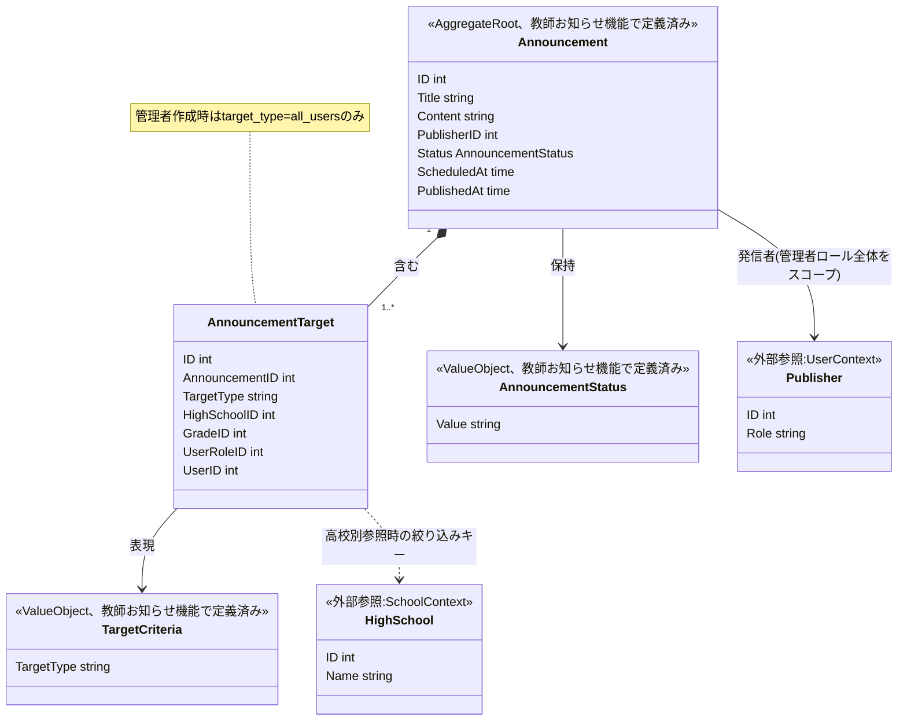
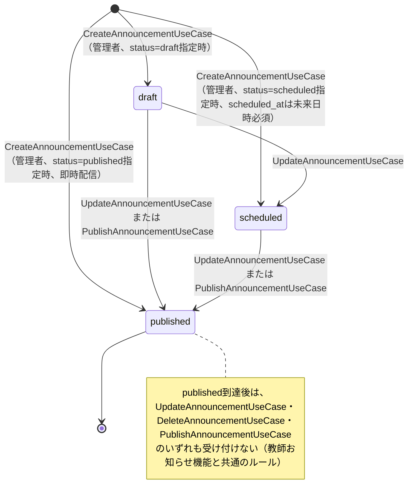
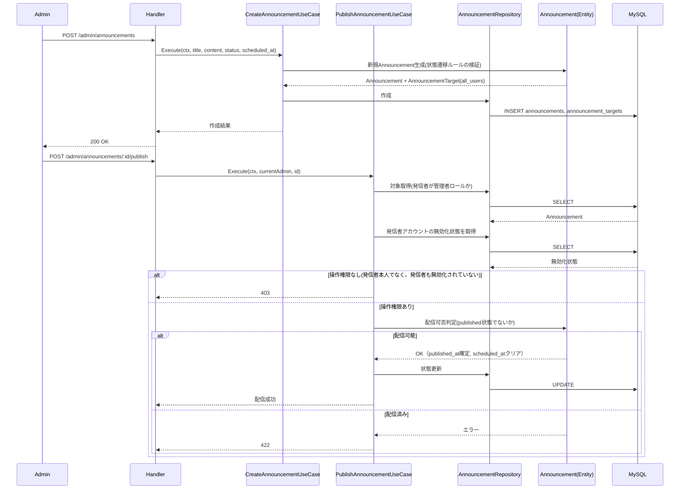
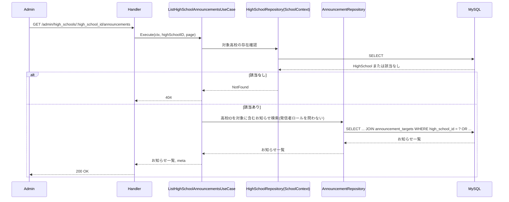
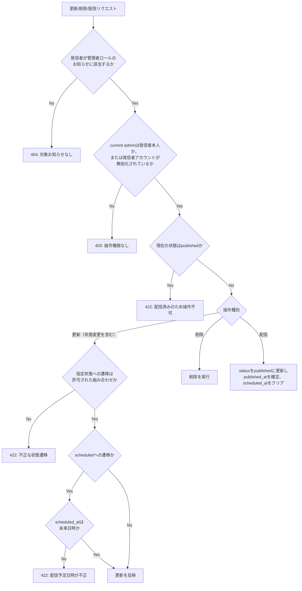

# 管理者お知らせ管理機能 Go移行・設計仕様書

---

# 1. 機能概要

## 機能概要

管理者が全ユーザー向けのお知らせを作成・編集・配信（公開）・削除できる機能である。Rails現行仕様では、管理者ロールのユーザーが発信者であるお知らせ（自分自身が作成したものに限らず、他の管理者が作成したものも含む）を対象に、一覧・詳細・作成・更新・削除・配信の6操作（更新・削除・配信を実行できるのは、お知らせの発信者本人である管理者に限られる。ただし発信者の管理者アカウントが無効化されている場合は、他の管理者も実行できる）と、指定高校を対象に含むお知らせを横断的に確認する高校別お知らせ参照を提供する。管理者が作成するお知らせの対象は常に「全ユーザー」であり、教師のように特定の高校・学年・ユーザーへ対象を絞り込むことはできない。

## 利用者

- `admin` ロールのユーザー（管理者）
- 一覧・詳細の対象は、自分自身が作成したお知らせに限らず、管理者ロールのユーザーが発信者であるお知らせ全体
- 更新・削除・配信を実行できるのは、そのお知らせの発信者本人である管理者のみ。他の管理者が発信者であるお知らせは実行できない。ただし、発信者の管理者アカウントが無効化されている場合は、他の管理者が実行できる

## 業務上の目的

- 全ユーザーへ向けた重要な通知を、下書き・予約・公開という段階を踏んで安全に発信する
- 配信済みのお知らせは編集・削除できないようにし、公開情報の一貫性を保つ
- 特定の高校を対象とするお知らせ（主に教師が作成したもの）を高校単位で横断的に確認できるようにし、運用状況を把握できるようにする

---

# 2. 設計方針

本機能は、お知らせ機能_Go移行・設計仕様書（生徒向け参照）・教師お知らせ機能_Go移行・設計仕様書（教師向け作成・公開）と同じannouncement Contextに属し、教師お知らせ機能_Go移行・設計仕様書で定義済みのAnnouncement / AnnouncementTarget Aggregateをそのまま利用する。管理者向けの追加要素は、「対象が常に全ユーザーに固定される」という単純化された対象指定ルールと、「自分自身に限らず管理者ロール全体が作成したお知らせを参照対象とし、更新・削除・配信は発信者本人（発信者が無効化されている場合は他の管理者）に限る」という参照・操作スコープ、および「指定高校を対象に含むお知らせを横断的に参照する」という運用把握のための参照機能である。

- 責務分離: HTTP・入力形式検証・状態遷移ルール・対象指定ルール・永続化を明確に分離する
- 保守性: 状態遷移ルール（draft→scheduled→published）と公開日時の整合性ルールを、教師お知らせ機能と共通のEntityに集約し、二重実装を避ける
- テスト容易性: 管理者固有の追加ルール（対象固定・発信者スコープ・操作権限）を、既存の状態遷移テストと独立して検証できるようにする
- API互換性: 既存フロントエンドとの接続を維持するため、エンドポイント・リクエスト構造・レスポンス構造は概ね維持する
- 拡張性: 将来的に管理者が対象を柔軟に指定できるようになった場合でも、教師お知らせ機能で確立した対象指定の仕組み（TargetCriteria, AnnouncementTargetingPolicy）を再利用できるようにしておく

---

# 3. Bounded Context

## Context名

- announcement

## 既存Contextとの責務整理

お知らせ機能_Go移行・設計仕様書（生徒向け）・教師お知らせ機能_Go移行・設計仕様書（教師向け）と同一のannouncement Contextとして扱う。3つの②文書は、同一のAnnouncement / AnnouncementTarget Aggregateに対して、利用者ごとに異なる責務を担っている。

|利用者|担う責務|ライフサイクル管理の可否|
|-|-|-|
|生徒（お知らせ機能）|公開済み（published）お知らせの対象範囲判定・一覧詳細参照|不可（参照専用）|
|教師（教師お知らせ機能）|自身が作成したお知らせの作成・対象指定・状態遷移（draft/scheduled/published）・閲覧可能なお知らせの参照|可（自身が作成したお知らせに限る）|
|管理者（本機能）|管理者ロール全体が作成したお知らせの参照、お知らせの作成（対象は常に全ユーザーに固定）、自身が発信者であるお知らせの更新・削除・配信、指定高校を対象に含むお知らせの横断参照|可（更新・削除・配信は発信者本人に限る。発信者の管理者アカウントが無効化されている場合は、他の管理者も可）|

本機能が追加する責務は、既存の「お知らせ本体のライフサイクル管理」「お知らせ対象の管理」という責務区分（教師お知らせ機能_Go移行・設計仕様書「3. Bounded Context」で定義済み）を、管理者という別のアクターの視点から担うものである。対象指定ルールは教師（複数の対象種別・own_grade制約・同校制約）と管理者（常に全ユーザー）で異なるが、状態遷移ルール（draft→scheduled→published）と公開日時の整合性ルールはアクターによらず共通であるため、Announcement Entityを共有することで重複を避ける。

## Contextの責務（本機能が追加する部分）

- 管理者ロールのユーザーが発信者であるお知らせ（自分自身に限らない）の一覧・詳細参照、検索・状態絞り込み
- お知らせの新規作成（対象は常に全ユーザーに固定）
- 下書き・予約状態のお知らせの内容・状態の更新（発信者本人のみ。発信者が無効化されている場合は他の管理者も可）
- 未配信のお知らせの削除（同上）
- 下書き・予約状態のお知らせの配信（公開）（同上）
- 指定高校を対象に含むお知らせ（発信者のロールを問わない）の横断参照

## 他Contextとの依存関係

- User Context: 発信者（管理者）の識別、および更新・削除・配信の操作権限判定に必要な発信者アカウントの無効化状態に依存する
- School Context（高校情報）: 高校別お知らせ参照における対象高校の存在確認に依存する

## 依存する理由

発信者・高校のいずれも、announcement Context自身が真正な情報源を持つデータではなく、User Context・School Contextが管理する情報を参照する必要がある。これは教師お知らせ機能_Go移行・設計仕様書と同様の依存構造である。

---

# 4. 設計パターン

## 採用パターン

Domain Model

## 判断根拠

本機能単体が扱う業務ルール（対象固定・発信者スコープの拡張）は単純に見えるが、以下の理由からDomain Modelを採用する。

- ドメインロジックの複雑さ・状態管理: 本機能が作成・更新・削除・配信の対象とするAnnouncementは、教師お知らせ機能_Go移行・設計仕様書において既にDomain Modelとして設計されており、状態遷移ルール（draft→scheduled/published、scheduled→published、published→遷移不可）を持つ。同一Aggregateに対して、教師側はDomain Model、管理者側はTransaction Script（あるいはActive Record）という異なる実装構造を採用すると、Announcement Entityの状態遷移ロジックを2箇所に複製するか、Repository Interfaceの置き場所が機能間で矛盾するかのいずれかになる
- 業務ルールの複雑さ: 状態遷移ルール自体（published状態からは一切の変更を受け付けない等）は管理者・教師で共通であり、Announcement Entityに集約された判定ロジックをそのまま再利用する必要がある
- 将来の拡張性: 将来的に管理者も柔軟な対象指定（高校別・学年別等）を行えるようにする場合（推測）、教師お知らせ機能で確立したTargetCriteria・AnnouncementTargetingPolicyの仕組みをそのまま拡張できることが望ましい
- テスト容易性: 状態遷移ルールは既存のAnnouncement Entityのテストでカバーされており、本機能側で新たに検証すべきは「対象が常に全ユーザーになること」「発信者スコープが管理者ロール全体であること」という追加ルールのみに限定できる

## 採用しなかったパターン

### Transaction Script

- 状態遷移ルール（published状態からの変更禁止等）をUseCase内の手続きとして書くと、教師お知らせ機能側のAnnouncement Entityの判定ロジックと重複・乖離するおそれがあるため

### Active Record

- 状態遷移の正しさを保証する責務を、既にDomain ModelとしてAnnouncement Entityに集約している以上、管理者側だけモデルの単純な属性更新として再実装すると、同一Aggregateに対して二重の実装方針が生まれ、保守性を損なうため

### Event Sourcing

- 現行仕様は「現在の状態」を管理すれば業務要件を満たしており、状態遷移の全履歴を再構築する要件は明示されていない。教師お知らせ機能_Go移行・設計仕様書と同じ判断に従い、現時点では過剰設計と判断する

---

# 5. Aggregate設計

## Aggregate Root

- Announcement（教師お知らせ機能_Go移行・設計仕様書で定義済みのAggregateをそのまま利用する）

## Aggregateに含めるEntity

- Announcement（本体）
- AnnouncementTarget（対象指定。管理者が作成する場合は常にtarget_type: all_usersの1件のみとなる）

## Aggregate境界・整合性を保証する単位

教師お知らせ機能_Go移行・設計仕様書「5. Aggregate設計」の定義をそのまま用いる。作成時はAnnouncement本体と対象指定（全ユーザー1件固定）を同時に整合させ、更新時は状態遷移と公開日時の整合性を1つの単位として保証する。

本機能固有の追加整合性ルールとして、「配信済み（published）のAnnouncementは、本体・対象指定を含め一切の更新・削除を受け付けない」という制約が、更新・削除の両方のUseCaseに共通して適用される。

---

# 6. Entity設計

Announcement・AnnouncementTargetの役割・ライフサイクル・状態変化・保持する責務は、教師お知らせ機能_Go移行・設計仕様書「6. Entity設計」の定義をそのまま用いる。本書では、管理者向けに追加・変更される点のみを整理する。

## Announcement（管理者向けの追加事項）

- 追加される責務: 発信者（publisher）が管理者ロールである場合、対象指定は常に1件・target_type: all_usersのみであるという制約を、後述するAnnouncementTarget作成時のルールとして扱う
- 判断根拠: Announcement Entity自体の状態遷移ロジック（draft→scheduled→published）はアクターによらず共通であるため、教師向けの定義をそのまま再利用し、対象指定の違いのみをAnnouncementTargetの生成方法の違いとして表現する

## AnnouncementTarget（管理者向けの追加事項）

- 追加される責務: 管理者が作成するお知らせの対象指定は、TargetCriteriaのうちtarget_type: all_usersのみを許容し、他の種別（by_role/by_grade/by_school/by_user）は管理者作成時には選択できない
- 判断根拠: Rails現行仕様が「対象は常に全ユーザーであり、特定の高校・学年・ユーザーを対象として指定することはできない」と明記しているとおり、管理者向けの対象指定は教師向けよりも制約が強い。既存のTargetCriteriaという型を再利用しつつ、生成時点でall_users以外を許容しないという制約を管理者向けの作成UseCaseに持たせる

## Publisher（User参照、発信者スコープの拡張）

- 役割: お知らせの発信者情報。教師お知らせ機能では「自身が作成したお知らせ」に限定してスコープするのに対し、本機能では参照（一覧・詳細）については「管理者ロールのユーザーが発信者であるお知らせ」全体（自分自身に限らない）をスコープする。一方、更新・削除・配信は発信者本人のみが実行でき、発信者の管理者アカウントが無効化されている場合に限り他の管理者も実行できる
- 判断根拠: Rails現行仕様が「他の管理者が作成したお知らせも一覧に含まれる」と明記しているとおり、管理者は互いに作成したお知らせを横断的に参照できるという業務要件がある。一方で、他の管理者が発信したお知らせを勝手に変更・削除・配信できないよう、更新・削除・配信は発信者本人に限定される。発信者の管理者アカウントが無効化された場合はその操作を行える者がいなくなり、お知らせが操作不能のまま残ってしまうため、他の管理者による操作を許容する。操作権限の判定には発信者アカウントの無効化状態というUser Context由来の情報が必要であり、Announcement Entityは保持しないため、UseCaseで判定する（16章）

---

# 7. Value Object設計

本機能は、教師お知らせ機能_Go移行・設計仕様書「7. Value Object設計」で定義済みのAnnouncementStatus・ScheduledAt/PublishedAt・TargetCriteriaをそのまま利用する。新たなValue Objectは追加しない。

## 既存Value Objectの再利用

- AnnouncementStatus: draft/scheduled/publishedの状態と許可される遷移の組み合わせを表現する。管理者向けの状態遷移ルールも教師向けと同一（draft→scheduled/published、scheduled→published、published→遷移不可）であるため、そのまま再利用する
- ScheduledAt/PublishedAt: 予約時の未来日時必須ルール、公開時の自動確定ルールをそのまま再利用する
- TargetCriteria: 管理者作成時はtarget_type: all_usersのみを生成することで、既存の型を変更せずに利用する

## タイトル・本文の長さ制約について

- Rails現行仕様書はタイトル最大255文字・内容最大10,000文字という長さ制約を明記している。この制約は形式的な入力チェックであり、業務ルールとしての意味的な振る舞いを持たないため、教師お知らせ機能と同様にValue Object化せず、Presentation層での形式検証として扱う（詳細は15章）

---

# 8. Domain Service

本機能は新たなDomain Serviceを追加しない。

## AnnouncementTargetingPolicyを利用しない理由

教師お知らせ機能_Go移行・設計仕様書で定義したAnnouncementTargetingPolicy（own_grade制約・同校制約の判定）は、管理者が作成するお知らせには適用しない。管理者向けの対象指定は常にall_usersに固定されており、権限や所属校に応じた妥当性判定という可変のルールが存在しないためである。管理者向けの作成UseCaseは、TargetCriteria（all_users）を条件判定なしに直接生成する。

## AnnouncementVisibilityPolicyを利用しない理由

AnnouncementVisibilityPolicy（閲覧者側の属性とお知らせの対象条件を突き合わせる判定）は、生徒・教師が「自分が閲覧できるお知らせ」を絞り込むためのものであり、本機能（管理者による管理・配信）には適用しない。本機能における一覧・詳細のスコープは「発信者が管理者ロールであること」という単純な条件であり、高校別お知らせ参照における「指定高校を対象に含むかどうか」も、閲覧者視点の可否判定ではなく、対象指定データそのものへの検索条件である。いずれも複数Entity・複数業務ルールにまたがる判断を要しないため、Repositoryの検索条件として扱う（詳細は11章）。

---

# 9. クラス図

---

# 10. 状態遷移図

---

# 11. Repository設計

本機能は、教師お知らせ機能_Go移行・設計仕様書「9. Repository設計」で定義済みのAnnouncementRepositoryを、管理者向けの検索・スコープ条件で拡張利用する。

## AnnouncementRepository（管理者向けの拡張部分）

- 管理対象: Announcement, AnnouncementTarget
- 責務（本機能が追加する部分）:
  - 発信者が管理者ロールであるお知らせの検索（自分自身に限らない）、キーワード（タイトル）・状態による絞り込み、ページング
  - 発信者が管理者ロールであるお知らせの新規作成（対象は常にall_users 1件）
  - 発信者が管理者ロールであるお知らせの状態・内容・公開予定日時の更新（published状態は更新不可）
  - 発信者が管理者ロールであるお知らせの削除（published状態は削除不可）
  - 更新・削除・配信の操作権限判定に用いる、発信者アカウントが無効化されているかどうかの参照
  - 状態を配信（published）へ更新し、published_atを確定、scheduled_atをクリアする
  - 指定高校を対象に含むお知らせの横断検索（発信者のロールを問わず、target_typeがhigh_school等の対象指定にhigh_school_idが一致するもの、または対象に当該高校の学年・ユーザーが含まれるものを検索する）
- 保持する検索機能:
  - 発信者ロールによる絞り込み（管理者ロール全体）
  - タイトルの部分一致検索（`q`）
  - `status`による絞り込み（許可値以外は無視）
  - 高校IDを対象指定に含むお知らせの検索（高校別お知らせ参照用）
  - 作成日時降順のページネーション
- 保持しない責務:
  - 状態遷移の可否判定（Announcement Entityが担う）
  - 更新・削除・配信の操作権限の可否判定（UseCaseが担う。Repositoryは判定に必要な発信者アカウントの無効化状態を返すのみ）
  - 対象指定の妥当性判定（管理者作成時はall_users固定のため判定自体が不要。教師作成時のAnnouncementTargetingPolicyは本機能では呼び出さない）
- 判断根拠: 教師お知らせ機能と同一のAnnouncementRepositoryを、検索条件（発信者スコープ）の違いにより使い分ける。Repositoryを2つに分けると、同一テーブルへの永続化ロジックが重複するため、検索条件のバリエーションとして1つのRepositoryにまとめる

---

# 12. UseCase設計

## ListAnnouncementsUseCase（管理者向け）

- 目的: 管理者ロールのユーザーが発信者であるお知らせを、キーワード・状態で絞り込んで一覧取得する
- 入力: current admin, q, status, page, per_page
- 出力: お知らせ一覧とページ情報
- トランザクション範囲: 読み取りのみ、トランザクションは不要
- 呼び出すRepository: AnnouncementRepository
- 判断根拠: 発信者スコープが「管理者ロール全体」である点を除き、教師向けのListAnnouncementsUseCaseと同様の単純な検索処理であるため

## ShowAnnouncementUseCase（管理者向け）

- 目的: 指定お知らせの詳細（本文を含む）を取得する
- 入力: current admin, announcement id
- 出力: お知らせ詳細
- トランザクション範囲: 読み取りのみ
- 呼び出すRepository: AnnouncementRepository
- 判断根拠: 発信者が管理者ロールであるお知らせのみを対象とする単純な参照処理であるため

## CreateAnnouncementUseCase（管理者向け）

- 目的: 全ユーザー向けのお知らせを作成する
- 入力: current admin, title, content, status（draft/scheduled/published）, scheduled_at（任意）
- 出力: 作成結果
- トランザクション範囲: Announcement本体とAnnouncementTarget（all_users固定）の作成を1トランザクションで扱う
- 呼び出すRepository: AnnouncementRepository
- 判断根拠: 教師向けのCreateAnnouncementUseCaseと異なり、対象指定の妥当性判定（AnnouncementTargetingPolicy）を経由せず、TargetCriteria（all_users）を直接生成する点が設計上の違いである。状態（draft/scheduled/published）の初期値指定と、scheduled指定時の未来日時必須ルールはAnnouncement Entityが判定する

## UpdateAnnouncementUseCase（管理者向け）

- 目的: 下書き・予約状態のお知らせの内容・状態を更新する
- 入力: current admin, announcement id, title/content/status/scheduled_at（いずれも任意）
- 出力: 更新結果
- トランザクション範囲: Announcementの更新を1トランザクションで扱う
- 呼び出すRepository: AnnouncementRepository
- 判断根拠: 状態遷移の可否（published状態は更新不可、許可された遷移のみ）はAnnouncement Entityが判定し、UseCaseは発信者スコープ確認（管理者ロールであるお知らせか）・操作権限確認（current adminが発信者本人か、または発信者が無効化されているか。16章）・永続化を担当する。操作権限確認は、配信済みかどうかの判定（Entity）より先に行う

## DeleteAnnouncementUseCase（管理者向け）

- 目的: 未配信のお知らせを削除する
- 入力: current admin, announcement id
- 出力: 削除結果
- トランザクション範囲: Announcement本体とAnnouncementTargetの削除を1トランザクションで扱う
- 呼び出すRepository: AnnouncementRepository
- 判断根拠: 削除可否（published状態は削除不可）はAnnouncement Entityの状態を確認して判定する。UseCaseは、これに先立ち発信者スコープ確認と操作権限確認（current adminが発信者本人か、または発信者が無効化されているか。16章）を行う

## PublishAnnouncementUseCase（管理者向け）

- 目的: 下書き・予約状態のお知らせを配信（公開）状態にする
- 入力: current admin, announcement id
- 出力: 配信結果
- トランザクション範囲: 状態更新（published_atの確定、scheduled_atのクリアを含む）を1トランザクションで扱う
- 呼び出すRepository: AnnouncementRepository
- 判断根拠: 既に配信済みのお知らせへの再配信を防ぐ判定はAnnouncement Entityが担い、UseCaseは発信者スコープ確認・操作権限確認（16章。配信済みかどうかの判定より先に行う）と永続化を担当する

## ListHighSchoolAnnouncementsUseCase

- 目的: 指定高校を対象に含むお知らせを、発信者のロールを問わず横断的に取得する
- 入力: current admin, high_school_id, page
- 出力: お知らせ一覧（各お知らせに対応する対象指定情報を含む）とページ情報
- トランザクション範囲: 読み取りのみ、トランザクションは不要
- 呼び出すRepository: AnnouncementRepository（高校ID検索）, HighSchoolRepository（対象高校の存在確認。School Context提供）
- 判断根拠: 管理者が運用状況を把握するための横断参照であり、発信者が教師であるお知らせも含めて検索する必要があるため、発信者ロールによる絞り込みは行わない。この点が他のUseCase（発信者を管理者ロールに限定する）との明確な違いである

---

# 13. シーケンス図・処理フロー図

## シーケンス図（作成〜配信）

## シーケンス図（高校別お知らせ参照）

## 処理フロー図（更新・削除・配信の可否判定）

---

# 14. Transaction設計

## Transaction開始位置

- UseCaseの開始時にトランザクションを開始する（書き込みを伴うUseCaseのみ）

## Transaction終了位置

- CreateAnnouncementUseCaseでは、Announcement本体とAnnouncementTarget（all_users）の作成が完了した時点でコミットする
- UpdateAnnouncementUseCase・PublishAnnouncementUseCaseでは、状態更新が完了した時点でコミットする
- DeleteAnnouncementUseCaseでは、Announcement本体とAnnouncementTargetの削除が完了した時点でコミットする
- ListAnnouncementsUseCase / ShowAnnouncementUseCase / ListHighSchoolAnnouncementsUseCaseではトランザクションを使用しない

## 理由

教師お知らせ機能_Go移行・設計仕様書と同様、1回の業務操作（作成・更新・削除・配信）に対してAnnouncementとAnnouncementTargetの整合性を保つため、UseCase単位でトランザクション境界を統一する。

---

# 15. Validation設計

## Presentation

- 型チェック: HTTP入力の型（文字列・真偽値等）を検証する
- 必須チェック: 作成時のtitle/content/statusを検証する
- フォーマットチェック: titleが255文字以内、contentが10,000文字以内であることの形式検証、statusが定義済みの値（draft/scheduled/published）であることの形式検証、scheduled_atの日付形式検証

## Domain

- 業務ルール: 対象が常にall_usersであること（管理者作成時、他の対象種別を許容しない）、発信者が管理者ロールであるお知らせのみを操作対象とすること、更新・削除・配信は発信者本人（発信者が無効化されている場合は他の管理者）のみが実行できること
- 状態チェック: 状態遷移が許可された組み合わせかどうか（Announcement Entity）、published状態のお知らせへの更新・削除・再配信を拒否すること
- 整合性チェック: scheduled状態での公開予定日時の未来日時チェック、published遷移時の公開日時確定

## バリデーション仕様

|フィールド|検証層|ルール|エラーメッセージ方針|
|-|-|-|-|
|title|Presentation|必須、255文字以内|「タイトルは必須です／255文字以内で入力してください」|
|content|Presentation|必須、10,000文字以内|「内容は必須です／10,000文字以内で入力してください」|
|status|Presentation|draft/scheduled/publishedのいずれか|「状態の指定が不正です」|
|scheduled_at|Domain|status=scheduled指定時は必須かつ未来日時であること|「配信予定日時は未来の日時を指定してください」|
|状態遷移|Domain|draft→scheduled/published、scheduled→publishedのみ許可。それ以外・published配信済みへの変更は不可|「その状態には変更できません」|
|操作対象|Domain|発信者が管理者ロールであるお知らせであること|（存在しないものとして404を返す）|
|操作権限（更新・削除・配信）|UseCase|current adminが発信者本人であること、または発信者アカウントが無効化されていること|「この操作を行う権限がありません」（403）|

## 責務分離

- Presentationは「入力の形式が正しいか」を担当する
- Domainは「業務的に妥当か（対象固定・状態遷移・発信者スコープ）」を担当する。更新・削除・配信の操作権限（発信者本人か）は、Announcementが保持しない発信者アカウントの無効化状態を必要とするため、UseCaseが担当する
- これにより、フロントエンドの入力仕様変更と業務ルール変更を独立して扱える

---

# 16. Authorization設計

## Middleware

- 認証済みユーザーを特定し、`admin`ロールであることを確認する

## Handler

- ルーティングとHTTP入出力の変換のみを担当し、業務権限判定は持たせない

## UseCase

- 一覧・詳細・更新・削除・配信は、発信者が管理者ロールであるお知らせ全体をスコープとする（対象が存在しない場合は404）
- 更新・削除・配信は、スコープ確認に加えて操作権限確認を行う。操作を許可するのは、current adminがお知らせの発信者本人である場合、または発信者アカウントが無効化されている場合である。いずれにも該当しない場合は権限エラー（403）とする。一覧・詳細は操作権限確認の対象外であり、他の管理者が発信したお知らせも参照できる
- 操作権限確認は、Announcement Entityによる配信済みかどうかの判定より先に行う。したがって、他の管理者が発信した配信済みのお知らせの更新・削除・配信は、配信済みエラー（422）ではなく権限エラー（403）となる。発信者本人が配信済みのお知らせを操作した場合は権限確認を通過し、配信済みエラー（422）となる
- 高校別お知らせ参照は、発信者のロールを問わず、指定高校を対象に含むお知らせ全体をスコープとする

## Domain

- Announcement Entityにおいて、許可されない状態遷移・published状態への操作を拒否する（操作権限の可否はEntityでは判定しない）

## 判断理由

「誰がアクセスできるか」という認証・ロール確認はMiddlewareに、「どの範囲のお知らせを操作できるか」というスコープ確認はUseCaseに、「業務上許される操作か（状態遷移）」という判定はDomainに配置する。本機能では、参照（一覧・詳細）は「管理者ロールが発信者であること」という広いスコープを採用する。これはRails現行仕様が「他の管理者が作成したお知らせも一覧に含まれる」と明記していることに基づく設計判断である。一方、更新・削除・配信は、教師お知らせ機能と同様に発信者本人に限る所有権確認を行う。ただし、発信者の管理者アカウントが無効化されている場合は、その操作を行える者がいなくなりお知らせが操作不能のまま残るため、他の管理者にも許可する。この判定には発信者アカウントの無効化状態（User Context由来の情報）が必要でAnnouncement Entityが保持しないため、教師お知らせ機能の所有者確認と同じくUseCaseに配置する。

---

# 17. Error設計

## Domain Error

責務: 業務ルール違反を表現する

- 不正な状態遷移
- published状態のお知らせへの更新・削除・再配信の試行
- 予約日時が未来日時でない
- 管理者作成時にall_users以外の対象を指定しようとした場合（推測: Rails現行仕様には明示的なエラーケースの記載はないが、業務ルール上all_users以外を受け付けない設計とするため、想定エラーとして整理する）

## Application Error

責務: ユースケース実行時の失敗を表現する

- 対象お知らせが存在しない、または発信者が管理者ロールでない
- 更新・削除・配信の操作権限がない（発信者本人でなく、かつ発信者アカウントが無効化されていない）
- 高校別お知らせ参照における対象高校が存在しない

## Infrastructure Error

責務: DB接続・永続化時の技術的失敗を表現する

## 判断理由

業務ルール違反（Domain）とリソース未存在・操作権限なし（Application）を区別することで、HTTPステータス変換（422 / 404 / 403）を一貫した基準で行える。この方針は教師お知らせ機能_Go移行・設計仕様書と共通である。

## エラー仕様

|業務シナリオ|エラー種別|発生層|想定するHTTPステータス|
|-|-|-|-|
|不正な状態遷移を指定する|Domain Error|Domain（Announcement Entity）|422|
|発信者本人でない管理者が更新・削除・配信しようとする（発信者が無効化されている場合を除く）|Application Error|UseCase|403|
|配信済みのお知らせを更新・削除・再配信しようとする|Domain Error|Domain（Announcement Entity）|422|
|予約日時が未来日時でない|Domain Error|Domain（ScheduledAt）|422|
|対象お知らせが存在しない、または管理者発信でない|Application Error|UseCase|404|
|高校別お知らせ参照で対象高校が存在しない|Application Error|UseCase|404|

---

# 18. Domain Event

本機能では現時点でDomain Eventを採用しない。理由は、教師お知らせ機能_Go移行・設計仕様書と同様、お知らせの作成・状態変更に対して他処理（通知送信等）への非同期の波及がRails現行仕様上明示されていないためである。

Rails現行仕様書「9. 非同期処理」に明記されているとおり、予約状態（scheduled_at）のお知らせを配信予定日時に自動的に配信状態へ切り替える非同期処理（バッチ・ジョブ等）は現行実装に存在せず、配信操作（publish）が明示的に呼び出された場合にのみ状態が変わる。この点は教師お知らせ機能とは異なるため、本機能ではスケジュール公開の自動化を設計対象に含めない（推測: 将来的に自動配信要件が追加される場合は、アーキテクチャ規約.md「13. 非同期ジョブ実行パターン（JobQueue）」の標準実装を用いたDomain Event（例: AnnouncementScheduledTimeReached）の導入を検討する）。

---

# 19. API仕様

## エンドポイント一覧

|エンドポイント|HTTP Method|概要|
|-|-|-|
|/api/v1/admin/announcements|GET|お知らせ一覧を取得|
|/api/v1/admin/announcements/:id|GET|お知らせ詳細を取得|
|/api/v1/admin/announcements|POST|お知らせを作成|
|/api/v1/admin/announcements/:id|PATCH|お知らせを更新|
|/api/v1/admin/announcements/:id|DELETE|お知らせを削除|
|/api/v1/admin/announcements/:id/publish|POST|お知らせを配信|
|/api/v1/admin/high_schools/:high_school_id/announcements|GET|高校別のお知らせ一覧を取得|

## 各エンドポイントの仕様

### GET /api/v1/admin/announcements

- Request: q（任意）, status（任意）, page（任意）, per_page（任意）
- Response: announcements（id, title, status, target_type, published_at, scheduled_at, created_at, publisher）+ meta
- Status Code: 200

### GET /api/v1/admin/announcements/:id

- Request: id（必須）
- Response: id, title, content, status, target_type, published_at, scheduled_at, created_at, publisher
- Status Code: 200、404（対象お知らせ不存在）

### POST /api/v1/admin/announcements

- Request: announcement[title]（必須）, announcement[content]（必須）, announcement[status]（必須）, announcement[scheduled_at]（scheduled指定時必須）
- Response: message（「お知らせを作成しました。」）
- Status Code: 200、422（バリデーション失敗）

### PATCH /api/v1/admin/announcements/:id

- Request: announcement[title]/[content]/[status]/[scheduled_at]（いずれも任意）
- Response: message（「お知らせを更新しました。」）
- Status Code: 200、403（発信者本人でない管理者による更新。発信者が無効化されている場合を除く）、422（不正な状態遷移・配信済みの更新等）、404（対象お知らせ不存在）

### DELETE /api/v1/admin/announcements/:id

- Request: id（必須）
- Response: なし
- Status Code: 204、403（発信者本人でない管理者による削除。発信者が無効化されている場合を除く）、422（配信済みのお知らせの削除）、404（対象お知らせ不存在）

### POST /api/v1/admin/announcements/:id/publish

- Request: id（必須）
- Response: message（「お知らせを配信しました。」）
- Status Code: 200、403（発信者本人でない管理者による配信。発信者が無効化されている場合を除く）、422（配信済み）、404（対象お知らせ不存在）

### GET /api/v1/admin/high_schools/:high_school_id/announcements

- Request: high_school_id（必須）, page（任意）
- Response: announcements（id, title, content, status, published_at, scheduled_at, created_at, publisher, targets）+ meta
- Status Code: 200、404（対象高校不存在）

## Railsとの差分

差分なし。Rails現行仕様のエンドポイント・レスポンス構造・エラーメッセージ内容をそのまま維持する。

---

# 20. DB設計方針

## 現行DBを利用するか

- 既存Rails DBを継続利用する（`announcements` / `announcement_targets`はお知らせ機能・教師お知らせ機能と共有する）

## Schema変更有無

- 変更なし

## 変更理由

- 現行の`announcements` / `announcement_targets`テーブルは、状態遷移・対象指定という業務要件を、教師・管理者いずれの発信者パターンでも満たしており、追加のスキーマ変更は不要である

---

# 21. DB操作仕様

## AnnouncementRepository（本機能が利用する操作）

- 対象テーブル: announcements, announcement_targets
- 操作種別: 作成、参照、更新、削除
- 主な検索条件・絞り込み条件:
  - 一覧・詳細・更新・削除・配信: `publisher`が管理者ロールのユーザーであること（usersとuser_rolesの結合による絞り込み）、タイトルの部分一致（`q`）、`status`による絞り込み
  - 更新・削除・配信の操作権限判定: 発信者（`publisher_id`のユーザー）の論理削除状態（`users.deleted_at`）の参照
  - 高校別お知らせ参照: `announcement_targets`のhigh_school_id（またはそれに紐づくgrade_id/user_id経由の高校所属）が指定高校と一致するもの。発信者ロールによる絞り込みは行わない
- 関連テーブルとの結合: usersおよびuser_rolesとの結合（発信者ロール判定・発信者名の取得）、announcement_targetsとの結合（対象指定情報の取得、高校別検索の絞り込み）
- ページネーション・ソート: 作成日時降順、ページング（一覧・高校別お知らせ参照の両方）

---

# 22. テスト戦略

## Domain Test

- 目的: Announcementの状態遷移ルール（教師お知らせ機能と共通のテストを再利用しつつ、管理者向けのシナリオ（発信者=管理者、対象=all_users固定）でも同様に機能することを検証する）

## UseCase Test

- 目的: ListAnnouncementsUseCase / ShowAnnouncementUseCase / CreateAnnouncementUseCase / UpdateAnnouncementUseCase / DeleteAnnouncementUseCase / PublishAnnouncementUseCase / ListHighSchoolAnnouncementsUseCaseの業務振る舞いを検証する。特に、他の管理者が作成したお知らせも参照対象に含まれること、更新・削除・配信は発信者本人のみ実行でき（発信者が無効化されている場合は他の管理者も可）それ以外は権限エラーとなること、権限確認が配信済み判定より先に行われること、および高校別お知らせ参照では発信者ロールを問わず検索されることを重点的に検証する

## Repository Test

- 目的: AnnouncementRepositoryによる発信者ロール絞り込み、キーワード・状態絞り込み、高校ID絞り込み、ページネーションの正確性を検証する

## Handler Test

- 目的: API入力のバリデーション結果とHTTPステータスの変換を検証する

## Integration Test

- 目的: エンドポイント経由での作成・更新・削除・配信が正しく連携して動作し、配信済みお知らせへの操作が一貫して拒否されること、および他の管理者が発信したお知らせの更新・削除・配信が403で拒否されることを確認する。また高校別お知らせ参照が、教師作成のお知らせも含めて正しく返却されることを確認する

---

# 23. Railsとの責務対応

| Rails | Go | 設計方針 |
|---|---|---|
| Controller（`Api::V1::Admin::AnnouncementsController`） | Handler | HTTP入出力のみを担当する |
| Controller（`Api::V1::Admin::HighSchools::AnnouncementsController`） | Handler（ListHighSchoolAnnouncementsUseCase呼び出し） | 高校別参照をHTTP責務のみに限定する |
| Form（`Admin::AnnouncementForm`） | Request DTO + Presentation Validation | 入力形式の検証を分離する |
| Service（`Admin::CreateAnnouncementService`, `Common::AnnouncementCreateService`） | CreateAnnouncementUseCase（管理者向け） | 対象固定（all_users）ルールを含め、作成処理をUseCaseに集約する |
| Service（`Admin::PublishAnnouncementService`） | PublishAnnouncementUseCase | 配信処理をUseCaseとして明確化する |
| Model（`Announcement`）の状態遷移バリデーション | Announcement Entity（教師お知らせ機能と共有） | 状態遷移ルールをアクターによらず単一のEntityに集約する |
| Model（`AnnouncementTarget`） | AnnouncementTarget Entity（教師お知らせ機能と共有） | 対象指定の保持責務として整理する |
| Query（`AnnouncementsQuery`） | AnnouncementRepository（検索条件） | 発信者ロール絞り込み・キーワード・状態絞り込みをRepositoryに集約する |
| Serializer | Response DTO | レスポンス整形をPresentation層に分離する |

---

# 24. 採用しなかった設計

## announcementとは別の管理者専用Context（例: admin-announcement）として分離する案

- 採用しなかった理由: 対象データ（Announcement / AnnouncementTarget）とその状態遷移ルールが、お知らせ機能・教師お知らせ機能と完全に同一であり、分離するとAnnouncement Entityの状態遷移ロジックを複数Contextに複製するか、Repository Interfaceの位置づけが機能間で矛盾するかのいずれかになるため。ユーザー指定のとおり、Context名は`announcement`に統一する
- 将来的に採用する可能性: 想定しない。管理者による情報発信が、お知らせとは業務目的の異なる別種のデータ（例: システムメンテナンス通知等、全く異なるライフサイクルを持つデータ）を扱うようになった場合にのみ、新規Contextとしての切り出しを検討する

## Transaction Script

- 採用しなかった理由: 状態遷移ルールが教師お知らせ機能と共通のAnnouncement Entityに集約されているため、手続き型で個別に再実装すると重複・乖離が生じるため
- 将来的に採用する可能性: 低い

## Active Record

- 採用しなかった理由: 同一Aggregateを教師お知らせ機能がDomain Modelとして扱っているため、実装方針の一貫性を優先するため
- 将来的に採用する可能性: 低い

## Event Sourcing

- 採用しなかった理由: 状態遷移の履歴管理・監査要件が現時点で存在しないため（教師お知らせ機能と同じ判断）
- 将来的に採用する可能性: 公開履歴の監査要件が生じた場合に有効な可能性がある

---

# 25. 設計判断サマリー

|項目|採用|判断理由|
|-|-|-|
|設計パターン|Domain Model|同一Aggregate（Announcement）を扱う教師お知らせ機能との構造的一貫性を優先するため|
|Bounded Context|announcement（お知らせ機能・教師お知らせ機能と同一）|同一Aggregate・同一状態遷移ルールを共有し、参照・集約専用Contextへの分割基準にも該当しないため|
|Aggregate|Announcement + AnnouncementTarget（教師お知らせ機能と共有）|対象指定はお知らせに従属し、単独では存在しないため|
|Transaction境界|UseCase単位|作成・更新・削除・配信それぞれが1つの整合性単位であるため|
|Domain Service|不採用（AnnouncementTargetingPolicy・AnnouncementVisibilityPolicyのいずれも本機能では未使用）|管理者向け対象指定は常にall_users固定であり、対象妥当性判定・閲覧可否判定という可変ルールが存在しないため|
|Domain Event|未採用|スケジュール公開の自動化を含め、現時点で非同期通知要件が現行仕様に存在しないため|
|発信者スコープ|参照は管理者ロール全体（自分自身に限らない）|Rails現行仕様が他の管理者作成分も一覧に含めると明記しているため|
|操作権限|更新・削除・配信は発信者本人のみ（発信者アカウントが無効化されている場合は他の管理者も可）。判定はUseCaseが行う|他の管理者が発信したお知らせの変更を防ぎつつ、発信者無効化時に操作不能のまま残ることを避けるため。判定に必要な発信者アカウントの無効化状態はAnnouncement Entityが保持しないため|
|高校別お知らせ参照|発信者ロールを問わず検索|管理者の運用把握という業務目的上、教師作成のお知らせも含めて横断的に確認する必要があるため|

---

# 設計差分管理

## Rails現行仕様

- `Admin::AnnouncementsController`が、`Admin::AnnouncementForm`・`Admin::CreateAnnouncementService`・`Admin::PublishAnnouncementService`・`Common::AnnouncementCreateService`に処理を委譲している
- `Announcement`モデル内に状態遷移バリデーションが実装されている（教師お知らせ機能と共通のモデル）
- 対象は常に`target_type: all_users`で固定されており、Form/Service側でこの制約を保証している
- 更新・削除・配信の操作権限（発信者本人、または発信者アカウントが無効化されている場合の他の管理者）は、Controllerの認可処理（Policy）で判定され、配信済みかどうかの判定（モデルのバリデーション）より先に行われる

## Go設計での変更内容

- 状態遷移ルール・公開日時の整合性ルールを、教師お知らせ機能_Go移行・設計仕様書で定義したAnnouncement Entityとして共有し、管理者向けに再実装しない
- 対象固定（all_users）ルールを、AnnouncementTargetingPolicyを経由しない単純なTargetCriteria生成として明示する
- 発信者スコープ（参照は管理者ロール全体）を、AnnouncementRepositoryの検索条件として明示的に設計へ反映する
- 更新・削除・配信の操作権限（発信者本人、または発信者が無効化されている場合は他の管理者）を、UseCaseでの権限確認として明示的に設計へ反映する。Announcement Entityの状態遷移ルールには変更を加えない

## 変更理由

- Rails実装では教師向け・管理者向けでForm/Serviceが別クラスに分かれているため一見して気づきにくいが、状態遷移という中核の業務ルールはモデル（Announcement）を通じて実質的に共有されている。Go設計ではこの共有関係をAggregate単位で明示することで、状態遷移ルールの変更時に教師向け・管理者向けの両方を確実に反映できるようにする
- 発信者スコープの違い（教師: 自分自身のみ／管理者: 参照はロール全体、更新・削除・配信は発信者本人または発信者無効化時の他の管理者）を、認可設計（16章）とRepositoryの検索条件として明示することで、実装時の権限判定の誤りを防ぐ

## 影響範囲

- フロントエンドから見たAPIの外部仕様は維持する
- 既存DBスキーマは維持するため、データ移行は不要
