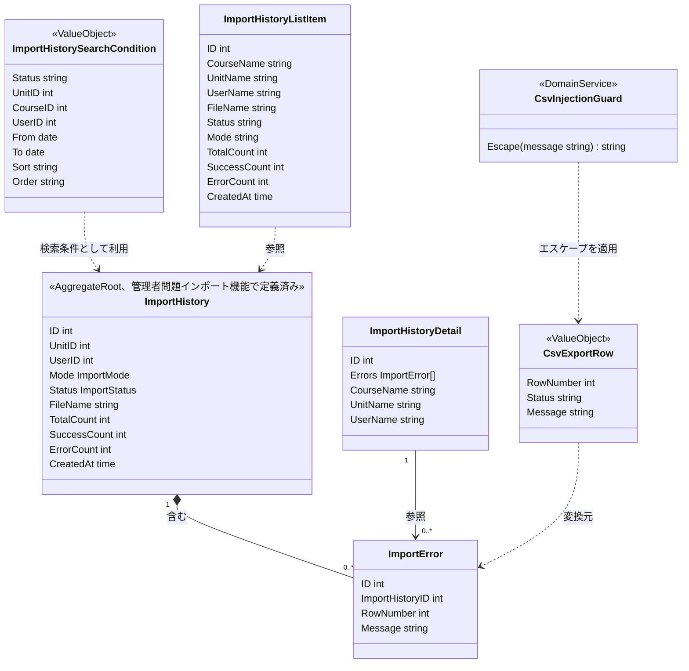
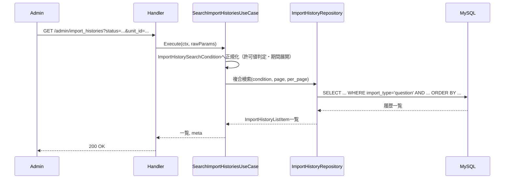
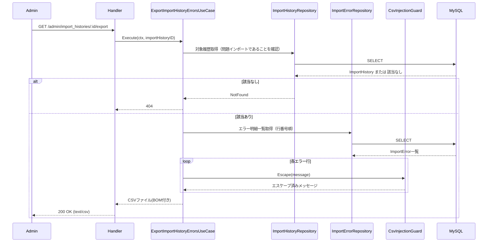

# 管理者インポート履歴管理機能 Go移行・設計仕様書

---

# 1. 機能概要

## 機能概要

管理者がCSVインポート（問題インポート）の実行履歴を検索・確認し、失敗内容を分析できるようにする機能である。Rails現行仕様では、状態・単元・コース・実行者・期間で絞り込み・並び替えを行う一覧取得、実行結果とエラー明細を含む詳細取得、エラー明細をCSVファイルとして出力するエクスポートの3操作を提供する。

インポート履歴（`import_histories`）は問題インポート・生徒インポートの両方で共通して記録されるデータであるが、本機能が一覧・詳細・CSVエクスポートの対象として扱うのは、管理者が実行する問題インポートの履歴のみである。生徒インポートは教師が担当する別機能であり、その履歴は本機能の対象に含まれない。

## 利用者

- `admin` ロールのユーザー（管理者）

## 業務上の目的

- 過去に実行した問題インポートの結果を検索・確認できるようにする
- 失敗した行の内容を特定し、CSVファイルとして関係者に共有できるようにする
- 対象を問題インポートの履歴のみに限定し、生徒インポートの履歴と混同しないようにする

---

# 2. 設計方針

本機能は、管理者問題インポート機能_Go移行・設計仕様書で定義したImportHistory Aggregate（Domain Model採用）に対する、検索・詳細参照・CSVエクスポートという読み取り専用のUseCase群として設計する。新たな状態やAggregate境界を追加するものではなく、既存Aggregateへの参照手段を拡張する位置づけである。

- 責務分離: 検索条件の解釈、CSVエクスポート時のフォーマット・エスケープ処理、永続化アクセスを分離する
- 保守性: 検索条件（状態・単元・コース・実行者・期間）の絞り込みルールと、CSVエクスポートにおけるセキュリティ上のエスケープルールを、それぞれ再利用可能な形で1箇所に集約する
- テスト容易性: 検索条件の解釈結果、エクスポート内容のエスケープ結果をユニットテストで検証できるようにする
- 拡張性: 将来的に検索条件・エクスポート形式が増えても、既存のImportHistory Aggregateの構造を変更せずに対応できるようにする
- API互換性: 既存エンドポイント・レスポンス構造・CSV出力形式を維持する

---

# 3. Bounded Context

## Context名

- question-import

同一Contextとするか、参照専用の別Contextとするかについては、以下の理由から**question-importと同一Context**として扱うと判断する。

## 判断根拠（Context統合の理由）

- 対象データが完全に同一である: 本機能が検索・参照・エクスポートするImportHistory / ImportErrorは、管理者問題インポート機能_Go移行・設計仕様書で定義したImportHistory Aggregate（Aggregate Root: ImportHistory）そのものであり、新たなEntity・テーブルを導入しない
- 実行者（アクター）が同一である: 両機能とも`admin`ロールのユーザーのみが操作する。生徒インポートの履歴のように、別のアクター（教師）が生成したデータを別の視点から参照する、というteacher-directory/teacher-managementのような分割理由が本機能には当てはまらない
- 業務ルールが密結合している: 一覧の絞り込み条件（`status`）や検索対象の限定（`import_type`が問題インポートであること）は、question-import Context側で定義される進行状態（ImportStatus）の意味そのものに依存する。Context を分けると、ImportStatusの値の意味論を2つのContextで重複して把握する必要が生じる
- アーキテクチャ規約.md「4. Bounded Context構成」の分割基準に照らしても、「常に一体で扱われるデータは無理に分割しない」という原則があり、ImportHistoryは進行状態の書き込み（question-import本来の責務）と検索・参照（本機能）が同一ライフサイクルの中で一体的に扱われるデータである

一方、アーキテクチャ規約.md「4. Bounded Context構成」には「同一データに対する参照専用の切り口は、データを所有するContextとは別の参照・集約専用Contextとして切り出してよい」という指針も存在する（admin-dashboardや本書と同時に作成したcourse-catalogがこの指針を採用している）。しかし、admin-dashboard・course-catalogのケースは「利用者・業務目的が異なる」「複数Contextにまたがる情報を新たに集約して見せる」という切り出し理由が明確であるのに対し、本機能は「question-import Contextの主目的（CSVインポートの実行・進行管理）そのものの一部として、実行結果を振り返る」という、同一目的の延長線上にある操作である。したがって本機能は分割の指針には該当せず、question-import Contextへ統合する。

## Contextの責務（本機能が追加する部分）

- 問題インポート履歴の検索（状態・単元・コース・実行者・期間による絞り込み、並び替え、ページング）
- 問題インポート履歴の詳細参照（エラー明細を含む）
- 問題インポート履歴のエラー明細CSVエクスポート

CSVアップロードの受付・進行状態管理・行単位の記録という、Aggregateへの書き込みを伴う責務は、管理者問題インポート機能_Go移行・設計仕様書で定義済みであり、本書では再定義しない。

## 他Contextとの依存関係

- curriculum Context: 一覧・詳細表示におけるコース名・単元名の参照に依存する
- User(Admin) Context: 一覧・詳細表示における実行者（管理者）名の参照に依存する

## 依存する理由

インポート履歴自体は`unit_id`・`user_id`という外部キーのみを保持し、表示に必要なコース名・単元名・実行者名はそれぞれcurriculum Context・User(Admin) Contextが真正な情報源であるため、参照のみを行う。

---

# 4. 設計パターン

## 採用パターン

Domain Model

## 判断根拠

本機能単体の業務ルール（検索条件の絞り込み、CSVエスケープ）だけを見れば、状態を持たないTransaction Scriptでも表現は可能である。しかし、以下の理由からDomain Modelを採用する。

- ドメインロジックの複雑さ・状態管理: 本機能が検索・参照するImportHistoryは、既に管理者問題インポート機能_Go移行・設計仕様書においてDomain Modelとして設計され、Aggregate Root・Repository Interfaceによる依存性逆転構造を持つ。同一Aggregateに対して、書き込み側はDomain Model、読み取り側はTransaction Scriptという異なる実装構造を採用すると、Repository Interfaceの置き場所（Domain層に定義するか、infrastructure層に直接関数を置くか）が機能ごとに矛盾し、同一Contextの内部構造が二重化する
- 業務ルールの複雑さ: CSVエラー明細のエクスポートには、表計算ソフトでの数式注入を防ぐエスケープ処理という、セキュリティ上重要な業務ルールが存在する。これは単純な入出力変換ではなく、独立したルールとして明示的にテストされるべきものであり、Domain Serviceとして切り出す価値がある
- 将来の拡張性: 将来的にインポート履歴の再実行・失敗行のみの再取り込みといった機能が追加される場合（推測）、検索・参照側もAggregateの状態（ImportStatus）を読み取って判断する必要が生じる可能性があり、Transaction Scriptとして分離していると再設計コストが増える
- テスト容易性: 検索条件の解釈（ImportHistorySearchCondition）とCSVエスケープ（CsvInjectionGuard）を独立したValue Object・Domain Serviceとして切り出すことで、DBアクセスなしに単体テストできる

以上より、既存Contextとの構造的一貫性を優先し、Domain Modelを採用する。

## 採用しなかったパターン

### Transaction Script

- 本機能単体の業務ルールの複雑さだけを見れば適用可能だが、同一Aggregate（ImportHistory）を扱う管理者問題インポート機能がDomain Modelを採用しているため、Repository Interfaceの位置づけが機能間で矛盾してしまう。1つのAggregateに対する実装構造は、書き込み・読み取りに関わらず統一すべきであるため採用しない

### Active Record

- 「最後の管理者」判定等のケースと異なり、本機能は集約横断の判定を必要としないため単純に見えるが、上記と同じ理由（同一AggregateがDomain Modelとして構造化されている）から、独立した永続化モデルとして再設計する妥当性がない

### Event Sourcing

- 履歴の再構築・監査要件は現行仕様に存在せず、ImportHistoryの現在状態と行単位のエラー明細があれば業務要件を満たせるため、過剰設計と判断する

---

# 5. Aggregate設計

## Aggregate Root

- ImportHistory（管理者問題インポート機能_Go移行・設計仕様書で定義済みのAggregateをそのまま参照する）

## Aggregateに含めるEntity

- ImportHistory
- ImportError

本書では新たなAggregate境界を追加しない。検索・詳細参照・エクスポートはいずれも既存Aggregateへの読み取りアクセスであり、Aggregateの整合性単位（ImportHistoryの状態とImportErrorの一覧の整合性）は管理者問題インポート機能_Go移行・設計仕様書の定義をそのまま踏襲する。

## 整合性を保証する単位

- 該当なし（本機能は読み取り専用であり、Aggregateへの書き込みを行わない）

---

# 6. Entity設計

ImportHistory・ImportErrorの役割・ライフサイクル・状態変化は管理者問題インポート機能_Go移行・設計仕様書「6. Entity設計」の定義をそのまま用いる。本書では、本機能固有の参照用データ（Read Model）のみを追加で整理する。

## ImportHistoryListItem（参照用の構成データ）

- 役割: 一覧表示のために、ImportHistoryの主要属性とコース名・単元名・実行者名を組み合わせた参照用データ
- ライフサイクル: リクエストごとに構成され、永続化されない
- 状態変化: なし
- 保持する責務: 一覧表示に必要な項目（course, unit, user, file_name, status, mode, 各種件数, created_at）を保持するのみ
- 判断根拠: ImportHistory Entity本体に表示専用の結合結果（コース名・単元名・実行者名）を持たせると、他Context（curriculum・User(Admin)）への参照責務がEntityに混入するため、application層の出力として分離する

## ImportHistoryDetail（参照用の構成データ）

- 役割: 詳細表示のために、ImportHistoryの全属性とImportError一覧、コース・単元・実行者情報を組み合わせた参照用データ
- 判断根拠: ImportHistoryListItemと同様の理由により、表示専用データとして分離する

---

# 7. Value Object設計

## ImportHistorySearchCondition

- 採用理由: 状態（status）・単元・コース・実行者・期間（from/to）・並び替え（sort/order）という複数の検索条件が組み合わさり、それぞれに「許可値以外は無視する／既定値にフォールバックする」という正規化ルールが存在するため、単なる複数引数ではなく1つの概念としてまとめて扱う
- 独自ルール:
  - `status`は許可値（`pending`/`processing`/`completed`/`failed`）以外が指定された場合、絞り込み条件として適用しない
  - `sort`は許可値（`created_at`/`total_count`/`success_count`/`error_count`/`status`）以外の場合`created_at`にフォールバックし、同一条件時は`id`の降順を副次キーとする
  - `order`は`asc`/`desc`以外の場合`desc`にフォールバックする
  - `from`/`to`は日付単位の指定であり、開始日は当日0時、終了日は当日23時59分59秒までを含む期間へ展開する
  - 検索対象は常に`import_type`が問題インポートである履歴、かつ論理削除されていない履歴に限定する
- Entity属性ではなくValue Objectにする理由: 複数の正規化ルールをUseCase側の条件分岐として書くと、一覧取得UseCase内にルールが埋没しやすい。検索条件という入力そのものを型として表現し、正規化ロジックを1箇所に閉じ込めることで、将来的に検索条件が増えてもUseCase本体を変更せずに済む

## CsvExportRow（エクスポート1行分の値）

- 採用理由: CSVエクスポートにおける行番号・状態・メッセージの組み合わせに対し、数式注入対策のエスケープという独自の変換ルールが伴うため
- 独自ルール: メッセージが`=`、`+`、`-`、`@`のいずれかで始まる場合、先頭に`'`を付与してエスケープする
- Entity属性ではなくValue Objectにする理由: ImportErrorそのものの属性ではなく、CSV出力という特定の表現形式に変換する際にのみ発生するルールであるため、ImportError Entityに持たせず、エクスポート専用のValue Objectとして分離する

## Value Objectを採用しないもの

- file_name・course名・unit名・user名等の表示用文字列: 単純な文字列であり、独自の業務ルールを持たないためValue Object化は不要とする

---

# 8. Domain Service

## CsvInjectionGuard

- 責務: CSV出力対象の文字列（エラーメッセージ）が表計算ソフトでの数式として解釈されうる先頭文字（`=`、`+`、`-`、`@`）を持つ場合に、`'`を付与してエスケープする
- Entityへ持たせない理由: この変換はImportErrorが本来持つ業務的な意味（失敗理由の記録）とは無関係な、CSV出力という表現形式固有のセキュリティ対策であるため、ImportError Entityの責務に含めるべきではない
- 判断根拠: 数式注入対策はセキュリティ上重要なルールであり、CSVを出力する他機能（例: 将来的な生徒インポート履歴のエクスポート等）でも同様の対策が必要になりうる。独立したDomain Serviceとして切り出すことで、対策の抜け漏れを防ぎ、単体テストで確実に検証できるようにする

## ImportHistorySearchConditionNormalizer

本Domain Serviceは設けない。理由: ImportHistorySearchConditionのVO自体が正規化ルール（許可値判定・フォールバック・期間展開）を保持する設計とし、独立したDomain Serviceを介さずにVOのコンストラクタ相当の処理で完結させる。複数Entityにまたがる判断ではなく、入力値そのものの正規化であるため、VOへの集約で十分である。

---

# 9. クラス図



---

# 10. 状態遷移図

本機能はImportHistoryの状態を変更しないため、独自の状態遷移図は持たない。ImportHistoryの状態（processing/success/partial_failure/failure）とその遷移条件は、管理者問題インポート機能_Go移行・設計仕様書「10. 状態遷移図」の定義をそのまま参照する。本機能は、この状態を`status`検索条件として参照するのみである。

---

# 11. Repository設計

本機能は、管理者問題インポート機能_Go移行・設計仕様書「11. Repository設計」で定義したImportHistoryRepository・ImportErrorRepositoryを、検索・参照の用途で利用する。本書では、これらのRepositoryのうち本機能が追加で必要とする検索機能を明示する。

## ImportHistoryRepository（拡張部分）

- 管理対象: ImportHistory
- 責務（本機能が追加する部分）:
  - ImportHistorySearchConditionに基づく複合検索（状態・単元・コース・実行者・期間）
  - 並び替え・ページング付きの一覧取得
  - IDによる詳細取得（実行者・単元・コース情報を含む）
- 保持する検索機能:
  - `import_type`が問題インポートであるものへの絞り込み（生徒インポートを除外する。管理者ダッシュボード機能・本機能で共通の業務ルール）
  - 論理削除されていない履歴への絞り込み
  - `status`/`unit_id`/`course_id`（unit経由）/`user_id`による絞り込み
  - `created_at`の期間絞り込み（日付単位、日境界を展開したうえでの範囲検索）
  - `sort`/`order`による並び替え（同条件時は`id`降順を副次キーとする）
  - ページング（`per_page`上限100件）
- 保持しない責務: インポート処理の実行、状態遷移の判定（管理者問題インポート機能の責務）
- 判断根拠: 検索責務を、書き込み系（作成・状態更新）と同じRepositoryにまとめることで、ImportHistoryに対する永続化アクセスの窓口を1つに保つ。これはDomain Model採用時の標準的な方針（Repositoryは1つのAggregateにつき原則1つ）とも整合する

## ImportErrorRepository（拡張部分）

- 管理対象: ImportError
- 責務（本機能が追加する部分）: ImportHistory IDによるエラー一覧取得（行番号順）。詳細取得・CSVエクスポートの両方で利用する
- 保持しない責務: エラー内容のCSV変換・エスケープ（CsvInjectionGuardの責務）
- 判断根拠: 永続化と検索に責務を限定し、出力形式に関する変換ロジックを持たせないため

---

# 12. UseCase設計

## SearchImportHistoriesUseCase

- 目的: 検索条件・並び替え・ページングを適用して問題インポート履歴一覧を取得する
- 入力: current admin, status, unit_id, course_id, user_id, from, to, sort, order, page, per_page
- 出力: ImportHistoryListItem一覧とページ情報
- トランザクション範囲: 読み取りのみ、トランザクションは不要
- 呼び出すRepository:
  - ImportHistoryRepository
- 判断根拠: リクエストパラメータをImportHistorySearchConditionへ正規化したうえでRepositoryへ渡す、読み取り専用の処理であるため

## ShowImportHistoryUseCase

- 目的: 指定された問題インポート履歴の詳細とエラー明細を取得する
- 入力: current admin, import_history_id
- 出力: ImportHistoryDetail（エラー明細を含む）
- トランザクション範囲: 読み取りのみ
- 呼び出すRepository:
  - ImportHistoryRepository
  - ImportErrorRepository
- 判断根拠: 対象が問題インポートの履歴であることを確認したうえで、詳細とエラー明細をまとめて取得する処理であるため

## ExportImportHistoryErrorsUseCase

- 目的: 指定された問題インポート履歴のエラー明細を、数式注入対策を施したCSVファイルとして出力する
- 入力: current admin, import_history_id
- 出力: CSVファイル（サマリー行＋ヘッダー行＋エラー明細行、BOM付き）
- トランザクション範囲: 読み取りのみ、トランザクションは不要
- 呼び出すRepository:
  - ImportHistoryRepository
  - ImportErrorRepository
- 判断根拠: エラー明細の取得後、CsvInjectionGuardによるエスケープを適用してCSVを組み立てる処理であり、DBへの書き込みを伴わないため

---

# 13. シーケンス図・処理フロー図

## シーケンス図（一覧検索）



## シーケンス図（CSVエクスポート）



## 処理フロー図（検索条件の正規化）

```mermaid
flowchart TD
    A[検索リクエスト受信] --> B{statusは許可値か}
    B -- No --> B1[status条件を適用しない]
    B -- Yes --> B2[status条件を適用]
    B1 --> C{sortは許可値か}
    B2 --> C
    C -- No --> C1[created_atにフォールバック]
    C -- Yes --> C2[指定されたsortを使用]
    C1 --> D{orderはasc/descか}
    C2 --> D
    D -- No --> D1[descにフォールバック]
    D -- Yes --> D2[指定されたorderを使用]
    D1 --> E{from/toが指定されているか}
    D2 --> E
    E -- Yes --> E1[日境界(0時〜23:59:59)へ展開]
    E -- No --> F[import_type=question AND 未削除で検索実行]
    E1 --> F
```

---

# 14. Transaction設計

## Transaction開始位置・終了位置

- 本機能はすべて読み取り専用の処理であり、明示的なトランザクションを使用しない

## 理由

- 一覧検索・詳細取得・CSVエクスポートのいずれもImportHistory Aggregateへの書き込みを伴わないため、トランザクションによる整合性保証が不要である

---

# 15. Validation設計

## Presentation

- 型チェック: `unit_id`, `course_id`, `user_id`, `page`, `per_page`, `import_history_id`の型を検証する
- 必須チェック: 詳細取得・エクスポート時の`id`の必須性を検証する
- フォーマットチェック: `from`/`to`が日付形式であることを検証する

## Domain

- 業務ルール: 検索対象を`import_type`が問題インポートである履歴に限定し、生徒インポートの履歴を除外する（ImportHistorySearchConditionが常に適用する条件）
- 状態チェック: `status`が許可値でない場合は絞り込み条件として無視する（ImportHistorySearchCondition）
- 整合性チェック: エクスポート・詳細取得時、対象履歴が存在し、かつ問題インポートの履歴であることを確認する

## バリデーション仕様

|フィールド|検証層|ルール|エラーメッセージ方針|
|-|-|-|-|
|status|Domain|許可値（pending/processing/completed/failed）以外は絞り込み条件として無視|（形式エラーとしては扱わない）|
|unit_id / course_id / user_id|Presentation|任意項目。整数形式であること|「検索条件の形式が不正です」|
|from / to|Presentation|任意項目。日付形式であること|「期間の指定形式が不正です」|
|sort|Domain|許可値以外は`created_at`にフォールバック|（形式エラーとしては扱わない）|
|order|Domain|`asc`/`desc`以外は`desc`にフォールバック|（形式エラーとしては扱わない）|
|per_page|Presentation|正の整数、上限100件|「1ページあたりの件数が不正です」|
|import_history_id（詳細・エクスポート）|Presentation|必須。整数形式であること|「対象インポート履歴のIDが不正です」|
|対象履歴の種別|Domain|`import_type`が問題インポートであること（生徒インポートの履歴IDを指定した場合は取得不可）|（存在しないものとして404を返す）|

## 責務分離

- Presentationは「入力が正しいか（型・形式）」を担当する
- Domainは「検索条件として妥当か（許可値・対象種別）」を担当し、不正な値は無視またはフォールバックすることで、Rails現行仕様の「許可されていない値は既定の絞り込み・並び替えを適用する」という寛容な挙動を維持する

---

# 16. Authorization設計

## Middleware

- 認証済みユーザーを特定し、adminロールであることを確認する

## Handler

- ルーティング層でAPIの入口を担当する
- 業務権限判定は持たせない

## UseCase

- 追加のスコープ制限は行わない（管理者はすべての問題インポート履歴を参照・エクスポート可能）。ただし検索・参照対象を問題インポートの履歴に限定する（生徒インポートの履歴は対象外とする）

## Domain

- ImportHistorySearchConditionが「問題インポートに限定する」という対象種別の条件を常に内包する

## 判断理由

本機能は「adminロールであること」以外に、実行者本人か否かによる制限を持たない（他の管理者が実行したインポート履歴も参照可能）。一方で「対象は問題インポートの履歴のみ」という種別の限定は、認可というよりも業務上のデータ範囲の定義であるため、Domain（ImportHistorySearchCondition）に組み込み、Middlewareでのロール確認と区別する。

---

# 17. Error設計

## Domain Error

- 責務: 本機能では業務ルール違反そのものが発生しないため、Domain Errorは定義しない（不正な検索条件は無視・フォールバックで吸収するため、エラーとして扱わない）
- 判断理由: Rails現行仕様も、許可されない検索条件値をエラーではなく無視・既定値適用としているため、その挙動を維持する

## Application Error

- 責務: ユースケース実行時の失敗を表現する
- 例: 対象インポート履歴が存在しない、または問題インポートの履歴でない
- 判断理由: 存在確認・種別確認の失敗をHTTPレスポンス（404）に変換しやすくするため

## Infrastructure Error

- 責務: DB接続失敗・CSV生成失敗を表現する
- 判断理由: 技術的な障害を業務エラーと切り分けるため

## エラー仕様

|業務シナリオ|エラー種別|発生層|想定するHTTPステータス|
|-|-|-|-|
|対象インポート履歴が存在しない|Application Error|UseCase|404|
|対象インポート履歴が生徒インポートの履歴である|Application Error|UseCase（問題インポートのみを対象とする検索条件により、存在しないものとして扱う）|404|
|検索・集計クエリの実行に失敗する|Infrastructure Error|Infrastructure|500|
|CSV生成処理に失敗する|Infrastructure Error|Infrastructure|500|

---

# 18. Domain Event

本機能ではDomain Eventを採用しない。理由は、参照・エクスポート専用の機能であり、状態変化そのものが発生しないため、イベントとして発行すべき事実が存在しないためである。管理者問題インポート機能側で定義したQuestionImportRequestedイベントとは無関係である。

---

# 19. API仕様

## エンドポイント一覧

|エンドポイント|HTTP Method|概要|
|-|-|-|
|/api/v1/admin/import_histories|GET|問題インポート履歴一覧を取得|
|/api/v1/admin/import_histories/:id|GET|問題インポート履歴詳細を取得|
|/api/v1/admin/import_histories/:id/export|GET|問題インポート履歴のエラー明細をCSV出力|

## 各エンドポイントの仕様

### GET /api/v1/admin/import_histories

- Request: `status`, `unit_id`, `course_id`, `user_id`, `from`, `to`, `sort`, `order`, `page`, `per_page`（いずれも任意）
- Response: `import_histories`（各履歴の`id`, `course`, `unit`, `user`, `file_name`, `status`, `mode`, `total_count`, `success_count`, `error_count`, `created_at`）+ `meta`
- Status Code: 200（取得成功）
- Error Response方針: 既存のエラー形式を踏襲する

### GET /api/v1/admin/import_histories/:id

- Request: `id`（必須）
- Response: 履歴詳細（`errors`一覧、`warnings`（現状常に空）を含む）
- Status Code: 200（取得成功）、404（対象履歴不存在）
- Error Response方針: 既存のエラー形式を踏襲する

### GET /api/v1/admin/import_histories/:id/export

- Request: `id`（必須）
- Response: `import_history_<id>.csv`（text/csv、BOM付き。1行目サマリー、2行目ヘッダー、以降エラー明細）
- Status Code: 200（取得成功）、404（対象履歴不存在）
- Error Response方針: 既存のエラー形式を踏襲する

## Railsとの差分

差分なし。Rails現行仕様のエンドポイント・レスポンス構造・CSV出力形式（サマリー行・BOM・数式注入エスケープ）をそのまま維持する。

---

# 20. DB設計方針

## 現行DBを利用するか

- 既存Rails DBを継続利用する（import_histories / import_errorsテーブルは管理者問題インポート機能と共有する）

## Schema変更有無

- 変更なし（管理者問題インポート機能_Go移行・設計仕様書「20. DB設計方針」で提案するファイル参照方法の変更を除き、本機能単独でのスキーマ変更は不要）

## 変更理由

- 検索・絞り込みに必要なカラム（`status`, `unit_id`, `user_id`, `created_at`, `import_type`, `deleted_at`）は既存スキーマに存在する

---

# 21. DB操作仕様

## ImportHistoryRepository（本機能が利用する検索操作）

- 対象テーブル: import_histories（units・courses・usersとの結合を含む）
- 操作種別: 参照
- 主な検索条件・絞り込み条件: `import_type = 'question'`、`deleted_at IS NULL`、`status`（許可値のみ）、`unit_id`、`course_id`（unitsとの結合経由）、`user_id`、`created_at`の期間（日境界展開後）
- 関連テーブルとの結合: unitsと結合してcourse_idでの絞り込み・コース名/単元名の取得を行い、usersと結合して実行者名を取得する
- ページネーション・ソート: `sort`（`created_at`/`total_count`/`success_count`/`error_count`/`status`、既定`created_at`）・`order`（既定`desc`）による並び替え、同条件時は`id`降順を副次キーとする。`per_page`上限100件のページネーションを行う

## ImportErrorRepository（本機能が利用する検索操作）

- 対象テーブル: import_errors
- 操作種別: 参照
- 主な検索条件・絞り込み条件: `import_history_id`による絞り込み
- 関連テーブルとの結合: 不要
- ページネーション・ソート: `row_number`昇順。詳細取得・CSVエクスポートともに全件取得を基本とする

---

# 22. テスト戦略

## Domain Test

- 目的: ImportHistorySearchConditionの正規化ルール（許可値判定、フォールバック、期間展開、対象種別限定）、CsvInjectionGuardのエスケープルール（`=`/`+`/`-`/`@`で始まる場合の`'`付与）を検証する

## UseCase Test

- 目的: SearchImportHistoriesUseCase / ShowImportHistoryUseCase / ExportImportHistoryErrorsUseCaseの業務振る舞いを検証する。特に、生徒インポートの履歴IDを指定した場合に取得できないことを重点的に検証する

## Repository Test

- 目的: ImportHistoryRepositoryの複合検索・並び替え・ページング、ImportErrorRepositoryの行番号順取得の正確性を検証する

## Handler Test

- 目的: クエリパラメータの解釈とHTTPステータス（200/404）変換、CSVエクスポート時のContent-Type・ファイル名を検証する

## Integration Test

- 目的: エンドポイント経由で一覧・詳細・CSVエクスポートが正しく動作し、CSV内の数式注入対策エスケープが実際に適用されていることを確認する

---

# 23. Railsとの責務対応

| Rails | Go | 設計方針 |
|---|---|---|
| Controller（`Api::V1::Admin::ImportHistoriesController`） | Handler | HTTP入出力の受け取りとレスポンス整形に限定する |
| Query（`Admin::ImportHistoriesQuery`） | ImportHistorySearchCondition（Value Object）+ ImportHistoryRepository | 検索条件の正規化をValue Objectに、検索実行をRepositoryに分離する |
| Service（`Admin::ImportHistoryCsvExporterService`） | ExportImportHistoryErrorsUseCase + CsvInjectionGuard（Domain Service） | CSV組み立ての手続きとセキュリティ上のエスケープルールを分離する |
| Serializer | Response DTO | レスポンス整形をPresentation層に分離する |
| Model（`ImportHistory`, `ImportError`） | 管理者問題インポート機能で定義済みのEntity/Aggregateを再利用 | 同一Aggregateへの参照であることを明示し、二重管理を避ける |

---

# 24. 採用しなかった設計

## question-importとは別の参照専用Context（例: import-history）として切り出す案

- 採用しなかった理由: 「3. Bounded Context」で述べたとおり、対象データ・実行者が完全に同一であり、同一Aggregateに対する実装構造（Repository Interfaceの位置づけ）が機能間で矛盾することを避けるため
- 将来的に採用する可能性: インポート履歴の管理が問題インポート以外の複数インポート種別（生徒インポート等）を横断して扱うようになり、単一Aggregateへの参照という前提が崩れた場合は、独立Contextとしての切り出しを再検討する（管理者問題インポート機能_Go移行・設計仕様書「24. 採用しなかった設計」と同一の判断）

## Transaction Script

- 採用しなかった理由: 本機能単体では業務ルールが単純だが、同一AggregateをDomain Modelとして扱う管理者問題インポート機能との構造的一貫性を優先したため
- 将来的に採用する可能性: 低い。ImportHistory Aggregateの実装パターンが変わらない限り、本機能も追従してDomain Modelを維持する

## Active Record / Event Sourcing

- 採用しなかった理由: 「4. 設計パターン」の判断根拠のとおり
- 将来的に採用する可能性: 現時点では想定しない

---

# 25. 設計判断サマリー

|項目|採用|判断理由|
|-|-|-|
|設計パターン|Domain Model|同一Aggregate（ImportHistory）を扱う管理者問題インポート機能との構造的一貫性を優先するため|
|Bounded Context|question-importと同一Context|対象データ・実行者が完全に同一であり、参照・集約専用Contextへの分割基準に該当しないため|
|Aggregate|新規追加なし（ImportHistoryを再利用）|本機能は読み取り専用であり、新たな整合性単位を必要としないため|
|Transaction境界|未使用（読み取りのみ）|Aggregateへの書き込みを伴わないため|
|Domain Event|未採用|状態変化が発生しないため|
|Value Object|採用（ImportHistorySearchCondition, CsvExportRow）|検索条件の正規化ルールとCSVエスケープルールを型として明示するため|
|Domain Service|採用（CsvInjectionGuard）|数式注入対策というセキュリティ上重要なルールを独立して検証可能にするため|
|Authorization|Middleware（ロール確認）+ Domain（対象種別限定）|問題インポートの履歴のみを対象とする業務上のデータ範囲をDomainに組み込むため|

---

# 設計差分管理

## Rails現行仕様

- `Admin::ImportHistoriesQuery`というQuery Objectで検索・並び替え条件を組み立てている
- `Admin::ImportHistoryCsvExporterService`がCSV生成（サマリー行・エスケープ・BOM付与）を行っている
- 生徒インポートの履歴は、`import_type`による絞り込みで暗黙的に除外されている

## Go設計での変更内容

- 検索条件の正規化ルール（許可値判定・フォールバック・期間展開・対象種別限定）をImportHistorySearchConditionというValue Objectとして明示する
- CSVの数式注入対策エスケープを、CsvInjectionGuardという独立したDomain Serviceとして切り出す
- 「対象は問題インポートの履歴のみ」という業務ルールを、検索条件のVOに常に組み込まれる不変条件として明示する

## 変更理由

- Railsの`Query`/`Service`オブジェクトに分散していた正規化・変換ルールを、Value Object・Domain Serviceとして明示することで、ルールの見落とし（例: 対象種別限定の条件を書き忘れる）を防ぐため
- 数式注入対策は再利用・強化される可能性のあるセキュリティルールであり、独立したDomain Serviceとして切り出すことでテストと変更を容易にするため

## 影響範囲

- フロントエンドから見たAPIの外部仕様（エンドポイント・レスポンス構造・CSV出力形式）は維持するため、影響はない
- 既存DBスキーマは維持するため、データ移行やマイグレーションの追加は不要
