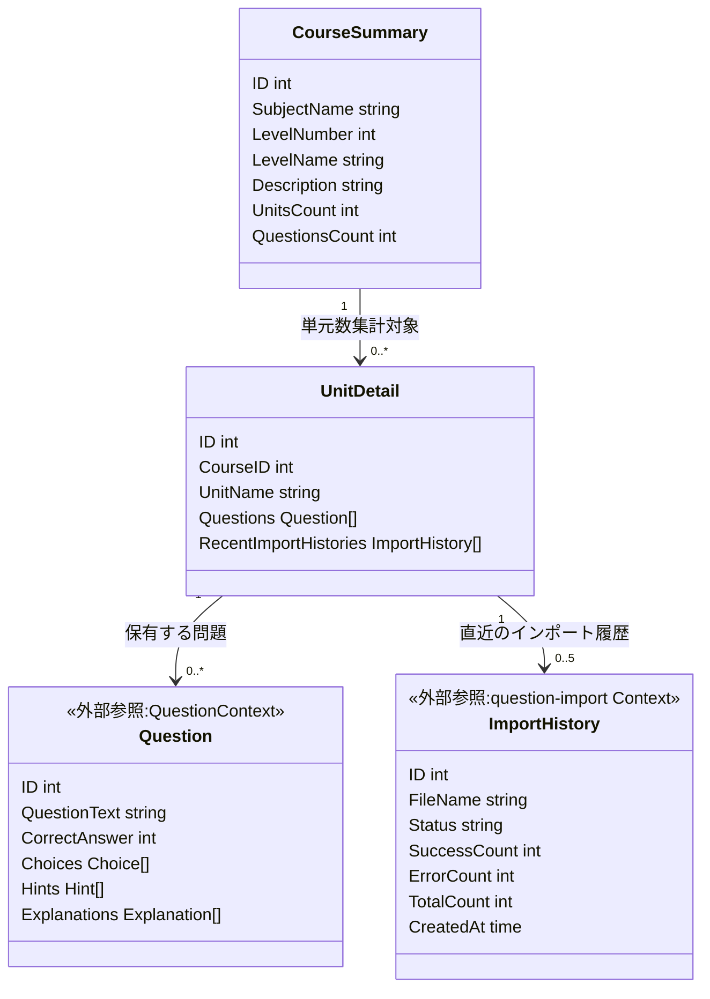
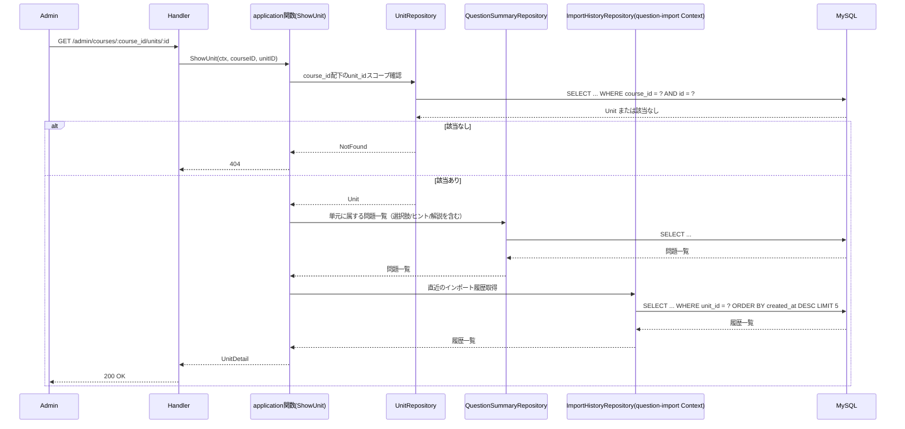
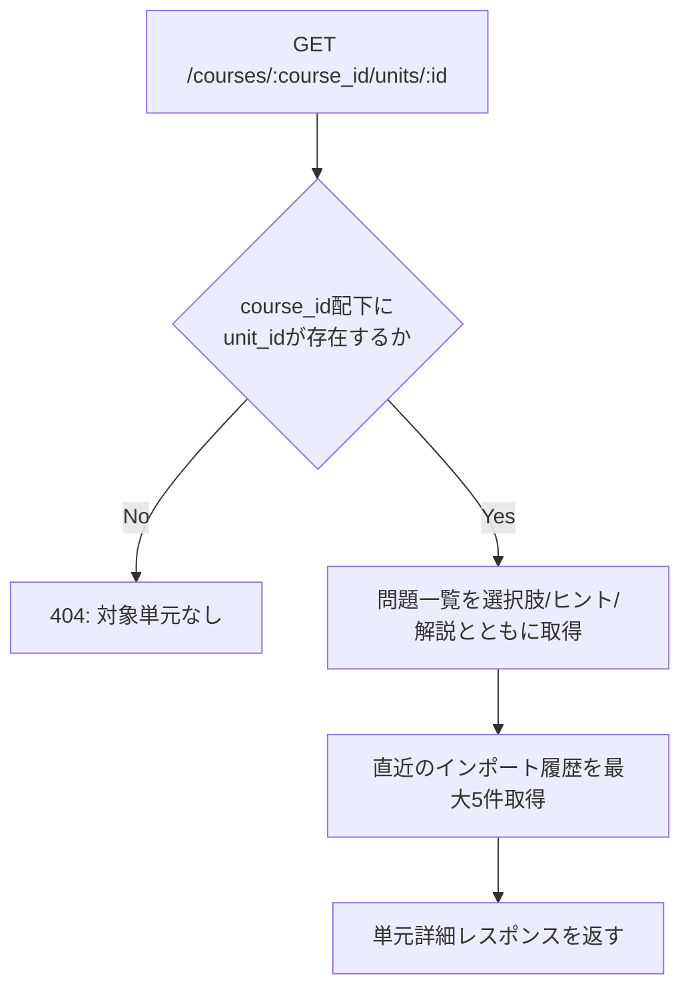

# 管理者コース・単元参照機能 Go移行・設計仕様書

---

# 1. 機能概要

## 機能概要

管理者が学習コースおよび単元の内容を参照し、問題データの登録状況を確認できるようにする機能である。Rails現行仕様では、コース一覧（検索・科目絞り込み・並び替え・ページング付き、単元数・問題数の集計を含む）、コース詳細（単元ごとの問題数集計を含む）、単元詳細（登録済み問題を選択肢・ヒント・解説とともに取得し、あわせて直近の問題インポート履歴を取得）の3操作を提供する。ルーティング上は作成・更新・削除も定義されているが、現時点ではController側に実装がなく、参照系（一覧・詳細）のみが提供されている。

## 利用者

- `admin` ロールのユーザー（管理者）
- すべてのコース・単元を参照可能（自校スコープ等の制限はない）

## 業務上の目的

- 管理者がシステム全体のコース・単元構成と、各単元への問題登録状況を俯瞰できるようにする
- 単元詳細画面から、その単元に登録済みの問題内容と直近のCSVインポート履歴を横断的に確認できるようにし、問題データ管理の起点とする

---

# 2. 設計方針

本機能は現時点では作成・更新・削除を持たない参照専用機能である。業務ルールと呼べるものは「論理削除済みデータの除外」「検索・並び替え条件の許可値と既定値」「単元をコースのroute配下に厳密にスコープする（IDOR対策）」程度であり、主たる処理は「コース・単元・問題データの取得」と「単元数・問題数の集計」という手続き的な処理である。Go移行にあたっては、過剰な抽象化を避け、シンプルな読み取り処理として設計する。

- 責務分離: HTTP・検索条件の解釈・集計処理・永続化アクセスを分離する
- 保守性: 集計ロジック（単元数・問題数のカウント）と並び替え条件の許可値判定を再利用可能な形で1箇所に集約する
- テスト容易性: 検索条件・集計結果の正しさをユースケース単位で検証できるようにする
- 拡張性: 将来的にコース・単元の作成・更新・削除機能が追加された場合に備え、参照処理と書き込み処理が混在しない構造としておく
- API互換性: 既存フロントエンドとの整合を保つため、エンドポイントとレスポンス構造は維持する

---

# 3. Bounded Context

## Context名

- course-catalog

## Contextの責務

- 管理者向けのコース一覧・詳細参照（検索・科目絞り込み・並び替え・ページング、単元数・問題数の集計を含む）
- 管理者向けの単元詳細参照（登録済み問題を選択肢・ヒント・解説とともに取得する）

## 他Contextとの依存関係

- curriculum Context: コース・単元のマスタデータ（level_name, description, unit_name等）の実体に依存する。course-catalog自身はコース・単元を所有せず、curriculum Contextが管理するデータを管理者向けの切り口で参照する
- Question Context: 単元ごとの問題数集計、単元詳細における問題・選択肢・ヒント・解説の内容に依存する（推測: 現状のRails実装にはBounded Context分割が存在しないため、Questionを中心とする問題管理領域を独立したContextとして仮定する。管理者問題インポート機能_Go移行・設計仕様書と同様の前提に立つ）
- question-import Context: 単元詳細画面に表示する直近の問題インポート履歴（ImportHistory）の参照に依存する

## 依存する理由

course-catalogは「コース・単元・問題データを、管理者の内容確認・運用把握という業務目的のために横断的に集約して見せる」という参照専用の切り口であり、いずれのデータも自らは所有しない。

curriculum Contextは、コース参照機能・単元参照機能_Go移行・設計仕様書で定義済みのとおり、生徒向けにコース・単元というマスタデータを提供する責務を持つ。course-catalogはこれと同じ実体（courses/unitsテーブル）を参照するが、以下の理由から同一Contextに統合せず、別Contextとして切り出す。

- 利用者が異なる: curriculumは生徒（student ロール）が学習対象を把握するための参照であるのに対し、course-catalogは管理者（admin ロール）がコンテンツ運用状況を把握するための参照である
- 業務目的・データの組み合わせが異なる: curriculumは科目絞り込みのみを行う単純なマスタ参照であるのに対し、course-catalogは単元数・問題数の集計、問題本体（選択肢・ヒント・解説を含む）、直近のインポート履歴という複数Context（curriculum・Question・question-import）にまたがるデータを1つのレスポンスに集約する。これは「同一データに対する参照専用の切り口は、データを所有するContextとは別の参照・集約専用Contextとして切り出してよい」というアーキテクチャ規約.md「4. Bounded Context構成」の分割基準に該当する
- 業務ルールが異なる: course-catalogは論理削除済みデータの除外、検索・並び替えの許可値判定、単元のroute配下スコープ検証（IDOR対策）という、curriculumには存在しない管理者固有の業務ルールを持つ

なお、course-catalogはコース・単元のデータそのものを作成・更新・削除する責務を持たない。将来的に管理者によるコース・単元の作成・更新・削除機能が実装される場合、その責務をcourse-catalogに持たせるか、curriculum Context側に統合するかは、その時点の業務要件（データの所有権をどちらに置くべきか）に応じて改めて判断する（推測）。

---

# 4. 設計パターン

## 採用パターン

Transaction Script

## 判断根拠

本機能は一覧取得・詳細取得（コース・単元）のみで構成される参照系機能であり、現時点で作成・更新・削除は実装されていない。CourseとUnit・Questionは単純なマスタデータであり、状態遷移を持たない。

- ドメインロジックの複雑さ: 業務ルールは「論理削除済みを除外する」「検索・並び替え条件の許可値以外は既定値にフォールバックする」「単元がroute上のコースに属するか確認する」という単純な条件判定にとどまる
- 状態管理の有無: コース・単元・問題のいずれも、本機能の文脈では状態を変更しない（参照専用）
- 業務ルールの複雑さ: 単元数・問題数の集計は「対象コース・単元に属する有効なレコードをカウントする」という手続きであり、Entityに振る舞いを持たせる意義が薄い
- 将来の拡張性: 集計項目や参照項目が増えても、application層の関数内の手続きを追加するだけで対応できる。ただし将来的に作成・更新・削除が追加された場合は、状態遷移ルールの有無に応じてActive RecordまたはDomain Modelへの格上げを検討する（アーキテクチャ規約.md「3. 設計パターンごとの構造適用方針」の格上げ方針に従う）
- テスト容易性: 手続きが単純であるため、関数単位のテストで十分に品質を担保できる

## 採用しなかったパターン

### Active Record

作成・更新・削除が現時点で実装されておらず、永続化に伴う振る舞いを持たせる必要がないため。将来的に管理者によるコース・単元編集機能が実装される場合は再検討の対象となる。

### Domain Model

状態やライフサイクルを持つEntityが存在せず、業務ルールも単純な絞り込み・スコープ検証にとどまるため、Entityへ責務を集約するメリットが薄い。

### Event Sourcing

参照専用機能であり、状態変化の記録・再構築要件が現行仕様に存在しないため。

---

# 5. Aggregate設計

不要と判断する。

理由: 本機能は参照専用であり、整合性を保証すべき書き込み単位（Aggregate）が存在しない。Course・Unit・Question・ImportHistoryはそれぞれ他Context（curriculum・Question・question-import）が所有するデータであり、course-catalogはそれらを読み取り時にその場で組み合わせて返すのみである。

---

# 6. Entity設計

本機能では新たに管理すべきEntityを設計しない。コース・単元・問題は他Context（curriculum・Question）が所有するデータを参照するのみであり、本機能固有の状態やライフサイクルを持たない。

## CourseSummary（参照用の構成データ）

- 役割: 一覧・詳細表示のために、コース情報と単元数・問題数を組み合わせた参照用データ
- ライフサイクル: リクエストごとに構成され、永続化されない
- 状態変化: なし
- 保持する責務: 表示に必要な情報（科目・レベル名・説明・単元数・問題数等）を保持するのみで、業務ルールは持たない
- 判断根拠: Entityというより、application関数の出力として組み立てられるRead Model（値の集合）として扱う方が実態に即しているため

## UnitDetail（参照用の構成データ）

- 役割: 単元詳細表示のために、単元情報・所属コース情報・登録済み問題一覧・直近のインポート履歴を組み合わせた参照用データ
- ライフサイクル: リクエストごとに構成され、永続化されない
- 状態変化: なし
- 保持する責務: 表示に必要な情報を保持するのみ
- 判断根拠: CourseSummaryと同様、値の集合として扱う方が実態に即しているため

## Question（参照専用、Question Context提供）

- 役割: 単元に登録された問題本体を表す。選択肢・ヒント・解説を含む
- 判断根拠: 問題データの所有・整合性管理はQuestion Contextの責務であり、本機能では表示のための参照のみを行う

## ImportHistory（参照専用、question-import Context提供）

- 役割: 単元詳細画面に表示する直近のインポート履歴
- 判断根拠: インポート履歴の所有・状態管理はquestion-import Contextの責務であり、本機能では表示のための参照のみを行う

---

# 7. Value Object設計

不要と判断する。

理由: 検索キーワード（`q`）・科目ID（`subject_id`）・並び替え条件（`sort`/`order`）・ページングパラメータは、いずれも単純なプリミティブ値として扱えば十分であり、独自の不変条件や振る舞いを持たない。`sort`/`order`の許可値判定・既定値フォールバックは、値そのものの意味を表すValue Objectというよりも、application関数内のガード節として表現する方が本機能の単純さに見合う（管理者問題インポート機能のImportModeのように、複数のUseCaseから再利用される複雑なデフォルト解決ルールを持つ場合とは異なり、本機能では検索条件の解釈という1箇所に閉じた処理であるため）。単元数・問題数もカウント結果としての整数値であり、Value Object化による恩恵が薄い。

---

# 8. Domain Service

不要と判断する。

理由: 単元数・問題数の集計、検索・並び替え条件の解釈、単元のroute配下スコープ検証は、いずれも複数Entityにまたがる業務判断ではなく、検索条件の組み立てまたは単純な一致確認である。Domain Serviceは複数Entity・複数業務ルールにまたがる判断ロジックを表現するためのものであり、本機能のような単純な参照処理にはapplication関数内の手続きとして直接記述する方が明快である。

---

# 9. クラス図

本機能はTransaction Script採用であり、整理すべきEntity関係も単純（参照用のRead Modelが他Contextのデータを保持するのみ）なため、詳細なクラス図は省略し、構成要素の関係を簡略図として示す。

---

# 10. 状態遷移図

本機能では省略する。

理由: コース・単元・問題のいずれも、本機能内で状態を変更する操作を持たない参照専用データであるため。論理削除の有無という属性は持つが、業務上の状態遷移（他状態への遷移条件を伴うもの）ではなく、検索時の除外条件として扱う。

---

# 11. Repository設計

**実装上の位置づけ**: 本機能はTransaction Script採用のため、Repository Interfaceをdomain層に定義しない。以下は永続化・検索責務の設計意図であり、実装時はinfrastructure層の関数として直接実装する(規約: アーキテクチャ規約.md「3. 設計パターンごとの構造適用方針」)。

## CourseRepository

- 管理対象: Course（curriculum Context所有データの参照）
- 責務:
  - 論理削除されていないコースを対象とした、科目絞り込み・キーワード検索・並び替え・ページング付きの一覧取得
  - 指定IDのコース詳細取得（所属科目・単元とともに）
- 保持する検索機能:
  - `subject_id`による絞り込み
  - `q`による`level_name`/`description`への部分一致検索
  - `sort`（`level_name`/`created_at`/`id`、許可値以外は`created_at`）・`order`（`asc`/`desc`、既定は`desc`）による並び替え
  - ページング（`per_page`上限100件）
- 保持しない責務: コースの作成・更新・削除、単元数・問題数の集計
- 判断根拠: コースデータそのものの取得に特化させ、集計処理とは責務を分けるため

## UnitRepository

- 管理対象: Unit（curriculum Context所有データの参照）
- 責務:
  - 指定コースに属する、論理削除されていない単元一覧の取得（id昇順）
  - 指定コースID配下の指定単元IDの詳細取得（IDORスコープ検証を兼ねる）
- 保持する検索機能:
  - `course_id`による絞り込み
  - `course_id` + `id`の組み合わせによるスコープ確認検索（異なるコースの単元IDを指定した場合は取得できない）
- 保持しない責務: 単元の作成・更新・削除、問題数の集計
- 判断根拠: 単元データそのものの取得と、IDOR対策としてのスコープ確認に責務を限定するため

## QuestionSummaryRepository

- 管理対象: Question（Question Context提供、集計・参照用）
- 責務:
  - 対象コース・単元に属する、論理削除されていない問題数の集計（コース単位・単元単位）
  - 指定単元に属する問題一覧の取得（id順）と、各問題に紐づく選択肢（choice_number順）・ヒント（step_number順）・解説（登録順）の取得
- 保持しない責務: 問題データ自体の作成・更新
- 判断根拠: 集計目的の参照と、単元詳細表示のための問題本体取得を、Question Context所有データへの参照責務として分離するため

## ImportHistoryRepository（question-import Context提供、外部依存として利用）

- 管理対象: ImportHistory（question-import Context所有）
- 責務: 指定単元に対する直近のインポート履歴取得（作成日時降順、最大5件）
- 保持しない責務: インポート処理そのもの、インポート履歴の検索・詳細・CSVエクスポート（管理者インポート履歴管理機能の責務）
- 判断根拠: 表示用の参照に限定し、インポート履歴の所有・状態管理はquestion-import Contextに委ねるため。同じ考え方は管理者ダッシュボード機能_Go移行・設計仕様書のImportHistoryRepositoryとも共通する

---

# 12. UseCase設計

**実装上の位置づけ**: 本機能はTransaction Script採用のため、UseCase層(struct)を設けない。以下は業務操作の設計意図であり、実装時はapplication層の関数として直接実装する。

## ListCourses

- 目的: 検索・科目絞り込み・並び替え・ページングを適用したコース一覧を、単元数・問題数付きで取得する
- 入力: current admin, subject_id, q, sort, order, page, per_page
- 出力: コース一覧（単元数・問題数含む）とページ情報
- トランザクション範囲: 読み取りのみ、トランザクションは不要
- 呼び出す関数:
  - コース一覧検索関数（CourseRepositoryの設計意図をinfrastructure層の関数として実装）
  - コース別単元数・問題数集計関数（QuestionSummaryRepositoryの設計意図を含む）
- 判断根拠: 一覧取得後にまとめて集計を行うことで、コースごとに逐次問い合わせるより効率的に処理できるため

## ShowCourse

- 目的: 指定コースの詳細と、コースに含まれる単元ごとの問題数を取得する
- 入力: current admin, course_id
- 出力: コース詳細情報（単元ごとのid・unit_name・questions_countを含む）
- トランザクション範囲: 読み取りのみ
- 呼び出す関数:
  - コース詳細取得関数
  - 単元一覧取得関数
  - 単元別問題数集計関数
- 判断根拠: コースの存在確認を前提に、所属単元と単元ごとの問題数をまとめて取得する処理であるため

## ShowUnit

- 目的: 指定単元に登録されている問題を選択肢・ヒント・解説とともに取得し、あわせて直近の問題インポート履歴を取得する
- 入力: current admin, course_id, unit_id
- 出力: 単元詳細情報（所属コース情報・問題一覧・直近のインポート履歴を含む）
- トランザクション範囲: 読み取りのみ
- 呼び出す関数:
  - 単元スコープ確認関数（course_id配下にunit_idが存在するかを検証。IDOR対策）
  - 問題一覧取得関数（選択肢・ヒント・解説を含む）
  - 直近インポート履歴取得関数
- 判断根拠: 単元がroute上のコースに属することを確認したうえで問題内容とインポート履歴を取得する、複数Contextにまたがる参照処理であるため

---

# 13. シーケンス図・処理フロー図

## シーケンス図（単元詳細取得）

## 処理フロー図

単元詳細取得はコース・単元の存在確認という条件分岐を伴うため、フローチャートとして整理する。一覧・コース詳細は単純な条件付きクエリの組み合わせであるため省略する。

---

# 14. Transaction設計

## Transaction開始位置・終了位置

- 本機能はすべて読み取り専用の処理であり、明示的なトランザクションを使用しない

## 理由

- 更新を伴わない参照処理にトランザクションを設けても保護すべき整合性が存在せず、不要な複雑さを増やすだけであるため

---

# 15. Validation設計

## Presentation

- 型チェック: `subject_id`, `course_id`, `unit_id`, `page`, `per_page`の型を検証する
- 必須チェック: コース詳細・単元詳細取得時の`id`/`course_id`/`unit_id`の必須性を検証する
- フォーマットチェック: `sort`/`order`が文字列であることを検証する（許可値かどうかの判定はDomain側で行う）

## Domain

- 業務ルール: 論理削除済みのコース・単元・問題を一覧・集計の対象から除外する
- 状態チェック: 対象コース・単元が存在するかどうかの確認（Application層のエラーとして扱う）
- 整合性チェック: 単元がroute上のcourse_idに属しているか（属していない場合は対象として扱わない。IDOR対策）

## バリデーション仕様

|フィールド|検証層|ルール|エラーメッセージ方針|
|-|-|-|-|
|subject_id|Presentation|任意項目。整数形式であること|「科目IDの形式が不正です」|
|q|Presentation|任意項目。文字列であること|-|
|sort|Domain|`level_name`/`created_at`/`id`のいずれか。それ以外は`created_at`にフォールバック|（形式エラーとしては扱わない）|
|order|Domain|`asc`/`desc`のいずれか。それ以外は`desc`にフォールバック|（形式エラーとしては扱わない）|
|per_page|Presentation|任意項目。正の整数、上限100件|「1ページあたりの件数が不正です」|
|course_id / unit_id|Presentation|必須（詳細取得時）。整数形式であること|「対象コース・単元が不正です」|
|単元スコープ|Domain|指定単元がroute上のcourse_idに属していること|（存在しないものとして404を返す）|

## 責務分離

- Presentationは「入力が正しいか（型・形式）」を担当する
- Domainは「論理削除除外」「並び替え条件の許可値判定」「単元のスコープ確認」という参照時の絞り込みルールを担当する

---

# 16. Authorization設計

## Middleware

- 認証済みユーザーを特定し、コンテキストに保持する
- 役割がadminであることを確認する

## Handler

- ルーティング層でAPIの入口を担当する
- パスパラメータ（`course_id`, `unit_id`等）を受け渡す

## UseCase

- 単元詳細取得時、route由来の`course_id`配下に`unit_id`が実在することを検証する（IDOR対策）。リクエストボディ・クエリの値は信用せず、routeの値のみを正とする

## Domain

- 参照専用のため、Domain層での認可判定は発生しない

## 判断理由

本機能は「adminロールであること」以外に権限制御が存在しない（全コース・全単元が参照可能）。ただし単元詳細取得のみ、route上のcourse_idと実際の単元の所属が一致するかという整合性検証（IDOR対策）が必要であるため、この検証をUseCase層に置く。管理者問題インポート機能で採用したroute値優先の方針と一貫させる。

---

# 17. Error設計

## Domain Error

- 責務: 本機能では業務ルール違反そのものが存在しないため、Domain Errorは定義しない
- 判断理由: 参照専用機能であり、ドメインルール違反という概念が発生しないため

## Application Error

- 責務: ユースケース実行時の失敗を表現する
- 例: 対象コース未存在、対象単元未存在（route上のコースに属さない場合を含む）
- 判断理由: 存在確認・スコープ検証の失敗をHTTPレスポンス（404）に変換しやすくするため

## Infrastructure Error

- 責務: DB接続失敗・集計クエリ失敗を表現する
- 判断理由: 技術的な障害を業務エラーと切り分けるため

## エラー仕様

|業務シナリオ|エラー種別|発生層|想定するHTTPステータス|
|-|-|-|-|
|対象コースが存在しない|Application Error|application関数|404|
|対象単元が存在しない、またはroute上のコースに属さない|Application Error|application関数|404|
|集計・参照クエリの実行に失敗する|Infrastructure Error|Infrastructure|500|

---

# 18. Domain Event

本機能ではDomain Eventを採用しない。理由は、参照専用機能であり、そもそも状態変化が発生しないため、イベントとして発行すべき「何かが起きた」という事実が存在しないためである。

---

# 19. API仕様

## エンドポイント一覧

|エンドポイント|HTTP Method|概要|
|-|-|-|
|/api/v1/admin/courses|GET|コース一覧を取得|
|/api/v1/admin/courses/:id|GET|コース詳細を取得|
|/api/v1/admin/courses/:course_id/units/:id|GET|単元詳細を取得|

## 各エンドポイントの仕様

### GET /api/v1/admin/courses

- Request: `subject_id`（任意）, `q`（任意）, `sort`（任意）, `order`（任意）, `page`（任意）, `per_page`（任意）
- Response: `courses`（各コースの`id`, `subject`（`id`, `name`）, `level_number`, `level_name`, `units_count`, `questions_count`, `created_at`）+ `meta`（`current_page`, `total_pages`, `total_count`, `per_page`）
- Status Code: 200（取得成功）
- Error Response方針: 既存のエラー形式を踏襲する

### GET /api/v1/admin/courses/:id

- Request: `id`（必須）
- Response: `id`, `subject`（`id`, `name`）, `level_number`, `level_name`, `description`, `units`（各単元の`id`, `unit_name`, `questions_count`）
- Status Code: 200（取得成功）、404（対象コース不存在）
- Error Response方針: 既存のエラー形式を踏襲する

### GET /api/v1/admin/courses/:course_id/units/:id

- Request: `course_id`（必須）, `id`（必須）
- Response: `id`, `course_id`, `unit_name`, `course`（`id`, `subject`, `level_name`, `level_number`）, `questions`（`id`, `question_text`, `correct_answer`, `choices`, `hints`, `explanations`）, `recent_import_histories`（`id`, `file_name`, `status`, `success_count`, `error_count`, `total_count`, `created_at`）
- Status Code: 200（取得成功）、404（対象コース・単元不存在）
- Error Response方針: 既存のエラー形式を踏襲する

## Railsとの差分

差分なし。Rails現行仕様のエンドポイント・レスポンス構造をそのまま維持する。ルーティング上定義されている作成・更新・削除は、現行Rails実装でも未実装（参照系のみ提供）であるため、本書でも設計対象に含めない。

---

# 20. DB設計方針

## 現行DBを利用するか

- 既存Rails DBを継続利用する

## Schema変更有無

- 変更なし

## 変更理由

- `courses`, `units`, `questions`, `question_choices`, `question_hints`, `question_explanations`, `import_histories`の既存カラムのみで、一覧・詳細・集計・単元参照のすべてを満たしており、追加スキーマは不要である
- 参照専用機能であり、業務要件が変わらない限りスキーマ変更の動機がない

---

# 21. DB操作仕様

## CourseRepository

- 対象テーブル: courses（subjectsとの結合を含む）
- 操作種別: 参照
- 主な検索条件・絞り込み条件: `deleted_at IS NULL`（論理削除除外）、`subject_id`による絞り込み（任意）、`level_name`/`description`への部分一致検索（`q`指定時）
- 関連テーブルとの結合: subjectsと結合し、科目名を取得する
- ページネーション・ソート: `sort`（`level_name`/`created_at`/`id`、既定`created_at`）・`order`（`asc`/`desc`、既定`desc`）による並び替え、`per_page`上限100件のページネーションを行う

## UnitRepository

- 対象テーブル: units
- 操作種別: 参照
- 主な検索条件・絞り込み条件: `deleted_at IS NULL`、`course_id`による絞り込み。単元詳細取得時は`course_id` + `id`の組み合わせで一致するものだけを対象とする（一致しない場合は取得しない）
- 関連テーブルとの結合: コース詳細取得時はcoursesと結合する
- ページネーション・ソート: コース詳細内の単元一覧は`id`昇順。ページネーションは不要

## QuestionSummaryRepository

- 対象テーブル: questions（question_choices, question_hints, question_explanationsとの結合を含む）
- 操作種別: 参照（集計・一覧取得）
- 主な検索条件・絞り込み条件: `deleted_at IS NULL`、`unit_id`（単元詳細）または`course_id`経由の`unit_id IN (...)`（コース単位の問題数集計）による絞り込み
- 関連テーブルとの結合: question_choices（choice_number順）、question_hints（step_number順）、question_explanations（登録順）とそれぞれ結合し、単元詳細表示のために整理する
- ページネーション・ソート: 単元詳細内の問題一覧は`id`順。集計時はページネーション不要

## ImportHistoryRepository（question-import Context提供）

- 対象テーブル: import_histories
- 操作種別: 参照
- 主な検索条件・絞り込み条件: `unit_id`による絞り込み
- 関連テーブルとの結合: 不要
- ページネーション・ソート: 作成日時の降順で並び替えたうえで上位5件のみを取得する

---

# 22. テスト戦略

## Domain Test

- 目的: 本機能には業務ルール判定がほぼ存在しないため、Domain Testは最小限（並び替え条件の許可値フォールバック、単元スコープ確認等の単純な分岐のみ）に留める

## UseCase Test

- 目的: ListCourses / ShowCourse / ShowUnitが、絞り込み・並び替え・ページング・集計・スコープ検証を正しく組み合わせて結果を返すことを検証する。特にShowUnitでは、異なるコースの単元IDを指定した場合に404となることを重点的に検証する

## Repository Test

- 目的: CourseRepository・UnitRepository・QuestionSummaryRepository・ImportHistoryRepositoryによる検索・集計クエリの正確性（論理削除除外、並び替え、単元スコープ、選択肢/ヒント/解説の順序等）を検証する

## Handler Test

- 目的: クエリパラメータ・パスパラメータの解釈とHTTPステータスの変換を検証する

## Integration Test

- 目的: エンドポイント経由で一覧・コース詳細・単元詳細が正しいレスポンス構造で返却され、IDOR対策（route上のコースに属さない単元へのアクセスが404になること）が機能することを確認する

---

# 23. Railsとの責務対応

| Rails | Go | 設計方針 |
|---|---|---|
| Controller（`Admin::CoursesController`, `Admin::UnitsController`） | Handler | HTTP入出力の受け取りとレスポンス整形に限定する |
| Query（`Admin::CoursesQuery`） | CourseRepository（検索条件） | 検索・並び替え・絞り込みの組み立てをRepositoryの検索責務として集約する（Transaction Script採用のためusecase層は設けない） |
| Serializer | Response DTO | レスポンス整形をPresentation層に分離する |
| Model（`Course`, `Unit`, `Question`, `QuestionChoice`, `QuestionHint`, `QuestionExplanation`） | Repository（参照専用） | 本機能では振る舞いを持たない参照データとして扱う。データの所有はcurriculum Context・Question Contextに委ねる |
| Model（`ImportHistory`） | ImportHistoryRepository（question-import Context提供、外部依存） | インポート履歴の所有・状態管理はquestion-import Contextの責務として整理する |

---

# 24. 採用しなかった設計

## curriculum Contextへの統合

- 採用しなかった理由: curriculumは生徒向けの単純なマスタ参照（科目絞り込みのみ）であるのに対し、本機能は管理者向けに複数Context（curriculum・Question・question-import）のデータを集約し、論理削除除外・並び替え・IDORスコープ検証といった管理者固有の業務ルールを持つ。同一Contextに統合すると、生徒向け参照に管理者固有の複雑さが混入し、責務が肥大化する
- 将来的に採用する可能性: 現時点では想定しない。ただし将来的にコース・単元の作成・更新・削除機能が実装される場合、そのデータ所有をcurriculum Contextに置くかcourse-catalog Contextに置くかは改めて判断が必要である

## Domain Model

- 採用しなかった理由: 状態を持たない参照専用データに振る舞いを持たせる必要がなく、業務ルールも単純な絞り込み・スコープ検証にとどまるため
- 将来的に採用する可能性: コース・単元に対する編集機能（公開/非公開の状態遷移等）が本機能に追加された場合は再検討する

## Active Record

- 採用しなかった理由: 作成・更新・削除が現時点で実装されておらず、永続化を伴う振る舞いを持たせる意義がないため
- 将来的に採用する可能性: 管理者によるコース・単元編集機能（ルーティング上は既に定義されている）が実装される場合は、業務ルールの複雑さに応じてActive RecordまたはDomain Modelへの格上げを検討する

## Event Sourcing

- 採用しなかった理由: 状態変化自体が存在しないため、そもそも適用対象にならない
- 将来的に採用する可能性: なし

---

# 25. 設計判断サマリー

|項目|採用|判断理由|
|-|-|-|
|設計パターン|Transaction Script|参照専用で業務ルールが単純な絞り込み・集計・スコープ検証のみのため|
|Bounded Context|course-catalog（curriculumとは別Context）|利用者・業務目的・集約対象がcurriculumと異なる管理者向け参照専用の切り口であるため|
|Aggregate|未採用|整合性を保証すべき書き込み単位が存在しないため|
|Transaction境界|未使用（読み取りのみ）|保護すべき整合性が存在しないため|
|Domain Event|未採用|状態変化自体が発生しないため|
|Value Object|未採用|独自の業務ルール・不変条件を持つ値が存在しないため|
|Authorization|Middleware（ロール確認）+ UseCase（単元のIDORスコープ検証）|全コース・全単元が参照可能な一方、単元詳細のみroute整合性の検証が必要なため|

---

# 設計差分管理

## Rails現行仕様

- `Admin::CoursesQuery`というQuery Objectで検索・並び替え条件を組み立てている
- Controller内で単元数・問題数の集計、選択肢/ヒント/解説の整理を直接行っている
- ルーティング上は作成・更新・削除アクションが定義されているが、Controllerには実装されていない

## Go設計での変更内容

- 検索・並び替え・絞り込み条件の組み立てをCourseRepositoryの検索責務として整理する
- 単元数・問題数の集計をQuestionSummaryRepositoryの責務として切り出す
- 単元詳細取得におけるIDORスコープ検証（route上のコースに単元が属するか）を、application関数内の明示的な検証手順として分離する
- 未実装の作成・更新・削除については、本書では設計対象としない（将来必要になった時点で改めてUseCase設計・設計パターンの見直しを行う）

## 変更理由

- ControllerにQuery Objectとクエリ実行が密結合していると、HandlerがDBアクセスの詳細を知ってしまい、責務が混在するため
- 集計・IDORスコープ検証を独立した責務として切り出すことで、将来的に検索条件や参照項目が増えた場合も影響範囲を限定できるため

## 影響範囲

- フロントエンドから見たAPIの外部仕様（エンドポイント・レスポンス構造）は維持するため、影響はない
- 既存DBスキーマは維持するため、データ移行やマイグレーションの追加は不要
