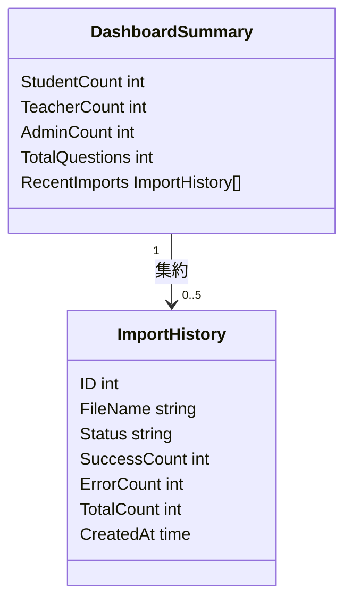
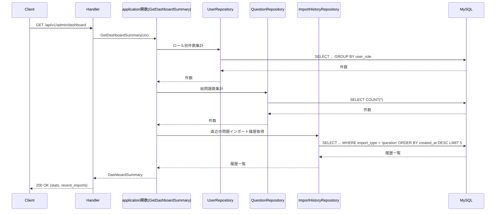

# 管理者ダッシュボード機能 Go移行・設計仕様書

---

# 1. 機能概要

## 機能概要

管理者がシステム全体の概況を把握できるように、ユーザー種別ごとの人数と直近の問題インポート履歴を表示する機能である。Rails現行仕様では、単一の表示操作（show）のみを提供する読み取り専用機能である。

## 利用者

- 管理者ユーザー（admin ロール）

## 業務上の目的

- 管理者がシステム全体のユーザー構成（生徒・教師・管理者数、総問題数）を把握できるようにする
- 直近のCSV問題インポート状況を一目で確認できるようにする

---

# 2. 設計方針

本機能は複数のドメイン領域（ユーザー・問題・インポート履歴）の情報を集約して表示するだけの読み取り専用機能であり、Rails実装の構造をそのまま移すのではなく、集計処理の組み立てに責務を絞ったGo設計とする。

主な設計思想は以下のとおりである。

- 責務分離: 各集計クエリの実行とレスポンス整形を分離する
- 保守性: 集計項目の追加・変更に強い構造とする
- テスト容易性: 集計結果の組み立てをユースケース単位で検証できるようにする
- 拡張性: 将来的な集計項目追加（校数別集計、期間指定集計等）に対応しやすくする
- API互換性: 既存エンドポイントとレスポンス構造（stats / recent_imports）を維持する

---

# 3. Bounded Context

## Context名

- admin-dashboard

## Contextの責務

- システム全体の概況（ユーザー数集計、直近の問題インポート履歴）の取得・集約
- 表示用データの組み立て

## 他Contextとの依存関係

- user Context: ユーザー種別（役割）ごとの人数集計（`user`②の`CountUsers`）に依存する。集計の単位は役割別とし、無効化の扱いには「無効化済みを含む」を指定する（Rails現行は無効化済み（`deleted_at`あり）のユーザーも件数に含める。15章）
- Question Context: 総問題数の集計に依存する（推測: 現行Rails実装にはBounded Context分割が存在しないため、問題データを管理する独立したContextとして仮定する）
- question-import Context: 直近の問題インポート履歴の取得に依存する。管理者問題インポート機能_Go移行・設計仕様書で定義したImportHistory Aggregateと、管理者インポート履歴管理機能_Go移行・設計仕様書で定義した検索・参照責務を、いずれもquestion-import Contextが提供する

## 依存する理由

ダッシュボードは特定の業務データを自ら保有するものではなく、複数Contextの情報を横断的に集約して表示するという性質を持つ。そのため、自身ではデータを保有せず、各Contextから集計結果・参照結果を取得して束ねる集約点として設計する。

---

# 4. 設計パターン

## 採用パターン

Transaction Script

## 判断根拠

本機能は「複数の集計を実行し、まとめて返す」だけの読み取り専用機能であり、状態を持つEntityが存在しない。

- ドメインロジックの複雑さ: 業務ルールは複数Contextからの集計処理のみであり、複雑な状態遷移や業務ルールを持たない
- 状態管理の有無: 本機能自身が状態を保持・変更することはない
- 業務ルールの複雑さ: 「ユーザー数を集計する」「直近の問題インポート履歴を取得する」という独立した処理を組み合わせるだけで表現でき、手続き的な処理として最も簡潔である
- 将来の拡張性: 将来的に集計項目が増えても、application層の関数内の手続きに処理を追加するだけで対応できる
- テスト容易性: 各集計処理を個別に検証すれば十分であり、Entityに複雑な振る舞いを持たせる必要がない

以上より、参照・集計系機能に適したTransaction Scriptを採用する。

## 採用しなかったパターン

### Active Record

集計対象となる、作成・更新が必要なEntityが本機能には存在しないため不適合である。

### Domain Model

状態やライフサイクルを持つEntityが存在せず、Entityに振る舞いを持たせる対象がないため、採用する意義がない。

### Event Sourcing

状態変化の記録・再構築要件がなく、過剰設計であるため不採用とする。

---

# 5. Aggregate設計

不要と判断する。

理由: 本機能は複数Contextの集計結果・参照結果を集めて返すのみであり、整合性を保証すべき書き込み単位（Aggregate）が存在しないため。ImportHistoryはquestion-import Context側でAggregate Rootとして管理されており、本機能はそれを参照するのみである。

---

# 6. Entity設計

本機能は集計結果を返すのみであり、新たに永続化されるEntityを管理しない。以下は参照・集約のための概念整理である。

## DashboardSummary（表示用の集約データ）

- 役割: ユーザー種別ごとの件数、総問題数、直近の問題インポート履歴をまとめた表示用データ
- ライフサイクル: リクエストの都度生成され、永続化されない
- 状態変化: なし
- 保持する責務: 各集計結果を保持し、レスポンスへ変換されるまでの一時的なデータ構造として機能する
- 判断根拠: 永続化対象ではなく、application関数の出力としてのみ存在するため、業務的な意味を持つEntityというよりも出力データ構造に近い性質を持つ

## ImportHistory（参照専用）

- 役割: 直近の問題インポート履歴として表示される
- ライフサイクル・状態変化: 本機能では扱わない（作成・進行状態の更新はquestion-import Contextの責務）
- 保持する責務: 参照時点のfile_name・status・件数・作成日時を保持する
- 判断根拠: 本機能ではImportHistoryの作成・更新を行わず、参照のみを行う。さらにRails現行仕様（`ImportHistory.question`スコープ）のとおり、参照対象は`import_type`が問題インポートである履歴に限定され、生徒インポートの履歴は取得対象から除外するという業務ルールを持つ。この絞り込みはEntityの責務ではなく、後述するRepositoryの検索条件として扱う

---

# 7. Value Object設計

不要と判断する。

理由: 集計値（件数）は単純な数値であり、独自の業務ルールやフォーマット変換を持たないため、Value Object化するメリットが薄い。

---

# 8. Domain Service

不要と判断する。

理由: 集計処理はRepositoryが提供する集計クエリの組み合わせで表現でき、複数Entityを横断する業務ルール判定が存在しないため、Domain Serviceとして独立させる必要がない。「問題インポートのみを対象とする」という絞り込みも、単純な検索条件（`import_type`によるフィルタ）であり、判断ロジックと呼べるほどの複雑さを持たない。

---

# 9. クラス図

本機能はTransaction Script採用であり、整理すべきEntity関係も単純（DashboardSummaryが集計結果を保持するのみ）なため、詳細なクラス図は省略し、構成要素の関係を簡略図として示す。

---

# 10. 状態遷移図

本機能では省略する。

理由: DashboardSummary・参照専用のImportHistoryのいずれも、本機能内で状態を変更する操作を持たない。ImportHistory自体の状態遷移はquestion-import Contextの責務であり、本機能のスコープ外である。

---

# 11. Repository設計

**実装上の位置づけ**: 本機能はTransaction Script採用のため、Repository Interfaceをdomain層に定義しない。以下は永続化・検索責務の設計意図であり、実装時はinfrastructure層の関数として直接実装する(規約: アーキテクチャ規約.md「3. 設計パターンごとの構造適用方針」)。

## UserRepository

- 管理対象: User（集計用途）
- 責務: ロール別ユーザー数の集計（`user`の`CountUsers`を、集計の単位=役割別・無効化の扱い=無効化済みを含む、絞り込み条件なし（全校・全ユーザー）で呼び出す）
- 保持する検索機能: ロールごとの件数集計（無効化済みのユーザーを除外しない）
- 保持しない責務: ユーザー情報自体の作成・更新・論理削除
- 判断根拠: 集計に特化した参照責務のみを持たせるため。無効化の扱いは`user`②が呼び出し側に必須で指定させるため、本機能はRails現行の挙動（無効化済みを含む）を、明示的に「含める」と指定して維持する

## QuestionRepository

- 管理対象: Question（集計用途）
- 責務: 総問題数の集計
- 保持しない責務: 問題データ自体の作成・更新
- 判断根拠: 集計目的の参照に限定するため

## ImportHistoryRepository

- 管理対象: ImportHistory
- 責務: 直近5件の問題インポート履歴取得（作成日時降順）
- 保持する検索機能:
  - `import_type`が問題インポートである履歴への絞り込み（生徒インポートの履歴を除外する）
  - 作成日時降順のうえでの上位5件取得
- 保持しない責務: インポート処理そのもの（question-import Contextの責務）、インポート履歴の検索・詳細参照・CSVエクスポート（管理者インポート履歴管理機能の責務）
- 判断根拠: 表示用の参照に限定するため。Rails現行仕様（`ImportHistory.question.order(created_at: :desc).limit(5)`）が示すとおり、「直近のインポート履歴」は問題インポートの履歴のみを対象とするという業務ルールが存在し、これを取り込み忘れるとダッシュボードに生徒インポートの履歴が混入してしまう。そのため、絞り込み条件として明示的に設計へ反映する

---

# 12. UseCase設計

**実装上の位置づけ**: 本機能はTransaction Script採用のため、UseCase層(struct)を設けない。以下は業務操作の設計意図であり、実装時はapplication層の関数として直接実装する。

## GetDashboardSummary

- 目的: 管理者ダッシュボードに必要な集計情報を取得する
- 入力: current admin user（パラメータなし）
- 出力: ユーザー種別ごとの件数、総問題数、直近の問題インポート履歴一覧
- トランザクション範囲: 読み取りのみ、トランザクション不要
- 呼び出す関数: ユーザー種別件数集計関数, 総問題数集計関数, 直近の問題インポート履歴取得関数（`import_type`絞り込み済み）
- 判断根拠: 複数Contextの集計結果を1つのレスポンスにまとめる、読み取り専用の単純な処理であるため

---

# 13. シーケンス図・処理フロー図

## シーケンス図

## 処理フロー図

単純な集計の組み合わせであり、条件分岐や状態遷移を伴わないため省略する。

---

# 14. Transaction設計

## Transaction開始位置

- 使用しない

## Transaction終了位置

- 該当なし

## 理由

読み取り専用の集計処理であり、データ変更を伴わないため、トランザクション管理は不要である。

---

# 15. Validation設計

## Presentation

- 型チェック: リクエストパラメータが存在しないため、検証項目なし
- 必須チェック: なし
- フォーマットチェック: なし

## Domain

- 業務ルール:
  - 直近インポート履歴の取得対象を問題インポート（`import_type: question`）に限定する。この絞り込みは入力検証ではなく検索条件として扱う
  - ユーザー種別ごとの人数（`student_count` / `teacher_count` / `admin_count`）は、無効化済み（`deleted_at`あり）のユーザーも含めて集計する。Rails現行は`User.joins(:user_role).group('user_roles.name').count`で`active`による除外を行っていない。同じ生徒数でも、管理者高校学年参照機能の生徒数は無効化済みを除外しており、機能ごとに扱いが異なる。`user`②の`CountUsers`は無効化の扱いを呼び出し側に必須で指定させるため、本機能は「無効化済みを含む」を指定して呼び出す。この絞り込みも入力検証ではなく検索条件として扱う

## バリデーション仕様

|フィールド|検証層|ルール|エラーメッセージ方針|
|-|-|-|-|
|（該当なし）|-|本機能はリクエストパラメータを持たないため、検証対象フィールドが存在しない|-|

## 責務分離

- 本機能では入力検証の対象がなく、認可（adminロール確認）と、直近インポート履歴取得時の種別絞り込みのみが主な制御対象となる

---

# 16. Authorization設計

## Middleware

- 認証済みユーザーを特定し、adminロールであることを確認する

## Handler

- ルーティング層でAPIの入口を担当し、認証失敗時のHTTP応答を整える
- 具体的な業務権限判定は持たせない

## UseCase

- 特別なスコープ限定は行わない（管理者はシステム全体を集計対象とする）

## Domain

- 該当なし

## 判断理由

管理者はシステム全体を対象とするため、生徒・教師向け機能のような所有者スコープの絞り込みが不要であり、ロール確認のみで十分である。

---

# 17. Error設計

## Domain Error

責務: 業務ルール違反の表現。本機能では読み取り専用であるため、実質的に発生しない

## Application Error

責務: ユースケース実行時の失敗（依存Repositoryからの取得失敗等）を表現する

## Infrastructure Error

責務: DB接続失敗等の技術的な障害を表現する

## 判断理由

単純な集計機能のためDomain Errorはほぼ発生しないが、UseCase実行時の失敗と技術的な失敗を分離して扱うことで、レスポンス変換の判断を明確にする。

## エラー仕様

|業務シナリオ|エラー種別|発生層|想定するHTTPステータス|
|-|-|-|-|
|依存Repositoryの集計取得に失敗する|Application Error|application関数|500|
|DB接続に失敗する|Infrastructure Error|Infrastructure|500|

---

# 18. Domain Event

不要と判断する。

理由: 表示専用の機能であり、他処理へ通知すべき状態変化が存在しないため。

---

# 19. API仕様

## エンドポイント一覧

|エンドポイント|HTTP Method|概要|
|-|-|-|
|/api/v1/admin/dashboard|GET|管理者ダッシュボード情報を取得|

## 各エンドポイントの仕様

### GET /api/v1/admin/dashboard

- Request: パラメータなし
- Response:
  - `stats`（student_count / teacher_count / admin_count / total_questions）
  - `recent_imports`（id / file_name / status / success_count / error_count / total_count / created_at）。問題インポートの履歴のみを含み、生徒インポートの履歴は含まない
- Status Code: 200（取得成功）
- Error Response方針: 認証前提のAPIであり通常は発生しないが、障害時は既存パターンに合わせる

## Railsとの差分

差分なし。Rails現行仕様のエンドポイント・レスポンス構造をそのまま維持する。

---

# 20. DB設計方針

## 現行DBを利用するか

- 既存Rails DBを継続利用する

## Schema変更有無

- 変更なし

## 変更理由

- 既存の users / user_roles / import_histories テーブルで集計要件を満たしているため

---

# 21. DB操作仕様

## UserRepository

- 対象テーブル: users, user_roles（`user` Contextが所有する。`user`の`CountUsers`が実行する集計に相当する）
- 操作種別: 参照（集計）
- 主な検索条件・絞り込み条件: ロール（user_roles.name）ごとにグルーピングして件数をカウントする。`deleted_at`による絞り込みは行わない（無効化済みのユーザーも含める）。所属校・学年等の絞り込みも行わない（全ユーザー対象）
- 関連テーブルとの結合: users と user_roles を結合し、ロール名でグルーピングするために必要
- ページネーション・ソート: 不要

## QuestionRepository

- 対象テーブル: questions
- 操作種別: 参照（集計）
- 主な検索条件・絞り込み条件: 全件カウント
- 関連テーブルとの結合: 不要
- ページネーション・ソート: 不要

## ImportHistoryRepository

- 対象テーブル: import_histories
- 操作種別: 参照
- 主な検索条件・絞り込み条件: `import_type`が問題インポートであるものに絞り込む（生徒インポートの履歴を除外する業務ルールを反映する）
- 関連テーブルとの結合: 不要（本機能ではfile_name・status・件数・作成日時のみを表示するため、user・unitとの結合は行わない）
- ページネーション・ソート: ページネーションは不要。作成日時の降順で並び替えたうえで上位5件のみを取得する

---

# 22. テスト戦略

## Domain Test

- 目的: DashboardSummaryの組み立てロジックがあれば検証する（本機能はロジックが薄いため最小限とする）

## UseCase Test

- 目的: GetDashboardSummaryが各Repositoryの集計結果を正しく組み立てることを検証する

## Repository Test

- 目的: ロール別集計（無効化済みのユーザーが件数に含まれること）、総問題数集計、直近の問題インポート履歴取得（`import_type`絞り込み・上位5件・降順ソート）の正確性を検証する。特に生徒インポートの履歴が結果に混入しないことを重点的に検証する

## Handler Test

- 目的: レスポンス整形とHTTPステータスを検証する

## Integration Test

- 目的: エンドポイント経由でダッシュボード情報が正しく返ることを確認する

---

# 23. Railsとの責務対応

| Rails | Go | 設計方針 |
|---|---|---|
| Controller | Handler | HTTP入力の受け取りとレスポンス整形に限定する |
| Controller内の直接集計クエリ | application関数内のRepository呼び出し | 集計クエリの実行をRepository責務として分離する |
| Serializer（ImportHistorySerializer） | Presenter / Response DTO | レスポンス整形を分離する |
| Model（User, UserRole, ImportHistory）のスコープ（`ImportHistory.question`） | Repository（参照専用）の検索条件 | データ参照と集計・絞り込みをRepository責務として整理する |

---

# 24. 採用しなかった設計

## Active Record / Domain Model

- 採用しなかった理由: 永続化・更新対象となるEntityが本機能には存在しないため
- 将来的に採用する可能性: 現時点では想定しない

## Event Sourcing

- 採用しなかった理由: 通知すべき状態変化が存在しないため
- 将来的に採用する可能性: 現時点では想定しない

---

# 25. 設計判断サマリー

|項目|採用|判断理由|
|-|-|-|
|設計パターン|Transaction Script|複数集計を組み合わせるだけの読み取り専用機能であるため|
|Aggregate|不要|整合性を保証すべき書き込み単位が存在しないため|
|Transaction境界|不使用|データ変更を伴わない読み取り専用機能のため|
|Domain Event|未採用|他処理への通知要件がないため|
|Value Object|未採用|集計値が単純な数値でありルールを持たないため|
|Authorization|application関数 + Middleware|adminロール確認のみで十分なため|
|ImportHistory絞り込み|import_typeによる問題インポート限定|生徒インポートの履歴を混入させないというRails現行仕様の業務ルールを反映するため|

---

# 設計差分管理

## Rails現行仕様

- Controller内で複数モデルへの集計クエリを直接実行し、Serializerで整形している
- 直近インポート履歴の取得は`ImportHistory.question`という名前付きスコープで、問題インポートのみに絞り込んでいる

## Go設計での変更内容

- 各集計処理をRepository（各Context）の責務として分離する
- application関数が複数Repositoryの結果を束ねてレスポンスを組み立てる
- `ImportHistory.question`スコープが担っていた「問題インポートのみを対象とする」絞り込みを、ImportHistoryRepositoryの検索条件として明示的に設計へ反映する

## 変更理由

- 集計ロジックが増えてもHandlerを肥大化させず、テスト容易性を確保するため
- Railsのスコープ名に暗黙的に埋め込まれていた業務ルール（生徒インポートを除外する）を、Go側では検索条件として明示することで、実装時の見落としを防ぐため

## 影響範囲

- フロントエンドから見た外部APIの互換性は維持する
- 既存DBスキーマは維持するため、データ移行やマイグレーションの追加は不要
