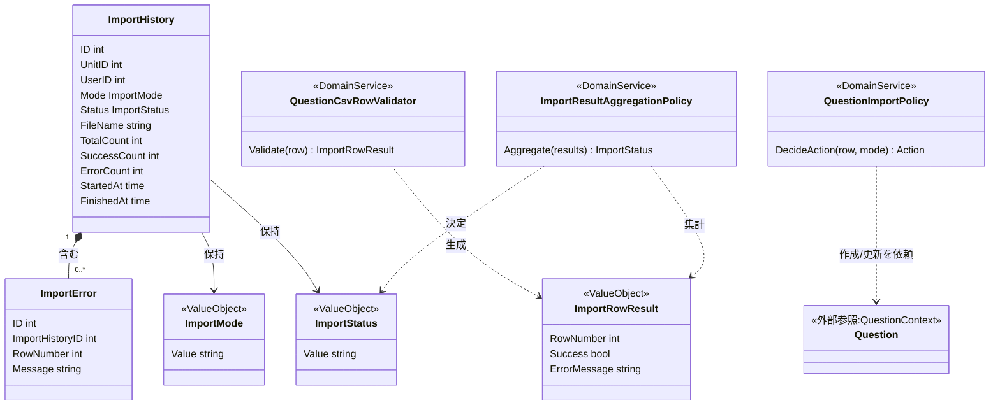
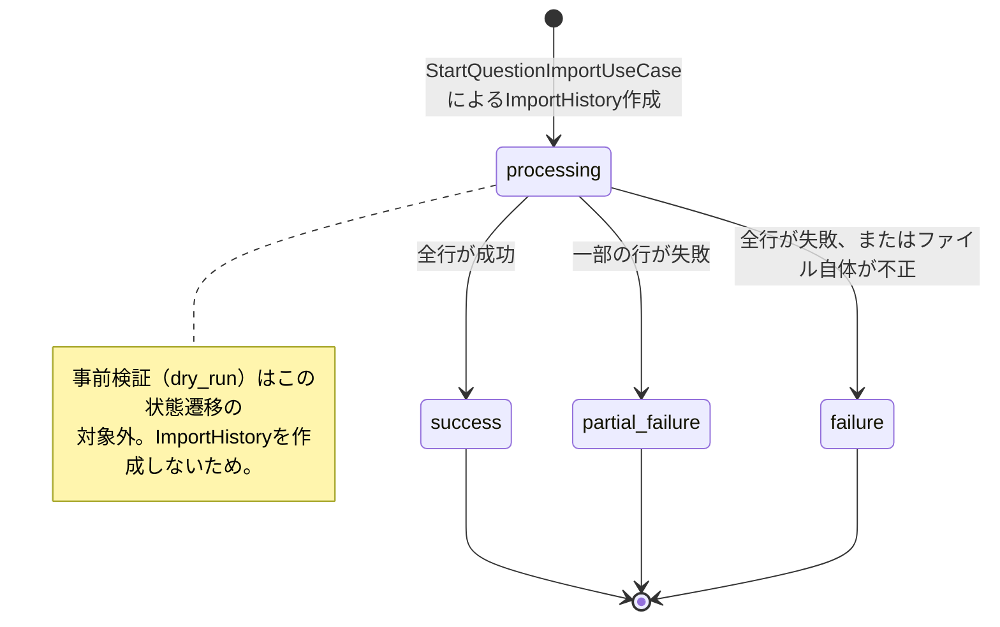
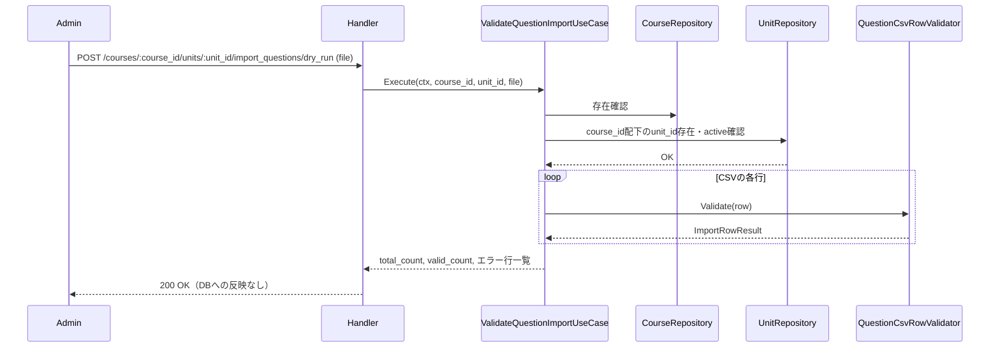
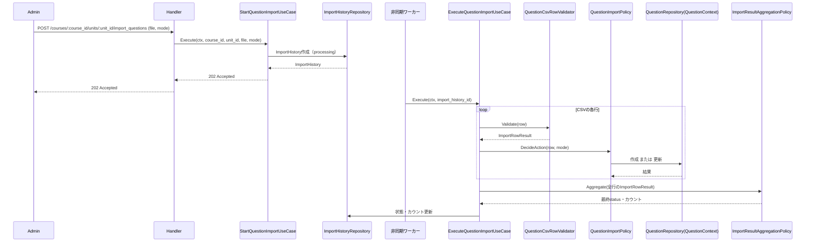

# 管理者問題インポート機能 Go移行・設計仕様書

---

# 1. 機能概要

## 機能概要

管理者が指定単元に対してCSV形式の問題データをアップロードし、既存問題への追加（append）または上書き（overwrite）を行う機能である。Rails現行仕様では、CSVアップロードは同期的に受け付け（202 Accepted）、実際の問題・選択肢・解説・ヒントの作成/更新はバックグラウンドジョブで非同期に処理される。処理結果はインポート履歴（ImportHistory）と行単位のエラー情報（ImportError）として記録される。

また、本番アップロードに先立って、CSVの内容をデータベースへ一切反映せずに検証する事前検証（dry_run）と、CSV入力用のテンプレートファイルのダウンロードを提供する。

## 利用者

- 管理者ユーザー（admin ロール）

## 業務上の目的

- 大量の問題データを一括で登録・更新できるようにし、手動登録の工数を削減する
- 処理結果を履歴として残し、失敗した行を特定できるようにする
- route（course_id / unit_id）で対象単元を厳密にスコープし、IDORを防止する
- 本番アップロード前にCSVの内容を検証できるようにし、実際に取り込んでから誤りに気づくという手戻りを防ぐ

---

# 2. 設計方針

本機能は、Rails実装（Controller/Form/Service/Job）の構造をそのまま置き換えるのではなく、「CSVアップロードの受付」「CSV処理の実行」「CSVの事前検証」という3つの業務局面を明確に分離したGo設計とする。事前検証は実際のインポート実行と同じ行単位の検証ロジックを再利用し、検証結果の一貫性を保証する。

主な設計思想は以下のとおりである。

- 責務分離: リクエスト受付（同期）、CSV処理実行（非同期）、CSV事前検証（同期・非永続化）を明確に分離する
- 保守性: append/overwriteの判定ロジック、行単位のエラー収集ロジック、CSV行の形式検証ロジックをドメイン側に集約し、事前検証と本番実行の両方から再利用できるようにする
- テスト容易性: インポート処理の進行状態（processing → 成功/一部失敗/失敗）と行単位の処理結果、事前検証結果を独立してテストできるようにする
- 拡張性: 将来的な他形式インポート（Excel等）や他リソースへのインポート拡張に対応しやすい構造とする
- API互換性: 同期リクエスト部分（202 Accepted、事前検証、テンプレートダウンロード）のAPI仕様を維持する

---

# 3. Bounded Context

## Context名

- question-import

## Contextの責務

- CSVアップロードの受付、事前検証（dry_run）、CSVテンプレートの提供
- インポート処理の進行状態管理
- 行単位の成功・失敗記録
- 問題インポート履歴（ImportHistory / ImportError）の検索・詳細参照・エラー明細CSVエクスポート（管理者インポート履歴管理機能_Go移行・設計仕様書が扱うUseCase群を含む。詳細な設計は同文書を参照）

## 他Contextとの依存関係

- Course/Unit Context: 対象単元の存在確認・スコープ検証に依存する
- Question Context: 問題・選択肢・ヒント・解説の作成/更新に依存する（推測: 現状のRails実装にはBounded Context分割が存在しないため、Questionを中心とする問題管理領域を独立したContextとして仮定する）
- User(Admin) Context: 実行者（管理者）の識別に依存する

## 依存する理由

インポート機能自体の責務は「CSVを解析し、進行状態と結果を管理すること」であり、実際の問題データ（Question等）の作成・更新はQuestion Contextの責務に委譲する。これにより、question-import Contextが問題データの構造知識を過度に持たずに済み、将来問題データの構造が変わってもインポートContextへの影響を局所化できる。Course/Unitへの依存は、routeで指定されたunit_idの正当性を検証しIDORを防ぐために必要である。

インポート履歴の検索・参照・CSVエクスポートを別Contextに分けず本Contextに含めた理由については「23. Railsとの責務対応」および「管理者インポート履歴管理機能_Go移行・設計仕様書」の「3. Bounded Context」を参照。

---

# 4. 設計パターン

## 採用パターン

Domain Model

## 判断根拠

本機能は単純なCRUDではなく、以下のような業務上意味のある状態管理・業務ルールを含む。

- ImportHistoryは「processing → 成功 / 一部失敗 / 失敗」という進行状態を持ち、業務上意味のある状態遷移を伴う
- append/overwriteモードによって「新規作成すべきか」「既存データを更新すべきか」という判定ロジックが発生し、これは単純なデータ保存以上の業務ルールである
- 行単位の成功・失敗結果を集計し、最終的なImportHistoryの状態を決定するロジックは、複数の処理結果を集約する業務ルールであり、Entityとして意味を持たせる価値が高い
- CSV行の形式検証（必須列の充足・データ形式の妥当性）は、本番実行と事前検証（dry_run）の両方から同一のルールで再利用される必要があり、手続きに埋め込むと重複・乖離が発生しやすい
- 将来的に他のインポート対象（生徒データ等）が増えることを想定すると、進行状態管理ロジックを汎用的なドメイン概念として独立させておく方が拡張しやすい

以上のとおり、業務領域の複雑さ・状態管理の必要性・将来の拡張性の観点から、Domain Modelを採用する。

## 採用しなかったパターン

### Transaction Script

CSV行の処理自体は手続き的だが、進行状態（processing/success/partial/failure）の決定ルールや、append/overwriteに応じた業務判断、さらに事前検証と本番実行で共有すべき行検証ルールを直接ユースケースに書き込むと、ルールが散在し、事前検証と本番実行の判定基準がずれるリスクが生じる。これらは業務上重要なルールであるため、手続きから独立させる必要がある。

### Active Record

ImportHistoryを単なる永続化モデルとして扱うと、状態遷移ルールや行単位の集計ロジックがモデルに寄りすぎるか、あるいはユースケースに散在しやすくなる。CSV処理の複雑さに対してモデルが肥大化しやすいため見送る。

### Event Sourcing

CSV行単位の処理操作をすべてイベントとして永続化・再生する要件は現行仕様には存在せず、成功件数・失敗件数の集計結果とエラー一覧があれば業務要件を満たせる。現時点では過剰設計と判断する。ただし将来的に処理の途中再開・厳密なリトライ制御が必要になった場合は再検討の余地がある。

---

# 5. Aggregate設計

## Aggregate Root

- ImportHistory

## Aggregateに含めるEntity

- ImportHistory
- ImportError（行単位のエラー情報）

## Aggregate境界

- ImportHistoryが「1回のインポート処理の進行状態・結果集計」を一貫して管理する単位とする
- ImportErrorはImportHistoryに従属し、単独では存在しない
- Question / QuestionChoice / QuestionHint / QuestionExplanationはAggregateに含めない。これらはQuestion Context側のAggregateであり、question-import Contextからは「作成/更新を依頼する対象」として外部参照する
- 事前検証（dry_run）はImportHistoryを作成しないため、Aggregateの書き込みを一切発生させない。検証結果（ImportRowResultの集合）は一時的な出力データであり、永続化対象ではない

## 整合性を保証する単位

- 1回のインポート処理におけるImportHistoryの状態（status / success_count / error_count / total_count）とImportErrorの一覧が常に整合していること

理由: ImportHistoryの状態は行単位の処理結果に依存して決定されるため、ImportHistoryとImportErrorを1つのAggregateとして扱うことで、集計結果と状態の不整合を防ぐ。一方、Questionデータの整合性はQuestion Context側の責務であるため、Aggregateを分離することで責務境界を明確にする。事前検証はAggregateへの書き込みを伴わないため、整合性保証の対象外である。

---

# 6. Entity設計

## ImportHistory

- 役割: 1回のCSVインポート処理の実行単位を表す中心的な概念
- ライフサイクル: 作成（processing）→ 行単位処理の実行 → 完了（成功 / 一部失敗 / 失敗）
- 状態変化: processingから開始し、行単位の処理結果の集計に基づいて終了状態へ遷移する（推測: Rails現行仕様書には終了状態の詳細な区分名までは明記されていないため、「成功／一部失敗／失敗」という区分は業務要件から推測したものである）
- 保持する責務:
  - mode（append/overwrite）、file情報、進行状態を保持する
  - success_count / error_count / total_countの整合性を管理する
  - 開始・終了日時を保持する
- 判断根拠: インポート処理全体の進行と結果を代表する中心的な業務データであるため

## ImportError

- 役割: 特定の行が処理に失敗した理由を表す概念
- ライフサイクル: 行処理失敗時に作成される。更新・削除は行わない
- 状態変化: なし（作成のみ）
- 保持する責務: row_number、失敗理由（message）を保持する
- 判断根拠: 失敗行の特定と原因把握という業務要件を満たすための情報であり、ImportHistoryに従属する意味のある業務データであるため

## Question / QuestionChoice / QuestionHint / QuestionExplanation（外部参照）

- 役割: インポートによって作成・更新される対象
- 判断根拠: 本Contextの中心はImportHistoryであり、Question自体の構造・整合性管理はQuestion Contextの責務であるため、本機能では「作成・更新を依頼する対象」として扱う

---

# 7. Value Object設計

## ImportMode

- 採用理由: append/overwriteという2値だが、不正な値が渡された場合にappendとして扱うというデフォルト解決ルールが業務上存在するため、単純な文字列ではなく明示的な型として扱う
- 独自ルール: append/overwrite以外の値はappendとして正規化する
- Entity属性ではなくValue Objectにする理由: モード判定（デフォルト解決）ロジックを一元化し、ImportHistoryや行処理ロジックから独立して再利用できるようにするため

## ImportStatus

- 採用理由: 進行状態を文字列のまま扱うと、不正な遷移や表記揺れが起きやすいため
- 独自ルール: processingから開始し、行処理結果の集計によって終了状態が決定される。終了後の再遷移は許容しない
- Entity属性ではなくValue Objectにする理由: 状態遷移という意味をコード上に明示し、業務ルールの変更に対する影響範囲を型に閉じ込めるため

## ImportRowResult

- 採用理由: 行単位の成功・失敗・エラー内容を統一的な形で扱い、集計処理をシンプルにするため。本番実行だけでなく、事前検証（dry_run）でも同じ型を用いることで、両者の結果表現を統一する
- 独自ルール: 成功時はQuestion識別情報（本番実行時）または検証合格の事実（事前検証時）を、失敗時はrow_numberとエラーメッセージを保持する
- Entity属性ではなくValue Objectにする理由: 永続化される概念ではなく、処理過程で一時的に生成される結果表現であるため

## Value Objectを採用しないもの

- ファイル名・ファイルサイズ等: 単純な属性値であり、独自の業務ルールを持たないため、Value Object化は不要とする

---

# 8. Domain Service

## QuestionCsvRowValidator

- 責務: CSV1行分のデータについて、必須列の充足・データ形式（正解番号の範囲、選択肢の必須数等）の構造的妥当性を検証する
- Entityへ持たせない理由: この検証はImportHistory（進行状態管理）にもQuestion（問題データ）にも一元的に属さず、CSV行データという入力そのものに対する判定であるため
- 判断根拠: 事前検証（dry_run）と本番実行（ExecuteQuestionImportUseCase）の両方が、行の妥当性判定に関して同一の結果を返す必要がある。この検証ロジックをUseCaseごとに個別実装すると、事前検証で合格した行が本番実行で失敗する（またはその逆）という不整合が生じうるため、共通のDomain Serviceとして1箇所に集約し、両UseCaseから呼び出す構造とする

## QuestionImportPolicy

- 責務: CSV1行のデータとmode（append/overwrite）から、Questionを新規作成すべきか既存Questionを更新すべきかを判定する
- Entityへ持たせない理由: この判定はImportHistory（進行状態管理）にもQuestion（問題データ）にも一元的に属さず、両者の情報（モードと対象データ）を横断して判断する必要があるため
- 判断根拠: append/overwriteの判定は業務上重要なルールであり、UseCaseに直接書くと再利用性・テスト容易性が下がるため、独立したポリシーとして切り出す。なお本ポリシーは、QuestionCsvRowValidatorによる形式検証に合格した行のみを対象とし、事前検証（dry_run）では呼び出されない（実際の作成・更新を行わないため）

## ImportResultAggregationPolicy

- 責務: 行単位の処理結果（ImportRowResultの集合）から、ImportHistoryの最終的な状態（成功 / 一部失敗 / 失敗）と各種カウントを決定する
- Entityへ持たせない理由: ImportHistoryに持たせることも可能だが、集計ルール自体が今後複雑化する可能性（失敗率による判定基準の変更等）を考慮し、独立したポリシーとして切り出すことでImportHistory Entityをシンプルに保つ
- 判断根拠: 状態決定ロジックの変更がEntity本体に影響しないようにするため。事前検証（dry_run）でも、total_count / valid_countの集計にこのポリシーの集計ロジックの一部（ImportHistoryの状態決定を除く件数集計部分）を再利用する

---

# 9. クラス図



---

# 10. 状態遷移図



---

# 11. Repository設計

## ImportHistoryRepository

- 管理対象: ImportHistory（ImportErrorを含む）
- 責務:
  - ImportHistoryの作成
  - 状態・カウントの更新
  - IDによる取得
  - 直近履歴の取得
  - 検索条件（状態・単元・コース・実行者・期間）による一覧取得、並び替え、ページング（管理者インポート履歴管理機能が利用する）
- 保持する検索機能: user_idによる絞り込み、作成日時降順取得、status/unit_id/course_id/user_id/期間による複合検索・並び替え
- 保持しない責務: モード判定、状態遷移ルールの判断そのもの
- 判断根拠: 永続化と検索に特化させ、業務ロジックを持たせないため。検索条件が事前検証・本番受付だけでなく履歴管理（一覧・詳細・エクスポート）でも必要となるため、同一Repositoryの検索機能として集約する

## ImportErrorRepository

- 管理対象: ImportError
- 責務: 行単位エラーの一括作成、ImportHistory IDによるエラー一覧取得
- 保持しない責務: エラー内容の妥当性判断
- 判断根拠: 永続化に特化させるため

## CourseRepository / UnitRepository

- 管理対象: Course, Unit（参照用）
- 責務: course_id配下にunit_idが存在し、かつactiveであることの確認
- 保持しない責務: Unit自体の作成・更新
- 判断根拠: routeスコープ検証（IDOR防止）に必要な参照確認に限定するため

## QuestionRepository（Question Context提供、外部依存として利用）

- 管理対象: Question, QuestionChoice, QuestionHint, QuestionExplanation
- 責務: 問題の新規作成、既存問題の更新（overwrite時）
- 保持しない責務: CSV解析、モード判定
- 判断根拠: 問題データの永続化はQuestion Contextの責務であり、question-import ContextはこれをQuestion Context経由で利用する立場に留める（推測: Question Context側の詳細なRepository設計は本書のスコープ外であり、別途整理される前提とする）

---

# 12. UseCase設計

## StartQuestionImportUseCase

- 目的: CSVアップロードを受け付け、インポート処理を開始する
- 入力: current admin, course_id, unit_id（route由来）, file, mode
- 出力: 受付結果（ImportHistory id等）
- トランザクション範囲: ImportHistoryの作成（processing状態）とファイル情報の保存を1トランザクションで実施する
- 呼び出すRepository: CourseRepository, UnitRepository, ImportHistoryRepository
- 判断根拠: 同期処理としてはCSVの形式的妥当性確認とImportHistoryの作成のみを行い、重い処理は非同期に委譲するため、トランザクション範囲を小さく保つ

## ExecuteQuestionImportUseCase

- 目的: 非同期ワーカーから呼び出され、CSVの各行を処理してQuestionを作成/更新し、結果をImportHistoryへ反映する
- 入力: import history id
- 出力: 更新後のImportHistory（状態・カウント）
- トランザクション範囲: 行単位（またはバッチ単位）でQuestion作成/更新をトランザクション化し、全体を1つの巨大なトランザクションにはしない（詳細は14.Transaction設計を参照）
- 呼び出すRepository: ImportHistoryRepository, ImportErrorRepository, QuestionRepository
- 判断根拠: 一部の行が失敗しても他の行の成功を保持する（部分的成功を許容する）業務要件があるため。行ごとにQuestionCsvRowValidator（形式検証）→QuestionImportPolicy（作成/更新判定）の順で処理する

## ValidateQuestionImportUseCase（事前検証／dry_run）

- 目的: アップロード予定のCSVをデータベースへ一切反映せずに検証し、全体件数・有効件数・エラー行の内容を返す
- 入力: current admin, course_id, unit_id（route由来）, file
- 出力: 総行数（total_count）、検証合格行数（valid_count）、検証エラー行一覧（row_number・エラーメッセージ・当該行データ。上限件数を超えた分は集計のみに反映し詳細一覧には含めない）
- トランザクション範囲: 使用しない（読み取り・検証のみで、ImportHistory・Question等いかなるデータも作成・更新しない）
- 呼び出すRepository: CourseRepository, UnitRepository（route由来のcourse_id/unit_idのスコープ検証のみ。ImportHistoryRepository・QuestionRepositoryは呼び出さない）
- 判断根拠: 本番実行前にCSVの内容を確認したいという業務要件（Rails現行仕様の`dry_run`アクション）を満たすため、ExecuteQuestionImportUseCaseと同一のQuestionCsvRowValidatorを用いて行検証を行う。これにより、事前検証で合格した行が本番実行で予期せず失敗するという不整合を防ぐ。ImportHistoryを作成しない点がExecuteQuestionImportUseCaseとの明確な違いである

## DownloadQuestionCsvTemplateUseCase（CSVテンプレート配布）

- 目的: 問題インポート用CSVテンプレート（ヘッダー行＋サンプル行）を生成して返す
- 入力: なし
- 出力: CSVファイル（BOM付き）
- トランザクション範囲: 使用しない（DBアクセスを伴わない静的なファイル生成処理）
- 呼び出すRepository: なし
- 判断根拠: テンプレートの列構成はQuestionCsvRowValidatorが要求する入力項目に対応する固定的な内容であり、DB参照を必要としない。他のUseCaseと異なりDomain Model的な業務ルールを持たないため、シンプルな生成処理として位置づける

---

# 13. シーケンス図・処理フロー図

## シーケンス図（事前検証: dry_run）



## シーケンス図（インポート受付〜実行）



## 処理フロー図（事前検証と本番実行の行検証ロジック共有）

```mermaid
flowchart TD
    A[CSVアップロード] --> B{route(course_id/unit_id)は\n有効なスコープか}
    B -- No --> B1[404: 対象コース・単元なし]
    B -- Yes --> C[QuestionCsvRowValidatorで\n行ごとに形式検証]
    C --> D{事前検証(dry_run)か\n本番実行か}
    D -- 事前検証 --> E[DBへ反映せず\ntotal_count/valid_count/エラー行を返す]
    D -- 本番実行 --> F{検証合格行か}
    F -- No --> G[ImportErrorとして記録]
    F -- Yes --> H[QuestionImportPolicyで\nappend/overwrite判定]
    H --> I[Question作成/更新]
    G --> J[ImportResultAggregationPolicyで\n最終状態を決定]
    I --> J
    J --> K[ImportHistory更新]
```

---

# 14. Transaction設計

## Transaction開始位置

- StartQuestionImportUseCaseはUseCase開始時にトランザクションを開始する
- ExecuteQuestionImportUseCaseは行（またはバッチ）単位でトランザクションを開始する
- ValidateQuestionImportUseCase・DownloadQuestionCsvTemplateUseCaseはトランザクションを使用しない（データ変更を伴わないため）

## Transaction終了位置

- StartQuestionImportUseCaseはImportHistory作成完了時にコミットする
- ExecuteQuestionImportUseCaseは各行（またはバッチ）のQuestion作成/更新が完了する都度コミットし、全行処理完了後にImportHistoryの最終状態を別途コミットする

## 理由

基本方針は「UseCase単位」でのトランザクション管理だが、ExecuteQuestionImportUseCaseは「一部の行が失敗しても他の行の成功を確定させる」という業務要件（部分的成功の許容）を持つ。UseCase全体を1トランザクションにすると、1行のエラーで全行がロールバックされてしまい、この業務要件を満たせない。

そのため、UseCase単位の原則を維持しつつ、UseCase内部の実行単位を行/バッチレベルに分割することで、整合性と部分的成功の両立を図る。これは基本方針からの意図的な逸脱であり、その理由を明示した上で採用する。

事前検証（ValidateQuestionImportUseCase）はデータ変更を一切行わないため、そもそもトランザクションの対象にならない。

---

# 15. Validation設計

## Presentation

- 型チェック: course_id / unit_idの型チェック（route由来）
- 必須チェック: fileの必須チェック（本番実行・事前検証の両方）
- フォーマットチェック: mode値の形式チェック（append/overwrite以外の値は後続でappendへ正規化されるため、Presentationでは形式のみ検証する）。ファイルの拡張子・Content-Typeがcsvであることの検証

## Domain

- 業務ルール: CSVファイルの構造的妥当性（必須列の存在等、ヘッダー不正時はこの時点でエラーとする）
- 状態チェック: append/overwriteモードに応じた処理可否の判定（本番実行のみ。事前検証では行わない）
- 整合性チェック: 行データの内容（問題文・選択肢等）が業務ルールに適合しているかの確認（QuestionCsvRowValidatorが本番実行・事前検証の両方で共通して実施する）

## バリデーション仕様

|フィールド|検証層|ルール|エラーメッセージ方針|
|-|-|-|-|
|course_id / unit_id|Presentation|整数形式であること（route由来）|「対象コース・単元が不正です」|
|file|Presentation|必須。拡張子・Content-Typeがcsvであること|「CSVファイルを指定してください」|
|CSVヘッダー|Domain|問題インポートで要求される列が過不足なく存在すること|「CSVの形式が不正です」|
|mode|Presentation|`append`または`overwrite`のいずれか。それ以外は`append`へ正規化|（形式エラーとしては扱わない）|
|CSV行データ|Domain|必須項目の充足、正解番号・選択肢数等の業務的な形式妥当性（QuestionCsvRowValidator）|「〇行目: 〇〇が不正です」|

## 責務分離

- Presentationは「ファイルが受理可能な形式か」を担当する
- Domainは「行の内容が業務的に妥当か」「モードに応じた処理が可能か」を担当する
- QuestionCsvRowValidatorによる行検証ロジックは事前検証・本番実行の両方から共通して呼び出され、判定結果の乖離を防ぐ

---

# 16. Authorization設計

## Middleware

- 認証済みユーザーを特定し、adminロールであることを確認する

## Handler

- APIエントリポイントで認証失敗時のレスポンスを整える
- 業務権限の判定は持たせない

## UseCase

- route由来のcourse_id / unit_idを起点に、Course配下にUnitが実在し、かつactiveであることを検証する（StartQuestionImportUseCase・ValidateQuestionImportUseCaseの両方で実施する）
- リクエストボディのunit_id等は信用せず、routeの値のみを正とする（IDOR対策）

## Domain

- ImportHistoryの所有者（user_id）を保持し、将来的な参照制限の材料とする

## 判断理由

Rails現行仕様は「routeで厳密にスコープしボディを信用しない」という明確なIDOR対策方針を持っている。これをUseCase層での存在確認・スコープ検証としてそのまま踏襲する。ロールの確認はMiddlewareに委ね、業務的なスコープ検証はUseCaseに集約することで責務を分離する。事前検証（dry_run）も本番実行と同じスコープ検証を行うことで、認可の抜け穴が生じないようにする。

---

# 17. Error設計

## Domain Error

- 責務: ドメインルール違反を表現する
- 例: 不正なCSV行データ（必須列欠如、選択肢不整合等）、不正な状態遷移、ImportHistoryの状態不整合
- 判断理由: 業務ルール違反をアプリケーション層に漏らさず、ドメイン側で明示的に扱うため

## Application Error

- 責務: ユースケース実行時の失敗を表現する
- 例: 対象Course/Unitが存在しない、対象単元が非activeである、ファイル形式が不正である
- 判断理由: ユースケースの失敗理由をHTTPレスポンスに変換しやすくするため

## Infrastructure Error

- 責務: ファイルストレージへの保存失敗、非同期ジョブのディスパッチ失敗、DB接続失敗を表現する
- 判断理由: 永続化層・外部依存の失敗をドメインに漏らさず、技術的な障害として切り分けるため

## 判断理由

CSV行単位の業務ルール違反（Domain）、ファイル・リソースの存在確認失敗（Application）、インフラ的な失敗（Infrastructure）を分離することで、部分的成功時のレスポンス構築（どの行が失敗し、どの行が成功したか）を明確に扱えるようにするため。

## エラー仕様

|業務シナリオ|エラー種別|発生層|想定するHTTPステータス|
|-|-|-|-|
|対象コース・単元が存在しない|Application Error|UseCase|404|
|ファイル形式・CSVヘッダーが不正|Domain Error|Domain|422|
|CSV行データが業務ルールに違反する（事前検証時）|Domain Error|Domain（検証結果として返却、エラー自体は発生させない）|200（rows内にエラー明細を含める）|
|ファイルストレージへの保存に失敗する|Infrastructure Error|Infrastructure|500|
|非同期ジョブのディスパッチに失敗する|Infrastructure Error|Infrastructure|500|

---

# 18. Domain Event

必要と判断し、採用する。

## イベント名

- QuestionImportRequested

## 発火タイミング

- StartQuestionImportUseCaseによってImportHistoryがprocessing状態で作成された直後

## 利用目的

- 同期リクエスト（202 Accepted）とCSV行処理の実行（非同期）を分離するためのトリガーとして利用する

## 採用理由

Rails現行仕様でもActiveJob（`perform_later`）によって同期処理と非同期処理が明確に分離されており、この境界は業務上も技術上も重要な意味を持つ。Go設計においても、ImportHistory作成という状態変化をトリガーに非同期実行を開始するという構造をDomain Eventとして明示的にモデル化することで、将来的に「インポート完了時に管理者へ通知する」等の追加の購読者が発生した場合にも対応しやすくなる。

なお、本イベントは技術的には非同期ジョブのディスパッチに近い性質を持つ。具体的な非同期実行の仕組みは、アーキテクチャ規約.md「13. 非同期ジョブ実行パターン（JobQueue）」に定める`jobs`テーブル + ポーリングワーカーの標準実装に従う（本機能は同規約が定める「確実に実行したい処理」に該当する）。事前検証（dry_run）はデータを変更しない同期処理であるため、本イベントの対象外である。

---

# 19. API仕様

## エンドポイント一覧

|エンドポイント|HTTP Method|概要|
|-|-|-|
|/api/v1/admin/csv_template/questions|GET|問題インポート用CSVテンプレートをダウンロード|
|/api/v1/admin/courses/:course_id/units/:unit_id/import_questions/dry_run|POST|CSV問題インポートの事前検証|
|/api/v1/admin/courses/:course_id/units/:unit_id/import_questions|POST|CSV問題インポートを開始|

## 各エンドポイントの仕様

### GET /api/v1/admin/csv_template/questions

- Request: パラメータなし
- Response: `questions_template.csv`（text/csv、BOM付き）
- Status Code: 200（取得成功）
- Error Response方針: 認証前提のAPIであり通常は発生しない

### POST /api/v1/admin/courses/:course_id/units/:unit_id/import_questions/dry_run

- Request: course_id / unit_id（route）、file（必須）
- Response: total_count、valid_count、rows（検証エラー行の row_number・severity・message・data）
- Status Code: 200（検証処理自体は成功。行単位のエラーはrowsに含める）、422（ファイル形式・ヘッダー不正）、404（対象コース・単元なし）
- Error Response方針: 既存のerrors形式を踏襲する

### POST /api/v1/admin/courses/:course_id/units/:unit_id/import_questions

- Request: course_id / unit_id（route）、file（必須）、mode（任意、デフォルトappend）
- Response: message（「インポートを開始しました」相当）
- Status Code: 202（受付成功）、422（ファイル不正）
- Error Response方針: 既存のerrors形式を踏襲する

## Railsとの差分

差分なし。Rails現行仕様の3エンドポイント（テンプレートダウンロード・事前検証・インポート開始）をそのまま維持する。

---

# 20. DB設計方針

## 現行DBを利用するか

- 既存Rails DBを継続利用する（import_histories / import_errorsテーブルは継続利用する）

## Schema変更有無

- あり（ファイル添付方式のみ）

## 変更理由

RailsのファイルアップロードはActiveStorage（Rails固有の多態関連テーブルである `active_storage_blobs` / `active_storage_attachments`）に依存している。Go側にはActiveStorage相当の仕組みが存在しないため、そのままでは同じ方式でファイル情報を参照できない。

## Schema変更内容

### 現状問題

- ファイル情報がactive_storage_blobs / active_storage_attachmentsという多態的な関連テーブルに保存されており、Go側から直接参照する手段がない

### 変更内容

- import_historiesテーブルに、ファイルの保存先を直接表す項目（ファイルの保存パス、またはオブジェクトストレージ上のキーに相当する情報）を追加することを提案する（推測: 具体的なカラム名・型はGo実装仕様書で検討する）
- 事前検証（dry_run）はImportHistoryを作成しないため、このスキーマ変更の対象外である

### 変更によるメリット

- Rails固有の多態関連構造に依存せず、Go側で直接ファイル参照情報を扱えるようになり、実装がシンプルになる

### 影響範囲

- 既存のRails側ActiveStorageデータからのマイグレーション（移行スクリプト）が必要になる
- 移行期間中は、Rails/Go両方からのファイル参照方法の整合を取る必要がある

---

# 21. DB操作仕様

## ImportHistoryRepository

- 対象テーブル: import_histories
- 操作種別: 作成、更新（状態・カウント）、参照
- 主な検索条件・絞り込み条件: user_idによる絞り込み、直近履歴の取得（作成日時降順）。管理者インポート履歴管理機能向けにはstatus/unit_id/course_id(unitとの結合経由)/user_id/期間による複合絞り込みも行う。いずれも`import_type`が問題インポートである履歴のみを対象とする
- 関連テーブルとの結合: 検索用途ではunits・coursesと結合してcourse_idでの絞り込みを可能にする。作成・更新時は結合不要
- ページネーション・ソート: 一覧検索時はページネーション・作成日時等によるソートが必要（詳細は管理者インポート履歴管理機能_Go移行・設計仕様書を参照）

## ImportErrorRepository

- 対象テーブル: import_errors
- 操作種別: 作成（一括）、参照
- 主な検索条件・絞り込み条件: import_history_idによる絞り込み、row_number順のソート
- 関連テーブルとの結合: 不要
- ページネーション・ソート: 通常は全件取得（行番号順）。エクスポート用途を除き上限件数の制御が必要な場合がある

## CourseRepository / UnitRepository

- 対象テーブル: courses, units
- 操作種別: 参照
- 主な検索条件・絞り込み条件: course_id配下にunit_idが存在し、かつactiveであることの確認
- 関連テーブルとの結合: courses と units の結合
- ページネーション・ソート: 不要

---

# 22. テスト戦略

## Domain Test

- 目的: ImportStatus / ImportModeの正規化ルール、ImportResultAggregationPolicyによる状態決定ロジック、QuestionImportPolicyによるappend/overwrite判定ロジック、QuestionCsvRowValidatorによる行検証ロジックを検証する。QuestionCsvRowValidatorについては、事前検証・本番実行のいずれから呼び出しても同一の判定結果になることを重点的に検証する

## UseCase Test

- 目的: StartQuestionImportUseCase（受付処理）、ExecuteQuestionImportUseCase（行単位処理と部分的成功の扱い）、ValidateQuestionImportUseCase（データを変更せず検証結果のみを返すこと）、DownloadQuestionCsvTemplateUseCaseの業務振る舞いを検証する

## Repository Test

- 目的: ImportHistoryRepository / ImportErrorRepositoryの永続化・検索の正確性、CourseRepository / UnitRepositoryのスコープ検証を検証する

## Handler Test

- 目的: ファイルアップロードの入力検証とHTTPステータス（200/202/404/422）変換を検証する

## Integration Test

- 目的: エンドポイント経由でのアップロード受付から、非同期処理完了後のImportHistory状態・ImportError記録までを一貫して確認する。また、事前検証（dry_run）実行後にImportHistoryが作成されていないことを確認する

---

# 23. Railsとの責務対応

| Rails | Go | 設計方針 |
|---|---|---|
| Controller | Handler | HTTP入力（ファイル・route）の受け取りとレスポンス整形に限定する |
| Form（Admin::QuestionImportForm） | Request DTO + Validation | 入力検証をPresentation層で分離する |
| Service（Admin::QuestionCsvBatchImportService / QuestionCsvImportService） | UseCase（ExecuteQuestionImportUseCase）+ Domain Service（QuestionImportPolicy, ImportResultAggregationPolicy） | CSV処理の手続きと業務ルール判定を分離する |
| Service（Admin::QuestionCsvDryRunService） | UseCase（ValidateQuestionImportUseCase）+ Domain Service（QuestionCsvRowValidator） | 事前検証を独立したUseCaseとして扱い、行検証ロジックを本番実行と共有する |
| Service（Admin::QuestionCsvTemplateService） | UseCase（DownloadQuestionCsvTemplateUseCase） | テンプレート生成を独立した単純な処理として扱う |
| Job（Admin::QuestionCsvImportJob） | Domain Event（QuestionImportRequested）購読による非同期実行 | 非同期実行のトリガーを明示的にモデル化する |
| Model（ImportHistory / ImportError） | Entity（ImportHistory Aggregate） | 状態管理と結果集計をEntity/Aggregateに集約する |
| Controller（`Api::V1::Admin::ImportHistoriesController`） | question-import Context内の検索・参照UseCase群 | 管理者インポート履歴管理機能_Go移行・設計仕様書で個別に設計する（本Contextの一部として扱う） |

---

# 24. 採用しなかった設計

## Transaction Script

- 採用しなかった理由: 進行状態遷移とモード判定ロジックが散在しやすく、部分的成功の扱いや、事前検証・本番実行間で共有すべき行検証ロジックを手続きのみで表現すると保守性が下がるため
- 将来的に採用する可能性: インポート対象が極めて単純化された場合には再検討できる

## Active Record

- 採用しなかった理由: 状態遷移ルールと集計ロジックをモデルに寄せると、CSV処理の複雑さに対してモデルが肥大化しやすいため
- 将来的に採用する可能性: 現時点では想定しない

## Event Sourcing

- 採用しなかった理由: 現時点では行単位の処理イベントをすべて永続化・再生する要件がないため過剰設計と判断した
- 将来的に採用する可能性: 処理の途中再開・詳細な監査要件が発生した場合は採用を再検討する

## インポート履歴管理機能を独立したContextとして分離する案

- 採用しなかった理由: 対象データ（ImportHistory / ImportError）・実行者（admin）が問題インポート機能と完全に同一であり、行っているのは同一Aggregateに対する検索・参照・エクスポートという操作にすぎない。データ所有と業務ルール（状態遷移）を持つquestion-import Contextと分離すると、同一Aggregateを2つのContextが異なる形で参照することになり、変更時の整合性維持が難しくなる
- 将来的に採用する可能性: インポート履歴の管理が問題インポート以外の複数インポート種別（生徒インポート等）を横断して扱うようになり、単一Aggregateへの参照という前提が崩れた場合は、独立した参照専用Contextとしての切り出しを再検討する

---

# 25. 設計判断サマリー

|項目|採用|判断理由|
|-|-|-|
|設計パターン|Domain Model|進行状態管理とモード判定という業務ルールが中核となるため|
|Aggregate|ImportHistory（ImportErrorを含む）|進行状態と結果集計の整合性を保つ単位として妥当なため|
|Transaction境界|UseCase単位を基本としつつ行/バッチ単位に分割|部分的成功を許容する業務要件があるため|
|Domain Event|採用（QuestionImportRequested）|同期受付と非同期処理の境界を明示するため|
|Value Object|一部採用（ImportMode / ImportStatus / ImportRowResult）|モード・状態・行結果の意味を明示するため|
|Authorization|UseCase（routeスコープ検証）+ Middleware|IDOR対策としてrouteの値のみを正とするため|
|事前検証（dry_run）|独立したUseCase + 行検証ロジックの共有|本番実行と判定結果を一致させ、手戻りを防ぐため|
|インポート履歴管理機能のContext|question-importと同一Context|同一Aggregate・同一実行者に対する参照専用UseCase群であるため|

---

# 設計差分管理

## Rails現行仕様

- Controllerがroute値を検証し、Form/Serviceが検証・ImportHistory作成・ActiveJobディスパッチを行う
- ファイルはActiveStorageで保存される
- 事前検証（dry_run）は`Admin::QuestionCsvDryRunService`として、本番実行とは別サービスクラスで実装されている

## Go設計での変更内容

- 受付処理（StartQuestionImportUseCase）と実行処理（ExecuteQuestionImportUseCase）をUseCaseとして明確に分離する
- モード判定・状態集計をDomain Service/Entityに集約する
- 事前検証（ValidateQuestionImportUseCase）と本番実行が、行検証ロジック（QuestionCsvRowValidator）を共有する構造とし、両者の判定結果の一貫性をドメイン層で保証する
- ファイル保存はActiveStorageに依存せず、import_historiesに直接ファイル参照情報を持たせる方式に変更する

## 変更理由

- Rails固有の非同期・ファイル添付の仕組みに依存せず、Goのアーキテクチャで同等の業務要件（部分的成功の許容、IDOR対策、進行状態管理、事前検証と本番実行の整合性）を満たすため
- Railsでは事前検証と本番実行が別サービスクラスとして実装されており、行検証ロジックが重複する余地があった。Go設計ではQuestionCsvRowValidatorとして明示的に共通化することで、この重複・乖離リスクを解消する

## 影響範囲

- API外部仕様（202受付・事前検証・エラーレスポンス）は維持する
- DBスキーマはファイル参照方法のみ変更が必要であり、既存データのマイグレーションが必要になる
