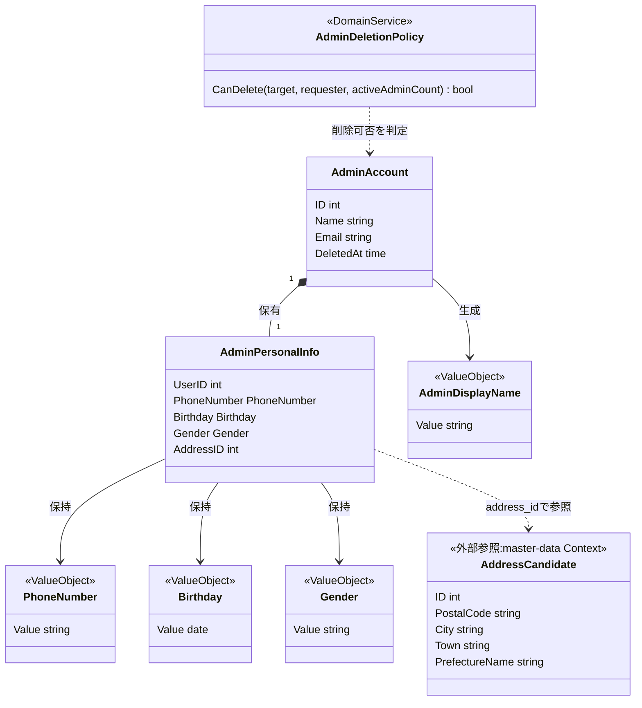
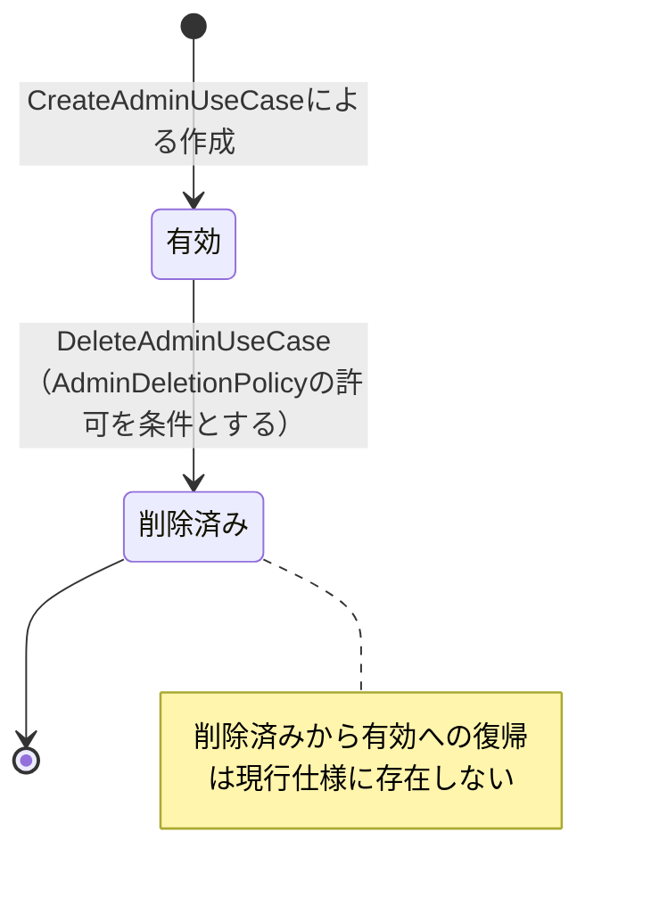
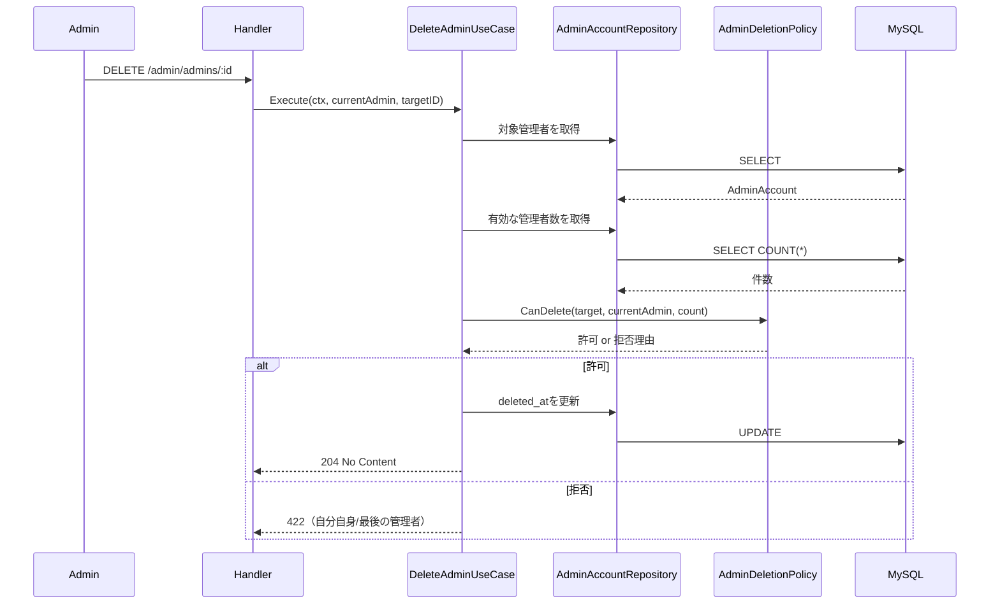
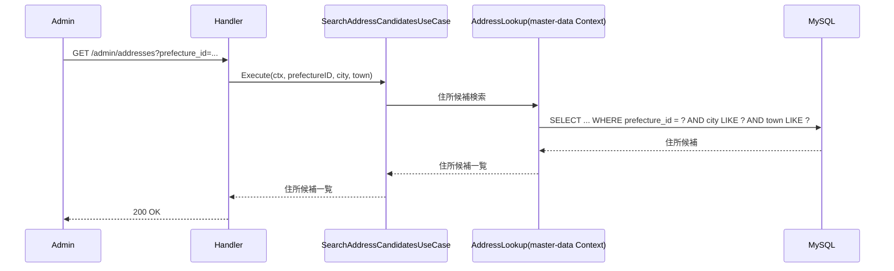
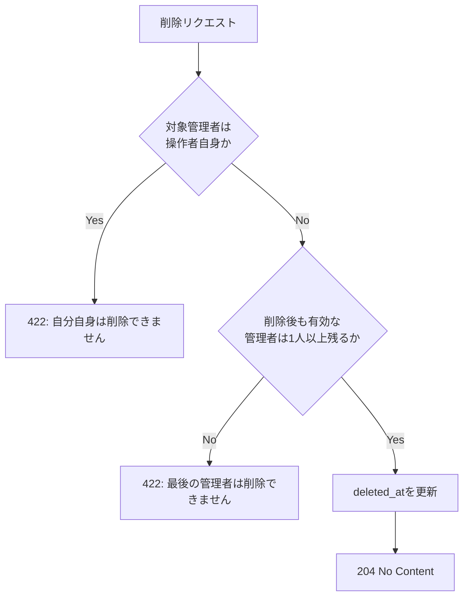

# 管理者ユーザー管理機能 Go移行・設計仕様書

---

# 1. 機能概要

## 機能概要

管理者自身が管理者アカウント（`admin` ロールのユーザー）の一覧・詳細を参照し、新規管理者の作成、既存管理者情報の更新、管理者の論理削除を行う機能である。Rails現行仕様では検索・ページング付きの一覧、詳細、作成、更新、削除の5操作を提供する。また、管理者情報の更新時に住所を入力する補助手段として、都道府県・市区町村から住所候補を検索するAPIを提供するが、この住所候補検索自体は住所マスタを所有せず、共通マスタ参照機能が提供する住所検索を管理者ユーザー管理の文脈で呼び出しているに過ぎない。

## 利用者

- `admin` ロールのユーザー（管理者）
- 対象は管理者アカウント自身であり、他ロール（教員・生徒）は対象外

## 業務上の目的

- 管理者アカウントを一元管理し、システム運用者を増減できるようにする
- 「自分自身は削除できない」「最後の管理者は削除できない」という運用上の安全弁を保証する
- 管理者の個人情報（連絡先・生年月日等）を正確に維持する
- 管理者プロフィール更新時に、都道府県・市区町村から住所候補を検索し、選択できるようにする

---

# 2. 設計方針

本機能は単純なCRUDに見えるが、「自分自身は削除できない」「最後の管理者は削除できない」という業務ルールが、管理者アカウントというEntityの状態遷移（有効→削除済み）に強く結びついている。これはRailsではControllerとModelのバリデーション・コールバックに分散しがちな責務であり、Go移行にあたっては責務をドメイン層に明確に集約する。また、住所候補検索はRails現行仕様では管理者ユーザー管理機能のControllerに同居しているが、住所というデータ自体は本機能が所有するものではないため、Go設計では別Context（共通マスタ参照）が提供する参照手段を呼び出す形に整理する。

- 責務分離: HTTP・入力検証・削除可否判定・永続化を分離する
- 保守性: 「最後の管理者」「自分自身」という削除不可条件をドメインルールとして一箇所に集約する
- テスト容易性: 削除可否判定を、DBに依存しない形でユニットテスト可能にする
- 拡張性: 将来的に管理者の権限段階（スーパー管理者等）が追加されても、削除可否判定の構造を壊しにくくする
- API互換性: 既存フロントエンドとの整合を保つため、エンドポイントと主要なレスポンス構造は維持する

---

# 3. Bounded Context

## Context名

- admin-account-management（管理者アカウント管理コンテキスト）

## Contextの責務

- 管理者アカウントの検索・ページング付き一覧・詳細参照
- 管理者アカウントの新規作成
- 管理者プロフィール・個人情報の更新
- 管理者アカウントの論理削除（安全弁ルールの適用を含む）

本Contextは住所（Address）そのものを所有・管理しない。住所候補検索は、プロフィール更新時に管理者が住所を選択するための補助的な参照操作であり、本Contextの業務目的（管理者アカウントの作成・更新・削除ルールの管理）には含まれない。

## 他Contextとの依存関係

- Account/Authentication Context: 管理者アカウントの実体（ログイン用の `User` レコード）の作成・識別に依存する
- master-data（共通マスタ参照）Context: 住所候補検索（都道府県・市区町村・町域による絞り込み）に依存する。管理者プロフィールが保持する`address_id`が参照する住所レコード自体も、master-data Contextが真正な情報源である

## 依存する理由

管理者アカウント管理コンテキストは「管理者としての作成・更新・削除ルール」に責務を限定し、ログイン認証の仕組みそのもの（パスワード・セッション等）は認証コンテキストに委譲する。

住所は管理者固有の概念ではなく、都道府県・市区町村・在籍高校・学年といった他の参照マスタと同様に、会員登録・プロフィール編集など複数の機能から横断的に参照される共通マスタである（共通マスタ参照機能_Rails現行仕様書が示すとおり、`Api::V1::AddressesController`は一般ユーザー向けにも提供されている）。Rails現行仕様では管理者向けに`Api::V1::Admin::AddressesController`という別Controllerが存在するが、これは「管理者が呼び出す」という利用経路が異なるだけであり、住所検索という業務ロジック自体（都道府県必須・市区町村/町域の部分一致検索）は共通マスタ参照機能が提供するものと同一である。したがって、本機能は住所検索ロジックを自ら持たず、master-data Contextが公開する参照手段を、管理者向けの利用経路として呼び出す設計とする。これにより、住所検索ロジックがadmin-account-managementとmaster-dataの2箇所に重複することを防ぐ。

---

# 4. 設計パターン

## 採用パターン

Domain Model

## 判断根拠

本機能は表面上CRUDに見えるが、以下の理由からEntityに業務ルールを集約するDomain Modelが妥当と判断する。

- Entityが状態を持つ: 管理者アカウントは「有効」「削除済み（論理削除）」という状態を持ち、`deleted_at` によって表現される
- 状態遷移ルールが存在する: 「有効→削除済み」の遷移には、「自分自身でないこと」「削除後も有効な管理者が1人以上残ること」という2つの前提条件があり、単純な代入では表現できない
- 複数の業務ルールがEntityに関連する: 電話番号の桁数（10〜11桁）、性別の許容値、生年月日が未来日付にできないこと、名前未入力時にメールアドレスのローカル部をデフォルトにすることなど、作成・更新時の業務ルールが複数存在する
- 将来の拡張性: 管理者に権限段階（例: スーパー管理者のみ他管理者を削除できる）が追加される可能性があり、削除可否判定のロジックをEntity／Domain Serviceに閉じ込めておくことで変更に強くなる
- テスト容易性: 「最後の管理者は削除できない」というルールは、DBの状態（現在の有効管理者数）に依存するが、その数値さえ渡せば純粋なロジックとしてテストできる

これらの理由から、単純なActive Recordとして永続化中心に設計するより、削除可否判定・作成時のデフォルト名付与ルールなどをドメイン層に明示的に集約するDomain Modelを採用する。

なお、住所候補検索は本機能のドメインロジックの複雑さには寄与しない（master-data Context側の単純な絞り込みクエリに過ぎない）ため、この判断根拠には含めない。

## 採用しなかったパターン

### Transaction Script

- 削除可否判定（自分自身／最後の管理者）が複数のユースケースで再利用される可能性があり、手続きに埋め込むと重複しやすい
- 業務ルールが分散し、変更時に見落としが発生しやすい

### Active Record

- 「最後の管理者は削除できない」という判定は、Entity単体の属性だけでは完結せず、他の管理者の件数という集約横断の情報が必要になる
- 判定ロジックを永続化層の近くに置くと、テストの際にDBアクセスが必要になりテスト容易性が下がる

### Event Sourcing

- 管理者アカウントの変更履歴を再構築する要件は現行仕様に存在しない
- 監査ログ等の要件が明確でない段階では過剰な設計である

---

# 5. Aggregate設計

## Aggregate Root

- AdminAccount（管理者としての `User`）

## Aggregateに含めるEntity

- AdminAccount
- AdminPersonalInfo（`user_personal_infos` に対応する個人情報）

## Aggregate境界

- AdminAccountが自身の基本情報・個人情報・削除状態の整合性を保つ単位とする
- 住所（Address）はAggregateの外部参照とし、識別子（address_id）のみを保持する。住所レコードそのものの整合性・検索責務はmaster-data Contextにあり、本Aggregateには含めない

## 整合性を保証する単位

- プロフィール更新時、`users` と `user_personal_infos` への反映を1トランザクションで行う
- 削除時、削除可否判定と `deleted_at` の更新を1トランザクションで行う

理由: 管理者本体と個人情報、および削除判定と削除実行が別々に反映されると、不整合な中間状態（例: 判定は通ったが削除は失敗した状態）が生じうるため。

---

# 6. Entity設計

## AdminAccount

- 役割: システムを運用する管理者アカウントを表す中心的な概念
- ライフサイクル: 作成 → 参照 → プロフィール更新 → （条件を満たせば）論理削除
- 状態変化: 有効 (`deleted_at` が null) → 削除済み (`deleted_at` が設定される)。削除済みから有効への復帰は現行仕様に存在しない
- 保持する責務:
  - 名前・メールアドレス等の基本情報を保持する
  - 名前未入力時にメールアドレスのローカル部をデフォルト名として補完するルールを保持する
  - 削除実行時に、事前に判定された削除可否結果を反映して状態を遷移させる
- 判断根拠: 管理者アカウントの基本情報と状態遷移（有効／削除済み）の中心であるため

## AdminPersonalInfo

- 役割: 管理者の個人情報（電話番号・生年月日・性別・住所参照）を表す概念
- ライフサイクル: 作成（管理者作成に付随）・更新
- 状態変化: なし（属性の更新のみ）
- 保持する責務:
  - 電話番号の桁数ルール（10〜11桁）を保持する
  - 生年月日が未来日付でないことを保持する
  - 性別が許容値のいずれかであることを保持する
  - 住所の識別子（address_id）を保持する。住所レコード自体の内容（郵便番号・市区町村等）は保持せず、master-data Contextへの参照のみを持つ
- 判断根拠: 個人情報固有のフォーマット・整合性ルールをAdminAccount本体から分離し、責務を明確にするため

## AddressCandidate（外部参照、master-data Context提供）

- 役割: プロフィール更新時に管理者が住所を選択するための候補データ
- ライフサイクル・状態変化: 本Contextでは扱わない（master-data Contextが所有）
- 保持する責務: 表示・選択に必要な最小限の情報（id・郵便番号・市区町村・町域・都道府県名）
- 判断根拠: 住所マスタの所有・検索責務はmaster-data Contextにあり、本Contextは選択結果（address_id）を受け取って保持するのみであるため

---

# 7. Value Object設計

## PhoneNumber

- 採用理由: 「10〜11桁の数字」という形式ルールを持ち、単なる文字列として扱うと検証ロジックが散在しやすいため
- 独自ルール:
  - 数字のみ、10桁または11桁であることを保証する
- Entity属性ではなくValue Objectにする理由: 形式ルールを型として明示し、作成・更新の両方で同じ検証ロジックを再利用するため

## Birthday

- 採用理由: 「未来日付にできない」という業務ルールを持つため
- 独自ルール:
  - 現在日時より未来の日付を許容しない
- Entity属性ではなくValue Objectにする理由: 日付そのものではなく「業務上妥当な生年月日」という意味を型で表現するため

## Gender

- 採用理由: 許容される値が `UserPersonalInfo.genders` として列挙定義されているため
- 独自ルール:
  - 定義済みの列挙値以外を許容しない
- Entity属性ではなくValue Objectにする理由: 無効な値の混入を型レベルで防ぎ、許容値の変更を1箇所で管理するため

## AdminDisplayName

- 採用理由: 「名前が空の場合、メールアドレスのローカル部をデフォルトにする」という生成ルールを持つため
- 独自ルール:
  - 入力が空文字またはnilの場合、メールアドレスの `@` より前の部分を採用する
- Entity属性ではなくValue Objectにする理由: 名前解決ロジックをEntity生成時の1箇所に閉じ込め、UseCase側で条件分岐させないため

## Value Objectを採用しないもの

- メールアドレス自体は形式検証の対象だが、本機能に固有の複雑な業務ルールを持たないため、シンプルな属性として扱う（形式検証はPresentation層で行う）
- 住所（address_id）は単なる外部参照IDであり、本Context内で独自の業務ルールを持たないため、Value Object化は不要とする

---

# 8. Domain Service

## AdminDeletionPolicy

- 責務: 指定の管理者アカウントを削除してよいかどうかを判定する。判定条件は「削除対象が操作者自身でないこと」「削除後も有効な管理者が1人以上残ること」の2つ
- Entityへ持たせない理由: 「最後の管理者かどうか」の判定には、システム全体の有効管理者数という、AdminAccount単体が保持しない集約横断の情報が必要になるため。Repositoryから取得した件数をユースケースが渡し、Domain Serviceが純粋な判定を行う構造とする
- 判断根拠: この判定ロジックは削除ユースケース以外でも将来的に参照される可能性があり（例: 一括削除機能等）、Entityに埋め込むより独立したポリシーとして扱う方が再利用性・テスト容易性が高いため

## 追加で必要としないService

- プロフィール更新自体は単純な属性の置き換えであり、独立したDomain Serviceを必要としない
- 住所候補検索は本Contextの業務ルールを含まない単純な参照処理であり、master-data Context側の責務であるため、本Context内にDomain Serviceを設けない

---

# 9. クラス図

---

# 10. 状態遷移図

---

# 11. Repository設計

## AdminAccountRepository

- 管理対象: AdminAccount
- 責務:
  - 検索キーワード・ページングを伴う一覧取得
  - 特定管理者の取得
  - 作成・更新
  - 論理削除の実行（`deleted_at` の更新）
  - 有効な管理者の件数取得
- 保持する検索機能:
  - キーワード検索（名前・メールアドレス等）
  - ページング（`page` / `per_page`、上限100件）
  - デフォルト並び順
- 保持しない責務:
  - 削除可否の判定
  - 名前のデフォルト補完ルール
- 判断根拠: 永続化・検索・件数取得に特化させ、業務ルールの判断はDomain Service／Entityに委ねるため

## AdminPersonalInfoRepository

- 管理対象: AdminPersonalInfo
- 責務:
  - 管理者に紐づく個人情報の取得・作成・更新
- 保持する検索機能:
  - `user_id` による取得
- 保持しない責務:
  - 電話番号・生年月日・性別のバリデーション（Value Object側で表現する業務ルールの再確認に留める）
  - 住所候補の検索（AddressLookup経由でmaster-data Contextへ委譲する）
- 判断根拠: 個人情報の永続化に特化させるため

## AddressLookup（master-data Context提供、外部依存として利用）

- 管理対象: Address（住所マスタ。master-data Contextが所有）
- 責務: 都道府県ID（必須）・市区町村・町域による住所候補の検索
- 保持しない責務: 住所データの作成・更新・削除（住所マスタの変更は本機能のスコープ外）
- 判断根拠: 住所検索は共通マスタ参照機能_Go移行・設計仕様書（master-data Context、未作成の場合は将来作成される想定）が提供する参照手段であり、本Contextはこれを外部依存として呼び出す立場に留める。これにより、住所検索ロジックの重複と、住所マスタに対する誤った書き込み責務の混入を防ぐ

---

# 12. UseCase設計

## ListAdminsUseCase

- 目的: 検索条件・ページングを適用して管理者一覧を取得する
- 入力: current admin, query keyword, page, per_page
- 出力: 管理者一覧とページ情報
- トランザクション範囲: 読み取りのみ、トランザクションは不要
- 呼び出すRepository:
  - AdminAccountRepository
- 判断根拠: 一覧取得は単純な読み取り処理であり、業務ルールは `per_page` の上限制御程度であるため

## ShowAdminUseCase

- 目的: 指定管理者の詳細（個人情報含む）を取得する
- 入力: current admin, admin id
- 出力: 管理者詳細情報
- トランザクション範囲: 読み取りのみ
- 呼び出すRepository:
  - AdminAccountRepository
  - AdminPersonalInfoRepository
- 判断根拠: 詳細取得では個人情報も合わせて返却する必要があるため

## CreateAdminUseCase

- 目的: 新しい管理者アカウントを作成する
- 入力: current admin, name, email
- 出力: 作成結果
- トランザクション範囲: AdminAccount作成を1トランザクションで扱う
- 呼び出すRepository:
  - AdminAccountRepository
- 判断根拠: 名前未入力時のデフォルト補完ルールを含め、作成処理を一貫して行うため

## UpdateAdminUseCase

- 目的: 既存管理者のプロフィール・個人情報を更新する
- 入力: current admin, admin id, update request（address_idを含む）
- 出力: 更新結果
- トランザクション範囲: AdminAccountとAdminPersonalInfoの更新を1トランザクションで扱う
- 呼び出すRepository:
  - AdminAccountRepository
  - AdminPersonalInfoRepository
- 判断根拠: 基本情報と個人情報の更新を一貫して整合させる必要があるため。address_idはmaster-data Context側で存在確認済みの値として受け取り、本UseCase内では住所の実在確認を行わない（住所候補検索UseCase側でスコープ済みの候補からのみ選択される運用を前提とする）

## SearchAddressCandidatesUseCase

- 目的: 管理者プロフィール更新の入力補助として、都道府県・市区町村・町域から住所候補を検索する
- 入力: current admin, prefecture_id（必須）, city（任意）, town（任意）
- 出力: 住所候補一覧（id・郵便番号・市区町村・町域・都道府県名）
- トランザクション範囲: 読み取りのみ、トランザクションは不要
- 呼び出すRepository:
  - AddressLookup（master-data Context提供）
- 判断根拠: 本UseCaseはmaster-data Contextへの問い合わせを管理者向けに中継するのみであり、住所検索そのものの業務ルール（都道府県必須等）はmaster-data Context側の責務である。admin-account-management Context内に住所検索ロジックを複製しないため、AddressLookupを呼び出すだけの薄いUseCaseとして位置づける

## DeleteAdminUseCase

- 目的: 指定管理者を論理削除する
- 入力: current admin, admin id
- 出力: 削除結果
- トランザクション範囲: 有効管理者数の取得から削除実行までを1トランザクションで扱う
- 呼び出すRepository:
  - AdminAccountRepository
- 判断根拠: AdminDeletionPolicyによる判定（自分自身か、最後の管理者か）と削除実行の間に他の削除操作が割り込むと不整合が生じるため、判定と実行を同一トランザクション内で行う

---

# 13. シーケンス図・処理フロー図

## シーケンス図（削除処理）

## シーケンス図（住所候補検索: master-data Contextとの連携）

## 処理フロー図

削除可否判定は条件分岐を伴うため、フローチャートとして整理する。

---

# 14. Transaction設計

## Transaction開始位置

- UseCaseの開始時にトランザクションを開始する

## Transaction終了位置

- CreateAdminUseCase / UpdateAdminUseCase では、対象データの保存が完了した時点でコミットする
- DeleteAdminUseCase では、削除可否判定に必要な件数取得から `deleted_at` の更新までを終えた時点でコミットする
- ListAdminsUseCase / ShowAdminUseCase / SearchAddressCandidatesUseCase ではトランザクションを使用しない

## 理由

- 削除可否判定（有効管理者数の取得）と削除実行の間に競合が入ると、「最後の管理者」ルールが破られる可能性があるため、同一トランザクションで一貫させる
- UseCase単位で境界を明確にし、テスト・保守のしやすさを確保するため
- 住所候補検索はmaster-data Contextへの問い合わせのみであり、データ変更を伴わないためトランザクション不要である

---

# 15. Validation設計

## Presentation

- 型チェック: HTTP入力の型を検証する
- 必須チェック: 作成時の `email` の必須性、住所候補検索時の `prefecture_id` の必須性を検証する
- フォーマットチェック: メールアドレス形式、`phone_number` の数字形式、`birthday` の日付形式を検証する

## Domain

- 業務ルール: 名前未入力時のデフォルト補完、電話番号の桁数、生年月日の未来日付禁止、性別の許容値
- 状態チェック: 削除対象が既に削除済みでないか
- 整合性チェック: 削除実行時の「自分自身でないこと」「最後の管理者でないこと」

## バリデーション仕様

|フィールド|検証層|ルール|エラーメッセージ方針|
|-|-|-|-|
|email|Presentation|作成時必須・メール形式|「メールアドレスの形式が不正です」|
|phone_number|Presentation/Domain|数字のみ、10〜11桁|「電話番号は10〜11桁の数字で入力してください」|
|birthday|Presentation/Domain|日付形式かつ未来日でないこと|「生年月日は現在より過去の日付にしてください」|
|gender|Domain|定義済みの列挙値のいずれか|「性別の指定が不正です」|
|prefecture_id（住所候補検索）|Presentation|必須・整数形式|「都道府県は必須です。」|
|削除対象（自分自身/最後の管理者）|Domain|操作者自身でない、かつ削除後も有効な管理者が1人以上残ること|「自分自身は削除できません」「最後の管理者は削除できません」|

## 責務分離

- Presentationは「入力が正しいか（形式）」を担当する
- Domainは「業務的に妥当か（デフォルト値・削除可否等）」を担当する
- 住所候補検索における「都道府県必須」という業務ルールの実体はmaster-data Context側が定義するものであり、本Contextはそれをそのまま呼び出す（本Context側で重複した検証ロジックを持たない）

---

# 16. Authorization設計

## Middleware

- 認証済みユーザーを特定し、コンテキストに保持する
- 役割がadminであることを確認する

## Handler

- ルーティング層でAPIの入口を担当する
- 具体的な削除可否判定は持たせない

## UseCase

- 操作者（current admin）のIDを削除対象と比較し、AdminDeletionPolicyに渡す
- 有効管理者数をRepositoryから取得し、AdminDeletionPolicyに渡す

## Domain

- AdminDeletionPolicyが「自分自身か」「最後の管理者か」という業務レベルの認可判定を行う
- AdminAccountは判定結果を受けて状態遷移を実行するのみで、判定ロジック自体は保持しない

## 判断理由

「adminロールであること」というシステムレベルの認可はMiddlewareで、「自分自身は削除できない」「最後の管理者は削除できない」という業務レベルの制約はDomain Serviceで判定することで、認可の階層を明確に分離し、将来的に削除ルールが変わった場合の影響範囲をDomain層に限定できるため。住所候補検索はadminロールであれば誰でも利用できる補助機能であるため、Middlewareでのロール確認のみで十分であり、追加の認可判定を設けない。

---

# 17. Error設計

## Domain Error

- 責務: ドメインルール違反を表現する
- 例: 自分自身の削除試行、最後の管理者の削除試行、無効な性別値、未来日付の生年月日
- 判断理由: 業務ルール違反をアプリケーション層に漏らさず、ドメイン側で明示的に扱うため

## Application Error

- 責務: ユースケース実行時の失敗を表現する
- 例: 対象管理者未存在
- 判断理由: ユースケースの失敗理由をHTTPレスポンス（404等）に変換しやすくするため

## Infrastructure Error

- 責務: DB接続失敗・永続化失敗を表現する
- 判断理由: 技術的な障害を業務エラーと切り分けるため

## エラー仕様

|業務シナリオ|エラー種別|発生層|想定するHTTPステータス|
|-|-|-|-|
|自分自身を削除しようとする|Domain Error|Domain（AdminDeletionPolicy）|422|
|最後の管理者を削除しようとする|Domain Error|Domain（AdminDeletionPolicy）|422|
|対象管理者が存在しない|Application Error|UseCase|404|
|電話番号・生年月日・性別が不正|Domain Error|Domain（Value Object）|422|
|住所候補検索でprefecture_id未指定|Application Error|UseCase（master-data Context側のルールをそのまま反映）|400|

---

# 18. Domain Event

本機能では現時点でDomain Eventを採用しない。理由は、管理者の作成・更新・削除に対して他処理へ通知するような非同期の副作用が現行仕様に明記されていないためである。

ただし、管理者アカウントが削除された場合、認証コンテキスト側で該当ユーザーのセッション（JWT）を無効化する必要がある可能性がある（推測。現行仕様には明記されていないが、論理削除後もJWTが有効なままだと業務上の不整合が生じうるため、将来的な連携ポイントとして記録しておく）。この連携が必要になった場合は、`AdminAccountDeleted` のようなDomain Eventの導入を検討する。

---

# 19. API仕様

## エンドポイント一覧

|エンドポイント|HTTP Method|概要|
|-|-|-|
|/api/v1/admin/admins|GET|管理者一覧を取得|
|/api/v1/admin/admins/:id|GET|管理者詳細を取得|
|/api/v1/admin/admins|POST|管理者を作成|
|/api/v1/admin/admins/:id|PATCH|管理者情報を更新|
|/api/v1/admin/admins/:id|DELETE|管理者を削除|
|/api/v1/admin/addresses|GET|住所候補を検索（master-data Contextへの中継）|

## 各エンドポイントの仕様

### GET /api/v1/admin/admins

- Request: q（任意）, page（任意）, per_page（任意）
- Response: admins一覧 + meta
- Status Code: 200

### GET /api/v1/admin/admins/:id

- Request: id（必須）
- Response: 管理者詳細（個人情報含む）
- Status Code: 200、404（対象管理者不存在）

### POST /api/v1/admin/admins

- Request: name（任意）, email（必須）
- Response: 作成された管理者詳細
- Status Code: 200、422（バリデーション失敗）

### PATCH /api/v1/admin/admins/:id

- Request: name, name_kana, email, address_id, phone_number, birthday, gender（いずれも任意）
- Response: 更新後の管理者詳細
- Status Code: 200、422（バリデーション失敗）、404（対象管理者不存在）

### DELETE /api/v1/admin/admins/:id

- Request: id（必須）
- Response: なし
- Status Code: 204、422（最後の管理者／自分自身の削除）、404（対象管理者不存在）

### GET /api/v1/admin/addresses

- Request: prefecture_id（必須）, city（任意）, town（任意）
- Response: 住所候補一覧（id, postal_code, city, town, prefecture）
- Status Code: 200、400（prefecture_id未指定）

## Railsとの差分

差分なし。Rails現行仕様のエンドポイント・レスポンス構造・エラーメッセージ内容（「最後の管理者は削除できません」「自分自身は削除できません」「都道府県は必須です。」等）をそのまま維持する。住所候補検索のURLも`/api/v1/admin/addresses`のまま維持するが、内部実装としてはmaster-data Contextの参照手段を呼び出す構造に変更する（外部APIの見え方には影響しない）。

---

# 20. DB設計方針

## 現行DBを利用するか

- 既存Rails DBを継続利用する

## Schema変更有無

- 変更なし

## 変更理由

- `users` の `deleted_at` による論理削除、`user_personal_infos` による個人情報管理は現行の業務要件を満たしている
- 「最後の管理者」判定は既存カラム（`user_role_id`, `deleted_at`）から件数集計で実現でき、追加スキーマは不要である
- 住所（`addresses`）テーブルはmaster-data Contextが所有するマスタであり、本機能のための変更は不要である

---

# 21. DB操作仕様

## AdminAccountRepository

- 対象テーブル: users
- 操作種別: 作成、参照、更新、論理削除（`deleted_at`更新）
- 主な検索条件・絞り込み条件: `user_role_id`がadminであるもの、キーワード検索（name/email等の部分一致）、有効な管理者数の集計（`deleted_at IS NULL`）
- 関連テーブルとの結合: user_rolesとの結合でロール絞り込みを行う
- ページネーション・ソート: ページング（`page`/`per_page`、上限100件）、デフォルト並び順を適用する

## AdminPersonalInfoRepository

- 対象テーブル: user_personal_infos
- 操作種別: 作成、参照、更新
- 主な検索条件・絞り込み条件: `user_id`による取得
- 関連テーブルとの結合: 不要
- ページネーション・ソート: 不要

## AddressLookup（master-data Context提供）

- 対象テーブル: addresses（prefecturesとの結合を含む）。本Contextの所有テーブルではなくmaster-data Context側の参照手段を経由する
- 操作種別: 参照
- 主な検索条件・絞り込み条件: `prefecture_id`必須、`city`/`town`の部分一致（任意）
- 関連テーブルとの結合: prefecturesと結合し、都道府県名を含めて返す
- ページネーション・ソート: 不要（該当件数が少数であることを前提とした一覧返却）

---

# 22. テスト戦略

## Domain Test

- 目的: AdminDeletionPolicyの削除可否判定（自分自身／最後の管理者）、AdminDisplayNameのデフォルト補完ルール、PhoneNumber・Birthday・Genderの検証ルールを検証する

## UseCase Test

- 目的: ListAdminsUseCase / ShowAdminUseCase / CreateAdminUseCase / UpdateAdminUseCase / DeleteAdminUseCase / SearchAddressCandidatesUseCaseの業務振る舞いを検証する。特にDeleteAdminUseCaseでは、最後の管理者・自分自身のケースを重点的に検証する。SearchAddressCandidatesUseCaseでは、master-data ContextのAddressLookupへ正しく中継されることを検証する

## Repository Test

- 目的: AdminAccountRepositoryによる検索・ページング・件数取得・論理削除の正確性を検証する

## Handler Test

- 目的: API入力のバリデーション結果とHTTPステータスの変換を検証する

## Integration Test

- 目的: エンドポイント経由で一覧・詳細・作成・更新・削除が正常に動作し、削除の安全弁ルールがAPIレベルでも機能することを確認する。また住所候補検索エンドポイントが期待どおりの絞り込み結果を返すことを確認する

---

# 23. Railsとの責務対応

| Rails | Go | 設計方針 |
|---|---|---|
| Controller | Handler | HTTP入出力の受け取りとレスポンス整形に限定する |
| Form（`Admin::AdminForm`） | Request DTO + Validation | 入力形式検証をPresentation層に分離する |
| Service（`Admin::CreateAdminService`） | UseCase | 業務処理の起点として扱う |
| Model（`User`, `UserPersonalInfo`） | Entity + Value Object + Repository | 削除可否・デフォルト補完等の業務ルールはEntity/Domain Service、永続化はRepositoryに整理する |
| Serializer | Response DTO | レスポンス整形をPresentation層に分離する |
| Controller内の削除可否チェック | Domain Service（AdminDeletionPolicy） | HTTP層に埋め込まれがちな業務ルールをドメイン層に集約する |
| `Api::V1::Admin::AddressesController` | SearchAddressCandidatesUseCase + AddressLookup（master-data Context） | 管理者向けに個別Controllerとして実装されていた住所検索を、本Contextが所有しない参照専用の外部依存として明示的に位置づける |

---

# 24. 採用しなかった設計

## Active Record

- 採用しなかった理由: 「最後の管理者は削除できない」という判定が集約横断の情報（他管理者の件数）に依存し、Entity単体に責務を閉じ込めにくいため
- 将来的に採用する可能性: 削除ルールが撤廃され、単純な論理削除のみになった場合は簡略化の余地がある

## Transaction Script

- 採用しなかった理由: 削除可否判定ロジックが複数箇所で再利用される可能性があり、手続きに埋め込むと重複・見落としのリスクがあるため
- 将来的に採用する可能性: 業務ルールがさらに単純化された場合

## Event Sourcing

- 採用しなかった理由: 変更履歴の再構築要件が現行仕様に存在しないため
- 将来的に採用する可能性: 管理者操作の監査ログ要件が明確になった場合

## 住所検索ロジックを本Context内に実装する案

- 採用しなかった理由: 住所マスタはmaster-data Contextが真正な情報源であり、admin-account-management Context内に検索ロジックを複製すると、都道府県・市区町村等の絞り込みルールが2箇所（会員登録側・管理者側）に分散し、仕様変更時の一貫性維持が難しくなるため
- 将来的に採用する可能性: 想定しない。むしろ将来的にmaster-data Contextの②文書が新規作成された際、本機能の住所候補検索部分はその文書へ委譲される形で整理される見込みである

---

# 25. 設計判断サマリー

|項目|採用|判断理由|
|-|-|-|
|設計パターン|Domain Model|削除可否判定に複数の業務ルールが絡み、状態遷移（有効／削除済み）が存在するため|
|Aggregate|AdminAccount単位|基本情報・個人情報・削除状態の整合性を担保する単位として十分|
|Transaction境界|UseCase単位（削除は判定と実行を同一トランザクション）|「最後の管理者」ルールの競合を防ぐため|
|Domain Event|未採用（将来のセッション無効化連携は要検討）|現時点で明記された非同期通知要件がないため|
|Value Object|採用（PhoneNumber, Birthday, Gender, AdminDisplayName）|フォーマット・デフォルト値ルールを型として明示するため|
|Authorization|Middleware（ロール確認）+ Domain Service（削除可否）|システムレベルと業務レベルの認可を分離するため|
|住所候補検索|master-data Contextへの参照委譲|住所マスタの所有・検索ロジックを一元化し、重複を防ぐため|

---

# 設計差分管理

## Rails現行仕様

- 削除可否判定（自分自身・最後の管理者）がControllerのアクション内に直接記述されている
- 名前のデフォルト補完ルールがForm/Service内に埋め込まれている
- 住所候補検索が`Api::V1::Admin::AddressesController`として、管理者ユーザー管理機能と同じ名前空間に実装されている

## Go設計での変更内容

- 削除可否判定をAdminDeletionPolicyというDomain Serviceに切り出す
- 名前のデフォルト補完ルールをAdminDisplayNameというValue Objectに切り出す
- 個人情報の形式ルール（電話番号・生年月日・性別）をValue Objectとして型で表現する
- 住所候補検索を、admin-account-management Contextが所有するロジックとしてではなく、master-data Contextが提供する参照手段への薄い中継（SearchAddressCandidatesUseCase）として位置づける

## 変更理由

- ControllerやForm/Serviceに業務ルールが分散していると、削除ルールの変更時に見落としが発生しやすいため
- ドメイン層に集約することで、HTTP層の変更（フレームワーク移行含む）に業務ルールが影響されないようにするため
- Rails実装では管理者向け住所検索Controllerが独立していたため一見して気づきにくいが、住所マスタという共通データの検索ロジックを機能ごとに複製すると、仕様変更時に修正漏れが発生しやすい。Go設計ではContextの責務境界を明確にし、住所検索の実体を単一のContextに一本化する

## 影響範囲

- フロントエンドから見たAPIの外部仕様（エンドポイント・レスポンス構造・エラーメッセージ）は維持するため、影響はない
- 既存DBスキーマは維持するため、データ移行やマイグレーションの追加は不要
