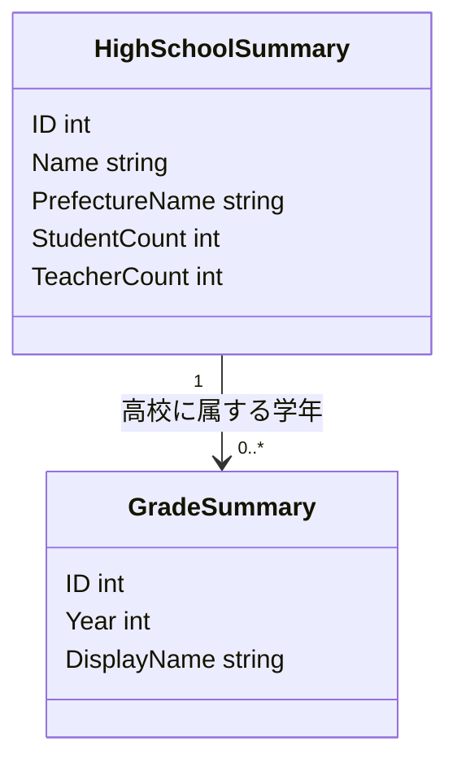
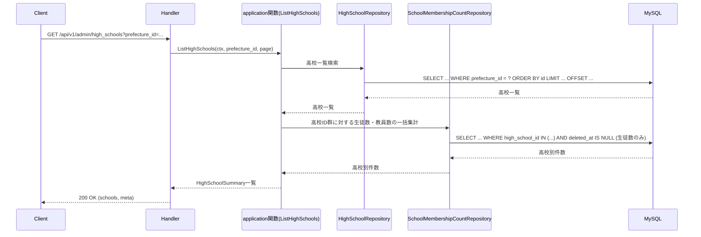

# 管理者高校学年参照機能 Go移行・設計仕様書

---

# 1. 機能概要

## 機能概要

管理者が高校と学年の一覧・詳細を参照するための機能である。Rails現行仕様では高校一覧（生徒数・教員数の集計付き）、高校詳細（同様の集計付き）、指定高校の学年一覧の3操作を提供する。作成・更新・削除は存在しない、参照専用の機能である。

## 利用者

- `admin` ロールのユーザー（管理者）
- すべての高校・学年を参照可能（自校スコープ等の制限はない）

## 業務上の目的

- 管理者がシステム全体の高校・学年構成を俯瞰できるようにする
- 高校ごとの生徒数・教員数を集計して運用状況を把握できるようにする
- 高校配下の学年一覧を参照し、他機能（教員管理・学年参照）への入口とする

---

# 2. 設計方針

本機能は作成・更新・削除を一切持たない参照専用機能である。業務ルールと呼べるものは「都道府県での絞り込み」と「生徒数集計における退会済み生徒の除外」の2点であり、主たる処理は「高校・学年データの取得」と「生徒数・教員数の集計」という手続き的な処理である。Go移行にあたっては、過剰な抽象化を避け、シンプルな読み取り処理として設計する。

- 責務分離: HTTP・入力パラメータの解釈・集計処理・永続化アクセスを分離する
- 保守性: 集計ロジック（生徒数・教員数のカウント、退会済み生徒の除外条件）を再利用可能な形で1箇所に集約する
- テスト容易性: 集計結果の正しさをユースケース単位で検証できるようにする
- 拡張性: 将来的に集計対象（例: クラス数等）が増えても、参照処理の構造に大きな変更を要しないようにする
- API互換性: 既存フロントエンドとの整合を保つため、エンドポイントとレスポンス構造は維持する

---

# 3. Bounded Context

## Context名

- school-directory（学校ディレクトリ参照コンテキスト）

## Contextの責務

- 高校の一覧・詳細参照（都道府県絞り込み、ページング含む）
- 高校ごとの生徒数・教員数の集計（生徒数は在籍中のユーザーのみを対象とする）
- 高校配下の学年一覧参照

## 他Contextとの依存関係

- User/Account Context: 生徒数・教員数の集計のため、ユーザーの高校所属情報・ロール情報・在籍状態（退会済みかどうか）を参照する
- （Prefecture情報は高校の属性として同一Context内で扱う。都道府県マスタが独立した業務ドメインを持たないため）

## 依存する理由

生徒数・教員数の集計は本Contextが所有するデータではなく、User Contextが管理するアカウント情報に基づく。この参照は単純な集計目的のみであり、User Context側の業務ルール（作成・更新等）には関与しないため、読み取り専用の依存とする。生徒の在籍状態（退会済みかどうか）もUser Contextが真正な情報源であり、本Contextはそれを集計条件として参照するのみである。

---

# 4. 設計パターン

## 採用パターン

Transaction Script

## 判断根拠

本機能は完全に参照専用であり、以下の理由からTransaction Scriptが最も自然である。

- ドメインロジックの複雑さ: 業務ルールは「都道府県で絞り込む」「生徒数集計時に退会済みを除外する」程度であり、複雑な判断ロジックが存在しない
- 状態管理の有無: 高校・学年ともに、本機能の文脈では状態を持たない（作成・更新・削除がなく、状態遷移という概念自体が存在しない）
- 業務ルールの複雑さ: 生徒数・教員数の集計は「対象高校に属する在籍中のユーザーをロール別にカウントする」という単純な手続きであり、Entityに振る舞いを持たせる意義が薄い
- 将来の拡張性: 集計項目が増えても、application層の関数内の手続きを追加するだけで対応でき、Entityの構造変更を要さない
- テスト容易性: 手続きが単純であるため、関数単位のテストで十分に品質を担保できる

参照専用機能に対してDomain ModelやActive Recordのような永続化・振る舞いを重視した設計を適用すると、実体のない抽象化（状態を持たないEntityに責務を持たせる等）を生みやすく、かえって保守性を下げる。そのため、業務手続きをそのままユースケースとして表現するTransaction Scriptを採用する。

## 採用しなかったパターン

### Active Record

- 作成・更新・削除が存在せず、永続化に伴う振る舞いを持たせる必要がないため
- 集計処理（生徒数・教員数）はHighSchoolモデル自体の責務というより、複数テーブルにまたがる問い合わせであり、Active Record的な自己完結性と噛み合わない

### Domain Model

- 状態を持たない参照データに対して振る舞いを集約するメリットがなく、設計コストに見合わない
- 業務ルールが単純な絞り込み・除外条件のみであり、Entityへの責務集約が過剰である

### Event Sourcing

- 参照専用機能であり、状態変化そのものが存在しないため、そもそも適用対象にならない

---

# 5. Aggregate設計

本機能ではAggregateを設計しない。

理由: Aggregateは複数Entityの整合性を保証するための境界であるが、本機能は参照専用であり、更新に伴う整合性維持という概念自体が存在しない。高校・学年・集計値はいずれも読み取り時にその場で構成されるデータであり、永続化上の整合性単位を設ける必要がない。

---

# 6. Entity設計

本機能では新たに管理すべきEntityを設計しない。高校・学年は他機能（教員管理・生徒管理等）が所有するデータを参照するのみであり、本機能固有の状態やライフサイクルを持たない。

## HighSchoolSummary（参照用の構成データ）

- 役割: 一覧・詳細表示のために、高校情報と生徒数・教員数を組み合わせた参照用データ
- ライフサイクル: リクエストごとに構成され、永続化されない
- 状態変化: なし
- 保持する責務: 表示に必要な情報を保持するのみで、業務ルールは持たない
- 判断根拠: Entityというより、UseCaseの出力として組み立てられるRead Model（値の集合）として扱う方が実態に即しているため

## GradeSummary（参照用の構成データ）

- 役割: 指定高校に属する学年一覧を表示するための参照用データ
- 判断根拠: HighSchoolSummaryと同様、永続化・状態を持たない値の集合であるため

---

# 7. Value Object設計

本機能では新たなValue Objectを設計しない。

理由: `prefecture_id` による絞り込みやページングパラメータは、単純なプリミティブ値（あるいはUseCase入力パラメータ）として扱えば十分であり、独自の業務ルールや不変条件を持たない。生徒数・教員数もカウント結果としての整数値であり、Value Object化による恩恵（不正値の防止・振る舞いの付与）がほぼない。生徒数集計における「在籍中（退会済みでない）」という絞り込み条件も、検索条件（クエリ条件）として扱えば十分であり、値としての独自ルールを持つ概念ではないため、Value Object化は行わない。

---

# 8. Domain Service

本機能ではDomain Serviceを設計しない。

理由: 生徒数・教員数の集計は業務ルールの判定ではなく、単なる問い合わせ（クエリ）である。「生徒数集計から退会済みを除外する」という業務ルールも、対象データを絞り込む検索条件の一部であり、複数Entity・複数業務ルールにまたがる判断ロジックではない。Domain Serviceは複数Entity・複数業務ルールにまたがる判断ロジックを表現するためのものであり、本機能のような単純集計にはUseCase内の手続きとして直接記述する方が明快である。

---

# 9. クラス図

本機能はTransaction Script採用であり、整理すべきEntity関係も単純（HighSchoolSummary/GradeSummaryが集計結果を保持するのみ）なため、詳細なクラス図は省略し、構成要素の関係を簡略図として示す。

---

# 10. 状態遷移図

本機能では省略する。

理由: 高校・学年・集計値のいずれも、本機能内で状態を変更する操作を持たない参照専用データであるため。

---

# 11. Repository設計

**実装上の位置づけ**: 本機能はTransaction Script採用のため、Repository Interfaceをdomain層に定義しない。以下は永続化・検索責務の設計意図であり、実装時はinfrastructure層の関数として直接実装する(規約: アーキテクチャ規約.md「3. 設計パターンごとの構造適用方針」)。

## HighSchoolRepository

- 管理対象: HighSchool
- 責務:
  - 都道府県絞り込み・ページング付きの高校一覧取得
  - 指定IDの高校詳細取得
- 保持する検索機能:
  - `prefecture_id` による絞り込み
  - `id` 昇順のデフォルト並び替え
  - ページング（1ページ20件）
- 保持しない責務:
  - 生徒数・教員数の集計
- 判断根拠: 高校データそのものの取得に特化させ、集計処理とは責務を分けるため

## GradeRepository

- 管理対象: Grade
- 責務:
  - 指定高校に属する学年一覧取得（`year` 昇順）
- 保持する検索機能:
  - `high_school_id` による絞り込み
- 保持しない責務:
  - なし（参照のみのシンプルな責務）
- 判断根拠: 学年データの取得に特化させるため

## SchoolMembershipCountRepository

- 管理対象: User（生徒・教員としての集計）
- 責務:
  - 指定高校群に属する在籍中の生徒数の集計（高校IDごと）
  - 指定高校群に属する教員数の集計（高校IDごと）
- 保持する検索機能:
  - 複数高校IDをまとめて渡した一括集計（N+1回避のため）
  - 生徒数集計時の在籍状態フィルタ（`deleted_at`が設定されていない、すなわち退会済みでないユーザーのみを対象とする）
- 保持しない責務:
  - ユーザーそのものの作成・更新
  - 退会（論理削除）の実行そのもの（退会処理は本機能のスコープ外であり、他機能の責務）
- 判断根拠: 集計というクエリ責務をUser永続化の責務から分離し、参照機能側の都合で最適化（一括集計等）できるようにするため。Rails現行仕様（`User.students.active.by_high_school`）が示すとおり、生徒数の集計は在籍中（退会していない）のユーザーのみを対象とするという業務ルールが存在する一方、教員数の集計には同様の在籍状態フィルタが適用されない。このロールごとの非対称な絞り込みルールを検索条件として明示的に設計へ反映する

---

# 12. UseCase設計

**実装上の位置づけ**: 本機能はTransaction Script採用のため、UseCase層(struct)を設けない。以下は業務操作の設計意図であり、実装時はapplication層の関数として直接実装する。

## ListHighSchools

- 目的: 都道府県絞り込み・ページングを適用した高校一覧を、生徒数・教員数付きで取得する
- 入力: current admin, prefecture_id, page
- 出力: 高校一覧（生徒数・教員数含む）とページ情報
- トランザクション範囲: 読み取りのみ、トランザクションは不要
- 呼び出す関数:
  - 高校一覧検索関数
  - 高校別生徒数（在籍中のみ）・教員数集計関数
- 判断根拠: 一覧取得後にまとめて集計を行うことで、高校ごとに逐次問い合わせるより効率的に処理できるため

## ShowHighSchool

- 目的: 指定高校の詳細を、生徒数・教員数付きで取得する
- 入力: current admin, high_school_id
- 出力: 高校詳細情報
- トランザクション範囲: 読み取りのみ
- 呼び出す関数:
  - 高校詳細取得関数
  - 高校別生徒数（在籍中のみ）・教員数集計関数
- 判断根拠: 詳細取得でも一覧と同じ集計処理を再利用するため

## ListGrades

- 目的: 指定高校に属する学年一覧を取得する
- 入力: current admin, high_school_id
- 出力: 学年一覧
- トランザクション範囲: 読み取りのみ
- 呼び出す関数:
  - 高校存在確認関数
  - 学年一覧取得関数
- 判断根拠: 高校の存在確認を前提としたうえで、学年一覧を取得する単純な処理であるため

---

# 13. シーケンス図・処理フロー図

## シーケンス図

## 処理フロー図

単純な検索条件の組み合わせであり、複雑な条件分岐や状態遷移を伴わないため省略する。

---

# 14. Transaction設計

## Transaction開始位置・終了位置

- 本機能はすべて読み取り専用の処理であり、明示的なトランザクションを使用しない

## 理由

- 更新を伴わない参照処理にトランザクションを設けても保護すべき整合性が存在せず、不要な複雑さを増やすだけであるため
- 基本方針である「関数単位」は維持しつつ、書き込みが発生しない本機能ではトランザクション境界そのものを省略する

---

# 15. Validation設計

## Presentation

- 型チェック: `prefecture_id`, `page`, `high_school_id` の型を検証する
- 必須チェック: `high_school_id` を要求するエンドポイント（学年一覧）でのパス必須性を検証する
- フォーマットチェック: ページ番号が正の整数であることを検証する

## Domain

- 業務ルール: 生徒数集計は在籍中（`deleted_at`が未設定）のユーザーのみを対象とし、退会済みの生徒を除外する。教員数集計にはこの在籍状態フィルタを適用しない
- 状態チェック: 対象高校が存在するかどうかの確認（Application層のエラーとして扱う。詳細は17章）
- 整合性チェック: なし

## バリデーション仕様

|フィールド|検証層|ルール|エラーメッセージ方針|
|-|-|-|-|
|prefecture_id|Presentation|任意項目。指定される場合は整数形式であること|「都道府県IDの形式が不正です」|
|page|Presentation|任意項目。正の整数であること|「ページ番号の形式が不正です」|
|high_school_id|Presentation|必須（学年一覧取得時）。整数形式であること|「高校IDは必須です」|
|生徒数集計対象|Domain|退会済み（`deleted_at`が設定済み）の生徒を集計対象から除外する|（入力エラーではないため該当なし。検索条件として適用）|

## 責務分離

- Presentationは「入力が正しいか（型・形式）」を担当する
- 本機能には業務ルール判定と呼べる処理がほぼ存在しないため、Domain層の役割は「存在確認」と「生徒数集計時の在籍状態フィルタ適用」程度に限定される

---

# 16. Authorization設計

## Middleware

- 認証済みユーザーを特定し、コンテキストに保持する
- 役割がadminであることを確認する

## Handler

- ルーティング層でAPIの入口を担当する
- パスパラメータ（`high_school_id` 等）を受け渡す

## UseCase

- 追加のスコープ制限は行わない（管理者はすべての高校・学年を参照可能なため）

## Domain

- 参照専用のため、Domain層での認可判定は発生しない

## 判断理由

本機能は「adminロールであること」以外に権限制御が存在しない（全高校・全学年が参照可能）。したがって認可はMiddlewareでのロール確認のみに限定し、application関数・Domainには認可責務を持たせない。これにより、権限制御が単純な機能に対して過剰な認可レイヤーを設けることを避ける。

---

# 17. Error設計

## Domain Error

- 責務: 本機能では業務ルール違反そのものが存在しないため、Domain Errorは定義しない
- 判断理由: 参照専用機能であり、ドメインルール違反という概念が発生しないため

## Application Error

- 責務: ユースケース実行時の失敗を表現する
- 例: 対象高校未存在（一覧・詳細・学年一覧すべてに共通し得る）
- 判断理由: 存在確認の失敗をHTTPレスポンス（404）に変換しやすくするため

## Infrastructure Error

- 責務: DB接続失敗・集計クエリ失敗を表現する
- 判断理由: 技術的な障害を業務エラーと切り分けるため

## エラー仕様

|業務シナリオ|エラー種別|発生層|想定するHTTPステータス|
|-|-|-|-|
|対象高校が存在しない|Application Error|application関数|404|
|集計クエリの実行に失敗する|Infrastructure Error|Infrastructure|500|

---

# 18. Domain Event

本機能ではDomain Eventを採用しない。理由は、参照専用機能であり、そもそも状態変化が発生しないため、イベントとして発行すべき「何かが起きた」という事実が存在しないためである。

---

# 19. API仕様

## エンドポイント一覧

|エンドポイント|HTTP Method|概要|
|-|-|-|
|/api/v1/admin/high_schools|GET|高校一覧を取得|
|/api/v1/admin/high_schools/:id|GET|高校詳細を取得|
|/api/v1/admin/high_schools/:high_school_id/grades|GET|高校の学年一覧を取得|

## 各エンドポイントの仕様

### GET /api/v1/admin/high_schools

- Request: `prefecture_id`（任意）, `page`（任意）
- Response: `schools`（各高校の `id`, `name`, `prefecture_name`, `student_count`, `teacher_count`）+ `meta`（`current_page`, `total_pages`, `total_count`, `per_page`）
- Status Code: 200（取得成功）
- Error Response方針: 既存のエラー形式を踏襲する

### GET /api/v1/admin/high_schools/:id

- Request: `id`（必須、パスパラメータ）
- Response: `id`, `name`, `prefecture_name`, `student_count`, `teacher_count`
- Status Code: 200（取得成功）、404（対象高校不存在）
- Error Response方針: 既存のエラー形式を踏襲する

### GET /api/v1/admin/high_schools/:high_school_id/grades

- Request: `high_school_id`（必須、パスパラメータ）
- Response: 各学年の `id`, `year`, `display_name`
- Status Code: 200（取得成功）、404（対象高校不存在）
- Error Response方針: 既存のエラー形式を踏襲する

## Railsとの差分

差分なし。Rails現行仕様のエンドポイント・レスポンス構造をそのまま維持する。生徒数集計における退会済み除外というRails現行仕様の業務ルールも、レスポンス値（`student_count`）としては同一の結果になるよう維持する。

---

# 20. DB設計方針

## 現行DBを利用するか

- 既存Rails DBを継続利用する

## Schema変更有無

- 変更なし

## 変更理由

- `high_schools`, `grades`, `users` の既存カラムのみで、一覧・詳細・集計・学年参照のすべてを満たしており、追加スキーマは不要である
- 参照専用機能であり、業務要件が変わらない限りスキーマ変更の動機がない

---

# 21. DB操作仕様

## HighSchoolRepository

- 対象テーブル: high_schools（prefecturesとの結合を含む）
- 操作種別: 参照
- 主な検索条件・絞り込み条件: `prefecture_id`による絞り込み（任意）
- 関連テーブルとの結合: prefecturesと結合し、`prefecture_name`を取得する
- ページネーション・ソート: `id`昇順、1ページ20件のページネーションを行う

## GradeRepository

- 対象テーブル: grades
- 操作種別: 参照
- 主な検索条件・絞り込み条件: `high_school_id`による絞り込み
- 関連テーブルとの結合: 不要
- ページネーション・ソート: `year`昇順。ページネーションは不要

## SchoolMembershipCountRepository

- 対象テーブル: users（user_rolesとの結合を含む）
- 操作種別: 参照（集計）
- 主な検索条件・絞り込み条件:
  - `high_school_id IN (...)`による対象高校群の一括絞り込み
  - 生徒数集計時のみ`deleted_at IS NULL`（在籍中）を追加条件として適用し、退会済みの生徒を除外する
  - 教員数集計には在籍状態の条件を適用しない
- 関連テーブルとの結合: user_rolesと結合し、生徒・教員のロールで絞り込む
- ページネーション・ソート: 不要（高校IDごとの集計結果を返す）

---

# 22. テスト戦略

## Domain Test

- 目的: 本機能には業務ルール判定がほぼ存在しないため、Domain Testは最小限（存在確認等の単純な分岐のみ）に留める

## UseCase Test

- 目的: ListHighSchools / ShowHighSchool / ListGradesが、絞り込み・ページング・集計を正しく組み合わせて結果を返すことを検証する。特にShowHighSchool・ListHighSchoolsでは、退会済みの生徒が生徒数集計から除外されることを重点的に検証する

## Repository Test

- 目的: HighSchoolRepository・GradeRepository・SchoolMembershipCountRepositoryによる検索・集計クエリの正確性を検証する。SchoolMembershipCountRepositoryでは、生徒数集計に在籍状態フィルタが適用され、教員数集計には適用されないという非対称なルールを重点的に検証する

## Handler Test

- 目的: クエリパラメータの解釈とHTTPステータスの変換を検証する

## Integration Test

- 目的: エンドポイント経由で一覧・詳細・学年一覧が正しいレスポンス構造で返却されることを確認する

---

# 23. Railsとの責務対応

| Rails | Go | 設計方針 |
|---|---|---|
| Controller（`HighSchoolsController`, `GradesController`） | Handler | HTTP入出力の受け取りとレスポンス整形に限定する |
| Controller内の集計処理（`User.students.active.by_high_school` 等） | application関数 + SchoolMembershipCountRepository | 集計手続きと在籍状態フィルタをRepositoryの検索条件として切り出す（Transaction Script採用のためusecase層は設けない） |
| Serializer | Response DTO | レスポンス整形をPresentation層に分離する |
| Model（`HighSchool`, `Grade`, `User`） | Repository（参照専用） | 本機能では振る舞いを持たない参照データとして扱う |

---

# 24. 採用しなかった設計

## Domain Model

- 採用しなかった理由: 状態を持たない参照専用データに振る舞いを持たせる必要がないため
- 将来的に採用する可能性: 高校・学年に対する編集機能が本機能に統合された場合は再検討する（ただし編集は別機能として現行仕様でも分離されている）

## Active Record

- 採用しなかった理由: 作成・更新・削除がなく、永続化を伴う振る舞いを持たせる意義がないため
- 将来的に採用する可能性: 低い（本機能の性質上、今後も参照専用であり続ける可能性が高い）

## Event Sourcing

- 採用しなかった理由: 状態変化自体が存在しないため、そもそも適用対象にならない
- 将来的に採用する可能性: なし

---

# 25. 設計判断サマリー

|項目|採用|判断理由|
|-|-|-|
|設計パターン|Transaction Script|参照専用で業務ルールが単純な絞り込み・集計のみのため|
|Aggregate|未設計|更新を伴わず整合性単位を必要としないため|
|Transaction境界|未使用（読み取りのみ）|保護すべき整合性が存在しないため|
|Domain Event|未採用|状態変化自体が発生しないため|
|Value Object|未採用|独自の業務ルール・不変条件を持つ値が存在しないため|
|Authorization|Middleware（ロール確認のみ）|全高校・全学年が参照可能で、業務レベルのスコープ制御が不要なため|
|生徒数集計|在籍中のみを対象（退会済み除外）|Rails現行仕様の業務ルールを維持し、実運用の在籍者数と一致させるため|

---

# 設計差分管理

## Rails現行仕様

- ControllerがActiveRecordのクエリ（`includes`, `by_prefecture`, `by_high_school` 等）を直接組み立て、集計処理もController内で完結している
- 生徒数集計は`User.students.active.by_high_school`というスコープの組み合わせにより、退会済みの生徒を暗黙的に除外している

## Go設計での変更内容

- 集計処理（生徒数・教員数）をapplication関数に移し、複数高校をまとめて集計するSchoolMembershipCountRepositoryとして責務を明示する
- 高校の存在確認をApplication Errorとして明示的に扱う
- 「生徒数集計から退会済みを除外する」という業務ルールを、SchoolMembershipCountRepositoryの検索条件として明示的に設計へ反映する

## 変更理由

- ControllerにActiveRecordのクエリを直接書く構造をそのままGoに持ち込むと、HandlerがDBアクセスの詳細を知ってしまい、責務が混在するため
- 集計処理を独立した責務として切り出すことで、将来的に集計項目が増えた場合も影響範囲を限定できるため
- Railsのスコープ名（`active`）に暗黙的に埋め込まれていた業務ルールを、Go側では検索条件として明示することで、実装時の見落とし（退会済み生徒を集計に含めてしまう等）を防ぐため

## 影響範囲

- フロントエンドから見たAPIの外部仕様（エンドポイント・レスポンス構造）は維持するため、影響はない
- 既存DBスキーマは維持するため、データ移行やマイグレーションの追加は不要
