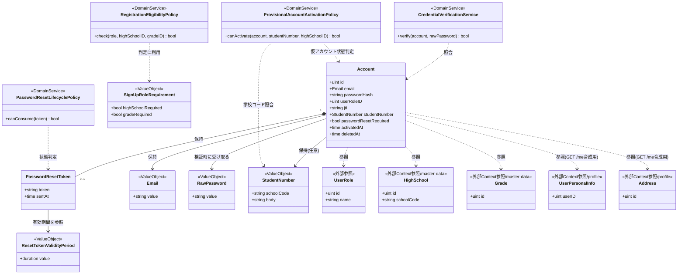
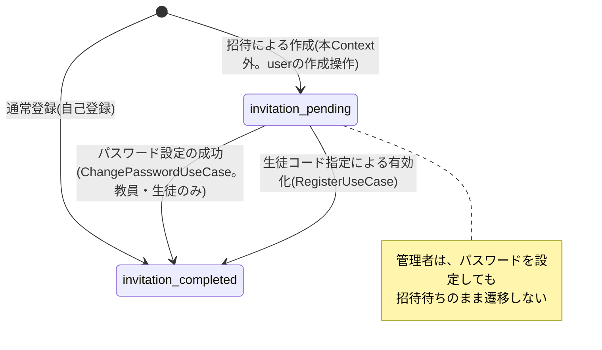
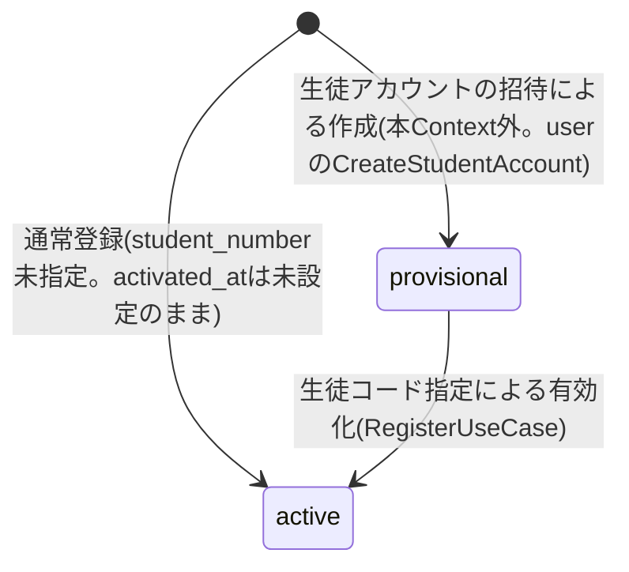
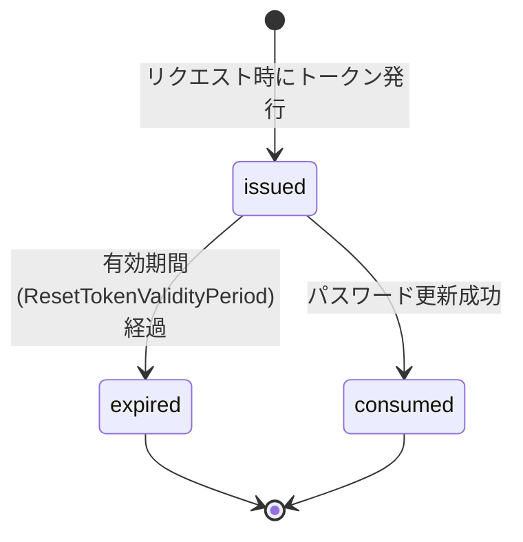
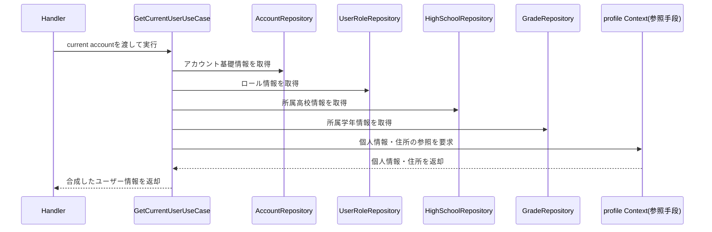

# 認証機能 Go移行・設計仕様書

---

# 1. 機能概要

## 機能概要

ユーザーのログイン・ログアウト・新規登録・パスワードリセット・ログイン中ユーザー自身の基礎情報取得（`GET /api/v1/me`）を提供し、認証状態を管理する機能である。Rails現行仕様ではDevise + JWTを用い、JWTをHTTP Only Cookieでクライアントに渡す。ログアウト時は `jti`（JWT識別子）を更新することでトークンを無効化する。新規登録ではロール（student/teacher/admin）に応じて必須項目が異なるほか、生徒が学校発行の生徒コード（`student_number`）を入力した場合は、新規アカウントを作成する代わりに、学校側で事前に作成済みの仮アカウント（生徒CSVインポート機能により登録されたもの）を本人のものとして有効化する分岐を持つ。パスワードリセットはトークンの発行・検証・消費という一連の状態を伴い、対象ユーザーの検索は退会（論理削除）済みユーザーを除外して行う。

`GET /api/v1/me` はログイン中ユーザー自身の基礎情報（本人確認情報・個人情報・所属高校・住所・学年をまとめたもの）を返す参照エンドポイントであり、本機能のAPI仕様に含まれる。ただし、この情報のうち氏名・個人情報・住所そのものの更新（`PATCH /api/v1/profile`）は別Context「profile」（プロフィール管理機能）の責務であり、本機能は資格情報・セッション状態・登録要件の管理に責務を限定する。

アカウントの作成のうち、招待による作成（生徒・教員・管理者。仮パスワードの発行・招待待ちの初期状態・招待メールの送信依頼）は`user` Contextの責務であり、本機能は招待による作成の起点ではない。本機能が`users`の行を作るのは、本人による自己登録（サインアップ）のみである。一方、招待メールのリンクからのパスワード設定は、パスワードリセットと同じトークンの消費として本機能が受け付け、設定に成功した教員・生徒を招待待ちから招待完了へ遷移させる（管理者は遷移しない）。

## 利用者

- `student` / `teacher` / `admin` ロールのユーザー（全ロール共通の入口機能）

## 業務上の目的

- メールアドレスとパスワードによる認証を提供する
- 認証済みセッションをJWT（Cookie）で表現し、ログアウト時に確実に無効化する
- ロールに応じた新規登録の整合性（高校・学年の必須性等）を保証する
- 生徒コード指定時、学校側で事前登録された仮アカウントを本人のものとして安全に有効化する
- パスワードリセットにおいて、トークンの有効期限とセキュリティ（ユーザー存在の非開示、退会済みユーザーの除外）を両立する
- パスワードを設定・変更した教員・生徒を招待完了の状態にする（招待メールのリンクからの初回設定を含む。管理者は招待待ちのまま変わらない）
- ログイン中ユーザー自身の基礎情報を、認証済みセッションから一貫して参照できるようにする

---

# 2. 設計方針

認証機能は他の管理系機能と異なり、「データの永続化」そのものよりも「セキュリティ上の状態（セッション有効性・リセットトークンの有効性・仮アカウントの有効化状態）をどう安全に管理するか」が設計の中心となる。したがって、単純なCRUDとしてではなく、状態遷移と業務ルールをEntityに集約する設計とする。

- 責務分離: HTTP・入力検証・認証判定・トークン発行・永続化を分離する
- 状態管理の明確化: セッションの有効性（`jti`）、パスワードリセットトークンの有効性（発行・期限・消費）、仮アカウントの有効化状態（未有効化→有効化済み）を、ドメイン層で一貫して表現する
- Context境界の明確化: 本人確認・アカウント基礎情報の参照（本Context）と、プロフィール項目（氏名・個人情報・住所）の更新（profile Context）、および招待によるアカウント作成（`user` Context）を分離し、責務の混在を避ける。本Contextが担うのは資格情報・セッション・パスワードリセットのトークンと、自己登録による作成である
- セキュリティ: パスワード照合や資格情報の失敗を、ユーザー列挙攻撃を防ぐ形でハンドリングする（現行仕様の「例外発生時も同じメッセージを返す」という方針、および退会済みユーザーをリセット対象から除外する方針を踏襲する）
- テスト容易性: トークンの有効期限判定・ロール別の登録要件判定・仮アカウントの有効化可否判定を、DBやハッシュ関数の実装に依存せずテストできるようにする
- 拡張性: 将来的なログイン試行回数によるロックアウトや多要素認証の追加に備え、認証状態を扱う責務をEntityとDomain Serviceに閉じ込めておく
- API互換性: 既存フロントエンドとの整合を保つため、エンドポイント・Cookie仕様・レスポンス構造は維持する

---

# 3. Bounded Context

## Context名

- authentication（認証コンテキスト）

## Contextの責務

- メールアドレス・パスワードによる資格情報の検証
- セッション（JWT）の発行と無効化（ログイン／ログアウト）
- 本人による自己登録（サインアップ）でのロールに応じた新規アカウント作成の受付（登録の入口としての整合性検証）。招待による作成は含まない
- 生徒コード指定時の仮アカウント有効化（学校側で事前登録済みのアカウントを本人のものとして有効化する）
- パスワードリセットトークンの発行・検証・消費（退会済みユーザーを対象から除外する）
- パスワードの設定・変更に成功したときの、招待待ちから招待完了への遷移（教員・生徒のみ。招待メールのリンクからの初回設定を含む）
- ログイン中ユーザー自身の基礎情報（本人確認情報＋参照可能な関連情報）の取得（`GET /api/v1/me`）

## 本Contextが持たない責務

|責務|担当|理由|
|-|-|-|
|招待による生徒・教員・管理者アカウントの作成（仮パスワードの発行・招待待ちの初期状態・生徒番号の発行）と、招待メールの送信依頼|`user`|`user`②が、生徒・教員・管理者アカウントの作成と招待メールの送信依頼を`user` Contextの責務と定めているため（`user`②「3. Bounded Context」）|
|プロフィール項目（氏名・個人情報・住所）の更新|`profile`|プロフィール②が定めているため|

## 他Contextとの依存関係

- user Context: 生徒・教員・管理者アカウントの招待による作成は`user` Contextの責務であり、認証コンテキストは招待による作成の起点ではない。認証コンテキストが`users`に行を作るのは、本人による自己登録（サインアップ）のみである。認証コンテキストが担うのは、アカウントの資格情報（メールアドレス・パスワードハッシュ・`jti`）・セッション・パスワードリセットのトークンである。招待メールのリンクは、認証コンテキストの`ChangePasswordUseCase`が消費する。`user` Contextが、仮パスワードのハッシュ化とパスワード設定用トークンの発行のために認証コンテキストを呼ぶ形は、`user`②の未解決の論点3であり、本書では定めない。依存の向きは`user`→`authentication`の一方向とし、認証コンテキストは`user` Contextを参照しない
- profile Context: `GET /api/v1/me` のレスポンスに含まれる個人情報（電話番号・生年月日・性別）・住所は、profile Contextが所有・更新するデータを参照専用で組み込む。これらの項目の更新（`PATCH /api/v1/profile`）はprofile Contextの責務であり、認証コンテキストは行わない。認証コンテキストが保持するのはあくまで資格情報・セッション状態・（登録時に設定される）所属高校・学年であり、氏名・個人情報・住所の真正な所有者ではない
- HighSchool Context / Grade Context（master-data）: 生徒・教員としての登録時に、指定された高校・学年が実在するかの確認に依存する。生徒コードによる仮アカウント有効化時も、仮アカウントの学校コードと選択高校の整合確認のために高校情報を参照する
- 生徒CSVインポート機能（教師による生徒アカウント一括登録）: 新規登録時にstudent_numberが指定された場合に有効化する仮アカウントは、認証コンテキストではなく、`user` Contextの`CreateStudentAccount`（生徒CSVインポート・教師による生徒の単体登録が呼ぶ）によって事前に作成される。認証コンテキストはこの仮アカウントを検索し有効化する側であり、仮アカウントの作成自体には関与しない
- アカウント連携機能（別Context・別仕様書）: 生徒コード（`student_number`）によって仮アカウントを特定し、学籍情報を引き継ぐという概念は、認証済みユーザーが追加の仮アカウントを統合する「アカウント連携機能」Contextとも共通する関心事である。ただし、本機能の有効化フローは「新規登録（未認証状態）における仮アカウントの本人による有効化」であり、アカウント連携機能Contextの処理は「認証済みアカウントへの学籍情報統合」であるため、業務フローとしては別処理として扱う。アカウント連携機能自体は別Context・別仕様書であるため、本書では両者が生徒コードによる仮アカウント特定という概念を共有している連携点のみを言及し、アカウント連携機能側の詳細設計（統合可否判定・監査ログ等）は扱わない。将来的に生徒コードの解析・照合ロジックを共有Domain Serviceとして切り出す余地はある（推測）
- Notification Context（メール送信基盤）: パスワードリセットメール、および仮アカウント有効化完了メールの送信という非同期処理に依存する

## 依存する理由

認証コンテキストは「本人確認とセッション・トークン・仮アカウント有効化状態の管理」に責務を限定する。アカウントの詳細プロフィール（個人情報・住所等）や高校・学年そのものの実在性は、それぞれの責務を持つ別Contextに委ねることで、認証ロジックの変更が他業務領域に波及しないようにする。一方で、本人による自己登録時のアカウント生成、および生徒コードによる仮アカウントの有効化は認証コンテキストが担う入口処理であるため、これらの経路と、資格情報（パスワードハッシュ・`jti`・リセットトークン）の更新については、認証コンテキストが起点となる。招待による生徒・教員・管理者アカウントの作成は`user` Contextが担い、認証コンテキストは起点ではない。`GET /api/v1/me` は本人確認済みセッションから参照する入口であるため認証コンテキストに置くが、参照する個人情報・住所の実体はprofile Contextから取得する。

---

# 4. 設計パターン

## 採用パターン

Domain Model

## 判断根拠

認証機能は、単なるデータの保存・参照ではなく、「セキュリティ上の状態をどう安全に遷移させるか」が本質であり、以下の理由からDomain Modelを採用する。

- Entityが状態を持つ: アカウントは `jti`（現在有効なセッション識別子）という状態を持ち、ログアウト時にこれを更新することで、発行済みの全JWTを一括で無効化する。パスワードリセットトークンも「未発行→発行済み・有効→期限切れ／消費済み」という状態を持つ。加えて、生徒コードによる登録対象の仮アカウントは「仮登録（未有効化）→有効化済み」という状態を持つ
- 状態遷移ルールが存在する: ログアウトによる `jti` のローテーション、パスワードリセット成功によるトークンの消費（クリア）、仮アカウントの有効化（`activated_at` の設定と入力内容での上書き）は、単純な代入ではなく「現在の状態を踏まえた遷移」として扱う必要がある
- 複数の業務ルールがEntityに関連する: パスワード照合、ロール別の登録要件（学生・教員は高校・学年必須、管理者は不要）、リセットトークンの有効期限判定、仮アカウント有効化時の学校コード整合性判定、リセット対象検索における退会済みユーザーの除外など、複数の業務ルールが資格情報・トークン・仮アカウントという概念に結びついている
- 将来の拡張性: ログイン失敗回数によるロックアウト、多要素認証、リフレッシュトークンといった拡張が想定される領域であり（推測。現行仕様には実装されていないが、認証機能は一般的にセキュリティ要件が段階的に強化されやすい）、状態と業務ルールをEntityに集約しておくことで変更の影響範囲を限定できる
- テスト容易性: 「トークンが有効期限内か」「パスワードが一致するか」「仮アカウントが有効化可能な状態か」といった判定は、外部I/O（DB・時刻取得）を注入可能な形にすれば、純粋なロジックとして高速にテストできる

これらの理由から、単純なActive RecordやTransaction Scriptでは表現しきれない「認証状態の安全な管理」をEntity・Domain Serviceに集約するDomain Modelを採用する。

## 採用しなかったパターン

### Transaction Script

- パスワード照合・トークン有効期限判定・ロール別登録要件・仮アカウント有効化判定といった業務ルールが複数のユースケース（ログイン、登録、リセット系3操作）にまたがって再利用されるため、手続きに埋め込むと重複・実装漏れのリスクが高い
- セキュリティに関わるロジックが手続きに分散すると、レビュー・監査が困難になる

### Active Record

- 認証状態（`jti`、リセットトークンの有効性、仮アカウントの有効化状態）の遷移は、単なる属性更新ではなく「現在の状態を踏まえた判断」を伴うため、永続化中心の設計では業務ルールが薄まりやすい
- パスワードハッシュの照合など、セキュリティ上重要な処理をモデルの属性操作として扱うと、誤用（検証を経ない直接更新等）のリスクが増える

### Event Sourcing

- 認証状態の変更履歴（誰がいつログインしたか等）を再構築する要件は現行仕様に明記されていない
- 現時点でイベントストアを用いた再構築の必要性がなく、過剰な設計である。ただし、将来的に不正アクセス検知やセキュリティ監査ログの要件が明確になった場合は、ログイン・ログアウト・仮アカウント有効化等の重要イベントに限定して部分的に採用する余地はある

---

# 5. Aggregate設計

## Aggregate Root

- Account（認証コンテキストが扱う `User` の認証関連スライス）

## Aggregateに含めるEntity

- Account（メールアドレス・パスワードハッシュ・ロール・`jti`・生徒コード・仮アカウント有効化状態を保持する）
- PasswordResetToken（Accountに従属する、リセットトークンの状態を表す概念）

## Aggregate境界

- Accountが自身の資格情報（パスワード）・セッション状態（`jti`）・パスワードリセット状態・仮アカウントの有効化状態の整合性を保つ単位とする
- ロール（UserRole）・高校（HighSchool）・学年（Grade）はAggregateの外部参照とし、登録時・仮アカウント有効化時の妥当性検証のための制約条件として利用する
- プロフィール情報（氏名・個人情報・住所等）は認証コンテキストのAggregateには含めない。認証コンテキストは資格情報とセッション状態の管理に責務を限定する。ただし `GET /api/v1/me` のレスポンス合成のためにUserPersonalInfo・Addressを参照する必要があり、これらは他Context（profile）が所有する外部参照として扱う（「6. Entity設計」で詳述する）
- 所属高校（`high_school_id`）・学年（`grade_id`）は、Accountのカラムとして登録時（および仮アカウント有効化時）に認証コンテキストが書き込む対象であり、profile Contextの更新対象ではない

## 整合性を保証する単位

- ログアウト時、`jti` の更新とCookie削除の指示は1つの業務操作として扱う（Cookie削除自体はPresentation層の責務だが、`jti` 更新はAccount側で完結させる）
- パスワードリセット実行時、パスワードハッシュの更新とリセットトークンの消費（クリア）、および教員・生徒の場合の招待待ちの解消（`password_reset_required` を偽にする）を1トランザクションで行う
- 仮アカウント有効化時、対象アカウントの入力内容での更新と `activated_at` の設定を1トランザクションで行う

理由: `jti` の更新・トークン消費・招待待ちの解消・仮アカウントの有効化は、いずれも「これ以降、古い状態を無効なものとして扱う、または新たな確定状態へ移行する」というセキュリティ上不可分な操作であり、途中状態が残ることを許容できないため。

---

# 6. Entity設計

## Account

- 役割: 認証の対象となるユーザーの資格情報とセッション状態を表す中心的な概念
- ライフサイクル:
  - 通常登録の場合（本人による自己登録）: 登録（作成） → ログイン（資格情報検証） → ログアウト（セッション無効化） → パスワードリセット（資格情報更新）の繰り返し
  - 招待による作成の場合: 作成（本Context外。`user` Contextの作成操作。招待待ちで作成される） → パスワード設定（本Contextの `ChangePasswordUseCase`。教員・生徒は招待完了に遷移する） → 以降は通常登録と同じライフサイクルに合流する
  - 生徒コード指定の場合: 仮登録（本Context外。`user` Contextの `CreateStudentAccount` で作成される。生徒CSVインポート・教師による生徒の単体登録） → 有効化（本Contextの新規登録処理で、入力内容による更新と `activated_at` の設定） → 以降は通常登録と同じライフサイクルに合流する
- 状態変化:
  - `jti`: セッションが有効な間は不変、ログアウト時にローテーションされ、それ以前に発行された全JWTが無効になる
  - パスワード（ハッシュ）: パスワードリセット成功時にのみ更新される
  - 招待状態: `password_reset_required` が真の間は「招待待ち」、偽の間は「招待完了」を表す。`user` Contextが招待待ちで作成したアカウントは、パスワードの設定・変更（パスワードリセットの成功。招待メールのリンクからの設定も同じ操作）に成功すると、ロールが教員または生徒の場合のみ招待完了に遷移する。管理者は、パスワードを設定しても招待待ちのまま遷移しない（Rails現行の `Auth::ChangePasswordService` が教員・生徒のみを対象とするため）。生徒コードによる有効化でも `password_reset_required` は偽になる。自己登録で作成されたアカウントは、招待完了の状態で始まる。招待完了から招待待ちへ戻る遷移はない
  - 有効化状態: `password_reset_required` が真かつ `activated_at` が未設定の間は「仮登録」を表し、生徒コードによる有効化処理で `activated_at` が設定されると「有効化済み」に遷移する。仮登録は、招待待ちのうち `activated_at` が未設定のものに当たる。招待メールのリンクからパスワードを設定して招待完了になったアカウントは、`password_reset_required` が偽になるため仮登録ではなくなり、生徒コードによる有効化の対象にならない（Rails現行の `Auth::SignUpService` が、`password_reset_required` が偽のアカウントを「既に有効化されています」として拒否する）
- 保持する責務:
  - 入力された生パスワードと保存済みハッシュを照合する（照合アルゴリズム自体はインフラ層に委譲するが、照合結果の解釈と失敗時の扱いはEntityの責務とする）
  - ログアウト時に `jti` をローテーションし、以前のセッションを無効化する
  - パスワードリセット実行時に新しいパスワードへ更新し、関連するリセットトークンを消費済みにする
  - パスワードの設定に成功したとき、教員・生徒であれば招待待ちを解消して招待完了にする（管理者では解消しない）
  - 自身が「仮登録」状態かどうかを判定し、有効化時に入力内容（氏名・氏名カナ等）で自身を更新する
- 判断根拠: 資格情報とセッション有効性の中心であり、認証機能のすべての操作がAccountの状態参照・変更を伴うため

## PasswordResetToken

- 役割: パスワードリセットの一連の状態（発行・有効・期限切れ・消費済み）を表す概念
- ライフサイクル: 発行（リセットリクエスト時） → 検証（有効性確認） → 消費（パスワード更新完了時）または期限切れ
- 状態変化:
  - 発行直後は「有効」
  - 発行から一定期間が経過すると「期限切れ」
  - パスワード更新に成功すると「消費済み」（Rails現行仕様ではトークン・発行日時をクリアすることで表現される）
- 保持する責務:
  - トークンが現在有効かどうか（期限内かつ未消費）を判定する
  - 消費（クリア）操作を通じて再利用を防ぐ
- 判断根拠: 「トークンが発行されてから消費されるまで」という時間的な状態遷移を持つ概念であり、単なる文字列カラム以上の意味を持つため。Rails側では `users` テーブルに直接カラムとして保持されているが、ドメイン上は独立した状態遷移を持つ概念として扱う方が業務の意味を正確に表現できる

## 外部参照Entity（認証コンテキストが所有しない概念）

- UserRole: 登録時のロール名存在確認に用いる（他Context/共通マスタ相当）
- HighSchool / Grade（master-data Context）: 登録時・仮アカウント有効化時の実在確認、および `GET /api/v1/me` のレスポンス合成に用いる
- UserPersonalInfo / Address（profile Context）: `GET /api/v1/me` のレスポンス合成にのみ用いる参照専用の外部概念であり、認証コンテキストはこれらを作成・更新しない

---

# 7. Value Object設計

## Email

- 採用理由: ログイン・登録・パスワードリセットのすべての操作で共通して用いられ、形式ルールを一貫して適用する必要があるため
- 独自ルール:
  - メールアドレス形式であることを保証する
- Entity属性ではなくValue Objectにする理由: 複数のユースケースで同じ形式検証を再利用し、検証ロジックの重複を避けるため

## RawPassword

- 採用理由: パスワードは「入力された生の値」と「保存されたハッシュ値」で扱いが大きく異なり、混同を防ぐ必要があるため
- 独自ルール:
  - 最小文字数等の登録時ポリシーを表現する（Rails現行仕様に具体的な文字数ルールの明記はないため、既存のDevise標準ポリシーを踏襲する前提とする。推測）
  - 登録・リセット時の確認用パスワードとの一致を検証する
- Entity属性ではなくValue Objectにする理由: 生パスワードをEntityの永続属性として持たせないことを型で保証し、誤ってハッシュ化前の値を保存してしまう事故を防ぐため

## ResetTokenValidityPeriod

- 採用理由: 「発行からどれだけの時間、トークンが有効か」という業務ルールを、PasswordResetTokenの判定ロジックから切り離して明示するため
- 独自ルール:
  - 発行日時から一定期間（Rails現行仕様は `reset_password_period_valid?` に依存しており、具体的な期間は現行仕様書に明記されていないため、Devise標準設定を踏襲する前提とする。推測）を有効期間とする
- Entity属性ではなくValue Objectにする理由: 有効期間という「ルール」を独立させることで、将来的に期間を変更する際の影響範囲をValue Objectの定義箇所のみに限定するため

## SignUpRoleRequirement

- 採用理由: 「student/teacherは高校・学年が必須、adminは不要」というロール別の登録要件を、単一の判定ロジックとして表現するため
- 独自ルール:
  - ロール名に応じて、高校ID・学年IDが必須かどうかを判定する
  - student かつ選択した高校が生徒コード管理対象校（`csv_managed`）の場合、`grade_id` の代わりに `student_number` の入力を必須とする分岐を含む
- Entity属性ではなくValue Objectにする理由: この判定はAccountそのものの属性ではなく、「登録時に何が必要か」という規則そのものであり、規則単体として独立させた方がテスト・変更が容易であるため

## StudentNumber

- 採用理由: 生徒コードは「学校コード＋コード本体をハイフンで連結した形式」という独自のフォーマットルールを持ち、かつ埋め込まれた学校コードを選択高校と照合するという業務的な意味を持つため
- 独自ルール:
  - 学校コードとコード本体をハイフンで連結した形式であることを保証する
  - 自身に含まれる学校コード部分を取り出し、指定された高校の `school_code` と一致するかどうかを判定できる
- Entity属性ではなくValue Objectにする理由: フォーマット検証と学校コード整合性検証という複数のルールを型に閉じ込め、新規登録時の仮アカウント有効化判定（ProvisionalAccountActivationPolicy）から再利用可能にするため。この解析ロジックは、将来的にアカウント連携機能Context側の生徒コード照合と共通化される余地があるが（推測）、現時点ではContextをまたいだ共有型としては切り出さない

## Value Objectを採用しないもの

- `jti` そのものは単なる識別子（UUID）であり、独自の業務ルールを持たないため、単純な値として扱う

---

# 8. Domain Service

## CredentialVerificationService

- 責務: 入力された生パスワード（RawPassword）と、Accountが保持するパスワードハッシュを照合し、認証の成否を判定する
- Entityへ持たせない理由: パスワードのハッシュ照合はハッシュアルゴリズム（bcrypt等）という暗号技術的な処理に依存し、これをAccount Entityに直接持たせるとEntityがインフラの実装詳細（ハッシュ関数）に依存してしまう。ハッシュ計算・照合自体はInfrastructure層のアダプタに委譲しつつ、「照合結果をどう業務的に解釈するか（成功／失敗、失敗時のエラー種別）」をDomain Service側の責務とする
- 判断根拠: 認証判定はログインユースケースだけでなく、将来的に「パスワード変更時の現パスワード確認」等でも再利用され得るため、Account Entity単体に埋め込むよりも独立したサービスとして扱う方が再利用性が高い

## RegistrationEligibilityPolicy

- 責務: 新規登録リクエストが、通常登録（生徒コード未指定）の場合にロールごとの要件（学生・教員は実在する高校・学年の指定、管理者は不要）を満たしているかを判定する
- Entityへ持たせない理由: この判定はAccountがまだ存在しない登録前の時点で行われ、かつ高校・学年の実在確認という他Context由来の情報（Repositoryから取得済みの結果）を必要とするため、Account Entity単体では完結しない
- 判断根拠: 登録時の前提条件チェックはAccount生成の前段に位置する独立した関心事であり、生成ロジック（Entityのファクトリ）と検証ロジックを分離することで、テストと変更が容易になるため

## ProvisionalAccountActivationPolicy

- 責務: 新規登録リクエストに生徒コード（StudentNumber）が指定された場合、該当する仮アカウントが有効化対象として妥当か（仮登録状態であること、生徒コードに含まれる学校コードが選択高校と一致すること）を判定する
- Entityへ持たせない理由: 判定には他Context由来の情報（選択された高校の `school_code`、Repository経由で取得した仮アカウント）を組み合わせる必要があり、Account単体では完結しない
- 判断根拠: 通常登録の要件判定（RegistrationEligibilityPolicy）とは異なる業務ルール・分岐であり、責務を分離することで、仮アカウント有効化フロー特有の変更（生徒コード書式の見直し等）が通常登録に影響しないようにできる

## PasswordResetLifecyclePolicy

- 責務: リセットトークンの発行・検証・消費という一連の状態遷移が、現在の状態から見て妥当かどうかを判定する（例: 既に消費済み・期限切れのトークンに対する再利用を拒否する）。また、リセット対象ユーザーの検索において、退会（論理削除）済みユーザーを対象から除外するという業務ルールを、トークン発行前の前提条件として扱う
- Entityへ持たせない理由: 判定自体はPasswordResetTokenの状態のみで完結する部分と、Accountの削除状態を踏まえる部分の双方があり、複数のリセットフロー特有のエラー種別をまとめて扱う都合上、Entityの薄い判定メソッド群を束ねるオーケストレーション層として明示的に切り出す
- 判断根拠: ログイン・登録とは異なる独立したライフサイクル（発行・検証・消費）を持つため、責務を明確に分離した方が、リセットフロー特有の変更（有効期間の見直し、対象ユーザーの絞り込み条件変更等）が他の認証処理に影響しないようにできる

---

# 9. クラス図



HighSchool・Grade（master-data Context）、UserPersonalInfo・Address（profile Context）は他Contextが所有するデータであり、参照のみ行うため外部参照として示している。Goのstruct定義（フィールドの可視性・タグ等）は③Go実装仕様書で扱う。

---

# 10. 状態遷移図

## Account（招待状態）



遷移条件:

- `invitation_pending` は `password_reset_required` が真であることで判定する。`user` Contextが招待による作成時に設定する（生徒・管理者は常に招待待ち。教員は呼び出し側の指定による。`user`②「12. UseCase設計」）。招待による作成の起点は本Contextではない
- `invitation_completed` は `password_reset_required` が偽であることで判定する。自己登録で作成されたアカウントは、この状態で始まる（`user`②が、自己登録で作成されたアカウントも偽で始まると整理している）。招待待ちにしない指定で作成された教員も、この状態で始まる
- `invitation_pending` から `invitation_completed` への遷移は、次の2つである
  - パスワード設定の成功: `ChangePasswordUseCase` が、リセットトークンの検証・パスワード更新・トークン消費に成功したとき、ロールが教員または生徒であれば `password_reset_required` を偽にする。パスワードリセットと招待メールのリンクからのパスワード設定は同じ操作であるため、この遷移はどちらの経路でも起きる。ロールが管理者のアカウントは遷移しない（Rails現行の `Auth::ChangePasswordService` が教員・生徒のみを対象とする）。トークン消費と同一のトランザクションで行う
  - 生徒コードによる有効化: 下記「Account（仮登録・有効化状態）」の遷移。`activated_at` の設定と同時に `password_reset_required` を偽にする
- 招待完了から招待待ちへ戻る遷移はない
- 仮登録（下記）は、招待待ちのうち `activated_at` が未設定のアカウントである。パスワード設定で招待完了になったアカウントは、`activated_at` が未設定でも `password_reset_required` が偽のため仮登録ではなく、生徒コードによる有効化の対象にならない

## Account（仮登録・有効化状態）



遷移条件:

- `provisional` は `password_reset_required` が真かつ `activated_at` が未設定であることで判定する
- `active` は、仮登録でない状態を表す。通常登録（自己登録）で作成されたアカウントは、`activated_at` を設定せず（未設定のまま）`active` で始まる。Rails現行の自己登録（`Auth::SignUpService`の通常登録部分）は `activated_at` を設定せず、`user`②「20章」も `activated_at` を生徒コードによる有効化でのみ設定すると整理している。生徒コードによる有効化を経たアカウントは `activated_at` が設定済みの `active` になるため、`active` かどうかは `activated_at` の有無ではなく、仮登録の判定（`provisional` でないこと）で行う
- `provisional` から `active` への遷移は、生徒コードに含まれる学校コードが選択高校と一致することを条件とし（ProvisionalAccountActivationPolicy）、遷移時に入力内容（氏名・氏名カナ等）での更新と `activated_at` の設定を同時に行う
- `provisional` 状態のアカウントの作成自体（`[*] --> provisional`）は本Contextの操作範囲外であり、`user` Contextの`CreateStudentAccount`（生徒CSVインポート・教師による生徒の単体登録が呼ぶ）が担う

## PasswordResetToken



遷移条件:

- `issued` はリセットリクエスト時に、対象アカウントが存在しかつ退会済みでない場合にのみ発行される
- `expired` は発行から一定期間（ResetTokenValidityPeriod）を過ぎた時点で、検証時に判定される
- `consumed` はパスワード更新成功時にトークン・発行日時をクリアすることで表現される

`jti` は単純な値のローテーションであり、複数の状態を持つ概念ではないため状態遷移図としては可視化しない。

---

# 11. Repository設計

## AccountRepository

- 管理対象: Account
- 責務:
  - メールアドレスによるアカウント検索（ログイン・パスワードリセットリクエスト時。退会（論理削除）済みアカウントを除外して検索する）
  - リセットトークンによるアカウント検索（トークン検証・パスワード更新時）
  - 生徒コード（`student_number`）によるアカウント検索（新規登録時の仮アカウント特定）
  - アカウントの新規作成（通常登録＝本人による自己登録時。招待による作成は`user` Contextが行い、本Repositoryは行わない）
  - アカウントの更新（仮アカウント有効化時の入力内容更新・`activated_at` 設定）
  - `jti` の更新（ログアウト時）
  - パスワードハッシュ・リセットトークン情報・招待状態（`password_reset_required`）の更新（パスワードリセット時）
- 保持する検索機能:
  - `email` による一意検索（退会済みアカウントを除外するスコープ付き。Rails現行仕様書「6. データモデル」の「`deleted_at` が設定されたユーザーは論理削除済みとして扱われ、パスワードリセット等の検索対象から除外される」という業務ルールに基づく。ログイン時の検索についても同様に退会済みを除外すべきかは現行仕様書に明記がないため、本書ではパスワードリセット対象検索に限定して扱う）
  - `reset_password_token` による検索
  - `student_number` による検索
- 保持しない責務:
  - パスワード照合の可否判定
  - トークンの有効期限判定
  - 仮アカウントの有効化可否判定
- 判断根拠: 永続化と検索に特化させ、認証・トークンの有効性判定・仮アカウント有効化可否判定という業務ロジックはDomain層に委ねるため

## UserRoleRepository

- 管理対象: UserRole
- 責務:
  - ロール名による存在確認
  - ロールIDによるロール名の取得（`GET /api/v1/me` の合成、および `ChangePasswordUseCase` での招待待ち解消の対象ロール（教員・生徒）の判定）
- 保持しない責務:
  - ロール別の登録要件判定そのもの
- 判断根拠: ロールマスタの参照に特化させ、要件判定はRegistrationEligibilityPolicyに委ねるため

## HighSchoolRepository / GradeRepository

- 管理対象: HighSchool / Grade（認証コンテキストからは参照専用として利用。実体はmaster-data Contextが所有する）
- 責務:
  - 登録時・仮アカウント有効化時に指定された `high_school_id` / `grade_id` の存在確認
  - 高校の `school_code` の取得（仮アカウント有効化時の学校コード整合確認に利用）
- 保持しない責務:
  - 高校・学年そのものの管理（master-data Contextの責務）
- 判断根拠: 登録要件・有効化要件の検証に必要な最小限の参照機能のみを認証コンテキストに持たせるため。規約「5. Context間連携ルール」に従い、master-data Contextが公開する参照手段を呼び出す形とする

## profile Context参照（Repositoryとしては持たない）

- `GET /api/v1/me` のレスポンス合成に必要なUserPersonalInfo・Addressは、認証コンテキストがRepositoryを所有して直接アクセスするのではなく、profile Contextが公開する参照手段（規約「5. Context間連携ルール」）を呼び出す形で取得する
- 判断根拠: これらのデータの真正な所有者はprofile Contextであり、認証コンテキストが独自のRepositoryを持つと、Context間でデータ整合性の責任が曖昧になるため

---

# 12. UseCase設計

## LoginUseCase

- 目的: メールアドレス・パスワードで資格情報を検証し、セッション（JWT）を発行する
- 入力: email, password
- 出力: 認証済みユーザー情報、発行されたセッショントークン（Cookie設定用）
- トランザクション範囲: 読み取りのみ（現行仕様上、ログイン時に `jti` の更新は発生しない）、トランザクションは不要
- 呼び出すRepository:
  - AccountRepository
- 判断根拠: 資格情報の検証は読み取りと照合のみで完結し、書き込みを伴わないため

## LogoutUseCase

- 目的: 現在のセッションを無効化する
- 入力: current account
- 出力: ログアウト完了結果
- トランザクション範囲: `jti` の更新を1トランザクションで扱う
- 呼び出すRepository:
  - AccountRepository
- 判断根拠: `jti` のローテーションは単一の書き込み操作であり、独立したトランザクションとして扱う

## RegisterUseCase

- 目的: 本人による自己登録として、ロール（student/teacher/admin）に応じたアカウントを新規作成する（招待による作成は`user` Contextの責務であり、本UseCaseの対象外）。生徒コードが指定された場合は、新規作成の代わりに該当する仮アカウントを有効化する
- 入力: email, password, password_confirmation, name, name_kana, user_role_name, high_school_id（student/teacher時）, grade_id（student/teacher時かつstudent_number未指定時）, student_number（任意。生徒コード管理対象校のstudentは実質必須）
- 出力: 作成または有効化されたアカウント情報
- トランザクション範囲:
  - 通常登録: ロール・高校・学年の存在確認からアカウント作成までを1トランザクションで扱う
  - 仮アカウント有効化: 仮アカウントの検索・学校コード整合確認から、入力内容での更新と `activated_at` の設定までを1トランザクションで扱う
- 呼び出すRepository:
  - UserRoleRepository
  - HighSchoolRepository
  - GradeRepository（通常登録の場合）
  - AccountRepository
- 判断根拠: 登録要件（または有効化要件）の検証とアカウント作成（または更新）が途中で分断されると、不正なロール・高校・学年の組み合わせ、または不正な学校の仮アカウントでアカウントが作成・有効化されるリスクがあるため、一体のトランザクションとして扱う。有効化時は完了に伴いAccountActivatedイベントを発行し、通知メール送信を疎結合に扱う

## RequestPasswordResetUseCase

- 目的: 指定メールアドレスに対してパスワードリセットトークンを発行し、リセットメール送信を依頼する
- 入力: email
- 出力: 常に同一の成功メッセージ（ユーザーの存在有無を問わない）
- トランザクション範囲: 退会済みでないユーザーが存在する場合のみ、トークン発行を1トランザクションで扱う
- 呼び出すRepository:
  - AccountRepository（退会済みアカウントを除外したメールアドレス検索）
- 判断根拠: ユーザーが存在しない場合（退会済みで対象外となった場合を含む）でも同一のレスポンスを返すことで、メールアドレスの存在有無を推測されるリスク（ユーザー列挙攻撃）を防ぐという現行仕様のセキュリティ方針を踏襲する。退会済みユーザーを対象から除外することは、退会済みアカウントに対してパスワードリセットという「アカウントの再利用可能性を高める操作」を許さないための業務ルールである

## ChangePasswordUseCase

- 目的: リセットトークンを用いてパスワードを更新する。更新に成功したアカウントが教員・生徒であれば、招待待ちを解消して招待完了にする（管理者は変更しない）
- 入力: reset_password_token, password, password_confirmation
- 出力: パスワード更新結果
- トランザクション範囲: トークン有効性検証からパスワード更新・トークン消費・招待待ちの解消（教員・生徒の場合）までを1トランザクションで扱う
- 呼び出すRepository:
  - AccountRepository
  - UserRoleRepository（アカウントのロール名の取得）
- 判断根拠: トークン検証と消費の間に別のリクエストが割り込むと、トークンの二重使用（リプレイ）が発生し得るため、一体のトランザクションとして扱う。招待メールのリンクからのパスワード設定は、パスワードリセットと同じトークンの消費であり、この操作が招待待ちから招待完了への遷移を担う（10章）。対象ロールを教員・生徒に限るのは、Rails現行の `Auth::ChangePasswordService` が `teacher?` または `student?` の場合のみ `password_reset_required` を偽にするためである（管理者は偽にならない）。招待待ちの解消をパスワード更新・トークン消費と同一のトランザクションにするのは、パスワードは更新されたが招待待ちのまま残る中間状態を作らないためである（設計差分管理）

## VerifyResetTokenUseCase

- 目的: リセットトークンが現在有効かどうかを確認する
- 入力: reset_password_token
- 出力: 有効性確認結果
- トランザクション範囲: 読み取りのみ
- 呼び出すRepository:
  - AccountRepository
- 判断根拠: 確認のみで状態を変更しないため、書き込みを伴わない

## GetCurrentUserUseCase

- 目的: ログイン中ユーザー自身の基礎情報（本人確認情報＋参照可能な関連情報）をまとめて取得する
- 入力: current account（JWTから特定）
- 出力: アカウント基礎情報、ロール、所属高校・学年、個人情報・住所（profile Context参照）を合成したユーザー情報
- トランザクション範囲: 読み取りのみ、トランザクションは不要
- 呼び出すRepository:
  - AccountRepository
  - UserRoleRepository
  - HighSchoolRepository
  - GradeRepository
  - profile Contextが公開する参照手段（Repositoryとしては本Contextで所有しない）
- 判断根拠: 本人確認済みユーザーの基礎情報取得であり、書き込みを伴わないため読み取り専用UseCaseとして扱う。個人情報・住所の実体はprofile Contextが所有するため、直接のRepository実装ではなく、規約「5. Context間連携ルール」に従いprofile Context側が公開する参照手段を呼び出す形にする

---

# 13. シーケンス図・処理フロー図

## シーケンス図（GetCurrentUserUseCase）

`GET /api/v1/me` は、本Contextが所有するAccount・UserRole・HighSchool・Gradeの参照に加え、profile Contextが所有する個人情報・住所への参照というContext間連携を伴う。



## 処理フロー図（RegisterUseCase）

生徒コードの有無によって「仮アカウント有効化」と「通常登録」に分岐し、それぞれ異なる要件判定を経るため、フローチャートで可視化する。

```mermaid
flowchart TD
    A[登録リクエスト受付] --> B{user_role_nameは実在するか}
    B -- No --> Z1[SignUpError]
    B -- Yes --> C{student_numberが指定されているか}
    C -- Yes --> D[生徒コードに一致する仮アカウントを検索]
    D --> E{仮アカウントが存在し未有効化か}
    E -- No --> Z2[SignUpError]
    E -- Yes --> F{仮アカウントの学校コードと選択高校が一致するか}
    F -- No --> Z3[SignUpError]
    F -- Yes --> G[仮アカウントを入力内容で更新しactivated_atを設定]
    G --> H1[AccountActivatedイベントを発行]
    H1 --> I[登録結果を返す]
    C -- No --> J{role要件(高校・学年必須)を満たすか}
    J -- No --> Z4[SignUpError]
    J -- Yes --> K[新規アカウントを作成]
    K --> I
```

---

# 14. Transaction設計

## Transaction開始位置

- UseCaseの開始時にトランザクションを開始する（読み取り専用UseCaseを除く）

## Transaction終了位置

- LogoutUseCase では `jti` 更新完了時点でコミットする
- RegisterUseCase では、通常登録の場合は登録要件検証とアカウント作成完了時点で、仮アカウント有効化の場合は学校コード整合確認と入力内容での更新・`activated_at` 設定完了時点でコミットする
- RequestPasswordResetUseCase ではトークン発行完了時点でコミットする
- ChangePasswordUseCase ではパスワード更新・トークン消費・招待待ちの解消（教員・生徒の場合）完了時点でコミットする
- LoginUseCase / VerifyResetTokenUseCase / GetCurrentUserUseCase ではトランザクションを使用しない

## 理由

- セキュリティに関わる状態変更（セッション無効化、トークン消費、招待待ちの解消、仮アカウント有効化）は、途中状態が外部から観測されると不整合や再利用・二重有効化のリスクにつながるため、UseCase単位でアトミックに扱う
- 読み取りのみの操作にトランザクションを設けないことで、不要なロック・複雑さを避ける
- 有効化完了メールの送信はAccountActivatedイベント経由の非同期処理であり、トランザクション内には含めない（規約「13. 非同期ジョブ実行パターン」に従う）

---

# 15. Validation設計

## Presentation

- 型チェック: 各エンドポイントの入力項目（`email`, `password`, `user.*`, `password_reset.*` 等）の型を検証する
- 必須チェック: ログイン（email, password）、登録（email, password, password_confirmation, user_role_name、ロールに応じたhigh_school_id/grade_id、生徒コード管理対象校のstudentの場合はstudent_number）、リセット系（email, reset_password_token, password）の必須項目を検証する
- フォーマットチェック: メールアドレス形式、`student_number` のフォーマット（学校コードとコード本体をハイフンで連結した形式）を検証する

## Domain

- 業務ルール: ロール別の登録要件（RegistrationEligibilityPolicy）、仮アカウント有効化要件（ProvisionalAccountActivationPolicy）、パスワード確認一致
- 状態チェック: リセットトークンの有効性（期限内かつ未消費）、資格情報の照合結果、仮アカウントが未有効化状態であること
- 整合性チェック: 指定されたロール名・高校ID・学年IDが実在するか、生徒コードに含まれる学校コードが選択高校と一致するか、パスワードリセット対象検索において退会済みユーザーを除外すること

## 責務分離

- Presentationは「入力が正しいか（形式・必須項目）」を担当する
- Domainは「業務的に妥当か（資格情報が正しいか、トークンが有効か、ロール要件・有効化要件を満たすか、対象ユーザーが退会していないか）」を担当する
- これにより、認証失敗・登録要件違反・トークン無効・仮アカウント有効化不可といったセキュリティに関わる判定が、HTTP層の実装に左右されず一貫して行われる

## バリデーション仕様

|フィールド|検証層|ルール|エラーメッセージ方針|
|-|-|-|-|
|email / password|Presentation|必須・型チェック|「入力内容を確認してください」|
|email|Presentation|メール形式|「メールアドレスの形式が不正です」|
|user_role_name|Domain|実在するロール名であること|`Auth::SignUpService::SignUpError` 相当のメッセージ|
|high_school_id / grade_id|Domain|通常登録時、role要件に応じて必須かつ実在すること|`Auth::SignUpService::SignUpError` 相当のメッセージ|
|student_number|Presentation|学校コード-コード本体のハイフン区切り形式|「生徒コードの形式が不正です」|
|student_number|Domain|一致する未有効化の仮アカウントが存在し、学校コードが選択高校と一致すること|`Auth::SignUpService::SignUpError` 相当のメッセージ|
|reset_password_token|Domain|有効期限内かつ未消費であること|「トークンの有効期限が切れています。」|
|email（パスワードリセット対象検索）|Domain|退会（論理削除）済みでないこと|（存在有無を開示しないため専用メッセージは出さず、常に成功メッセージを返す）|
|password / password_confirmation|Domain|一致すること|「パスワードが確認用と一致しません」|

---

# 16. Authorization設計

## Middleware

- Cookie（`access_token`）からJWTを取得し、署名検証・`jti` の一致確認を行って `current_user` をコンテキストに設定する
- ログイン・登録・パスワードリセット系エンドポイントは、この認証チェックの対象外（未認証アクセスを許可）とする
- ログアウト・`GET /api/v1/me` のエンドポイントのみ、`current_user` の存在を前提とする

## Handler

- ルーティング層でAPIの入口を担当し、Cookieの設定・削除（`access_token` のHTTP Only Cookie操作）を行う
- 資格情報の照合やトークンの有効性判定、仮アカウント有効化可否判定は持たせない

## UseCase

- ログアウト時、`current_user` が存在することを前提としてセッション無効化を実行する
- 登録・リセット系では、認証済みユーザーの有無に依存しない業務ルールの検証を行う
- `GetCurrentUserUseCase` は `current_user` を前提とし、常に本人自身の情報のみを取得対象とする（他ユーザーの情報は取得できない）

## Domain

- Account・PasswordResetTokenが、資格情報照合・セッション無効化・トークン消費・仮アカウント有効化可否という「本人確認そのもの」に関わる判定を担う
- 一般的な業務データへのアクセス制御（他Contextでの「自分のデータのみ」制御等）とは異なり、認証コンテキストの認可は「本人確認の成立条件」そのものである

## 判断理由

認証機能はシステム全体の認可基盤の土台であるため、他機能のような「ロール確認＋業務スコープ確認」という2段階の認可とは性質が異なる。Middlewareでは主にJWTの技術的な検証（署名・`jti`一致）を担い、資格情報照合やトークン状態判定・仮アカウント有効化判定という「本人確認の本質」はDomain層（Account・PasswordResetToken・Domain Service）に集約することで、認証ロジックの安全性をHTTP実装の詳細から独立させる。

---

# 17. Error設計

## Domain Error

- 責務: 認証・登録・仮アカウント有効化・リセットに関する業務ルール違反を表現する
- 例: メールアドレスまたはパスワードが不一致、無効なロール名、仮アカウントが存在しない／既に有効化済み、生徒コードの学校コードが選択高校と不一致、リセットトークンの期限切れ／不正、パスワード確認不一致、ロール別必須項目の欠如
- 判断理由: 認証失敗の理由を業務ルールとして明示的に扱うことで、Application層がHTTPステータス（401/422等）へ変換しやすくするため

## Application Error

- 責務: ユースケース実行時の失敗（ドメインエラーに起因しないもの）を表現する
- 例: 対象ユーザー不存在（ただしパスワードリセットリクエストでは意図的にDomain Errorとして外部に露出させず、常に成功メッセージへ変換する）
- 判断理由: 「ユーザー列挙攻撃を防ぐために、内部的な失敗理由と外部レスポンスを意図的に切り離す」という現行仕様のセキュリティ要件を、UseCase/Application層の責務として明示するため

## Infrastructure Error

- 責務: DB接続失敗、JWT署名処理の失敗、メール送信基盤への連携失敗を表現する
- 判断理由: 技術的な障害を業務エラーと切り分け、5xx系のレスポンスとして扱うため

## エラー仕様

|業務シナリオ|エラー種別|発生層|想定するHTTPステータス|
|-|-|-|-|
|メールアドレスまたはパスワードが不一致|Unauthorized|Domain|401|
|入力検証エラー（形式・必須項目）|Validation|Presentation|422|
|ロール名が実在しない、高校・学年が実在しない|Validation|Domain|422|
|生徒コードに一致する仮アカウントが存在しない、または既に有効化済み|Validation|Domain|422|
|生徒コードの学校コードが選択高校と不一致|Validation|Domain|422|
|リセットトークンの期限切れ／不正|Validation|Domain|422|
|パスワード確認不一致|Validation|Domain|422|
|パスワードリセット対象が存在しない、または退会済み|—（常に成功メッセージへ変換）|Application|200|
|未ログイン状態での`GET /api/v1/me`アクセス|Unauthorized|Presentation(Middleware)|401|
|予期せぬエラー（登録・有効化処理時）|Internal|Infrastructure|500|

---

# 18. Domain Event

## PasswordResetTokenIssued

- 発火タイミング: RequestPasswordResetUseCaseにおいて、対象ユーザーが存在し（退会済みでなく）リセットトークンが発行された時点
- 利用目的: リセットメール送信（現行仕様の `SendResetPasswordEmailJob`）を、UseCase/Domain層から直接ジョブをスケジュールするのではなく、イベントとして発行し、Infrastructure層のイベントハンドラが非同期送信を担当する形にする
- 採用理由: 現行仕様が既に非同期ジョブ（ActiveJob）によるメール送信という副作用を持っており、この副作用をUseCaseから疎結合にすることは自然な設計判断である。また、将来的に「リセットトークン発行を監査ログに記録する」等の追加の副作用が発生した場合も、イベントの購読者を増やすだけで対応でき、UseCase自体の変更を避けられる

## AccountActivated

- 発火タイミング: RegisterUseCaseにおいて、生徒コード指定による仮アカウントの有効化（入力内容での更新と `activated_at` の設定）が完了した時点
- 利用目的: 有効化完了メール（Rails現行仕様の「元のメールアドレス宛にアカウント有効化完了のメールを送信する」処理）を、非同期送信としてUseCaseから疎結合にする
- 採用理由: PasswordResetTokenIssuedと同様に、既に副作用として存在するメール送信をイベント化することで一貫した設計とし、将来的な追加の副作用（有効化ログの記録等）にも対応しやすくする

## 採用を見送るイベント

- ログイン成功／失敗イベント、通常登録完了イベント: 現行仕様には、これらに対する非同期の副作用（通知・ログ記録等）が明記されていないため、現時点では採用しない。将来的にログイン監査ログや、登録時のウェルカムメール送信といった要件が明確になった場合は、同様の考え方でイベント化を検討する

---

# 19. API仕様

## エンドポイント一覧

|エンドポイント|HTTP Method|概要|
|-|-|-|
|/api/v1/user/login|POST|ログイン|
|/api/v1/user/logout|DELETE|ログアウト|
|/api/v1/student/signup|POST|生徒登録（生徒コード指定時は仮アカウント有効化）|
|/api/v1/teacher/signup|POST|教師登録|
|/api/v1/admin/signup|POST|管理者登録|
|/api/v1/password/reset/request|POST|パスワードリセットメール送信|
|/api/v1/password/reset|PATCH|パスワード更新|
|/api/v1/password/verify|POST|リセットトークン検証|
|/api/v1/me|GET|ログイン中ユーザー自身の基礎情報取得|

## 各エンドポイントの仕様

- ログイン: Request Body `email`/`password`。Responseはユーザー情報一式（`id`, `name`, `name_kana`, `email`, `profile_completed`, `user_personal_info`, `user_role`, `high_school`, `address`, `grade`）。Cookie `access_token` を設定する
- ログアウト: パラメータなし（Cookieから本人確認）。Responseは完了メッセージ。Cookieを削除する
- 生徒／教師／管理者登録: Request Bodyは `user.*` 配下にemail・password・password_confirmation・name・name_kana・user_role_name・high_school_id・grade_id・student_number（任意）を含む。student_number指定時は仮アカウント有効化の分岐に入る。Responseはログインと同形式のユーザー情報一式
- パスワードリセットメール送信: Request Body `email`。Responseは常に同一の成功メッセージ（退会済み・存在しない場合も同様）
- パスワード更新: Request Body `password_reset.*` 配下にreset_password_token・password・password_confirmation。Responseは完了メッセージ。招待メールのリンクからのパスワード設定も、このエンドポイントで行う。更新に成功した教員・生徒は招待完了になる（レスポンスの形式には影響しない）
- リセットトークン検証: Request Body `reset_password_token`。Responseは有効性メッセージ
- `GET /api/v1/me`: パラメータなし（Cookieから本人確認）。Responseはログインと同形式のユーザー情報一式。プロフィール項目（氏名・個人情報・住所）の更新はこのエンドポイントの責務ではなく、profile Contextの `PATCH /api/v1/profile` が担う。本エンドポイントは参照のみを提供する

Status Code:

- 200: ログイン・ログアウト・パスワードリセット系・`GET /api/v1/me` の成功
- 201: 登録・仮アカウント有効化の成功
- 401: ログイン資格情報不一致、未ログインでの `GET /api/v1/me` アクセス
- 422: 入力検証エラー、登録要件違反、仮アカウント有効化要件違反、パスワードリセットのバリデーションエラー
- 500: 予期せぬエラー（登録・有効化時）

Error Response方針: 既存のエラーメッセージ文言（「メールアドレスまたはパスワードが違います」「パスワード変更メールを送信しました。」等）をそのまま踏襲し、フロントエンド互換性とセキュリティ方針（情報非開示）の両方を維持する。

## Railsとの差分

- Rails仕様: `Api::V1::UsersController#show`（`GET /api/v1/me`）は、認証機能のRails現行仕様書・プロフィール管理機能のRails現行仕様書の双方に「ログイン中ユーザー情報取得」として記載されており、実装上は単一のControllerが共有している
- Go設計での変更: `GET /api/v1/me` のHandlerはauthentication Context側に一本化して所有する。profile Context（プロフィール管理機能）は、このエンドポイントを自Contextでは実装せず、更新系エンドポイント（`PATCH /api/v1/profile`）のみを提供する
- 変更理由: Rails側も単一のControllerが担っており、認証コンテキストの資格情報取得と一体で扱う方が自然である。また、1つのHTTPエンドポイントを複数Contextが二重に実装すると、Context間の責務境界が曖昧になり、規約「4. Bounded Context構成」の分割基準（誰が・何を・どの業務目的で扱うか）に反するため
- 影響範囲: フロントエンドから見たエンドポイント・レスポンス構造には影響しない。内部的には、profile Context側の②文書（プロフィール管理機能_Go移行・設計仕様書）で、このエンドポイントを「他Contextが提供する参照エンドポイント」として明示する

JSONスキーマの厳密な型定義・Goの構造体は③Go実装仕様書で扱う。

---

# 20. DB設計方針

## 現行DBを利用するか

- 既存Rails DBを継続利用する

## Schema変更有無

- 変更なし

## 変更理由

- `users` テーブルの `email`, `encrypted_password`, `jti`, `reset_password_token`, `reset_password_sent_at`, `user_role_id`, `high_school_id`, `grade_id`, `student_number`, `password_reset_required`, `activated_at`, `deleted_at` で、認証・登録・仮アカウント有効化・パスワードリセットのすべての状態を表現できている
- ドメイン設計上はPasswordResetTokenを独立した概念として扱うが、永続化上は既存の `users` テーブルのカラム（トークン・発行日時）で表現可能であり、スキーマ変更を要しない
- 「消費済み」状態は、トークン・発行日時のクリア（nil化）という既存の表現方法をそのまま踏襲できるため、新たなステータスカラムの追加も不要である
- 仮アカウントの「有効化済み」状態も、既存の `activated_at` カラムの設定という表現方法をそのまま踏襲できる
- 招待待ち・招待完了の状態も、既存の `password_reset_required` カラム（真が招待待ち）で表現できる。パスワードの設定に成功した教員・生徒でこのカラムを偽に更新するが、新たなカラムやスキーマ変更は不要である

---

# 21. DB操作仕様

|Repository|対象テーブル|操作種別|主な検索条件・絞り込み条件|結合|ページネーション/ソート|
|-|-|-|-|-|-|
|AccountRepository|users|参照・作成（自己登録のみ）・更新（`password_reset_required`の更新を含む）|email（退会済み除外、リセット対象検索時）、reset_password_token、student_number|なし|不要|
|UserRoleRepository|user_roles|参照|name、id（ロール名の取得）|なし|不要|
|HighSchoolRepository|high_schools|参照|id、school_code|なし|不要|
|GradeRepository|grades|参照|id、high_school_id|なし|不要|
|profile Context参照|（本Contextの直接操作対象外）|—|—|—|—|

`profile Context参照`は、UserPersonalInfo・Addressの実データへのアクセスがprofile Contextの責務であるため、本ContextのDB操作仕様には含めない。具体的なSQL・GORMのクエリコードは③Go実装仕様書（`規約/Gorm規約.md`）で扱う。

---

# 22. テスト戦略

## Domain Test

- 目的: CredentialVerificationServiceによる照合結果の解釈、PasswordResetToken/ResetTokenValidityPeriodによる有効期限判定、RegistrationEligibilityPolicyによるロール別要件判定、ProvisionalAccountActivationPolicyによる仮アカウント有効化可否判定（未有効化状態か、学校コードが一致するか）、SignUpRoleRequirement・StudentNumberの判定ロジックを検証する。Accountの招待完了への遷移（教員・生徒は`password_reset_required`が偽になる、管理者は偽にならず招待待ちのまま、既に招待完了の場合は変化しない）も検証する

## UseCase Test

- 目的: LoginUseCase / LogoutUseCase / RegisterUseCase（通常登録・仮アカウント有効化の両分岐）/ RequestPasswordResetUseCase / ChangePasswordUseCase / VerifyResetTokenUseCase / GetCurrentUserUseCaseの業務振る舞いを検証する。特にRequestPasswordResetUseCaseでは、ユーザー不存在時・退会済み時のいずれも同一の成功結果が返ることを重点的に検証する。ChangePasswordUseCaseでは、パスワード更新・トークン消費とともに、教員・生徒は招待待ちが解消され、管理者は招待待ちのままであることを検証する

## Repository Test

- 目的: AccountRepositoryによる検索（メールアドレス（退会済み除外）・リセットトークン・生徒コード）、`jti` 更新、パスワード更新（トークン消費・`password_reset_required`の更新を含む）、仮アカウントの更新（`activated_at` 設定）の正確性を検証する

## Handler Test

- 目的: API入力のバリデーション結果、Cookie設定・削除の挙動、HTTPステータスの変換を検証する

## Integration Test

- 目的: エンドポイント経由でログイン→Cookie発行→ログアウトによる無効化、ロール別登録（通常登録・仮アカウント有効化の双方）、パスワードリセット（退会済みユーザーを除外した挙動を含む）の一連のフロー、招待メールのリンクからのパスワード設定（教員・生徒は招待完了になり、管理者は招待待ちのままであること。`user` Contextが作成したアカウントで確認する）、および `GET /api/v1/me` がprofile Context由来の情報を含めて正しく返却されることを確認する

---

# 23. Railsとの責務対応

| Rails | Go | 設計方針 |
|---|---|---|
| Controller（`SessionsController`, `RegistrationsController`, `PasswordResetsController`, `UsersController`） | Handler | HTTP入出力・Cookie操作の受け持ちに限定する |
| Form（`Auth::LoginForm`, `Auth::SignUpForm`, `Auth::PasswordResetForm`） | Request DTO + Validation | 入力形式検証をPresentation層に分離する |
| Service（`Auth::LoginService`, `Auth::SignUpService`, `Auth::ResetPasswordService`, `Auth::ChangePasswordService`） | UseCase + Domain Service | 資格情報照合・登録要件判定・仮アカウント有効化判定・トークンライフサイクル判定をDomain層に分離し、UseCaseはオーケストレーションに専念する |
| `Auth::ChangePasswordService`の`password_reset_required`の更新（教員・生徒のみ偽にする） | ChangePasswordUseCase + Account Entity（招待待ち→招待完了の遷移） | Railsではトークン消費（Devise）の後の別の更新として行われる処理を、Accountの状態遷移として明示し、パスワード更新・トークン消費と同一のトランザクションで行う。管理者は偽にしない |
| `Auth::SignUpService`の通常登録部分（`User.create!`） | RegisterUseCase（通常登録） | 本人による自己登録のみを本Contextが担う |
| `Common::CreateUserService`を継承する作成サービス（`Student::CreateStudentService`, `Admin::CreateTeacherService`, `Admin::CreateAdminService`）、`Teacher::CreateTeacherForm` | `user` Contextの作成操作（`CreateStudentAccount` / `CreateTeacherAccount` / `CreateAdminAccount`） | 招待による生徒・教員・管理者アカウントの作成は本Contextの対象外とする（`user`②「12. UseCase設計」） |
| Devise + warden-jwt（JWT発行・Cookie格納） | Infrastructure（トークン発行アダプタ） | JWTの署名・発行という技術的関心事をInfrastructure層に閉じ込める |
| ActiveJob（`SendResetPasswordEmailJob`） | Infrastructure（イベントハンドラ／非同期ジョブ） | Domain Event（PasswordResetTokenIssued, AccountActivated）の購読者として非同期送信を担当する |
| Serializer（`CurrentUserSerializer`） | Response DTO | レスポンス整形をPresentation層に分離する |

---

# 24. 採用しなかった設計

## Active Record

- 採用しなかった理由: セッション・トークン・仮アカウント有効化状態の遷移が単純な属性更新以上の意味を持ち、業務ルールを永続化層の近くに置くとセキュリティ上のロジックが散逸しやすいため
- 将来的に採用する可能性: 低い。認証機能はセキュリティ要件が強化されやすい領域であり、状態管理の責務を薄める方向への変更は考えにくい

## Transaction Script

- 採用しなかった理由: パスワード照合・ロール別登録要件・仮アカウント有効化要件・トークン有効期限判定が複数エンドポイントで再利用されるため、手続きへの分散はセキュリティレビューの困難さにつながるため
- 将来的に採用する可能性: なし

## Event Sourcing

- 採用しなかった理由: 現行仕様には認証イベントの履歴再構築要件がなく、通常のCRUD的な状態保持（現在の `jti`・現在のトークン状態・現在の有効化状態のみを保持）で十分であるため
- 将来的に採用する可能性: セキュリティ監査ログ（ログイン履歴の完全な追跡等）の要件が明確になった場合、認証状態そのものではなく「監査ログ」という別の関心事として部分的に採用する可能性がある

## ログイン失敗回数によるロックアウト機構の導入

- 採用しなかった理由: 現行のRails仕様に実装されていない機能であり、本ドキュメントはRails現行仕様の移行設計であるため、存在しない機能を推測で追加することは避ける
- 将来的に採用する可能性: セキュリティ強化要件として追加される可能性が高く、その場合はAccount Entityに「失敗回数」「ロック状態」という新たな状態を追加し、CredentialVerificationServiceの判定ロジックを拡張する形で対応できるよう、今回の設計ではAccountの状態を型として明示している

## 招待による生徒・教員・管理者アカウントの作成を本Contextに置く

- 採用しなかった理由: 招待による作成（仮パスワードの発行・招待待ちの初期状態・生徒番号の発行・招待メールの送信依頼）は、生徒CSVインポート・教師による生徒登録・教員管理・管理者アカウント管理の複数経路が同じ手順で必要とする共通処理であり、`user` Contextが1箇所に集約している（`user`②「3. Bounded Context」）。本Contextに置くと、認証情報の状態遷移を持つ`Account`集約に、作成手順の変更が波及する。本Contextは自己登録による作成のみを担う
- 将来的に採用する可能性: `users`テーブルの所有関係を一本化する際に再検討する余地があるが、現時点では想定しない

## アカウント連携機能ロジックの本Contextへの統合

- 採用しなかった理由: 生徒コードによる仮アカウント特定という概念は共通するが、アカウント連携機能（認証済みユーザーによる学籍情報統合）自体の②文書・Context設計はまだ存在せず、本書のスコープはRails現行の認証機能仕様の移行に限定されるため、アカウント連携機能側の業務ルール（統合対象の利用データ有無判定・監査ログ記録・回数制限等）をここで設計することは避ける
- 将来的に採用する可能性: アカウント連携機能の②文書が作成される際に、生徒コードの解析・照合ロジック（StudentNumber Value Object相当）を共有Domain Serviceとして切り出す可能性がある（推測）

---

# 25. 設計判断サマリー

| 項目 | 採用 | 判断理由 |
|---|---|---|
| 設計パターン | Domain Model | セッション・トークン・仮アカウント有効化状態という状態遷移と、複数の業務ルールが資格情報・トークン・仮アカウント概念に結びついているため |
| Aggregate | Account単位（PasswordResetTokenを含む） | 資格情報・セッション状態・リセットトークン状態・仮アカウント有効化状態の整合性を担保する単位として適切 |
| Transaction境界 | UseCase単位 | セキュリティに関わる状態変更を途中状態なくアトミックに反映するため |
| Domain Event | 採用（PasswordResetTokenIssued, AccountActivated） | 既存のメール送信という非同期副作用が既に存在し、疎結合化の効果が明確なため |
| Value Object | 採用（Email, RawPassword, ResetTokenValidityPeriod, SignUpRoleRequirement, StudentNumber） | パスワード・トークン有効期間・ロール別要件・生徒コードという業務ルールを型として明示するため |
| Authorization | Middleware（JWT技術検証）+ Domain（本人確認の本質） | 技術的な検証と業務上の本人確認判定を分離するため |
| 招待による作成との境界 | 招待による生徒・教員・管理者アカウントの作成は`user` Context。本Contextは自己登録による作成のみ | `user`②が作成と招待メールの送信依頼を`user` Contextの責務と定めているため。本Contextは資格情報・セッション・パスワードリセットのトークンに責務を絞る |
| 招待待ち→招待完了の遷移 | パスワード設定の成功時、教員・生徒のみ`password_reset_required`を偽にする（管理者は偽にしない）。パスワード更新・トークン消費と同一トランザクション | Rails現行の`Auth::ChangePasswordService`の挙動を踏襲し、招待メールのリンクからの設定を担う本Contextの状態遷移として明示するため |
| パスワードリセット対象検索 | 退会済みユーザーを除外 | Rails現行仕様書に明記された業務ルールを踏襲し、退会済みアカウントの再利用可能性を高めないため |
| `GET /api/v1/me` の所有Context | authentication | Rails側で単一Controllerが担う構造を踏襲し、Context間でのエンドポイント二重実装を避けるため |

---

# 設計差分管理

## Rails現行仕様

- Devise + warden-jwtがセッション管理（JWT発行・`jti`検証）の大部分を担い、Service層はDeviseの機能呼び出しとエラーハンドリングが中心になっている
- パスワードリセットトークンの状態（発行・有効・消費）が `users` テーブルのカラム操作として暗黙的に表現されている
- メール送信がActiveJobの直接呼び出しとしてService内に記述されている
- 生徒コードによる仮アカウント有効化ロジックが `Auth::SignUpService` 内に、通常登録ロジックと並列的に実装されている
- パスワードリセット対象の検索は退会（論理削除）済みユーザーを除外するが、この業務ルールはモデルのスコープとして暗黙的に表現されている
- パスワード設定後の招待待ちの解消は、`Auth::ChangePasswordService`が、Deviseのトークン消費（`reset_password_by_token`）の後の別の更新として、教員・生徒の場合のみ`password_reset_required`を偽にする形で行う。管理者は偽にならない
- `users`の作成は、`Common::CreateUserService`を継承する作成サービス（生徒・管理者・管理者による教員）、`Teacher::CreateTeacherForm`（教師による教員）、`Auth::SignUpService`（自己登録）に分かれており、認証機能の`Auth::SignUpService`は自己登録の経路のみを担う

## Go設計での変更内容

- 資格情報照合（CredentialVerificationService）・登録要件判定（RegistrationEligibilityPolicy）・仮アカウント有効化要件判定（ProvisionalAccountActivationPolicy）・トークンライフサイクル判定（PasswordResetLifecyclePolicy）をDomain Serviceとして明示的に切り出す
- パスワードリセットトークンの状態遷移を、暗黙的なカラム操作ではなくPasswordResetTokenという概念として明示する（永続化方法自体は変更しない）
- 仮アカウントの有効化状態（仮登録→有効化済み）を、Accountの明示的な状態として整理し、通常登録の分岐と区別する
- メール送信の副作用をPasswordResetTokenIssued・AccountActivatedというDomain Eventとして表現し、UseCaseから疎結合にする
- パスワードリセット対象検索における退会済みユーザーの除外を、Repositoryの検索スコープおよびPasswordResetLifecyclePolicyの前提条件として明示する
- `GET /api/v1/me` の所有ContextをauthenticationとしてBounded Context・API仕様の双方で明示し、プロフィール項目の更新責務をprofile Contextへ分離する
- 招待による生徒・教員・管理者アカウントの作成を`user` Contextの責務とし、本Contextは自己登録による作成のみを担う。招待の起点は本Contextではない
- 招待待ち→招待完了の遷移を、Accountの状態遷移として明示する。パスワード設定の成功時に、教員・生徒のみ`password_reset_required`を偽にし（管理者は偽にしない）、パスワード更新・トークン消費と同一のトランザクションで行う

## 変更理由

- Devise依存のフレームワーク機能をそのままGoに移植することはできないため、認証・トークン管理・仮アカウント有効化の業務ルールをフレームワークに依存しない形でドメイン層に再構築する必要がある
- セキュリティに直結するロジック（資格情報照合・トークン有効性判定・仮アカウント有効化判定・退会済みユーザー除外）を明示的な型・サービスとして表現することで、レビュー可能性と将来の拡張（ロックアウト等）への耐性を高める
- Context間の責務境界（規約「4. Bounded Context構成」）を明確にすることで、プロフィール項目の変更が認証ロジックに波及しないようにする
- 招待による作成を`user` Contextに集約したことに合わせ、招待完了への遷移（パスワード設定）を本Contextの状態遷移として定めることで、`user` Contextが設定した招待待ちが、どのContextで解消されるかを明確にする。トークン消費と別の更新にすると、パスワードだけが更新されて招待待ちが残る中間状態が生じうるため、同一トランザクションにする

## 影響範囲

- フロントエンドから見たAPIの外部仕様（エンドポイント、Cookie仕様、レスポンス構造、エラーメッセージ文言）は維持するため、影響はない
- 既存DBスキーマは維持するため、データ移行やマイグレーションの追加は不要
- パスワードハッシュ方式（bcrypt等）を維持する場合、Go側でも同一アルゴリズムの実装を用意する必要がある（Infrastructure層の責務。既存ユーザーの再ログインに影響しないようにするための前提条件であり、詳細はGo実装仕様書で扱う）
- profile Context（プロフィール管理機能）の②文書と、本書のBounded Context・API仕様の記載内容（`GET /api/v1/me` の所有権、プロフィール項目の書き込み範囲）は整合させる必要がある
- `user`②が「認証②に招待完了への遷移の記載がない」としていた点（`user`②の未解決の論点1）は、本書の10章（招待状態）で定めた。`user`②の6章・20章が本Contextに割り当てている遷移（教員・生徒のみ`password_reset_required`を偽にする。管理者は偽にならない）と一致する
- 招待メールのリンクからのパスワード設定は、既存のパスワードリセットのエンドポイント（`PATCH /api/v1/password/reset`）で行われ、APIの外部仕様は変わらない
