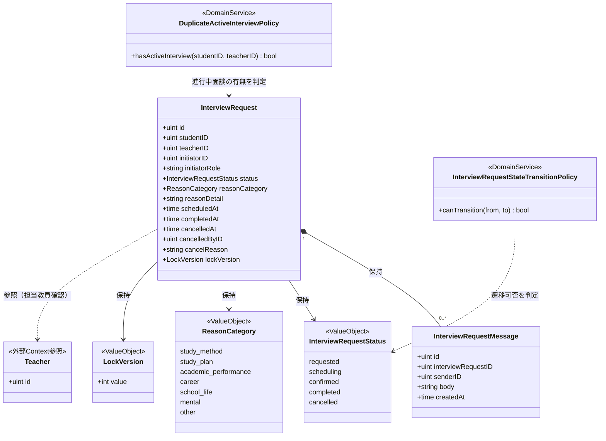
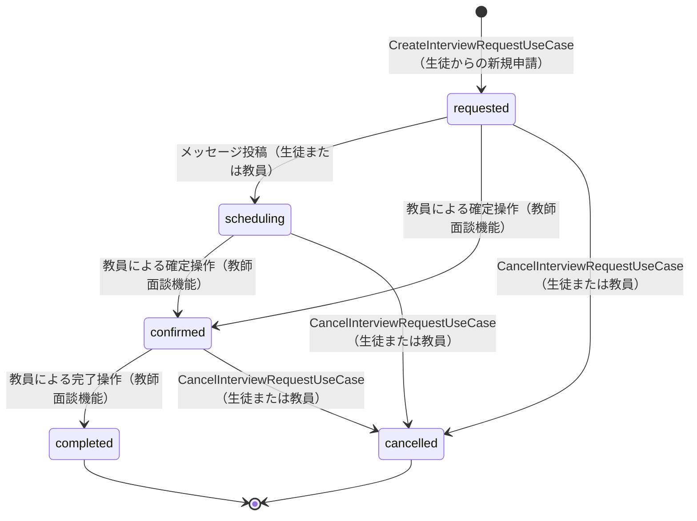
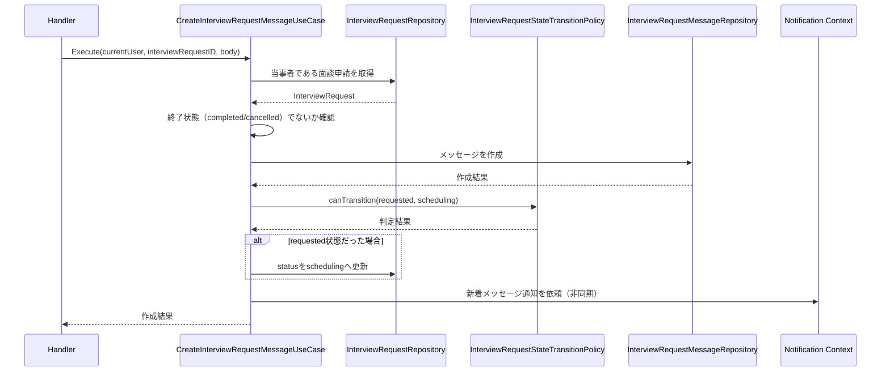
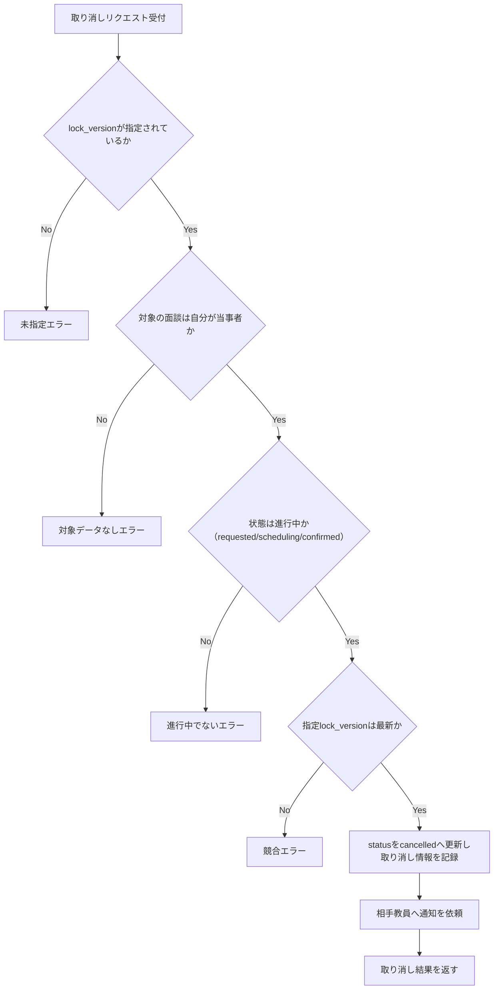

# 面談機能 Go移行・設計仕様書

---

# 1. 機能概要

## 機能概要

生徒が担当教員に対して面談を申請し、教員とのメッセージのやり取りを通じて面談の実施を進める機能である。Rails現行仕様では、面談申請の一覧・詳細取得、新規申請、取り消し、メッセージの一覧・投稿という6つの操作を生徒向けに提供している。面談の確定・完了操作は教員側の操作であり、教師面談機能（別②Go移行・設計仕様書）の責務として扱う。ただし、面談の状態（`requested` / `scheduling` / `confirmed` / `completed` / `cancelled`）とその遷移ルールは、生徒・教員の双方の操作から参照・変更される共通の業務ルールであるため、本書でも正確に整理する。

## 利用者

- 生徒ユーザー（student ロール）
- 自分が当事者（申請した生徒本人）となっている面談申請のみ操作可能

## 業務上の目的

- 生徒が担当教員へ相談機会を申請できるようにする
- 申請から実施までのやり取り（メッセージ）を記録し、状況を可視化する
- 二重申請・他生徒の面談への関与を防ぎ、面談のやり取りを当事者間に限定する

---

# 2. 設計方針

本機能は、5状態の状態遷移・楽観的排他制御（`lock_version`）・複数の業務ルールを伴う中核領域であるため、業務ルールをドメイン側へ明確に集約する設計とする。あわせて、教員側の操作（確定・完了）が別機能として並行して同じEntityを扱うことを前提に、状態遷移ルール自体は生徒視点・教員視点のどちらの②文書からも一貫して参照できる形で整理する。

- 責務分離: 申請・取消・メッセージ投稿という生徒視点の操作と、状態遷移ルールそのものを分離して整理する
- 保守性: 状態遷移ルールをEntity・Domain Serviceに集約し、教員側の②文書（教師面談機能）と矛盾なく参照できるようにする
- テスト容易性: 状態遷移・楽観的排他制御・当事者判定をユースケース単位で検証できるようにする
- 拡張性: 相談理由の種別追加や、通知手段の多様化に対応しやすい構造にする
- API互換性: 既存エンドポイントと主要なリクエスト・レスポンス構造を維持する

---

# 3. Bounded Context

## Context名

- interview-request

## Contextの責務

- 面談申請の作成・参照・取り消し（生徒視点の操作）
- 面談に紐づくメッセージの投稿・参照
- 面談の状態（`requested` / `scheduling` / `confirmed` / `completed` / `cancelled`）とその遷移ルールの管理
- 楽観的排他制御（`lock_version`）による更新競合の防止

本Contextの生徒向け操作範囲は、申請・取消・メッセージのやり取りに限定される。面談の確定（`confirmed`）・完了（`completed`）への遷移を引き起こす操作自体は教員視点の操作であり、教師面談機能側の責務として別途整理される。ただし、状態そのものとその遷移条件はInterviewRequest Entityに属する業務ルールであり、生徒視点・教員視点いずれの機能からも同一のルールを参照する。

## 他Contextとの依存関係

- School Context（教員のクラス担当情報）: 面談申請時に、指定した教員が生徒の所属クラスの担当教員であることを確認するために依存する
- User Context（②は`ユーザー基盤機能_Go移行・設計仕様書.md`）: 生徒・教員の識別、メッセージ送信者名の表示に依存する
- Notification Context: 面談の新規申請・取り消し・新着メッセージの発生を契機に、相手方（教員）へ通知を行うために依存する

## 依存する理由

面談申請先の教員が正当な担当教員であることの確認は、クラス担当情報を管理するSchool Context側のデータに依存する。また、申請・取消・メッセージ投稿のいずれも相手方への非同期通知を伴うため、Notification Contextへの通知依頼が発生する。これらはいずれも面談そのものの状態遷移ルールとは独立した「参照・通知のための依存」であり、面談の状態管理自体を他Contextに委ねるものではない。

---

# 4. 設計パターン

## 採用パターン

Domain Model

## 判断根拠

面談申請は、5つの状態（申請中・調整中・確定済み・完了・取り消し）を持ち、許可される遷移の組み合わせが厳密に定義されている。さらに、楽観的排他制御（`lock_version`）による更新競合の検出、当事者制限（申請した生徒本人と相手教員のみが操作可能）、進行中面談の重複申請禁止など、複数の業務ルールがEntityに関連する。これらは単なるCRUDの延長では表現しきれない業務価値を持つため、中核領域として扱う。

- 業務ルール: 状態遷移の許可条件、重複申請の禁止、メッセージ投稿に伴う状態遷移（`requested`→`scheduling`）など、複数のルールがInterviewRequestに関連する
- 状態管理: `requested` / `scheduling` / `confirmed` / `completed` / `cancelled`という明確な状態を持ち、遷移条件・禁止される組み合わせが仕様として定義されている
- 将来拡張: 生徒視点・教員視点の双方から同じ状態遷移ルールが参照されるため、ルールをEntityに集約しておくことで、教師面談機能側との一貫性を保ちやすい
- テスト容易性: 状態遷移・楽観的排他制御・当事者判定をEntity単位で独立して検証できる

## 採用しなかったパターン

### Transaction Script

状態遷移の許可条件・楽観的排他制御・当事者判定という複数の業務ルールを手続きに直接書くと、生徒視点・教員視点の両機能でルールの重複や食い違いが生じるリスクが高い。共通のルールをドメイン側に集約する方が、両機能間の整合性を保ちやすい。

### Active Record

状態遷移の許可条件（どの状態からどの状態へ遷移できるか）は単純なバリデーションの域を超えており、モデルの保存・更新責務に閉じ込めると、生徒視点・教員視点それぞれの操作でルールが分散しやすい。

### Event Sourcing

面談の状態変化について、現行仕様には変更履歴の詳細な再構築・監査要件は明示されていない。現在の状態と`lock_version`による競合検出で業務要件を満たしており、イベントストアを導入するほどの必要性はない。

---

# 5. Aggregate設計

## Aggregate Root

- InterviewRequest

## Aggregateに含めるEntity

- InterviewRequest
- InterviewRequestMessage

## Aggregate境界

- InterviewRequestが、自身の状態（`status`）・楽観的排他制御用の版数（`lock_version`）・当事者情報の整合性を保証する単位とする
- InterviewRequestMessageは、投稿時にInterviewRequestの状態遷移（`requested`→`scheduling`）を引き起こす場合があるため、InterviewRequestのAggregateに含める

## 整合性を保証する単位

- 面談申請の作成・取り消し・メッセージ投稿のそれぞれの操作単位で、InterviewRequestの状態とInterviewRequestMessageの整合性を一貫して保証する

理由: メッセージ投稿が面談の状態遷移を引き起こすという業務ルール（Rails現行仕様書3章「メッセージのやり取り」4.）があるため、InterviewRequestMessageの作成とInterviewRequestの状態更新は同一の整合性単位として扱う必要がある。

---

# 6. Entity設計

## InterviewRequest

- 役割: 生徒と教員の面談申請・実施状況を表す中心的なドメイン概念
- ライフサイクル: 作成（`requested`） → メッセージのやり取り・確定・完了・取り消しを経て終了状態（`completed`または`cancelled`）に至る
- 状態変化: 「10. 状態遷移図」のとおり
- 保持する責務:
  - 生徒・教員・申請者区分（`initiator_role`）・相談理由・状態・版数（`lock_version`）を保持する
  - 状態遷移の許可条件を判定する（自身が現在どの状態にあり、どの状態へ遷移可能かを知っている）
  - 取り消し時に、進行中の状態であることと版数の一致を検証する
  - メッセージ投稿を受けて、`requested`から`scheduling`への遷移を判定する
- 判断根拠: 面談業務の中心的な概念であり、状態遷移ルール・楽観的排他制御・当事者情報のすべてがこのEntityに集約されるため

## InterviewRequestMessage

- 役割: 面談申請に対する生徒・教員間のメッセージのやり取りを表す概念
- ライフサイクル: 作成のみ（更新・削除は行わない）
- 状態変化: なし
- 保持する責務:
  - 送信者・本文・投稿日時を保持する
  - 送信者が面談の当事者（申請した生徒本人、または相手教員）であることの検証材料を提供する
- 判断根拠: 単なるログではなく、投稿がInterviewRequestの状態遷移を引き起こすという業務的な意味を持つため

---

# 7. Value Object設計

## InterviewRequestStatus

- 採用理由: 状態値を文字列のまま扱うと、無効な値や許可されない遷移の混入を防げないため
- 独自ルール: `requested` / `scheduling` / `confirmed` / `completed` / `cancelled`のいずれかのみを許容し、「10. 状態遷移図」の遷移条件に従った遷移のみを許可する
- Entity属性ではなくValue Objectにする理由: 状態の意味と許容される遷移ルールを型として一元管理し、生徒視点・教員視点のどちらの機能からも同じルールを参照できるようにするため

## ReasonCategory

- 採用理由: 相談理由の種別（学習方法・学習計画・成績・進路・学校生活・メンタル・その他）は許容値が定まっており、かつ「生徒による申請では必須、教員による申請では指定不可」という申請者区分に応じたルールを持つため
- 独自ルール: 定義済みの種別のいずれかのみ許容する。生徒による申請（`initiator_role = student`）の場合は必須とする
- Entity属性ではなくValue Objectにする理由: 許容値の妥当性検証と、申請者区分に応じた必須・不要の切り替えルールを一元化するため

## LockVersion

- 採用理由: 楽観的排他制御に用いる版数は、単なる整数ではなく「表示時点の版数と現在の版数が一致するか」を判定する業務的な意味を持つため
- 独自ルール: 取り消し操作時に、指定された版数が現在の値と一致しない場合は競合として扱い、更新を拒否する
- Entity属性ではなくValue Objectにする理由: 競合判定ロジックを一元化し、将来的に他の更新操作（教員側の確定・完了操作等）でも同じ判定ルールを再利用できるようにするため

## Value Objectを採用しないもの

- 相談理由の詳細（`reason_detail`）・メッセージ本文（`body`）: 文字数制限（2000文字以内）はあるが、表示用の文字列そのものであり、独自の比較・変換ロジックを持たないためValue Object化は不要とする

---

# 8. Domain Service

## InterviewRequestStateTransitionPolicy

- 責務: 現在の状態と遷移先の状態の組み合わせが許可されるかどうかを判定する（「10. 状態遷移図」の遷移条件・禁止される組み合わせを集約する）
- Entityへ持たせない理由: 遷移ルール自体はInterviewRequest単体の属性判定であるため本来Entityのメソッドとして表現できるが、生徒視点（本機能）・教員視点（教師面談機能）の双方の②文書から同一の遷移ルールを一貫して参照する必要があるため、ルールの記述箇所を独立させて明示する
- 判断根拠: 遷移ルールが生徒視点・教員視点それぞれの操作から呼び出される横断的な業務ルールであり、どちらか一方の機能に暗黙的に埋め込むと、もう一方の機能でルールが食い違うリスクがあるため

## DuplicateActiveInterviewPolicy

- 責務: 同じ生徒・教員の組み合わせで、進行中（`requested` / `scheduling` / `confirmed`）の面談が既に存在しないかを判定する
- Entityへ持たせない理由: 判定には対象の生徒・教員に紐づく他のInterviewRequestの検索結果が必要であり、単一のInterviewRequestの属性だけでは完結しないため
- 判断根拠: 複数のInterviewRequestを横断する重複禁止ルールであり、新規申請時にのみ必要となる独立した業務ルールであるため

---

# 9. クラス図

Teacherは他Context（School Context／User Context）が所有するデータであり、本機能からは参照のみ行うため外部参照として示している。Goのstruct定義（フィールドの可視性・タグ等）は③Go実装仕様書で扱う。

---

# 10. 状態遷移図

InterviewRequest.statusは以下の状態を持つ（「6. Entity設計」の状態変化を可視化したもの）。生徒視点の本機能で実行される遷移と、教員視点（教師面談機能）で実行される遷移の両方を含む、Entityが持つ業務ルール全体を記載する。

遷移条件:

- `requested` → `scheduling`: メッセージのやり取りが開始されたとき（本機能で実装。生徒からの投稿・教員からの投稿いずれも契機になり得る）
- `requested` / `scheduling` → `confirmed`: 教員が面談日時を確定したとき（教師面談機能側の操作。本機能では実行しない）
- `confirmed` → `completed`: 教員が面談完了を記録したとき（教師面談機能側の操作。本機能では実行しない）
- `requested` / `scheduling` / `confirmed` → `cancelled`: 生徒または教員が取り消しを行ったとき（本機能では生徒による取り消しのみを実装する）

禁止される組み合わせ:

- `completed`・`cancelled`から他の状態への遷移は一切許可されない（終了状態）
- `requested`から`completed`への直接遷移はない（必ず`confirmed`を経る）

本機能（生徒向け）が実装するのは「`[*]→requested`」「`requested/scheduling→scheduling`（メッセージ契機）」「`requested/scheduling/confirmed→cancelled`」の3種類の遷移であり、`confirmed`・`completed`への遷移は教師面談機能側の実装範囲である。ただし遷移ルールの正当性（許可される組み合わせかどうか）はInterviewRequestStateTransitionPolicyとして共通化されているため、両機能で矛盾なく判定される。

---

# 11. Repository設計

## InterviewRequestRepository

- 管理対象: InterviewRequest
- 責務:
  - 生徒が当事者となっている面談申請の一覧・詳細取得
  - 新規面談申請の作成
  - 状態・取り消し情報の更新（楽観的排他制御を伴う）
  - 同一生徒・教員間の進行中面談の存在確認
- 保持する検索機能:
  - `student_id`による絞り込み（生徒視点の一覧取得の起点）
  - `status`による絞り込み
  - `student_id` + `teacher_id` + 進行中状態（`requested` / `scheduling` / `confirmed`）による重複確認検索
  - 作成日時降順ソート、ページネーション
- 保持しない責務:
  - 状態遷移の許可判定（InterviewRequestStateTransitionPolicyの責務）
  - 確定・完了操作（教師面談機能側の責務）
- 判断根拠: 永続化と検索に集中させ、状態遷移ルールという業務ロジックを持たせないため

## InterviewRequestMessageRepository

- 管理対象: InterviewRequestMessage
- 責務:
  - 指定面談に紐づくメッセージ一覧の取得
  - メッセージの新規作成
- 保持する検索機能:
  - `interview_request_id`による絞り込み、投稿日時昇順ソート、ページネーション
- 保持しない責務:
  - メッセージ投稿に伴う面談状態の更新（UseCase・InterviewRequestの責務）
- 判断根拠: メッセージの永続化と検索に責務を限定するため

## TeacherAssignmentRepository（参照用）

- 管理対象: 教員のクラス担当情報（School Context所有データ）
- 責務: 指定教員が指定生徒の所属クラスを担当しているかどうかの確認
- 保持しない責務: 教員情報自体の作成・更新
- 判断根拠: 面談申請の宛先妥当性確認に必要な最小限の参照に限定するため

---

# 12. UseCase設計

## ListInterviewRequests

- 目的: 生徒が当事者となっている面談申請の一覧を取得する
- 入力: current user, status（任意）, page, per_page
- 出力: 面談申請一覧とページ情報
- トランザクション範囲: 読み取りのみ、トランザクション不要
- 呼び出すRepository: InterviewRequestRepository
- 判断根拠: 単純な一覧取得であり、状態遷移を伴わないため

## ShowInterviewRequest

- 目的: 指定面談申請の詳細を取得する
- 入力: current user, interview request id
- 出力: 面談申請詳細情報
- トランザクション範囲: 読み取りのみ
- 呼び出すRepository: InterviewRequestRepository
- 判断根拠: 当事者確認を含む単一Entityの取得であるため

## CreateInterviewRequest

- 目的: 生徒が担当教員に対して新しい面談を申請する
- 入力: current user, teacher_id, reason_category, reason_detail
- 出力: 作成結果（成功メッセージ）
- トランザクション範囲: 担当教員確認・重複申請確認・InterviewRequest作成を1トランザクションで扱う
- 呼び出すRepository: TeacherAssignmentRepository、InterviewRequestRepository
- 呼び出すDomain Service: DuplicateActiveInterviewPolicy
- 判断根拠: 担当教員であることの確認と重複申請の防止を、作成処理と一貫して行う必要があるため。作成完了後、相手方教員への通知はNotification Context（規約13章のJobPublisher）へ依頼する

## CancelInterviewRequest

- 目的: 生徒が、自分が申請した進行中の面談を取り消す
- 入力: current user, interview request id, lock_version, reason（任意）
- 出力: 取り消し結果（成功メッセージ）
- トランザクション範囲: 状態確認・版数確認・状態更新を1トランザクションで扱う
- 呼び出すRepository: InterviewRequestRepository
- 呼び出すDomain Service: InterviewRequestStateTransitionPolicy
- 判断根拠: 進行中であることの確認・楽観的排他制御・状態更新を一貫して行う必要があるため。取り消し完了後、相手方教員への通知はNotification Contextへ依頼する

## ListInterviewRequestMessages

- 目的: 指定面談に紐づくメッセージ一覧を取得する
- 入力: current user, interview request id, page, per_page
- 出力: メッセージ一覧とページ情報
- トランザクション範囲: 読み取りのみ
- 呼び出すRepository: InterviewRequestRepository（当事者確認）、InterviewRequestMessageRepository
- 判断根拠: 当事者以外のメッセージ閲覧を防ぐため、面談側の当事者確認を経由する必要があるため

## CreateInterviewRequestMessage

- 目的: 生徒が、自分が当事者となっている面談にメッセージを投稿する
- 入力: current user, interview request id, body
- 出力: 作成されたメッセージ情報
- トランザクション範囲: 当事者確認・面談終了状態でないことの確認・メッセージ作成・（`requested`状態であれば）`scheduling`への状態遷移を1トランザクションで扱う
- 呼び出すRepository: InterviewRequestRepository、InterviewRequestMessageRepository
- 呼び出すDomain Service: InterviewRequestStateTransitionPolicy
- 判断根拠: メッセージ投稿が面談の状態遷移を引き起こすという業務ルールを、1つの処理単位として一貫して扱う必要があるため。投稿完了後、相手方教員への通知はNotification Contextへ依頼する

---

# 13. シーケンス図・処理フロー図

## シーケンス図（CreateInterviewRequestMessage）

## 処理フロー図（CancelInterviewRequest）

進行中判定・楽観的排他制御の分岐が多いため、フローチャートで可視化する。

---

# 14. Transaction設計

## Transaction開始位置

- UseCaseの開始時にトランザクションを開始する（読み取り専用UseCaseを除く）

## Transaction終了位置

- CreateInterviewRequest / CancelInterviewRequest / CreateInterviewRequestMessageは、InterviewRequest（および必要な場合はInterviewRequestMessage）の作成・更新が完了した時点でコミットする
- ListInterviewRequests / ShowInterviewRequest / ListInterviewRequestMessagesは読み取りのみのため、トランザクションを使用しない
- 相手方への通知（Notification Contextへの依頼）は、規約「13. 非同期ジョブ実行パターン」に従い、業務データの書き込みと同一トランザクション内でジョブとして登録する（Transactional Outboxパターン）

## 理由

- 状態遷移・楽観的排他制御・メッセージ作成の整合性を、1つの業務操作の単位で保証するため
- 通知の登録を業務データの書き込みと同一トランザクションに含めることで、「面談は更新されたが通知が送られない」「通知だけが送られ面談が更新されない」という不整合を防ぐため

---

# 15. Validation設計

## Presentation

- 型チェック: `teacher_id` / `interview_request_id` / `lock_version`が数値であることを検証する
- 必須チェック: `teacher_id` / `reason_category` / `reason_detail`（申請時）、`lock_version`（取り消し時）、`body`（メッセージ投稿時）の必須項目を検証する
- フォーマットチェック: `reason_detail`・`body`の文字数上限（2000文字以内）を検証する

## Domain

- 業務ルール: 指定教員が生徒の所属クラスの担当教員であること、同一生徒・教員間で進行中の面談が重複していないこと
- 状態チェック: 取り消し可能な状態（進行中）であること、メッセージ投稿可能な状態（未終了）であること
- 整合性チェック: 取り消し時の`lock_version`一致、当事者本人であること

## 責務分離

- Presentationは「入力値の形式が正しいか」を担当する
- Domainは「その操作が業務的に妥当か（担当教員か・重複していないか・状態として許可されるか・版数が一致するか）」を担当する

## バリデーション仕様

|フィールド|検証層|ルール|エラーメッセージ方針|
|-|-|-|-|
|teacher_id|Presentation|必須・数値形式|「申請先教員を指定してください」|
|reason_category|Presentation|必須（生徒申請時）|「相談理由の種別を選択してください」|
|reason_detail|Presentation|必須・2000文字以内|「相談理由を入力してください」|
|teacher_id|Domain|生徒の所属クラスの担当教員であること|「指定された教員は担当教員ではありません」|
|student_id + teacher_id|Domain|進行中の面談が重複していないこと|「既に進行中の面談があります」|
|lock_version|Presentation|必須（取り消し時）|「版数を指定してください」|
|status|Domain|取り消し時は進行中であること|「進行中の面談のみ取り消せます」|
|lock_version|Domain|最新の版数と一致すること|「他の操作によって情報が更新されています」|
|body|Presentation|必須・2000文字以内|「メッセージを入力してください」|
|status|Domain|メッセージ投稿時は未終了であること|「終了した面談にはメッセージを投稿できません」|

---

# 16. Authorization設計

## Middleware

- 認証済みユーザーを特定し、コンテキストへ保持する
- 役割がstudentであることを確認する

## Handler

- APIの入口としてリクエストを受け取り、認証失敗時のHTTP応答を整える
- 業務権限判定は持たせない

## UseCase

- current userが当事者（申請した生徒本人）となっている面談申請のみを対象とする
- 面談の確定・完了操作は本機能のUseCaseには実装しない（教師面談機能側の責務）

## Domain

- InterviewRequestが`student_id`を保持し、当事者確認の材料を提供する
- InterviewRequestStateTransitionPolicyが、生徒視点で許可されない遷移（`confirmed`・`completed`への遷移）を防ぐ

## 判断理由

認証はMiddleware、「自分が当事者か」というデータアクセス制御はUseCase、「その状態遷移が許可されるか」という業務ルールはDomainで扱うことで、生徒視点・教員視点の機能が同じEntityを扱いながらも、それぞれの操作範囲を超えないようにする。

---

# 17. Error設計

## Domain Error

- 責務: 状態遷移ルール違反（進行中でない面談の取り消し、終了済み面談へのメッセージ投稿等）、版数不一致による競合を表現する
- 判断理由: 業務ルール違反をアプリケーション層に漏らさず、ドメイン側で明示的に扱うため

## Application Error

- 責務: 対象面談が存在しない、または当事者でない場合、担当教員でない場合、重複申請の場合を表現する
- 判断理由: ユースケースの実行可否に関わる失敗をHTTPレスポンスへ変換しやすくするため

## Infrastructure Error

- 責務: DB接続失敗・永続化失敗を表現する
- 判断理由: 永続化層の失敗をドメインに漏らさず、技術的な障害として切り分けるため

## エラー仕様

|業務シナリオ|エラー種別|発生層|想定するHTTPステータス|
|-|-|-|-|
|対象の面談が存在しない、または自分が当事者ではない|NotFound|Application|404|
|申請先教員が担当教員でない|Validation|Domain|422|
|進行中の面談が既に存在する|Validation|Domain|422|
|lock_versionが未指定|Validation|Presentation|422|
|進行中でない面談を取り消そうとした|Validation|Domain|422|
|lock_versionが最新と一致しない（競合）|Conflict|Domain|409|
|終了済みの面談にメッセージを投稿しようとした|Validation|Domain|422|
|本文が空、または文字数超過|Validation|Presentation|422|

---

# 18. Domain Event

不要と判断する。

理由: 面談の新規申請・取り消し・メッセージ投稿はいずれも「相手方への通知」という単一種類の非同期処理を伴うのみであり、複数の処理へ波及する仕組みを必要としない。規約「13. 非同期ジョブ実行パターン（JobQueue）」に従い、UseCaseから直接JobPublisherを呼び出す形で十分に表現できる。将来的に、通知手段の多様化（メール・アプリ内通知・プッシュ通知等）や、面談状態の変化を契機とした複数の後続処理が必要になった場合は、Domain Event化を検討する。

---

# 19. API仕様

## エンドポイント一覧

|エンドポイント|HTTP Method|概要|
|-|-|-|
|/api/v1/student/interview_requests|GET|面談申請一覧取得|
|/api/v1/student/interview_requests/:id|GET|面談申請詳細取得|
|/api/v1/student/interview_requests|POST|面談申請の新規作成|
|/api/v1/student/interview_requests/:id|DELETE|面談申請の取り消し|
|/api/v1/student/interview_requests/:interview_request_id/messages|GET|メッセージ一覧取得|
|/api/v1/student/interview_requests/:interview_request_id/messages|POST|メッセージ投稿|

## 各エンドポイントの仕様

- 一覧取得: クエリパラメータ`status`（任意）/`page`/`per_page`。レスポンスは面談申請一覧とページ情報
- 詳細取得: パスパラメータ`id`。レスポンスは面談申請詳細
- 新規作成: ボディに`teacher_id`/`reason_category`/`reason_detail`。レスポンスは完了メッセージ
- 取り消し: パスパラメータ`id`、ボディに`lock_version`（必須）/`reason`（任意）。レスポンスは完了メッセージ
- メッセージ一覧取得: パスパラメータ`interview_request_id`、クエリパラメータ`page`/`per_page`
- メッセージ投稿: パスパラメータ`interview_request_id`、ボディに`body`。レスポンスは作成されたメッセージ情報

Status Code:

- 200: 取得・取り消し成功
- 201/200: メッセージ作成・面談申請作成成功の扱いは既存仕様に合わせて統一する
- 404: 対象データが存在しない、または当事者でない
- 409: lock_versionの競合
- 422: 入力・業務ルール違反

Error Response方針: 既存のerrors形式をそのまま踏襲し、フロントエンド互換性を優先する。

## Railsとの差分

- Rails仕様: 上記6エンドポイントをそのまま維持する
- Go設計での変更: なし（URL・HTTP Method・意味を維持する）。`interview_request[xxx]`形式のリクエストパラメータはGo側で入力DTOとして吸収する
- 変更理由: フロントエンドとの互換性を優先するため
- 影響範囲: なし

JSONスキーマの厳密な型定義・Goの構造体は③Go実装仕様書で扱う。

---

# 20. DB設計方針

## 現行DBを利用するか

- 既存Rails DBを継続利用する

## Schema変更有無

- 変更なし

## 変更理由

- 現行の`interview_requests`・`interview_request_messages`テーブルで本機能の要件を満たしているため
- これらのテーブルは教師面談機能（教員視点の操作）とも共有され、書き込み範囲がそれぞれの視点の操作に応じて限定される

## 変更を提案しない理由

- 本機能の移行対象は既存カラム（状態・版数・当事者情報等）の参照・更新で完結し、構造的な問題は現行仕様書から確認できないため

---

# 21. DB操作仕様

|Repository|対象テーブル|操作種別|主な検索条件|関連テーブルとの結合|ページネーション/ソート|
|-|-|-|-|-|-|
|InterviewRequestRepository|interview_requests|参照・作成・更新|student_id、status、id|なし|作成日時降順、ページネーションあり|
|InterviewRequestMessageRepository|interview_request_messages|参照・作成|interview_request_id|なし|投稿日時昇順、ページネーションあり|
|TeacherAssignmentRepository|（School Context所有テーブル）|参照|teacher_id、生徒の所属クラスID|クラス担当情報との結合が必要|不要|

具体的なSQL・GORMのクエリコードは③Go実装仕様書（`規約/Gorm規約.md`）で扱う。

---

# 22. テスト戦略

## Domain Test

- 目的: InterviewRequestStateTransitionPolicyの遷移可否判定、DuplicateActiveInterviewPolicyの重複判定、LockVersionの競合判定を検証する

## UseCase Test

- 目的: ListInterviewRequests / ShowInterviewRequest / CreateInterviewRequest / CancelInterviewRequest / ListInterviewRequestMessages / CreateInterviewRequestMessageの業務振る舞いと当事者制限を検証する

## Repository Test

- 目的: InterviewRequestRepository・InterviewRequestMessageRepositoryの検索条件・楽観的排他制御を伴う更新の正確性を検証する

## Handler Test

- 目的: API入力のバリデーション結果とHTTPステータス（特に409競合エラー）への変換を検証する

## Integration Test

- 目的: エンドポイント経由で申請・取消・メッセージ投稿に伴う状態遷移が一貫して動作し、他生徒の面談にアクセスできないことを確認する

---

# 23. Railsとの責務対応

| Rails | Go | 設計方針 |
|---|---|---|
| Controller | Handler | HTTP入力の受け取りとレスポンス整形に限定する |
| Form（`Student::CreateInterviewRequestForm`） | Request DTO + Validation | 入力検証をPresentation層で分離する |
| Service（`Student::CreateInterviewRequestService`等） | UseCase | 業務処理の起点として扱う |
| Service（`Common::CancelInterviewRequestService`等、生徒・教員で共有される処理） | Domain Service（InterviewRequestStateTransitionPolicy） | 生徒視点・教員視点の双方から参照される遷移ルールとして分離する |
| Model（`InterviewRequest`） | Entity + Repository | 状態・楽観的排他制御を伴う業務ルールをEntityに、永続化をRepositoryに分離する |
| Serializer | Presenter / Response DTO | 画面に返すレスポンス整形を分離する |

---

# 24. 採用しなかった設計

## Transaction Script

- 採用しなかった理由: 状態遷移ルールを手続きに直接書くと、生徒視点・教員視点の両機能でルールが重複・食い違うリスクが高いため
- 将来的に採用する可能性: 状態遷移ルールが将来的に大幅に単純化された場合は再検討できる

## Active Record

- 採用しなかった理由: 状態遷移の許可条件は単純なバリデーションの域を超えており、モデルの保存・更新責務に閉じ込めると生徒視点・教員視点でルールが分散しやすいため
- 将来的に採用する可能性: 面談機能が単純な予約管理に縮小された場合は再検討できる

## Event Sourcing

- 採用しなかった理由: 現行仕様には変更履歴の詳細な再構築・監査要件が明示されていないため
- 将来的に採用する可能性: 面談の状態変化を時系列で監査する要件が生じた場合に有効な可能性がある

---

# 25. 設計判断サマリー

| 項目 | 採用 | 判断理由 |
|-|-|-|
| 設計パターン | Domain Model | 5状態の遷移ルール・楽観的排他制御・重複禁止等、複数の業務ルールがEntityに関連するため |
| Aggregate | InterviewRequest（InterviewRequestMessageを含む） | メッセージ投稿が状態遷移を引き起こすため、同一の整合性単位として扱う必要があるため |
| Transaction境界 | UseCase単位 | 状態遷移・楽観的排他制御・メッセージ作成の整合性を1操作単位で保証するため |
| Domain Event | 未採用 | 通知は単一種類の非同期処理であり、JobPublisherの直接呼び出しで十分なため |
| Value Object | InterviewRequestStatus / ReasonCategory / LockVersionを採用 | 状態・相談理由の許容値と、楽観的排他制御の意味を明示するため |
| Authorization | Middleware + UseCase（当事者制限） | 生徒視点で許可される操作範囲（確定・完了を含まない）を明確にするため |
| Context名 | interview-request | 教員視点の教師面談機能と同一の業務領域を扱うため、Context名を統一し、責務の記載のみ利用者視点で書き分ける |

---

# 設計差分管理

## Rails現行仕様

- 生徒視点・教員視点それぞれにServiceが分かれつつも、一部（`Common::CancelInterviewRequestService`、`Common::PostInterviewRequestMessageService`）は共有されている
- 状態遷移ルールがService内の条件分岐として実装されている

## Go設計での変更内容

- 状態遷移ルールをInterviewRequestStateTransitionPolicy（Domain Service）として独立させ、生徒視点（本機能）・教員視点（教師面談機能）の双方から参照できる形に整理する
- 生徒視点の操作範囲（申請・取消・メッセージ）と教員視点の操作範囲（確定・完了）を、UseCaseレベルで明確に分離する

## 変更理由

- Railsの実装ではServiceの共有関係が暗黙的であり、どのルールが両視点で共通なのかが読み取りにくい。Go設計ではDomain Serviceとして明示することで、教員視点の②文書（教師面談機能）との整合性を保ちやすくする

## 影響範囲

- フロントエンドから見たAPIの外部仕様は変更しない
- 既存DBスキーマは維持するため、データ移行は不要
- 教師面談機能側の②文書は、本書のEntity設計・状態遷移図（6章・10章）と整合させる必要がある
