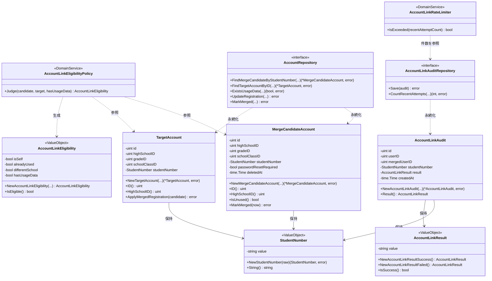
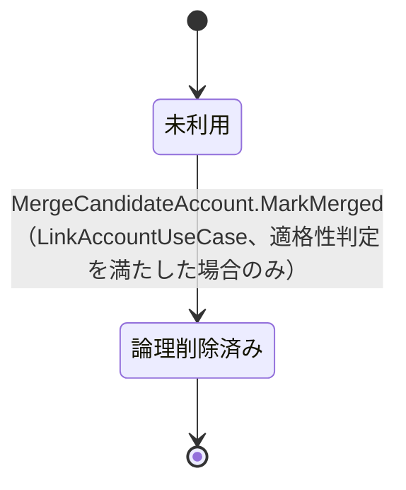
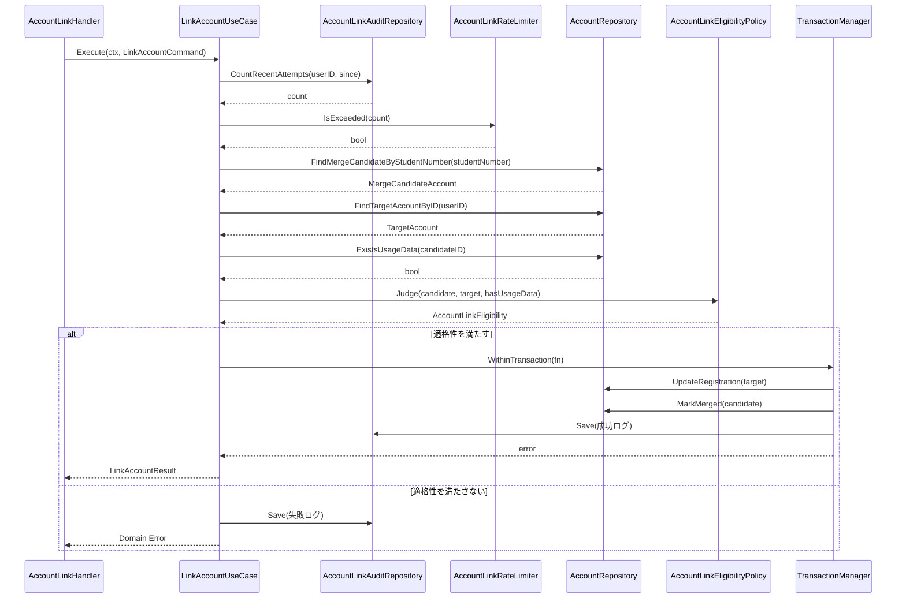
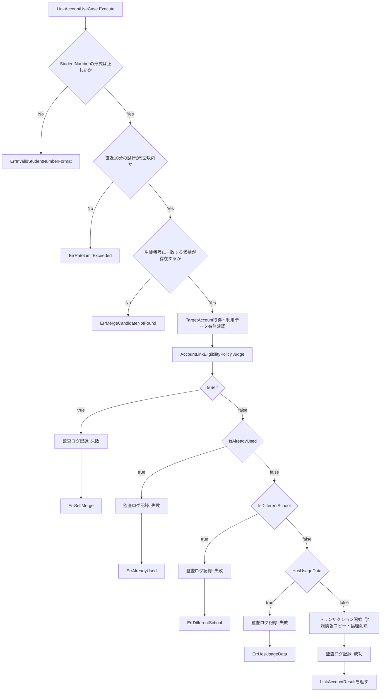

# アカウント連携機能 Go実装仕様書

---

# 1. 機能概要

## 機能概要

教員によって事前に招待登録された未利用の生徒アカウント（統合元候補）を、生徒番号をキーに検索し、現在ログイン中のアカウント（統合先）へ統合する機能である。統合対象候補が4つの適格性条件（本人でない・未利用・同一高校・利用データなし）と生徒番号の書式検証をすべて満たす場合にのみ統合を実行し、学籍情報（高校・学年・クラス・生徒番号）を統合先アカウントへコピーしたうえで、統合元アカウントを論理削除する。統合の成否にかかわらず、試行内容を監査ログ（`account_link_audits`）へ記録する（②「1. 機能概要」要約）。

## 採用設計パターンとその理由（②からの要約）

②「4. 設計パターン」により **Domain Model** を採用する。

- 単一の統合操作に4つの適格性条件（本人一致・利用開始状況・所属高校・利用データ有無。生徒番号の書式検証を含めると5条件）が集約されており、いずれも統合元候補・統合先という2つのアカウントの属性を比較して判定する業務ルールである
- 統合対象候補は「未利用」から「論理削除済み」へ、統合先は「旧学籍情報」から「新学籍情報」へと、それぞれ状態が変化する
- 適格性判定をEntity・Domain Serviceとして切り出すことで、条件ごとに独立したテストが可能になる（②「4. 設計パターン」テスト容易性）

Transaction Script（条件追加のたびに手続きが肥大化する）、Active Record（判定が単一モデルの検証にとどまらず2つのEntity間の比較ロジックである）、Event Sourcing（イベント再構築の要件がない）はいずれも②「4. 設計パターン」の「採用しなかったパターン」節の理由により不採用とされている。本書はこの判断を変更しない。

## 本書が対象とする実装範囲

- Bounded Context: `account-linking`（②「3. Bounded Context」）
- 対象UseCase: LinkAccountUseCase（②「12. UseCase設計」）
- 対象API: `POST /api/v1/student/account_link`（②「19. API仕様」）
- 対象外: User実体（アカウント）自体の認証・パスワード管理等、本機能に無関係なUser操作（②「11. Repository設計」AccountRepository「保持しない責務」）。User Context自体の②文書は未整備であるため（②「3. Bounded Context」他Contextとの依存関係、アーキテクチャ規約「15. 今後の課題」）、本機能が必要とする範囲（学籍情報の参照・更新・論理削除）に限定したRepositoryを本Context内に暫定的に定義する
- ①Rails実装の詳細は本タスクでは提供されていないため、参照が必要な箇所は「①未提供のため参照不可」として扱う

---

# 2. ディレクトリ構成

## 対象Bounded Context名

`account-linking`

②にはGo実装上のディレクトリ名（`internal/`配下のパッケージ名）の明記がない。アーキテクチャ規約「9. 命名規約」に基づき、既存の`teacher-permission`→`internal/teacher_permission`の対応関係に倣い、`account-linking`→`internal/account_linking`とする（**②からの補足・推測**。詳細は「17. ②からの補足事項」参照）。

## ②で採用した設計パターン

Domain Model（②「4. 設計パターン」）

## 採用パターンに対応する構造

アーキテクチャ規約「3. 設計パターンごとの構造適用方針」Domain Model節の標準構成（domain/application/infrastructure/presentationのフルレイヤー構成）を適用する。具体的なディレクトリ構成は、①Rails現行仕様書の整理が完了していないため未定であり、以下は本機能における暫定的な配置である（アーキテクチャ規約「1. 全体方針」の注記を参照）。

## 作成するディレクトリ一覧

```
internal/account_linking/
├── domain/
│   ├── entity/
│   ├── valueobject/
│   ├── repository/
│   ├── service/
│   └── errors/
├── application/
│   ├── dto/
│   ├── command/
│   └── usecase/
├── infrastructure/
│   ├── persistence/
│   │   └── gorm/
│   └── repository/
└── presentation/
    ├── handler/
    ├── request/
    ├── response/
    └── routes.go
```

`domain/specification/`・`domain/event/`・`application/query/`・`infrastructure/mail/`・`infrastructure/cache/`・`infrastructure/queue/`は本機能では対象外とする。②「18. Domain Event」でDomain Eventは不採用と明記されており、LinkAccountはCommand操作のみでQuery DTOを持たず、Mail・Cache・Queue等の外部連携要件も②に記載がないため。

## 作成するファイル一覧

```
internal/account_linking/domain/entity/merge_candidate_account.go
internal/account_linking/domain/entity/target_account.go
internal/account_linking/domain/entity/account_link_audit.go

internal/account_linking/domain/valueobject/student_number.go
internal/account_linking/domain/valueobject/account_link_eligibility.go
internal/account_linking/domain/valueobject/account_link_result.go

internal/account_linking/domain/repository/account_repository.go
internal/account_linking/domain/repository/account_link_audit_repository.go

internal/account_linking/domain/service/account_link_eligibility_policy.go
internal/account_linking/domain/service/account_link_rate_limiter.go

internal/account_linking/domain/errors/errors.go

internal/account_linking/application/command/link_account_command.go
internal/account_linking/application/dto/link_account_result.go
internal/account_linking/application/usecase/link_account_usecase.go
internal/account_linking/application/usecase/errors.go

internal/account_linking/infrastructure/persistence/gorm/user_model.go
internal/account_linking/infrastructure/persistence/gorm/account_link_audit_model.go
internal/account_linking/infrastructure/repository/account_repository.go
internal/account_linking/infrastructure/repository/account_link_audit_repository.go

internal/account_linking/presentation/handler/account_link_handler.go
internal/account_linking/presentation/request/account_link_request.go
internal/account_linking/presentation/response/account_link_response.go
internal/account_linking/presentation/routes.go
```

---

# 3. Domain層設計

## Entity

### MergeCandidateAccount（統合元アカウント候補）

②「6. Entity設計」に対応する。

- struct名: `MergeCandidateAccount`
- フィールド:

|フィールド|型|意味|
|-|-|-|
|`id`|`uint`|統合元候補のアカウントID|
|`highSchoolID`|`uint`|所属高校ID。統合先との同一高校判定に用いる|
|`gradeID`|`uint`|学年ID。学籍情報コピー対象|
|`schoolClassID`|`uint`|クラスID。学籍情報コピー対象|
|`studentNumber`|`valueobject.StudentNumber`|生徒番号|
|`passwordResetRequired`|`bool`|未利用フラグ。`true`かつ`deletedAt`が`nil`の場合に「未利用」とみなす（②「6. Entity設計」状態変化）|
|`deletedAt`|`*time.Time`|論理削除日時。`nil`であれば未削除|

- 公開method一覧:

|メソッド|引数|戻り値|責務|
|-|-|-|-|
|`NewMergeCandidateAccount`|`(id, highSchoolID, gradeID, schoolClassID uint, studentNumber valueobject.StudentNumber, passwordResetRequired bool, deletedAt *time.Time)`|`(*MergeCandidateAccount, error)`|Repositoryが取得した行からEntityを再構築するファクトリ。IDが0でないことを保証する|
|`(m *MergeCandidateAccount) ID() uint`|なし|`uint`|識別子の参照。`AccountLinkEligibilityPolicy`が本人一致判定に用いる|
|`(m *MergeCandidateAccount) HighSchoolID() uint`|なし|`uint`|所属高校IDの参照。`AccountLinkEligibilityPolicy`が同一高校判定に用いる|
|`(m *MergeCandidateAccount) GradeID() uint` / `SchoolClassID() uint` / `StudentNumber() valueobject.StudentNumber`|なし|各型|学籍情報コピー時に`TargetAccount.ApplyMergedRegistration`が参照する値を提供する|
|`(m *MergeCandidateAccount) IsUnused() bool`|なし|`bool`|`passwordResetRequired == true && deletedAt == nil`を判定する自己完結の状態判定（②「6. Entity設計」状態変化）|
|`(m *MergeCandidateAccount) MarkMerged(now time.Time) error`|`now time.Time`|`error`|`deletedAt`に`now`を設定する。既に削除済みの場合はエラーを返す（不変条件違反の防止）|

- 不変条件: `NewMergeCandidateAccount`は`id`が0でないこと、`studentNumber`が`valueobject.StudentNumber`として妥当であること（VO生成時に検証済み）を前提とする

**②からの補足**: ②「6. Entity設計」はMergeCandidateAccountの責務として「TargetAccountとの比較により、自身が統合元として適格かどうかを判定する振る舞いを持つ」と記載する一方、②「8. Domain Service」はAccountLinkEligibilityPolicyについて「判定は単一Entityの属性だけでなく、2つのEntity間の比較を要するため、どちらか一方のEntityへ責務を寄せると不自然になる」と記載しており、両者はEntity自身に比較責務を持たせるか否かで一見矛盾する。本書では、教師権限管理機能③（`TeacherPermissionUpdateGuard`）・問題解答機能③（AnswerResult/AnswerStatusの整理）で採用した前例と同様に、Entityは自己完結する事実（`IsUnused()`・`ID()`・`HighSchoolID()`等）のみを提供し、2つのEntity間の実際の比較・判定処理はDomain Service（`AccountLinkEligibilityPolicy`）に集約する構成で整理する。これにより②6章・8章いずれの記載とも矛盾しない（**②からの補足**。詳細は「17. ②からの補足事項」参照）。

`MarkMerged`は`deletedAt`のみを設定し、`studentNumber`の値そのものをVO層でクリア（空文字列化）する処理は持たせない。`valueobject.StudentNumber`は生成時に書式を検証するVOであり、Entity内で不正な空値へ書き換えることはVOの不変条件と矛盾するためである。DB上の`student_number`列のクリアは、Infrastructure層のRepository実装（`AccountRepositoryImpl.MarkMerged`）がGORMモデルに対する更新として直接行う（**②からの補足**。②「6. Entity設計」の状態変化「`deleted_at`設定、`student_number`クリア」のうち、`student_number`クリアをInfrastructure層の責務として切り分けたもの。詳細は「17. ②からの補足事項」参照）。

### TargetAccount（統合先＝ログイン中アカウント）

②「6. Entity設計」に対応する。

- struct名: `TargetAccount`
- フィールド:

|フィールド|型|意味|
|-|-|-|
|`id`|`uint`|ログイン中アカウントのID（current user）|
|`highSchoolID`|`uint`|所属高校ID|
|`gradeID`|`uint`|学年ID|
|`schoolClassID`|`uint`|クラスID|
|`studentNumber`|`valueobject.StudentNumber`|生徒番号|

- 公開method一覧:

|メソッド|引数|戻り値|責務|
|-|-|-|-|
|`NewTargetAccount`|`(id, highSchoolID, gradeID, schoolClassID uint, studentNumber valueobject.StudentNumber)`|`(*TargetAccount, error)`|Repositoryが取得した行からEntityを再構築するファクトリ。IDが0でないことを保証する|
|`(t *TargetAccount) ID() uint` / `HighSchoolID() uint`|なし|各型|`AccountLinkEligibilityPolicy`が本人一致・同一高校判定に用いる参照系メソッド|
|`(t *TargetAccount) ApplyMergedRegistration(candidate *MergeCandidateAccount) error`|`candidate *MergeCandidateAccount`|`error`|`candidate`の学籍情報（高校・学年・クラス・生徒番号）で自身のフィールドを上書きする（②「6. Entity設計」「統合実行時に学籍情報を更新される対象としての責務を持つ」）|

- 不変条件: `NewTargetAccount`は`id`が0でないことを保証する

### AccountLinkAudit（Aggregate Root）

②「5. Aggregate設計」「6. Entity設計」に対応する。本機能唯一のAggregate Rootである。

- struct名: `AccountLinkAudit`
- フィールド:

|フィールド|型|意味|
|-|-|-|
|`id`|`uint`|監査ログの識別子|
|`userID`|`uint`|試行者（ログイン中アカウント＝TargetAccountのID）|
|`mergedUserID`|`*uint`|統合元候補のID。生徒番号に一致するアカウントが見つからなかった場合は`nil`|
|`studentNumber`|`valueobject.StudentNumber`|試行時に指定された生徒番号|
|`result`|`valueobject.AccountLinkResult`|試行結果（成功／失敗）|
|`createdAt`|`time.Time`|試行日時|

- 公開method一覧:

|メソッド|引数|戻り値|責務|
|-|-|-|-|
|`NewAccountLinkAudit`|`(userID uint, mergedUserID *uint, studentNumber valueobject.StudentNumber, result valueobject.AccountLinkResult, createdAt time.Time)`|`(*AccountLinkAudit, error)`|新規監査ログを生成するファクトリ。`userID`が0でないことを保証する|
|`(a *AccountLinkAudit) Result() valueobject.AccountLinkResult`|なし|`valueobject.AccountLinkResult`|試行結果の参照|

- 不変条件: `userID`は0を許容しない。作成後の更新・削除は行わない（②「6. Entity設計」ライフサイクル「生成のみ（追記型）」）ため、フィールドを変更する公開methodは持たない

## Value Object

### StudentNumber

②「7. Value Object設計」に対応する。

- struct名: `StudentNumber`
- フィールド: `value string`（非公開）
- 生成時に検証するルール: 「英数字1文字以上-英数字1文字以上」のハイフン区切り形式（正規表現による形式検証）を満たさない値は生成できない（②「7. Value Object設計」独自ルール）
- 公開method一覧: `NewStudentNumber(raw string) (StudentNumber, error)` / `(s StudentNumber) String() string`

### AccountLinkEligibility（適格性判定結果）

②「7. Value Object設計」に対応する。

- struct名: `AccountLinkEligibility`
- フィールド（クラス図に基づく。いずれも「条件に違反しているか」を表す非公開フィールド）: `isSelf bool` / `alreadyUsed bool` / `differentSchool bool` / `hasUsageData bool`
- 生成時に検証するルール: 特になし（4条件の判定結果をそのまま保持する入れ物であり、`AccountLinkEligibilityPolicy`が生成する）
- 公開method一覧:

|メソッド|引数|戻り値|責務|
|-|-|-|-|
|`NewAccountLinkEligibility`|`(isSelf, alreadyUsed, differentSchool, hasUsageData bool)`|`AccountLinkEligibility`|4条件の判定結果を保持するVOを生成する|
|`(e AccountLinkEligibility) IsEligible() bool`|なし|`bool`|4条件がいずれも`false`（違反なし）の場合に`true`を返す|
|`(e AccountLinkEligibility) IsSelf() bool` / `IsAlreadyUsed() bool` / `IsDifferentSchool() bool` / `HasUsageData() bool`|なし|`bool`|個々の条件の違反有無を参照する（UseCaseが違反理由に応じたDomain Errorを判定するために用いる。判定順序は「12. 処理フロー図」参照）|

### AccountLinkResult

②「7. Value Object設計」に対応する。

- struct名: `AccountLinkResult`
- フィールド: `value string`（非公開。`"success"`または`"failed"`のみ許容）
- 生成時に検証するルール: `success` / `failed`のいずれか以外の値を拒否する
- 公開method一覧: `NewAccountLinkResult(raw string) (AccountLinkResult, error)`（Repositoryからの再構築用）/ `NewAccountLinkResultSuccess() AccountLinkResult` / `NewAccountLinkResultFailed() AccountLinkResult`（UseCaseからの生成用。いずれも許容値内であるためエラーを返さない）/ `(r AccountLinkResult) IsSuccess() bool` / `(r AccountLinkResult) String() string`

## Value Objectを採用しないもの

②「7. Value Object設計」のとおり、高校ID・学年ID・クラスIDは単純な外部キー参照として`uint`のまま扱う。

## Repository Interface

### AccountRepository（`domain/repository/account_repository.go`）

②「11. Repository設計」AccountRepositoryの責務に対応する。

|メソッド|引数|戻り値|責務|
|-|-|-|-|
|`FindMergeCandidateByStudentNumber`|`(ctx context.Context, studentNumber valueobject.StudentNumber)`|`(*entity.MergeCandidateAccount, error)`|生徒番号（未削除のアカウントに限る）による統合元候補の検索。該当なしは`domainerrors.ErrMergeCandidateNotFound`を返す|
|`FindTargetAccountByID`|`(ctx context.Context, userID uint)`|`(*entity.TargetAccount, error)`|統合先（current user）の学籍情報取得。②「11. Repository設計」の責務「本人チェック・適格性判定に必要な属性の取得」を、統合先側のEntity取得として具体化したもの（**②からの補足**。詳細は「17. ②からの補足事項」参照）|
|`ExistsUsageData`|`(ctx context.Context, candidateUserID uint)`|`(bool, error)`|指定アカウントに学習履歴等の業務データ（goals/tasks等）が存在するかを確認する（②「21. DB操作仕様」の関連テーブル存在確認クエリに対応）|
|`UpdateRegistration`|`(ctx context.Context, target *entity.TargetAccount)`|`error`|統合先アカウントの学籍情報（高校・学年・クラス・生徒番号）を更新する|
|`MarkMerged`|`(ctx context.Context, candidate *entity.MergeCandidateAccount)`|`error`|統合元候補アカウントを論理削除し、生徒番号をクリアする|

保持しない責務（②「11. Repository設計」を踏襲）: 認証・パスワード管理等、本機能に無関係なUser操作、適格性そのものの判定。

### AccountLinkAuditRepository（`domain/repository/account_link_audit_repository.go`）

②「11. Repository設計」AccountLinkAuditRepositoryの責務に対応する。

|メソッド|引数|戻り値|責務|
|-|-|-|-|
|`Save`|`(ctx context.Context, audit *entity.AccountLinkAudit)`|`error`|試行結果（成功・失敗）の記録|
|`CountRecentAttempts`|`(ctx context.Context, userID uint, since time.Time)`|`(int, error)`|指定ユーザーの`since`以降（直近10分間）の試行件数取得|

保持しない責務: レート制限の可否判断そのもの（`AccountLinkRateLimiter`の責務）。

## Domain Service

### AccountLinkEligibilityPolicy（`domain/service/account_link_eligibility_policy.go`）

②「8. Domain Service」に対応する。

- struct名: `AccountLinkEligibilityPolicy`
- 依存: なし（Repositoryに依存しない。`hasUsageData`はUseCase側が`AccountRepository.ExistsUsageData`で取得し引数として渡す。教師権限管理機能③の`TeacherPermissionUpdateGuard`と同じ設計判断）
- メソッドシグネチャ: `(p AccountLinkEligibilityPolicy) Judge(candidate *entity.MergeCandidateAccount, target *entity.TargetAccount, hasUsageData bool) valueobject.AccountLinkEligibility`
- 責務: 以下の4条件を判定し、`AccountLinkEligibility`を生成する（②「8. Domain Service」）
  - `candidate.ID() == target.ID()`（本人一致）
  - `!candidate.IsUnused()`（利用開始済み）
  - `candidate.HighSchoolID() != target.HighSchoolID()`（所属高校不一致）
  - `hasUsageData`（利用データ有無。引数としてそのまま反映する）

### AccountLinkRateLimiter（`domain/service/account_link_rate_limiter.go`）

②「8. Domain Service」に対応する。

- struct名: `AccountLinkRateLimiter`
- 依存: なし
- メソッドシグネチャ: `(r AccountLinkRateLimiter) IsExceeded(recentAttemptCount int) bool`
- 責務: 直近10分間の試行回数（`recentAttemptCount`）が上限（5回）を超えていないかを判定する（②「8. Domain Service」）。上限値は本struct内の非公開定数として保持する

## Domain Event

②「18. Domain Event」のとおり、本機能ではDomain Eventを採用しない。「対象外」とする。

## Domain Error

`domain/errors/errors.go`に、`errors.New`によるセンチネルエラー変数として定義する（②「17. Error設計」Domain Errorに対応）。

|変数名|発生条件|対応する②の記載|
|-|-|-|
|`ErrInvalidStudentNumberFormat`|`StudentNumber`の生成時に書式が不正な場合|②「17. Error設計」生徒番号の形式が不正|
|`ErrMergeCandidateNotFound`|`AccountRepository.FindMergeCandidateByStudentNumber`が該当行を取得できない場合|②「17. Error設計」生徒番号に一致するアカウントが存在しない（②では「Application」分類だが、Gorm規約「9. エラーハンドリング」の標準変換パターンに従いRepository実装がsentinelを返す関係上、本書ではdomain/errorsに定義する。HTTPステータスへの変換は「14. Error実装方針」参照）|
|`ErrSelfMerge`|`AccountLinkEligibility.IsSelf()`が`true`の場合|②「17. Error設計」本人アカウント自身を指定した|
|`ErrAlreadyUsed`|`AccountLinkEligibility.IsAlreadyUsed()`が`true`の場合|②「17. Error設計」統合対象アカウントが既に利用開始済み|
|`ErrDifferentSchool`|`AccountLinkEligibility.IsDifferentSchool()`が`true`の場合|②「17. Error設計」統合対象アカウントの所属高校が異なる|
|`ErrHasUsageData`|`AccountLinkEligibility.HasUsageData()`が`true`の場合|②「17. Error設計」統合対象アカウントに利用データが存在する|

---

# 4. クラス図



「3. Domain層設計」のstruct/interface定義をそのまま反映した。

---

# 5. 状態遷移図



`MergeCandidateAccount.IsUnused()`が状態判定を、`MarkMerged`が遷移そのものを担う（②「10. 状態遷移図」と一致）。TargetAccount側は「未統合の学籍情報」→「統合済みの学籍情報」という属性値の書き換えであり、独立した状態遷移図を持つほどの分岐はないため省略する。

---

# 6. Application層設計

## DTO（Command / Query）

|struct名|フィールドと型|区分|
|-|-|-|
|`LinkAccountCommand`|`TargetUserID uint`（current userのID）、`StudentNumber string`（生の入力値）|Command|
|`LinkAccountResult`|`Message string`（成功メッセージ）|出力|

Query DTOは設けない（本機能はLinkAccountというCommand操作のみを提供するため）。

## UseCase

### LinkAccountUseCase（`application/usecase/link_account_usecase.go`）

②「12. UseCase設計」LinkAccountに対応する。

- struct名: `LinkAccountUseCase`
- コンストラクタが受け取る依存: `repository.AccountRepository`, `repository.AccountLinkAuditRepository`, `*service.AccountLinkEligibilityPolicy`, `service.AccountLinkRateLimiter`, `TransactionManager`（アーキテクチャ規約「11. Transaction実装パターン」）
- 公開メソッド: `(u *LinkAccountUseCase) Execute(ctx context.Context, cmd command.LinkAccountCommand) (dto.LinkAccountResult, error)`
- 処理ステップ（②「13. シーケンス図・処理フロー図」に対応）:
  1. `valueobject.NewStudentNumber(cmd.StudentNumber)`で書式検証する。不正時は`domainerrors.ErrInvalidStudentNumberFormat`を返す（監査ログは記録しない。書式不正の時点では統合元候補が特定できないため）
  2. `AccountLinkAuditRepository.CountRecentAttempts(ctx, cmd.TargetUserID, 現在時刻-10分)`で直近の試行件数を取得する
  3. `AccountLinkRateLimiter.IsExceeded(件数)`で上限超過を判定する。超過時は`usecase.ErrRateLimitExceeded`を返す（監査ログは記録しない。トランザクションの外側で行う判定であるため）
  4. `AccountRepository.FindMergeCandidateByStudentNumber(ctx, studentNumber)`で統合元候補を検索する。該当なしは`domainerrors.ErrMergeCandidateNotFound`を返す（監査ログは記録しない）
  5. `AccountRepository.FindTargetAccountByID(ctx, cmd.TargetUserID)`で統合先（current user）のEntityを取得する
  6. `AccountRepository.ExistsUsageData(ctx, candidate.ID())`で統合元候補の利用データ有無を取得する
  7. `AccountLinkEligibilityPolicy.Judge(candidate, target, hasUsageData)`で適格性を判定する
  8. 適格性を満たさない場合: `AccountLinkEligibility`の各条件を`IsSelf → IsAlreadyUsed → IsDifferentSchool → HasUsageData`の順に判定し、最初に該当した条件に対応するDomain Error（`ErrSelfMerge` / `ErrAlreadyUsed` / `ErrDifferentSchool` / `ErrHasUsageData`）を確定する。`entity.NewAccountLinkAudit`で失敗ログ（`valueobject.NewAccountLinkResultFailed()`）を生成し、`AccountLinkAuditRepository.Save`で記録したうえで、確定したDomain Errorを返す（トランザクションの外側で記録する。「11. Transaction実装方針」参照）
  9. 適格性を満たす場合: `TransactionManager.WithinTransaction`内で以下を実行する
     - `target.ApplyMergedRegistration(candidate)`
     - `AccountRepository.UpdateRegistration(ctx, target)`
     - `candidate.MarkMerged(現在時刻)`
     - `AccountRepository.MarkMerged(ctx, candidate)`
     - `entity.NewAccountLinkAudit`で成功ログ（`valueobject.NewAccountLinkResultSuccess()`）を生成し、`AccountLinkAuditRepository.Save`で記録する
  10. `LinkAccountResult`（成功メッセージ）を返す
- トランザクション境界: ステップ9（学籍情報コピー〜統合元論理削除〜成功ログ記録）のみをトランザクション内で実行する。詳細は「11. Transaction実装方針」参照
- 発生しうるApplication Error: `usecase.ErrRateLimitExceeded`。Domain Error（`ErrInvalidStudentNumberFormat` / `ErrMergeCandidateNotFound` / `ErrSelfMerge` / `ErrAlreadyUsed` / `ErrDifferentSchool` / `ErrHasUsageData`）はUseCaseで変換せずそのまま上位（Presentation）へ伝播させる

`application/usecase/errors.go`に、Application層のセンチネルエラーとして`ErrRateLimitExceeded`を定義する。

---

# 7. シーケンス図・処理フロー図

## シーケンス図（LinkAccount）



## 処理フロー図（LinkAccount）

適格性判定の分岐が多いため、フローチャートで可視化する（②「13. シーケンス図・処理フロー図」の処理フロー図を実装単位に具体化）。



---

# 8. Infrastructure層設計

## Repository実装

### AccountRepositoryImpl（`infrastructure/repository/account_repository.go`）

- 実装struct名: 非公開struct（`accountRepository`）+ コンストラクタ`NewAccountRepository(db *gorm.DB) repository.AccountRepository`（規約「9. 命名規約」により`Impl`接尾辞は実装側のpackage名で代替する）
- 対応するGORMモデル: `gormmodel.UserModel`（`infrastructure/persistence/gorm/user_model.go`、`users`テーブルに対応。統合元候補・統合先いずれも同一テーブルへの異なる役割でのアクセスである）
- 各メソッドで発行するクエリ内容:
  - `FindMergeCandidateByStudentNumber`: `student_number`が指定値と一致し、`deleted_at`が未設定（未削除）である行を1件取得する。該当なしは`gorm.ErrRecordNotFound`を`errors.Is`で判定し`domainerrors.ErrMergeCandidateNotFound`へ変換する（Gorm規約「9. エラーハンドリング」の標準変換パターン）
  - `FindTargetAccountByID`: `id`が指定値と一致する行を1件取得する
  - `ExistsUsageData`: 指定`user_id`に紐づく`goals`・`tasks`等の業務データテーブルへの存在確認クエリを発行する（②「21. DB操作仕様」に対応。具体的にどのテーブルを対象とするかは①未提供のため確認できず、②に列挙された`goals`/`tasks`等を対象とする。「17. ②からの補足事項」参照）
  - `UpdateRegistration`: 対象`id`の行の`high_school_id`・`grade_id`・`school_class_id`・`student_number`列を更新する
  - `MarkMerged`: 対象`id`の行の`deleted_at`列に現在時刻を、`student_number`列に空値を設定する（GORMの`Updates`にマップを渡すことで、ゼロ値（空文字列）を明示的に更新する。Gorm規約に定める標準の構造体`Updates`はゼロ値フィールドを更新対象から除外するため、マップ形式を用いる）
- Entity ⇔ GORMモデルの変換方針: `infrastructure/repository`内の非公開変換関数（`toMergeCandidateEntity` / `toTargetAccountEntity` / `fromTargetAccountEntity`）で相互変換する。GORMモデルをドメイン層に漏らさない

### AccountLinkAuditRepositoryImpl（`infrastructure/repository/account_link_audit_repository.go`）

- 実装struct名: 非公開struct（`accountLinkAuditRepository`）+ コンストラクタ`NewAccountLinkAuditRepository(db *gorm.DB) repository.AccountLinkAuditRepository`
- 対応するGORMモデル: `gormmodel.AccountLinkAuditModel`（`infrastructure/persistence/gorm/account_link_audit_model.go`、`account_link_audits`テーブルに対応）
- 各メソッドで発行するクエリ内容:
  - `Save`: 新規レコードの作成
  - `CountRecentAttempts`: `user_id`が一致し、`created_at`が`since`以降である行の件数を取得する
- Entity ⇔ GORMモデルの変換方針: `toEntity` / `fromEntity`の非公開変換関数で相互変換する

## 外部連携実装

②にMail・Cache・Queue等の外部連携に関する記載はない。「対象外」とする。

---

# 9. Presentation層設計

## Handler

### AccountLinkHandler（`presentation/handler/account_link_handler.go`）

- struct名: `AccountLinkHandler`
- 対応する呼び出し先: `*usecase.LinkAccountUseCase`
- メソッド一覧:

|メソッド|HTTPメソッド|パス|
|-|-|-|
|`(h *AccountLinkHandler) LinkAccount(c *gin.Context)`|POST|/api/v1/student/account_link|

- 処理順序（`LinkAccount`）:
  1. Middlewareで設定済みのcurrent user（student）をcontextから取得する
  2. `AccountLinkRequest`をJSONボディからバインドし、Presentation Validation（「12. Validation実装方針」）を行う
  3. `command.LinkAccountCommand{TargetUserID: current userのID, StudentNumber: request.StudentNumber}`を組み立てる（統合先を必ずcurrent userに固定し、クライアントからの指定を許容しない。②「16. Authorization設計」）
  4. `LinkAccountUseCase.Execute`を呼び出す
  5. 戻り値のエラーを「14. Error実装方針」に従いHTTPステータスへ変換する
  6. 成功時は`AccountLinkResponse`へ変換し200で返す

## Request / Response DTO

### Request（`presentation/request/account_link_request.go`）

|struct名|フィールドと型|バリデーションタグ／チェック内容|
|-|-|-|
|`AccountLinkRequest`|`StudentNumber string`|`json:"student_number" binding:"required"`（②「15. Validation設計」Presentation 型チェック・必須チェック。詳細な書式検証はDomain側の`StudentNumber` VOに委ねる）|

### Response（`presentation/response/account_link_response.go`）

|struct名|フィールドと型|
|-|-|
|`AccountLinkResponse`|`Message string`|

## Routing

`presentation/routes.go`

|Method|Path|Handler|
|-|-|-|
|POST|/api/v1/student/account_link|AccountLinkHandler.LinkAccount|

認証Middleware（本人確認）・認可Middleware（student roleチェック）を経由する（②「16. Authorization設計」Middleware、「13. Authorization実装方針」参照）。

---

# 10. API仕様

②「19. API仕様」に基づく実装対象Endpoint一覧。

|Method|Path|Handler|Request|Response|Status Code|
|-|-|-|-|-|-|
|POST|/api/v1/student/account_link|AccountLinkHandler.LinkAccount|`AccountLinkRequest`|`AccountLinkResponse`|200|

## Errorケース

|条件|Status Code|Error内容|
|-|-|-|
|`student_number`未入力|422（②「19. API仕様」には`400`のみ明記されており、Presentationバインドエラーの扱いは他機能のパターンに合わせて422とした。**推測**。「17. ②からの補足事項」参照）|Presentation Validationエラー|
|`StudentNumber`の書式が不正（`ErrInvalidStudentNumberFormat`）|400|②「17. Error設計」生徒番号の形式が不正|
|生徒番号に一致するアカウントが存在しない（`ErrMergeCandidateNotFound`）|404|②「17. Error設計」対象アカウントなし|
|本人アカウント自身を指定した（`ErrSelfMerge`）|400|②「17. Error設計」|
|統合対象アカウントが既に利用開始済み（`ErrAlreadyUsed`）|400|②「17. Error設計」|
|統合対象アカウントの所属高校が異なる（`ErrDifferentSchool`）|400|②「17. Error設計」|
|統合対象アカウントに利用データが存在する（`ErrHasUsageData`）|400|②「17. Error設計」|
|直近10分の試行回数が上限を超過（`ErrRateLimitExceeded`）|429|②「17. Error設計」|
|未認証|401|認証エラー（Middleware）|
|studentロールでない|403|認可エラー（Middleware）|
|DB接続失敗等のInfrastructure Error|500|内部エラー|

---

# 11. Transaction実装方針

②「14. Transaction設計」を実装単位に落とし込む。

## Transaction開始箇所

`LinkAccountUseCase.Execute`内、`AccountLinkEligibilityPolicy.Judge`の結果`IsEligible()`が`true`であることが確定した直後（学籍情報コピーの直前）で`TransactionManager.WithinTransaction`を呼び出す（②「14. Transaction設計」Transaction開始位置）。

## Transaction終了箇所（Commit / Rollback条件）

- `target.ApplyMergedRegistration` → `AccountRepository.UpdateRegistration` → `candidate.MarkMerged` → `AccountRepository.MarkMerged` → 成功ログの`AccountLinkAuditRepository.Save`がすべて成功した時点でコミットする
- いずれかが失敗した場合はロールバックする（統合元・統合先いずれのデータも変更されない。②「14. Transaction設計」の原則）

## 複数Repositoryにまたがる場合の扱い

`AccountRepository`と`AccountLinkAuditRepository`を同一の`TransactionManager`（同一トランザクション）内で呼び出す。

一方、以下の処理はこのトランザクションの**外側**で実行する（②「14. Transaction設計」「レート制限チェックそのものも、統合処理のトランザクションの外側で行う」「失敗時の監査ログ記録は、統合処理のトランザクションとは独立して…コミットする」）。

- レート制限チェック（`AccountLinkAuditRepository.CountRecentAttempts` / `AccountLinkRateLimiter.IsExceeded`）
- 適格性判定に失敗した場合の失敗ログ記録（`AccountLinkAuditRepository.Save`）

この分離により、「統合処理の原子性」と「監査ログの完全性（失敗時も必ず記録される）」という2つの異なる整合性要求を、それぞれ矛盾なく満たす（②「14. Transaction設計」理由）。

---

# 12. Validation実装方針

②「15. Validation設計」の「バリデーション仕様」表を実装レベルに落とし込む。

## Presentation

|フィールド|struct名|バリデーションタグ|エラーメッセージ|
|-|-|-|-|
|`StudentNumber`|`AccountLinkRequest`|`binding:"required"`|「生徒番号を入力してください」|

## 業務ルール検証

Domain Model採用のため、Entity／Value Object生成時の検証とUseCase内で判定する業務ルールに分ける。

- Value Object生成時: `valueobject.NewStudentNumber`でハイフン区切り英数字の書式を検証する（②「15. Validation設計」業務ルール）
- UseCase内: `AccountLinkEligibilityPolicy.Judge`が本人一致・利用開始済み・所属高校不一致・利用データ有無の4条件を、`AccountLinkRateLimiter.IsExceeded`が直近10分の試行回数上限をそれぞれ判定する（②「15. Validation設計」状態チェック・整合性チェック）

## 責務分離

②の方針どおり、Presentationは「入力値の形式が最低限正しいか」、Domainは「統合対象として業務的に妥当か」を担当する。

---

# 13. Authorization実装方針

②「16. Authorization設計」を実装レベルに落とし込む。

## Middleware

- JWT等の検証を行い、current userをcontextに格納する（規約「7. 横断的関心事の置き場所」認証）
- ロールがstudentであることを確認する（②「16. Authorization設計」Middleware）

## Handler

- current userの取得とレスポンス整形のみを担当する。業務権限判定は持たせない（②「16. Authorization設計」Handler）
- `LinkAccountCommand.TargetUserID`に必ずcurrent userのIDを設定し、クライアントが統合先を指定できないようにする（②「16. Authorization設計」UseCase「統合先を自由に指定させず、必ずcurrent userに固定する」を、Handlerでの入力組み立て時点で保証する）

## UseCase

- current userを常にTargetAccountとして扱い、統合元候補との適格性判定を実行する（②「16. Authorization設計」UseCase）

## Domain

- `AccountLinkEligibilityPolicy`が、MergeCandidateAccountとTargetAccountの関係（本人一致・所属高校一致）を判定する（②「16. Authorization設計」Domain）
- `AccountLinkAudit`が、誰が実行した試行かを記録し、事後の追跡を可能にする

---

# 14. Error実装方針

②「17. Error設計」の「エラー仕様」表を実装レベルに落とし込む（アーキテクチャ規約「12. Error変換パターン（AppError）」に従う）。

## Domain Error → Application Errorへの変換方針

UseCaseは、Repository/Domainから返されたエラーを`errors.Is`で判定し、`AppError`を実装した型に変換して返す。`ErrInvalidStudentNumberFormat` / `ErrSelfMerge` / `ErrAlreadyUsed` / `ErrDifferentSchool` / `ErrHasUsageData`はいずれも400、`ErrMergeCandidateNotFound`は404、`usecase.ErrRateLimitExceeded`は429として変換する。

## Application Error → HTTPレスポンスへの変換方針

Presentation層は、Gin規約「8. エラーハンドリングミドルウェア」の集中エラーハンドリングミドルウェアで`errors.As(err, &appErr)`を1回だけ呼び出し、`StatusCode()`でHTTPステータスを決定する。Handlerは`c.Error(err)`でエラーを登録するのみとする。

## Infrastructure Errorのハンドリング方針

GORMが返すDB接続エラー等は、Repository実装内で`fmt.Errorf`によりラップし（コーディング規約「18. エラーハンドリング」）、`AppError`に変換されていない未分類エラーとして共通エラーハンドリングミドルウェアが500として応答する。

|業務シナリオ|Error変数名／型|発生層|HTTP Status|
|-|-|-|-|
|生徒番号の形式が不正|`ErrInvalidStudentNumberFormat`|Domain|400|
|生徒番号に一致するアカウントが存在しない|`ErrMergeCandidateNotFound`|Domain（Repository経由）|404|
|本人アカウント自身を指定した|`ErrSelfMerge`|Domain|400|
|統合対象アカウントが既に利用開始済み|`ErrAlreadyUsed`|Domain|400|
|統合対象アカウントの所属高校が異なる|`ErrDifferentSchool`|Domain|400|
|統合対象アカウントに利用データが存在する|`ErrHasUsageData`|Domain|400|
|直近10分の試行回数が上限を超過|`ErrRateLimitExceeded`|Application|429|
|`student_number`未入力|Presentation Validationエラー|Presentation|422（推測。「17. ②からの補足事項」参照）|
|未認証|認証エラー|Middleware|401|
|studentロールでない|認可エラー|Middleware|403|
|DB接続失敗等|未分類エラー|Infrastructure|500|

---

# 15. GORM / DBクエリ設計

②「20. DB設計方針」により、既存Rails DBをそのまま継続利用し、Schema変更は行わない。

## 利用するGORMモデルとテーブルの対応

|Goモデル|テーブル名|備考|
|-|-|-|
|`gormmodel.UserModel`|`users`|Gorm規約のデフォルト命名規則（struct名の複数形snake_case）で一致するため、`TableName()`のオーバーライドは不要。統合元候補・統合先いずれもこのモデル経由で読み書きする|
|`gormmodel.AccountLinkAuditModel`|`account_link_audits`|同上、デフォルト命名規則で一致する|

## 主要クエリの条件・ソート・ページネーション方針

|Repository|メソッド|対象テーブル|条件|結合|
|-|-|-|-|-|
|AccountRepository|FindMergeCandidateByStudentNumber|users|`student_number`一致、`deleted_at IS NULL`|なし|
|AccountRepository|FindTargetAccountByID|users|`id`一致|なし|
|AccountRepository|ExistsUsageData|goals, tasks等|`user_id`一致の存在確認|なし（複数テーブルへの個別存在確認クエリ。②「21. DB操作仕様」参照）|
|AccountRepository|UpdateRegistration|users|`id`一致|なし|
|AccountRepository|MarkMerged|users|`id`一致|なし|
|AccountLinkAuditRepository|Save|account_link_audits|-|なし|
|AccountLinkAuditRepository|CountRecentAttempts|account_link_audits|`user_id`一致、`created_at >= since`|なし|

SQL文そのものは記載しない。

## 既存Schemaに対する変更

②「20. DB設計方針」により変更なし。

---

# 16. テストケース設計

②「22. テスト戦略」を、Domain Model採用時の区分（そのまま使用する）に落とし込む。

## Domain Test

|対象|テストケース|
|-|-|
|`valueobject.NewStudentNumber`|「英数字-英数字」形式で正しく生成できること|
|`valueobject.NewStudentNumber`|不正な形式（ハイフンなし等）でエラーになること|
|`MergeCandidateAccount.IsUnused`|`passwordResetRequired=true`かつ`deletedAt=nil`のとき`true`を返すこと|
|`MergeCandidateAccount.IsUnused`|`deletedAt`が設定済みのとき`false`を返すこと|
|`MergeCandidateAccount.MarkMerged`|未削除の候補に対して`deletedAt`が設定されること|
|`TargetAccount.ApplyMergedRegistration`|候補の学籍情報で自身のフィールドが上書きされること|
|`AccountLinkEligibilityPolicy.Judge`|本人一致（`candidate.ID()==target.ID()`）の場合に`IsSelf()`が`true`となること|
|`AccountLinkEligibilityPolicy.Judge`|利用開始済みの場合に`IsAlreadyUsed()`が`true`となること|
|`AccountLinkEligibilityPolicy.Judge`|所属高校が異なる場合に`IsDifferentSchool()`が`true`となること|
|`AccountLinkEligibilityPolicy.Judge`|`hasUsageData=true`の場合に`HasUsageData()`が`true`となること|
|`AccountLinkEligibilityPolicy.Judge`|いずれの条件にも抵触しない場合、`IsEligible()`が`true`となること|
|`AccountLinkRateLimiter.IsExceeded`|試行回数が5回未満のとき`false`、5回以上のとき`true`を返すこと|

## UseCase Test

|対象|テストケース|
|-|-|
|`LinkAccountUseCase`|適格性をすべて満たす場合、学籍情報がコピーされ候補が論理削除され成功ログが記録されること|
|`LinkAccountUseCase`|本人一致・利用開始済み・所属高校不一致・利用データありのそれぞれで対応するDomain Errorが返り、失敗ログが記録され、統合先・統合元のデータが変更されないこと|
|`LinkAccountUseCase`|生徒番号に一致するアカウントが存在しない場合、`ErrMergeCandidateNotFound`が返り監査ログが記録されないこと|
|`LinkAccountUseCase`|直近10分の試行回数が上限を超えている場合、`ErrRateLimitExceeded`が返り統合処理が実行されないこと|
|`LinkAccountUseCase`|トランザクション内の処理が途中で失敗した場合、ロールバックされ統合先・統合元のデータが変更されないこと|

## Repository Test

|対象|テストケース|
|-|-|
|`AccountRepositoryImpl.FindMergeCandidateByStudentNumber`|未削除かつ一致する生徒番号の行が取得できること|
|`AccountRepositoryImpl.FindMergeCandidateByStudentNumber`|該当なしの場合に`ErrMergeCandidateNotFound`が返ること|
|`AccountRepositoryImpl.UpdateRegistration`|学籍情報列が正しく更新されること|
|`AccountRepositoryImpl.MarkMerged`|`deleted_at`が設定され、`student_number`が空値になること|
|`AccountLinkAuditRepositoryImpl.CountRecentAttempts`|`since`以降の件数のみがカウントされること|

## Handler Test

|対象|テストケース|
|-|-|
|`AccountLinkHandler.LinkAccount`|`student_number`未入力時に422が返ること|
|`AccountLinkHandler.LinkAccount`|正常時に200と成功メッセージが返ること|
|`AccountLinkHandler.LinkAccount`|未認証・非student roleでのアクセスが401/403となること|

## Integration Test

|対象|テストケース|
|-|-|
|アカウント連携成功|エンドポイント経由で統合が成功し、統合先の学籍情報が更新され、統合元が論理削除されること|
|アカウント連携失敗（各適格性違反）|エンドポイント経由で失敗パターンごとに正しいエラーが返り、データが変更されず、失敗ログのみが記録されること|
|レート制限|直近10分で6回目の試行が429となること|

---

# 17. ②からの補足事項

②に明記がなく、実装のために追加で判断した内容を以下に記載する。

|判断した内容|判断理由|推測か否か|
|-|-|-|
|Bounded Context `account-linking` の内部ディレクトリ名を`internal/account_linking`とした|②はContext名（account-linking）のみを記載し、内部ディレクトリ名を明記していない。アーキテクチャ規約「9. 命名規約」、既存の`teacher-permission`→`internal/teacher_permission`の対応関係から類推した|推測|
|②6章「MergeCandidateAccountがTargetAccountとの比較により適格性を判定する振る舞いを持つ」という記載と、②8章「判定は2つのEntity間の比較であり、どちらか一方のEntityへ責務を寄せると不自然」という記載の整理として、Entityは自己完結する事実（`IsUnused()`等）のみを提供し、実際の比較はDomain Service（`AccountLinkEligibilityPolicy`）が担う構成とした|教師権限管理機能③（`TeacherPermissionUpdateGuard`）・問題解答機能③（AnswerResult/AnswerStatusの整理）と同種の②内記述の重複を、既存の前例と同じ考え方で整理したもの|補足（②内の記述整合のための構造化。推測ではない）|
|`MergeCandidateAccount.MarkMerged`は`deletedAt`のみを設定し、`student_number`のクリアはInfrastructure層のRepository実装が担う構成とした|`valueobject.StudentNumber`はVOとして書式を検証する不変条件を持つため、Entity内で不正な空値へ書き換えることはVOの不変条件と矛盾する。DB列のクリアという永続化上の操作として、Infrastructure層に切り出した|補足（VOの不変条件を維持するための実装判断）|
|`AccountRepository`に、②「11. Repository設計」の「保持する検索機能」に明記のない`FindTargetAccountByID`メソッドを追加した|②「11. Repository設計」AccountRepositoryの責務には「本人チェック・適格性判定に必要な属性の取得」とあるが、具体的なメソッド名の記載はない。`AccountLinkEligibilityPolicy.Judge`がTargetAccount Entityを引数に要求する設計（3章）上、これを取得する手段が必要であるため追加した|補足（①未提供のため実装時要確認）|
|`AccountRepository.ExistsUsageData`が対象とする具体的なテーブル（goals/tasks等）の一覧|②「21. DB操作仕様」は「学習履歴等の業務データ存在確認のため、goals/tasks等との存在確認クエリが必要」とのみ記載し、対象テーブルの網羅的な一覧は明記していない。①未提供のため確認不可|推測（実装前に業務データの対象範囲を確認することを推奨）|
|`student_number`未入力（Presentation Validation失敗）時のHTTP Statusを422とした|②「19. API仕様」のStatus Code一覧には`400`（形式不正・適格性違反）のみが明記され、Presentationレベルのバインドエラーの扱いは明記がない。他の学生向け機能（タスク管理機能・目標管理機能等）がPresentation Validation失敗を422として扱っている前例に倣った|推測|
|`TransactionManager`のインターフェース設計（`WithinTransaction`等）|アーキテクチャ規約「11. Transaction実装パターン（TransactionManager）」に標準パターンとして定義済みであるため、本書ではその標準パターンをそのまま採用した（推測ではなく規約準拠）|補足|
|`AccountLinkEligibility`の4フィールドの命名・粒度（`isSelf` / `alreadyUsed` / `differentSchool` / `hasUsageData`）|②「9. クラス図」に記載されたフィールド名（`isSelf` / `alreadyUsed` / `differentSchool` / `hasUsageData`）をそのまま採用した|補足（②クラス図からの具体化）|

