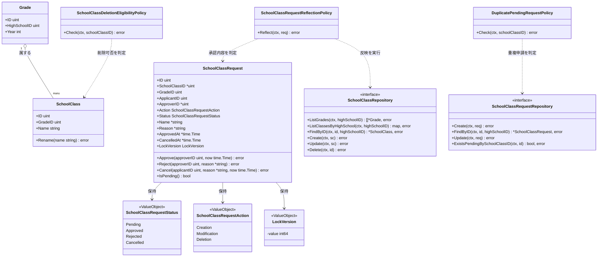
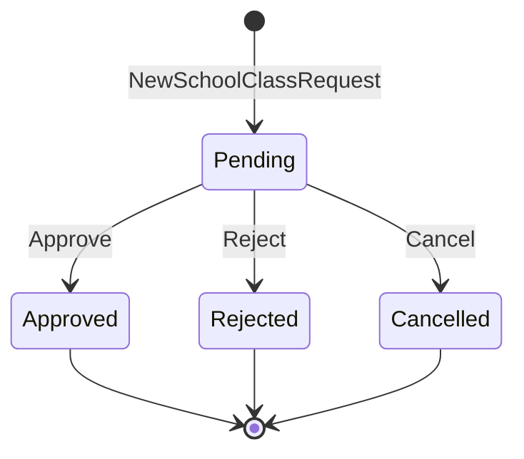
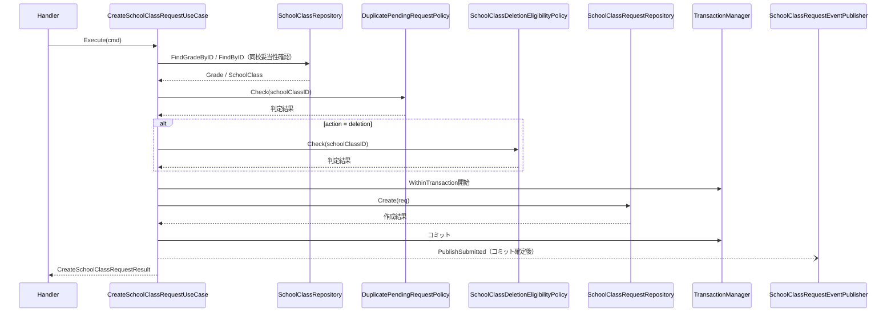
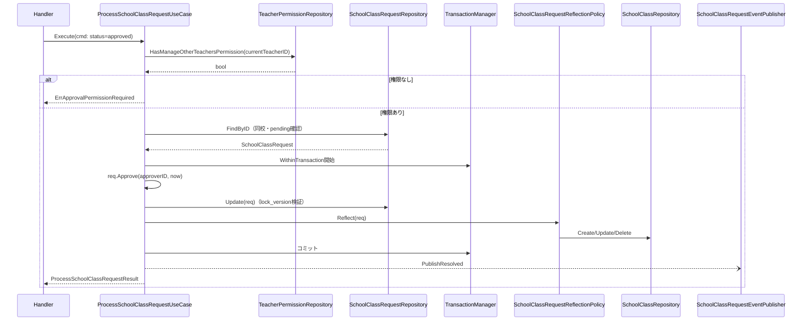
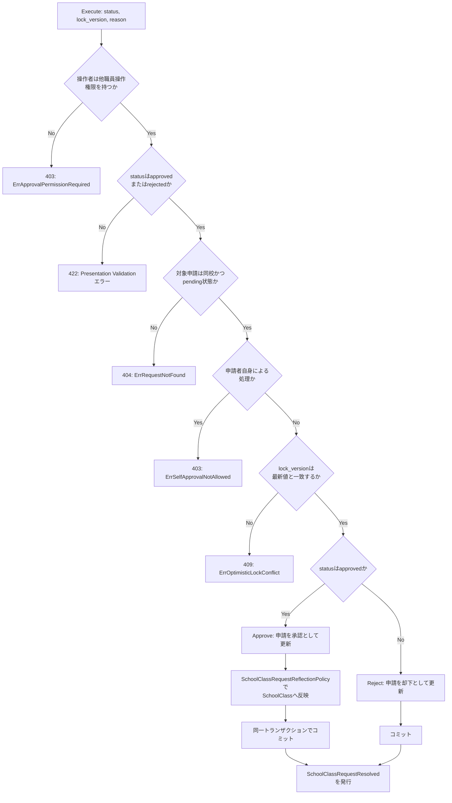

# クラス編成機能 Go実装仕様書

---

# 1. 機能概要

## 機能概要

学校の学年・クラス（組）の構成を管理する機能である。教師がクラスの新設・改名・削除を「申請」として提出し、他職員操作権限（`manage_other_teachers`）を持つ教師が承認・却下することでクラス構成（`school_classes`）へ反映する、承認ワークフロー型の機能である。承認された申請の内容は、申請レコードの更新と同一の処理単位でクラスデータへ反映される。削除申請は、対象クラスに在籍する生徒・所属する教員がいないことを条件とする。更新系操作（承認・却下・取消）は楽観ロック（`lock_version`）による競合検出を伴う。

## 採用設計パターンとその理由（②からの要約）

②「4. 設計パターン」により、本機能は **Domain Model** を採用する。

- `SchoolClassRequest`は「pending→approved/rejected/cancelled」という明示的な状態遷移ルールを持ち、承認・却下は他職員操作権限を持つ教師のみが行え、かつ申請者自身は自分の申請を承認・却下できないという当事者制約を持つ
- 承認時には、申請レコードの状態更新と、申請区分（新設・改名・削除）に応じたクラスデータへの反映を「一つの処理としてまとめて行い、途中で失敗した場合は両方とも反映されない」という、複数Entityにまたがる整合性ルールが存在する
- 削除申請は「対象クラスに在籍する生徒・所属する教員がいないこと」という、他Context（在籍・所属情報）を参照する業務ルールを満たさなければ受け付けられない
- 更新系操作には楽観ロックによる競合検出が必須である
- 申請区分ごとに必要な入力項目の組み合わせルールが異なる

以上の理由からTransaction Script・Active Record・Event Sourcingは不採用としている（②「4. 設計パターン」「24. 採用しなかった設計」）。本書はこの判断を変更しない。

## 本書が対象とする実装範囲

- Bounded Context: `school-class`
- 対象UseCase: `ListGradesUseCase` / `ListSchoolClassesUseCase` / `ShowSchoolClassUseCase` / `CreateSchoolClassRequestUseCase` / `ProcessSchoolClassRequestUseCase` / `CancelSchoolClassRequestUseCase`
- 規約「3. 設計パターンごとの構造適用方針」のDomain Model構造（`domain`/`application`/`infrastructure`/`presentation`のフルレイヤー構成）で実装する
- ①Rails実装の詳細（Controller/Service/Job等のコード内容）は本タスクでは提供されておらず、参照が必要な箇所は「①未提供のため参照不可」と明記する

---

# 2. ディレクトリ構成

## 対象Bounded Context名

- Context名（②）: `school-class`
- ディレクトリ名: `internal/school_class`（②からの補足: アーキテクチャ規約「8. 命名規約」に従いkebab-caseをスネークケースへ変換した。推測）

## ②で採用した設計パターン

Domain Model

## 作成するディレクトリ一覧

```
internal/school_class/
├── domain/
│   ├── entity/
│   ├── valueobject/
│   ├── repository/
│   ├── service/
│   ├── event/
│   └── errors/
├── application/
│   ├── dto/
│   └── usecase/
├── infrastructure/
│   ├── persistence/
│   │   └── gorm/
│   ├── repository/
│   └── queue/
└── presentation/
    ├── handler/
    ├── request/
    ├── response/
    └── routes.go
```

- `domain/specification/`: 対象外（②に該当する複雑な仕様判定パターンの記載がなく、業務ルールはDomain Service（3種のPolicy）として②8章に明記されているため）
- `infrastructure/mail/`・`infrastructure/cache/`: 対象外（②に該当する外部連携要件の記載がないため）

## 作成するファイル一覧

```
internal/school_class/domain/entity/grade.go
internal/school_class/domain/entity/school_class.go
internal/school_class/domain/entity/school_class_request.go

internal/school_class/domain/valueobject/school_class_request_status.go
internal/school_class/domain/valueobject/school_class_request_action.go
internal/school_class/domain/valueobject/lock_version.go

internal/school_class/domain/repository/school_class_repository.go
internal/school_class/domain/repository/school_class_request_repository.go
internal/school_class/domain/repository/class_occupancy_repository.go
internal/school_class/domain/repository/teacher_permission_repository.go

internal/school_class/domain/service/school_class_request_reflection_policy.go
internal/school_class/domain/service/school_class_deletion_eligibility_policy.go
internal/school_class/domain/service/duplicate_pending_request_policy.go

internal/school_class/domain/event/events.go

internal/school_class/domain/errors/errors.go

internal/school_class/application/dto/grade_dto.go
internal/school_class/application/dto/school_class_dto.go
internal/school_class/application/dto/school_class_request_dto.go

internal/school_class/application/usecase/transaction_manager.go
internal/school_class/application/usecase/event_publisher.go
internal/school_class/application/usecase/list_grades_usecase.go
internal/school_class/application/usecase/list_school_classes_usecase.go
internal/school_class/application/usecase/show_school_class_usecase.go
internal/school_class/application/usecase/create_school_class_request_usecase.go
internal/school_class/application/usecase/process_school_class_request_usecase.go
internal/school_class/application/usecase/cancel_school_class_request_usecase.go
internal/school_class/application/usecase/errors.go

internal/school_class/infrastructure/persistence/gorm/grade_model.go
internal/school_class/infrastructure/persistence/gorm/school_class_model.go
internal/school_class/infrastructure/persistence/gorm/school_class_request_model.go

internal/school_class/infrastructure/repository/school_class_repository.go
internal/school_class/infrastructure/repository/school_class_request_repository.go
internal/school_class/infrastructure/repository/class_occupancy_repository.go
internal/school_class/infrastructure/repository/teacher_permission_repository.go
internal/school_class/infrastructure/repository/transaction_manager.go

internal/school_class/infrastructure/queue/announcement_event_publisher.go

internal/school_class/presentation/handler/school_class_handler.go
internal/school_class/presentation/request/school_class_request.go
internal/school_class/presentation/response/school_class_response.go
internal/school_class/presentation/routes.go
```

**②からの補足**: `ClassOccupancyRepository`（在籍生徒・所属教員の存在確認）・`TeacherPermissionRepository`（他職員操作権限の確認）は、②「11. Repository設計」の「外部参照Repository（在籍する生徒・所属する教員）」および②「16. Authorization設計」の記載を、アーキテクチャ規約「6. Context間連携ルール」に従い具体的なRepository Interfaceとして具体化したものである。`TeacherPermissionRepository`は、Teacher Permission Contextの②③文書が本タスクでは提供されていないため、実装（Infrastructure層）の正確な参照先は「推測」である。`ClassOccupancyRepository`のうち、在籍生徒の確認は`user` Contextが所有する`users`が対象であり、`user`②が`CountUsers`を公開しているが、その③が未作成のため、対象テーブルへの直接クエリで暫定対応する。所属教員の確認は`users`ではなく`teacher_school_classes`が対象であり、このテーブルを所有・管理するContextは、現行の②群に定義されていない（書き込む機能が現行の対象範囲に存在しない参照専用の依存。②「3. Bounded Context」）。

---

# 3. Domain層設計

## Entity

### Grade（`domain/entity/grade.go`）

- struct名: `Grade`
- フィールド:

|フィールド|型|意味|
|-|-|-|
|`ID`|`uint`|学年ID|
|`HighSchoolID`|`uint`|所属校ID|
|`Year`|`int`|学年度・学年区分を表す値（②9章クラス図の`year`）|

- 公開メソッド一覧: なし（参照専用。②「6. Entity設計」：本機能内では作成・更新・削除されない）
- 不変条件: なし（他Context（School/Grade Context）が真正なデータを管理するため、本Contextでは取得結果をそのまま保持する）

### SchoolClass（`domain/entity/school_class.go`）

- struct名: `SchoolClass`
- フィールド:

|フィールド|型|意味|
|-|-|-|
|`ID`|`uint`|クラスID|
|`GradeID`|`uint`|所属学年ID|
|`Name`|`string`|クラス名|

- 公開メソッド一覧:

|メソッド|引数|戻り値|責務|
|-|-|-|-|
|`NewSchoolClass`|`(gradeID uint, name string) (*SchoolClass, error)`|`(*SchoolClass, error)`|新設時のクラスを生成するファクトリ（永続化前、IDは未採番）|
|`Rename`|`(name string)`|`error`|クラス名を変更する（改名申請の承認時に使用）|

- 不変条件: `Name`は空文字を許容しない、255文字以内であること（②15章「クラス名（255文字以内）の形式チェック」はPresentation層の責務だが、Entity側でも不変条件として二重に保証する。②「7. Value Object設計」の「Value Objectを採用しないもの」の方針どおりクラス名はValue Object化しない）

### SchoolClassRequest（`domain/entity/school_class_request.go`）

- struct名: `SchoolClassRequest`
- フィールド:

|フィールド|型|意味|
|-|-|-|
|`ID`|`uint`|申請ID|
|`SchoolClassID`|`*uint`|対象クラスID（改名・削除時のみ設定。新設時は`nil`）|
|`GradeID`|`uint`|対象学年ID|
|`ApplicantID`|`uint`|申請者（教師）ID|
|`ApproverID`|`*uint`|承認者ID（承認・却下されるまでは`nil`）|
|`Action`|`valueobject.SchoolClassRequestAction`|申請区分（creation/modification/deletion）|
|`Status`|`valueobject.SchoolClassRequestStatus`|申請状態|
|`Name`|`*string`|クラス名（新設・改名時のみ設定）|
|`Reason`|`*string`|理由（任意）|
|`ApprovedAt`|`*time.Time`|承認日時|
|`CancelledAt`|`*time.Time`|取消日時|
|`LockVersion`|`valueobject.LockVersion`|楽観ロック用バージョン|

- 公開メソッド一覧:

|メソッド|引数|戻り値|責務|
|-|-|-|-|
|`NewSchoolClassRequest`|`(applicantID uint, gradeID uint, action valueobject.SchoolClassRequestAction, name *string, schoolClassID *uint) (*SchoolClassRequest, error)`|`(*SchoolClassRequest, error)`|申請区分に応じた入力項目の整合性（②7章`SchoolClassRequestAction`のルール）を検証したうえで、`pending`状態の申請を生成するファクトリ|
|`Approve`|`(approverID uint, now time.Time) error`|`error`|`pending`から`approved`へ遷移させる。`pending`以外からの遷移、または`approverID == ApplicantID`（自己承認）の場合はエラーを返す|
|`Reject`|`(approverID uint, reason *string) error`|`error`|`pending`から`rejected`へ遷移させる。`pending`以外からの遷移、または`approverID == ApplicantID`の場合はエラーを返す|
|`Cancel`|`(applicantID uint, reason *string, now time.Time) error`|`error`|`pending`から`cancelled`へ遷移させる。`pending`以外からの遷移、または`applicantID != ApplicantID`（申請者本人でない）の場合はエラーを返す|
|`IsPending`|`()`|`bool`|`pending`状態かどうかを判定する|

- 不変条件（ファクトリで保証する内容）:
  - `Action`が`creation`の場合、`Name`は必須・`SchoolClassID`は`nil`であること
  - `Action`が`modification`の場合、`Name`・`SchoolClassID`ともに必須であること
  - `Action`が`deletion`の場合、`SchoolClassID`は必須・`Name`は`nil`であること
  - 生成直後の`Status`は常に`pending`

---

## Value Object

### SchoolClassRequestStatus（`domain/valueobject/school_class_request_status.go`）

- struct名: `SchoolClassRequestStatus`（`int`を基底としたenum型。コーディング規約「3. 命名規則」の`iota`・`stringer`方針に従う）
- フィールド: 内部的に`int`値を保持（`Pending` / `Approved` / `Rejected` / `Cancelled`の4定数）
- 生成時に検証するルール: 定義済み4値のいずれかであること
- 公開メソッド一覧: `NewSchoolClassRequestStatus(raw string) (SchoolClassRequestStatus, error)` / `(s SchoolClassRequestStatus) CanTransitionTo(target SchoolClassRequestStatus) bool`（`pending`からのみ他状態へ遷移可能というルールを判定） / `(s SchoolClassRequestStatus) String() string`（`stringer`生成）

### SchoolClassRequestAction（`domain/valueobject/school_class_request_action.go`）

- struct名: `SchoolClassRequestAction`（`int`を基底としたenum型。`Creation` / `Modification` / `Deletion`の3定数）
- 生成時に検証するルール: 定義済み3値のいずれかであること
- 公開メソッド一覧: `NewSchoolClassRequestAction(raw string) (SchoolClassRequestAction, error)` / `(a SchoolClassRequestAction) RequiresName() bool` / `(a SchoolClassRequestAction) RequiresTargetClass() bool` / `(a SchoolClassRequestAction) String() string`

### LockVersion（`domain/valueobject/lock_version.go`）

- struct名: `LockVersion`
- フィールド: `value int64`（非公開）
- 生成時に検証するルール: なし（クライアントから提示された値をそのまま保持する）
- 公開メソッド一覧: `NewLockVersion(v int64) LockVersion` / `(v LockVersion) Int64() int64`

## Value Objectを採用しないもの

- クラス名: ②「7. Value Object設計」の方針どおり、255文字以内という長さの制約はPresentation層の形式チェックとEntityの不変条件で十分に表現でき、独自の業務ルールを持たないためValue Object化しない

## Repository Interface

### SchoolClassRepository（`domain/repository/school_class_repository.go`）

|メソッド|引数|戻り値|責務|
|-|-|-|-|
|`ListGrades`|`(ctx context.Context, highSchoolID uint)`|`([]*entity.Grade, error)`|同校の学年一覧を取得する（②12章`ListGradesUseCase`）|
|`ListClassesByHighSchool`|`(ctx context.Context, highSchoolID uint)`|`(map[uint][]*entity.SchoolClass, error)`|学年IDをキーとした、同校の学年別クラス一覧を取得する（②12章`ListSchoolClassesUseCase`）|
|`FindByID`|`(ctx context.Context, schoolClassID uint, highSchoolID uint)`|`(*entity.SchoolClass, error)`|同校のクラス詳細を取得する。存在しない場合は`nil, nil`を返す|
|`FindGradeByID`|`(ctx context.Context, gradeID uint, highSchoolID uint)`|`(*entity.Grade, error)`|申請作成時、指定学年が同校に属するかを確認するために取得する。存在しない場合は`nil, nil`を返す|
|`Create`|`(ctx context.Context, sc *entity.SchoolClass)`|`error`|承認された新設申請の反映としてクラスを新規作成する|
|`Update`|`(ctx context.Context, sc *entity.SchoolClass)`|`error`|承認された改名申請の反映としてクラス名を更新する|
|`Delete`|`(ctx context.Context, schoolClassID uint)`|`error`|承認された削除申請の反映としてクラスを削除する。外部キー制約があるため、対象クラスの`teacher_school_classes`の行を先に削除し、同一トランザクションでクラスを削除する（Rails現行の`dependent: :destroy`に相当する連動削除。②「3. Bounded Context」）|

- 保持しない責務: 申請の状態遷移・承認可否の判定（②9章）

### SchoolClassRequestRepository（`domain/repository/school_class_request_repository.go`）

|メソッド|引数|戻り値|責務|
|-|-|-|-|
|`Create`|`(ctx context.Context, req *entity.SchoolClassRequest)`|`error`|申請を新規作成する|
|`FindByID`|`(ctx context.Context, id uint, highSchoolID uint)`|`(*entity.SchoolClassRequest, error)`|同校の申請を取得する（Gradeを介した間接的な絞り込み。②21章）。存在しない場合は`nil, nil`を返す|
|`Update`|`(ctx context.Context, req *entity.SchoolClassRequest)`|`error`|楽観ロック付きで申請の状態を更新する。`LockVersion`が一致しない場合は`domainerror.ErrOptimisticLockConflict`（Gorm規約12章の共有エラー）を返す|
|`ExistsPendingBySchoolClassID`|`(ctx context.Context, schoolClassID uint)`|`(bool, error)`|同一クラスに対する承認待ち（pending）の申請が存在するかを確認する|

- 保持しない責務: クラスデータへの反映そのもの（`SchoolClassRepository`の責務）

### ClassOccupancyRepository（`domain/repository/class_occupancy_repository.go`、在籍生徒は`user` Context所有の`users`・所属教員は`teacher_school_classes`の参照専用）

|メソッド|引数|戻り値|責務|
|-|-|-|-|
|`HasEnrolledStudents`|`(ctx context.Context, schoolClassID uint)`|`(bool, error)`|対象クラスに在籍する生徒が1人以上いるかを確認する。無効化済み（`deleted_at`あり）のユーザーも含めて確認する（②「3. Bounded Context」。`user`②の`CountUsers`をクラス指定・無効化済みを含む指定で呼び出す場合に相当する）|
|`HasAssignedTeachers`|`(ctx context.Context, schoolClassID uint)`|`(bool, error)`|対象クラスに所属する教員が1人以上いるかを、`teacher_school_classes`に対象クラスの行があるかで確認する。担任・副担任（`role`）の別は問わず、教員の`users`が無効化済みであっても、行があれば所属するとみなす|

### TeacherPermissionRepository（`domain/repository/teacher_permission_repository.go`、Teacher Permission Context参照専用）

|メソッド|引数|戻り値|責務|
|-|-|-|-|
|`HasManageOtherTeachersPermission`|`(ctx context.Context, teacherID uint)`|`(bool, error)`|指定教師が「他職員操作権限（`manage_other_teachers`）」を保持しているかを確認する|

## Domain Service

### SchoolClassRequestReflectionPolicy（`domain/service/school_class_request_reflection_policy.go`）

- struct名: `SchoolClassRequestReflectionPolicy`
- コンストラクタ: `NewSchoolClassRequestReflectionPolicy(schoolClassRepo repository.SchoolClassRepository) *SchoolClassRequestReflectionPolicy`
- 公開メソッド: `(p *SchoolClassRequestReflectionPolicy) Reflect(ctx context.Context, req *entity.SchoolClassRequest) error`
- 責務: 承認された申請（`req.Action`・`req.Name`・`req.SchoolClassID`）から、`SchoolClassRepository`の`Create`/`Update`/`Delete`のいずれを呼び出すべきかを判定し、実行する（②8章）

### SchoolClassDeletionEligibilityPolicy（`domain/service/school_class_deletion_eligibility_policy.go`）

- struct名: `SchoolClassDeletionEligibilityPolicy`
- コンストラクタ: `NewSchoolClassDeletionEligibilityPolicy(occupancyRepo repository.ClassOccupancyRepository) *SchoolClassDeletionEligibilityPolicy`
- 公開メソッド: `(p *SchoolClassDeletionEligibilityPolicy) Check(ctx context.Context, schoolClassID uint) error`
- 責務: 削除申請の対象クラスに、在籍する生徒または所属する教員が1人もいないことを判定する。いずれかが存在する場合は`domainerrors.ErrClassHasOccupants`を返す（②8章）

### DuplicatePendingRequestPolicy（`domain/service/duplicate_pending_request_policy.go`）

- struct名: `DuplicatePendingRequestPolicy`
- コンストラクタ: `NewDuplicatePendingRequestPolicy(requestRepo repository.SchoolClassRequestRepository) *DuplicatePendingRequestPolicy`
- 公開メソッド: `(p *DuplicatePendingRequestPolicy) Check(ctx context.Context, schoolClassID uint) error`
- 責務: 同一クラスに対して承認待ち（pending）の申請が既に存在しないかを判定する。存在する場合は`domainerrors.ErrDuplicatePendingRequest`を返す（②8章）

## Domain Event

②「18. Domain Event」により採用する。

### SchoolClassRequestSubmitted（`domain/event/events.go`）

- イベントstruct名: `SchoolClassRequestSubmitted`
- 保持するフィールド: `RequestID uint` / `HighSchoolID uint` / `ApplicantID uint` / `GradeID uint` / `Action string` / `OccurredAt time.Time`
- 発火元: `CreateSchoolClassRequestUseCase`（申請がpending状態で作成された直後。②18章）

### SchoolClassRequestResolved（`domain/event/events.go`）

- イベントstruct名: `SchoolClassRequestResolved`
- 保持するフィールド: `RequestID uint` / `HighSchoolID uint` / `ApplicantID uint` / `ApproverID uint` / `Status string` / `OccurredAt time.Time`
- 発火元: `ProcessSchoolClassRequestUseCase`（申請がapproved/rejectedのいずれかに更新された直後。②18章）。`CancelSchoolClassRequestUseCase`（取消）からは発火しない（②18章「発火タイミング」に明記された対象操作に取消は含まれない）

## Domain Error（`domain/errors/errors.go`）

`errors.New`によるセンチネルエラー変数として定義する（②「17. Error設計」のDomain Errorに対応）。

|変数名|発生条件|
|-|-|
|`ErrInvalidStatusTransition`|`pending`以外の状態からの承認・却下・取消試行|
|`ErrSelfApprovalNotAllowed`|申請者自身が自分の申請を承認・却下しようとした|
|`ErrRequestActionMismatch`|申請区分に応じた入力項目（クラス名・対象クラス）が不整合|
|`ErrClassHasOccupants`|削除申請の対象クラスに在籍者・所属教員が存在する|
|`ErrDuplicatePendingRequest`|同一クラスへの承認待ち申請が既に存在する|

`domainerror.ErrOptimisticLockConflict`（Gorm規約「12. 楽観ロック」の共有エラー、配置場所`internal/shared/domainerror`）は本機能固有のエラーではないため上記一覧には含めない。

---

# 4. クラス図



---

# 5. 状態遷移図



禁止される遷移: `Pending`以外からの`Approve`/`Reject`/`Cancel`呼び出しはすべて`ErrInvalidStatusTransition`を返す（`SchoolClassRequestStatus.CanTransitionTo`で判定）。

---

# 6. Application層設計

## DTO（Command / Query）

|struct名|フィールドと型|区分|
|-|-|-|
|`ListGradesQuery`|`CurrentTeacherHighSchoolID uint`|Query|
|`GradeDTO`|`ID uint`, `Year int`|出力|
|`ListGradesResult`|`Grades []GradeDTO`|出力|
|`ListSchoolClassesQuery`|`CurrentTeacherHighSchoolID uint`|Query|
|`SchoolClassDTO`|`ID uint`, `Name string`|出力|
|`GradeWithClassesDTO`|`Grade GradeDTO`, `Classes []SchoolClassDTO`|出力|
|`ListSchoolClassesResult`|`Grades []GradeWithClassesDTO`|出力|
|`ShowSchoolClassQuery`|`CurrentTeacherHighSchoolID uint`, `SchoolClassID uint`|Query|
|`ShowSchoolClassResult`|`ID uint`, `Name string`|出力|
|`CreateSchoolClassRequestCommand`|`CurrentTeacherID uint`, `CurrentTeacherHighSchoolID uint`, `Action string`, `GradeID uint`, `Name *string`, `SchoolClassID *uint`|Command|
|`CreateSchoolClassRequestResult`|`ID uint`|出力|
|`ProcessSchoolClassRequestCommand`|`CurrentTeacherID uint`, `CurrentTeacherHighSchoolID uint`, `RequestID uint`, `Status string`, `LockVersion int64`, `Reason *string`|Command|
|`ProcessSchoolClassRequestResult`|`ID uint`, `Status string`|出力|
|`CancelSchoolClassRequestCommand`|`CurrentTeacherID uint`, `CurrentTeacherHighSchoolID uint`, `RequestID uint`, `Reason *string`|Command|
|`CancelSchoolClassRequestResult`|`ID uint`, `Status string`|出力|

## UseCase

### ListGradesUseCase（`application/usecase/list_grades_usecase.go`）

- struct名: `ListGradesUseCase`
- コンストラクタが受け取る依存: `SchoolClassRepository`
- 公開メソッド: `(u *ListGradesUseCase) Execute(ctx context.Context, query dto.ListGradesQuery) (dto.ListGradesResult, error)`
- 処理ステップ: 1. `SchoolClassRepository.ListGrades`を呼び出す 2. `ListGradesResult`を組み立てて返す
- トランザクション境界: なし（読み取りのみ）
- 発生しうるApplication Error: なし

### ListSchoolClassesUseCase（`application/usecase/list_school_classes_usecase.go`）

- struct名: `ListSchoolClassesUseCase`
- コンストラクタが受け取る依存: `SchoolClassRepository`
- 公開メソッド: `(u *ListSchoolClassesUseCase) Execute(ctx context.Context, query dto.ListSchoolClassesQuery) (dto.ListSchoolClassesResult, error)`
- 処理ステップ: 1. `SchoolClassRepository.ListGrades`で学年一覧を取得する 2. `SchoolClassRepository.ListClassesByHighSchool`で学年別クラス一覧を取得する 3. 両者を組み合わせて`ListSchoolClassesResult`を構築する
- トランザクション境界: なし
- 発生しうるApplication Error: なし

### ShowSchoolClassUseCase（`application/usecase/show_school_class_usecase.go`）

- struct名: `ShowSchoolClassUseCase`
- コンストラクタが受け取る依存: `SchoolClassRepository`
- 公開メソッド: `(u *ShowSchoolClassUseCase) Execute(ctx context.Context, query dto.ShowSchoolClassQuery) (dto.ShowSchoolClassResult, error)`
- 処理ステップ: 1. `SchoolClassRepository.FindByID`を呼び出す 2. 見つからない場合は`ErrSchoolClassNotFound`を返す 3. `ShowSchoolClassResult`へ変換して返す
- トランザクション境界: なし
- 発生しうるApplication Error: `ErrSchoolClassNotFound`

### CreateSchoolClassRequestUseCase（`application/usecase/create_school_class_request_usecase.go`）

- struct名: `CreateSchoolClassRequestUseCase`
- コンストラクタが受け取る依存: `SchoolClassRepository`, `SchoolClassRequestRepository`, `*service.SchoolClassDeletionEligibilityPolicy`, `*service.DuplicatePendingRequestPolicy`, `TransactionManager`, `SchoolClassRequestEventPublisher`
- 公開メソッド: `(u *CreateSchoolClassRequestUseCase) Execute(ctx context.Context, cmd dto.CreateSchoolClassRequestCommand) (dto.CreateSchoolClassRequestResult, error)`
- 処理ステップ:
  1. `valueobject.NewSchoolClassRequestAction(cmd.Action)`で申請区分を検証する
  2. `SchoolClassRepository.FindGradeByID`で指定学年が同校に属するかを確認する。属さない、または存在しない場合は`ErrGradeNotFound`を返す
  3. `cmd.SchoolClassID`が指定されている場合（改名・削除）、`SchoolClassRepository.FindByID`で対象クラスが指定学年に属するかを確認する
  4. `DuplicatePendingRequestPolicy.Check`で同一クラスへの重複申請がないか判定する
  5. `Action`が`deletion`の場合、`SchoolClassDeletionEligibilityPolicy.Check`で在籍者・所属教員の不在を判定する
  6. `entity.NewSchoolClassRequest(...)`で`pending`状態の申請を生成する
  7. `TransactionManager.WithinTransaction`内で`SchoolClassRequestRepository.Create`を実行する
  8. コミット後、`SchoolClassRequestEventPublisher.PublishSubmitted`で`SchoolClassRequestSubmitted`を発行する
  9. `CreateSchoolClassRequestResult`を返す
- トランザクション境界: 申請の作成を1トランザクションとする（②14章）。イベント発行はコミット確定後に行う
- 発生しうるApplication Error: `ErrGradeNotFound`
- 発生しうるDomain Error: `ErrRequestActionMismatch`, `ErrClassHasOccupants`, `ErrDuplicatePendingRequest`

### ProcessSchoolClassRequestUseCase（`application/usecase/process_school_class_request_usecase.go`）

- struct名: `ProcessSchoolClassRequestUseCase`
- コンストラクタが受け取る依存: `SchoolClassRequestRepository`, `TeacherPermissionRepository`, `*service.SchoolClassRequestReflectionPolicy`, `TransactionManager`, `SchoolClassRequestEventPublisher`
- 公開メソッド: `(u *ProcessSchoolClassRequestUseCase) Execute(ctx context.Context, cmd dto.ProcessSchoolClassRequestCommand) (dto.ProcessSchoolClassRequestResult, error)`
- 処理ステップ:
  1. `TeacherPermissionRepository.HasManageOtherTeachersPermission(ctx, cmd.CurrentTeacherID)`を確認する。`false`の場合は`ErrApprovalPermissionRequired`を返す（②16章）
  2. `SchoolClassRequestRepository.FindByID`で対象申請（同校スコープ）を取得する。取得できない場合は`ErrRequestNotFound`を返す
  3. `req.LockVersion`が`cmd.LockVersion`と一致するかを事前確認する（一致しない場合、後続の`Update`で`ErrOptimisticLockConflict`として検出される。詳細は「11. Transaction実装方針」参照）
  4. `TransactionManager.WithinTransaction`内で以下を実行する:
     a. `cmd.Status`が`approved`の場合、`req.Approve(cmd.CurrentTeacherID, now)`を呼び出す。`rejected`の場合、`req.Reject(cmd.CurrentTeacherID, cmd.Reason)`を呼び出す
     b. `SchoolClassRequestRepository.Update(ctx, req)`で状態を永続化する（楽観ロック検証を含む）
     c. `approved`の場合のみ、`SchoolClassRequestReflectionPolicy.Reflect(ctx, req)`でクラスデータへ反映する
  5. コミット後、`SchoolClassRequestEventPublisher.PublishResolved`で`SchoolClassRequestResolved`を発行する
  6. `ProcessSchoolClassRequestResult`を返す
- トランザクション境界: 申請の状態更新と（承認の場合の）クラスデータへの反映を1トランザクションとする。アーキテクチャ規約「11. Transaction実装パターン」の`TransactionManager`で`SchoolClassRequestRepository`と`SchoolClassRepository`にまたがる処理をまとめる（②14章）
- 発生しうるApplication Error: `ErrRequestNotFound`, `ErrApprovalPermissionRequired`, `domainerror.ErrOptimisticLockConflict`
- 発生しうるDomain Error: `ErrInvalidStatusTransition`, `ErrSelfApprovalNotAllowed`

### CancelSchoolClassRequestUseCase（`application/usecase/cancel_school_class_request_usecase.go`）

- struct名: `CancelSchoolClassRequestUseCase`
- コンストラクタが受け取る依存: `SchoolClassRequestRepository`, `TransactionManager`
- 公開メソッド: `(u *CancelSchoolClassRequestUseCase) Execute(ctx context.Context, cmd dto.CancelSchoolClassRequestCommand) (dto.CancelSchoolClassRequestResult, error)`
- 処理ステップ:
  1. `SchoolClassRequestRepository.FindByID`で対象申請（同校スコープ）を取得する。取得できない場合は`ErrRequestNotFound`を返す
  2. `TransactionManager.WithinTransaction`内で`req.Cancel(cmd.CurrentTeacherID, cmd.Reason, now)`を呼び出し、`SchoolClassRequestRepository.Update`で永続化する
  3. `CancelSchoolClassRequestResult`を返す
- トランザクション境界: 申請の状態更新を1トランザクションとする
- 発生しうるApplication Error: `ErrRequestNotFound`, `domainerror.ErrOptimisticLockConflict`
- 発生しうるDomain Error: `ErrInvalidStatusTransition`（`pending`以外の取消試行）、`ErrNotRequestOwner`（申請者本人でない取消試行。②「Entity設計」の`Cancel`が返す）

---

# 7. シーケンス図・処理フロー図

## シーケンス図

### CreateSchoolClassRequestUseCase



### ProcessSchoolClassRequestUseCase（承認）



## 処理フロー図

### ProcessSchoolClassRequestUseCase



---

# 8. Infrastructure層設計

## Repository実装

### SchoolClassRepository実装（`infrastructure/repository/school_class_repository.go`）

- 実装struct名: 非公開struct（例: `schoolClassRepository`）+ コンストラクタ`NewSchoolClassRepository`
- 対応するGORMモデル: `gormmodel.GradeModel`（テーブル`grades`）, `gormmodel.SchoolClassModel`（テーブル`school_classes`）
- 各メソッドで発行するクエリ内容:

|メソッド|条件|備考|
|-|-|-|
|`ListGrades`|`high_school_id = ?`|全件取得（②21章：ページネーション不要）|
|`ListClassesByHighSchool`|`grades`と`school_classes`を`grade_id`で結合し、`high_school_id = ?`|学年IDをキーとしたmapへ変換して返す|
|`FindByID`|`id = ?`（`school_classes`）。同校確認は`grades`との結合、または取得後の`grade.HighSchoolID`比較で行う|-|
|`FindGradeByID`|`id = ? AND high_school_id = ?`（`grades`）|-|
|`Create`|`school_classes`へ1件INSERT|-|
|`Update`|`id = ?`条件で`name`を更新|-|
|`Delete`|`teacher_school_classes`を`school_class_id = ?`条件でDELETEしたうえで、`id = ?`条件でDELETE（②20章：物理削除／論理削除いずれかは推測、17章参照）|同一トランザクション内で実行する|

- Entity ⇔ GORMモデルの変換方針: 各モデルから対応Entityへの非公開変換関数（`toEntity`）、逆方向（`fromEntity`）をrepository実装内に用意する

### SchoolClassRequestRepository実装（`infrastructure/repository/school_class_request_repository.go`）

- 実装struct名: 非公開struct（例: `schoolClassRequestRepository`）+ コンストラクタ`NewSchoolClassRequestRepository`
- 対応するGORMモデル: `gormmodel.SchoolClassRequestModel`（テーブル`school_class_requests`）
- 各メソッドで発行するクエリ内容:

|メソッド|条件|備考|
|-|-|-|
|`Create`|`school_class_requests`へ1件INSERT|-|
|`FindByID`|`id = ?`かつ、`grades`との結合または事前取得した`high_school_id`との比較による同校確認|Gorm規約「5. アソシエーション」の方針どおり明示的な結合／個別クエリを用いる|
|`Update`|`id = ?`条件で`status`・`approver_id`・`approved_at`・`cancelled_at`・`reason`を更新。`lock_version`列との一致条件をGORMの`optimisticlock.Version`機構で自動付与する（Gorm規約「12. 楽観ロック」）。`RowsAffected == 0`の場合は`domainerror.ErrOptimisticLockConflict`を返す|-|
|`ExistsPendingBySchoolClassID`|`school_class_id = ? AND status = 'pending'`の件数確認|-|

- Entity ⇔ GORMモデルの変換方針: `LockVersion`（Domain、プレーンな`int64`）⇔`optimisticlock.Version`（GORM）の相互変換をrepository実装内の変換関数で行う（Gorm規約「12. 楽観ロック」の「Domain EntityとGORMモデルの分離」方針）

### ClassOccupancyRepository実装（`infrastructure/repository/class_occupancy_repository.go`）

- 実装struct名: 非公開struct + コンストラクタ`NewClassOccupancyRepository`
- 対応するGORMモデル: `user` Context所有の`users`テーブル（`school_class_id`列を参照専用で読み取る最小フィールド定義）、`teacher_school_classes`テーブル（`school_class_id`列を参照専用で読み取る最小フィールド定義。所有するContextは現行の②群に定義されていない。17章参照）。`user`②の③が未作成のため、`users`は`user`の`CountUsers`を呼び出さず、対象テーブルへの直接クエリで暫定対応する。`user`の③が整備された時点で、`CountUsers`（クラス指定・無効化済みを含む）の呼び出しへの置き換えを検討する
- クエリ内容: `HasEnrolledStudents`は`users`の`school_class_id = ?`の件数確認（`deleted_at`による絞り込みは行わず、無効化済みも含める）、`HasAssignedTeachers`は`teacher_school_classes`の`school_class_id = ?`の件数確認（`role`による絞り込みは行わない）

### TeacherPermissionRepository実装（`infrastructure/repository/teacher_permission_repository.go`）

- 実装struct名: 非公開struct + コンストラクタ`NewTeacherPermissionRepository`
- 対応するGORMモデル: `teacher_permissions`テーブル（参照専用の最小フィールド定義。教師教員管理機能側のモデルとは別に本Context用に定義する。②「9. 命名規約」に反しない独立モデル）
- クエリ内容: `teacher_id = ?`で1件取得し、`manage_other_teachers`列を返す

## 外部連携実装

|実装対象|呼び出し元|実装方針|
|-|-|-|
|`SchoolClassRequestEventPublisher`実装（`infrastructure/queue/announcement_event_publisher.go`）|`CreateSchoolClassRequestUseCase.PublishSubmitted`, `ProcessSchoolClassRequestUseCase.PublishResolved`|アーキテクチャ規約「13. 非同期ジョブ実行パターン」の「ベストエフォートで良い処理」として実装する（②18章「採用理由」）。`jobs`テーブルを経由せず、UseCaseのコミット確定後に`go func() { ctx := context.Background(); ... }()`でgoroutineを起動し、Announcement Contextが公開する通知作成手段（お知らせ機能と共通の仕組み。正確なpackage pathは②に明記がなく「推測」）を呼び出す|

Mail・Cacheは対象外。

---

# 9. Presentation層設計

## Handler

### SchoolClassHandler（`presentation/handler/school_class_handler.go`）

- struct名: `SchoolClassHandler`
- 対応する呼び出し先: `*usecase.ListGradesUseCase`, `*usecase.ListSchoolClassesUseCase`, `*usecase.ShowSchoolClassUseCase`, `*usecase.CreateSchoolClassRequestUseCase`, `*usecase.ProcessSchoolClassRequestUseCase`, `*usecase.CancelSchoolClassRequestUseCase`
- メソッド一覧:

|メソッド|HTTPメソッド|パス|
|-|-|-|
|`ListGrades`|GET|`/api/v1/teacher/grades`|
|`ListSchoolClasses`|GET|`/api/v1/teacher/school_classes`|
|`ShowSchoolClass`|GET|`/api/v1/teacher/school_classes/:id`|
|`CreateSchoolClassRequest`|POST|`/api/v1/teacher/school_class_requests`|
|`ProcessSchoolClassRequest`|PATCH|`/api/v1/teacher/school_class_requests/:id`|
|`CancelSchoolClassRequest`|DELETE|`/api/v1/teacher/school_class_requests/:id`|

- `ListGrades`/`ListSchoolClasses`処理順序: current teacherの所属校IDを取得 → 対応するUseCaseを呼び出す → Response DTOへ変換し200を返す
- `ShowSchoolClass`処理順序: パスパラメータ`id`バインド → `ShowSchoolClassUseCase.Execute`呼び出し → 存在しない場合404、成功時200
- `CreateSchoolClassRequest`処理順序: リクエストバインド（`request.CreateSchoolClassRequestRequest`）→ Presentation Validation（action・grade_id必須、name/school_class_idの形式チェック）→ current teacherの情報を付与し`CreateSchoolClassRequestUseCase.Execute`呼び出し → 成功時`message`を201で返す（②19章）
- `ProcessSchoolClassRequest`処理順序: パスパラメータ`id`＋リクエストバインド（`request.ProcessSchoolClassRequestRequest`）→ Presentation Validation（status必須・approved/rejectedのいずれか、lock_version必須）→ `ProcessSchoolClassRequestUseCase.Execute`呼び出し → 結果に応じたmessageと200を返す
- `CancelSchoolClassRequest`処理順序: パスパラメータ`id`＋リクエストバインド（`request.CancelSchoolClassRequestRequest`）→ `CancelSchoolClassRequestUseCase.Execute`呼び出し → 成功時`message`を200で返す

## Request / Response DTO

### Request（`presentation/request/school_class_request.go`）

|struct名|フィールドと型|バリデーションタグ／チェック内容|
|-|-|-|
|`CreateSchoolClassRequestRequest`|`Action string`|`binding:"required,oneof=creation modification deletion"`|
| |`GradeID uint`|`binding:"required"`|
| |`Name *string`|`binding:"omitempty,max=255"`（②15章：新設・改名時必須は業務ルールとしてApplication/Domain側で検証。ここでは形式のみ）|
| |`SchoolClassID *uint`|`binding:"omitempty"`|
|`ProcessSchoolClassRequestRequest`|`Status string`|`binding:"required,oneof=approved rejected"`|
| |`LockVersion int64`|`binding:"required"`|
| |`Reason *string`|`binding:"omitempty,max=10000"`|
|`CancelSchoolClassRequestRequest`|`Reason *string`|`binding:"omitempty,max=10000"`|

### Response（`presentation/response/school_class_response.go`）

|struct名|フィールドと型|
|-|-|
|`GradeResponse`|`ID uint`, `Year int`|
|`SchoolClassResponse`|`ID uint`, `Name string`|
|`GradeWithClassesResponse`|`Grade GradeResponse`, `Classes []SchoolClassResponse`|
|`GradeListResponse`|`Grades []GradeResponse`|
|`SchoolClassListResponse`|`Grades []GradeWithClassesResponse`|
|`SchoolClassDetailResponse`|`ID uint`, `Name string`|
|`MessageResponse`|`Message string`|

## Routing（`presentation/routes.go`）

|Method|Path|Handler|
|-|-|-|
|GET|`/api/v1/teacher/grades`|`SchoolClassHandler.ListGrades`|
|GET|`/api/v1/teacher/school_classes`|`SchoolClassHandler.ListSchoolClasses`|
|GET|`/api/v1/teacher/school_classes/:id`|`SchoolClassHandler.ShowSchoolClass`|
|POST|`/api/v1/teacher/school_class_requests`|`SchoolClassHandler.CreateSchoolClassRequest`|
|PATCH|`/api/v1/teacher/school_class_requests/:id`|`SchoolClassHandler.ProcessSchoolClassRequest`|
|DELETE|`/api/v1/teacher/school_class_requests/:id`|`SchoolClassHandler.CancelSchoolClassRequest`|

全ルートに、teacherロールを要求する認証Middlewareを適用する（②16章）。

---

# 10. API仕様

|Method|Path|Handler|Request|Response|Status Code|
|-|-|-|-|-|-|
|GET|/api/v1/teacher/grades|SchoolClassHandler.ListGrades|-|GradeListResponse|200|
|GET|/api/v1/teacher/school_classes|SchoolClassHandler.ListSchoolClasses|-|SchoolClassListResponse|200|
|GET|/api/v1/teacher/school_classes/:id|SchoolClassHandler.ShowSchoolClass|id（path）|SchoolClassDetailResponse|200|
|POST|/api/v1/teacher/school_class_requests|SchoolClassHandler.CreateSchoolClassRequest|CreateSchoolClassRequestRequest|MessageResponse|201|
|PATCH|/api/v1/teacher/school_class_requests/:id|SchoolClassHandler.ProcessSchoolClassRequest|id（path）+ ProcessSchoolClassRequestRequest|MessageResponse|200|
|DELETE|/api/v1/teacher/school_class_requests/:id|SchoolClassHandler.CancelSchoolClassRequest|id（path）+ CancelSchoolClassRequestRequest|MessageResponse|200|

## Errorケース

|Endpoint|条件|Status Code|Error内容|
|-|-|-|-|
|ShowSchoolClass|対象クラスが存在しない|404|`ErrSchoolClassNotFound`|
|CreateSchoolClassRequest|action/grade_id未指定、name/school_class_idの形式不正|422|Presentation Validationエラー|
|CreateSchoolClassRequest|指定学年が同校でない|404|`ErrGradeNotFound`|
|CreateSchoolClassRequest|申請区分に応じた入力項目が不整合|422|`ErrRequestActionMismatch`|
|CreateSchoolClassRequest|削除申請の対象クラスに在籍者・所属教員が存在する|422|`ErrClassHasOccupants`|
|CreateSchoolClassRequest|同一クラスへの重複申請|422|`ErrDuplicatePendingRequest`|
|ProcessSchoolClassRequest|statusが指定できない値|422|Presentation Validationエラー|
|ProcessSchoolClassRequest|操作者が他職員操作権限を持たない|403|`ErrApprovalPermissionRequired`|
|ProcessSchoolClassRequest|申請者自身による承認・却下|403|`ErrSelfApprovalNotAllowed`|
|ProcessSchoolClassRequest|対象申請が存在しない、または同校でない|404|`ErrRequestNotFound`|
|ProcessSchoolClassRequest|lock_versionが最新値と不一致|409|`domainerror.ErrOptimisticLockConflict`|
|CancelSchoolClassRequest|申請者本人でない取消試行|403（推測、17章参照）|`ErrNotRequestOwner`|
|CancelSchoolClassRequest|承認待ちでない申請の取消|422|`ErrInvalidStatusTransition`|
|CancelSchoolClassRequest|対象申請が存在しない、または同校でない|404|`ErrRequestNotFound`|
|全Endpoint共通|予期せぬDB接続失敗等|500|Infrastructure Error|

---

# 11. Transaction実装方針

## Transaction開始箇所

アーキテクチャ規約「11. Transaction実装パターン（TransactionManager）」に従い、`TransactionManager`インターフェース（`application/usecase/transaction_manager.go`）を定義し、書き込みを伴うUseCase（`CreateSchoolClassRequestUseCase` / `ProcessSchoolClassRequestUseCase` / `CancelSchoolClassRequestUseCase`）の開始時にトランザクションを開始する。

- interface名: `TransactionManager`
- メソッドシグネチャ: `WithinTransaction(ctx context.Context, fn func(ctx context.Context) error) error`
- 実装: `infrastructure/repository/transaction_manager.go`でGORMの`*gorm.DB.Transaction`を用いて実装する

## Transaction終了箇所（Commit / Rollback条件）

|UseCase|終了箇所|
|-|-|
|ListGradesUseCase / ListSchoolClassesUseCase / ShowSchoolClassUseCase|トランザクションを使用しない（読み取りのみ）|
|CreateSchoolClassRequestUseCase|`SchoolClassRequestRepository.Create`が完了した時点でコミット、失敗でロールバック。イベント発行はコミット確定後|
|ProcessSchoolClassRequestUseCase|`SchoolClassRequestRepository.Update`と（承認時の）`SchoolClassRequestReflectionPolicy.Reflect`（内部で`SchoolClassRepository`のCreate/Update/Deleteを呼ぶ）の両方が完了した時点でコミット。いずれかの失敗でロールバック|
|CancelSchoolClassRequestUseCase|`SchoolClassRequestRepository.Update`が完了した時点でコミット|

## 複数Repositoryにまたがる場合の扱い

`ProcessSchoolClassRequestUseCase`は`SchoolClassRequestRepository`と`SchoolClassRepository`の両方を、1つの`TransactionManager.WithinTransaction`スコープ内で呼び出し、「申請レコードの更新とクラスデータへの反映のいずれか一方のみが成功する」不整合を防ぐ（②14章）。`TeacherPermissionRepository`・`ClassOccupancyRepository`・`DuplicatePendingRequestPolicy`が参照するクエリは、いずれも書き込みトランザクションの外（事前確認）で読み取り専用として実行する。

---

# 12. Validation実装方針

## Presentation

|フィールド|struct名|バリデーションタグ|エラーメッセージ|
|-|-|-|-|
|`action`|`CreateSchoolClassRequestRequest`|`required,oneof=creation modification deletion`|`errors`（申請区分不正）|
|`grade_id`|`CreateSchoolClassRequestRequest`|`required`|`errors`（学年未指定）|
|`name`|`CreateSchoolClassRequestRequest`|`omitempty,max=255`|`errors`（クラス名不正）|
|`school_class_id`|`CreateSchoolClassRequestRequest`|`omitempty`|`errors`（対象クラス未指定）|
|`status`|`ProcessSchoolClassRequestRequest`|`required,oneof=approved rejected`|「指定できないステータスです」|
|`lock_version`|`ProcessSchoolClassRequestRequest`|`required`|楽観ロック競合時「他のユーザーによってデータが更新されています。再読み込みしてください」|
|`reason`|各Request|`omitempty,max=10000`|`errors`（理由が長すぎる）|

## 業務ルール検証

Domain Model採用のため、Entity／Value Object生成時・UseCase内で以下を検証する。

- `valueobject.NewSchoolClassRequestAction`: 定義済み3値のいずれかであることの検証
- `entity.NewSchoolClassRequest`: 申請区分に応じた入力項目（クラス名・対象クラス）の整合性検証（②7章`SchoolClassRequestAction`のルール）
- `SchoolClassDeletionEligibilityPolicy.Check`: 削除申請の在籍者・所属教員不在チェック
- `DuplicatePendingRequestPolicy.Check`: 同一クラスへの重複申請チェック
- `entity.SchoolClassRequest.Approve` / `Reject` / `Cancel`: 状態遷移が許可された組み合わせかどうか（`pending`からのみ）、操作者が申請者本人でないこと（承認・却下）／申請者本人であること（取消）
- Repository実装（`Update`）: `lock_version`の一致チェック（楽観ロック）

---

# 13. Authorization実装方針

②「16. Authorization設計」をそのまま実装レベルに落とし込む。

## Middleware

- 認証済みユーザーを特定し、`teacher`ロールであることを確認する

## Handler

- ルーティングとHTTP入出力の変換のみを担当し、業務権限判定は持たせない

## UseCase

- 参照系（`ListGradesUseCase` / `ListSchoolClassesUseCase` / `ShowSchoolClassUseCase`）は、current teacherの所属校にスコープする
- 申請の作成（`CreateSchoolClassRequestUseCase`）は同校の教師であれば誰でも実行できる（追加の業務権限チェックは課さない）
- 承認・却下（`ProcessSchoolClassRequestUseCase`）は、`TeacherPermissionRepository.HasManageOtherTeachersPermission`で他職員操作権限を確認し、保持していない場合は処理を中断する
- 取消（`CancelSchoolClassRequestUseCase`）は、申請者自身（`applicant_id == current teacher`）による処理のみ許可する（`entity.Cancel`が判定）

## Domain

- `SchoolClassRequest.Approve`/`Reject`が、申請者自身による処理を拒否する
- `SchoolClassRequest.Approve`/`Reject`/`Cancel`が、`pending`以外からの状態遷移を拒否する
- `SchoolClassDeletionEligibilityPolicy`が、在籍者・所属教員が存在するクラスの削除申請を拒否する

## 判断理由

「他職員操作権限」の要否は、ロール（`teacher`であるか）のような粗い認可ではなく、教員個人が持つ業務権限に基づく判定であるため、Middlewareのロールチェックとは別に、UseCase内で確認する（アーキテクチャ規約7章「認可（所有権・業務権限）」の配置方針）。申請者自身による自己承認の禁止・取消の本人限定も同様に、Entityの状態遷移メソッド内の当事者確認として扱う。

---

# 14. Error実装方針

## Domain Error → Application Errorへの変換方針

各UseCaseは、`domain/errors`のセンチネルエラー（および`domainerror.ErrOptimisticLockConflict`）を`errors.Is`で判定し、必要に応じてApplication層独自のラップを行った上でHandlerへ伝播させる。「対象申請未存在」「操作権限欠如」は②「17. Error設計」によりApplication Errorとして扱うため、`application/usecase/errors.go`に`ErrRequestNotFound`・`ErrApprovalPermissionRequired`・`ErrGradeNotFound`・`ErrSchoolClassNotFound`をセンチネルエラー変数として定義する。

## Application Error → HTTPレスポンスへの変換方針

アーキテクチャ規約「12. Error変換パターン（AppError）」に従い、`AppError`インターフェース（`StatusCode()` / `LogLevel()`）を実装した型へ変換し、Gin規約「8. エラーハンドリングミドルウェア」の集中エラーハンドリングミドルウェア1箇所でHTTPレスポンスへ変換する。

|業務シナリオ|Error変数名／型|発生層|HTTP Status|
|-|-|-|-|
|対象クラスが存在しない|`ErrSchoolClassNotFound`|Application|404|
|指定学年が同校でない|`ErrGradeNotFound`|Application|404|
|申請区分に応じた入力項目が不整合|`ErrRequestActionMismatch`|Domain|422|
|削除申請の対象クラスに在籍者・所属教員が存在する|`ErrClassHasOccupants`|Domain|422|
|同一クラスへの重複申請|`ErrDuplicatePendingRequest`|Domain|422|
|不正な状態遷移（pending以外からの承認・却下・取消試行）|`ErrInvalidStatusTransition`|Domain|422|
|操作者が他職員操作権限を持たない|`ErrApprovalPermissionRequired`|Application|403|
|申請者自身が自分の申請を承認・却下しようとした|`ErrSelfApprovalNotAllowed`|Domain|403|
|申請者本人でない取消試行|`ErrNotRequestOwner`|Domain|403（推測）|
|対象申請が存在しない、または同校でない|`ErrRequestNotFound`|Application|404|
|lock_versionが最新値と不一致|`domainerror.ErrOptimisticLockConflict`|Infrastructure（Repository、Gorm規約12章）|409|
|Request DTOバリデーションエラー|-|Presentation|422|
|DB接続失敗・クエリ失敗|-|Infrastructure|500|

## Infrastructure Errorのハンドリング方針

Infrastructure層（Repository実装）で発生したエラーは、`fmt.Errorf`でラップしてApplication層へ伝播させ、Handler層で未分類のエラーとして500に変換する。Announcement Contextへの通知失敗（ベストエフォート）はエラーとして伝播させず、Infrastructure層でログ出力のみ行う（②18章「ベストエフォートで良い処理」。アーキテクチャ規約13章）。

---

# 15. GORM / DBクエリ設計

②「20. DB設計方針」により、既存Rails DBをそのまま継続利用し、スキーマ変更は行わない。

## 利用するGORMモデルとテーブルの対応

### GradeModel（`infrastructure/persistence/gorm/grade_model.go`）

- 対応テーブル: `grades`（参照専用の最小フィールド定義: `ID` / `HighSchoolID` / `Year`）

### SchoolClassModel（`infrastructure/persistence/gorm/school_class_model.go`）

- 対応テーブル: `school_classes`

|フィールド|対応カラム|備考|
|-|-|-|
|`ID`|`id`|主キー|
|`GradeID`|`grade_id`||
|`Name`|`name`||
|`CreatedAt`|`created_at`|Gorm規約のタイムスタンプ自動トラッキング|
|`UpdatedAt`|`updated_at`||

### TeacherSchoolClassModel（`infrastructure/persistence/gorm/teacher_school_class_model.go`）

- 対応テーブル: `teacher_school_classes`（`ID` / `UserID` / `SchoolClassID` / `Role`の最小フィールド定義。`ClassOccupancyRepository`による参照と、`SchoolClassRepository.Delete`による対象クラスの行の削除にのみ用いる。このテーブルを所有・管理するContextは現行の②群に定義されておらず、本Contextからは、書き込む機能が現行の対象範囲に存在しない参照専用の依存として扱う。削除はクラスの削除に付随する連動削除のみである）

### SchoolClassRequestModel（`infrastructure/persistence/gorm/school_class_request_model.go`）

- 対応テーブル: `school_class_requests`

|フィールド|対応カラム|備考|
|-|-|-|
|`ID`|`id`|主キー|
|`SchoolClassID`|`school_class_id`|NULL許容（新設時）|
|`GradeID`|`grade_id`||
|`ApplicantID`|`applicant_id`||
|`ApproverID`|`approver_id`|NULL許容|
|`Action`|`action`|文字列として保存し、Repository実装内で`valueobject.SchoolClassRequestAction`と相互変換する|
|`Status`|`status`|同上（`valueobject.SchoolClassRequestStatus`）|
|`Name`|`name`|NULL許容|
|`Reason`|`reason`|NULL許容|
|`ApprovedAt`|`approved_at`|NULL許容|
|`CancelledAt`|`cancelled_at`|NULL許容|
|`LockVersion`|`lock_version`|`optimisticlock.Version`型（Gorm規約「12. 楽観ロック」）|
|`CreatedAt`|`created_at`||
|`UpdatedAt`|`updated_at`||

## 主要クエリの条件・ソート・ページネーション方針

|Repository|メソッド|対象テーブル|条件|結合|
|-|-|-|-|-|
|`SchoolClassRepository`|`ListGrades`|`grades`|`high_school_id = ?`|不要|
|`SchoolClassRepository`|`ListClassesByHighSchool`|`grades`, `school_classes`|`high_school_id = ?`|`grade_id`で結合|
|`SchoolClassRepository`|`FindByID`|`school_classes`|`id = ?`|同校確認のため`grades`参照|
|`SchoolClassRepository`|`Delete`|`teacher_school_classes`, `school_classes`|`teacher_school_classes.school_class_id = ?`の削除、続いて`school_classes.id = ?`の削除（同一トランザクション）|不要|
|`ClassOccupancyRepository`|`HasEnrolledStudents`|`users`|`school_class_id = ?`（`deleted_at`による絞り込みなし）|不要|
|`ClassOccupancyRepository`|`HasAssignedTeachers`|`teacher_school_classes`|`school_class_id = ?`（`role`による絞り込みなし）|不要|
|`SchoolClassRequestRepository`|`FindByID`|`school_class_requests`|`id = ?`|同校確認のため`grades`参照|
|`SchoolClassRequestRepository`|`ExistsPendingBySchoolClassID`|`school_class_requests`|`school_class_id = ? AND status = 'pending'`|不要|

ページネーション・ソートはいずれも不要（②21章：学年・クラスとも全件取得が前提、申請一覧取得APIはRails現行仕様に存在しない）。SQL文そのものは記載しない。

## 既存Schemaへの変更

②20章「変更なし」のとおり、本機能によるスキーマ変更は行わない。

---

# 16. テストケース設計

②「22. テスト戦略」を、Domain Model採用時の区分のまま、具体的なテストケース単位に落とし込む。

## Domain Test

|対象|テストケース|
|-|-|
|`entity.NewSchoolClassRequest`|新設時にクラス名のみ必須で作成できる／改名時にクラス名・対象クラスがともに必須である／削除時に対象クラスのみ必須で作成できる／入力項目が不整合な場合に`ErrRequestActionMismatch`を返す|
|`entity.SchoolClassRequest.Approve`|pending状態から承認できる／pending以外からの承認試行で`ErrInvalidStatusTransition`を返す／申請者自身による承認試行で`ErrSelfApprovalNotAllowed`を返す|
|`entity.SchoolClassRequest.Reject`|Approveと同様の状態遷移・当事者制約を検証する|
|`entity.SchoolClassRequest.Cancel`|pending状態かつ申請者本人であれば取消できる／pending以外からの取消試行でエラーを返す／申請者本人でない取消試行でエラーを返す|
|`SchoolClassRequestReflectionPolicy.Reflect`|新設申請の承認でSchoolClassが作成される／改名申請の承認でSchoolClassの名前が更新される／削除申請の承認でSchoolClassが削除される|
|`SchoolClassDeletionEligibilityPolicy.Check`|在籍者・所属教員がいずれもいない場合に成功する／在籍者または所属教員が存在する場合に`ErrClassHasOccupants`を返す|
|`DuplicatePendingRequestPolicy.Check`|承認待ちの申請が存在しない場合に成功する／存在する場合に`ErrDuplicatePendingRequest`を返す|

## UseCase Test

|対象|テストケース|
|-|-|
|`ListGradesUseCase` / `ListSchoolClassesUseCase` / `ShowSchoolClassUseCase`|同校の学年・クラスのみ取得できること／存在しないクラスIDで`ErrSchoolClassNotFound`を返すこと|
|`CreateSchoolClassRequestUseCase`|申請区分ごとに正しく申請が作成されること／削除申請で在籍者が存在する場合に拒否されること／同一クラスへの重複申請が拒否されること／指定学年が同校でない場合に`ErrGradeNotFound`を返すこと|
|`ProcessSchoolClassRequestUseCase`|他職員操作権限を持たない操作者による承認・却下が拒否されること／申請者自身による承認・却下が拒否されること／lock_version不一致時に409相当のエラーとなること／承認時にクラスデータへ正しく反映されること（新設・改名・削除の3パターン）|
|`CancelSchoolClassRequestUseCase`|申請者本人によるpending申請の取消が成功すること／申請者以外による取消が拒否されること|

## Repository Test

|対象|テストケース|
|-|-|
|`SchoolClassRepository`|学年一覧・学年別クラス一覧・クラス詳細が同校スコープで正しく取得されること／承認反映（作成・更新・削除）が正しく実行されること／クラスの削除時に、対象クラスの`teacher_school_classes`の行も同じトランザクションで削除され、他のクラスの行が残ること|
|`ClassOccupancyRepository`|`HasEnrolledStudents`は、無効化済み（`deleted_at`あり）のユーザーのみが在籍している場合も真を返すこと／`HasAssignedTeachers`は、`teacher_school_classes`に担任・副担任のいずれの行がある場合も真を返し、行がない場合に偽を返すこと|
|`SchoolClassRequestRepository`|申請の作成・同校スコープでの取得が正しく動作すること／楽観ロック競合時に`ErrOptimisticLockConflict`を返すこと／重複申請の存在確認が正しく動作すること|

## Handler Test

|対象|テストケース|
|-|-|
|`SchoolClassHandler.ListGrades` / `ListSchoolClasses` / `ShowSchoolClass`|正常系で200が返ること／存在しないクラスIDで404が返ること|
|`SchoolClassHandler.CreateSchoolClassRequest`|正常系で201が返ること／必須項目欠落で422が返ること／削除申請で在籍者ありの場合に422が返ること|
|`SchoolClassHandler.ProcessSchoolClassRequest`|正常系で200が返ること／権限なしで403が返ること／自己承認で403が返ること／lock_version不一致で409が返ること／存在しない申請IDで404が返ること|
|`SchoolClassHandler.CancelSchoolClassRequest`|正常系で200が返ること／申請者以外による取消で403が返ること|

## Integration Test

|対象|テストケース|
|-|-|
|申請〜承認の一連フロー|申請作成 → 承認 → クラスデータへの反映までがエンドポイント経由で正しく完了すること（新設・改名・削除の3パターン）|
|申請〜却下・取消の一連フロー|却下・取消がエンドポイント経由で正しく完了し、クラスデータへの反映が行われないこと|
|楽観ロック競合|同一申請に対する同時承認操作の一方が409で拒否されること|
|通知連携|申請提出・承認・却下時にAnnouncement Contextへの通知依頼が行われること（②18章の重点検証項目）|

---

# 17. ②からの補足事項

②に明記がなく、実装のために追加で判断した内容を以下に列挙する。

|判断した内容|判断理由|推測かどうか|
|-|-|-|
|ディレクトリ名を`internal/school_class`とした|②のContext名は`school-class`のみで、ディレクトリ名の明記がない。アーキテクチャ規約「8. 命名規則」に従い変換した|推測|
|`ClassOccupancyRepository`・`TeacherPermissionRepository`を新設した。`ClassOccupancyRepository`の在籍生徒の確認は`user` Contextが所有する`users`（③が未作成のため暫定で直接クエリ）、所属教員の確認は`teacher_school_classes`（所有するContextが現行の②群に未定義の参照専用の依存）を対象とし、`TeacherPermissionRepository`はTeacher Permission Contextが公開する参照手段として扱った|②「11. Repository設計」「16. Authorization設計」が依存関係を明記しているが、具体的なInterface名・配置場所までは規定していない。`teacher_school_classes`を所有するContextは、現行の②群のいずれにも定義されていない|推測|
|クラスの削除の承認時に、対象クラスの`teacher_school_classes`の行を、クラスの削除より前に同一トランザクションで削除する|Rails現行の`SchoolClass`が`has_many :teacher_school_classes, dependent: :destroy`でクラスの削除時に行を連動削除しており、DBの外部キー制約（`teacher_school_classes.school_class_id`→`school_classes`）もあるため。②「3. Bounded Context」に記載した|推測ではない（Rails現行の挙動に基づく）|
|`SchoolClassRequestEventPublisher`のAnnouncement Context呼び出し先の正確なpackage path|②「3. Bounded Context」「18. Domain Event」はAnnouncement Contextへの依存を明記するが、当該Contextの②/③文書（お知らせ機能）との具体的な接続方法は本タスクの対象外文書に依存する|推測|
|`SchoolClass.Delete`（Repository）を物理削除とするか論理削除とするかを確定していない|②20章はスキーマ変更なしとするのみで、削除方式（`deleted_at`利用の有無）を明記していない。Gorm規約「0. 採用方針」は原則論理削除だが、クラス自体に削除申請というワークフローが既にあるため、物理削除の可能性も残る|推測（実装時に①または業務要件を確認する必要がある）|
|`CancelSchoolClassRequest`で申請者本人でない場合のHTTP Statusを403とした|②「17. Error設計」のエラー仕様表に本ケースの明示的なStatus Code記載がない（承認・却下の自己承認禁止と同様に扱った）|推測|
|`teacher_permissions`テーブルを本Context用に独立してモデル定義する構成とした（教師教員管理機能側と物理テーブルは共有するが、GORMモデル定義は別途持つ）|アーキテクチャ規約「6. Context間連携ルール」の「相手Contextの内部実装に直接依存しない」方針、および認証機能等の先例に倣った|推測|
|`school_class_requests`の`lock_version`列がGorm規約の`optimisticlock.Version`型でそのまま扱える前提とした|②「4. 設計パターン」「17. Validation設計」は楽観ロックの採用のみを明記し、具体的なカラム型までは規定していない。既存Rails実装（`lock_version`という命名自体がRailsの`optimistic_locking`慣習に由来）を踏まえた判断|推測|

上記以外の設計判断（Bounded Context・Aggregate・Entity・Value Object・Repository・UseCase・Transaction境界・Validation方針・Authorization方針・Error設計・Domain Event・API互換方針・DB方針・テスト戦略の基本方針）はすべて②の記載をそのまま踏襲しており、変更・追加した業務ルールはない。
