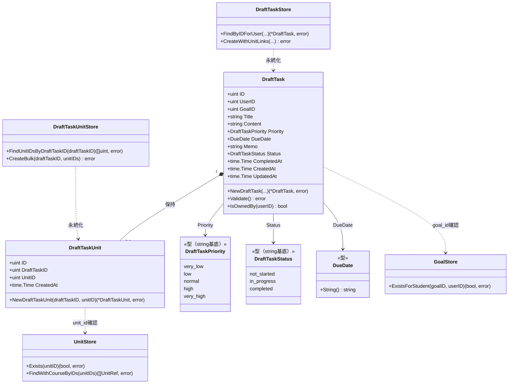
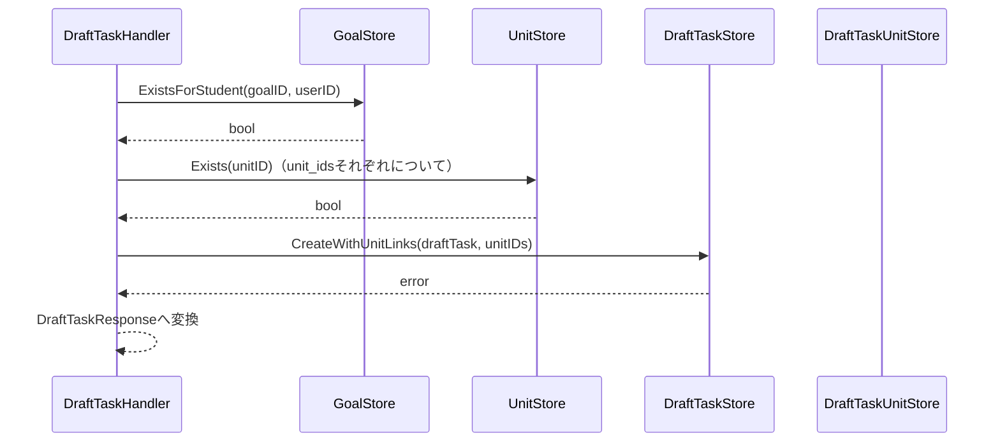
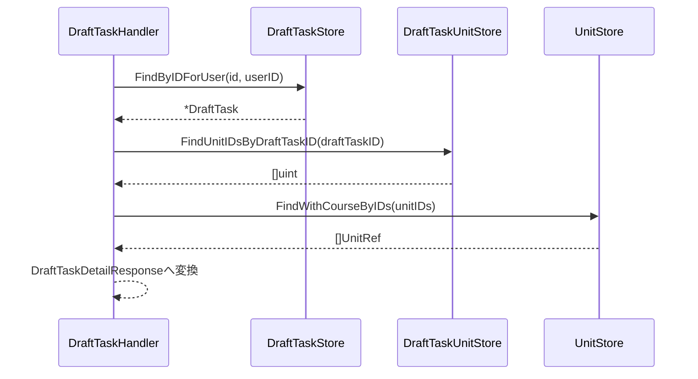

# タスク下書き機能 Go実装仕様書

---

# 1. 機能概要

## 機能概要

生徒が学習タスクを正式に登録する前段階として、内容を下書きの状態で保存できる機能である。下書きタスクの詳細取得（紐づく単元・コース情報を含む）と新規作成の2操作を提供する。ルーティング上は一覧取得・更新・削除を含む`resources :draft_tasks`が定義されているが、現時点で実装されているアクションは詳細取得・新規作成のみであり、本書もこの2操作を設計対象とする（②「1. 機能概要」要約）。

## 採用設計パターンとその理由（②からの要約）

②「4. 設計パターン」により **Active Record** を採用する。

- 主要操作が詳細取得・新規作成というCRUDの一部であり、業務ルールは「必須項目の検証」「紐づける目標が自分のものであること」「期限日が日付として解釈できること」「関連付ける単元IDが実在すること」というバリデーションに近い水準にとどまる
- `status`属性は存在するが、下書きタスクの作成処理自体はこの値を明示的に更新せず、初期値のまま保存される。本機能のスコープ内には状態遷移ロジックが存在しない
- 単元との関連付け（`draft_task_units`）は、作成時にまとめて登録するデータの整合性を保つ範囲にとどまり、複雑な業務ルールを伴わない

Transaction Script（単元関連付けの同期処理をEntity/Storeに寄せた方がタスク管理機能と一貫した設計にできる）、Domain Model（本機能スコープ内での遷移ルール・遷移条件が存在しない）、Event Sourcing（変更履歴の再構築要件がない）はいずれも②「4. 設計パターン」の「採用しなかったパターン」節の理由により不採用とされている。本書はこの判断を変更しない。

本書は、`規約/アーキテクチャ規約.md`「3. 設計パターンごとの構造適用方針」の **Active Record** 節の構造（`model.go`相当のstruct定義＋`store.go`相当のStore、usecase層なし、Repository Interfaceの分離なし）に従って実装レベルへ落とし込む。

## 本書が対象とする実装範囲

- Bounded Context: `draft-task`（②「3. Bounded Context」）
- 対象エンドポイント: 下書きタスク詳細取得・新規作成の2API（②「19. API仕様」）
- 対象外: Goal・Unit・Courseそのものの管理機能（他Contextの責務。②「3. Bounded Context」他Contextとの依存関係を参照）、下書きタスクの一覧取得・更新・削除（Rails現行実装で未提供のため、②「19. API仕様」Railsとの差分のとおり設計対象外とする）
- ②「3. Bounded Context」に、目標管理機能（goal-management Context）側の②文書が本Contextとの参照関係（`has_many :draft_tasks`）を記載しており、両者は整合した形で依存関係を記載している旨の言及がある。本Context側から見た依存方向は「作成時にGoal Contextへ所有権確認のため依存する」のみであり、目標管理機能側からの参照（目標詳細画面での下書きタスク一覧表示等）は本書の実装対象に含めない（目標管理機能③「1. 機能概要」「5. Infrastructure層設計」の対応する記載を参照）
- ①Rails実装の詳細は本タスクでは提供されていないため、参照が必要な箇所は「①未提供のため参照不可」として扱う

---

# 2. ディレクトリ構成

## 対象Bounded Context名

`draft-task`

②にはGo実装上のディレクトリ名の明記がない。アーキテクチャ規約「9. 命名規約」に基づき、既存の`task-management`→`internal/task`の対応関係に倣い、`draft-task`→`internal/draft_task`とする（**②からの補足・推測**。詳細は「17. ②からの補足事項」参照）。

## ②で採用した設計パターン

Active Record（②「4. 設計パターン」）

## 採用パターンに対応する構造

`規約/アーキテクチャ規約.md`「3. 設計パターンごとの構造適用方針」Active Record節に従い、domain/infrastructureのレイヤー分離およびusecase層を設けない。Entity相当のstructと永続化操作（Store）を同一package（`internal/draft_task`）に置く。

作成するディレクトリ一覧:

```
internal/draft_task/
internal/draft_task/presentation/
internal/draft_task/presentation/handler/
internal/draft_task/presentation/request/
internal/draft_task/presentation/response/
```

## 作成するファイル一覧

```
internal/draft_task/draft_task.go               # DraftTask struct・Validate()等
internal/draft_task/draft_task_priority.go       # DraftTaskPriority型
internal/draft_task/due_date.go                  # DueDate型
internal/draft_task/draft_task_status.go         # DraftTaskStatus型
internal/draft_task/draft_task_unit.go           # DraftTaskUnit struct
internal/draft_task/errors.go                    # struct/Storeが返すエラー変数定義
internal/draft_task/draft_task_store.go          # DraftTaskStore
internal/draft_task/draft_task_unit_store.go     # DraftTaskUnitStore
internal/draft_task/goal_ref.go                  # GoalRef struct（参照専用）
internal/draft_task/goal_store.go                # GoalStore（参照専用）
internal/draft_task/unit_ref.go                  # UnitRef struct（参照専用、コース情報を含む）
internal/draft_task/unit_store.go                # UnitStore（参照専用）
internal/draft_task/presentation/handler/draft_task_handler.go
internal/draft_task/presentation/request/draft_task_request.go
internal/draft_task/presentation/response/draft_task_response.go
internal/draft_task/presentation/routes.go
```

`domain/` `application/` `infrastructure/`の各ディレクトリはActive Record採用のため作成しない（規約3章）。

---

# 3. Domain層設計

**実装上の位置づけ**: 本機能はActive Record採用のため、domain層のディレクトリ分離は行わない。以下は②「6〜8章」の設計意図を、Active Record構造（Model＝struct＋メソッド、Store＝永続化）に落とし込んだものである（規約3章 Active Record節に従う）。

## Model（Entity相当）

### DraftTask（`internal/draft_task/draft_task.go`）

②「6. Entity設計」DraftTaskの責務・②「7. Value Object設計」DraftTaskPriority/DueDate/DraftTaskStatusの独自ルールを、同一package内のstruct・型・メソッドとして統合する。

フィールド:

|フィールド|型|意味|
|-|-|-|
|`ID`|`uint`|下書きタスクID（主キー）|
|`UserID`|`uint`|所有者（生徒）のユーザーID|
|`GoalID`|`uint`|紐づく目標ID（②「15. Validation設計」の「指定されたgoal_idが自分の目標かどうか」の検証対象）|
|`Title`|`string`|タイトル|
|`Content`|`string`|内容|
|`Priority`|`DraftTaskPriority`|優先度|
|`DueDate`|`DueDate`|期限日|
|`Memo`|`string`|メモ（任意項目）|
|`Status`|`DraftTaskStatus`|状態。本機能のスコープ内では作成時の初期値を保持するのみで、遷移ロジックは持たない（②「6. Entity設計」状態変化）|
|`CompletedAt`|`*time.Time`|完了日時。現行Rails実装には下書きタスクを完了状態に変更する操作自体が存在しないため、本機能のスコープ内外を問わず更新されることはなく、常に`nil`のまま保存される（①「タスク下書き機能 Rails現行仕様書」「7. 状態管理」、②「9. クラス図」に記載のフィールド）|
|`CreatedAt`|`time.Time`|作成日時（GORM自動設定。Gorm規約「タイムスタンプのトラッキング」）|
|`UpdatedAt`|`time.Time`|更新日時（GORM自動設定）|

公開method一覧（シグネチャのみ。実装ロジックは記載しない）:

|メソッド|引数|戻り値|責務|
|-|-|-|-|
|`NewDraftTask`|`(userID, goalID uint, title, content string, priority DraftTaskPriority, dueDate DueDate, memo string) (*DraftTask, error)`|`(*DraftTask, error)`|新規DraftTask生成時の不変条件（必須項目・初期status=not_started・CompletedAt=nil）を保証するファクトリ|
|`(d *DraftTask) Validate() error`|なし|`error`|title等必須項目の妥当性を検証する（②「15. Validation設計」Domainの一部）|
|`(d DraftTask) IsOwnedBy(userID uint) bool`|`userID uint`|`bool`|所有者判定（②「16. Authorization設計」の業務的判定を補助）|

不変条件（`NewDraftTask`で保証する内容）:

- `UserID`・`GoalID`・`Title`・`Content`は空値を許容しない
- 生成直後の`Status`は常に`DraftTaskStatusNotStarted`
- 生成直後の`CompletedAt`は常に`nil`

### DraftTaskPriority（`internal/draft_task/draft_task_priority.go`）

②「7. Value Object設計」のDraftTaskPriorityに対応する型。Active Record方針上、独立したValue Object層は設けず、DraftTaskの構成要素としてpackage内の付随型として扱う。

|項目|内容|
|-|-|
|型定義|`type DraftTaskPriority string`|
|許容値|`very_low` / `low` / `normal` / `high` / `very_high`（②に定義された5値の定数として表現）|
|公開メソッド|`NewDraftTaskPriority(raw string) (DraftTaskPriority, error)`（許容値検証を伴う生成関数）、`(p DraftTaskPriority) IsValid() bool`|

### DueDate（`internal/draft_task/due_date.go`）

②「7. Value Object設計」のDueDateに対応する型。

|項目|内容|
|-|-|
|保持するフィールド|内部に`time.Time`相当の値を1つ保持する（保存値）|
|生成方法|`NewDueDate(raw string) (DueDate, error)`。「日付として解釈できる値であること」という検証ルールを持つ（②「7. Value Object設計」独自ルール）|
|公開メソッド|`(d DueDate) String() string`（`YYYY/MM/DD`形式の表示用文字列を返す。②「7. Value Object設計」に基づく）|

### DraftTaskStatus（`internal/draft_task/draft_task_status.go`）

②「7. Value Object設計」のDraftTaskStatusに対応する型。

|項目|内容|
|-|-|
|型定義|`type DraftTaskStatus string`|
|許容値|`not_started` / `in_progress` / `completed`（②に定義された3値の定数として表現）|
|公開メソッド|`IsValid() bool`（許容値内かどうかを判定する。本機能のスコープ内では遷移ルールは持たせない。②「7. Value Object設計」独自ルール）|

### DraftTaskUnit（`internal/draft_task/draft_task_unit.go`）

②「6. Entity設計」DraftTaskUnitの責務を反映する。

フィールド:

|フィールド|型|意味|
|-|-|-|
|`ID`|`uint`|関連ID（主キー）|
|`DraftTaskID`|`uint`|紐づく下書きタスクID|
|`UnitID`|`uint`|紐づく単元ID|
|`CreatedAt`|`time.Time`|作成日時（GORM自動設定）|

公開method一覧:

|メソッド|引数|戻り値|責務|
|-|-|-|-|
|`NewDraftTaskUnit`|`(draftTaskID, unitID uint) (*DraftTaskUnit, error)`|`(*DraftTaskUnit, error)`|draftTaskID・unitIDが0でないことを保証するファクトリ|

## Value Object

規約3章「Active Record」節により、Value Objectを独立した層としては設けない（原則「対象外」）。②「7. Value Object設計」で定義されたDraftTaskPriority／DueDate／DraftTaskStatusの独自ルールは、上記「Model」節のとおりDraftTaskのフィールド型・付随型としてすべて実現している。②「Value Objectを採用しないもの」（タイトル・内容・メモ）についても同様に単純な`string`フィールドとして扱う。

## Repository Interface

規約3章「Active Record」節により、domain層にRepository Interfaceを定義しない（原則「対象外」）。②「11. Repository設計」の責務は「8. Infrastructure層設計」節のStoreとして実装する。

なお、②「11. Repository設計」のGoalStore・UnitStoreは、goal-management Context・curriculum(Unit) Context側が公開する参照手段であり、draft-task Contextがこれらのデータを所有・実装するものではない（`規約/アーキテクチャ規約.md`「5. Context間連携ルール」）。ただし②「11. Repository設計」はGoalStore・UnitStoreを本Context内に配置する設計をすでに決定しているため、本書もその決定をそのまま踏襲し、参照専用のStore（読み取り専用の投影）として`internal/draft_task`パッケージ内に実装する（目標管理機能③のTaskStore（参照用）と同様の整理。将来goal-management/curriculum Context側が公開APIとして参照系メソッドを整備した場合は、本Storeの実装をそちらの呼び出しに置き換える余地がある）。

## Domain Service

②「8. Domain Service」のとおり、複数Entityを横断する業務ルールは現状存在しないため不要と判断されている。「対象外」とする。

## Domain Event

②「18. Domain Event」のとおり、本機能ではDomain Eventを採用しない。「対象外」とする。

## Domain Error

規約3章「Active Record」節に従い、「struct/Storeが返すエラー」として`internal/draft_task/errors.go`に`sentinel error`を定義する。

|変数名|発生条件|対応する②の記載|
|-|-|-|
|`ErrDraftTaskNotFound`|指定idの下書きタスクが存在しない、または所有者が一致しない|②「17. Error設計」対象下書きタスクが存在しない、または自分のものでない|
|`ErrGoalNotOwned`|指定goal_idが自分の目標でない|②「17. Error設計」所有者外の目標参照|
|`ErrInvalidDueDate`|`due_date`が日付として解釈できない|②「17. Error設計」due_dateが日付として不正|
|`ErrUnitNotFound`|指定unit_idsの中に実在しない単元が含まれる|②「17. Error設計」unit_idsに実在しない単元が含まれる|

---

# 4. クラス図

Active Record採用のため、Model（struct）とStoreの関係として可視化する。



「3. Domain層設計」のstruct定義をそのまま反映した。

---

# 5. 状態遷移図

省略する。

理由: ②「10. 状態遷移図」に「Rails現行仕様書7章に『下書きタスクの作成処理自体はこの値（status）を明示的に更新しておらず、初期値のまま保存される』と明記されており、本機能のスコープ内でDraftTaskStatusが遷移することはない」と明記されているとおり、`DraftTaskStatus`は作成時の初期値を保持するのみであり、状態遷移図として可視化すべき遷移が本機能のスコープ内には存在しない。将来的に下書きから正式タスクへの変換操作等が実装され、状態変更ロジックが追加された場合は、あらためて状態遷移図を作成する（②の判断をそのまま踏襲）。

---

# 6. Application層設計

**実装上の位置づけ**: 本機能はActive Record採用のためusecase層を設けない。「対象外（Active Record採用のため、usecase層を設けない）」とする。②「12. UseCase設計」に記載された2つの業務操作（ShowDraftTask／CreateDraftTask）は、Handlerが`internal/draft_task`のStore・Modelを直接呼び出す処理として実装する。処理順序は「9. Presentation層設計」のHandler処理順序に統合して記載する。

## DTO（Command / Query）

DTOはPresentation層のRequest/Response DTOとして「9. Presentation層設計」にまとめて記載する（Active Record採用のため、Application層独自のCommand/Query DTOは設けない）。

---

# 7. シーケンス図・処理フロー図

Active Record採用のためUseCase層はなく、Handlerが各Store・参照用Storeを直接呼び出す（6章参照）。

## シーケンス図（CreateDraftTask）



## シーケンス図（ShowDraftTask）



## 処理フロー図

省略する。理由: 検証項目（目標所有権確認・単元存在確認）は複数あるが、いずれも直列的な存在確認であり、タスク管理機能のUpdateTaskのような削除可否判定を伴う複雑な分岐は存在しない（②「13. シーケンス図・処理フロー図」処理フロー図の省略理由を踏襲）。そのため、「7. シーケンス図」の説明で十分に表現できる。

---

# 8. Infrastructure層設計

**実装上の位置づけ**: 本機能はActive Record採用のためinfrastructure層のディレクトリ分離は行わない。「3. Domain層設計」で定義したModelと同一package（`internal/draft_task`）にStoreを置く。

## Store実装

### DraftTaskStore（`internal/draft_task/draft_task_store.go`）

- struct名: `DraftTaskStore`
- 対応するGORMモデル: `DraftTask`（同一struct。GORMタグは付与せず、規約のデフォルト命名規則に委ねる。「15. GORM / DBクエリ設計」参照）

コンストラクタ:

```go
func NewDraftTaskStore(db *gorm.DB) *DraftTaskStore
```

メソッド一覧:

|メソッド|引数|戻り値|発行するクエリ内容|
|-|-|-|-|
|`FindByIDForUser`|`(ctx context.Context, id, userID uint)`|`(*DraftTask, error)`|`id`と`user_id`の一致で1件取得する所有者スコープ検索（②「11. Repository設計」DraftTaskStore「user_id + idによる単一取得（所有権確認を兼ねる）」）。該当なしは`ErrDraftTaskNotFound`を返す|
|`CreateWithUnitLinks`|`(ctx context.Context, d *DraftTask, unitIDs []uint)`|`error`|DraftTask作成とDraftTaskUnit一括作成を1トランザクションで実行する（②「12. UseCase設計」CreateDraftTaskのトランザクション範囲。「11. Transaction実装方針」参照）|

保持しない責務（②「11. Repository設計」を踏襲）: 一覧取得・更新・削除（現行実装で未提供のため、本書のスコープ外）、業務ルール判定（所有権・期限日妥当性等はDraftTask/Handler側で扱う）。

### DraftTaskUnitStore（`internal/draft_task/draft_task_unit_store.go`）

- struct名: `DraftTaskUnitStore`
- 対応するGORMモデル: `DraftTaskUnit`（テーブル名`draft_task_units`。「15. GORM / DBクエリ設計」参照）

コンストラクタ:

```go
func NewDraftTaskUnitStore(db *gorm.DB) *DraftTaskUnitStore
```

メソッド一覧:

|メソッド|引数|戻り値|発行するクエリ内容|
|-|-|-|-|
|`FindUnitIDsByDraftTaskID`|`(ctx context.Context, draftTaskID uint)`|`([]uint, error)`|`draft_task_id`一致で紐づく`unit_id`一覧を取得する（②「11. Repository設計」「下書きタスクに紐づく単元一覧取得（詳細取得時）」）|
|`CreateBulk`|`(ctx context.Context, draftTaskID uint, unitIDs []uint)`|`error`|指定unitIDs分のDraftTaskUnitレコードを一括作成する（②「11. Repository設計」「下書きタスク作成時の単元関連付けの一括作成」）|

保持しない責務: 関連付けの更新・削除（現行実装に存在しないため。②「11. Repository設計」）。

`DraftTaskStore.CreateWithUnitLinks`は、トランザクション用の`*gorm.DB`を`NewDraftTaskUnitStore`に渡して同一トランザクション内で`DraftTaskUnitStore.CreateBulk`を呼び出す（Entity ⇔ GORMモデルの変換は不要。同一structをそのまま永続化する）。

### GoalStore（参照用、`internal/draft_task/goal_store.go`）

|項目|内容|
|-|-|
|struct名|`GoalStore`|
|対応するGORMモデル|`GoalRef`（読み取り専用モデル。実体の目標管理はgoal-management Contextの責務であり、本Contextでは参照専用の投影として扱う）|

コンストラクタ:

```go
func NewGoalStore(db *gorm.DB) *GoalStore
```

メソッド一覧:

|メソッド|引数|戻り値|発行するクエリ内容|
|-|-|-|-|
|`ExistsForStudent`|`(ctx context.Context, goalID, userID uint)`|`(bool, error)`|指定`goal_id`が`user_id`に属するかの存在確認クエリ（②「11. Repository設計」GoalStore責務「指定goal_idが現在の生徒に属するか確認する」）|

②「11. Repository設計」のとおり、GoalStoreは下書きタスクの作成可否判断そのものを持たない。

### UnitStore（参照用、`internal/draft_task/unit_store.go`）

|項目|内容|
|-|-|
|struct名|`UnitStore`|
|対応するGORMモデル|`UnitRef`（読み取り専用モデル。実体の単元管理はcurriculum(Unit) Contextの責務であり、本Contextでは参照専用の投影として扱う。コース情報（コースID・コース名）を含めて保持する）|

コンストラクタ:

```go
func NewUnitStore(db *gorm.DB) *UnitStore
```

メソッド一覧:

|メソッド|引数|戻り値|発行するクエリ内容|
|-|-|-|-|
|`Exists`|`(ctx context.Context, unitID uint)`|`(bool, error)`|指定`unit_id`の存在確認クエリ（②「11. Repository設計」UnitStore責務「指定単元の存在確認」）|
|`FindWithCourseByIDs`|`(ctx context.Context, unitIDs []uint)`|`([]UnitRef, error)`|指定`unit_id`群について、コース情報を結合したUnitRef一覧を取得する（②「11. Repository設計」UnitStore責務「詳細取得時のコース情報取得」、②「21. DB操作仕様」「コース（courses）との結合が必要」）|

②「11. Repository設計」のとおり、UnitStoreは単元の作成・更新責務を持たない。

## 外部連携実装

②にMail・Cache・Queue等の外部連携に関する記載はない。「対象外」とする。

---

# 9. Presentation層設計

## Handler

### DraftTaskHandler（`internal/draft_task/presentation/handler/draft_task_handler.go`）

- struct名: `DraftTaskHandler`
- 依存: `*draft_task.DraftTaskStore`、`*draft_task.DraftTaskUnitStore`、`*draft_task.GoalStore`、`*draft_task.UnitStore`（コンストラクタで注入する）

```go
func NewDraftTaskHandler(
    draftTaskStore *draft_task.DraftTaskStore,
    draftTaskUnitStore *draft_task.DraftTaskUnitStore,
    goalStore *draft_task.GoalStore,
    unitStore *draft_task.UnitStore,
) *DraftTaskHandler
```

メソッド一覧（HTTPメソッド・パスとの対応は「10. API仕様」参照）:

|メソッド|対応API|
|-|-|
|`(h *DraftTaskHandler) ShowDraftTask(c *gin.Context)`|GET /api/v1/student/draft_tasks/:id|
|`(h *DraftTaskHandler) CreateDraftTask(c *gin.Context)`|POST /api/v1/student/draft_tasks|

Active Record採用のためUseCase層を経由しない。以下、②「12. UseCase設計」で「Handler処理」として記載された業務操作の呼び出し順序を、権限チェック・呼び出し順序を含めてHandlerの処理順序として記載する（規約7章 横断的関心事の置き場所に基づき、認可（所有権・業務権限）は該当Storeまたは本Handlerで行う）。

#### ShowDraftTask 処理順序

1. Middlewareで設定済みのcurrent user（student）をcontextから取得する
2. パスパラメータ`id`をバインドする
3. `DraftTaskStore.FindByIDForUser`をcurrent userのuser_idでスコープして呼び出す。存在しない場合は`ErrDraftTaskNotFound`（②「12. UseCase設計」ShowDraftTask、②「13. Authorization設計」所有権確認）
4. `DraftTaskUnitStore.FindUnitIDsByDraftTaskID`で関連単元IDを取得する
5. `UnitStore.FindWithCourseByIDs`で単元一覧（コース情報を含む）を取得する（②「12. UseCase設計」ShowDraftTaskの出力「下書きタスク詳細情報と紐づく単元一覧（コース情報を含む）」）
6. 取得結果をResponse DTOへ変換して返す

#### CreateDraftTask 処理順序

1. current userを取得する
2. Request DTOへバインドし、型・必須・フォーマットを検証する（②「15. Validation設計」Presentation）
3. `GoalStore.ExistsForStudent`で指定goal_idが自分の目標か確認する。該当しない場合は`ErrGoalNotOwned`（②「15. Validation設計」業務ルール「指定されたgoal_idが自分の目標かどうか」）
4. `draft_task.NewDueDate`でdue_dateを検証する。日付として解釈できない場合は`ErrInvalidDueDate`（②「15. Validation設計」整合性チェック）
5. `draft_task.NewDraftTaskPriority`でpriorityを検証する
6. 指定された各unit_id（任意項目）について`UnitStore.Exists`で存在確認する。存在しない場合は`ErrUnitNotFound`（②「15. Validation設計」整合性チェック）
7. `draft_task.NewDraftTask`でDraftTaskを生成し、`DraftTask.Validate()`で業務ルールを検証する（②「15. Validation設計」Domain）
8. `DraftTaskStore.CreateWithUnitLinks`をDraftTaskと確認済みunit_ids一覧で呼び出す（②「12. UseCase設計」CreateDraftTask 呼び出すStore：GoalStore→UnitStore→DraftTaskStore→DraftTaskUnitStoreの順に対応）
9. 作成結果をResponse DTOへ変換して返す

## Request / Response DTO

### Request（`internal/draft_task/presentation/request/draft_task_request.go`）

|struct名|フィールドと型|バリデーションタグ／チェック内容|
|-|-|-|
|`CreateDraftTaskRequest`|`GoalID uint`、`Title string`、`Content string`、`Priority string`、`DueDate string`、`Memo string`、`UnitIDs []uint`|`GoalID`・`Title`・`Content`・`Priority`・`DueDate`は`binding:"required"`（②「15. Validation設計」必須チェック）。`Memo`・`UnitIDs`は任意項目。`UnitIDs`は配列形式チェック（②「15. Validation設計」フォーマットチェック）|

### Response（`internal/draft_task/presentation/response/draft_task_response.go`）

|struct名|フィールドと型|
|-|-|
|`CreateDraftTaskResponse`|`ID uint`|
|`DraftTaskDetailResponse`|`ID uint`、`UserID uint`、`GoalID uint`、`Title string`、`Content string`、`DueDate string`、`Priority string`、`Memo string`、`Status string`、`CompletedAt *string`、`Units []DraftTaskUnitResponse`、`CreatedAt string`、`UpdatedAt string`|
|`DraftTaskUnitResponse`|`ID uint`、`Name string`、`CourseID uint`、`CourseName string`|

`DueDate`・`CreatedAt`・`UpdatedAt`は`DueDate.String()`等を用いて表示用フォーマットへ変換する。EntityであるDraftTaskをそのまま返さず、必ずResponse DTOへ変換する（規約「6. データフロー」）。

## Routing

`internal/draft_task/presentation/routes.go`

|Method|Path|Handler|
|-|-|-|
|GET|/api/v1/student/draft_tasks/:id|DraftTaskHandler.ShowDraftTask|
|POST|/api/v1/student/draft_tasks|DraftTaskHandler.CreateDraftTask|

いずれのルートも認証Middleware（本人確認）・認可Middleware（student roleチェック）を経由する（②「16. Authorization設計」Middleware、「13. Authorization実装方針」参照）。

---

# 10. API仕様

②「19. API仕様」に基づき、Rails現行仕様で実装されている2エンドポイントを維持する。一覧取得・更新・削除は②が「実装されていない業務仕様を推測で設計することを避ける」として設計対象外としているため、本書でも対象外とする。

|Method|Path|Handler|Request|Response|Status Code|
|-|-|-|-|-|-|
|GET|/api/v1/student/draft_tasks/:id|ShowDraftTask|パスパラメータ`id`|`DraftTaskDetailResponse`|200|
|POST|/api/v1/student/draft_tasks|CreateDraftTask|`CreateDraftTaskRequest`|`CreateDraftTaskResponse`|201（②「19. API仕様」Status Code「201/200: 作成成功の扱いは既存仕様に合わせて統一する」とあり、作成=201と推測。「17. ②からの補足事項」参照）|

## Errorケース

|条件|Status Code|Error内容|
|-|-|-|
|未認証|401|認証エラー（Middleware）|
|student以外のロール|403|認可エラー（Middleware）|
|Request DTOの型・必須・フォーマット不正|422|②「19. API仕様」422: 入力・業務ルール違反|
|指定goal_idが自分の目標でない（`ErrGoalNotOwned`）|422|②「19. API仕様」|
|due_dateが日付として不正（`ErrInvalidDueDate`）|422|②「19. API仕様」|
|unit_idsに実在しない単元が含まれる（`ErrUnitNotFound`）|422|②「19. API仕様」|
|対象下書きタスク不存在／所有者不一致（`ErrDraftTaskNotFound`）|404|②「19. API仕様」404: 対象下書きタスク不存在|
|DB接続失敗等のInfrastructure Error|500|内部エラー|

---

# 11. Transaction実装方針

②「14. Transaction設計」を実装単位に落とし込む。

## Transaction開始箇所

- Active Record採用のため、`DraftTaskStore.CreateWithUnitLinks`メソッド内で`db.WithContext(ctx).Transaction(func(tx *gorm.DB) error { ... })`を用いてトランザクションを開始する（②「14. Transaction設計」Handlerの処理単位に対応するStoreメソッド内でトランザクションを開始する）
- `ShowDraftTask`はトランザクションを使用しない（②「14. Transaction設計」）

## Transaction終了箇所（Commit / Rollback条件）

- `CreateWithUnitLinks`: DraftTask作成とDraftTaskUnit一括作成がすべて成功した時点でコミットする。いずれかが失敗した場合はロールバックする

## 複数Storeにまたがる場合の扱い

`DraftTaskStore.CreateWithUnitLinks`は、トランザクション用の`tx *gorm.DB`を用いて`DraftTaskUnitStore`を`NewDraftTaskUnitStore(tx)`で生成し、同一トランザクション内で`DraftTaskUnitStore.CreateBulk`を呼び出す。GoalStore・UnitStoreによる確認は、トランザクション開始前（Handler側）で完了させ、トランザクション内では行わない（②「11. Repository設計」GoalStore/UnitStoreは「下書きタスクの作成可否判断そのもの」を保持しないとされている点と整合）。

---

# 12. Validation実装方針

②「15. Validation設計」の「バリデーション仕様」表を実装レベルに落とし込む。

## Presentation

|フィールド|struct名|バリデーションタグ|エラーメッセージ|
|-|-|-|-|
|`GoalID` / `Title` / `Content` / `Priority` / `DueDate`|`CreateDraftTaskRequest`|`binding:"required"`|「必須項目が未入力です」|
|`UnitIDs`|`CreateDraftTaskRequest`|`binding:"omitempty,dive"`（配列形式チェック）|「単元の指定が不正です」|

## 業務ルール検証（Active Record採用時: Modelのメソッドで検証する内容）

- `DraftTask.Validate()`: title等必須項目の妥当性
- `DraftTaskPriority.NewDraftTaskPriority()`: priority入力値の許容値検証
- `DueDate.NewDueDate()`: due_dateが日付として解釈できる値であることの検証（②「15. Validation設計」整合性チェック）

## 業務ルール検証（Model単体では完結しないため、Handlerで実行する内容）

goal_idの所有権確認（`GoalStore.ExistsForStudent`）、unit_idの存在確認（`UnitStore.Exists`）は、他Contextのデータを参照する業務ルールであり、DraftTask Model単体では検証できないため、Handlerが呼び出し元となって検証する（②「15. Validation設計」業務ルール・整合性チェックの実装先を、Active Record構造に合わせて具体化したもの。**②からの補足**）。

## 責務分離

②の方針どおり、Presentationは「入力が正しいか」、Model／Handlerは「業務的に妥当か」を担当する。

---

# 13. Authorization実装方針

②「16. Authorization設計」を実装レベルに落とし込む。

## Middleware

- JWT等の検証を行い、current userをcontextに格納する（規約「7. 横断的関心事の置き場所」認証）
- ロールがstudentであることを確認する（②「16. Authorization設計」Middleware）

## Handler

- Middlewareが認証・ロール認可を行うため、Handler自体は個別の業務権限判定を持たない（②「16. Authorization設計」Handler）
- ただし、Active Record採用によりUseCase層がないため、所有者スコープでの取得（`DraftTaskStore.FindByIDForUser`にuser_idを渡す）と、goal_id所有権確認（`GoalStore.ExistsForStudent`）はHandlerが呼び出す（②「16. Authorization設計」UseCaseの記載を、Active Record構造上Handlerに読み替え）

## Store／Model

- `DraftTaskStore`の検索メソッドは、渡されたuser_idによるスコープを常に条件へ含める（②「16. Authorization設計」Domain：所有者外のアクセスが行われないようにする、を実装レベルで反映）
- Model（`DraftTask`）は`IsOwnedBy`メソッドを提供するのみで、認可の主体としては扱わない

---

# 14. Error実装方針

②「17. Error設計」の「エラー仕様」表を実装レベルに落とし込む。

## Domain Error → Application Errorへの変換方針

Active Record採用のためDomain Error層は独立させず、「3. Domain層設計」の`errors.go`で定義したsentinel error（`ErrDraftTaskNotFound`等）をそのままApplication Error相当として扱う（規約7章 横断的関心事の置き場所「Transaction Script/Active Record採用時はDomain Errorに相当する層がないため、関数・struct側で発生したエラーをApplication Error相当として扱う」）。

## Application Error → HTTPレスポンスへの変換方針

Handlerが`errors.Is`でsentinel errorを判定し、対応するHTTP Status Codeへ変換する。

|業務シナリオ|Error変数名／型|発生層|HTTP Status|
|-|-|-|-|
|対象下書きタスクが存在しない、または自分のものでない|`ErrDraftTaskNotFound`|Store|404|
|必須項目の不足|Request DTOバインドエラー|Presentation|422|
|指定goal_idが自分の目標でない|`ErrGoalNotOwned`|Handler（GoalStore経由）|422|
|due_dateが日付として不正|`ErrInvalidDueDate`|Model（DueDate生成時）|422|
|unit_idsに実在しない単元が含まれる|`ErrUnitNotFound`|Handler（UnitStore経由）|422|
|未認証|認証エラー|Middleware|401|
|studentロールでない|認可エラー|Middleware|403|
|DB接続失敗等|未分類エラー|Store／Infrastructure|500|

## Infrastructure Errorのハンドリング方針

GORMが返すDB接続エラー等は、sentinel errorとして特別扱いせず、Storeからそのまま呼び出し元へ返し、Handlerでハンドリングされなかった場合は共通のエラーハンドリングMiddleware（本機能固有の設計ではないため対象外。`shared/`側の既存実装に従う）で500として応答する。

---

# 15. GORM / DBクエリ設計

②「20. DB設計方針」により、既存Rails DBをそのまま継続利用し、Schema変更は行わない。

## 利用するGORMモデルとテーブルの対応

|Goモデル|テーブル名|備考|
|-|-|-|
|`DraftTask`|`draft_tasks`|Gorm規約のデフォルト命名規則（struct名の複数形snake_case）で一致するため、`TableName()`のオーバーライドは不要|
|`DraftTaskUnit`|`draft_task_units`|struct名のデフォルト複数形（`draft_task_units`）が実テーブル名と一致するため、`TableName()`のオーバーライドは不要（タスク管理機能のTaskUnitLink→task_unitsのような不一致は本機能には生じない）|
|`GoalRef`|`goals`|読み取り専用の投影。goal-management Context側が所有するテーブルであり、書き込みは行わない|
|`UnitRef`|`units`|読み取り専用の投影。curriculum(Unit) Context側が所有するテーブルであり、書き込みは行わない。詳細取得時はコース情報表示のため`courses`テーブルとの結合を含む|

`draft_task_courses`テーブルは、②「5. Aggregate設計」のとおり現行実装のDraftTask作成処理では関連付けが行われておらず、本Aggregateに含めない。そのため本書では対応するGORMモデルを定義しない（②「5. Aggregate設計」「20. DB設計方針」）。

## 主要クエリの条件・ソート・ページネーション方針

|Store|メソッド|対象テーブル|条件|結合|
|-|-|-|-|-|
|DraftTaskStore|FindByIDForUser|draft_tasks|`id`・`user_id`一致|なし|
|DraftTaskStore|CreateWithUnitLinks|draft_tasks|-|なし|
|DraftTaskUnitStore|FindUnitIDsByDraftTaskID|draft_task_units|`draft_task_id`一致|なし|
|DraftTaskUnitStore|CreateBulk|draft_task_units|-|なし|
|GoalStore|ExistsForStudent|goals|`goal_id`・`user_id`一致の存在確認|なし|
|UnitStore|Exists|units|`unit_id`一致の存在確認|なし|
|UnitStore|FindWithCourseByIDs|units|`unit_id IN (...)`|コース（courses）との結合が必要（②「21. DB操作仕様」）|

SQL文そのものは記載しない。

## 既存Schemaに対する変更

②「20. DB設計方針」により変更なし。

---

# 16. テストケース設計

②「22. テスト戦略」を、Active Record採用時の区分（規約3章「Active Record採用時: 『Domain Test』→『Model Test』、『UseCase Test』は『対象外』、『Repository Test』→『Store Test』」）に読み替えて具体化する。

## Model Test（②「Domain Test」からの読み替え）

|対象|テストケース|
|-|-|
|`DraftTaskPriority.NewDraftTaskPriority`|許容値（very_low〜very_high）で正しく生成できること|
|`DraftTaskPriority.NewDraftTaskPriority`|許容値以外の文字列でエラーとなること|
|`DueDate.NewDueDate`|正しい形式の入力から正常に生成できること|
|`DueDate.NewDueDate`|日付として解釈できない入力でエラーになること|
|`DueDate.String`|`YYYY/MM/DD`形式の文字列を返すこと|
|`DraftTaskStatus.IsValid`|許容値（not_started / in_progress / completed）で`true`を返すこと|
|`DraftTask.Validate`|title等必須項目が空の場合にエラーになること|
|`DraftTask.NewDraftTask`|生成直後のStatusが`not_started`、CompletedAtが`nil`であること|

## UseCase Test

対象外（Active Record採用のため、usecase層を設けない）。

## Store Test（②「Repository Test」からの読み替え）

|対象|テストケース|
|-|-|
|`DraftTaskStore.FindByIDForUser`|所有者本人の下書きタスクが取得できること|
|`DraftTaskStore.FindByIDForUser`|他ユーザーの下書きタスクを指定した場合に`ErrDraftTaskNotFound`が返ること|
|`DraftTaskStore.CreateWithUnitLinks`|DraftTask作成とDraftTaskUnit一括作成が同一トランザクションで成功すること|
|`DraftTaskStore.CreateWithUnitLinks`|DraftTaskUnit作成が失敗した場合にDraftTask作成もロールバックされること|
|`DraftTaskUnitStore.FindUnitIDsByDraftTaskID`|指定draft_task_idに紐づくunit_id一覧が取得できること|
|`GoalStore.ExistsForStudent`|自分の目標を指定した場合に`true`、他ユーザーの目標を指定した場合に`false`を返すこと|
|`UnitStore.FindWithCourseByIDs`|指定unit_idsに対応するコース情報を含む単元一覧が取得できること|

## Handler Test

|対象|テストケース|
|-|-|
|`ShowDraftTask`|存在しない下書きタスクIDで404が返ること|
|`ShowDraftTask`|正常時に200と紐づく単元一覧（コース情報を含む）が返ること|
|`CreateDraftTask`|必須項目欠落時に422が返ること|
|`CreateDraftTask`|goal_idが他人の目標の場合に422が返ること|
|`CreateDraftTask`|due_dateが不正な形式の場合に422が返ること|
|`CreateDraftTask`|unit_idsに実在しない単元が含まれる場合に422が返ること|
|`CreateDraftTask`|正常時に201が返ること|
|全Handler|未認証・非student roleでのアクセスが401/403となること|

## Integration Test

|対象|テストケース|
|-|-|
|下書きタスク作成〜詳細取得|一連のエンドポイント呼び出しが正常に完了し、単元・コース情報を含むレスポンスの整合性が保たれること（②「22. テスト戦略」Integration Test）|
|所有権|他ユーザーの下書きタスクにアクセスできないこと（②「22. テスト戦略」）|

---

# 17. ②からの補足事項

②に明記がなく、実装のために追加で判断した内容を以下に記載する。

|判断した内容|判断理由|推測か否か|
|-|-|-|
|Bounded Context `draft-task` の内部ディレクトリ名を`internal/draft_task`とした|②はContext名（draft-task）のみを記載し、内部ディレクトリ名を明記していない。アーキテクチャ規約「9. 命名規約」、既存の`task-management`→`internal/task`の対応関係から類推した|推測|
|GoalStore・UnitStoreをdraft-task Context内で参照専用のStoreとして直接実装する構成とした（Context間連携ルールの参照インターフェース化は行わない）|②「11. Repository設計」はGoalStore・UnitStoreを本Context内に配置する設計をすでに決定しており、目標管理機能③が同様の判断（TaskStoreを参照用の具象Storeとして自Context内に実装）を採用しているため、student向け機能内での一貫性を優先して同じ整理とした|補足（既存の目標管理機能③との整合を優先した判断）|
|`CompletedAt`フィールドは②「9. クラス図」に記載があるため保持するが、常に`nil`のまま保存・返却される前提とした|①「タスク下書き機能 Rails現行仕様書」「7. 状態管理」により、現行Railsには下書きタスクを完了状態にする操作自体（更新・削除を含む）が存在せず、`completed_at`を更新する操作がこの機能のスコープ内外を問わず存在しないことが確認できたため。②「6. Entity設計」「10. 状態遷移図」の整理とも一致する|①の記載に基づく確定（推測ではない）|
|作成時のHTTP Status Codeを201とした|②「19. API仕様」Status Codeの記載が「201/200: 作成成功の扱いは既存仕様に合わせて統一する」と曖昧であり、①未提供のため実際のRails挙動を参照できない。REST慣例に基づき作成=201と仮置きした|推測（実装着手前にRails現行仕様の確認を推奨）|
|`UnitIDs`（下書きタスク作成時の単元指定）を任意項目（`binding:"omitempty"`）とした|②「19. API仕様」は「`unit_ids`（任意）」と明記しているため、この記載をそのまま反映した|補足（②に根拠あり。推測ではない）|

