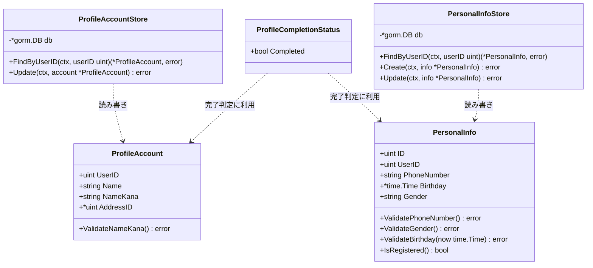
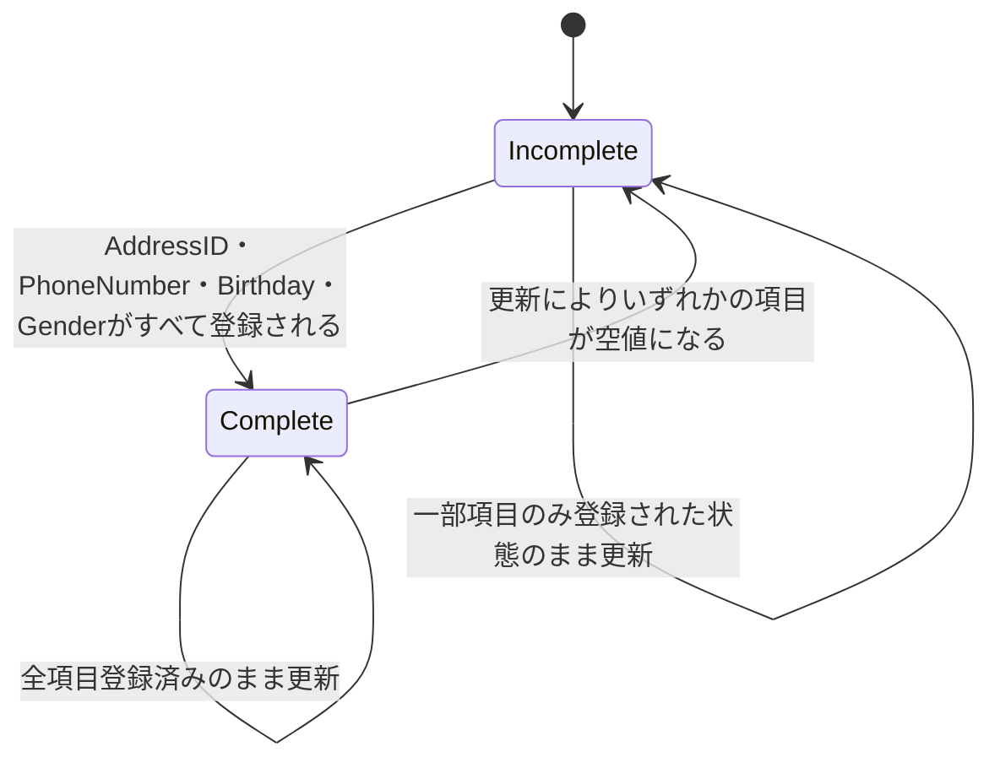
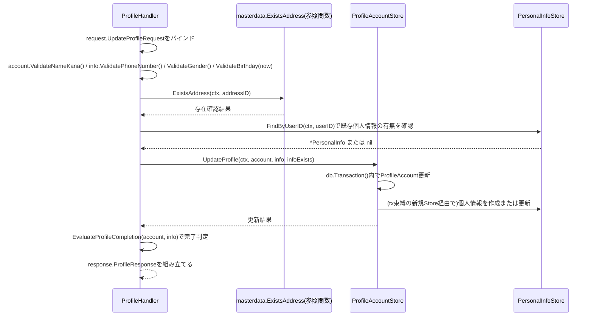
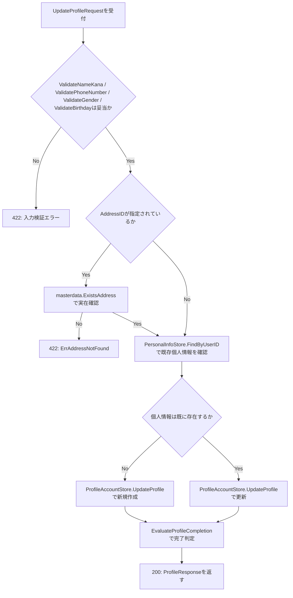

# プロフィール管理機能 Go実装仕様書

---

# 1. 機能概要

## 機能概要

ログイン中のユーザーが、自分自身の基本情報（氏名・氏名カナ）、個人情報（電話番号・生年月日・性別）、住所を更新できる機能である（`PATCH /api/v1/profile`）。更新は全項目置換方式であり、未指定の項目は空値として更新される。住所・電話番号・生年月日・性別がすべて登録済みかどうかによって、プロフィール登録が完了しているか（`profile_completed`）を都度判定する。認証情報自体（メールアドレス・パスワードハッシュ・ロール・`jti`・所属高校・学年）の真正な所有者はauthentication Contextであり、本Contextはプロフィール項目（氏名・氏名カナ・住所ID・個人情報）のみを扱う。ログイン中ユーザー自身の情報参照（`GET /api/v1/me`）はauthentication Contextが所有するエンドポイントであり、本Contextは実装しない。

## 採用設計パターンとその理由（②からの要約）

②Go移行・設計仕様書「4. 設計パターン」により、本機能は **Active Record** を採用する。

- 氏名・氏名カナ・住所・個人情報という同一データ構造に対する「参照（内部利用）」と「一括更新」というCRUD中心の業務であること
- `profile_completed`は明示的な遷移トリガーを持たない導出値であり、複数Entityにまたがる複雑な業務ルール・状態遷移は存在しないこと
- 業務ルールがフィールド単位のフォーマット検証（氏名カナ・電話番号・性別・生年月日）と住所実在確認に閉じており、structのメソッドとして表現するだけで十分であること

上記の理由からTransaction Script・Domain Model・Event Sourcingは採用せず、Active Recordを採用している（詳細は②「4. 設計パターン」参照）。

## 本書が対象とする実装範囲

本書は、②で確定した設計（Bounded Context・Aggregate・Entity・Value Object・Repository・UseCase・Transaction境界・Validation方針・Authorization方針・Error設計・Domain Event・API互換方針・DB方針・テスト戦略）を変更せず、Goでの具体的なコード構成に落とし込むことを目的とする。

規約`アーキテクチャ規約.md`「3. 設計パターンごとの構造適用方針」の「Active Record」節に従い、domain/infrastructureのレイヤー分離・usecase層を設けない簡略構造（`model.go` + `store.go` + `presentation/`）を適用する。②文書中の「Repository」「UseCase」という表記は、本書では規約の指示どおりStore・Handler処理として読み替える。

authentication Context側（②「認証機能_Go移行・設計仕様書」「認証機能_Go実装仕様書」）との関係は、②「3. Bounded Context」の整理をそのまま踏襲する。すなわち、`users`テーブルを両Contextが共有するが、本Contextが読み書きするのは氏名・氏名カナ・住所IDのサブセットに限定し、メールアドレス・パスワードハッシュ・`jti`・ロール・所属高校・学年・生徒コード・有効化状態等の認証関連カラムには一切関与しない。

①Rails実装詳細は本タスクでは提供されていないため、①の実装コードそのものを根拠とする記載は行わない（①未提供のため参照不可）。②に明記された「Rails現行仕様の要約」の範囲でのみ言及する。

---

# 2. ディレクトリ構成

## 対象Bounded Context名

- Context名（②）: `profile`
- ディレクトリ名: `internal/profile`

  > **②からの補足**: ②にはディレクトリ名の明記がない。アーキテクチャ規約「8. 命名規約（アーキテクチャレベル）」に従い、Context名`profile`をそのまま英単語1語のディレクトリ名とした（推測）。

## ②で採用した設計パターン

Active Record

## 作成するディレクトリ一覧

```
internal/profile/
└── presentation/
    ├── handler/
    ├── request/
    ├── response/
    └── routes.go
```

アーキテクチャ規約「3. 設計パターンごとの構造適用方針」の「Active Record」節に従い、`domain/`・`application/`・`infrastructure/`は設けない。`model.go`・`store.go`は`internal/profile/`直下に置く。

## 作成するファイル一覧

```
internal/profile/model.go
internal/profile/store.go

internal/profile/presentation/handler/profile_handler.go
internal/profile/presentation/request/profile_request.go
internal/profile/presentation/response/profile_response.go
internal/profile/presentation/routes.go
```

---

# 3. Domain層設計

**実装上の位置づけ**: 本機能はActive Record採用のため、規約「3. 設計パターンごとの構造適用方針」に従いdomain層（Entity/Value Object/Repository Interface/Domain Service）を設けない。「Entity」は「Model（Entity相当）」として、struct定義・フィールド・検証メソッドを`model.go`に記載する。「Value Object」「Repository Interface」「Domain Service」は原則「対象外」とし、フォーマット検証・完了判定はModelのメソッド（またはModelを引数に取るパッケージ関数）として記載する。「Domain Error」は「struct/Storeが返すエラー」として記載する。

## Model（Entity相当、`model.go`）

### ProfileAccount

- struct名: `ProfileAccount`
- GORMモデルとしての位置づけ: `users`テーブルのうち、本Contextが読み書きするサブセット（`id`・`name`・`name_kana`・`address_id`）のみを射影する。他のカラム（`email`・`encrypted_password`・`jti`・`user_role_id`・`high_school_id`・`grade_id`・`student_number`・`activated_at`・`deleted_at`等）はauthentication Contextの責務であり、本structでは一切保持しない（②「5. Aggregate設計」）
- フィールド:

|フィールド|型|GORMタグ|意味|
|-|-|-|-|
|`UserID`|`uint`|`gorm:"column:id;primaryKey"`|ユーザー（`users`テーブル行）の識別子|
|`Name`|`string`|`gorm:"column:name"`|氏名（漢字表記）|
|`NameKana`|`string`|`gorm:"column:name_kana"`|氏名カナ|
|`AddressID`|`*uint`|`gorm:"column:address_id"`|住所ID（未設定時はnil）|

- テーブル名: `func (ProfileAccount) TableName() string { return "users" }`（Gorm規約「テーブル名」節。構造体名のデフォルト複数形変換`profile_accounts`は実テーブル名と一致しないため明示する）
- 公開メソッド一覧:

|メソッド|引数|戻り値|責務|
|-|-|-|-|
|`ValidateNameKana`|`()`|`error`|氏名カナがカタカナ・長音符（ー）・中黒（・）・空白のみで構成されているかを検証する（②「7. Value Object設計」のNameKana相当のルール）|

### PersonalInfo

- struct名: `PersonalInfo`
- 対応テーブル: `user_personal_infos`
- フィールド:

|フィールド|型|GORMタグ|意味|
|-|-|-|-|
|`ID`|`uint`|`gorm:"column:id;primaryKey"`|個人情報レコードの識別子|
|`UserID`|`uint`|`gorm:"column:user_id"`|所有者のユーザーID|
|`PhoneNumber`|`string`|`gorm:"column:phone_number"`|電話番号（未登録時は空文字）|
|`Birthday`|`*time.Time`|`gorm:"column:birthday"`|生年月日（未登録時はnil）|
|`Gender`|`string`|`gorm:"column:gender"`|性別（`male`/`female`/`other`、未登録時は空文字）|
|`CreatedAt`|`time.Time`|Gorm規約のタイムスタンプ自動トラッキング|作成日時|
|`UpdatedAt`|`time.Time`|Gorm規約のタイムスタンプ自動トラッキング|更新日時|

- テーブル名: `func (PersonalInfo) TableName() string { return "user_personal_infos" }`
- 公開メソッド一覧:

|メソッド|引数|戻り値|責務|
|-|-|-|-|
|`ValidatePhoneNumber`|`()`|`error`|未入力（空文字）を許容しつつ、入力時は10〜11桁の数字であることを検証する（②「7. Value Object設計」のPhoneNumber相当のルール）|
|`ValidateGender`|`()`|`error`|未入力（空文字）または`male`/`female`/`other`のいずれかであることを検証する（②のGender相当のルール）|
|`ValidateBirthday`|`(now time.Time)`|`error`|未来日でないことを検証する（②のBirthday相当のルール）|
|`IsRegistered`|`()`|`bool`|`PhoneNumber`・`Birthday`・`Gender`のいずれかが設定済みかを判定する（新規作成/更新分岐の補助）|

### ProfileCompletionStatus（導出概念）

- struct名: `ProfileCompletionStatus`
- 永続化しない導出値であり、GORMモデルではない
- フィールド: `Completed bool`
- 公開関数: `EvaluateProfileCompletion(account ProfileAccount, info *PersonalInfo) ProfileCompletionStatus`
  - 責務: `account.AddressID`・`info.PhoneNumber`・`info.Birthday`・`info.Gender`のすべてが登録済みかどうかを判定する（②「6. Entity設計」「7. Value Object設計」のProfileCompletionStatus）。`info`が`nil`（個人情報未登録）の場合は常に`Completed: false`を返す

> **②からの補足**: ②「9. クラス図」はProfileCompletionStatusをValue Objectとして図示しているが、②自身が「4. 設計パターン」でActive Record採用時のstructメソッドへの統合を許容しているため、本書では独立したstructではなく`ProfileAccount`・`PersonalInfo`の両方を引数に取るパッケージレベルの純粋関数として実装する。単一Modelのメソッドとして表現できない（2つのstructにまたがる）ため、メソッドではなく関数とした（実装判断）。

## Modelが返すエラー（Domain Errorに相当）

`model.go`内で、`errors.New`によるセンチネルエラー変数として定義する（②「17. Error設計」のDomain Errorに対応）。

|変数名|発生条件|
|-|-|
|`ErrInvalidNameKana`|氏名カナがカタカナ・長音符・中黒・空白以外の文字を含む|
|`ErrInvalidPhoneNumber`|電話番号が10〜11桁の数字以外の形式で入力された|
|`ErrInvalidGender`|性別が`male`/`female`/`other`以外の値|
|`ErrBirthdayInFuture`|生年月日が未来日|
|`ErrAddressNotFound`|指定された`address_id`が実在しない（`store.go`のUpdate処理内、master-data Context参照後に判定）|

---

# 4. クラス図

Active Record採用のため実装時は`ProfileAccount`/`PersonalInfo`が`model.go`のstructとメソッドに統合される（3章参照）。GORMモデルとStoreの関係を示す。



---

# 5. 状態遷移図

`ProfileCompletionStatus`は更新のたびに現在の登録状況から都度計算される導出値であり、明示的な遷移トリガー（許可された遷移パターンの制約）を持たない（②「10. 状態遷移図」）。参考として、更新結果に応じた値の変化を示す。



`ProfileAccount`・`PersonalInfo`自体は値の更新以外に明示的な状態（ステータス値）を持たないため、個別の状態遷移図は省略する（②の記載どおり）。

---

# 6. Application層設計

**実装上の位置づけ**: 本機能はActive Record採用のため、usecase層（struct）を設けない。「UseCase」の代わりに「Handlerが直接呼び出すStoreのメソッド」として、9章（Presentation層設計）のHandler処理順序に統合して記載する。本節は「対象外（Active Record採用のため、usecase層を設けない）」とする。

---

# 7. シーケンス図・処理フロー図

## シーケンス図（Handler処理: プロフィール更新）

Active Record採用のためUseCase層はなく、Handlerが`model.go`のバリデーションメソッド・`store.go`のStore・master-data Context参照関数を直接呼び出す。



## 処理フロー図（プロフィール更新）

住所実在確認・個人情報の作成/更新分岐・完了判定という複数の分岐を伴うため、フローチャートで可視化する（②「13. シーケンス図・処理フロー図」の処理フロー図を、実際に定義したstruct/メソッド名で具体化）。



---

# 8. Infrastructure層設計

**実装上の位置づけ**: 本機能はActive Record採用のため、Repository Interface/Infrastructure層の分離を行わない。3章で定義したModelと同一package（`internal/profile`）に置く`store.go`について記載する。

## Store実装（`store.go`）

### ProfileAccountStore

- struct名: `ProfileAccountStore`
- 対応するGORMモデル: `ProfileAccount`（Modelと同一structをGORMタグ付きで扱う。3章参照）
- コンストラクタ: `NewProfileAccountStore(db *gorm.DB) *ProfileAccountStore`
- メソッド:

|メソッド|引数|戻り値|発行するクエリ内容|
|-|-|-|-|
|`FindByUserID`|`(ctx context.Context, userID uint)`|`(*ProfileAccount, error)`|`id = ?`（`users`テーブル）で1件検索。`name`・`name_kana`・`address_id`のみを射影する|
|`Update`|`(ctx context.Context, account *ProfileAccount)`|`error`|`id = ?`条件で`name`・`name_kana`・`address_id`列のみを更新する。`Select("name", "name_kana", "address_id")`を明示して更新対象列を限定し、（a）ゼロ値項目も含めて全項目置換方式で反映すること、（b）authentication Contextが所有する他カラム（`email`等）を誤って更新しないことの両方を保証する（後述の②からの補足参照）|

### PersonalInfoStore

- struct名: `PersonalInfoStore`
- 対応するGORMモデル: `PersonalInfo`
- コンストラクタ: `NewPersonalInfoStore(db *gorm.DB) *PersonalInfoStore`
- メソッド:

|メソッド|引数|戻り値|発行するクエリ内容|
|-|-|-|-|
|`FindByUserID`|`(ctx context.Context, userID uint)`|`(*PersonalInfo, error)`|`user_id = ?`（`user_personal_infos`テーブル）で1件検索。レコードが存在しない場合は`(nil, nil)`を返す（`gorm.ErrRecordNotFound`をラップせずnilとして扱う。理由は後述）|
|`Create`|`(ctx context.Context, info *PersonalInfo)`|`error`|`user_personal_infos`テーブルへ1件INSERT|
|`Update`|`(ctx context.Context, info *PersonalInfo)`|`error`|`id = ?`条件で`phone_number`・`birthday`・`gender`列を`Select`指定のうえ全項目置換方式で更新する|

### UpdateProfile（`store.go`、Store間トランザクションを束ねるパッケージ関数）

- 関数名: `UpdateProfile`
- シグネチャ: `func UpdateProfile(ctx context.Context, db *gorm.DB, account *ProfileAccount, info *PersonalInfo, infoExists bool) error`
- 責務: `db.WithContext(ctx).Transaction(func(tx *gorm.DB) error {...})`（Gorm規約「0. 本プロジェクトでの採用方針」の「Active Record採用機能: Storeメソッド内で`db.WithContext(ctx).Transaction(...)`を直接使用する」方針）を用いて、トランザクション内で`tx`に束縛した新しい`ProfileAccountStore` / `PersonalInfoStore`インスタンスを生成し、`ProfileAccountStore.Update`と（`infoExists`に応じて）`PersonalInfoStore.Create`または`PersonalInfoStore.Update`を順に呼び出す
- 呼び出し元: `ProfileHandler.UpdateProfile`（9章）

> **②からの補足**: ②「12. UseCase設計」は「ProfileAccountStoreによる氏名・氏名カナ・住所IDの更新と、PersonalInfoStoreによる個人情報の作成・更新を1トランザクションで扱う」とするのみで、2つのStoreにまたがるトランザクションをどちらが管理するかは規定していない。Gorm規約「0. 本プロジェクトでの採用方針」の「Active Record採用機能はStoreメソッド内でトランザクションを直接使用する」方針に従い、両Storeを束ねる`store.go`内のパッケージ関数`UpdateProfile`にトランザクション開始責任を持たせた（推測）。GORMの`Updates(struct)`はデフォルトでゼロ値フィールドを更新対象から除外するため、②の「全項目置換方式（未指定項目は空値）」というセマンティクスを実現するには`Select`で対象列を明示し、ゼロ値でも強制的に更新する必要がある。この`Select`使用はGORMの一般的な挙動に基づく実装判断であり、②・Gorm規約のいずれにも直接の記載はない（推測）。

## master-data Context参照

- 住所ID（`address_id`）の実在確認は、master-data Context（共通マスタ参照機能）が公開する参照手段を呼び出す（アーキテクチャ規約「5. Context間連携ルール」、②「11. Repository設計」）
- 呼び出す関数: `masterdata.ExistsAddress(ctx context.Context, id uint) (bool, error)`

> **②からの補足**: master-data Context（共通マスタ参照機能）の②「11. Repository設計」が定義するAddressRepositoryの検索機能は「都道府県ID・市区町村・町域による住所検索」のみであり、単一IDによる実在確認関数は②に明記がない。本タスクで並行して作成する`共通マスタ参照機能_Go実装仕様書.md`側に、この実在確認要求（本書および認証機能側の高校・学年実在確認要求と同種のニーズ）を満たす`ExistsAddress`関数を追加した（詳細は共通マスタ参照機能_Go実装仕様書「6. Application層設計」参照）。これは②の設計判断を変更するものではなく、②「3. Bounded Context」「他Contextとの依存関係」が既に想定している依存を具体的な関数シグネチャへ落とし込んだものである（②からの補足）。

`cache/`・`queue/`・`mail/`は対象外（②「18. Domain Event」により、本機能に関連する非同期処理は現行仕様に存在しない）。

---

# 9. Presentation層設計

## Handler

### ProfileHandler（`presentation/handler/profile_handler.go`）

- struct名: `ProfileHandler`
- 対応する呼び出し先: `*ProfileAccountStore`, `*PersonalInfoStore`, `masterdata.ExistsAddress`
- メソッド一覧:

|メソッド|HTTPメソッド|パス|
|-|-|-|
|`UpdateProfile`|PATCH|`/api/v1/profile`|

- 処理順序（②「12. UseCase設計」のUpdateProfile相当。Active Record採用のためUseCase層が担う手順をHandler内に統合する）:
  1. Middlewareが設定した`current_user`（UserID）を取得する（Handlerでは業務権限判定を行わない、②「16. Authorization設計」）
  2. `request.UpdateProfileRequest`をJSONボディからバインドし、Presentation Validation（12章）を行う
  3. `ProfileAccount{UserID: userID, Name: ..., NameKana: ..., AddressID: ...}`・`PersonalInfo{UserID: userID, PhoneNumber: ..., Birthday: ..., Gender: ...}`を組み立てる
  4. `account.ValidateNameKana()`, `info.ValidatePhoneNumber()`, `info.ValidateGender()`, `info.ValidateBirthday(time.Now())`を呼び出し、業務ルール検証を行う（12章）
  5. `AddressID`が非nilの場合、`masterdata.ExistsAddress(ctx, *addressID)`で実在確認する。存在しない場合は`ErrAddressNotFound`
  6. `PersonalInfoStore.FindByUserID(ctx, userID)`で既存個人情報の有無（`infoExists`）を確認する
  7. `UpdateProfile(ctx, db, account, info, infoExists)`を呼び出す（8章）
  8. `EvaluateProfileCompletion(*account, info)`で`ProfileCompletionStatus`を計算する
  9. `response.ProfileResponse`へ変換して返却（Status 200）

## Request / Response DTO

### Request（`presentation/request/profile_request.go`）

|struct名|フィールドと型|バリデーションタグ／チェック内容|
|-|-|-|
|`UpdateProfileRequest`|`Name string`, `NameKana string`, `AddressID *uint`, `PhoneNumber string`, `Birthday *string`, `Gender string`|すべて`binding:"omitempty"`（②「15. Validation設計」により必須チェックは行わない）。`Birthday`は`YYYY-MM-DD`形式の文字列として受け取り、Handler内で`time.Parse`する|

> **②からの補足**: ②「19. API仕様」により全項目が任意かつ全項目置換方式（未指定項目は空値）であるため、JSON上で該当キーが省略された場合はGoの構造体フィールドがゼロ値（空文字・nil）のままバインドされる。この挙動自体が「未指定項目は空値になる」という②のセマンティクスを自然に満たすため、Request DTO側で`omitempty`以外の特別な分岐は設けない（実装判断）。

### Response（`presentation/response/profile_response.go`）

|struct名|フィールドと型|
|-|-|
|`ProfileResponse`|`ID uint`, `Name string`, `NameKana string`, `Email string`, `ProfileCompleted bool`, `UserPersonalInfo PersonalInfoResponse`, `UserRole any`, `HighSchool any`, `Address any`, `Grade any`（②「19. API仕様」により、ログイン・`GET /api/v1/me`と同形式のユーザー情報一式を返す。`Email`・`UserRole`・`HighSchool`・`Grade`はauthentication Context側のデータであり、本Contextは保持しないため、authentication Context側の`GetCurrentUserUseCase`相当の合成結果（またはリクエストのCookieから再度authentication Context経由で取得した値）をそのまま転記する）|
|`PersonalInfoResponse`|`PhoneNumber string`, `Birthday *string`, `Gender string`|

> **②からの補足**: ②「19. API仕様」は、更新後のResponseが「ログイン・`GET /api/v1/me`と同形式のユーザー情報一式（`id`, `name`, `name_kana`, `email`, `profile_completed`, `user_personal_info`, `user_role`, `high_school`, `address`, `grade`）」であることを明記しているが、`email`・`user_role`・`high_school`・`grade`はauthentication Contextが所有するデータである。本Contextが独自にこれらを再構築することはAggregate境界（②「5. Aggregate設計」）に反するため、Handlerがauthentication Context側の参照手段（`GetCurrentUserUseCase`相当、認証機能_Go実装仕様書「6. Application層設計」の`ProfileReader`とは逆方向の参照）を呼び出して合成する構成が必要になる。この具体的な呼び出し方法（authentication Context側にどのような参照インターフェースを追加公開してもらうか）は②に明記がなく、authentication Context側の③文書側の実装と合わせて確定する必要がある（推測、Context間の双方向参照が発生する箇所であり、要調整事項として明示する）。

## Routing（`presentation/routes.go`）

|Method|Path|Handler|
|-|-|-|
|PATCH|`/api/v1/profile`|`ProfileHandler.UpdateProfile`（認証Middleware必須）|

`GET /api/v1/me`はauthentication Context側のエンドポイントであり、本Contextでは実装しない（②「19. API仕様」「23. Railsとの責務対応」）。

---

# 10. API仕様

|Method|Path|Handler|Request|Response|Status Code|
|-|-|-|-|-|-|
|PATCH|/api/v1/profile|ProfileHandler.UpdateProfile|UpdateProfileRequest|ProfileResponse|200|

## Errorケース

|条件|Status Code|Error内容|
|-|-|-|
|氏名カナの形式が不正|422|`ErrInvalidNameKana`|
|電話番号の形式が不正|422|`ErrInvalidPhoneNumber`|
|性別の指定が不正|422|`ErrInvalidGender`|
|生年月日が未来日|422|`ErrBirthdayInFuture`|
|指定された住所が存在しない|422|`ErrAddressNotFound`|
|未ログイン|401|Middlewareレベルで拒否|
|更新処理の失敗（DB接続障害等）|500|Infrastructure Error|

---

# 11. Transaction実装方針

## Transaction開始箇所

`store.go`のパッケージ関数`UpdateProfile`内、`db.WithContext(ctx).Transaction(func(tx *gorm.DB) error {...})`の呼び出し時点（Gorm規約「0. 本プロジェクトでの採用方針」「6. Transaction 本プロジェクトでの方針」の「Active Record採用機能: Storeメソッド内でトランザクションを直接使用する」方針）。

## Transaction終了箇所（Commit / Rollback条件）

- `ProfileAccountStore.Update`と（`PersonalInfoStore.Create`または`Update`）の両方が成功した時点でCommit
- いずれかが失敗した場合はRollback（②「14. Transaction設計」の「2つのテーブルへの書き込みのいずれかが失敗した場合に更新全体を取り消す」方針）
- `masterdata.ExistsAddress`による実在確認、`PersonalInfoStore.FindByUserID`による既存有無確認はトランザクション開始前に行う読み取り専用処理であり、トランザクションの対象外

## 複数Storeにまたがる場合の扱い

`UpdateProfile`関数がトランザクション境界を一元管理し、`ProfileAccountStore`・`PersonalInfoStore`の両方を同一の`tx *gorm.DB`に束縛したインスタンスとして生成・呼び出すことで、2テーブルへの書き込みを1トランザクションにまとめる（8章参照）。

---

# 12. Validation実装方針

## Presentation

|フィールド|struct名|バリデーションタグ|エラーメッセージ|
|-|-|-|-|
|`Name`|`UpdateProfileRequest`|`binding:"omitempty"`（型チェックのみ）|-|
|`NameKana`|`UpdateProfileRequest`|`binding:"omitempty"`（型チェックのみ、フォーマットはDomain側）|「氏名カナの形式が不正です」（Domain側で判定）|
|`AddressID`|`UpdateProfileRequest`|`binding:"omitempty"`|-|
|`PhoneNumber`|`UpdateProfileRequest`|`binding:"omitempty"`（型チェックのみ、フォーマットはDomain側）|「電話番号の形式が不正です」（Domain側で判定）|
|`Birthday`|`UpdateProfileRequest`|`binding:"omitempty"`（`YYYY-MM-DD`形式の日付文字列）|「生年月日の形式が不正です」（Presentation層でのパース失敗時）|
|`Gender`|`UpdateProfileRequest`|`binding:"omitempty"`（型チェックのみ、列挙値判定はDomain側）|「性別の指定が不正です」（Domain側で判定）|

## 業務ルール検証（Active Record採用のためModelのメソッドで検証する内容）

- `ProfileAccount.ValidateNameKana()`: カタカナ・長音符・中黒・空白のみで構成されていることを検証する
- `PersonalInfo.ValidatePhoneNumber()`: 未入力を許容しつつ、入力時は10〜11桁の数字であることを検証する
- `PersonalInfo.ValidateGender()`: 未入力または`male`/`female`/`other`のいずれかであることを検証する
- `PersonalInfo.ValidateBirthday(now)`: 未来日でないことを検証する
- `masterdata.ExistsAddress`（Handler内で呼び出し）: 住所IDが実在することを検証する

---

# 13. Authorization実装方針

②「16. Authorization設計」を実装レベルに落とし込む。

## Middleware

- 認証済みユーザーを特定し、ユーザー情報（`current_user`）をコンテキストに保持する（authentication Contextが提供するJWT検証を利用する）
- ロールによる制限は行わない（`student` / `teacher` / `admin`いずれも利用可能）

## Handler

- ルーティング層でAPIの入口を担当し、認証失敗時のHTTP応答（401）はMiddlewareに委ねる
- `current_user`のUserIDに基づいて、自分自身の`ProfileAccount` / `PersonalInfo`のみを更新できるようにスコープする（Store呼び出し時の`userID`引数として明示的に渡す）

## Store（Active Record採用のため、②の「UseCase」の代わり）

- `ProfileAccountStore.Update` / `PersonalInfoStore.Update`は、呼び出し元（Handler）が渡した`userID`に紐づく行のみを対象とする（`WHERE id = ?` / `WHERE user_id = ?`）。他ユーザーのレコードを操作できないことはクエリ条件によって保証される

## 判断理由

②「16. Authorization設計」の「判断理由」のとおり、本機能は「本人のみが自分自身のプロフィールを操作できる」という単純な所有権制御であり、ロールによる権限分岐が存在しないため、Middlewareでの本人確認とHandler側でのスコープ限定（`current_user`のUserIDを起点とする）のみで十分である。

---

# 14. Error実装方針

## Domain Error → Application Errorへの変換方針

Active Record採用のため、Domain Error相当の層は存在しない（アーキテクチャ規約「7. 横断的関心事の置き場所」）。`model.go`が返すセンチネルエラー（`ErrInvalidNameKana`等）を、そのままApplication Error相当（`AppError`実装型）として扱う。Handlerが`errors.Is`で判定し、`apperror`パッケージのAppError実装型へラップしてPresentation層の集中エラーハンドリングミドルウェア（Gin規約「8. エラーハンドリングミドルウェア」）に委ねる。

## Application Error → HTTPレスポンスへの変換方針

|Error種別|発生層|HTTP Status|
|-|-|-|
|`ErrInvalidNameKana`|Model|422|
|`ErrInvalidPhoneNumber`|Model|422|
|`ErrInvalidGender`|Model|422|
|`ErrBirthdayInFuture`|Model|422|
|`ErrAddressNotFound`|Model（Handler内でmaster-data参照結果から判定）|422|
|未ログイン|Middleware|401|
|DB接続失敗・更新処理失敗|Infrastructure|500|

## Infrastructure Errorのハンドリング方針

`store.go`（Store実装）で発生したGORM由来のエラーは`fmt.Errorf`でラップしてHandlerへ伝播させ（コーディング規約「18. エラーハンドリング」）、Presentation層の集中エラーハンドリングミドルウェアで未分類のエラーとして500に変換する。

---

# 15. GORM / DBクエリ設計

②「20. DB設計方針」により、既存Rails DBをそのまま継続利用し、スキーマ変更は行わない。

## 利用するGORMモデルとテーブルの対応

|struct名|テーブル|備考|
|-|-|-|
|`ProfileAccount`|`users`（`id`・`name`・`name_kana`・`address_id`のみを射影）|authentication Context側の`UserModel`（認証機能_Go実装仕様書）と同一テーブルを共有するが、マッピングするカラムの集合が異なる。`Tabler`インターフェースで`TableName()`を`"users"`に明示する|
|`PersonalInfo`|`user_personal_infos`|`Tabler`インターフェースで`TableName()`を`"user_personal_infos"`に明示する（Gorm規約のデフォルト複数形変換`personal_infos`は実テーブル名と一致しないため）|

## 主要クエリの条件・ソート・ページネーション方針

|Store|メソッド|対象テーブル|条件|結合|
|-|-|-|-|-|
|`ProfileAccountStore`|`FindByUserID`|users|`id = ?`|なし|
|`ProfileAccountStore`|`Update`|users|`id = ?`（`Select`で`name`/`name_kana`/`address_id`のみ対象化）|なし|
|`PersonalInfoStore`|`FindByUserID`|user_personal_infos|`user_id = ?`|なし|
|`PersonalInfoStore`|`Create`|user_personal_infos|-（INSERT）|なし|
|`PersonalInfoStore`|`Update`|user_personal_infos|`id = ?`（`Select`で`phone_number`/`birthday`/`gender`のみ対象化）|なし|

いずれも一意検索・単一行更新のみであり、ページネーション・ソートは不要。住所（`addresses`）の実在確認はmaster-data Context側のクエリとして扱うため、本ContextのDB操作仕様には含めない。

## 既存Schemaへの変更

②「20. DB設計方針」により変更なし。SQL文そのものは本書に記載しない。

---

# 16. テストケース設計

②「22. テスト戦略」を、規約「16. テストケース設計」のActive Record読み替え（「Domain Test」→「Model Test」、「UseCase Test」→「対象外」、「Repository Test」→「Store Test」）に従って具体化する。

## Model Test

|対象|テストケース|
|-|-|
|`ProfileAccount.ValidateNameKana`|カタカナ・長音符・中黒・空白のみの場合に成功する／それ以外の文字を含む場合にエラーになる|
|`PersonalInfo.ValidatePhoneNumber`|空文字で成功する／10〜11桁の数字で成功する／桁数不正・非数字でエラーになる|
|`PersonalInfo.ValidateGender`|空文字・`male`/`female`/`other`で成功する／それ以外でエラーになる|
|`PersonalInfo.ValidateBirthday`|過去日・当日で成功する／未来日でエラーになる|
|`EvaluateProfileCompletion`|住所・電話番号・生年月日・性別がすべて登録済みの場合に`Completed: true`になる／いずれか欠如で`Completed: false`になる／`info`が`nil`の場合に`Completed: false`になる|

## UseCase Test

対象外（Active Record採用のため、usecase層を設けない）。

## Store Test

|対象|テストケース|
|-|-|
|`ProfileAccountStore.FindByUserID`|存在するユーザーIDで正しい`ProfileAccount`が取得できること|
|`ProfileAccountStore.Update`|`name`/`name_kana`/`address_id`のゼロ値が正しく反映される（全項目置換方式が機能する）こと／`email`等の他カラムが変更されないこと|
|`PersonalInfoStore.FindByUserID`|存在しない場合に`(nil, nil)`が返ること|
|`PersonalInfoStore.Create` / `Update`|個人情報の新規作成・更新が正しく反映されること|
|`UpdateProfile`（トランザクション関数）|`ProfileAccountStore`・`PersonalInfoStore`双方の更新が完了した時点でCommitされること／いずれかが失敗した場合に両方がRollbackされること|

## Handler Test

|対象|テストケース|
|-|-|
|`ProfileHandler.UpdateProfile`|正しい入力の場合、200と更新後の`ProfileResponse`が返ること|
|`ProfileHandler.UpdateProfile`|氏名カナ・電話番号・性別・生年月日の形式不正時に422が返ること|
|`ProfileHandler.UpdateProfile`|存在しない`address_id`指定時に422が返ること|
|`ProfileHandler.UpdateProfile`|未認証時に401が返ること|
|`ProfileHandler.UpdateProfile`|個人情報が未登録のユーザーに対して初回更新時、個人情報が新規作成されること|

## Integration Test

|対象|テストケース|
|-|-|
|`PATCH /api/v1/profile`|エンドポイント経由でプロフィール更新が正常に動作し、全項目置換のセマンティクス（未指定項目が空値になること）が維持されていること|
|`PATCH /api/v1/profile`|全項目登録後に`profile_completed`が`true`になり、一部項目を空値で更新すると`false`に戻ること|

---

# 17. ②からの補足事項

②に明記がなく、実装のために追加で判断した内容を以下に列挙する。

|判断した内容|判断理由|推測かどうか|
|-|-|-|
|ディレクトリ名を`internal/profile`とした|②のContext名は`profile`のみで、ディレクトリ名の明記がない。アーキテクチャ規約「8. 命名規約」に従いそのまま採用した|推測|
|`ProfileCompletionStatus`を独立したstructのメソッドではなく、`ProfileAccount`・`PersonalInfo`両方を引数に取るパッケージ関数`EvaluateProfileCompletion`として実装した|②「4. 設計パターン」がActive Record採用時のValue Object統合を許容しており、かつ完了判定が単一Modelでは完結しない（2つのstructにまたがる）ため、メソッドではなく関数として実装する判断とした|実装判断（②の方針の範囲内）|
|`ProfileAccountStore.Update` / `PersonalInfoStore.Update`で`Select`を用いて更新対象列を明示し、ゼロ値でも強制的に更新する設計とした|②「19. API仕様」の「全項目置換方式（未指定項目は空値）」というセマンティクスを実現するために必要な、GORMの一般的な挙動（`Updates(struct)`はデフォルトでゼロ値フィールドを更新対象から除外する）を踏まえた実装判断|推測|
|2つのStore（`ProfileAccountStore` / `PersonalInfoStore`）にまたがるトランザクションを、`store.go`内のパッケージ関数`UpdateProfile`が一元管理する設計とした|②「12. UseCase設計」はトランザクション範囲を定めるのみで、2 Store間のトランザクション管理主体は指定していない。Gorm規約「0. 本プロジェクトでの採用方針」の「Active Record採用機能はStoreメソッド内でトランザクションを直接使用する」方針に従った|推測|
|住所ID実在確認のための`masterdata.ExistsAddress`関数を、共通マスタ参照機能側の③文書に②からの補足として追加定義した|②「11. Repository設計」のAddressRepositoryは範囲検索機能のみを定義しており、単一ID実在確認関数を明示していない。本Contextからの依存要求（②「3. Bounded Context」が既に言及）を満たすために、共通マスタ参照機能_Go実装仕様書側に具体的な関数シグネチャを追加した|②からの補足（③間での整合を取るための追加、新しい業務ルールではない）|
|`ProfileResponse`の`Email`/`UserRole`/`HighSchool`/`Grade`をauthentication Context側の参照手段経由で合成する構成とした（具体的な参照インターフェースは確定させていない）|②「19. API仕様」がログインと同形式のレスポンスを要求する一方、②「5. Aggregate設計」により本Contextはこれらのデータを所有しない。authentication Context側にどのような参照手段を追加公開してもらうかは、認証機能側の③文書と合わせて別途確定する必要がある|推測（要調整事項として明示）|
|`Birthday`のRequest DTO上の型を`*string`（`YYYY-MM-DD`形式）とし、Handler内で`time.Parse`する構成とした|②はJSON上の型を明記していない。日付のHTTP入出力形式に関する一般的なGo実装慣習として判断した|推測|

上記以外の設計判断（Bounded Context・Aggregate・Entity・Value Object・Repository・UseCase・Transaction境界・Validation方針・Authorization方針・Error設計・Domain Event・API互換方針・DB方針・テスト戦略の基本方針）はすべて②の記載をそのまま踏襲しており、変更・追加した業務ルールはない。
