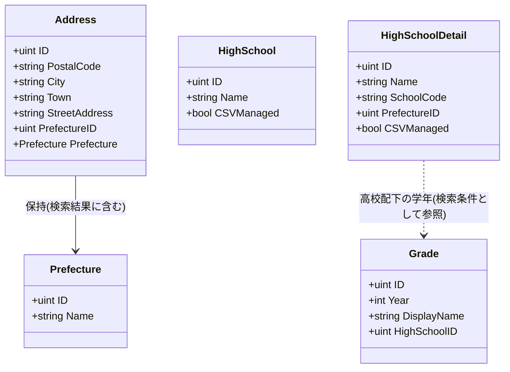
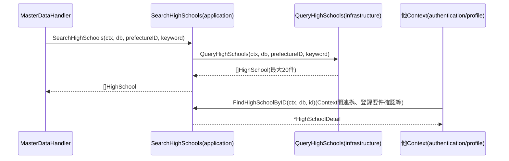

# 共通マスタ参照機能 Go実装仕様書

---

# 1. 機能概要

## 機能概要

会員登録やプロフィール編集の際に、ユーザーが都道府県・住所・在籍高校・学年を選択肢として選べるように、これらのマスタ情報を検索・参照する機能である。都道府県一覧取得・住所検索（都道府県ID必須、市区町村・町域で絞り込み）・高校検索（都道府県ID・キーワードで絞り込み、最大20件）・学年一覧取得（高校ID指定）の4操作を提供する。いずれも新規データの作成・更新・削除は行わない参照専用の機能であり、authentication Context・profile Context等の複数Contextから参照専用に依存される立場にある。

## 採用設計パターンとその理由（②からの要約）

②Go移行・設計仕様書「4. 設計パターン」により、本機能は **Transaction Script** を採用する。

- 都道府県一覧取得・住所検索・高校検索・学年一覧取得という4つの参照操作のみで構成され、状態管理・複雑な業務ルールが現行仕様に存在しないこと
- 「都道府県IDで絞り込む」「市区町村・町域に部分一致する」「高校名に部分一致する」「上位20件に制限する」という、いずれも検索条件の組み立てレベルの単純な処理のみで構成されること
- Prefecture・Address・HighSchool・Gradeはいずれも状態を持たない完全なマスタ参照データであり、Entityへ振る舞い・永続化責務を集約するメリットが薄いこと

上記の理由からActive Record・Domain Model・Event Sourcingは採用せず、Transaction Scriptを採用している（詳細は②「4. 設計パターン」参照）。

## 本書が対象とする実装範囲

本書は、②で確定した設計（Bounded Context・Aggregate（不採用）・Entity・Value Object（不採用）・Repository・UseCase・Transaction境界（不使用）・Validation方針・Authorization方針・Error設計・Domain Event（不採用）・API互換方針・DB方針・テスト戦略）を変更せず、Goでの具体的なコード構成に落とし込むことを目的とする。

規約`アーキテクチャ規約.md`「3. 設計パターンごとの構造適用方針」の「Transaction Script」節に従い、domain層・usecase層（struct化）・Repository Interfaceを設けない構造（`application/`直下の関数 + `infrastructure/`直下の関数 + `presentation/`）を適用する。②文書中の「Repository」という表記は、本書では規約の指示どおりinfrastructure層の関数として読み替える。

本Contextはauthentication Context（認証機能）・profile Context（プロフィール管理機能）から参照専用に依存される（②「3. Bounded Context」「他Contextとの依存関係」）。②自身が定義する4操作（②「12. UseCase設計」）に加え、この依存関係を満たすための単一ID実在確認・詳細取得関数を②からの補足として追加する（6章参照）。

①Rails実装詳細は本タスクでは提供されていないため、①の実装コードそのものを根拠とする記載は行わない（①未提供のため参照不可）。②に明記された「Rails現行仕様の要約」の範囲でのみ言及する。

---

# 2. ディレクトリ構成

## 対象Bounded Context名

- Context名（②）: `master-data`
- ディレクトリ名: `internal/master_data`

  > **②からの補足**: ②にはディレクトリ名の明記がない。アーキテクチャ規約「8. 命名規約（アーキテクチャレベル）」に従い、kebab-caseのContext名`master-data`をGoパッケージ名として妥当なsnake_case相当のディレクトリ名に変換した（推測）。

## ②で採用した設計パターン

Transaction Script

## 作成するディレクトリ一覧

```
internal/master_data/
├── application/
└── infrastructure/
└── presentation/
    ├── handler/
    ├── response/
    └── routes.go
```

アーキテクチャ規約「3. 設計パターンごとの構造適用方針」の「Transaction Script」節に従い、`domain/`は設けない。`application/`直下に1業務操作1関数、`infrastructure/`直下にDBアクセス関数を置く。本機能は入力検証のうち型・必須チェックのみで完結するRequest DTOを要しないため（後述12章）、`presentation/request/`は設けない。

## 作成するファイル一覧

```
internal/master_data/application/list_prefectures.go
internal/master_data/application/search_addresses.go
internal/master_data/application/exists_address.go
internal/master_data/application/search_high_schools.go
internal/master_data/application/find_high_school_by_id.go
internal/master_data/application/exists_high_school.go
internal/master_data/application/list_grades.go
internal/master_data/application/find_grade_by_id.go
internal/master_data/application/exists_grade.go

internal/master_data/infrastructure/prefecture_query.go
internal/master_data/infrastructure/address_query.go
internal/master_data/infrastructure/high_school_query.go
internal/master_data/infrastructure/grade_query.go

internal/master_data/presentation/handler/master_data_handler.go
internal/master_data/presentation/response/master_data_response.go
internal/master_data/presentation/routes.go
```

---

# 3. Domain層設計

対象外（Transaction Script採用のため、Domain層を設けない）。都道府県・住所・在籍高校・学年の属性保持は、6章（Application層設計）のDTO（`Prefecture`・`Address`・`HighSchool`・`Grade`等）として、業務ロジック（検証・状態遷移・権限判定）は各関数のガード節として記載する。

---

# 4. クラス図

Transaction Script採用のため、各Entity相当のデータはapplication層のDTO struct、実際の検索処理はinfrastructure層の関数群として実装される（3章・6章・8章参照）。業務概念としての関係を、実際に定義するDTO構造で示す。



`HighSchool`（検索結果、`id`/`name`/`csv_managed`のみ）と`HighSchoolDetail`（他Context向け詳細取得、`school_code`等を含む）は、②「19. API仕様」のレスポンス定義（高校検索は`id`/`name`/`csv_managed`のみ）と、他Context（authentication）が必要とする`school_code`等の詳細情報の用途差を反映して型を分けた（実装判断、後述17章）。Value Object・Domain Serviceは②「7. Value Object設計」「8. Domain Service」のとおり不要と判断したため、クラス図には含めない。

---

# 5. 状態遷移図

該当なし。Prefecture・Address・HighSchool・Gradeはいずれも状態を持たない参照専用のマスタデータであり（②「10. 状態遷移図」に「該当なし」と明記）、状態遷移という概念自体が存在しないため省略する。

---

# 6. Application層設計

**実装上の位置づけ**: 本機能はTransaction Script採用のため、「UseCase」の代わりに`application/`直下に置く関数として記載する（struct化しない）。

## DTO

|struct名|フィールドと型|区分|
|-|-|-|
|`Prefecture`|`ID uint`, `Name string`|出力|
|`Address`|`ID uint`, `PostalCode string`, `City string`, `Town string`, `StreetAddress string`, `PrefectureID uint`, `Prefecture Prefecture`|出力|
|`HighSchool`|`ID uint`, `Name string`, `CSVManaged bool`|出力（検索結果、②「19. API仕様」のレスポンス項目に対応）|
|`HighSchoolDetail`|`ID uint`, `Name string`, `SchoolCode string`, `PrefectureID uint`, `CSVManaged bool`|出力（他Context向け詳細取得。②からの補足、後述）|
|`Grade`|`ID uint`, `Year int`, `DisplayName string`, `HighSchoolID uint`|出力|

## 関数

### ListPrefectures（`application/list_prefectures.go`）

- 関数名: `ListPrefectures`
- シグネチャ: `func ListPrefectures(ctx context.Context, db *gorm.DB) ([]Prefecture, error)`
- 処理ステップ: `infrastructure.QueryAllPrefectures(ctx, db)`を呼び出し、結果をそのまま返す
- 呼び出すinfrastructure関数: `QueryAllPrefectures`
- 判断根拠: 条件なしの全件取得であり、業務ルールが存在しないため（②「12. UseCase設計」）

### SearchAddresses（`application/search_addresses.go`）

- 関数名: `SearchAddresses`
- シグネチャ: `func SearchAddresses(ctx context.Context, db *gorm.DB, prefectureID uint, city, town string) ([]Address, error)`
- 処理ステップ: `infrastructure.QueryAddresses(ctx, db, prefectureID, city, town)`を呼び出し、結果をそのまま返す（`prefectureID`必須チェックはPresentation層で完了済みの前提）
- 呼び出すinfrastructure関数: `QueryAddresses`
- 判断根拠: 単一の検索条件による一覧取得であり、複数の検索関数を組み合わせる必要がないため

### ExistsAddress（`application/exists_address.go`）

- 関数名: `ExistsAddress`
- シグネチャ: `func ExistsAddress(ctx context.Context, db *gorm.DB, id uint) (bool, error)`
- 処理ステップ: `infrastructure.QueryAddressExists(ctx, db, id)`を呼び出し、結果をそのまま返す
- 呼び出すinfrastructure関数: `QueryAddressExists`
- 判断根拠: profile Context（②「他Contextとの依存関係」の「プロフィール更新時の住所ID実在確認に利用する」）が本Contextに要求する参照手段だが、②「11. Repository設計」のAddressRepositoryは範囲検索機能のみを定義しており、単一ID実在確認関数を明示していない。本書で②からの補足として追加する（17章参照）

### SearchHighSchools（`application/search_high_schools.go`）

- 関数名: `SearchHighSchools`
- シグネチャ: `func SearchHighSchools(ctx context.Context, db *gorm.DB, prefectureID *uint, keyword string) ([]HighSchool, error)`
- 処理ステップ: `infrastructure.QueryHighSchools(ctx, db, prefectureID, keyword)`を呼び出し、結果をそのまま返す（件数制限20件・名称昇順ソートはinfrastructure関数内で完結する）
- 呼び出すinfrastructure関数: `QueryHighSchools`
- 判断根拠: 単一の検索条件による一覧取得であり、件数制限（20件）も検索関数内で完結するため

### FindHighSchoolByID（`application/find_high_school_by_id.go`）

- 関数名: `FindHighSchoolByID`
- シグネチャ: `func FindHighSchoolByID(ctx context.Context, db *gorm.DB, id uint) (*HighSchoolDetail, error)`
- 処理ステップ: `infrastructure.QueryHighSchoolByID(ctx, db, id)`を呼び出し、結果をそのまま返す（見つからない場合は`(nil, nil)`）
- 呼び出すinfrastructure関数: `QueryHighSchoolByID`
- 判断根拠: authentication Context（②「他Contextとの依存関係」の「新規登録時の高校・学年の実在確認」「生徒コード指定時の学校コード整合確認（高校の`school_code`参照）」）が要求する詳細取得手段。②「11. Repository設計」のHighSchoolRepositoryは範囲検索機能のみを定義しており、単一ID詳細取得関数を明示していない。本書で②からの補足として追加する（17章参照）

### ExistsHighSchool（`application/exists_high_school.go`）

- 関数名: `ExistsHighSchool`
- シグネチャ: `func ExistsHighSchool(ctx context.Context, db *gorm.DB, id uint) (bool, error)`
- 処理ステップ: `infrastructure.QueryHighSchoolExists(ctx, db, id)`を呼び出し、結果をそのまま返す
- 呼び出すinfrastructure関数: `QueryHighSchoolExists`
- 判断根拠: authentication Contextの通常登録フロー（学校コードが不要なteacherロール等）における高校IDの単純な存在確認要求に対応する（②からの補足、後述17章）

### ListGrades（`application/list_grades.go`）

- 関数名: `ListGrades`
- シグネチャ: `func ListGrades(ctx context.Context, db *gorm.DB, highSchoolID uint) ([]Grade, error)`
- 処理ステップ: `infrastructure.QueryGradesByHighSchool(ctx, db, highSchoolID)`を呼び出し、結果をそのまま返す
- 呼び出すinfrastructure関数: `QueryGradesByHighSchool`
- 判断根拠: 単一の検索条件による一覧取得であり、業務ルールが存在しないため

### FindGradeByID（`application/find_grade_by_id.go`）

- 関数名: `FindGradeByID`
- シグネチャ: `func FindGradeByID(ctx context.Context, db *gorm.DB, id uint) (*Grade, error)`
- 処理ステップ: `infrastructure.QueryGradeByID(ctx, db, id)`を呼び出し、結果をそのまま返す（見つからない場合は`(nil, nil)`）
- 呼び出すinfrastructure関数: `QueryGradeByID`
- 判断根拠: authentication Contextの`GetCurrentUserUseCase`（認証機能_Go実装仕様書「6. Application層設計」参照）が要求する学年詳細取得手段（②からの補足、後述17章）

### ExistsGrade（`application/exists_grade.go`）

- 関数名: `ExistsGrade`
- シグネチャ: `func ExistsGrade(ctx context.Context, db *gorm.DB, id uint) (bool, error)`
- 処理ステップ: `infrastructure.QueryGradeExists(ctx, db, id)`を呼び出し、結果をそのまま返す
- 呼び出すinfrastructure関数: `QueryGradeExists`
- 判断根拠: authentication Contextの通常登録フローにおける学年IDの存在確認要求に対応する（②からの補足、後述17章）

---

# 7. シーケンス図・処理フロー図

## シーケンス図（SearchHighSchools）

Transaction Script採用のためUseCase層・Repository Interfaceはなく、Handlerがapplication層の関数を、application層の関数がinfrastructure層の検索関数を直接呼び出す。他Context（authentication, profile）からの参照が発生する場合の呼び出し経路も併せて示す。



## 処理フロー図

単純な条件分岐（都道府県ID・キーワードの有無）のみで構成される参照処理であり、状態遷移や複雑な業務判断を伴わないため、処理フロー図は省略する（②「13. シーケンス図・処理フロー図」と同じ判断。分岐は「検索条件が指定されているか」という単純なパラメータの有無のみであり、フローチャートによる可視化の必要性が低い）。

---

# 8. Infrastructure層設計

## Infrastructure関数（Transaction Script採用時）

### prefecture_query.go

|関数名|引数|戻り値|発行するクエリ内容|
|-|-|-|-|
|`QueryAllPrefectures`|`(ctx context.Context, db *gorm.DB)`|`([]Prefecture, error)`|`prefectures`全件を取得する（ソート順は②「21. DB操作仕様」により未確定、後述17章）|

### address_query.go

|関数名|引数|戻り値|発行するクエリ内容|
|-|-|-|-|
|`QueryAddresses`|`(ctx context.Context, db *gorm.DB, prefectureID uint, city, town string)`|`([]Address, error)`|`addresses`テーブルに対し`prefecture_id = ?`（必須）、`city`部分一致（任意）、`town`部分一致（任意）で絞り込み、`prefectures`とJOINして都道府県情報を含めて返す（②「21. DB操作仕様」）|
|`QueryAddressExists`|`(ctx context.Context, db *gorm.DB, id uint)`|`(bool, error)`|`addresses`テーブルに対し`id = ?`の存在確認を行う|

### high_school_query.go

|関数名|引数|戻り値|発行するクエリ内容|
|-|-|-|-|
|`QueryHighSchools`|`(ctx context.Context, db *gorm.DB, prefectureID *uint, keyword string)`|`([]HighSchool, error)`|`high_schools`テーブルに対し`prefecture_id = ?`（任意）、高校名部分一致`keyword`（任意）で絞り込み、名称昇順ソート・最大20件（`LIMIT 20`）で取得する（②「21. DB操作仕様」）|
|`QueryHighSchoolByID`|`(ctx context.Context, db *gorm.DB, id uint)`|`(*HighSchoolDetail, error)`|`high_schools`テーブルに対し`id = ?`で1件検索し、`school_code`・`prefecture_id`・`csv_managed`を含めて返す|
|`QueryHighSchoolExists`|`(ctx context.Context, db *gorm.DB, id uint)`|`(bool, error)`|`high_schools`テーブルに対し`id = ?`の存在確認を行う|

### grade_query.go

|関数名|引数|戻り値|発行するクエリ内容|
|-|-|-|-|
|`QueryGradesByHighSchool`|`(ctx context.Context, db *gorm.DB, highSchoolID uint)`|`([]Grade, error)`|`grades`テーブルに対し`high_school_id = ?`（必須）で絞り込む（②「21. DB操作仕様」によりソート順は未確定、後述17章）|
|`QueryGradeByID`|`(ctx context.Context, db *gorm.DB, id uint)`|`(*Grade, error)`|`grades`テーブルに対し`id = ?`で1件検索する|
|`QueryGradeExists`|`(ctx context.Context, db *gorm.DB, id uint)`|`(bool, error)`|`grades`テーブルに対し`id = ?`の存在確認を行う|

各infrastructure関数は、非公開のGORMモデル（`prefectureModel` / `addressModel` / `highSchoolModel` / `gradeModel`、15章参照）から6章のDTO（`Prefecture`等）への変換を関数内で行い、GORMモデル自体をapplication層・presentation層へ漏らさない。

## 外部連携実装

対象外。本機能はMail・Cache・Queue等の外部連携を必要としない（②「18. Domain Event」に記載なし）。

---

# 9. Presentation層設計

## Handler

### MasterDataHandler（`presentation/handler/master_data_handler.go`）

- struct名: `MasterDataHandler`
- 対応する呼び出し先: `application.ListPrefectures` / `application.SearchAddresses` / `application.SearchHighSchools` / `application.ListGrades`
- フィールド: `db *gorm.DB`（各application関数へ明示的に渡す。Transaction Script採用のためusecase層を経由しない分、DBハンドルの受け渡しをHandlerが担う）
- メソッド一覧:

|メソッド|HTTPメソッド|パス|
|-|-|-|
|`ListPrefectures`|GET|`/api/v1/prefectures`|
|`SearchAddresses`|GET|`/api/v1/addresses`|
|`SearchHighSchools`|GET|`/api/v1/high_schools`|
|`ListGrades`|GET|`/api/v1/high_schools/:high_school_id/grades`|

- `ListPrefectures`処理順序: `application.ListPrefectures(ctx, h.db)`を呼び出す → `response.PrefectureResponse`のスライスへ変換して200で返却
- `SearchAddresses`処理順序: クエリパラメータ`prefecture_id`（必須）・`city`・`town`（任意）をバインド → Presentation Validation（`prefecture_id`必須チェック、12章）→ `application.SearchAddresses(ctx, h.db, prefectureID, city, town)`を呼び出す → `response.AddressResponse`のスライスへ変換して200で返却
- `SearchHighSchools`処理順序: クエリパラメータ`prefecture_id`・`keyword`（いずれも任意）をバインド → `application.SearchHighSchools(ctx, h.db, prefectureID, keyword)`を呼び出す → `response.HighSchoolResponse`のスライスへ変換して200で返却
- `ListGrades`処理順序: パスパラメータ`high_school_id`（必須）をバインド → Presentation Validation（必須チェック、12章）→ `application.ListGrades(ctx, h.db, highSchoolID)`を呼び出す → `response.GradeResponse`のスライスへ変換して200で返却

Transaction Script採用のためUseCase層を経由しない分、権限チェック（住所検索のみ認証必須）はルーティング（Middleware適用有無）で表現し、Handler内では追加の権限判定を行わない（13章参照）。

## Request / Response DTO

Request DTOは、クエリパラメータ・パスパラメータの型がGinの`ShouldBindQuery` / `Param`で直接扱える単純な値（`uint`/`string`）のみであるため、専用のstructは設けず、Handlerメソッド内でGinの`Query()` / `Param()` / `ShouldBindQuery`により直接取得する（②「15. Validation設計」の検証内容が「型・必須チェックのみ」に閉じているため、過剰な構造化を避ける）。

Response（`presentation/response/master_data_response.go`）:

|struct名|フィールドと型|
|-|-|
|`PrefectureResponse`|`ID uint`, `Name string`|
|`AddressResponse`|`ID uint`, `PostalCode string`, `City string`, `Town string`, `Prefecture PrefectureResponse`|
|`HighSchoolResponse`|`ID uint`, `Name string`, `CSVManaged bool`|
|`GradeResponse`|`ID uint`, `Year int`, `DisplayName string`|

## Routing（`presentation/routes.go`）

|Method|Path|Handler|認証|
|-|-|-|-|
|GET|`/api/v1/prefectures`|`MasterDataHandler.ListPrefectures`|不要|
|GET|`/api/v1/addresses`|`MasterDataHandler.SearchAddresses`|必須|
|GET|`/api/v1/high_schools`|`MasterDataHandler.SearchHighSchools`|不要|
|GET|`/api/v1/high_schools/:high_school_id/grades`|`MasterDataHandler.ListGrades`|不要|

---

# 10. API仕様

|Method|Path|Handler|Request|Response|Status Code|
|-|-|-|-|-|-|
|GET|/api/v1/prefectures|MasterDataHandler.ListPrefectures|-|`[]PrefectureResponse`|200|
|GET|/api/v1/addresses|MasterDataHandler.SearchAddresses|`prefecture_id`（query, required）, `city`（query, optional）, `town`（query, optional）|`[]AddressResponse`|200|
|GET|/api/v1/high_schools|MasterDataHandler.SearchHighSchools|`prefecture_id`（query, optional）, `keyword`（query, optional）|`[]HighSchoolResponse`（最大20件）|200|
|GET|/api/v1/high_schools/:high_school_id/grades|MasterDataHandler.ListGrades|`high_school_id`（path, required）|`[]GradeResponse`|200|

## Errorケース

|Endpoint|条件|Status Code|Error内容|
|-|-|-|-|
|住所検索|`prefecture_id`未指定|400|バリデーションエラー（②「17. Error設計」により、他機能の422とは異なり400を維持。フロントエンド互換性優先）|
|住所検索|未ログイン|401|Middlewareレベルで拒否|
|高校検索・学年一覧取得|検索条件に一致するデータがない|200|正常系（空配列を返す）|
|全エンドポイント|DB接続失敗等の想定外エラー|500|Infrastructure Error|

---

# 11. Transaction実装方針

## Transaction開始箇所

なし。

## Transaction終了箇所

なし。

## 複数Repository（またはStore・関数）にまたがる場合の扱い

該当なし。②「14. Transaction設計」のとおり、状態を変更する処理が存在しないためトランザクションによる整合性保証は不要である。`SearchAddresses`が`addresses`と`prefectures`をJOINする等、複数テーブルを参照する場合も単一の読み取りクエリで完結するため、トランザクション境界の設計は不要である。

---

# 12. Validation実装方針

## Presentation

|フィールド|struct名|バリデーションタグ／チェック内容|エラーメッセージ|
|-|-|-|-|
|`prefecture_id`（住所検索）|-（Handler内でGinの`Query`から直接取得）|必須・数値変換（`strconv.Atoi`失敗時または未指定時にエラー）|「都道府県は必須です。」|
|`prefecture_id`（高校検索）|-|任意・数値（未指定時は絞り込みなしとして扱う）|-|
|`city` / `town`|-|任意・文字列（空文字は絞り込み条件として扱わない）|-|
|`keyword`|-|任意・文字列|-|
|`high_school_id`（学年一覧取得）|-|必須・数値（パスパラメータ）|「高校の指定が不正です」|

Request DTOのstructを設けない方針（9章）のため、バリデーションタグではなくHandler内のガード節（コーディング規約「9. 関数・メソッド設計」の早期return）として実装する。

## 業務ルール検証

②「15. Validation設計」のとおり、本機能は業務ルールを持たないため、Presentation層での型チェック・必須チェックのみで入力検証が完結する。Application層・Infrastructure層で追加の妥当性判定は行わない。

---

# 13. Authorization実装方針

②「16. Authorization設計」を実装レベルに落とし込む。

## Middleware

- `/api/v1/prefectures` / `/api/v1/high_schools` / `/api/v1/high_schools/:high_school_id/grades`は認証チェックの対象外とし、未ログイン状態でも利用可能とする（Ginのルートグループを分離し、Middlewareを適用しない）
- `/api/v1/addresses`のみ、認証済みユーザーであることを確認するMiddlewareを適用する

## Handler

- 業務権限判定は持たせない

## Application関数

- 権限判定は行わない（認証が必要な住所検索についても、ロールによる絞り込みは行わず、ログイン中であればどのロールでも利用可能）

---

# 14. Error実装方針

## Domain Error → Application Errorへの変換方針

Transaction Script採用のためDomain Errorに相当する層はない（アーキテクチャ規約「7. 横断的関心事の置き場所」）。本機能では業務ルール違反自体が発生しないため、Application Errorは「取得処理自体の失敗（想定外の検索条件など）」に限定される（②「17. Error設計」）。

## Application Error → HTTPレスポンスへの変換方針

|業務シナリオ|Error種別|発生層|HTTP Status|
|-|-|-|-|
|住所検索で`prefecture_id`未指定|Validation|Presentation|400|
|住所検索で未ログイン|Unauthorized|Presentation(Middleware)|401|
|検索条件に一致するデータがない（高校検索・学年一覧取得）|-（正常系。空配列を返す）|-|200|
|DB接続失敗等の想定外エラー|Internal|Infrastructure|500|

住所検索の`prefecture_id`未指定エラーのみ、他機能の入力検証エラー（多くは422）とは異なり②「17. Error設計」により400を維持する（フロントエンド互換性優先。アーキテクチャ規約「16. 今後の課題」に挙げられているプロジェクト全体のステータスコード不統一問題であり、本機能単独では解決しない）。

## Infrastructure Errorのハンドリング方針

`infrastructure/`配下のクエリ関数で発生したGORM由来のエラーは、`fmt.Errorf`でラップしてapplication層関数経由でHandlerへ伝播させ（コーディング規約「18. エラーハンドリング」）、Presentation層の集中エラーハンドリングミドルウェア（Gin規約「8. エラーハンドリングミドルウェア」）で未分類のエラーとして500に変換する。

---

# 15. GORM / DBクエリ設計

②「20. DB設計方針」により、既存Rails DBをそのまま継続利用し、スキーマ変更は行わない。

## 利用するGORMモデルとテーブルの対応

`infrastructure/`配下の各クエリ関数内で非公開のGORMモデルを定義する（application層・presentation層には6章のDTOのみを公開し、GORMタグ付きモデルを漏らさない）。

|struct名|テーブル|備考|
|-|-|-|
|`prefectureModel`|`prefectures`|`ID uint`, `Name string`。Gorm規約のデフォルト複数形変換で実テーブル名と一致するため`TableName()`のオーバーライドは不要|
|`addressModel`|`addresses`|`ID uint`, `PostalCode string`, `City string`, `Town string`, `StreetAddress string`, `PrefectureID uint`|
|`highSchoolModel`|`high_schools`|`ID uint`, `Name string`, `PrefectureID uint`, `SchoolCode string`, `CSVManaged bool`|
|`gradeModel`|`grades`|`ID uint`, `HighSchoolID uint`, `Year int`, `DisplayName string`|

master-data Contextは本4テーブルの正規の所有者であり、authentication Context・profile Contextはこれらのモデル定義を直接importせず、本Contextが公開するapplication層関数（6章）経由でのみアクセスする（アーキテクチャ規約「5. Context間連携ルール」）。

## 主要クエリの条件・ソート・ページネーション方針

|Repository/Store|メソッド|対象テーブル|条件|結合|
|-|-|-|-|-|
|PrefectureRepository相当|`QueryAllPrefectures`|prefectures|なし（全件）|なし|
|AddressRepository相当|`QueryAddresses`|addresses|`prefecture_id`（必須）、`city`（部分一致・任意）、`town`（部分一致・任意）|prefecturesとJOIN（都道府県情報を含めて返却するため）|
|AddressRepository相当|`QueryAddressExists`|addresses|`id = ?`|なし|
|HighSchoolRepository相当|`QueryHighSchools`|high_schools|`prefecture_id`（任意）、`keyword`（高校名部分一致・任意）|なし。名称昇順・`LIMIT 20`|
|HighSchoolRepository相当|`QueryHighSchoolByID` / `QueryHighSchoolExists`|high_schools|`id = ?`|なし|
|GradeRepository相当|`QueryGradesByHighSchool`|grades|`high_school_id`（必須）|なし|
|GradeRepository相当|`QueryGradeByID` / `QueryGradeExists`|grades|`id = ?`|なし|

`QueryAllPrefectures`・`QueryGradesByHighSchool`のソート順は②「21. DB操作仕様」でも「現行仕様書に記載なし（推測）」とされており、本書でも確定しない（17章参照）。SQL文そのものは記載しない。

## 既存Schemaへの変更

②「20. DB設計方針」により変更なし。

---

# 16. テストケース設計

②「22. テスト戦略」を、規約「16. テストケース設計」のTransaction Script読み替え（「Domain Test」「Repository Test」は対象外、「UseCase Test」→「Application関数 Test」）に従って具体化する。

## Domain Test

対象外（業務ルールが存在しないため、Domain層自体を設けない）。

## Application関数 Test

|対象|テストケース|
|-|-|
|`ListPrefectures`|全件が取得できること|
|`SearchAddresses`|`prefecture_id`のみ指定時に都道府県内の全住所が取得できること／`city`・`town`を組み合わせた絞り込みが正しく機能すること／都道府県情報が結合されて返ること|
|`ExistsAddress`|存在する/しない住所IDでの判定結果|
|`SearchHighSchools`|`prefecture_id`・`keyword`の有無による取得結果の違い／該当が20件を超える場合に20件に制限されること／名称昇順でソートされること|
|`FindHighSchoolByID`|存在する/しない高校IDでの取得結果、`school_code`・`csv_managed`が含まれること|
|`ExistsHighSchool`|存在する/しない高校IDでの判定結果|
|`ListGrades`|`high_school_id`指定による取得結果、他校の学年が含まれないこと|
|`FindGradeByID` / `ExistsGrade`|存在する/しない学年IDでの取得・判定結果|

## Repository Test

対象外（Repository Interfaceを設けないため。8章の各infrastructure関数のクエリ内容は「Application関数 Test」で結合的に検証する、または個別にinfrastructure関数単位のテストとして追加してもよい）。

## Handler Test

|対象|テストケース|
|-|-|
|`MasterDataHandler.ListPrefectures`|200と都道府県一覧が返ること|
|`MasterDataHandler.SearchAddresses`|`prefecture_id`未指定時に400が返ること／未認証時に401が返ること／正常時に200と検索結果が返ること|
|`MasterDataHandler.SearchHighSchools`|認証不要でアクセスできること／`prefecture_id`・`keyword`未指定でも200が返ること|
|`MasterDataHandler.ListGrades`|`high_school_id`が不正な形式の場合にエラーが返ること／正常時に200と学年一覧が返ること|

## Integration Test

|対象|テストケース|
|-|-|
|`GET /api/v1/prefectures`|エンドポイント経由で都道府県一覧が取得できること|
|`GET /api/v1/addresses`|エンドポイント経由で住所検索が行え、未ログイン時に401が返ること|
|`GET /api/v1/high_schools`|エンドポイント経由で高校検索（最大20件・名称昇順）が行えること|
|`GET /api/v1/high_schools/:high_school_id/grades`|エンドポイント経由で学年一覧が取得できること|

---

# 17. ②からの補足事項

②に明記がなく、実装のために追加で判断した内容を以下に列挙する。

|判断した内容|判断理由|推測かどうか|
|-|-|-|
|ディレクトリ名を`internal/master_data`とした|②のContext名`master-data`はkebab-caseであり、Goパッケージ名としての変換方法（ハイフンをアンダースコアに置換）が②に明記されていない。アーキテクチャ規約「8. 命名規約」に従い変換した|推測|
|`ExistsAddress` / `FindHighSchoolByID` / `ExistsHighSchool` / `FindGradeByID` / `ExistsGrade`という5つのapplication関数を、②「12. UseCase設計」が定義する4操作（ListPrefectures/SearchAddresses/SearchHighSchools/ListGrades）に加えて追加した|②「3. Bounded Context」「他Contextとの依存関係」が、authentication Context・profile Contextからの参照専用依存（高校・学年の実在確認、学校コード参照、住所ID実在確認）を明記している一方、②「11. Repository設計」の各Repositoryは範囲検索機能のみを定義し、単一ID実在確認・詳細取得の関数までは規定していない。この依存を満たすための最小限の関数を、本書側の実装判断として追加した|②からの補足（依存関係自体は②が既に想定しているため、新しい業務ルールの追加ではない）|
|`HighSchool`（検索結果用、`id`/`name`/`csv_managed`）と`HighSchoolDetail`（他Context向け、`school_code`等を含む）を別のDTO structとして分けた|②「19. API仕様」の高校検索レスポンスは`id`/`name`/`csv_managed`のみを含むと明記されている一方、authentication Contextが必要とする学校コード整合確認には`school_code`が必要であり、両者の用途が異なるため型を分離した|実装判断（②の記載同士を矛盾なく両立させるための判断）|
|`QueryAllPrefectures` / `QueryGradesByHighSchool`のソート順を確定しなかった|②「21. DB操作仕様」自体が「現行仕様書に明記なし（推測）」としているため、本書でも確定せず、実装時に①側の挙動確認を要する旨を明記するに留めた|①未提供のため参照不可（②の推測を維持）|
|Request DTOのstructを設けず、Handler内でGinの`Query()` / `Param()`から直接値を取得する構成とした|②「15. Validation設計」の検証内容が型・必須チェックのみに閉じており、専用structを設けるほどの複雑さがないため、アーキテクチャ規約が戒める過剰設計を避ける判断とした|実装判断|
|`MasterDataHandler`が`db *gorm.DB`をフィールドとして保持し、各application関数へ明示的に渡す構成とした|Transaction Script採用のためusecase層が存在せず、DBハンドルの受け渡し起点をHandlerに置く必要がある。②に具体的なDI方法の指定はないため、アーキテクチャ規約「14. 依存関係の組み立て（DI配線）」のContext単位組み立て関数（`NewContext(db, logger)`）から`db`を受け取る構成を前提とした|推測|

上記以外の設計判断（Bounded Context・Repository・UseCase・Validation方針・Authorization方針・Error設計・API互換方針・DB方針・テスト戦略の基本方針）はすべて②の記載をそのまま踏襲しており、変更・追加した業務ルールはない。
