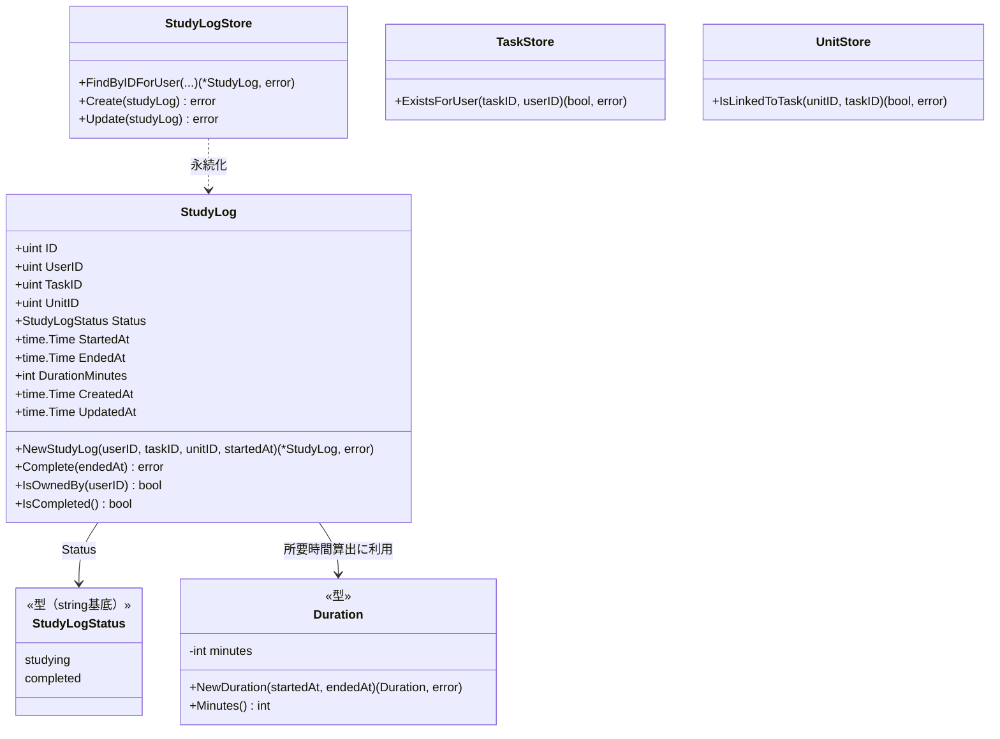
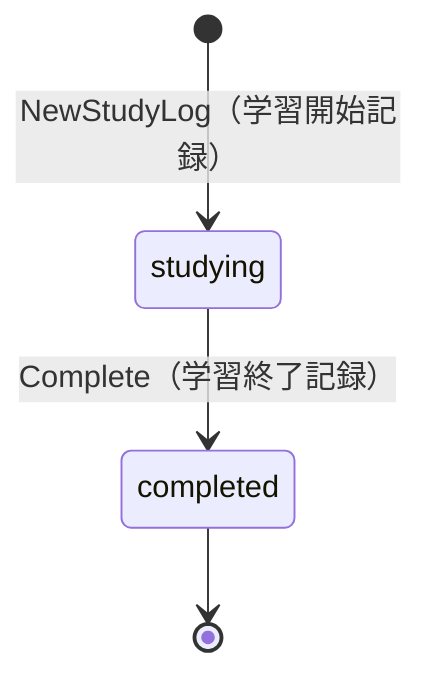
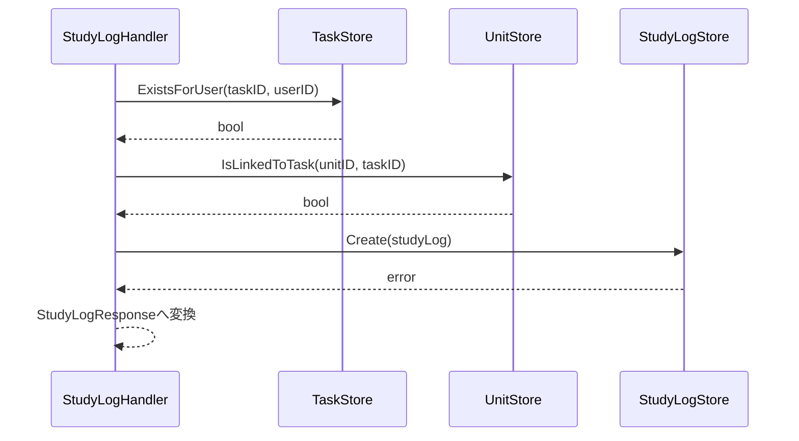
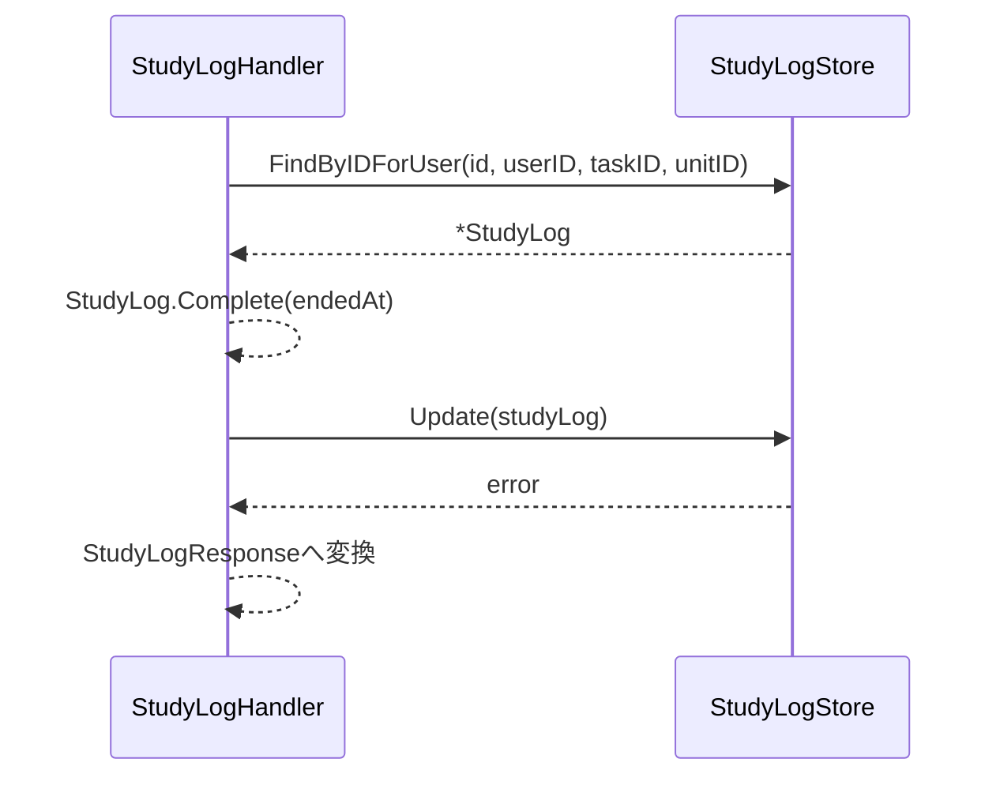

# 学習ログ機能 Go実装仕様書

---

# 1. 機能概要

## 機能概要

生徒がタスク内の単元学習にどれだけ取り組んだかを記録する機能である。学習開始記録（作成）と学習終了記録（完了）の2操作を提供する。同一のタスク・単元に対して、学習セッションごとに複数の学習ログを作成できる（②「1. 機能概要」要約）。

## 採用設計パターンとその理由（②からの要約）

②「4. 設計パターン」により **Active Record** を採用する。

- 主要操作が開始・完了の2操作のみで、CRUDに近い単純さを持つ
- 状態（`studying` / `completed`）を持つが、遷移は「学習中→完了」という一方向・単一経路であり、複数の業務ルールが絡み合うものではない
- 所要時間の算出（開始時刻からの経過時間を分単位で算出）は、StudyLog自身の属性から導出できる単純な計算であり、Entityのメソッドとして自然に表現できる

Transaction Script（開始・完了それぞれの検証と算出ロジックをEntity側にまとめた方が将来の変更に強い）、Domain Model（複数の業務ルールが絡み合う複雑さが現行仕様に存在しない）、Event Sourcing（イベント再構築の要件がない）はいずれも②「4. 設計パターン」の「採用しなかったパターン」節の理由により不採用とされている。本書はこの判断を変更しない。

本書は、`規約/アーキテクチャ規約.md`「3. 設計パターンごとの構造適用方針」の **Active Record** 節の構造（`model.go`相当のstruct定義＋`store.go`相当のStore、usecase層なし、Repository Interfaceの分離なし）に従って実装レベルへ落とし込む。

## 本書が対象とする実装範囲

- Bounded Context: `study-log`（②「3. Bounded Context」）
- 対象エンドポイント: 学習開始記録・学習終了記録の2API（②「19. API仕様」）
- 対象外: Task・Unitそのものの管理機能（他Contextの責務。②「3. Bounded Context」他Contextとの依存関係を参照）
- ②「3. Bounded Context」「関連Context（依存関係ではないもの）」に、問題解答機能（question-answering Context）が同じタスク・単元配下で並行提供される旨の記載がある。②が明記するとおり、study-log Contextとquestion-answering Contextは互いのデータを参照・更新しない独立した関係であるため、本書ではquestion-answering Context側のEntity・Repository・エンドポイントへの依存を一切追加しない
- ①Rails実装の詳細は本タスクでは提供されていないため、参照が必要な箇所は「①未提供のため参照不可」として扱う

---

# 2. ディレクトリ構成

## 対象Bounded Context名

`study-log`

②にはGo実装上のディレクトリ名の明記がない。アーキテクチャ規約「9. 命名規約」に基づき、既存の`task-management`→`internal/task`の対応関係に倣い、`study-log`→`internal/study_log`とする（**②からの補足・推測**。詳細は「17. ②からの補足事項」参照）。

## ②で採用した設計パターン

Active Record（②「4. 設計パターン」）

## 採用パターンに対応する構造

`規約/アーキテクチャ規約.md`「3. 設計パターンごとの構造適用方針」Active Record節に従い、domain/infrastructureのレイヤー分離およびusecase層を設けない。Entity相当のstructと永続化操作（Store）を同一package（`internal/study_log`）に置く。

作成するディレクトリ一覧:

```
internal/study_log/
internal/study_log/presentation/
internal/study_log/presentation/handler/
internal/study_log/presentation/request/
internal/study_log/presentation/response/
```

## 作成するファイル一覧

```
internal/study_log/study_log.go               # StudyLog struct・NewStudyLog・Complete等
internal/study_log/study_log_status.go         # StudyLogStatus型
internal/study_log/duration.go                 # Duration型（所要時間算出）
internal/study_log/errors.go                   # struct/Storeが返すエラー変数定義
internal/study_log/study_log_store.go          # StudyLogStore
internal/study_log/task_ref.go                 # TaskRef struct（参照専用）
internal/study_log/task_store.go               # TaskStore（参照専用）
internal/study_log/unit_ref.go                 # UnitRef struct（参照専用）
internal/study_log/unit_store.go               # UnitStore（参照専用）
internal/study_log/presentation/handler/study_log_handler.go
internal/study_log/presentation/request/study_log_request.go
internal/study_log/presentation/response/study_log_response.go
internal/study_log/presentation/routes.go
```

`domain/` `application/` `infrastructure/`の各ディレクトリはActive Record採用のため作成しない（規約3章）。

---

# 3. Domain層設計

**実装上の位置づけ**: 本機能はActive Record採用のため、domain層のディレクトリ分離は行わない。以下は②「6〜8章」の設計意図を、Active Record構造（Model＝struct＋メソッド、Store＝永続化）に落とし込んだものである（規約3章 Active Record節に従う）。

## Model（Entity相当）

### StudyLog（`internal/study_log/study_log.go`）

②「6. Entity設計」StudyLogの責務・②「7. Value Object設計」StudyLogStatus/Durationの独自ルールを、同一package内のstruct・型・メソッドとして統合する。

フィールド:

|フィールド|型|意味|
|-|-|-|
|`ID`|`uint`|学習ログID（主キー）|
|`UserID`|`uint`|所有者（生徒）のユーザーID|
|`TaskID`|`uint`|紐づくタスクID|
|`UnitID`|`uint`|紐づく単元ID|
|`Status`|`StudyLogStatus`|学習ログの状態|
|`StartedAt`|`time.Time`|学習開始時刻|
|`EndedAt`|`*time.Time`|学習終了時刻。`completed`以外では`nil`|
|`DurationMinutes`|`*int`|所要時間（分・切り捨て）。`completed`以外では`nil`|
|`CreatedAt`|`time.Time`|作成日時（GORM自動設定。Gorm規約「タイムスタンプのトラッキング」）|
|`UpdatedAt`|`time.Time`|更新日時（GORM自動設定）|

`StudyLogStatus`型（string基底の独自型）:

```go
type StudyLogStatus string

const (
    StudyLogStatusStudying  StudyLogStatus = "studying"
    StudyLogStatusCompleted StudyLogStatus = "completed"
)
```

公開method一覧（シグネチャのみ。実装ロジックは記載しない）:

|メソッド|引数|戻り値|責務|
|-|-|-|-|
|`NewStudyLog`|`(userID, taskID, unitID uint, startedAt time.Time) (*StudyLog, error)`|`(*StudyLog, error)`|新規StudyLog生成時の不変条件（必須項目・初期status=studying）を保証するファクトリ|
|`(s *StudyLog) Complete(endedAt time.Time) error`|`endedAt time.Time`|`error`|完了操作時に、既に完了状態でないことを検証し（②「6. Entity設計」）、`EndedAt`を設定し、`Duration`により`DurationMinutes`を算出して`Status`を`completed`に遷移する|
|`(s StudyLog) IsOwnedBy(userID uint) bool`|`userID uint`|`bool`|所有者判定（②「16. Authorization設計」の業務的判定を補助）|
|`(s StudyLog) IsCompleted() bool`|なし|`bool`|現在の状態が`completed`かどうかを返す参照系メソッド|

不変条件（`NewStudyLog`で保証する内容）:

- `UserID`・`TaskID`・`UnitID`は0を許容しない
- 生成直後の`Status`は常に`StudyLogStatusStudying`
- 生成直後の`EndedAt`・`DurationMinutes`は常に`nil`

### StudyLogStatus（`internal/study_log/study_log_status.go`）

②「7. Value Object設計」のStudyLogStatusに対応する型。Active Record方針上、独立したValue Object層は設けず、StudyLogの構成要素としてpackage内の付随型として扱う。

|項目|内容|
|-|-|
|型定義|`type StudyLogStatus string`|
|許容値|`studying` / `completed`（②に定義された2値の定数として表現）|
|公開メソッド|`IsValid() bool`（許容値内かどうかを判定する）|

### Duration（`internal/study_log/duration.go`）

②「7. Value Object設計」のDurationに対応する型。

|項目|内容|
|-|-|
|保持するフィールド|`minutes int`（非公開。算出済みの所要時間を保持する）|
|生成方法|`NewDuration(startedAt, endedAt time.Time) (Duration, error)`。`endedAt`が`startedAt`より前の場合はエラーを返す。分単位・切り捨てで算出する（②「7. Value Object設計」独自ルール）|
|公開メソッド|`(d Duration) Minutes() int`（算出済みの分数を返す）|

## Value Object

規約3章「Active Record」節により、Value Objectを独立した層としては設けない（原則「対象外」）。②「7. Value Object設計」で定義されたStudyLogStatus／Durationの独自ルールは、上記「Model」節のとおりStudyLogのフィールド型・付随型としてすべて実現している。②「Value Objectを採用しないもの」（開始時刻・終了時刻そのもの）についても同様に単純な`time.Time`フィールドとして扱う。

## Repository Interface

規約3章「Active Record」節により、domain層にRepository Interfaceを定義しない（原則「対象外」）。②「11. Repository設計」の責務は「8. Infrastructure層設計」節のStoreとして実装する。

なお、②「11. Repository設計」のTaskStore・UnitStoreは、task-management Context・curriculum(Unit) Context側が公開する参照手段であり、study-log Contextがこれらのデータを所有・実装するものではない（`規約/アーキテクチャ規約.md`「5. Context間連携ルール」）。ただし②「11. Repository設計」はTaskStore・UnitStoreを本Context内に配置する設計をすでに決定しているため、本書もその決定をそのまま踏襲し、参照専用のStore（読み取り専用の投影）として`internal/study_log`パッケージ内に実装する（目標管理機能③のTaskStore（参照用）と同様の整理。将来task-management/curriculum Context側が公開APIとして参照系メソッドを整備した場合は、本Storeの実装をそちらの呼び出しに置き換える余地がある）。

## Domain Service

②「8. Domain Service」のとおり、複数Entityを横断する業務ルールは現状存在しないため不要と判断されている。「対象外」とする。

## Domain Event

②「18. Domain Event」のとおり、本機能ではDomain Eventを採用しない。「対象外」とする。

## Domain Error

規約3章「Active Record」節に従い、「struct/Storeが返すエラー」として`internal/study_log/errors.go`に`sentinel error`を定義する。

|変数名|発生条件|対応する②の記載|
|-|-|-|
|`ErrTaskNotFound`|指定task_idのタスクが存在しない、またはcurrent userのものでない|②「17. Error設計」対象タスクが存在しない、または自分のものでない|
|`ErrUnitNotFound`|指定unit_idの単元が対象タスクに紐づいていない|②「17. Error設計」対象単元がタスクに紐づいていない|
|`ErrStudyLogNotFound`|指定idの学習ログが存在しない、またはcurrent userのものでない|②「17. Error設計」対象学習ログが存在しない、または自分のものでない|
|`ErrStudyLogAlreadyCompleted`|`StudyLog.Complete`で既に`completed`状態の学習ログを再度完了させようとした場合|②「17. Error設計」対象学習ログが既に完了している|

---

# 4. クラス図

Active Record採用のため、Model（struct）とStoreの関係として可視化する。



「3. Domain層設計」のstruct定義をそのまま反映した。TaskStore・UnitStoreはStudyLogを直接扱わない参照専用Storeであるため、依存関係のみを示す。

---

# 5. 状態遷移図



`StudyLog.Complete`が遷移の妥当性判定（既に`completed`でないこと）と`EndedAt`・`DurationMinutes`の整合性を保証する（②「10. 状態遷移図」と一致）。`completed`から`studying`への逆遷移、および`completed`状態への再遷移は許可しない。

---

# 6. Application層設計

**実装上の位置づけ**: 本機能はActive Record採用のためusecase層を設けない。「対象外（Active Record採用のため、usecase層を設けない）」とする。②「12. UseCase設計」に記載された2つの業務操作（CreateStudyLog／CompleteStudyLog）は、Handlerが`internal/study_log`のStore・Modelを直接呼び出す処理として実装する。処理順序は「9. Presentation層設計」のHandler処理順序に統合して記載する。

## DTO（Command / Query）

DTOはPresentation層のRequest/Response DTOとして「9. Presentation層設計」にまとめて記載する（Active Record採用のため、Application層独自のCommand/Query DTOは設けない）。

---

# 7. シーケンス図・処理フロー図

Active Record採用のためUseCase層はなく、Handlerが各Storeを直接呼び出す（6章参照）。

## シーケンス図（CreateStudyLog）



## シーケンス図（CompleteStudyLog）



## 処理フロー図

省略する。理由: 「対象タスク・単元が自分のものか」（作成時）、「対象学習ログが自分のものか」「既に完了していないか」（完了時）という直列的な存在確認・状態確認のみであり、分岐が複雑化する要素がないため、「7. シーケンス図」の説明で十分に表現できる（②「13. シーケンス図・処理フロー図」処理フロー図の省略理由を踏襲）。

---

# 8. Infrastructure層設計

**実装上の位置づけ**: 本機能はActive Record採用のためinfrastructure層のディレクトリ分離は行わない。「3. Domain層設計」で定義したModelと同一package（`internal/study_log`）にStoreを置く。

## Store実装

### StudyLogStore（`internal/study_log/study_log_store.go`）

- struct名: `StudyLogStore`
- 対応するGORMモデル: `StudyLog`（同一struct。GORMタグは付与せず、規約のデフォルト命名規則に委ねる。「15. GORM / DBクエリ設計」参照）

コンストラクタ:

```go
func NewStudyLogStore(db *gorm.DB) *StudyLogStore
```

メソッド一覧:

|メソッド|引数|戻り値|発行するクエリ内容|
|-|-|-|-|
|`FindByIDForUser`|`(ctx context.Context, id, userID, taskID, unitID uint)`|`(*StudyLog, error)`|`id`・`user_id`・`task_id`・`unit_id`の一致で1件取得する所有者・対象スコープ検索（②「11. Repository設計」保持する検索機能「user_id + task_id + unit_id + idによる単一取得」）。該当なしは`ErrStudyLogNotFound`を返す|
|`Create`|`(ctx context.Context, s *StudyLog)`|`error`|StudyLogレコードの新規作成（②「12. UseCase設計」CreateStudyLog）|
|`Update`|`(ctx context.Context, s *StudyLog)`|`error`|既存StudyLogレコードの更新（②「12. UseCase設計」CompleteStudyLog）|

保持しない責務（②「11. Repository設計」を踏襲）: 所有権判定そのもの（Handlerが呼び出すTaskStore/UnitStoreの確認結果を前提とする）、完了可否の最終判断（`StudyLog.Complete`がEntity側で担う）。

### TaskStore（参照用、`internal/study_log/task_store.go`）

|項目|内容|
|-|-|
|struct名|`TaskStore`|
|対応するGORMモデル|`TaskRef`（読み取り専用モデル。実体のタスク管理はtask-management Contextの責務であり、本Contextでは参照専用の投影として扱う）|

コンストラクタ:

```go
func NewTaskStore(db *gorm.DB) *TaskStore
```

メソッド一覧:

|メソッド|引数|戻り値|発行するクエリ内容|
|-|-|-|-|
|`ExistsForUser`|`(ctx context.Context, taskID, userID uint)`|`(bool, error)`|指定`task_id`のタスクが`user_id`のものであるかの存在確認クエリ（②「11. Repository設計」TaskStore責務）|

②「11. Repository設計」のとおり、TaskStoreはタスクの作成・更新責務を持たない。

### UnitStore（参照用、`internal/study_log/unit_store.go`）

|項目|内容|
|-|-|
|struct名|`UnitStore`|
|対応するGORMモデル|`UnitRef`（読み取り専用モデル。実体の単元管理はcurriculum(Unit) Contextの責務であり、本Contextでは参照専用の投影として扱う）|

コンストラクタ:

```go
func NewUnitStore(db *gorm.DB) *UnitStore
```

メソッド一覧:

|メソッド|引数|戻り値|発行するクエリ内容|
|-|-|-|-|
|`IsLinkedToTask`|`(ctx context.Context, unitID, taskID uint)`|`(bool, error)`|指定`unit_id`の単元が`task_id`に紐づいているかの存在確認クエリ（②「11. Repository設計」UnitStore責務）|

②「11. Repository設計」のとおり、UnitStoreは単元の作成・更新責務を持たない。

## 外部連携実装

②にMail・Cache・Queue等の外部連携に関する記載はない。「対象外」とする。

---

# 9. Presentation層設計

## Handler

### StudyLogHandler（`internal/study_log/presentation/handler/study_log_handler.go`）

- struct名: `StudyLogHandler`
- 依存: `*study_log.StudyLogStore`、`*study_log.TaskStore`、`*study_log.UnitStore`（コンストラクタで注入する）

```go
func NewStudyLogHandler(
    studyLogStore *study_log.StudyLogStore,
    taskStore *study_log.TaskStore,
    unitStore *study_log.UnitStore,
) *StudyLogHandler
```

メソッド一覧（HTTPメソッド・パスとの対応は「10. API仕様」参照）:

|メソッド|対応API|
|-|-|
|`(h *StudyLogHandler) CreateStudyLog(c *gin.Context)`|POST /api/v1/student/tasks/:task_id/units/:unit_id/study_logs|
|`(h *StudyLogHandler) CompleteStudyLog(c *gin.Context)`|PATCH /api/v1/student/tasks/:task_id/units/:unit_id/study_logs/:id|

Active Record採用のためUseCase層を経由しない。以下、②「12. UseCase設計」で「Handler処理」として記載された業務操作の呼び出し順序を、権限チェック・呼び出し順序を含めてHandlerの処理順序として記載する（規約7章 横断的関心事の置き場所に基づき、認可（所有権・業務権限）は該当Storeまたは本Handlerで行う）。

#### CreateStudyLog 処理順序

1. Middlewareで設定済みのcurrent user（student）をcontextから取得する
2. パスパラメータ`task_id`・`unit_id`をバインドし、型・フォーマットを検証する（②「15. Validation設計」Presentation）
3. `TaskStore.ExistsForUser`で`task_id`がcurrent userのものであるか確認する。該当しない場合は`ErrTaskNotFound`（②「15. Validation設計」業務ルール）
4. `UnitStore.IsLinkedToTask`で`unit_id`が対象タスクに紐づいているか確認する。該当しない場合は`ErrUnitNotFound`
5. `study_log.NewStudyLog`でStudyLogを生成する（初期状態は`studying`）
6. `StudyLogStore.Create`を呼び出す（②「11. Transaction設計」のとおり対象確認と作成を1トランザクションとして扱う）
7. 作成結果（id）をResponse DTOへ変換して返す

#### CompleteStudyLog 処理順序

1. current userを取得する
2. パスパラメータ`task_id`・`unit_id`・`id`をバインドし、型・フォーマットを検証する
3. `StudyLogStore.FindByIDForUser`で対象StudyLogを取得する。存在しない、またはcurrent userのものでない場合は`ErrStudyLogNotFound`（②「15. Validation設計」整合性チェック）
4. `StudyLog.Complete(現在時刻)`で完了可否の判定（既に完了していないか）と所要時間の算出を行う。既に完了している場合は`ErrStudyLogAlreadyCompleted`（②「15. Validation設計」状態チェック）
5. `StudyLogStore.Update`を呼び出す（②「11. Transaction設計」のとおり完了可否チェックと更新を1トランザクションとして扱う）
6. 更新結果（id, status, started_at, ended_at, duration_minutes）をResponse DTOへ変換して返す

## Request / Response DTO

### Request（`internal/study_log/presentation/request/study_log_request.go`）

|struct名|フィールドと型|バリデーションタグ／チェック内容|
|-|-|-|
|`StudyLogPathParams`|`TaskID uint`、`UnitID uint`|`binding:"required"`（パスパラメータの型・必須チェック。②「15. Validation設計」Presentation）|
|`CompleteStudyLogPathParams`|`StudyLogPathParams`（埋め込み）、`ID uint`|`ID`は`binding:"required"`|

CreateStudyLog・CompleteStudyLogはいずれもリクエストボディを持たず、パスパラメータのみで完結する（②「19. API仕様」各エンドポイントの仕様）。

### Response（`internal/study_log/presentation/response/study_log_response.go`）

|struct名|フィールドと型|
|-|-|
|`CreateStudyLogResponse`|`ID uint`|
|`CompleteStudyLogResponse`|`ID uint`、`Status string`、`StartedAt string`、`EndedAt string`、`DurationMinutes int`|

`StartedAt`・`EndedAt`は表示用フォーマットへ変換する。EntityであるStudyLogをそのまま返さず、必ずResponse DTOへ変換する（規約「6. データフロー」）。

## Routing

`internal/study_log/presentation/routes.go`

|Method|Path|Handler|
|-|-|-|
|POST|/api/v1/student/tasks/:task_id/units/:unit_id/study_logs|StudyLogHandler.CreateStudyLog|
|PATCH|/api/v1/student/tasks/:task_id/units/:unit_id/study_logs/:id|StudyLogHandler.CompleteStudyLog|

いずれのルートも認証Middleware（本人確認）・認可Middleware（student roleチェック）を経由する（②「16. Authorization設計」Middleware、「13. Authorization実装方針」参照）。

---

# 10. API仕様

②「19. API仕様」に基づき、Rails現行仕様と同一のエンドポイントを維持する。

|Method|Path|Handler|Request|Response|Status Code|
|-|-|-|-|-|-|
|POST|/api/v1/student/tasks/:task_id/units/:unit_id/study_logs|CreateStudyLog|パスパラメータ`task_id`・`unit_id`|`CreateStudyLogResponse`|201（②「19. API仕様」Status Code「200/201: 作成・更新成功の扱いは既存仕様に合わせて統一する」とあり、作成=201と推測。「17. ②からの補足事項」参照）|
|PATCH|/api/v1/student/tasks/:task_id/units/:unit_id/study_logs/:id|CompleteStudyLog|パスパラメータ`task_id`・`unit_id`・`id`|`CompleteStudyLogResponse`|200|

## Errorケース

|条件|Status Code|Error内容|
|-|-|-|
|未認証|401|認証エラー（Middleware）|
|student以外のロール|403|認可エラー（Middleware）|
|パスパラメータの型・フォーマット不正|422（②に明記なく、他機能の実装パターンに合わせて推測。「17. ②からの補足事項」参照）|Presentation Validationエラー|
|対象タスクが存在しない、または自分のものでない（`ErrTaskNotFound`）|404|②「19. API仕様」対象タスク・単元・学習ログ不存在|
|対象単元がタスクに紐づいていない（`ErrUnitNotFound`）|404|②「19. API仕様」|
|対象学習ログが存在しない、または自分のものでない（`ErrStudyLogNotFound`）|404|②「19. API仕様」|
|既に完了している学習ログへの完了操作（`ErrStudyLogAlreadyCompleted`）|400|②「19. API仕様」|
|DB接続失敗等のInfrastructure Error|500|内部エラー|

---

# 11. Transaction実装方針

②「14. Transaction設計」を実装単位に落とし込む。

## Transaction開始箇所

- Active Record採用のため、`StudyLogStore.Create`・`StudyLogStore.Update`メソッド内で`db.WithContext(ctx).Transaction(func(tx *gorm.DB) error { ... })`を用いてトランザクションを開始する（②「14. Transaction設計」Handlerの処理単位に対応するStoreメソッド内でトランザクションを開始する）

## Transaction終了箇所（Commit / Rollback条件）

- `StudyLogStore.Create`: StudyLogの作成が完了した時点でコミットする。失敗した場合はロールバックする
- `StudyLogStore.Update`: StudyLogの更新が完了した時点でコミットする。失敗した場合はロールバックする

## 複数Storeにまたがる場合の扱い

`TaskStore.ExistsForUser`・`UnitStore.IsLinkedToTask`による存在確認は、トランザクション開始前（Handler側）で完了させ、トランザクション内では行わない。いずれも単一のStudyLogレコードに対する作成・更新であり、複数テーブルにまたがる整合性維持は不要である（②「14. Transaction設計」理由）。

---

# 12. Validation実装方針

②「15. Validation設計」の「バリデーション仕様」表を実装レベルに落とし込む。

## Presentation

|フィールド|struct名|バリデーションタグ|エラーメッセージ|
|-|-|-|-|
|`TaskID`|`StudyLogPathParams`|`binding:"required"`|「タスクの指定が不正です」|
|`UnitID`|`StudyLogPathParams`|`binding:"required"`|「単元の指定が不正です」|
|`ID`|`CompleteStudyLogPathParams`|`binding:"required"`|「学習ログの指定が不正です」|

## 業務ルール検証（Active Record採用時: Modelのメソッドで検証する内容）

- `StudyLog.Complete`: 既に完了状態（`completed`）でないことの検証、および所要時間の算出（②「15. Validation設計」状態チェック）

## 業務ルール検証（Model単体では完結しないため、Handlerで実行する内容）

対象タスクが自分のものであること（`TaskStore.ExistsForUser`）、対象単元が対象タスクに紐づいていること（`UnitStore.IsLinkedToTask`）、対象学習ログが自分のものであること（`StudyLogStore.FindByIDForUser`の検索条件）は、他Contextのデータを参照する業務ルール、または所有者スコープでの検索条件であり、Handlerが呼び出し元となって検証する（②「15. Validation設計」業務ルール・整合性チェックの実装先を、Active Record構造に合わせて具体化したもの。**②からの補足**）。

## 責務分離

②の方針どおり、Presentationは「入力値の形式が正しいか」、Model／Handlerは「その操作が業務的に妥当か（所有権・状態）」を担当する。

---

# 13. Authorization実装方針

②「16. Authorization設計」を実装レベルに落とし込む。

## Middleware

- JWT等の検証を行い、current userをcontextに格納する（規約「7. 横断的関心事の置き場所」認証）
- ロールがstudentであることを確認する（②「16. Authorization設計」Middleware）

## Handler

- Middlewareが認証・ロール認可を行うため、Handler自体は個別の業務権限判定を持たない（②「16. Authorization設計」Handler）
- ただし、Active Record採用によりUseCase層がないため、対象タスク・単元の所有権確認（`TaskStore.ExistsForUser`・`UnitStore.IsLinkedToTask`）と、対象学習ログのスコープ取得（`StudyLogStore.FindByIDForUser`にuser_idを渡す）はHandlerが呼び出す（②「16. Authorization設計」UseCaseの記載を、Active Record構造上Handlerに読み替え）

## Store／Model

- `StudyLogStore`の検索メソッドは、渡されたuser_id・task_id・unit_idによるスコープを常に条件へ含める（②「16. Authorization設計」Domain：所有者外のアクセスが行われないようにする、を実装レベルで反映）
- Model（`StudyLog`）は`IsOwnedBy`メソッドを提供するのみで、認可の主体としては扱わない

---

# 14. Error実装方針

②「17. Error設計」の「エラー仕様」表を実装レベルに落とし込む。

## Domain Error → Application Errorへの変換方針

Active Record採用のためDomain Error層は独立させず、「3. Domain層設計」の`errors.go`で定義したsentinel error（`ErrTaskNotFound`等）をそのままApplication Error相当として扱う（規約7章 横断的関心事の置き場所「Transaction Script/Active Record採用時はDomain Errorに相当する層がないため、関数・struct側で発生したエラーをApplication Error相当として扱う」）。

## Application Error → HTTPレスポンスへの変換方針

Handlerが`errors.Is`でsentinel errorを判定し、対応するHTTP Status Codeへ変換する。

|業務シナリオ|Error変数名／型|発生層|HTTP Status|
|-|-|-|-|
|対象タスクが存在しない、または自分のものでない|`ErrTaskNotFound`|Handler（TaskStore経由）|404|
|対象単元がタスクに紐づいていない|`ErrUnitNotFound`|Handler（UnitStore経由）|404|
|対象学習ログが存在しない、または自分のものでない|`ErrStudyLogNotFound`|Store|404|
|対象学習ログが既に完了している|`ErrStudyLogAlreadyCompleted`|Model（StudyLog.Complete）|400|
|パスパラメータの型・フォーマット不正|Request DTOバインドエラー|Presentation|422（推測）|
|未認証|認証エラー|Middleware|401|
|studentロールでない|認可エラー|Middleware|403|
|DB接続失敗等|未分類エラー|Store／Infrastructure|500|

## Infrastructure Errorのハンドリング方針

GORMが返すDB接続エラー等は、sentinel errorとして特別扱いせず、Storeからそのまま呼び出し元へ返し、Handlerでハンドリングされなかった場合は共通のエラーハンドリングMiddleware（本機能固有の設計ではないため対象外。`shared/`側の既存実装に従う）で500として応答する。

---

# 15. GORM / DBクエリ設計

②「20. DB設計方針」により、既存Rails DBをそのまま継続利用し、Schema変更は行わない。

## 利用するGORMモデルとテーブルの対応

|Goモデル|テーブル名|備考|
|-|-|-|
|`StudyLog`|`study_logs`|Gorm規約のデフォルト命名規則（struct名の複数形snake_case）で一致するため、`TableName()`のオーバーライドは不要|
|`TaskRef`|`tasks`|読み取り専用の投影。task-management Context側が所有するテーブルであり、書き込みは行わない|
|`UnitRef`|`units`|読み取り専用の投影。curriculum(Unit) Context側が所有するテーブルであり、書き込みは行わない|

## 主要クエリの条件・ソート・ページネーション方針

|Store|メソッド|対象テーブル|条件|結合|
|-|-|-|-|-|
|StudyLogStore|FindByIDForUser|study_logs|`id`・`user_id`・`task_id`・`unit_id`一致|なし|
|StudyLogStore|Create|study_logs|-|なし|
|StudyLogStore|Update|study_logs|`id`一致|なし|
|TaskStore|ExistsForUser|tasks|`task_id`・`user_id`一致の存在確認|なし|
|UnitStore|IsLinkedToTask|units|`unit_id`一致、対象タスクへの紐づき確認（②「21. DB操作仕様」「タスクに紐づく単元との結合が必要」）|タスクとの紐づきを確認する結合が必要|

SQL文そのものは記載しない。

## 既存Schemaに対する変更

②「20. DB設計方針」により変更なし。

---

# 16. テストケース設計

②「22. テスト戦略」を、Active Record採用時の区分（規約3章「Active Record採用時: 『Domain Test』→『Model Test』、『UseCase Test』は『対象外』、『Repository Test』→『Store Test』」）に読み替えて具体化する。

## Model Test（②「Domain Test」からの読み替え）

|対象|テストケース|
|-|-|
|`StudyLogStatus.IsValid`|許容値（studying / completed）で`true`を返すこと|
|`StudyLogStatus.IsValid`|許容値以外の文字列で`false`を返すこと|
|`Duration.NewDuration`|開始・終了時刻から分単位・切り捨てで算出されること|
|`Duration.NewDuration`|終了時刻が開始時刻より前の場合にエラーとなること|
|`StudyLog.NewStudyLog`|生成直後のStatusが`studying`、EndedAt/DurationMinutesが`nil`であること|
|`StudyLog.Complete`|`studying`状態から`completed`への遷移でEndedAt・DurationMinutesが設定されること|
|`StudyLog.Complete`|既に`completed`状態の学習ログに対して`ErrStudyLogAlreadyCompleted`相当のエラーが返ること|

## UseCase Test

対象外（Active Record採用のため、usecase層を設けない）。

## Store Test（②「Repository Test」からの読み替え）

|対象|テストケース|
|-|-|
|`StudyLogStore.FindByIDForUser`|`user_id`・`task_id`・`unit_id`・`id`すべてが一致するレコードのみ取得できること|
|`StudyLogStore.FindByIDForUser`|所有者・対象が異なる学習ログは取得できず`ErrStudyLogNotFound`となること|
|`StudyLogStore.Create`|学習ログが正しく作成され、IDが採番されること|
|`StudyLogStore.Update`|既存学習ログの状態・終了時刻・所要時間が正しく更新されること|
|`TaskStore.ExistsForUser`|対象タスクがcurrent userのものである場合に`true`、他ユーザーのものである場合に`false`を返すこと|
|`UnitStore.IsLinkedToTask`|対象単元がタスクに紐づいている場合に`true`、紐づいていない場合に`false`を返すこと|

## Handler Test

|対象|テストケース|
|-|-|
|`CreateStudyLog`|正常系: 学習ログが作成され201が返ること|
|`CreateStudyLog`|異常系: 対象タスクが自分のものでない場合に404が返ること|
|`CreateStudyLog`|異常系: 対象単元がタスクに紐づいていない場合に404が返ること|
|`CompleteStudyLog`|正常系: 学習ログが完了し200と所要時間を含むレスポンスが返ること|
|`CompleteStudyLog`|異常系: 存在しない学習ログIDで404が返ること|
|`CompleteStudyLog`|異常系: 既に完了している学習ログに対して400が返ること|
|全Handler|未認証・非student roleでのアクセスが401/403となること|

## Integration Test

|対象|テストケース|
|-|-|
|学習開始〜完了|一連のエンドポイント呼び出しが正常に完了し、レスポンスの整合性（所要時間の算出結果を含む）が保たれること（②「22. テスト戦略」Integration Test）|
|完了済みログの二重完了防止|完了済みの学習ログに対する再度の完了操作が拒否されること|

---

# 17. ②からの補足事項

②に明記がなく、実装のために追加で判断した内容を以下に記載する。

|判断した内容|判断理由|推測か否か|
|-|-|-|
|Bounded Context `study-log` の内部ディレクトリ名を`internal/study_log`とした|②はContext名（study-log）のみを記載し、内部ディレクトリ名を明記していない。アーキテクチャ規約「9. 命名規約」、既存の`task-management`→`internal/task`の対応関係から類推した|推測|
|TaskStore・UnitStoreをstudy-log Context内で参照専用のStoreとして直接実装する構成とした（Context間連携ルールの参照インターフェース化は行わない）|②「11. Repository設計」はTaskStore・UnitStoreを本Context内に配置する設計をすでに決定しており、目標管理機能③が同様の判断（TaskStoreを参照用の具象Storeとして自Context内に実装）を採用しているため、student向け機能内での一貫性を優先して同じ整理とした|補足（既存の目標管理機能③との整合を優先した判断）|
|作成時のHTTP Status Codeを201とした|②「19. API仕様」Status Codeの記載が「200/201: 作成・更新成功の扱いは既存仕様に合わせて統一する」と曖昧であり、①未提供のため実際のRails挙動を参照できない。REST慣例に基づき作成=201と仮置きした|推測（実装着手前にRails現行仕様の確認を推奨）|
|パスパラメータの型・フォーマット不正時のHTTP Statusを422とした|②「19. API仕様」のStatus Code一覧には明記がなく、他の学生向け機能（タスク管理機能等）のPresentation Validation失敗時のステータス（422）に倣った|推測|
|`Duration`型が終了時刻が開始時刻より前の場合にエラーを返す不変条件を持つとした|②「7. Value Object設計」は「分単位・切り捨てで算出する」とのみ記載し、異常な時刻関係（終了が開始より前）の扱いを明記していない。データ不整合を防ぐための実装上の判断として追加した|推測|

