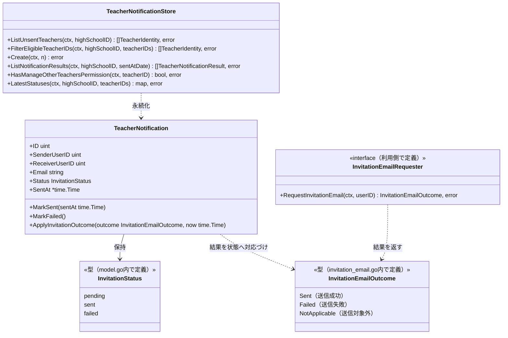
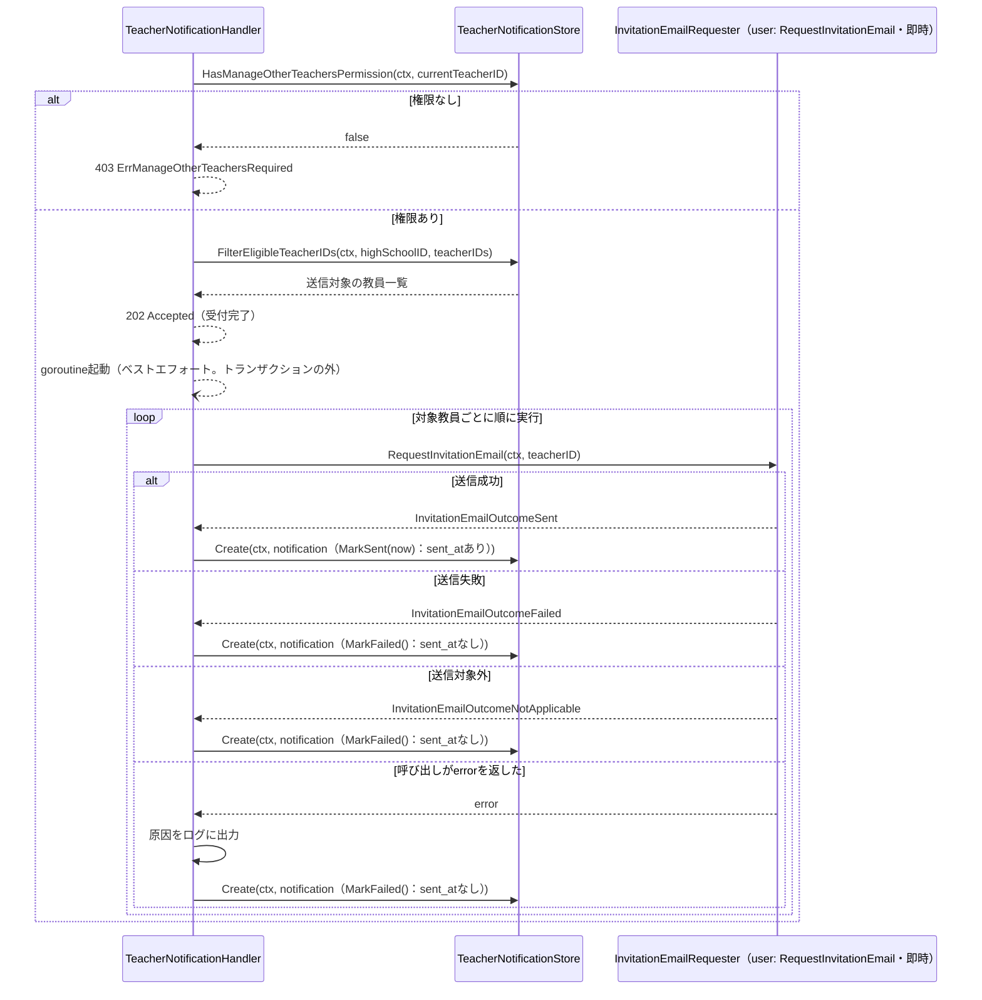

# 教員招待通知機能 Go実装仕様書

---

# 1. 機能概要

## 機能概要

新規に登録されたものの、まだ招待（パスワード設定）を完了していない教員に対して、招待メールを再送・一括送信できる機能である。同校の招待未完了教員一覧を取得し、選択した教員へ一括送信（非同期、202 Accepted）を行い、送信結果（成功・失敗）を履歴として日付で絞り込んで参照できる。招待未完了教員一覧の取得・送信操作には他職員操作権限（`manage_other_teachers`）が必要である。教師教員管理機能（`teacher-management` Context）は、教員一覧表示のために本Contextが管理する送信結果を参照専用で利用する（②「3. Bounded Context」）。

## 採用設計パターンとその理由（②からの要約）

②「4. 設計パターン」により、本機能は **Active Record** を採用する。

- `TeacherNotification`の状態（pending/sent/failed）は、送信処理の実行結果に応じて作成時点で一度だけ確定し、その後の遷移は発生しない。「結果を記録する1件のレコード」という性質が強い
- 送信対象の絞り込み（同校・招待未完了）は入力値と参照データの突き合わせであり、複雑なドメインロジックというよりは値の妥当性検証に近い
- 各教員への送信・記録は互いに独立しており、複数Entityにまたがる整合性を保証する集約構造を必要としない

Transaction Script・Domain Model・Event Sourcingは②「4. 設計パターン」「24. 採用しなかった設計」のとおり不採用である。本書はこの判断を変更しない。

## 本書が対象とする実装範囲

- Bounded Context: `teacher-notification`
- 対象操作: 招待未完了教員一覧取得（ListUnsentTeachers）、招待通知一括送信（SendInvitationNotifications）、送信結果履歴取得（ListNotificationResults）
- 招待メールの送信は、`user` Contextの`RequestInvitationEmail`（実行方式「即時」。`user`②「12. UseCase設計」）を、対象教員ごとのgoroutine内でトランザクションの外から呼ぶ形で行う。本Contextは、メール送信基盤の直接呼び出し・パスワード設定用トークンの発行・メールの組み立てを実装しない。結果（送信成功／送信失敗／送信対象外）は戻り値として受け取り、送信成功→`sent`＋`sent_at`、送信失敗・送信対象外→`failed`（`sent_at`なし）として記録する（②「6. Entity設計」）
- 規約「3. 設計パターンごとの構造適用方針」のActive Record構造（domain層・infrastructure層のレイヤー分離、usecase層を設けない）で実装する
- ①Rails実装の詳細（`Teacher::TeacherNotificationSenderService`等のコード内容）は本タスクでは提供されておらず、参照が必要な箇所は「①未提供のため参照不可」と明記する

---

# 2. ディレクトリ構成

## 対象Bounded Context名

- Context名（②）: `teacher-notification`
- ディレクトリ名: `internal/teacher_notification`（②からの補足：アーキテクチャ規約「8. 命名規約」に従いkebab-caseをスネークケースへ変換した。推測）

## ②で採用した設計パターン

Active Record

## 採用パターンに対応する構造

```
internal/teacher_notification/
├── model.go              # Model（Entity相当）定義: TeacherNotification
├── store.go               # Store定義: TeacherNotificationStore
├── invitation_email.go    # userの招待メール送信依頼（即時）を呼ぶ利用側のinterface: InvitationEmailRequester、結果の型: InvitationEmailOutcome
├── errors.go              # struct/Storeが返すエラー定義
└── presentation/
    ├── handler/
    │   └── teacher_notification_handler.go
    ├── request/
    │   └── teacher_notification_request.go
    ├── response/
    │   └── teacher_notification_response.go
    └── routes.go
```

## 作成するファイル一覧

|パス|内容|
|-|-|
|`internal/teacher_notification/model.go`|`TeacherNotification`のstruct定義・`InvitationStatus`型・状態設定メソッド|
|`internal/teacher_notification/store.go`|`TeacherNotificationStore`の定義とメソッド|
|`internal/teacher_notification/invitation_email.go`|`InvitationEmailRequester`（`user`の`RequestInvitationEmail`を実行方式「即時」で呼ぶための、利用側が定義するinterface）と`InvitationEmailOutcome`型（結果の3値）|
|`internal/teacher_notification/errors.go`|Model/Storeが返すエラー変数の定義|
|`internal/teacher_notification/presentation/handler/teacher_notification_handler.go`|`TeacherNotificationHandler`（ListUnsentTeachers/SendInvitationNotifications/ListNotificationResults）|
|`internal/teacher_notification/presentation/request/teacher_notification_request.go`|Request DTO|
|`internal/teacher_notification/presentation/response/teacher_notification_response.go`|Response DTO|
|`internal/teacher_notification/presentation/routes.go`|ルーティング登録|

**対象外**: `domain/`, `application/usecase/`, `infrastructure/repository/`（Active Record採用のため設けない）

**②からの補足**: 教師教員管理機能（`teacher-management` Context）が本Contextの送信結果を参照するための消費者側インターフェース（`TeacherNotificationStatusProvider`）は、教師教員管理機能側で定義される（教師教員管理機能_Go実装仕様書「8. Infrastructure層設計」参照）。本書では、その消費者側インターフェースを構造的に満たす`TeacherNotificationStore.LatestStatuses`メソッドを提供する。

---

# 3. Domain層設計

**対象外（Active Record採用のため、domain層を設けない）。** 以下、②「6. Entity設計」「7. Value Object設計」「8. Domain Service」「17. Error設計」を、アーキテクチャ規約「3. 設計パターンごとの構造適用方針」に従いActive Record向けに読み替えて記載する。

## Model（Entity相当）

### TeacherNotification（`model.go`）

|項目|内容|
|-|-|
|struct名|`TeacherNotification`|
|フィールド|`ID uint`（主キー）／`SenderUserID uint`（送信操作を行った教師のID）／`ReceiverUserID uint`（送信先教員のID）／`Email string`（送信先メールアドレス、送信対象教員に紐づく既存のメールアドレスを複写。②7章「Value Objectを採用しないもの」）／`Status InvitationStatus`（下記）／`SentAt *time.Time`（`sent`の場合のみ設定。`failed`は未設定＝`NULL`。`sent_at`列がNULL許容であるRails現行の記録に合わせる。②6章）／`CreatedAt time.Time`／`UpdatedAt time.Time`|
|付随する型|`InvitationStatus string`型。`InvitationStatusPending`（`"pending"`、レコード上のデフォルト値）／`InvitationStatusSent`（`"sent"`）／`InvitationStatusFailed`（`"failed"`）の3定数（②7章。Active Record採用のため独立したValue Objectファイルとしては設けず、本Modelと同一ファイル内の型として定義する）。`InvitationEmailOutcome`型（`invitation_email.go`。8章「外部連携実装」）を、招待メールの送信依頼の結果を表す値として受け取る|
|公開メソッド|`NewTeacherNotification(senderUserID, receiverUserID uint, email string) *TeacherNotification`：`pending`状態でインスタンスを生成するファクトリ。`MarkSent(sentAt time.Time)`：`Status`を`sent`に、`SentAt`を設定する。`MarkFailed()`：`Status`を`failed`にし、`SentAt`は設定しない。`ApplyInvitationOutcome(outcome InvitationEmailOutcome, now time.Time)`：招待メールの送信依頼の結果を状態へ対応づける。送信成功なら`MarkSent(now)`、送信失敗・送信対象外・上記以外の値なら`MarkFailed()`を呼ぶ|
|不変条件|生成直後の`Status`は常に`pending`。`MarkSent`/`MarkFailed`（`ApplyInvitationOutcome`経由を含む）のいずれか一方が呼ばれた後、`Store.Create`で永続化される（作成後の状態遷移は発生しない。②6章）。`SentAt`が設定されるのは`sent`の場合のみ|

## Value Object

**対象外**（アーキテクチャ規約4章の指示により、Active Record採用時は原則対象外とする）。②「7. Value Object設計」の`InvitationStatus`は、上記`InvitationStatus`型として`model.go`に統合した。

## Repository Interface

**対象外**（Active Record採用のため、domain層にRepository Interfaceを定義しない）。

## Domain Service

**対象外**。②「8. Domain Service」の`InvitationEligibilityFilter`は、アーキテクチャ規約4章の指示（Active Record採用時、検証ルールはModelのメソッドとして記載。ただし本判定は送信対象一覧という複数レコードを扱うDB参照を要するため、Modelのメソッドではなく`TeacherNotificationStore.FilterEligibleTeacherIDs`として実装する）に従い、Storeのメソッドとして統合した（詳細は「5. Infrastructure層設計」参照）。

## Domain Error（struct/Storeが返すエラー）

|エラー|発生元|発生条件|
|-|-|-|
|`ErrManageOtherTeachersRequired`|`TeacherNotificationHandler`（Store経由の権限確認結果判定）|操作者が「他職員操作権限（`manage_other_teachers`）」を保持しない状態で一覧取得・一括送信を試みた|

---

# 4. クラス図

Active Record採用のため、Model（struct）とStoreの関係を示す。`TeacherNotification`は他Entityとの集約関係を持たず、送信対象の絞り込みに必要な外部参照（教員アカウント）のみを持つ。



`InvitationEmailRequester`の実装は、`user` Contextが公開する`RequestInvitationEmail`を実行方式「即時」で呼び、その結果を`InvitationEmailOutcome`へ変換するアダプタである（8章「外部連携実装」）。

---

# 5. 状態遷移図

省略する。

理由: `TeacherNotification.Status`（pending/sent/failed）は、送信処理の実行結果に応じて作成時点で一度だけ確定する値であり、作成後にユーザー操作や別の業務イベントによって遷移する多段階の状態遷移ルールを持たない（②「10. 状態遷移図」も同じ理由で省略している）。

---

# 6. Application層設計

**対象外（Active Record採用のため、usecase層を設けない）。** ②「12. UseCase設計」の`ListUnsentTeachers`／`SendInvitationNotifications`／`ListNotificationResults`は、Handlerが`TeacherNotificationStore`を直接呼び出す処理として「9. Presentation層設計」のHandler処理順序に統合して記載する。

---

# 7. シーケンス図・処理フロー図

## シーケンス図

### `TeacherNotificationHandler.SendInvitationNotifications`



トークン発行・メールの組み立て・メール送信基盤の呼び出しは、`user`の`RequestInvitationEmail`の内部で行われる（`user`②「13. シーケンス図・処理フロー図」の「RequestInvitationEmail（教員招待通知の再送。即時方式）」）。上記の`alt`は、`TeacherNotification.ApplyInvitationOutcome`による対応づけ（3章）を、呼び出し関係として展開したものである。

## 処理フロー図

単純なCRUD処理（絞り込み・一括送信・履歴参照）であり、状態遷移を伴わないため、条件分岐が多い複雑な業務ロジックは存在しない（②「13. シーケンス図・処理フロー図」も同じ理由で処理フロー図を省略している）。処理フロー図は省略する。

---

# 8. Infrastructure層設計

**Repository実装**: 対象外（Active Record採用のため、Repository Interfaceおよびその実装を設けない）。

## Store実装

### TeacherNotificationStore（`store.go`）

|項目|内容|
|-|-|
|struct名|`TeacherNotificationStore`|
|対応GORMモデル|`TeacherNotification`（テーブル: `teacher_notifications`）|
|コンストラクタ|`NewTeacherNotificationStore(db *gorm.DB) *TeacherNotificationStore`（招待メールの送信依頼は、Storeではなく`TeacherNotificationHandler`が呼ぶ。下記「外部連携実装」参照）|

メソッド一覧:

|メソッド|引数|戻り値|発行するクエリ内容|
|-|-|-|-|
|`ListUnsentTeachers`|`ctx context.Context, highSchoolID uint`|`[]TeacherIdentity, error`|`users`テーブルを対象に、`high_school_id = highSchoolID`かつ教員ロールかつパスワード未設定（招待未完了。②「Entity設計」の「Teacher（外部参照）」に対応するフィールドを参照。②からの補足：`password_reset_required`相当のフィールドと仮定する）の条件で取得する。無効化済み（`deleted_at`あり）の教員は除外しない（Rails現行の絞り込みと同じ。②「設計差分管理」の「Rails現行との差」）|
|`FilterEligibleTeacherIDs`|`ctx context.Context, highSchoolID uint, teacherIDs []uint`|`[]TeacherIdentity, error`|`ListUnsentTeachers`と同条件に加え、`id IN (teacherIDs)`で絞り込む。同校でない教員・招待完了済みの教員が指定されてもエラーとせず単に結果から除外する（②8章`InvitationEligibilityFilter`のルール）|
|`Create`|`ctx context.Context, n *TeacherNotification`|`error`|`teacher_notifications`へ1件挿入する。`SentAt`が未設定（`failed`）の場合は、`sent_at`列をNULLで挿入する。トランザクションは使わない単発のINSERTである（11章）|
|`ListNotificationResults`|`ctx context.Context, highSchoolID uint, sentAtDate *time.Time`|`[]TeacherNotificationResult, error`|`teacher_notifications`と`users`（送信者・送信先教員の氏名取得のため）を結合し、送信者が同校であることで絞り込む。`sentAtDate`が指定されている場合、その日付の0時〜24時で`sent_at`を絞り込む（`sent_at`がNULLの`failed`は、指定時の結果に含まれない）。送信日時降順でソートする（②16章・21章。`sent_at`がNULLの行は、MySQLの降順では末尾になる。Rails現行の同じ並び順と同じ動作。推測）|
|`HasManageOtherTeachersPermission`|`ctx context.Context, teacherID uint`|`(bool, error)`|`teacher_permissions`テーブルを`teacher_id = teacherID`で1件取得し、`manage_other_teachers`列を返す（Teacher Permission Contextが所有するテーブルの参照専用読み取り。クラス編成機能の`TeacherPermissionRepository`と同様の役割だが、Active Record採用のためStoreメソッドとして直接実装する）|
|`LatestStatuses`（新規、teacher-management Context提供用）|`ctx context.Context, highSchoolID uint, teacherIDs []uint`|`(map[uint]string, error)`|`teacher_notifications`を`receiver_user_id IN (teacherIDs)`かつ送信者が`highSchoolID`に属することで絞り込み、各`receiver_user_id`ごとに最新（`sent_at`降順で1件）の`status`を取得する。通知が存在しない教員IDについては戻り値のmapに含めない（呼び出し元で「未送信」を補う）|

`TeacherIdentity`のフィールド: `ID uint` / `Name string` / `NameKana string` / `Email string`
`TeacherNotificationResult`のフィールド: `ID uint` / `Email string` / `Status string` / `SentAt *time.Time`（`failed`は`nil`） / `SenderID uint` / `SenderName string` / `ReceiverID uint` / `ReceiverName string`

- 保持しない責務: 教員アカウント自体の作成・更新（②11章）

## 外部連携実装

|実装対象|呼び出し元|実装方針|
|-|-|-|
|`InvitationEmailRequester`（招待メールの送信依頼。`user` Contextの`RequestInvitationEmail`、実行方式「即時」の呼び出し）|`TeacherNotificationHandler.SendInvitationNotifications`|コーディング規約「7. インターフェース」の方針どおり、利用側（`teacher_notification`パッケージ、`invitation_email.go`）が最小限のinterfaceを定義する: `type InvitationEmailRequester interface { RequestInvitationEmail(ctx context.Context, userID uint) (InvitationEmailOutcome, error) }`。`InvitationEmailOutcome`は、`user`②が定める結果の3値（送信成功／送信失敗／送信対象外）を表す型（`InvitationEmailOutcomeSent` / `InvitationEmailOutcomeFailed` / `InvitationEmailOutcomeNotApplicable`）。実装は、`user` Contextが公開する`RequestInvitationEmail`を実行方式「即時」で呼び、結果をこの型へ変換するアダプタとする。実行方式は本interfaceの引数に持たず、アダプタが「即時」に固定する。`error`は、呼び出し自体の内部エラー（`user`②が定める誤用等）にのみ使い、送信失敗・送信対象外はエラーではなく結果の値で返す（`user`②「12. UseCase設計」）。アダプタの配置・配線は、アーキテクチャ規約「14. 依存関係の組み立て（DI配線）」に従う。`user`の③が未作成のため、公開関数の具体的なシグネチャに合わせたアダプタの詳細は、`user`③で確定してから定める（②からの補足。推測）|

- メール送信基盤（Mailer等）の直接呼び出し、パスワード設定用トークンの発行、招待メールの組み立ては、本Contextでは実装しない（`user`の送信手順が担う）。`jobs`テーブルへの登録（`JobPublisher`）も使わない
- 対象教員ごとの送信依頼・記録処理は、アーキテクチャ規約「13. 非同期ジョブ実行パターン（JobQueue）」の「ベストエフォートで良い処理」として実装する（②18章「採用理由」）。`jobs`テーブルを経由せず、Handlerから`go func() { ctx := context.Background(); ... }()`でgoroutineを1つ起動し、対象教員をループしながら順に`RequestInvitationEmail`を呼び、結果を記録する（コーディング規約「21. 並行プログラミング」の「無制限にgoroutineを起動しない」方針に従い、対象教員1人につき1goroutineを起動するのではなく、1リクエストにつき1goroutineでループ処理する。各教員の呼び出しと記録は互いに独立しており、1人の結果が失敗でも次の教員の処理を継続する）
- 呼び出しは、DBトランザクションの外から行う（`ctx`にトランザクションを持ち込まない。`context.Background()`から作ったctxを使う）。`TeacherNotificationStore.Create`も、呼び出しの後に、単発のINSERTとして実行する（11章）

---

# 9. Presentation層設計

## Handler

### TeacherNotificationHandler（`presentation/handler/teacher_notification_handler.go`）

|項目|内容|
|-|-|
|struct名|`TeacherNotificationHandler`|
|コンストラクタが受け取る依存|`*TeacherNotificationStore`、`InvitationEmailRequester`（8章「外部連携実装」。`SendInvitationNotifications`のみが使う）|
|対応する呼び出し先|Store（Active Record採用のためUseCase層を経由しない）。招待メールの送信依頼は`InvitationEmailRequester`（`user`の`RequestInvitationEmail`・即時）|

メソッド一覧:

|メソッド|HTTPメソッド|パス|
|-|-|-|
|`ListUnsentTeachers`|GET|`/api/v1/teacher/teacher_notifications`|
|`SendInvitationNotifications`|POST|`/api/v1/teacher/teacher_notifications`|
|`ListNotificationResults`|GET|`/api/v1/teacher/teacher_notification_results`|

### `ListUnsentTeachers` 処理順序（②12節`ListUnsentTeachers`に対応）

1. Middlewareが設定したcurrent user（`teacher`ロール、所属校ID）をcontextから取得する
2. `TeacherNotificationStore.HasManageOtherTeachersPermission(ctx, currentUser.ID)`を確認する。`false`の場合は`ErrManageOtherTeachersRequired`を返し403とする（②13章：Handler処理内で明示的に確認する）
3. `TeacherNotificationStore.ListUnsentTeachers(ctx, currentUser.SchoolID)`を呼び出す
4. 取得結果を`response.UnsentTeacherListResponse`へ変換し200を返す

### `SendInvitationNotifications` 処理順序（②12節`SendInvitationNotifications`に対応）

1. current userをcontextから取得する
2. `TeacherNotificationStore.HasManageOtherTeachersPermission`を確認する。`false`の場合は403を返す
3. Request Bodyを`request.SendInvitationNotificationsRequest`にバインドする（`teacher_ids`は任意・空でもエラーとしない。②15章）
4. `TeacherNotificationStore.FilterEligibleTeacherIDs(ctx, currentUser.SchoolID, req.TeacherIDs)`を呼び出し、送信対象を確定する
5. `response.MessageResponse`を202で返す
6. レスポンス返却後、goroutineを起動し、対象教員ごとに次を行う（1人の送信失敗が他の対象教員への送信処理に影響しない。②「14. Transaction設計」）
   1. `NewTeacherNotification(currentUser.ID, teacher.ID, teacher.Email)`でインスタンスを生成する
   2. `InvitationEmailRequester.RequestInvitationEmail(ctx, teacher.ID)`を呼び出す（トランザクションの外。`user`の実行方式「即時」）
   3. 返された結果を`TeacherNotification.ApplyInvitationOutcome(outcome, now)`で状態へ対応づける（送信成功→`sent`＋`sent_at`、送信失敗・送信対象外→`failed`（`sent_at`なし））。呼び出しが`error`を返した場合は、原因をログに出力し、`MarkFailed()`を呼ぶ（②「17. Error設計」の判断理由。推測）
   4. `TeacherNotificationStore.Create`で記録する。記録に失敗した場合は、ログに出力して次の教員へ進む

### `ListNotificationResults` 処理順序（②12節`ListNotificationResults`に対応）

1. current userをcontextから取得する（権限確認は行わない。②13章：同校の教師であれば誰でも閲覧できる）
2. クエリパラメータ`sent_at`（任意、日付形式）をバインドする
3. `TeacherNotificationStore.ListNotificationResults(ctx, currentUser.SchoolID, sentAtDate)`を呼び出す
4. 取得結果を`response.NotificationResultListResponse`へ変換し200を返す

## Request / Response DTO

### Request（`presentation/request/teacher_notification_request.go`）

|struct名|フィールドと型|バリデーションタグ／チェック内容|
|-|-|-|
|`SendInvitationNotificationsRequest`|`TeacherIDs []uint`|`binding:"omitempty,dive,required"`（任意の整数配列。空でもエラーとしない。②15章）|
|`ListNotificationResultsRequest`|`SentAt *string`|`binding:"omitempty,datetime=2006-01-02"`（任意の日付。指定日の0時〜24時に絞り込む。②19章）|

### Response（`presentation/response/teacher_notification_response.go`）

|struct名|フィールドと型|
|-|-|
|`UnsentTeacherResponse`|`ID uint`, `Name string`, `NameKana string`, `Email string`|
|`UnsentTeacherListResponse`|`Teachers []UnsentTeacherResponse`|
|`NotificationResultResponse`|`ID uint`, `Email string`, `Status string`, `FormattedSentAt *string`（`sent_at`がNULLの`failed`は`nil`＝JSONの`null`。Rails現行の`formatted_sent_at`と同じ）, `Sender NotificationParticipantResponse`, `Receiver NotificationParticipantResponse`|
|`NotificationParticipantResponse`|`ID uint`, `Name string`|
|`NotificationResultListResponse`|`Results []NotificationResultResponse`|
|`MessageResponse`|`Message string`|

## Routing（`presentation/routes.go`）

|Method|Path|Handler|
|-|-|-|
|GET|`/api/v1/teacher/teacher_notifications`|`TeacherNotificationHandler.ListUnsentTeachers`|
|POST|`/api/v1/teacher/teacher_notifications`|`TeacherNotificationHandler.SendInvitationNotifications`|
|GET|`/api/v1/teacher/teacher_notification_results`|`TeacherNotificationHandler.ListNotificationResults`|

全ルートに、teacherロールを要求する認証Middlewareを適用する（②16章）。

---

# 10. API仕様

|Method|Path|Handler|Request|Response|Status Code|
|-|-|-|-|-|-|
|GET|/api/v1/teacher/teacher_notifications|TeacherNotificationHandler.ListUnsentTeachers|-|UnsentTeacherListResponse|200 / 403|
|POST|/api/v1/teacher/teacher_notifications|TeacherNotificationHandler.SendInvitationNotifications|SendInvitationNotificationsRequest|MessageResponse|202 / 403|
|GET|/api/v1/teacher/teacher_notification_results|TeacherNotificationHandler.ListNotificationResults|ListNotificationResultsRequest|NotificationResultListResponse|200|

## Errorケース

|条件|Status Code|Error内容|
|-|-|-|
|操作者が`manage_other_teachers`権限を持たずに一覧取得・一括送信を試みた|403|`ErrManageOtherTeachersRequired`|
|個々の教員への送信が失敗した（`InvitationEmailOutcomeFailed`）|202（受付自体は成功。正常な業務結果として`status=failed`を記録）|該当なし|
|個々の教員が送信対象外だった（`InvitationEmailOutcomeNotApplicable`。対象が存在しない、または無効化済み）|202（受付自体は成功。正常な業務結果として`status=failed`を記録）|該当なし|
|`sent_at`が不正な日付形式|422（推測、17章参照）|Presentation Validationエラー|
|未認証|401|-|
|teacherロールでない|403|-|

---

# 11. Transaction実装方針

## Transaction開始箇所

- `ListUnsentTeachers` / `ListNotificationResults`: なし（②14章「使用しない」）
- `SendInvitationNotifications`: 対象教員ごとの送信・記録を独立した処理として扱うため、全体を1つのトランザクションにまとめない（Gorm規約「6. Transaction」「Active Record採用機能: Storeメソッド内で`db.WithContext(ctx).Transaction(...)`を直接使用する」の適用対象外。本機能は「1トランザクション化しないこと」自体が業務要件であるため、`TeacherNotificationStore.Create`は単純な単発INSERTとして実装する）。`InvitationEmailRequester.RequestInvitationEmail`（`user`の実行方式「即時」）は、トランザクションの外から呼ぶ。ctxにトランザクションを持ち込まず、呼び出しの結果を受け取った後に`Create`を単発で実行する（`user`②「12. UseCase設計」「14. Transaction設計」）

## Transaction終了箇所

- 対象教員ごとに、`TeacherNotificationStore.Create`（送信結果の作成）が完了した時点でその教員分の処理が完了する

## 理由

Rails現行仕様書は「1人の教員へのメール送信が失敗しても、他の対象教員への送信処理は継続される（1件ごとに成功・失敗が記録される）」と明記している（②14章）。これは複数の独立した処理を1トランザクションにまとめてはならないという業務要件そのものであり、対象教員ごとに個別の書き込みとして扱う。

---

# 12. Validation実装方針

## Presentation

- `teacher_ids`: 整数の配列であることを検証する（空でもエラーとしない）
- `sent_at`: 日付形式であることを検証する（任意）

## 業務ルール検証（Active Record: Storeのメソッド）

- `TeacherNotificationHandler`（Store経由）: 操作者が「他職員操作権限」を持つこと（一覧取得・一括送信時）
- `TeacherNotificationStore.FilterEligibleTeacherIDs`: 送信対象が同校かつ招待未完了であること。同校でない・招待完了済みの教員はエラーとせず対象から除外する（②12章・15章の責務分離方針どおり）。無効化済みの教員は除外しない
- `user`の`RequestInvitationEmail`: 対象の教員が存在し、無効化されていないか（招待メールを実際に送ってよいか）の最終判定は、本Contextではなく`user`が行う。該当しない場合は`InvitationEmailOutcomeNotApplicable`として返り、`failed`（`sent_at`なし）として記録する（②15章）

---

# 13. Authorization実装方針

②「16. Authorization設計」を実装レベルに落とし込む。

## Middleware

- 認証済みユーザーを特定し、`teacher`ロールであることを確認する

## Handler

- 招待未完了教員一覧の取得・一括送信の実行前に、current teacherが「他職員操作権限（`manage_other_teachers`）」を保持しているかを`TeacherNotificationStore.HasManageOtherTeachersPermission`で確認し、保持していない場合は処理を中断する
- 送信結果履歴の参照には、この権限確認を行わない（同校の教師であれば誰でも閲覧できる）
- `user`の`RequestInvitationEmail`は認可を行わない（`user`②「16. Authorization設計」）。「その教員へ送ってよいか」（他職員操作権限・同校・招待未完了）は、上記の権限確認と`FilterEligibleTeacherIDs`で判定済みの教員に限って呼ぶ

## Store／Model

- `TeacherNotificationStore.FilterEligibleTeacherIDs`が、同校でない教員・招待完了済みの教員を送信対象から除外する

## 判断理由

「他職員操作権限」の要否は、ロール（`teacher`であるか）のような粗い認可ではなく、教員個人が持つ業務権限に基づく判定であるため、Middlewareのロールチェックとは別に、Handler処理内で確認する（アーキテクチャ規約7章「認可（所有権・業務権限）」の配置方針、Active Record採用時はHandler/Storeに従う）。送信結果履歴の参照にはこの権限を要求しないという非対称な権限設計は、②「16. Authorization設計」に明記された業務要件をそのまま踏襲したものである。

---

# 14. Error実装方針

アーキテクチャ規約8章の指示に従い、本機能ではModel/Storeが返すエラーをそのままHandlerでHTTPレスポンスへ変換する2段階構成とする。

## Model/Storeが返すエラー → HTTPレスポンスへの変換方針

- `TeacherNotificationStore.HasManageOtherTeachersPermission`の結果が`false`の場合、Handlerで`ErrManageOtherTeachersRequired`を生成し403に変換する
- 個々の教員への送信失敗（`InvitationEmailOutcomeFailed`）・送信対象外（`InvitationEmailOutcomeNotApplicable`）は、`status=failed`（`sent_at`なし）のレコードとして正常に記録される業務結果であり、エラーとしては扱わない（受付自体は202で成功する）。`RequestInvitationEmail`はこれらをエラーではなく結果の値として返す（`user`②「17. Error設計」）

## Status Code対応表

|Error種別|発生層|HTTP Status|
|-|-|-|
|`ErrManageOtherTeachersRequired`|Handler（`TeacherNotificationStore`結果判定）|403|
|Request DTOバリデーションエラー（`sent_at`形式不正等）|Presentation|422（推測）|
|DB接続・永続化失敗|Store（Infrastructure的な失敗）|500|

## Infrastructure Errorのハンドリング方針

招待メールの送信失敗（トークン発行の失敗・メール送信基盤の失敗）は、`user`の`RequestInvitationEmail`が結果「送信失敗」として返すため、業務結果（`status=failed`）として記録し、HTTPエラーとしては扱わない。`RequestInvitationEmail`の呼び出し自体が`error`を返した場合（`user`②が誤用として定める内部エラー等）は、原因をログに出力し、その教員を`failed`（`sent_at`なし）として記録した上で、次の教員の処理を継続する（Rails現行の再送が例外の種類を問わず`failed`を記録することに合わせた扱い。②「17. Error設計」。推測）。DB接続失敗等の技術的障害はHandlerで500に変換する（goroutine内では、ログ出力のみ）。goroutine内で発生したエラー・panicは、コーディング規約「21. 並行プログラミング」の`recover`方針に従い、goroutine内で捕捉しログ出力する（1件の処理の失敗でプロセス全体を落とさない）。

---

# 15. GORM / DBクエリ設計

②「20. DB設計方針」により、既存Rails DBを継続利用し、スキーマ変更は行わない。SQL文そのものは記載しない。

## 利用するGORMモデルとテーブルの対応

|Model|テーブル|
|-|-|
|`TeacherNotification`|`teacher_notifications`（既存）|

参照専用で利用する他Contextのテーブル: `users`（教員アカウント・招待未完了判定、User Context所有）、`teacher_permissions`（他職員操作権限、Teacher Permission Context所有）。いずれも本Contextでは新規に所有モデルとして定義せず、参照専用の最小フィールド定義でアクセスする。

## 主要クエリの条件・ソート・ページネーション方針

|Store／メソッド|条件|ソート|ページネーション|
|-|-|-|-|
|`ListUnsentTeachers`|`high_school_id`一致、教員ロール、パスワード未設定（無効化済みは除外しない）|-（推測。②に明記なし）|なし（全件返却。②21章）|
|`FilterEligibleTeacherIDs`|`ListUnsentTeachers`と同条件 ＋ `id IN (teacherIDs)`|-|なし|
|`Create`|-（挿入処理。`failed`は`sent_at`をNULLで挿入する）|-|-|
|`ListNotificationResults`|`sender_user_id`が同校、`sent_at`の日付範囲（任意。指定時は`sent_at`がNULLの`failed`は含まれない）|送信日時降順（`sent_at`がNULLの行は末尾。推測）|なし（全件返却。②21章「推測：対象件数が少数であることを前提とした設計」）|
|`HasManageOtherTeachersPermission`|`teacher_id`一致|-|-|
|`LatestStatuses`|`receiver_user_id IN (teacherIDs)`、送信者が`highSchoolID`に属する|`receiver_user_id`ごとに`sent_at`降順で1件|-|

## 既存Schemaへの変更

②20章「変更なし」のとおり、本機能によるスキーマ変更は行わない。

---

# 16. テストケース設計

アーキテクチャ規約「3. 設計パターンごとの構造適用方針」の読み替え（Active Record: 「Domain Test」→「Model Test」、「UseCase Test」は対象外、「Repository Test」→「Store Test」）に従う。

## Model Test（②「Domain Test」相当）

|対象|テストケース|
|-|-|
|`NewTeacherNotification`|`pending`状態で生成されること|
|`TeacherNotification.MarkSent`|`Status`が`sent`になり、`SentAt`が引数の時刻で設定されること|
|`TeacherNotification.MarkFailed`|`Status`が`failed`になり、`SentAt`が未設定（`nil`）のままであること|
|`TeacherNotification.ApplyInvitationOutcome`|`InvitationEmailOutcomeSent`で`sent`＋`SentAt`あり／`InvitationEmailOutcomeFailed`で`failed`＋`SentAt`なし／`InvitationEmailOutcomeNotApplicable`で`failed`＋`SentAt`なし／未定義の値で`failed`＋`SentAt`なしとなること|

## UseCase Test

対象外（Active Record採用のため、usecase層を設けない）。

## Store Test（②「Repository Test」相当）

|対象|テストケース|
|-|-|
|`ListUnsentTeachers`|同校かつ招待未完了の教員のみが取得されること／無効化済み（`deleted_at`あり）の同校・招待未完了の教員も除外されず取得されること（Rails現行と同じ）|
|`FilterEligibleTeacherIDs`|指定IDのうち同校・招待未完了の教員のみが返ること／同校でない・招待完了済みの教員が指定されてもエラーとならず除外されること（②の重点検証項目）／無効化済みの同校・招待未完了の教員が除外されないこと|
|`Create`|送信結果が正しく作成されること（`sent`は`sent_at`あり、`failed`は`sent_at`がNULLで作成されること）|
|`ListNotificationResults`|送信者が同校の結果のみ取得されること／`sent_at`指定時に日付範囲で絞り込まれること（`sent_at`がNULLの`failed`は含まれないこと）／送信日時降順でソートされること／`sent_at`がNULLの`failed`が`SentAt = nil`で返ること|
|`HasManageOtherTeachersPermission`|権限あり・なしのそれぞれで正しい真偽値が返ること|
|`LatestStatuses`|各教員IDごとに最新の送信結果ステータスが取得されること／通知が存在しない教員IDが結果に含まれないこと|

## Handler Test

|対象|テストケース|
|-|-|
|`TeacherNotificationHandler.ListUnsentTeachers`|正常系：200で招待未完了教員一覧が返ること／権限なしで403が返ること|
|`TeacherNotificationHandler.SendInvitationNotifications`|正常系：202が返ること／権限なしで403が返ること／`teacher_ids`が空でもエラーとならず202が返ること。`InvitationEmailRequester`をテスト用の代替（送信成功・送信失敗・送信対象外・`error`を返せるもの）に差し替え、goroutine内の処理を次のとおり検証する：対象教員ごとに`RequestInvitationEmail`が呼ばれること／送信成功で`sent`＋`SentAt`ありの記録が作成されること／送信失敗・送信対象外・`error`で`failed`＋`SentAt`なしの記録が作成されること／1人が送信失敗・送信対象外・`error`でも、他の教員の呼び出しと記録が継続されること／どの結果でも応答は202であること（②の重点検証項目）|
|`TeacherNotificationHandler.ListNotificationResults`|正常系：200で結果一覧が返ること／`sent_at`指定時に絞り込まれること／`sent_at`がNULLの`failed`が`formatted_sent_at`＝`null`で返ること|

## Integration Test

|対象|テストケース|
|-|-|
|招待未完了教員一覧〜一括送信〜履歴参照の一連フロー|エンドポイント経由で、権限制御と絞り込みルールに従って正しく連携して動作すること（②の重点検証項目：1人の送信失敗が他の対象者に影響しないこと）。`user`の`RequestInvitationEmail`（即時）を実物とし、メール送信基盤とトークン発行のみテスト用の代替にして、送信成功・送信失敗が履歴の`status`（`sent` / `failed`）として記録され、`sent_at`が`sent`の場合のみ設定されること|
|無効化済みの教員を含めた送信|無効化済みで同校・招待待ちの教員を選択して送信すると、メールが送られず、`failed`（`sent_at`なし）が記録されること（②「設計差分管理」の「Rails現行との差」。他の対象教員の処理には影響しないこと）|
|作成時の送信との一貫性|アカウント作成時の招待メールと再送のメールで、同じ件名・本文・リンクのメールが送られること（`user`②「22. テスト戦略」の教員招待通知の再送の項と同じ観点）|
|teacher-managementとの連携|教師教員管理機能の教員一覧取得が、本Contextの`LatestStatuses`を正しく参照し`invitation_status`を表示すること|

---

# 17. ②からの補足事項

|判断した内容|判断理由|推測かどうか|
|-|-|-|
|ディレクトリ名を`internal/teacher_notification`とした|②のContext名`teacher-notification`とディレクトリ名の対応関係が②に明記がない|推測|
|招待未完了判定を`users`テーブルのパスワード未設定フィールド（`password_reset_required`相当）で行う構成とした|②「6. Entity設計」が「推測: 教師生徒参照機能・教師教員管理機能のデータモデルに記載された`password_reset_required`フィールドと同一の仕組みを、招待完了判定に用いると仮定する」と明記している内容をそのまま踏襲した|②に準拠（②自身が「推測」と明記）|
|`TeacherNotificationStore.LatestStatuses`を新設し、教師教員管理機能側の`TeacherNotificationStatusProvider`インターフェースを構造的に満たす形で提供する構成とした|②「3. Bounded Context」「12. UseCase設計」（教師教員管理機能側②文書）が参照専用での利用を明記しているが、具体的なメソッドシグネチャは②のいずれにも記載がない|推測|
|`teacher_ids`が空配列で送信された場合、送信対象が0件（実質何も送信しない）として扱う方針とした|②「15. Validation設計」は「必須チェック: なし（teacher_idsが空でもエラーとしない）」とのみ記載し、空の場合に「送信対象なし」とするか「全招待未完了教員へ送信」とするかは①未提供のため確認できない|①未提供のため参照不可（推測）|
|`InvitationEmailRequester`（利用側のinterface）と`InvitationEmailOutcome`型を`teacher_notification`パッケージに定義し、`user`の`RequestInvitationEmail`（即時）を呼ぶアダプタで実装する構成とした。アダプタの詳細（公開関数の具体的なシグネチャ・配置）は、`user`③の作成後に確定する|②「3. Bounded Context」は`user`の`RequestInvitationEmail`（即時）を呼ぶと定めるが、Goのinterface・型名は②に記載がない。コーディング規約「7. インターフェース」（利用側で定義）に従った。`user`の③が未作成のため、公開関数のシグネチャは確定できない|推測|
|結果の対応づけを、`TeacherNotification.ApplyInvitationOutcome`として`model.go`に置いた|②「6. Entity設計」の対応づけ（送信成功→`sent`＋`sent_at`、送信失敗・送信対象外→`failed`（`sent_at`なし））を1箇所に集約し、Model Testで検証できるようにするため。メソッド名・配置は②に記載がない|推測|
|`TeacherNotification.SentAt`と`TeacherNotificationResult.SentAt`をポインタ（`*time.Time`）、`MarkFailed`を引数なしとし、`NotificationResultResponse.FormattedSentAt`を`*string`とした|②「6. Entity設計」が、`failed`を`sent_at`なしで記録すると定めている（Rails現行の`Teacher::TeacherNotificationJob`は、失敗時に`sent_at`を設定せず、`Teacher::TeacherNotificationSerializer#formatted_sent_at`は`sent_at`が空なら`nil`を返す）。`sent_at`列のNULLを表現するためにポインタとした|①Railsの実装を参照（`app/jobs/teacher/teacher_notification_job.rb`、`app/serializers/teacher/teacher_notification_serializer.rb`）|
|`RequestInvitationEmail`の呼び出しが`error`を返した場合は、原因をログに出力し、その教員を`failed`（`sent_at`なし）として記録し、次の教員へ進む|`user`②に、即時方式で`error`が返る場合の扱いの規定がない。Rails現行の再送は、例外の種類を問わず`failed`を記録する（②「17. Error設計」の判断理由と同じ）|推測|
|`InvitationEmailRequester`を、`TeacherNotificationStore`ではなく`TeacherNotificationHandler`のコンストラクタが受け取る構成とし、`NewTeacherNotificationStore`は招待メールの送信依頼に関する依存を持たない|対象教員ごとの送信依頼・記録の手順は、9章のとおりHandlerの処理として実装している（Storeは記録・参照に限る）ため、送信依頼の依存をHandlerが持つ形に揃えた|推測|
|`ListUnsentTeachers` / `FilterEligibleTeacherIDs`で、無効化済み（`deleted_at`あり）の教員を除外しない|Rails現行の絞り込み（`base_teachers_scope`）が有効なユーザーへの絞り込みを持たず、②が絞り込みの対象を変えない方針であるため。②「設計差分管理」の「Rails現行との差」を参照|①Railsの実装を参照（`app/controllers/api/v1/teacher/teacher_notifications_controller.rb`）|
|`sent_at`不正形式時のHTTP Statusを422とした|②「17. Error設計」のエラー仕様表に本ケースの明示的な記載がない|推測|
|`ListUnsentTeachers`・`ListNotificationResults`の並び順（招待未完了教員一覧側）を確定しなかった|②21章は送信結果履歴の並び順（送信日時降順）のみ明記し、招待未完了教員一覧側の並び順の記載がない|推測|

上記以外の設計判断（Bounded Context・設計パターン・Repository/Store設計・Transaction境界・Validation方針・Authorization方針・Error設計・API互換方針・DB方針・テスト戦略の基本方針）はすべて②の記載をそのまま踏襲しており、変更・追加した業務ルールはない。
