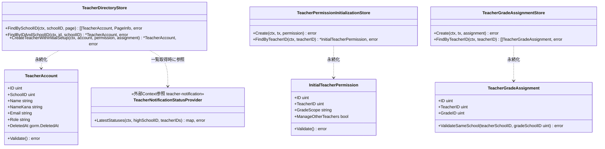
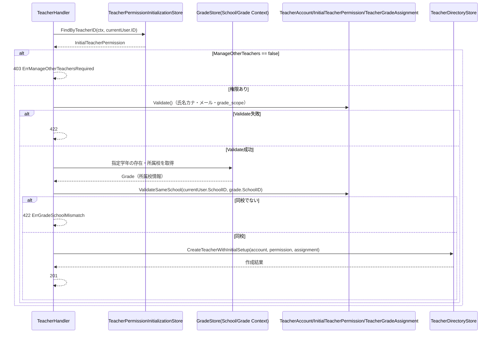
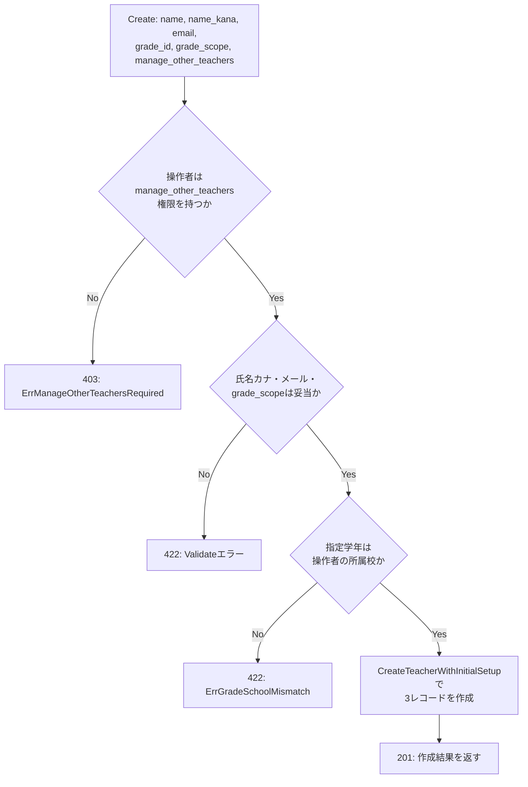

# 教師教員管理機能 Go実装仕様書

---

# 1. 機能概要

## 機能概要

教師が同校の教員一覧・詳細を確認し、新規教員アカウントを作成（招待）できる機能である。教員一覧には、各教員への直近の招待通知状況（`invitation_status`）を教員招待通知機能（`teacher-notification` Context）から参照して含める。新規教員作成時は、`User`（アカウント本体）・`TeacherPermission`（初期権限）・`TeacherGrade`（担当学年）の3レコードを1つの業務操作として整合性を保ちながら作成する。作成の実行には、操作者自身が「他職員操作権限（`manage_other_teachers`）」を保持していることが前提条件となる。

## 採用設計パターンとその理由（②からの要約）

②「4. 設計パターン」より、引き続き**Active Record**を採用する。

- 主要操作が一覧・詳細・作成というCRUD中心の操作であり、複雑な状態遷移が存在しない（教員アカウントの有効/無効は`deleted_at`による論理削除のみで、本機能の対象外）
- 作成時の業務ルール（氏名カナ形式・メール形式・同校学年制約・grade_scope値チェック）は、値の妥当性検証に近く、Entity（Active Record上はModel）の検証責務として表現できる
- アカウント・権限・担当学年の関連付けは、1回の作成操作内でデータ整合性を保てば足り、複雑なドメイン振る舞いを要しない
- 教員一覧への招待通知状況の付与は、teacher-notification Contextへの参照呼び出しを追加するのみであり、Active Recordの構造を変える要因にはならない（②「3. Bounded Context」）

②「4. 設計パターン」で採用しなかったTransaction Script・Domain Model・Event Sourcingについても、②の判断をそのまま踏襲し、本書では変更しない。

## 本書が対象とする実装範囲

- Bounded Context: `teacher-directory`（教員名簿・着任管理コンテキスト）
- 対象操作: 教員一覧取得（ListTeachers、招待通知状況の付与を含む）、教員詳細取得（ShowTeacher）、新規教員作成（CreateTeacher、他職員操作権限の確認を含む）
- 規約（`規約/アーキテクチャ規約.md`「3. 設計パターンごとの構造適用方針」）に従い、Active Record採用機能としてdomain層・application層（usecase層）・Repository Interfaceを設けない構造で実装する
- ①Rails実装の詳細（`CreateTeacherForm`等のコード内容）は本タスクでは提供されておらず、参照が必要な箇所は「①未提供のため参照不可」と明記する

---

# 2. ディレクトリ構成

## 対象Bounded Context名

- `teacher-directory`（実装ディレクトリ名は `internal/teacher_directory`）

## ②で採用した設計パターン

- Active Record（②「4. 設計パターン」）

## 採用パターンに対応する構造

アーキテクチャ規約「3. 設計パターンごとの構造適用方針」のActive Record構造に従う。domain層・infrastructure層のレイヤー分離、usecase層は設けない。Entity相当のstruct（Model）と永続化操作（Store）を同一packageに置く。

```
internal/teacher_directory/
├── model.go              # Model（Entity相当）定義: TeacherAccount / InitialTeacherPermission / TeacherGradeAssignment
├── store.go               # Store定義: TeacherDirectoryStore / TeacherPermissionInitializationStore / TeacherGradeAssignmentStore
├── errors.go              # struct/Storeが返すエラー定義
└── presentation/
    ├── handler/
    │   └── teacher_handler.go
    ├── request/
    │   └── teacher_request.go
    ├── response/
    │   └── teacher_response.go
    └── routes.go
```

## 作成するファイル一覧

|パス|内容|
|-|-|
|`internal/teacher_directory/model.go`|`TeacherAccount` / `InitialTeacherPermission` / `TeacherGradeAssignment` のstruct定義と検証メソッド|
|`internal/teacher_directory/store.go`|`TeacherDirectoryStore` / `TeacherPermissionInitializationStore` / `TeacherGradeAssignmentStore` の定義とメソッド|
|`internal/teacher_directory/errors.go`|Model/Storeが返すエラー変数・エラー型の定義|
|`internal/teacher_directory/presentation/handler/teacher_handler.go`|`TeacherHandler`（List/Show/Create）|
|`internal/teacher_directory/presentation/request/teacher_request.go`|Request DTO|
|`internal/teacher_directory/presentation/response/teacher_response.go`|Response DTO（招待通知状況フィールドを含む）|
|`internal/teacher_directory/presentation/routes.go`|ルーティング登録|

**対象外**: `domain/`, `application/usecase/`, `infrastructure/repository/`（Active Record採用のため設けない）

**②からの補足**: `GradeStore`（学年の存在確認・所属校取得）は②「11. Repository設計」に「School/Grade Context提供・参照専用」と明記されている。`TeacherNotificationStatusStore`（招待通知状況の参照）は②「3. Bounded Context」「12. UseCase設計」に teacher-notification Context提供・参照専用と明記されている。いずれも同一リポジトリ内の別Bounded Contextが公開する参照専用Storeを、アーキテクチャ規約「6. Context間連携ルール」に従い直接呼び出す想定とする。School/Grade側Contextの②/③文書は本タスクでは提供されていないため、正確なpackage pathは「推測」であり、実装時に確認が必要。teacher-notification Context側は本タスクの担当範囲内であり、「教員招待通知機能_Go実装仕様書」を正とする。

---

# 3. Domain層設計

**対象外（Active Record採用のため、domain層を設けない）。** 以下、②「6. Entity設計」「7. Value Object設計」「8. Domain Service」「17. Error設計」を、アーキテクチャ規約「3. 設計パターンごとの構造適用方針」に従いActive Record向けに読み替えて記載する。

## Model（Entity相当）

### TeacherAccount

|項目|内容|
|-|-|
|struct名|`TeacherAccount`|
|フィールド|`ID uint`（主キー）／`SchoolID uint`（所属校ID）／`Name string`（氏名）／`NameKana string`（氏名カナ）／`Email string`（メールアドレス）／`Role string`（教員ロール識別、②からの補足：既存`users`テーブルのロール区分に合わせる想定）／`CreatedAt time.Time`／`UpdatedAt time.Time`／`DeletedAt gorm.DeletedAt`（論理削除）|
|公開メソッド|`Validate() error`：氏名の必須チェック、`NameKana`のカタカナ・長音・中黒・空白のみ許容の形式チェック、`Email`の一般的なメールアドレス形式チェック|
|不変条件|`Validate()`を通過したインスタンスのみが`Store.CreateTeacherWithInitialSetup`で永続化される|

### InitialTeacherPermission

|項目|内容|
|-|-|
|struct名|`InitialTeacherPermission`|
|フィールド|`ID uint`／`TeacherID uint`（`TeacherAccount.ID`への参照）／`GradeScope string`（`own_grade` / `all_grades`）／`ManageOtherTeachers bool`／`CreatedAt time.Time`／`UpdatedAt time.Time`|
|公開メソッド|`Validate() error`：`GradeScope`が`own_grade`/`all_grades`のいずれかであることの検証|
|不変条件|作成時点でのみ存在し、以後の更新は本Context・本Modelの責務範囲外（②「6. Entity設計」「11. Repository設計」：以後の変更はTeacher Permission Contextの責務）|

**②からの補足（新規）**: ②「12. UseCase設計」の`CreateTeacher`は「current userの`manage_other_teachers`権限確認。権限がない場合はここで処理を中断」を最初のStore呼び出しとして明記している。この確認のため、`InitialTeacherPermission`は旧版の「検索機能: なし（作成専用）」から変更し、`TeacherPermissionInitializationStore`に操作者（current teacher）自身の`InitialTeacherPermission`を取得する検索機能を追加する（詳細は「5. Infrastructure層設計」参照）。

### TeacherGradeAssignment

|項目|内容|
|-|-|
|struct名|`TeacherGradeAssignment`|
|フィールド|`ID uint`／`TeacherID uint`（`TeacherAccount.ID`への参照）／`GradeID uint`（担当学年ID）／`CreatedAt time.Time`／`UpdatedAt time.Time`|
|公開メソッド|`ValidateSameSchool(teacherSchoolID, gradeSchoolID uint) error`：指定学年の所属校が教員の所属校と一致するかを検証する（②「8. Domain Service」の`TeacherGradeAssignmentPolicy`相当。アーキテクチャ規約4章に従いModelのメソッドとして持たせる）|
|不変条件|`ValidateSameSchool`を満たした学年IDのみが`Store.CreateTeacherWithInitialSetup`で永続化される|

## Value Object

**対象外**（アーキテクチャ規約4章の指示により、Active Record採用時は原則対象外とする）。②「7. Value Object設計」の`NameKana`／`Email`／`GradeScope`の形式・許容値検証ルールは、各Modelの`Validate()`メソッド内に統合した。

## Repository Interface

**対象外**（Active Record採用のため、domain層にRepository Interfaceを定義しない）。

## Domain Service

**対象外**。②「8. Domain Service」の`TeacherGradeAssignmentPolicy`は`TeacherGradeAssignment.ValidateSameSchool`に統合した。

## Domain Event

②「18. Domain Event」の記載なし（②文書に本章は存在しないが、教員作成後のメール送信は非同期化を要しない旨が②「15. API互換方針」以前の版から踏襲されている）。本機能ではDomain Eventを採用しない。よって対象外。

## Domain Error（struct/Storeが返すエラー）

|エラー|発生元|発生条件|
|-|-|-|
|`ErrInvalidNameKana`|`TeacherAccount.Validate()`|氏名カナがカタカナ・長音・中黒・空白以外を含む|
|`ErrInvalidEmail`|`TeacherAccount.Validate()`|メールアドレスが一般的な形式でない|
|`ErrInvalidGradeScope`|`InitialTeacherPermission.Validate()`|`GradeScope`が`own_grade`/`all_grades`以外|
|`ErrGradeSchoolMismatch`|`TeacherGradeAssignment.ValidateSameSchool()`|指定学年の所属校が教員の所属校と一致しない|
|`ErrManageOtherTeachersRequired`（新規追加）|`TeacherPermissionInitializationStore.RequirePermission`相当の検証（詳細は5章）|操作者（current teacher）が`manage_other_teachers`権限を保持しない状態で教員作成を試みた|

エラー種別ごとの型／変数定義方針は「11. Error実装方針」で扱う。

---

# 4. クラス図

Active Record採用のため、Model（struct）とStoreの関係を示す。



---

# 5. 状態遷移図

省略する。

理由: 教員アカウントの有効/無効は`deleted_at`による論理削除のみであり、本機能の対象外（②「4. 設計パターン」）。`InitialTeacherPermission`・`TeacherGradeAssignment`はいずれも作成時点で確定し、以後本Context内では状態遷移を持たない。

---

# 6. Application層設計

**対象外（Active Record採用のため、usecase層を設けない）。** ②「12. UseCase設計」の`ListTeachers`／`ShowTeacher`／`CreateTeacher`は、Handlerが`Store`を直接呼び出す処理として「9. Presentation層設計」のHandler処理順序に統合して記載する。DTO（Command/Query）は独立したapplication層のDTOとして設けず、「9. Presentation層設計」のRequest/Response DTOがその役割を兼ねる。

---

# 7. シーケンス図・処理フロー図

## シーケンス図

### `TeacherHandler.Create`



## 処理フロー図

### `TeacherHandler.Create`



`List`・`Show`は絞り込み条件の組み立てとteacher-notification Contextへの参照呼び出しのみで分岐が少ないため、処理フロー図は省略する。

---

# 8. Infrastructure層設計

**Repository実装**: 対象外（Active Record採用のため、Repository Interfaceおよびその実装を設けない）。

## Store実装

②「11. Repository設計」で定義された各Storeを、アーキテクチャ規約4章に従い「3. Domain層設計」のModelと同一package（`internal/teacher_directory`）に配置する。GORMモデルはModelのstructをそのままGORMタグ付きで扱う。

### TeacherDirectoryStore

|項目|内容|
|-|-|
|struct名|`TeacherDirectoryStore`|
|対応GORMモデル|`TeacherAccount`（テーブル: `users`）|
|コンストラクタ|`*gorm.DB`、および`TeacherNotificationStatusProvider`（②からの補足の型。下記「外部連携実装」参照）を受け取る|

メソッド一覧:

|メソッド|引数|戻り値|発行するクエリ内容|
|-|-|-|-|
|`FindBySchoolID`|`ctx context.Context, schoolID uint, page int`|`[]TeacherAccountWithStatus, PageInfo, error`|`school_id = schoolID` かつ `role = teacher` かつ論理削除されていないレコードを対象に、`name_kana`昇順でソートし、ページ番号に応じたオフセット・件数制限を適用して取得する。取得した教員ID一覧を`TeacherNotificationStatusProvider.LatestStatuses`へ渡し、`invitation_status`を各件に付与する（②「16. API互換方針」：一覧レスポンスに各教員の直近の招待通知状況を含める）|
|`FindByIDAndSchoolID`|`ctx context.Context, id uint, schoolID uint`|`*TeacherAccount, error`|`id = id` かつ `school_id = schoolID` かつ `role = teacher` の条件で1件取得する。該当なしの場合はレコード不存在を表すエラーを返す|
|`CreateTeacherWithInitialSetup`|`ctx context.Context, account *TeacherAccount, permission *InitialTeacherPermission, assignment *TeacherGradeAssignment`|`*TeacherAccount, error`|トランザクション内で`account`を作成し、採番された`account.ID`を`permission.TeacherID`・`assignment.TeacherID`に設定した上で、`permission`・`assignment`を作成する|

`TeacherAccountWithStatus`のフィールド: `TeacherAccount`の全フィールドに加え`InvitationStatus string`（②16章の`invitation_status`。通知未送信の場合は「未送信」）。

### TeacherPermissionInitializationStore

|項目|内容|
|-|-|
|struct名|`TeacherPermissionInitializationStore`|
|対応GORMモデル|`InitialTeacherPermission`（テーブル: `teacher_permissions`）|

メソッド一覧:

|メソッド|引数|戻り値|発行するクエリ内容|
|-|-|-|-|
|`Create`|`ctx context.Context, tx *gorm.DB, permission *InitialTeacherPermission`|`error`|渡されたトランザクション（`tx`）を用いて`teacher_permissions`へ1件挿入する|
|`FindByTeacherID`（新規追加）|`ctx context.Context, teacherID uint`|`*InitialTeacherPermission, error`|`teacher_id = teacherID`の条件で1件取得する。`CreateTeacher`実行前に操作者自身の`manage_other_teachers`を確認するために使用する（②「12. UseCase設計」の`CreateTeacher`が最初に呼び出すStore）|

**②からの補足**: 旧版では本Storeの検索機能を「なし（作成専用）」としていたが、②「12. UseCase設計」の更新（`manage_other_teachers`権限確認をCreateTeacherの最初のStore呼び出しとして明示）に伴い、`FindByTeacherID`を追加した。

### TeacherGradeAssignmentStore

|項目|内容|
|-|-|
|struct名|`TeacherGradeAssignmentStore`|
|対応GORMモデル|`TeacherGradeAssignment`（テーブル: `teacher_grades`）|

メソッド一覧:

|メソッド|引数|戻り値|発行するクエリ内容|
|-|-|-|-|
|`Create`|`ctx context.Context, tx *gorm.DB, assignment *TeacherGradeAssignment`|`error`|渡されたトランザクションを用いて`teacher_grades`へ1件挿入する|
|`FindByTeacherID`|`ctx context.Context, teacherID uint`|`[]TeacherGradeAssignment, error`|`teacher_id = teacherID`の条件で担当学年一覧を取得する|

## 外部連携実装

|実装対象|呼び出し元|実装方針|
|-|-|-|
|`GradeStore`（School/Gradeコンテキスト提供・参照専用）|`TeacherHandler.Create`（作成時、指定学年の存在・所属校確認）|本Context内では実装しない。School/Gradeコンテキストが公開する参照専用Storeを直接呼び出す。正確な呼び出し先package pathは②に明記がなく「推測」|
|`TeacherNotificationStatusProvider`（新規追加、teacher-notificationコンテキスト提供・参照専用）|`TeacherDirectoryStore.FindBySchoolID`（一覧取得時、各教員の招待通知状況取得）|コーディング規約「7. インターフェース」の方針に従い、利用側（`teacher_directory`パッケージ）が最小限のinterfaceを`store.go`内に定義する: `type TeacherNotificationStatusProvider interface { LatestStatuses(ctx context.Context, highSchoolID uint, teacherIDs []uint) (map[uint]string, error) }`。実装は教員招待通知機能（`teacher-notification` Context）の`TeacherNotificationStore`が本interfaceを構造的に満たす形で提供する（詳細は教員招待通知機能_Go実装仕様書を参照）。DI配線はアーキテクチャ規約「14. 依存関係の組み立て（DI配線）」に従い、`teacher_directory`のContext組み立て関数が`teacher-notification` Contextの組み立て結果から受け取る|

Mail・Cache・Queueは対象外。

---

# 9. Presentation層設計

## Handler

### TeacherHandler

|項目|内容|
|-|-|
|struct名|`TeacherHandler`|
|コンストラクタが受け取る依存|`*TeacherDirectoryStore`／`*TeacherPermissionInitializationStore`／`*TeacherGradeAssignmentStore`／School/Gradeコンテキストの参照専用Store|
|対応する呼び出し先|Store（Active Record採用のためUseCase層を経由しない）|

メソッド一覧:

|メソッド|HTTPメソッド|パス|
|-|-|-|
|`List`|GET|`/api/v1/teacher/colleagues`|
|`Show`|GET|`/api/v1/teacher/colleagues/:id`|
|`Create`|POST|`/api/v1/teacher/colleagues`|

### `List` 処理順序（②12節`ListTeachers`に対応、更新）

1. Middlewareが設定したcurrent user（`teacher`ロール、所属校ID）をcontextから取得する
2. クエリパラメータ`page`をRequest DTOにバインドし、型・範囲を検証する
3. `TeacherDirectoryStore.FindBySchoolID(ctx, currentUser.SchoolID, page)`を呼び出す。本メソッド内部で`TeacherNotificationStatusProvider.LatestStatuses`が呼び出され、各教員に`invitation_status`が付与される（②「3. Bounded Context」「16. API互換方針」）
4. 取得結果をResponse DTOへ変換して返す

### `Show` 処理順序（②12節`ShowTeacher`に対応）

1. current userをcontextから取得する
2. パスパラメータ`id`をRequest DTOにバインドし、型を検証する
3. `TeacherDirectoryStore.FindByIDAndSchoolID(ctx, id, currentUser.SchoolID)`を呼び出す。該当なしの場合は404を返す
4. `TeacherGradeAssignmentStore.FindByTeacherID(ctx, id)`を呼び出し、担当学年情報を取得する
5. 権限情報（`InitialTeacherPermission`相当）を取得する（②からの補足：下記参照）
6. 取得結果をResponse DTOへ変換して返す

**②からの補足（推測、旧版から継続）**: `ShowTeacher`が権限情報をどう取得するかは②に明記がなく、本書では「Teacher Permission Context（②3節で言及されている以後の権限ライフサイクル管理コンテキスト）が公開する参照専用の手段を呼び出す」と仮定する。当該Contextの②/③文書は本タスクでは提供されておらず、実装時に確認が必要。

### `Create` 処理順序（②12節`CreateTeacher`に対応、更新）

1. current user（`teacher`ロール、所属校ID）をcontextから取得する
2. `TeacherPermissionInitializationStore.FindByTeacherID(ctx, currentUser.ID)`を呼び出し、操作者自身の`InitialTeacherPermission`を取得する。`ManageOtherTeachers`が`false`の場合、以降の処理を中断し`ErrManageOtherTeachersRequired`を返す（②「12. UseCase設計」「13. Authorization設計」：ロール確認とは別の業務権限確認として、最初のステップに配置する）
3. Request Bodyを`CreateTeacherRequest`にバインドし、型・必須・フォーマットを検証する（Presentation Validation）
4. `TeacherAccount`・`InitialTeacherPermission`・`TeacherGradeAssignment`のインスタンスをRequest DTOとcurrent userの所属校IDから組み立てる
5. 各Modelの`Validate()`を呼び出す（氏名カナ形式・メール形式・grade_scope許容値）
6. School/Gradeコンテキストの`GradeStore`を呼び出し、指定学年の存在・所属校を取得する
7. `TeacherGradeAssignment.ValidateSameSchool(currentUser.SchoolID, grade.SchoolID)`を呼び出す
8. `TeacherDirectoryStore.CreateTeacherWithInitialSetup(ctx, account, permission, assignment)`を呼び出す（1トランザクションで3レコードを作成）
9. 作成結果をResponse DTOへ変換し、201を返す

## Request / Response DTO

### Request DTO

|struct名|フィールドと型|バリデーションタグ／チェック内容|
|-|-|-|
|`ListTeachersRequest`|`Page int`（クエリパラメータ`page`）|型チェックのみ|
|`ShowTeacherRequest`|`ID uint`（パスパラメータ`id`）|必須、正の整数であること|
|`CreateTeacherRequest`|`Name string`／`NameKana string`／`Email string`／`GradeID uint`／`GradeScope string`／`ManageOtherTeachers bool`|全フィールド必須。`Email`はメールアドレス形式チェック、`NameKana`はカタカナ形式チェック|

### Response DTO

|struct名|フィールドと型|
|-|-|
|`TeacherSummaryResponse`|`ID uint`／`Name string`／`NameKana string`／`Email string`／`InvitationStatus string`（新規追加。②16章の`invitation_status`）|
|`TeacherListResponse`|`Teachers []TeacherSummaryResponse`／`Pagination PaginationResponse`|
|`PaginationResponse`|`Page int`／`TotalPages int`／`TotalCount int`|
|`TeacherGradeResponse`|`GradeID uint`|
|`TeacherDetailResponse`|`ID uint`／`Name string`／`NameKana string`／`Email string`／`GradeScope string`／`ManageOtherTeachers bool`／`Grades []TeacherGradeResponse`|
|`CreateTeacherResponse`|`ID uint`／`Name string`／`NameKana string`／`Email string`／`GradeScope string`／`ManageOtherTeachers bool`／`GradeID uint`|

**②からの補足**: Response DTOの詳細フィールド構成は①未提供のため、②の記載範囲（氏名・氏名カナ・メール・権限・担当学年・招待状況）から推測できる最小限の構成とした。

## Routing

|Method|Path|Handler|
|-|-|-|
|GET|`/api/v1/teacher/colleagues`|`TeacherHandler.List`|
|GET|`/api/v1/teacher/colleagues/:id`|`TeacherHandler.Show`|
|POST|`/api/v1/teacher/colleagues`|`TeacherHandler.Create`|

`routes.go`にて、`teacher`ロールを要求する認証Middlewareを経由した上でこれらのルートを登録する。

---

# 10. API仕様

|Method|Path|Handler|Request|Response|Status Code|
|-|-|-|-|-|-|
|GET|`/api/v1/teacher/colleagues`|`TeacherHandler.List`|`ListTeachersRequest`|`TeacherListResponse`|200|
|GET|`/api/v1/teacher/colleagues/:id`|`TeacherHandler.Show`|`ShowTeacherRequest`|`TeacherDetailResponse`|200|
|POST|`/api/v1/teacher/colleagues`|`TeacherHandler.Create`|`CreateTeacherRequest`|`CreateTeacherResponse`|201|

## Errorケース

|条件|Status Code|Error内容|
|-|-|-|
|`page`が不正な型・範囲外|422|Presentation Validationエラー|
|指定した教員IDが存在しない、または同校でない|404|対象教員不存在|
|操作者が`manage_other_teachers`権限を持たずに教員作成を試みた（新規追加）|403|`ErrManageOtherTeachersRequired`|
|`CreateTeacherRequest`の必須項目欠落・フォーマット不正|422|Presentation Validationエラー|
|氏名カナがカタカナ形式でない|422|`ErrInvalidNameKana`|
|メールアドレス形式が不正|422|`ErrInvalidEmail`|
|`grade_scope`が許容値でない|422|`ErrInvalidGradeScope`|
|指定学年が同校でない（または存在しない、推測）|422|`ErrGradeSchoolMismatch`|
|DB接続失敗等の技術的障害|500|Infrastructure Error|

---

# 11. Transaction実装方針

## Transaction開始箇所

- `TeacherDirectoryStore.CreateTeacherWithInitialSetup`メソッド内で、GORMのトランザクション（`db.Transaction(func(tx *gorm.DB) error { ... })`）を開始する
- `TeacherPermissionInitializationStore.FindByTeacherID`による操作者自身の権限確認は、この書き込みトランザクションの外（Handler側、手順2の時点）で読み取り専用として実行する

## Transaction終了箇所

- メソッド内で`TeacherAccount`の作成 → `InitialTeacherPermission`の作成 → `TeacherGradeAssignment`の作成が全て成功した時点でコミットする
- いずれか1つでも失敗した場合はロールバックする
- `List`・`Show`の処理ではトランザクションを使用しない

## 複数Store（関数）にまたがる場合の扱い

- `TeacherPermissionInitializationStore.Create`・`TeacherGradeAssignmentStore.Create`は、呼び出し元（`TeacherDirectoryStore.CreateTeacherWithInitialSetup`）から渡された`*gorm.DB`（トランザクションコンテキスト）を用いて実行する
- `GradeStore`（School/Gradeコンテキスト）・`TeacherNotificationStatusProvider`（teacher-notificationコンテキスト）への問い合わせはいずれも読み取り専用アクセスであり、書き込みトランザクションの外で実行する

---

# 12. Validation実装方針

## Presentation

- `ListTeachersRequest.Page`: 型（整数）チェック
- `ShowTeacherRequest.ID`: 型（正の整数）・必須チェック
- `CreateTeacherRequest`: `Name`／`NameKana`／`Email`／`GradeID`／`GradeScope`／`ManageOtherTeachers`の必須チェック、`Email`のメールアドレス形式チェック、`NameKana`のカタカナ形式チェック

## 業務ルール検証（Active Record: Modelのメソッド）

- `TeacherAccount.Validate()`: 氏名カナ・メールアドレスの形式
- `InitialTeacherPermission.Validate()`: `GradeScope`が`own_grade`/`all_grades`のいずれか
- `TeacherGradeAssignment.ValidateSameSchool()`: 指定学年の所属校が教員の所属校と一致するか
- `TeacherHandler.Create`（Handler処理内、新規追加）: 操作者自身の`manage_other_teachers`権限確認

---

# 13. Authorization実装方針

## Middleware

- JWT等により認証済みユーザーを特定し、`teacher`ロールであることを確認する

## Handler

- ルーティングとHTTP入出力の変換のみを担当する
- Active Record採用によりUseCase層を経由しないため、以下の手順をHandlerが行う:
  - current userの所属校IDを用いて、`List`／`Show`の取得範囲を同校にスコープする
  - `Create`時、操作者自身の「他職員操作権限（`manage_other_teachers`）」を`TeacherPermissionInitializationStore.FindByTeacherID`で確認し、保持していない場合は以降のStore呼び出しに進まず403を返す（新規追加。②「13. Authorization設計」）
  - `Create`時、指定学年が同校かどうかの判定材料としてcurrent userの所属校を`TeacherGradeAssignment.ValidateSameSchool`に渡す

## Store／Model

- `TeacherGradeAssignment.ValidateSameSchool`において、同校でない学年の割当を拒否する
- `TeacherDirectoryStore.FindBySchoolID`／`FindByIDAndSchoolID`のクエリ条件に`school_id`を含めることで、Store層でも同校スコープを担保する

## 判断理由

「他職員操作権限」の要否は、ロール（`teacher`であるか）のような粗い認可ではなく、教員個人が持つ業務権限（`InitialTeacherPermission.ManageOtherTeachers`）に基づく判定であるため、Middlewareのロールチェックとは別に、Handler処理内（`TeacherPermissionInitializationStore`経由）で確認する（アーキテクチャ規約7章「認可（所有権・業務権限）」の配置方針、Active Record採用時はHandler/Storeに従う）。

---

# 14. Error実装方針

アーキテクチャ規約8章の指示に従い、本機能ではModel/Storeが返すエラーをそのままHandlerでHTTPレスポンスへ変換する2段階構成とする。

## Model/Storeが返すエラー → HTTPレスポンスへの変換方針

- `TeacherAccount.Validate()`／`InitialTeacherPermission.Validate()`／`TeacherGradeAssignment.ValidateSameSchool()`が返すエラーは、Handlerで422に変換する
- `TeacherPermissionInitializationStore.FindByTeacherID`の結果、`ManageOtherTeachers`が`false`の場合に返す`ErrManageOtherTeachersRequired`（新規追加）は、Handlerで403に変換する
- `TeacherDirectoryStore.FindByIDAndSchoolID`が該当なしを表すエラーを返した場合、Handlerで404に変換する
- `TeacherDirectoryStore.CreateTeacherWithInitialSetup`のトランザクション内で一部レコードのみ作成に失敗した場合は、ロールバックの上でエラーを返し、Handlerで422または500（原因に応じて）に変換する
- DB接続失敗等は、Handlerで500に変換する

## Status Code対応表

|Error種別|発生層|HTTP Status|
|-|-|-|
|Presentation Validationエラー|Presentation（Request DTO）|422|
|`ErrManageOtherTeachersRequired`（新規追加）|Handler（`TeacherPermissionInitializationStore`結果判定）|403|
|`ErrInvalidNameKana` / `ErrInvalidEmail`|Model（`TeacherAccount.Validate`）|422|
|`ErrInvalidGradeScope`|Model（`InitialTeacherPermission.Validate`）|422|
|`ErrGradeSchoolMismatch`|Model（`TeacherGradeAssignment.ValidateSameSchool`）|422|
|対象教員不存在／同校でない|Store（`TeacherDirectoryStore`）|404|
|作成処理中の関連レコード不整合|Store（`TeacherDirectoryStore.CreateTeacherWithInitialSetup`）|422 または 500|
|DB接続・永続化失敗|Store（Infrastructure的な失敗）|500|

---

# 15. GORM / DBクエリ設計

②「20. DB設計方針」（既存Rails DBを継続利用、スキーマ変更なし）をもとに整理する。SQL文そのものは記載しない。

## 利用するGORMモデルとテーブルの対応

|Model|テーブル|
|-|-|
|`TeacherAccount`|`users`（既存。`role`が教員を表す値、`school_id`相当のカラムで絞り込む想定。正確なカラム名は①未提供のため参照不可）|
|`InitialTeacherPermission`|`teacher_permissions`（既存）|
|`TeacherGradeAssignment`|`teacher_grades`（既存）|

## 主要クエリの条件・ソート・ページネーション方針

|Store／メソッド|条件|ソート|ページネーション|
|-|-|-|-|
|`TeacherDirectoryStore.FindBySchoolID`|`school_id`一致、`role`が教員であること、論理削除されていないこと。取得後、教員ID一覧を`TeacherNotificationStatusProvider`へ渡し`invitation_status`を付与する（新規）|`name_kana`昇順|`page`パラメータに基づくオフセット・件数制限（1ページあたり件数は②に明記なし、①未提供のため参照不可）|
|`TeacherDirectoryStore.FindByIDAndSchoolID`|`id`一致、`school_id`一致、`role`が教員であること|-|-|
|`TeacherDirectoryStore.CreateTeacherWithInitialSetup`|-（挿入処理）|-|-|
|`TeacherPermissionInitializationStore.Create`|-（挿入処理、`teacher_id`は作成された`TeacherAccount.ID`）|-|-|
|`TeacherPermissionInitializationStore.FindByTeacherID`（新規）|`teacher_id`一致|-|-|
|`TeacherGradeAssignmentStore.Create`|-（挿入処理）|-|-|
|`TeacherGradeAssignmentStore.FindByTeacherID`|`teacher_id`一致|-|-|

## 既存Schemaへの変更

②20節「変更なし」のとおり、本機能によるスキーマ変更は行わない。

---

# 16. テストケース設計

アーキテクチャ規約「3. 設計パターンごとの構造適用方針」の読み替え（Active Record: 「Domain Test」→「Model Test」、「UseCase Test」は対象外、「Repository Test」→「Store Test」）に従う。

## Model Test（②「Domain Test」相当）

|対象|テストケース|
|-|-|
|`TeacherAccount.Validate`|氏名カナがカタカナのみで構成される場合に成功する／長音・中黒・空白を含む場合に成功する／漢字・ひらがな・英数字を含む場合に失敗する|
|`TeacherAccount.Validate`|一般的な形式のメールアドレスで成功する／`@`を含まない等の不正形式で失敗する|
|`InitialTeacherPermission.Validate`|`grade_scope`が`own_grade`または`all_grades`の場合に成功する／それ以外の値の場合に失敗する|
|`TeacherGradeAssignment.ValidateSameSchool`|教員の所属校IDと学年の所属校IDが一致する場合に成功する／一致しない場合に失敗する|

## UseCase Test

対象外（Active Record採用のため、usecase層を設けない）。

## Store Test（②「Repository Test」相当）

|対象|テストケース|
|-|-|
|`TeacherDirectoryStore.FindBySchoolID`|指定校の教員のみが取得されること（他校の教員が混入しないこと）／`name_kana`昇順でソートされること／ページ指定に応じた件数・オフセットで取得されること／各教員に`invitation_status`が付与されること（新規）|
|`TeacherDirectoryStore.FindByIDAndSchoolID`|存在する教員IDかつ同校の場合に取得できること／存在しないIDの場合にエラーとなること／同校でない教員IDの場合にエラーとなること|
|`TeacherDirectoryStore.CreateTeacherWithInitialSetup`|3レコードが全て作成されること／途中で失敗した場合に全レコードがロールバックされること|
|`TeacherPermissionInitializationStore.Create`|渡されたトランザクション内で正しく作成されること|
|`TeacherPermissionInitializationStore.FindByTeacherID`（新規）|操作者の`InitialTeacherPermission`が取得できること／存在しない場合の挙動（17章参照）|
|`TeacherGradeAssignmentStore.Create`|渡されたトランザクション内で正しく作成されること|
|`TeacherGradeAssignmentStore.FindByTeacherID`|指定教員の担当学年一覧が取得できること|

## Handler Test

|対象|テストケース|
|-|-|
|`TeacherHandler.List`|正常系：200で教員一覧・ページ情報・招待通知状況が返ること／`page`が不正な場合に422が返ること|
|`TeacherHandler.Show`|正常系：200で教員詳細が返ること／存在しない・同校でないIDの場合に404が返ること|
|`TeacherHandler.Create`|正常系：201で作成結果が返ること／`manage_other_teachers`権限がない操作者の場合に403が返ること（新規）／必須項目欠落・フォーマット不正の場合に422が返ること／氏名カナ形式不正の場合に422が返ること／メール形式不正の場合に422が返ること／`grade_scope`不正の場合に422が返ること／指定学年が同校でない場合に422が返ること|

## Integration Test

|対象|テストケース|
|-|-|
|一覧取得エンドポイント|`GET /api/v1/teacher/colleagues`を認証済みteacherユーザーで呼び出し、同校の教員一覧と各教員の招待通知状況が正しく返ること|
|詳細取得エンドポイント|`GET /api/v1/teacher/colleagues/:id`を呼び出し、権限・担当学年を含む詳細が正しく返ること|
|作成エンドポイント|`manage_other_teachers`権限を持つ教師が`POST /api/v1/teacher/colleagues`で新規教員を作成した後、一覧・詳細取得で作成結果が反映されていること／権限を持たない教師が実行した場合403で拒否されること|

---

# 17. ②からの補足事項

②に明記がなく、本書で実装のために追加で判断した内容を以下に記載する。

|判断した内容|判断理由|推測かどうか|
|-|-|-|
|3レコード作成のトランザクション制御を`TeacherDirectoryStore.CreateTeacherWithInitialSetup`に集約する構成とした|②11節は「対応するStoreメソッド内でトランザクションを開始する」とのみ記載しており、3つのStoreにまたがる処理をどのStoreに置くかは明記がない|推測（旧版からの判断を維持）|
|`GradeStore`（School/Gradeコンテキスト）の正確なpackage path|②「School/Grade Context提供・参照専用」とのみ記載。当該コンテキストの②/③文書は本タスクで提供されていない|推測|
|`TeacherNotificationStatusProvider`をteacher_directoryパッケージ側で定義する消費者側interfaceとし、teacher-notification Context側のStore実装を構造的に満たす形で受け取る構成とした|②「3. Bounded Context」「12. UseCase設計」は`TeacherNotificationStatusStore`を参照専用で利用するとのみ記載し、具体的な呼び出し方式（DIの形）までは明記がない|推測|
|`TeacherPermissionInitializationStore.FindByTeacherID`が対象レコードを取得できない場合（着任直後で初期権限が未作成等）の挙動を確定していない|②「12. UseCase設計」は「権限確認。権限がない場合はここで処理を中断」とのみ記載し、レコード自体が存在しない場合の扱いは明記がない。本書では暫定的に「権限なし」として扱い403とする想定だが確定しない|推測|
|`ShowTeacher`における権限情報の取得手段|②の出力仕様は「権限・担当学年を含む」だが、「呼び出すStore」に`TeacherPermissionInitializationStore`が含まれない。Teacher Permission Context側の参照手段を呼び出すと仮定した|推測（旧版からの判断を維持）|
|`users`・`teacher_permissions`・`teacher_grades`テーブルの詳細カラム名|①Rails実装（マイグレーション定義）が本タスクでは未提供のため参照不可|①未提供のため参照不可|
|Response DTOの詳細フィールド構成|Rails側のSerializer実装（①）が未提供|推測|
|指定学年が存在しない場合のステータスコードを、同校制約違反と同様に422とした|②は「指定学年が同校でない」のみを挙げており、「学年が存在しない」場合の扱いは明記がない|推測|
|`page`のデフォルト値・1ページあたりの件数|②に具体的な数値の記載がなく、①（Rails実装）も未提供のため確認できない|①未提供のため参照不可|
|新規教員作成時のパスワード・招待フローはCreateTeacherの入力・処理から除外した|②「Domain Event」相当の記載（旧版準拠）で「具体的な送信タイミング・手段は本資料の調査範囲では特定できなかった」と明記されており、招待メール送信自体は教員招待通知機能（teacher-notification Context）側の責務として分離された|②に準拠（新規の推測ではない）|

---
