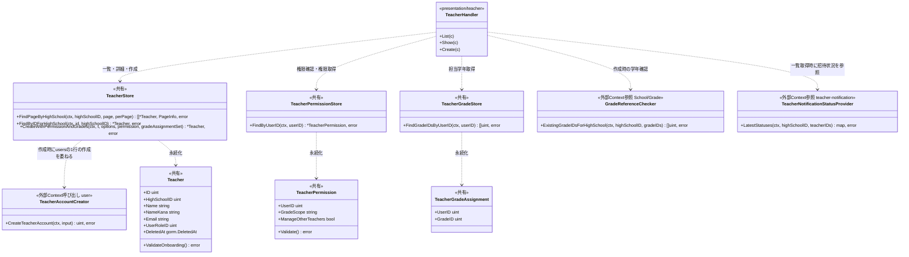
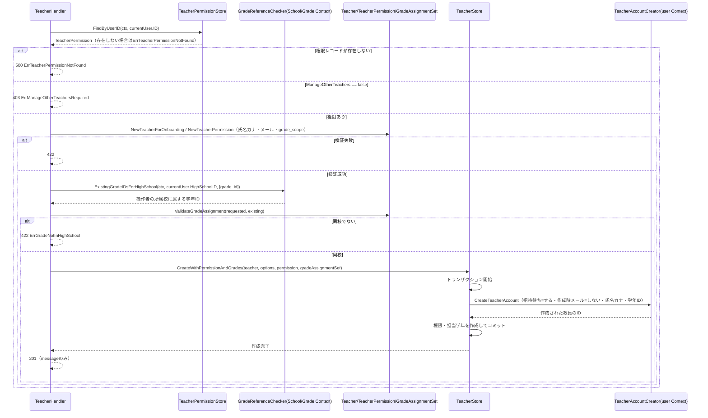
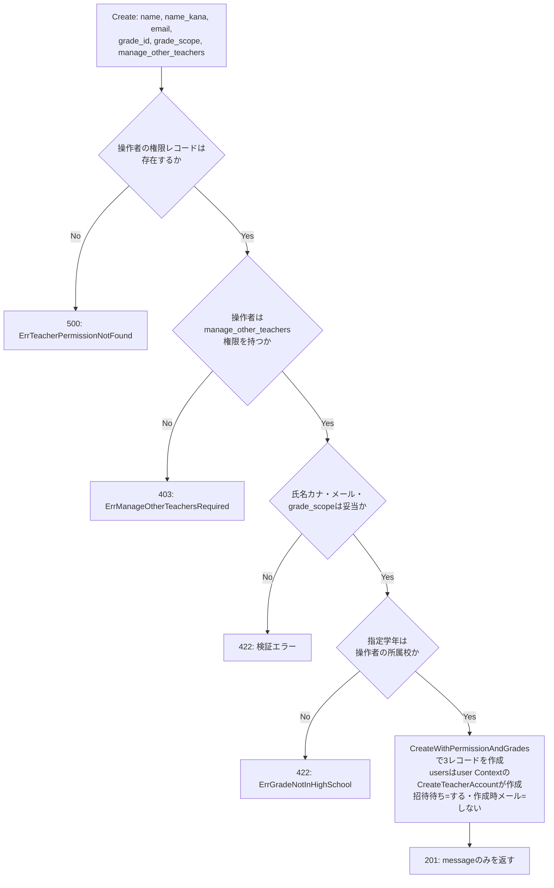

# 教師教員管理機能 Go実装仕様書

---

# 1. 機能概要

## 機能概要

教師が同校の教員一覧・詳細を確認し、新規教員アカウントを作成（招待）できる機能である。教員一覧には、各教員への直近の招待通知状況（`invitation_status`）を教員招待通知機能（`teacher-notification` Context）から参照して含める。新規教員作成時は、`User`（アカウント本体）・`TeacherPermission`（初期権限）・`TeacherGrade`（担当学年）の3レコードを1つの業務操作として整合性を保ちながら作成する。`users`の1行の作成は`user` Contextの`CreateTeacherAccount`（招待待ち=する・作成時に招待メールを送る=しない）に任せ、`TeacherStore`は権限・担当学年の作成とトランザクションの管理を担う。作成時にメールは送らない（招待メールは教員招待通知機能が後から送る）。作成の実行には、操作者自身が「他職員操作権限（`manage_other_teachers`）」を保持していることが前提条件となる。

**本書の特別な位置づけ**: 本機能（教師教員管理機能）と管理者教員管理機能は、同一のBounded Context（`teacher-management`）・同一のAggregate（Teacher）を扱う一体の業務領域である。同じ3テーブル（`users`の教員レコード / `teacher_permissions` / `teacher_grades`）に対するEntity・Repository（Store）は、実際のGoコードでは同じpackage（`internal/teacher_management`）に1セットのみ存在する。そのModel（`Teacher` / `TeacherPermission` / `TeacherGradeAssignment`）とStore（`TeacherStore` / `TeacherPermissionStore` / `TeacherGradeStore`）は**管理者教員管理機能_Go実装仕様書が正の文書として完全に定義済み**であり、本書はそれを再利用する。本書が新規に定義するのは、教師視点固有の処理（同校スコープの一覧・詳細参照、他職員操作権限の確認、`TeacherNotificationStatusProvider`による招待通知状況の付与、新規作成時の氏名カナ・メール形式検証）と、教師向けのpresentation層（Handler/Request/Response/Routing）のみである。

## 採用設計パターンとその理由（②からの要約）

②「4. 設計パターン」より**Active Record**を採用する。

- 主要操作が一覧・詳細・作成というCRUD中心の操作であり、複雑な状態遷移が存在しない（教員アカウントの有効/無効は`deleted_at`による論理削除のみで、本機能の対象外）
- 作成時の業務ルール（氏名カナ形式・メール形式・同校学年制約・grade_scope値チェック）は、値の妥当性検証に近く、Entity（Active Record上はModel）の検証責務として表現できる
- アカウント・権限・担当学年の関連付けは、1回の作成操作内でデータ整合性を保てば足り、複雑なドメイン振る舞いを要しない
- 教員一覧への招待通知状況の付与は、teacher-notification Contextへの参照呼び出しを追加するのみであり、Active Recordの構造を変える要因にはならない（②「3. Bounded Context」）

②「4. 設計パターン」で採用しなかったTransaction Script・Domain Model・Event Sourcingについても、②の判断をそのまま踏襲し、本書では変更しない。管理者教員管理機能も同じくActive Recordを採用しており、両機能は同一の構造（Model＋Store、usecase層なし）を共有する。

## 本書が対象とする実装範囲

- Bounded Context: `teacher-management`（管理者教員管理機能_Go実装仕様書と共通）
- Model・Store: 対象外（管理者教員管理機能_Go実装仕様書「3. Domain層設計」「5. Infrastructure層設計」を再利用する。本書では新規作成しない）
- 本書が新規に定義する範囲: 教師視点固有の処理（他職員操作権限の確認・招待通知状況の付与・新規作成時の氏名カナ・メール形式検証）とpresentation層・API仕様
- 対象操作: 教員一覧取得（ListTeachers、招待通知状況の付与を含む）、教員詳細取得（ShowTeacher）、新規教員作成（CreateTeacher、他職員操作権限の確認を含む）
- 規約（`規約/アーキテクチャ規約.md`「3. 設計パターンごとの構造適用方針」）に従い、Active Record採用機能としてdomain層・application層（usecase層）・Repository Interfaceを設けない構造で実装する
- 対象外: 管理者視点のエンドポイント（`/api/v1/admin/high_schools/:high_school_id/teachers`配下）のpresentation層は管理者教員管理機能_Go実装仕様書の責務とする
- ①Rails実装の詳細（`CreateTeacherForm`等のコード内容）は本タスクでは提供されておらず、参照が必要な箇所は「①未提供のため参照不可」と明記する

---

# 2. ディレクトリ構成

## 対象Bounded Context名

`teacher-management`（管理者教員管理機能_Go実装仕様書と共通。実装ディレクトリ名は`internal/teacher_management`。管理者教員管理機能_Go実装仕様書「2. ディレクトリ構成」②からの補足を参照）

## ②で採用した設計パターン

- Active Record（②「4. 設計パターン」）

## 採用パターンに対応する構造

アーキテクチャ規約「3. 設計パターンごとの構造適用方針」のActive Record構造に従う。domain層・infrastructure層のレイヤー分離、usecase層は設けない。

**Model・Storeは本書では新規作成しない。** ②「6. Entity設計」のTeacher・TeacherPermission・TeacherGradeAssignment、および②「9. Repository設計」のTeacherStore・TeacherPermissionStore・TeacherGradeStoreは、管理者教員管理機能_Go実装仕様書「2. ディレクトリ構成」「3. Domain層設計」「5. Infrastructure層設計」で定義済みの`Teacher` / `TeacherPermission` / `TeacherGradeAssignment` / `TeacherStore` / `TeacherPermissionStore` / `TeacherGradeStore`をそのまま再利用する。

本書が実際に追加作成するのは、教師視点固有の処理を担うファイルと、教師向けのpresentation層（`internal/teacher_management/presentation/teacher/`）のみである。管理者教員管理機能_Go実装仕様書「2. ディレクトリ構成」の**②からの補足（本書固有の構造判断）**のとおり、同一Aggregateを管理者視点・教師視点の2つのHandler群が操作し、`TeacherHandler`等の名前が衝突するため、presentation層は`admin`/`teacher`サブパッケージへ分割されている。本書はそのうち`teacher`サブパッケージを担当する。

## 作成するディレクトリ一覧

```
internal/teacher_management/
└── presentation/
    └── teacher/
        ├── handler/
        ├── request/
        ├── response/
        └── routes.go
```

## 作成するファイル一覧

|パス|内容|
|-|-|
|`internal/teacher_management/teacher_onboarding.go`|教師視点の新規作成に固有のModel検証（`NewTeacherForOnboarding` / `Teacher.ValidateOnboarding`。「3. Domain層設計」参照）。共有するpackage（`internal/teacher_management`）に配置する|
|`internal/teacher_management/teacher_notification_status_provider.go`|`TeacherNotificationStatusProvider`（teacher-notification Contextの参照用interface。「8. Infrastructure層設計」参照）|
|`internal/teacher_management/presentation/teacher/handler/teacher_handler.go`|`TeacherHandler`（List/Show/Create）|
|`internal/teacher_management/presentation/teacher/request/teacher_request.go`|Request DTO|
|`internal/teacher_management/presentation/teacher/response/teacher_response.go`|Response DTO（招待通知状況フィールドを含む）|
|`internal/teacher_management/presentation/teacher/routes.go`|ルーティング登録|

**対象外**: `domain/`, `application/usecase/`, `infrastructure/repository/`（Active Record採用のため設けない）。`Teacher` / `TeacherPermission` / `TeacherGradeAssignment`のstruct定義、`TeacherStore` / `TeacherPermissionStore` / `TeacherGradeStore`の実装、`errors.go`、`dependency.go`（`GradeReferenceChecker`等）は管理者教員管理機能_Go実装仕様書が定義済みであり、本書では作成しない。

本書のHandlerは、管理者教員管理機能_Go実装仕様書が定義した以下の共有コンポーネントに依存する（新規作成しない）。

- `internal/teacher_management`の`Teacher` / `TeacherPermission` / `TeacherGradeAssignment` / `GradeAssignmentSet`
- `internal/teacher_management`の`NewTeacher` / `NewTeacherPermission` / `NewGradeAssignmentSet` / `ValidateGradeAssignment`
- `internal/teacher_management`の`TeacherStore` / `TeacherPermissionStore` / `TeacherGradeStore`
- `internal/teacher_management`の`GradeReferenceChecker`・`TeacherAccountCreator`・`TeacherAccountInput`（`dependency.go`）、`TeacherAccountOptions`（`teacher.go`）
- `internal/teacher_management`の各エラー変数（`errors.go`）

**②からの補足**: `GradeStore`（学年の存在確認・所属校取得）は②「9. Repository設計」に「School/Grade Context提供・参照専用」と明記されており、管理者教員管理機能_Go実装仕様書が`GradeReferenceChecker`として消費者側interfaceを定義済みである。`TeacherNotificationStatusStore`（招待通知状況の参照）は②「3. Bounded Context」「10. UseCase設計」に teacher-notification Context提供・参照専用と明記されている。いずれも別Bounded Contextが公開する参照専用の手段を、アーキテクチャ規約「5. Context間連携ルール」に従って呼び出す想定とする。School/Grade側Contextの②/③文書は本タスクでは提供されておらず、正確なpackage pathは「推測」であり、実装時に確認が必要。teacher-notification Context側は本タスクの担当範囲内であり、「教員招待通知機能_Go実装仕様書」を正とする。

---

# 3. Domain層設計

**対象外（Active Record採用のため、domain層を設けない。Model・Storeは管理者教員管理機能_Go実装仕様書「3. Domain層設計」で定義済みのものを再利用する）。** Model（Entity相当）のstruct定義・`NewTeacher` / `NewTeacherPermission` / `NewGradeAssignmentSet` / `ValidateGradeAssignment`・Domain Errorの大半は同書で定義済みであり、本書では再定義しない。本書のHandlerが呼び出す共有要素は以下のとおりである（詳細な責務・不変条件は同書「3. Domain層設計」を参照）。

|要素|参照先|本書での用途|
|-|-|-|
|`Teacher`（`NewTeacher`）|管理者教員管理機能_Go実装仕様書「3. Domain層設計」Model|一覧・詳細の取得結果、および新規作成時のインスタンス生成の土台として利用する（氏名カナを含む生成・検証は下記`NewTeacherForOnboarding`）|
|`TeacherPermission`（`NewTeacherPermission` / `Validate`）|同上|新規作成時に初期権限（`grade_scope` / `manage_other_teachers`）を生成・検証する。`grade_scope`が許容値でない場合は`ErrInvalidGradeScope`となる（②「7. Value Object設計」GradeScope）|
|`TeacherGradeAssignment` / `GradeAssignmentSet`（`NewGradeAssignmentSet`）|同上|新規作成時の担当学年（単一の`grade_id`）を、要素1つの`GradeAssignmentSet`として扱う|
|`ValidateGradeAssignment`|同上（②「8. Domain Service」TeacherGradeAssignmentPolicyに相当）|新規作成時、指定学年が操作者の所属校に属するかを判定する。属さない場合は`ErrGradeNotInHighSchool`となる|
|`GradeReferenceChecker`|同上（`dependency.go`）|`ValidateGradeAssignment`へ渡す「対象高校に属する学年ID」を取得する|
|`TeacherAccountOptions`|同上（`teacher.go`）|`TeacherStore.CreateWithPermissionAndGrades`へ渡す、`user` Contextの`CreateTeacherAccount`への指定値。教師視点は、学年ID=指定した`grade_id`・招待待ち=`true`・作成時に招待メールを送信=`false`|

## 教師視点固有のModel検証（本書が定義。`internal/teacher_management/teacher_onboarding.go`）

②「7. Value Object設計」のNameKana・Emailの検証ルールと、②「6. Entity設計」Teacherの「氏名カナがカタカナ形式であること」の保持・検証を、Active Record構造に従いModelのメソッドとして実現する（Value Objectは独立して設けない）。管理者視点の招待は氏名カナ・メール形式の検証を本書と同じ形では要求しないため、教師視点の新規作成にのみ適用する検証として`Teacher`のメソッドを共有packageに定義する。

|メソッド|引数|戻り値|責務|
|-|-|-|-|
|`NewTeacherForOnboarding`|`(highSchoolID uint, name, nameKana, email string)`|`(*Teacher, error)`|`NewTeacher`で必須項目（HighSchoolID・Name・Email）の不変条件を保証したうえで、`NameKana`を入力値で設定（`NewTeacher`が設定する氏名と同じ値を上書き）し、`ValidateOnboarding()`を呼び出して返すファクトリ|
|`(t *Teacher) ValidateOnboarding() error`|なし|`error`|`NameKana`が空でなく、カタカナ・長音・中黒・空白のみで構成されること（違反は`ErrInvalidNameKana`）、`Email`が一般的なメールアドレス形式であること（違反は`ErrInvalidEmail`）を検証する|

## Value Object

**対象外**（アーキテクチャ規約3章の指示により、Active Record採用時は原則対象外とする）。②「7. Value Object設計」の`NameKana`／`Email`の形式検証ルールは上記`Teacher.ValidateOnboarding`に、`GradeScope`の許容値検証ルールは管理者教員管理機能_Go実装仕様書の`TeacherPermission.Validate`に統合されている。

## Repository Interface

**対象外**（Active Record採用のため、domain層にRepository Interfaceを定義しない）。

## Domain Service

**対象外**。②「8. Domain Service」の`TeacherGradeAssignmentPolicy`は、管理者教員管理機能_Go実装仕様書の`ValidateGradeAssignment`（packageレベル関数）と共通のものを利用する。

## Domain Event

②「15. Domain Event」のとおり、本機能ではDomain Eventを採用しない。教師による教員作成は、作成時にメールを送らない（Rails現行と同じ。招待メールは教員招待通知機能が後から送る）ため、メール送信のアダプタを設けず、非同期化・イベント化を要する後続処理は存在しない。よって対象外。

## Domain Error（struct/Storeが返すエラー）

エラー変数は管理者教員管理機能_Go実装仕様書「3. Domain層設計」Domain Errorの`errors.go`で定義済みである。本機能で発生するエラーと発生元は以下のとおり。

|エラー|発生元|発生条件|
|-|-|-|
|`ErrInvalidNameKana`|`Teacher.ValidateOnboarding()`|氏名カナが空、またはカタカナ・長音・中黒・空白以外を含む|
|`ErrInvalidEmail`|`Teacher.ValidateOnboarding()`|メールアドレスが一般的な形式でない|
|`ErrInvalidGradeScope`|`TeacherPermission.Validate()`（`NewTeacherPermission`）|`GradeScope`が許容値（`own_grade`/`all_grades`）以外|
|`ErrGradeNotInHighSchool`|`ValidateGradeAssignment`の判定結果をHandlerが変換|指定学年が操作者の所属校に属さない（存在しない場合を含む。推測。「17. ②からの補足事項」参照）|
|`ErrTeacherNotFound`|`TeacherStore.FindByIDForHighSchool`|指定教員が存在しない、または同校でない|
|`ErrManageOtherTeachersRequired`|`TeacherHandler.Create`（`TeacherPermissionStore.FindByUserID`の結果判定）|操作者（current teacher）が`manage_other_teachers`権限を保持しない状態で教員作成を試みた|
|`ErrTeacherPermissionNotFound`|`TeacherPermissionStore.FindByUserID`|操作者（`Create`）の権限レコードが存在しない。想定外の状態として500に変換する（`ErrManageOtherTeachersRequired`（403）とは区別する）。詳細取得（`Show`）では、対象教員の権限レコードが存在しない場合は権限情報を値なし（`null`）として返し、エラーにしない。エラー変数は管理者教員管理機能_Go実装仕様書「3. Domain層設計」で定義済み|

エラー種別ごとの型／変数定義方針は「14. Error実装方針」で扱う。

---

# 4. クラス図

Active Record採用のため、Model（struct）とStoreの関係を示す。Model・Storeは管理者教員管理機能_Go実装仕様書「3. Domain層設計」「5. Infrastructure層設計」で定義済みのものであり、以下では本書のHandlerが利用する範囲のみを示す（`<<共有>>`は同書で定義済みの要素を表す）。



---

# 5. 状態遷移図

省略する。

理由: 教員アカウントの有効/無効は`deleted_at`による論理削除のみであり、本機能の対象外（②「4. 設計パターン」）。`TeacherPermission`（着任時の初期権限）・`TeacherGradeAssignment`はいずれも作成時点で確定し、以後本Context内では状態遷移を持たない。

---

# 6. Application層設計

**対象外（Active Record採用のため、usecase層を設けない）。** ②「10. UseCase設計」の`ListTeachers`／`ShowTeacher`／`CreateTeacher`は、Handlerが`Store`を直接呼び出す処理として「9. Presentation層設計」のHandler処理順序に統合して記載する。DTO（Command/Query）は独立したapplication層のDTOとして設けず、「9. Presentation層設計」のRequest/Response DTOがその役割を兼ねる。

---

# 7. シーケンス図・処理フロー図

## シーケンス図

### `TeacherHandler.Create`



## 処理フロー図

### `TeacherHandler.Create`



`List`・`Show`は絞り込み条件の組み立てとteacher-notification Contextへの参照呼び出しのみで分岐が少ないため、処理フロー図は省略する。

---

# 8. Infrastructure層設計

**Repository実装**: 対象外（Active Record採用のため、Repository Interfaceおよびその実装を設けない）。

## Store実装

**対象外**。`TeacherStore` / `TeacherPermissionStore` / `TeacherGradeStore`は、アーキテクチャ規約「3. 設計パターンごとの構造適用方針」に従いModelと同一package（`internal/teacher_management`）に置かれ、管理者教員管理機能_Go実装仕様書「5. Infrastructure層設計」で定義済みである。本書では新規実装しない。②「9. Repository設計」で教師視点として必要とされる責務（同校教員の一覧取得［氏名カナ順・ページネーション］・詳細取得・新規作成、権限の取得、担当学年の取得）は、いずれも同書のStoreメソッドで満たされる。本書のHandlerが教師視点で利用するメソッドは以下のとおりである。

|Store|メソッド|本書での用途|
|-|-|-|
|`TeacherStore`|`FindPageByHighSchool`|`List`：同校の教員を氏名カナ順・ページネーション付きで取得する|
|`TeacherStore`|`FindByIDForHighSchool`|`Show`：同校の教員1件を取得する。該当なしは`ErrTeacherNotFound`|
|`TeacherStore`|`CreateWithPermissionAndGrades`|`Create`：`user` Contextの`CreateTeacherAccount`によるアカウント作成・TeacherPermission・担当学年の作成を1トランザクションで行う（招待待ち=`true`・作成時に招待メールを送信=`false`・学年ID=指定した`grade_id`を`TeacherAccountOptions`で指定する）|
|`TeacherPermissionStore`|`FindByUserID`|`Create`：操作者自身の`manage_other_teachers`確認、`Show`：対象教員の権限取得|
|`TeacherGradeStore`|`FindGradeIDsByUserID`|`Show`：対象教員の担当学年取得|

`TeacherPermissionStore.Create`・`TeacherGradeStore.ReplaceAll`は、`TeacherStore.CreateWithPermissionAndGrades`が同一トランザクション内から呼び出すため、本書のHandlerからは直接呼び出さない。`user` Contextの`CreateTeacherAccount`も、Handlerからは直接呼び出さず、`TeacherStore.CreateWithPermissionAndGrades`が呼び出す。

## 外部連携実装

|実装対象|呼び出し元|実装方針|
|-|-|-|
|`GradeReferenceChecker`（School/Gradeコンテキスト提供・参照専用。②「9. Repository設計」のGradeStoreに相当）|`TeacherHandler.Create`（作成時、指定学年が操作者の所属校に属するかの確認）|本Context内では実装しない。`GradeReferenceChecker`は管理者教員管理機能_Go実装仕様書「3. Domain層設計」（`dependency.go`）で定義済みであり、実装はSchool/Gradeコンテキスト側が提供する。正確な実装側のpackage pathは②に明記がなく「推測」|
|`TeacherNotificationStatusProvider`（teacher-notificationコンテキスト提供・参照専用。②「10. UseCase設計」の`TeacherNotificationStatusStore`に相当）|`TeacherHandler.List`（一覧取得時、各教員の招待通知状況取得）|コーディング規約「7. インターフェース」の方針に従い、利用側（`teacher_management`パッケージ）が最小限のinterfaceを`teacher_notification_status_provider.go`内に定義する: `type TeacherNotificationStatusProvider interface { LatestStatuses(ctx context.Context, highSchoolID uint, teacherIDs []uint) (map[uint]string, error) }`。実装は教員招待通知機能（`teacher-notification` Context）の`TeacherNotificationStore`が本interfaceを構造的に満たす形で提供する（詳細は教員招待通知機能_Go実装仕様書を参照）。招待通知状況の付与は教師視点のみの処理であり、管理者視点と共有する`TeacherStore`に`teacher-notification` Contextへの依存を持ち込まないため、`TeacherHandler`が取得結果を組み合わせる。DI配線はアーキテクチャ規約「14. 依存関係の組み立て（DI配線）」に従い、`teacher_management`のContext組み立て関数が`teacher-notification` Contextの組み立て結果から受け取る|

Mail・Cache・Queueは対象外（作成時にメールを送らない。招待メールは教員招待通知機能が、`user` Contextの`RequestInvitationEmail`を呼んで送る）。

---

# 9. Presentation層設計

本書のpresentation層は教師視点として`internal/teacher_management/presentation/teacher/`配下に置く。管理者視点のpresentation層は`internal/teacher_management/presentation/admin/`（管理者教員管理機能_Go実装仕様書）に分割されており、同名のstruct（`TeacherHandler`・`TeacherResponse`・`TeacherListResponse`等）はそれぞれ別packageに属するため衝突しない。

## Handler

### TeacherHandler（`internal/teacher_management/presentation/teacher/handler/teacher_handler.go`）

|項目|内容|
|-|-|
|struct名|`TeacherHandler`（package: `internal/teacher_management/presentation/teacher/handler`）|
|コンストラクタが受け取る依存|`*teacher_management.TeacherStore`／`*teacher_management.TeacherPermissionStore`／`*teacher_management.TeacherGradeStore`／`teacher_management.GradeReferenceChecker`／`teacher_management.TeacherNotificationStatusProvider`|
|対応する呼び出し先|Store（Active Record採用のためUseCase層を経由しない）|

メソッド一覧:

|メソッド|HTTPメソッド|パス|
|-|-|-|
|`List`|GET|`/api/v1/teacher/colleagues`|
|`Show`|GET|`/api/v1/teacher/colleagues/:id`|
|`Create`|POST|`/api/v1/teacher/colleagues`|

### `List` 処理順序（②10節`ListTeachers`に対応）

1. Middlewareが設定したcurrent user（`teacher`ロール、所属校ID）をcontextから取得する
2. クエリパラメータ`page` / `per_page`をRequest DTOにバインドする。`per_page`は、未指定・数値でない値・0以下の場合は既定値20件、100を超える場合は100件に丸める（上限100件）。`page`は、未指定・数値でない値・0以下の場合は1ページ目として扱う。いずれもエラー（422）にしない（Rails現行の`sanitized_per_page` / `sanitized_page`と同一。②「10. UseCase設計」ListTeachers）
3. `TeacherStore.FindPageByHighSchool(ctx, currentUser.HighSchoolID, page, perPage)`を呼び出し、同校の教員を氏名カナ順・ページネーション付きで取得する
4. 取得した教員ID一覧を`TeacherNotificationStatusProvider.LatestStatuses(ctx, currentUser.HighSchoolID, teacherIDs)`へ渡し、各教員の直近の招待通知状況を取得する。通知が存在しない教員は「未送信」として扱う（②「3. Bounded Context」「16. API互換方針」）
5. 取得結果と招待通知状況を組み合わせてResponse DTO（`invitation_status`を含む）へ変換して返す

### `Show` 処理順序（②10節`ShowTeacher`に対応）

1. current userをcontextから取得する
2. パスパラメータ`id`をRequest DTOにバインドし、型を検証する
3. `TeacherStore.FindByIDForHighSchool(ctx, id, currentUser.HighSchoolID)`を呼び出す。該当なし（存在しない、または同校でない）の場合は`ErrTeacherNotFound`として404を返す
4. `TeacherGradeStore.FindGradeIDsByUserID(ctx, id)`を呼び出し、担当学年情報を取得する
5. `TeacherPermissionStore.FindByUserID(ctx, id)`を呼び出し、権限情報を取得する（②からの補足：下記参照）。`ErrTeacherPermissionNotFound`の場合は、権限情報を値なし（`null`）として扱い、エラーにしない（Rails現行の`TeacherSerializer`が、権限レコードが存在しない教員の`teacher_permission`を`null`で返すことに合わせる）
6. 取得結果をResponse DTOへ変換して返す

**②からの補足（推測）**: ②「10. UseCase設計」ShowTeacherの出力は「権限・担当学年を含む」だが、「呼び出すStore」には権限を扱うStoreが含まれない。本書では、同一Context内で共有する`TeacherPermissionStore.FindByUserID`で取得する構成とした。

### `Create` 処理順序（②10節`CreateTeacher`に対応）

1. current user（`teacher`ロール、所属校ID）をcontextから取得する
2. `TeacherPermissionStore.FindByUserID(ctx, currentUser.ID)`を呼び出し、操作者自身の`TeacherPermission`を取得する。`ManageOtherTeachers`が`false`の場合、以降の処理を中断し`ErrManageOtherTeachersRequired`を返す。`FindByUserID`が`ErrTeacherPermissionNotFound`（操作者の権限レコードが存在しない）を返した場合は、権限なし（403）ではなく想定外の状態として、以降の処理を中断し500を返す（Rails現行の`Teacher::TeachersController#create`が、権限レコードが存在しない操作者に対して特別な扱いをせず、例外となって500になることに合わせる。②「10. UseCase設計」CreateTeacher）（②「10. UseCase設計」「13. Authorization設計」：ロール確認とは別の業務権限確認として、最初のステップに配置する）
3. Request Bodyを`CreateTeacherRequest`にバインドし、型・必須・フォーマットを検証する（Presentation Validation）
4. `teacher_management.NewTeacherForOnboarding(currentUser.HighSchoolID, name, nameKana, email)`でTeacherを生成し、氏名カナ形式・メール形式を検証する（違反は`ErrInvalidNameKana` / `ErrInvalidEmail`）
5. `teacher_management.NewTeacherPermission`で初期TeacherPermissionを生成し、`grade_scope`許容値を検証する（違反は`ErrInvalidGradeScope`。`UserID`は、`user` Contextが作成した教員のIDを`TeacherStore.CreateWithPermissionAndGrades`が設定するため、生成時は未設定とする）
6. `teacher_management.NewGradeAssignmentSet`で、指定`grade_id`を要素とする担当学年の集合を生成する
7. `GradeReferenceChecker.ExistingGradeIDsForHighSchool(ctx, currentUser.HighSchoolID, gradeSet.IDs())`で、操作者の所属校に属する学年IDを取得する
8. `teacher_management.ValidateGradeAssignment`で指定学年が操作者の所属校に属するかを判定する。属さない（または存在しない）場合は`ErrGradeNotInHighSchool`
9. `TeacherStore.CreateWithPermissionAndGrades(ctx, teacher, options, permission, &gradeSet)`を呼び出す。`options`（`TeacherAccountOptions`）には、学年ID=`grade_id`・招待待ち=`true`・作成時に招待メールを送信=`false`を指定する。Store内で、`user` Contextの`CreateTeacherAccount`による`users`の作成・権限・担当学年の作成を1トランザクションで行う。`user` Contextが返すValidationエラー（メールアドレスの重複等）は422とする。作成時にメールは送らない
10. `CreateTeacherResponse`（`message`のみ）を組み立て、201を返す。作成された教員の情報は返さない（②「16. API互換方針」Response）

## Request / Response DTO

### Request DTO（`internal/teacher_management/presentation/teacher/request/teacher_request.go`）

|struct名|フィールドと型|バリデーションタグ／チェック内容|
|-|-|-|
|`ListTeachersRequest`|`Page int`（クエリパラメータ`page`）／`PerPage int`（クエリパラメータ`per_page`）|型チェックは行うが、不正な値（数値でない・0以下）はエラーにせず、Handlerが既定値（`page`は1、`per_page`は20）に置き換える。`per_page`の上限は100（Handlerで丸める）|
|`ShowTeacherRequest`|`ID uint`（パスパラメータ`id`）|必須、正の整数であること|
|`CreateTeacherRequest`|`Name string`／`NameKana string`／`Email string`／`GradeID uint`／`GradeScope string`／`ManageOtherTeachers bool`|全フィールド必須。`Email`はメールアドレス形式チェック、`NameKana`はカタカナ形式チェック|

### Response DTO（`internal/teacher_management/presentation/teacher/response/teacher_response.go`）

|struct名|フィールドと型|
|-|-|
|`TeacherSummaryResponse`|`ID uint`／`Name string`／`NameKana string`／`Email string`／`InvitationStatus string`（②16章の`invitation_status`）|
|`TeacherListResponse`|`Teachers []TeacherSummaryResponse`／`Pagination PaginationResponse`|
|`PaginationResponse`|`CurrentPage int`（JSON: `current_page`）／`TotalPages int`（`total_pages`）／`TotalCount int`（`total_count`）／`PerPage int`（`per_page`）（`TeacherStore.FindPageByHighSchool`が返す`PageInfo`から変換する。Rails現行の`meta`の項目に合わせる）|
|`TeacherGradeResponse`|`GradeID uint`|
|`TeacherDetailResponse`|`ID uint`／`Name string`／`NameKana string`／`Email string`／`GradeScope *string`／`ManageOtherTeachers *bool`（権限レコードが存在しない教員では`nil`＝JSONの`null`）／`Grades []TeacherGradeResponse`|
|`CreateTeacherResponse`|`Message string`（JSON: `message`。値は`教員の新規作成に成功しました。`）のみ。作成された教員の情報は含めない（Rails現行の`Api::V1::Teacher::TeachersController#create`のレスポンスに合わせる。②「16. API互換方針」）|

EntityであるTeacher／TeacherPermission／TeacherGradeAssignmentをそのまま返さず、必ずResponse DTOへ変換する（規約「7. データフロー」）。

**②からの補足**: Response DTOの詳細フィールド構成は①未提供のため、②の記載範囲（氏名・氏名カナ・メール・権限・担当学年・招待状況）から推測できる最小限の構成とした。

## Routing

`internal/teacher_management/presentation/teacher/routes.go`

|Method|Path|Handler|
|-|-|-|
|GET|`/api/v1/teacher/colleagues`|`TeacherHandler.List`|
|GET|`/api/v1/teacher/colleagues/:id`|`TeacherHandler.Show`|
|POST|`/api/v1/teacher/colleagues`|`TeacherHandler.Create`|

`routes.go`にて、`teacher`ロールを要求する認証Middlewareを経由した上でこれらのルートを登録する。

---

# 10. API仕様

|Method|Path|Handler|Request|Response|Status Code|
|-|-|-|-|-|-|
|GET|`/api/v1/teacher/colleagues`|`TeacherHandler.List`|`ListTeachersRequest`|`TeacherListResponse`|200|
|GET|`/api/v1/teacher/colleagues/:id`|`TeacherHandler.Show`|`ShowTeacherRequest`|`TeacherDetailResponse`|200|
|POST|`/api/v1/teacher/colleagues`|`TeacherHandler.Create`|`CreateTeacherRequest`|`CreateTeacherResponse`|201|

## Errorケース

|条件|Status Code|Error内容|
|-|-|-|
|`page` / `per_page`が数値でない・0以下|200|エラーにしない（`page`は1ページ目、`per_page`は既定値20件として扱う。100を超える`per_page`は100件に丸める）|
|指定した教員IDが存在しない、または同校でない|404|対象教員不存在|
|操作者が`manage_other_teachers`権限を持たずに教員作成を試みた|403|`ErrManageOtherTeachersRequired`|
|`CreateTeacherRequest`の必須項目欠落・フォーマット不正|422|Presentation Validationエラー|
|氏名カナがカタカナ形式でない|422|`ErrInvalidNameKana`|
|メールアドレス形式が不正|422|`ErrInvalidEmail`|
|`grade_scope`が許容値でない|422|`ErrInvalidGradeScope`|
|指定学年が同校でない（または存在しない、推測）|422|`ErrGradeNotInHighSchool`|
|操作者の権限レコードが存在しない状態で教員作成を試みた（`ErrTeacherPermissionNotFound`）|500|想定外の状態（Rails現行は例外となり500）。403にはしない|
|DB接続失敗等の技術的障害|500|Infrastructure Error|

---

# 11. Transaction実装方針

## Transaction開始箇所

- `TeacherStore.CreateWithPermissionAndGrades`メソッド内で、GORMのトランザクション（`db.WithContext(ctx).Transaction(func(tx *gorm.DB) error { ... })`）を開始する。トランザクションの実装は管理者教員管理機能_Go実装仕様書「8. Transaction実装方針」で定義済みのものを利用する
- `TeacherPermissionStore.FindByUserID`による操作者自身の権限確認は、この書き込みトランザクションの外（Handler側、`Create`処理順序の手順2の時点）で読み取り専用として実行する

## Transaction終了箇所

- メソッド内で`user` Contextの`CreateTeacherAccount`（`users`の作成。`tx`を保持する`ctx`を渡して同一トランザクションに参加させる。引き継ぎ方式は管理者教員管理機能_Go実装仕様書「8. Transaction実装方針」のとおり`user`②の未解決の論点9に従う） → `TeacherPermission`の作成 → 担当学年（`TeacherGradeAssignment`）の作成が全て成功した時点でコミットする
- いずれか1つでも失敗した場合は、`user` Contextが作成した`users`の行も含めてロールバックする
- `List`・`Show`の処理ではトランザクションを使用しない

## 複数Store（関数）にまたがる場合の扱い

- `TeacherPermissionStore`・`TeacherGradeStore`への書き込みは、`TeacherStore.CreateWithPermissionAndGrades`が保持するトランザクション用の`*gorm.DB`を用いて同一トランザクション内で実行される（管理者教員管理機能_Go実装仕様書「8. Transaction実装方針」「複数Storeにまたがる場合の扱い」）
- `GradeReferenceChecker`（School/Gradeコンテキスト）・`TeacherNotificationStatusProvider`（teacher-notificationコンテキスト）への問い合わせはいずれも読み取り専用アクセスであり、書き込みトランザクションの外で実行する

---

# 12. Validation実装方針

## Presentation

- `ListTeachersRequest.Page`: 型（整数）チェック
- `ShowTeacherRequest.ID`: 型（正の整数）・必須チェック
- `CreateTeacherRequest`: `Name`／`NameKana`／`Email`／`GradeID`／`GradeScope`／`ManageOtherTeachers`の必須チェック、`Email`のメールアドレス形式チェック、`NameKana`のカタカナ形式チェック

## 業務ルール検証（Active Record: Modelのメソッド）

- `Teacher.ValidateOnboarding()`（本書「3. Domain層設計」）: 氏名カナ・メールアドレスの形式
- `TeacherPermission.Validate()`（管理者教員管理機能_Go実装仕様書で定義済み）: `GradeScope`が`own_grade`/`all_grades`のいずれか
- `ValidateGradeAssignment`（同上）: 指定学年が操作者の所属校に属するか（`GradeReferenceChecker`による学年情報の取得とあわせて`TeacherHandler.Create`が呼び出す）
- `TeacherHandler.Create`（Handler処理内）: 操作者自身の`manage_other_teachers`権限確認

---

# 13. Authorization実装方針

## Middleware

- JWT等により認証済みユーザーを特定し、`teacher`ロールであることを確認する

## Handler

- ルーティングとHTTP入出力の変換のみを担当する
- Active Record採用によりUseCase層を経由しないため、以下の手順をHandlerが行う:
  - current userの所属校IDを用いて、`List`／`Show`の取得範囲を同校にスコープする
  - `Create`時、操作者自身の「他職員操作権限（`manage_other_teachers`）」を`TeacherPermissionStore.FindByUserID`で確認し、保持していない場合は以降のStore呼び出しに進まず403を返す。権限レコード自体が存在しない場合は、403ではなく500を返す（②「13. Authorization設計」）
  - `Create`時、指定学年が同校かどうかの判定材料としてcurrent userの所属校を`GradeReferenceChecker`・`ValidateGradeAssignment`に渡す

## Store／Model

- `ValidateGradeAssignment`において、同校でない学年の割当を拒否する
- `TeacherStore.FindPageByHighSchool`／`FindByIDForHighSchool`のクエリ条件に所属高校（`high_school_id`）を含めることで、Store層でも同校スコープを担保する（管理者教員管理機能_Go実装仕様書で定義済み）

## 判断理由

「他職員操作権限」の要否は、ロール（`teacher`であるか）のような粗い認可ではなく、教員個人が持つ業務権限（`TeacherPermission.ManageOtherTeachers`）に基づく判定であるため、Middlewareのロールチェックとは別に、Handler処理内（`TeacherPermissionStore`経由）で確認する（アーキテクチャ規約7章「認可（所有権・業務権限）」の配置方針、Active Record採用時はHandler/Storeに従う）。

---

# 14. Error実装方針

アーキテクチャ規約8章の指示に従い、本機能ではModel/Storeが返すエラーをそのままHandlerでHTTPレスポンスへ変換する2段階構成とする。エラー変数は管理者教員管理機能_Go実装仕様書「3. Domain層設計」Domain Errorの`errors.go`で定義済みのものを利用する。

## Model/Storeが返すエラー → HTTPレスポンスへの変換方針

- `Teacher.ValidateOnboarding()`／`TeacherPermission.Validate()`が返すエラー（`ErrInvalidNameKana` / `ErrInvalidEmail` / `ErrInvalidGradeScope`）と、`ValidateGradeAssignment`の判定結果として返す`ErrGradeNotInHighSchool`は、Handlerで422に変換する
- `TeacherPermissionStore.FindByUserID`の結果、`ManageOtherTeachers`が`false`の場合に返す`ErrManageOtherTeachersRequired`は、Handlerで403に変換する
- `TeacherPermissionStore.FindByUserID`が`ErrTeacherPermissionNotFound`（操作者の権限レコードが存在しない）を返した場合は、Handlerで500に変換する（403にはしない。Rails現行が、この場合に特別な扱いをせず、例外となって500になることに合わせる）
- `TeacherStore.FindByIDForHighSchool`が該当なしを表す`ErrTeacherNotFound`を返した場合、Handlerで404に変換する
- `TeacherStore.CreateWithPermissionAndGrades`のトランザクション内で一部レコードのみ作成に失敗した場合は、ロールバックの上でエラーを返し、Handlerで422または500（原因に応じて）に変換する。`user` Contextの作成操作が返すValidationエラー（メールアドレスの形式不正・重複、氏名・氏名カナの必須・文字数）は422、内部エラーは500に変換する
- DB接続失敗等は、Handlerで500に変換する

## Status Code対応表

|Error種別|発生層|HTTP Status|
|-|-|-|
|Presentation Validationエラー|Presentation（Request DTO）|422|
|`ErrManageOtherTeachersRequired`|Handler（`TeacherPermissionStore`結果判定）|403|
|`ErrTeacherPermissionNotFound`（`Create`時の操作者）|Handler（`TeacherPermissionStore`結果判定）|500|
|`ErrInvalidNameKana` / `ErrInvalidEmail`|Model（`Teacher.ValidateOnboarding`）|422|
|`ErrInvalidGradeScope`|Model（`TeacherPermission.Validate`）|422|
|`ErrGradeNotInHighSchool`|Handler（`ValidateGradeAssignment`経由）|422|
|`ErrTeacherNotFound`（対象教員不存在／同校でない）|Store（`TeacherStore`）|404|
|作成処理中の関連レコード不整合|Store（`TeacherStore.CreateWithPermissionAndGrades`）|422 または 500|
|`user` ContextのValidationエラー（メールアドレス重複等）|`user` Context（`TeacherAccountCreator`経由）|422|
|DB接続・永続化失敗|Store（Infrastructure的な失敗）|500|

---

# 15. GORM / DBクエリ設計

②「17. DB設計方針」（既存Rails DBを継続利用、スキーマ変更なし）をもとに整理する。SQL文そのものは記載しない。

## 利用するGORMモデルとテーブルの対応

**対象外（大部分）**。GORMモデル（`Teacher`：`users`、`TeacherPermission`：`teacher_permissions`、`TeacherGradeAssignment`：`teacher_grades`）とテーブル名の対応（`TableName()`の上書き含む）は、管理者教員管理機能_Go実装仕様書「12. GORM / DBクエリ設計」で定義済みのものをそのまま利用する（教員判定に用いる`user_roles`との結合条件も同書の「教員判定の共通条件」に従う）。本書では新規のGORMモデルを作成しない。

## 主要クエリの条件・ソート・ページネーション方針

本書のHandlerが発行するクエリ（管理者教員管理機能_Go実装仕様書で定義済みのStoreメソッドを教師視点で呼び出すもの）は以下のとおりである。

|Store／メソッド|条件|ソート|ページネーション|
|-|-|-|-|
|`TeacherStore.FindPageByHighSchool`|所属高校（`high_school_id`）一致、`users`と`user_roles`の結合により`user_roles.name`が教員（teacher）であること、論理削除されていないこと。取得後、教員ID一覧を`TeacherNotificationStatusProvider`へ渡し`invitation_status`をHandlerが付与する|`name_kana`昇順|`page` / `per_page`パラメータに基づくオフセット・件数制限（1ページあたり件数は既定値20件・上限100件。②「10. UseCase設計」ListTeachers）|
|`TeacherStore.FindByIDForHighSchool`|`id`一致、所属高校一致、`users`と`user_roles`の結合により`user_roles.name`が教員（teacher）であること|-|-|
|`TeacherStore.CreateWithPermissionAndGrades`|-（`users`の挿入は`user` Contextが行う。本書のStoreの挿入処理は`teacher_permissions`・`teacher_grades`で、`user_id`は`user` Contextが作成した教員のID）|-|-|
|`TeacherPermissionStore.FindByUserID`|`user_id`一致（該当なしは`ErrTeacherPermissionNotFound`）|-|-|
|`TeacherGradeStore.FindGradeIDsByUserID`|`user_id`一致|-|-|

## 既存Schemaへの変更

②「17. DB設計方針」の「変更なし」のとおり、本機能によるスキーマ変更は行わない。

---

# 16. テストケース設計

アーキテクチャ規約「3. 設計パターンごとの構造適用方針」の読み替え（Active Record: 「Domain Test」→「Model Test」、「UseCase Test」は対象外、「Repository Test」→「Store Test」）に従う。Model・Storeは管理者教員管理機能_Go実装仕様書で定義済みであり、共有するModel・Storeのテストケース（`Teacher` / `TeacherPermission` / `GradeAssignmentSet` / `ValidateGradeAssignment`、`TeacherStore`の各メソッド、`TeacherPermissionStore` / `TeacherGradeStore`）は同書「13. テストケース設計」のModel Test / Store Testを参照する。本書では教師視点固有のModel Test / Handler Test / Integration Testのみを記載する。

## Model Test（②「Domain Test」相当）

|対象|テストケース|
|-|-|
|`Teacher.ValidateOnboarding` / `NewTeacherForOnboarding`|氏名カナがカタカナのみで構成される場合に成功する／長音・中黒・空白を含む場合に成功する／漢字・ひらがな・英数字を含む場合、または空の場合に`ErrInvalidNameKana`で失敗する|
|`Teacher.ValidateOnboarding` / `NewTeacherForOnboarding`|一般的な形式のメールアドレスで成功する／`@`を含まない等の不正形式で`ErrInvalidEmail`で失敗する|

## UseCase Test

対象外（Active Record採用のため、usecase層を設けない）。

## Store Test（②「Repository Test」相当）

管理者教員管理機能_Go実装仕様書「13. テストケース設計」Store Testを参照する（教師視点で利用する`TeacherStore.FindPageByHighSchool`の同校スコープ・`name_kana`昇順・ページネーション、`TeacherStore.CreateWithPermissionAndGrades`の3レコード同時作成（`users`は`user` Contextのスタブ）・ロールバック、`TeacherStore.FindByIDForHighSchool`の同校スコープ、`TeacherPermissionStore.FindByUserID`・`TeacherGradeStore.FindGradeIDsByUserID`の取得のテストケースを含む）。

本書固有の観点として、教師視点の指定（招待待ち=`true`・作成時に招待メールを送信=`false`・氏名カナ・学年IDを渡す）で`CreateTeacherAccount`が呼ばれること、招待メール送信依頼が登録されないことを、`Create`のHandler Test・Integration Testで確認する。`TeacherPermissionStore.FindByUserID`が対象レコードを取得できない場合（操作者の権限レコードが存在しない場合）は、`Create`のHandler Testで、403ではなく500になることを確認する（Store Testは管理者教員管理機能_Go実装仕様書「13. テストケース設計」の`TeacherPermissionStore.FindByUserID`を参照）。

## Handler Test

|対象|テストケース|
|-|-|
|`TeacherHandler.List`|正常系：200で教員一覧・ページ情報・招待通知状況（`invitation_status`）が返ること（通知が存在しない教員は「未送信」となること）／`page` / `per_page`が不正な場合にエラーにならず、それぞれ1ページ目・既定値20件として扱われること／`per_page`が100を超える場合に100件に丸められること／`meta`相当のページ情報に`current_page` / `total_pages` / `total_count` / `per_page`が含まれること|
|`TeacherHandler.Show`|正常系：200で教員詳細（権限・担当学年を含む）が返ること／存在しない・同校でないIDの場合に404が返ること|
|`TeacherHandler.Create`|正常系：201で`message`のみが返り、作成された教員の情報が含まれないこと／`manage_other_teachers`権限がない操作者の場合に403が返ること／操作者の権限レコードが存在しない場合に403ではなく500が返ること／必須項目欠落・フォーマット不正の場合に422が返ること／氏名カナ形式不正の場合に422が返ること／メール形式不正の場合に422が返ること／`grade_scope`不正の場合に422が返ること／指定学年が同校でない場合に422が返ること|

## Integration Test

|対象|テストケース|
|-|-|
|一覧取得エンドポイント|`GET /api/v1/teacher/colleagues`を認証済みteacherユーザーで呼び出し、同校の教員一覧と各教員の招待通知状況が正しく返ること|
|詳細取得エンドポイント|`GET /api/v1/teacher/colleagues/:id`を呼び出し、権限・担当学年を含む詳細が正しく返ること|
|作成エンドポイント|`manage_other_teachers`権限を持つ教師が`POST /api/v1/teacher/colleagues`で新規教員を作成した後、一覧・詳細取得で作成結果が反映されていること／権限を持たない教師が実行した場合403で拒否されること|
|管理者視点との整合性|教師視点で作成した教員が管理者視点の一覧（`GET /api/v1/admin/high_schools/:high_school_id/teachers`）にも反映され、権限・担当学年が両視点で一貫すること（管理者教員管理機能_Go実装仕様書との統合確認）|

---

# 17. ②からの補足事項

②に明記がなく、本書で実装のために追加で判断した内容を以下に記載する。

|判断した内容|判断理由|推測かどうか|
|-|-|-|
|presentation層を`teacher`サブパッケージ（`internal/teacher_management/presentation/teacher/`）として、管理者教員管理機能_Go実装仕様書の`admin`サブパッケージと分離した|管理者教員管理機能_Go実装仕様書「2. ディレクトリ構成」の②からの補足のとおり、同一Aggregateを2つのHandler群が操作する構成で、`TeacherHandler`・`teacher_handler.go`・`TeacherListResponse`・`routes.go`等の名前が衝突するため。両書で一貫した構造とする必要があるため、本書でも踏襲した（面談機能・教師面談機能の`student`/`teacher`分割と同じ方針）|補足（管理者教員管理機能_Go実装仕様書の構造判断を踏襲したものであり、②の設計方針自体は変更していない）|
|Model・Storeを管理者教員管理機能_Go実装仕様書で定義済みのものに一本化し、本書では新規作成しない構成とした|両機能は同一Bounded Context（`teacher-management`）・同一Aggregate（Teacher）で、同じ3テーブルに対するEntity・Storeを扱うため。二重定義を避ける|補足（アーキテクチャ規約4章「Context分割基準」に基づく構成）|
|教員の所属校を表すフィールド・カラム名を`HighSchoolID`／`high_school_id`、権限・担当学年の教員参照を`UserID`／`user_id`とした|管理者教員管理機能_Go実装仕様書のModel・Storeの命名に合わせた。`users.high_school_id`・`teacher_permissions.user_id`・`teacher_grades.user_id`はRails `db/schema.rb`で確認済みのカラム名である|補足（管理者教員管理機能_Go実装仕様書の命名を踏襲したもの。カラム名はRails `db/schema.rb`で確認済み）|
|`TeacherNotificationStatusProvider`を`teacher_management`パッケージ側で定義する消費者側interfaceとし、招待通知状況の付与を`TeacherStore`ではなく`TeacherHandler`で行う構成とした|②「3. Bounded Context」「10. UseCase設計」は`TeacherNotificationStatusStore`を参照専用で利用するとのみ記載し、具体的な呼び出し方式（DIの形）までは明記がない。`TeacherStore`は管理者視点と共有するため、教師視点のみが必要とする`teacher-notification` Contextへの依存を持たせない|推測|
|教師視点の新規作成における氏名カナ・メール形式の検証を、`teacher_onboarding.go`の`NewTeacherForOnboarding` / `Teacher.ValidateOnboarding`として本書が定義した|②「7. Value Object設計」のNameKana・Emailの検証は教師教員管理機能側の設計であり、管理者視点の招待（氏名カナに氏名と同じ値を設定し、カタカナ形式を検証しない）には適用されないため、共有するModelのうち教師視点でのみ呼び出すメソッドとして分離した|推測|
|新規作成時の同校学年判定を、管理者教員管理機能_Go実装仕様書の`GradeReferenceChecker`と`ValidateGradeAssignment`（要素1つの`GradeAssignmentSet`）で行い、`ErrGradeNotInHighSchool`（422）とした|②「8. Domain Service」のTeacherGradeAssignmentPolicyは両機能で共通の概念であり、判定ロジックを二重に持たない。②は「指定学年が同校でない」のみを挙げており、「学年が存在しない」場合の扱いは明記がないため、存在しない場合も同校制約違反と同様に422とした|推測|
|`GradeReferenceChecker`の実装側（School/Gradeコンテキスト）の正確なpackage path|②「School/Grade Context提供・参照専用」とのみ記載。当該コンテキストの②/③文書は本タスクで提供されていない|推測|
|`TeacherPermissionStore.FindByUserID`が対象レコードを取得できない場合、`Create`では操作者の権限確認を500とし、`Show`では権限情報を`null`として返す|②「10. UseCase設計」「13. Authorization設計」「14. Error設計」の記載（Rails現行が権限レコードが存在しない操作者に特別な扱いをせず例外・500になること、詳細では権限を`null`で返すこと）に従う。`ErrTeacherPermissionNotFound`を、管理者教員管理機能_Go実装仕様書「3. Domain層設計」の`errors.go`に定義している|Rails現行の挙動の反映（推測ではない）|
|`Show`における権限情報の取得を、共有する`TeacherPermissionStore.FindByUserID`で行う構成とした|②の出力仕様は「権限・担当学年を含む」だが、「呼び出すStore」に権限を扱うStoreが含まれない|推測|
|`users`・`teacher_permissions`・`teacher_grades`テーブルの詳細カラム名|Rails `db/schema.rb`で確認済み（`users`: `name_kana`〔100文字以内〕・`deleted_at`・`high_school_id`・`user_role_id`等、`teacher_permissions`: `user_id`・`grade_scope`・`manage_other_teachers`、`teacher_grades`: `user_id`・`grade_id`）。教員であることの判定は`users.user_role_id`から`user_roles.name`を参照する形であり、`users`にロール名の列はない（管理者教員管理機能_Go実装仕様書「14. ②からの補足事項」参照）|確認済み（Rails `db/schema.rb`）|
|Response DTOの詳細フィールド構成（一覧・詳細）|Rails側のSerializer実装（①）が未提供|推測|
|`page`が不正な場合は1ページ目、`per_page`が不正な場合は既定値20件（上限100件）として扱い、エラー（422）にしない|②「10. UseCase設計」ListTeachers・「16. API互換方針」に記載のとおり、Rails現行の`ApplicationController`の共通設定（`DEFAULT_PER_PAGE` = 20、`MAX_PER_PAGE` = 100、`sanitized_page` / `sanitized_per_page`）に合わせる|Rails現行の挙動の反映（推測ではない）|
|新規教員作成時のパスワード・招待フローはCreateTeacherの入力・処理から除外した（仮パスワードの発行は`user` Contextの`CreateTeacherAccount`が行い、作成時にメールは送らない）|Rails現行の`Teacher::CreateTeacherForm`は作成時にメールを送らず、招待待ちで作成する。招待メールは教員招待通知機能（teacher-notification Context）が`user` Contextの`RequestInvitationEmail`を呼んで後から送る（②「3. Bounded Context」「15. Domain Event」、`user`②「12. UseCase設計」経路ごとの指定値）|②に準拠（新規の推測ではない）|

---
