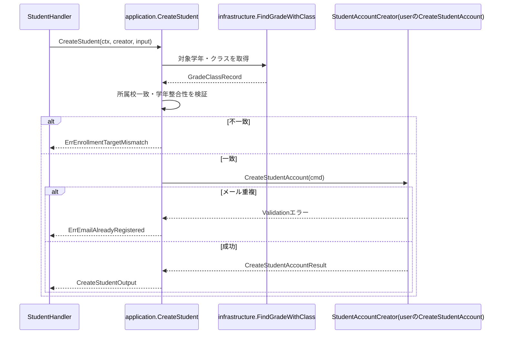
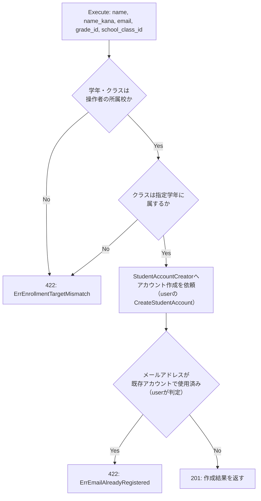

# 教師生徒参照機能 Go実装仕様書

---

# 1. 機能概要

## 機能概要

教師が同校の生徒一覧・生徒詳細を参照でき、あわせて生徒アカウントを1件ずつ新規登録できる機能である。一覧・詳細参照では、担当学年権限を持つ教師は担当学年の生徒のみに閲覧範囲が制限される。新規登録は担当学年権限の有無を問わず、同校の教師であれば誰でも実行できる（②「13. Authorization設計」）。生徒アカウント本体の作成処理（仮パスワード発行・生徒番号採番・招待メール送信）は、`user` Contextの`CreateStudentAccount`を直接呼び出す（②「3. Bounded Context」）。

## 採用設計パターンとその理由（②からの要約）

②「4. 設計パターン」により、本機能は引き続き **Transaction Script** を採用する。

- 一覧・詳細取得の業務ルールは「同校であること」「担当学年権限がある場合は担当学年のみ」という2条件の絞り込みに限定され、状態遷移・状態管理は存在しない
- 新規登録における本Context自身の業務ルールは「指定した学年・クラスが教師の所属校に属し、かつクラスが指定学年に属すること」という同校妥当性検証に限定される。氏名カナ・メール形式の入力検証は本Contextの入力検証（Presentation）が行い、仮パスワード発行・生徒番号採番・招待メール送信といった作成本体の複雑な処理は`user`の`CreateStudentAccount`へ委譲するため、本Context側にEntityへ振る舞いを集約するほどの複雑さは生まれない
- 検索条件構築・ページングおよび登録時の同校妥当性検証という、いずれも手続き的な処理が中心であり、Entityに振る舞いを持たせる必要性が薄い

Active Record・Domain Model・Event Sourcingは、②「4. 設計パターン」「20. 採用しなかった設計」のとおり不採用のままである。本書はこの判断を変更しない。

## 本書が対象とする実装範囲

- `GET /api/v1/teacher/students`（生徒一覧取得。`per_page`による可変ページング対応）
- `GET /api/v1/teacher/students/:id`（生徒詳細取得）
- `POST /api/v1/teacher/students`（生徒アカウントの新規登録。新規追加）

の3エンドポイントの実装に必要な、`application`関数・`infrastructure`関数・Handler・Routing・Request/Response構造体の実装単位を規定する。①Rails実装（Teacher::StudentsQuery・Teacher::CreateStudentForm等の実装詳細）は本書作成時点で未提供のため参照不可であり、該当箇所は②の記載のみを根拠とする。

---

# 2. ディレクトリ構成

## 対象Bounded Context名

- `student-directory`（②「3. Bounded Context」）

## ②で採用した設計パターン

- Transaction Script（②「4. 設計パターン」）

規約「3. 設計パターンごとの構造適用方針」の Transaction Script構造（domain層・usecase層・Repository Interfaceを設けない）を適用する。

## ディレクトリ一覧

```
internal/student_directory/
├── application/
├── infrastructure/
└── presentation/
    ├── handler/
    ├── request/
    └── response/
```

**②からの補足**: アーキテクチャ規約「8. 命名規約」により、`internal/`配下のディレクトリ名は英単語1語または短いスネークケースとする。②のContext名`student-directory`と`internal/`配下のディレクトリ名の対応関係は②に明記がないため、本書では`internal/student_directory`と判断した（推測、旧版からの判断を維持）。今回`presentation/request/`を新設した理由は「6. Presentation層設計」参照。

## 作成するファイル一覧

```
internal/student_directory/application/list_students.go
internal/student_directory/application/show_student.go
internal/student_directory/application/create_student.go
internal/student_directory/application/errors.go

internal/student_directory/infrastructure/student_query.go
internal/student_directory/infrastructure/grade_class_query.go

internal/student_directory/presentation/handler/student_handler.go
internal/student_directory/presentation/request/student_request.go
internal/student_directory/presentation/response/student_response.go
internal/student_directory/presentation/routes.go
```

---

# 3. Domain層設計

**対象外（Transaction Script採用のため、Domain層を設けない）。**

②「6. Entity設計」「7. Value Object設計」「8. Domain Service」「9. Repository設計」「14. Error設計」で示された設計意図は、Domain層のstruct/interfaceとしては実装せず、以下のとおり読み替えて反映する。

- Student Entity（②6章）: 独立したEntity structは作らない。生徒情報は「4. Application層設計」のDTOと「5. Infrastructure層設計」の検索結果として表現する
- GradeScope Value Object（②7章）: 独立したValue Object型は作らない。「担当学年権限の有無」「対象学年ID」という絞り込み条件は、`application/list_students.go`・`application/show_student.go`の関数引数・ローカル変数として表現する
- StudentEnrollmentTarget Value Object（②7章）: 独立したValue Object型は作らない。「登録先の学年ID・クラスID」の組は`application/create_student.go`の関数引数として表現し、整合性検証は関数内のガード節で行う
- StudentEnrollmentPolicy（②8章 Domain Service）: 独立したstruct/interfaceとしては設けない。「指定学年・クラスが同校に属し、クラスが指定学年に属すること」の判定を`application/create_student.go`内の非公開関数として実装する（規約「3. 設計パターンごとの構造適用方針」のTransaction Script構造：業務ルールは関数内のガード節で表現する）
- StudentRepository / GradeRepository / SchoolClassRepository（②9章）: interfaceとしては定義しない。責務は「5. Infrastructure層設計」のinfrastructure関数、および`user` Contextが公開する作成操作（`CreateStudentAccount`）の呼び出しとして実装する（詳細は「6. Application層設計」の「Context間連携」節・8章参照）
- Domain Error（②14章）: 独立したDomain Error型は設けない。「11. Error実装方針」に示すとおり、application関数が返すエラーをApplication Error相当として扱う（規約「8. 横断的関心事の置き場所」）

---

# 4. クラス図

省略する。

理由: Transaction Script採用のためEntity・Value Object・Repository Interfaceを持たず、本機能の構造は「Handler → application関数 → infrastructure関数／他Contextが公開する参照手段」という単純な呼び出し関係のみで表現できる。呼び出し関係は「7. シーケンス図・処理フロー図」で示すため、クラス図としての可視化は行わない。

---

# 5. 状態遷移図

省略する。

理由: 本機能は生徒情報の参照と新規登録受付のみを行い、生徒アカウント自体・登録申請のいずれについても本Context内で状態遷移を管理しない（②「6. Entity設計」）。

---

# 6. Application層設計

**実装上の位置づけ**: Transaction Script採用のため、usecase層（struct）は設けない。`application/`直下に、1業務操作＝1関数として実装する。

## DTO（Command / Query）

| struct名 | フィールド | 型 | 区分 | 備考 |
|-|-|-|-|-|
| `RequestingTeacher` | `TeacherID` | `uint` | 共通入力 | current teacherの識別子 |
| | `HighSchoolID` | `uint` | 共通入力 | 所属校ID（②13章：同校生徒のみ参照可能） |
| | `HasGradeAuthority` | `bool` | 共通入力 | 担当学年権限の有無（②7章 GradeScope相当） |
| | `AuthorizedGradeID` | `*uint` | 共通入力 | 担当学年ID。`HasGradeAuthority`が`false`の場合は未使用 |
| `ListStudentsInput` | `Teacher` | `RequestingTeacher` | Query | 呼び出し元教師情報 |
| | `Page` | `int` | Query | ページ番号 |
| | `PerPage` | `int` | Query | 1ページあたり件数（②16章：可変指定可能。未指定時・上限値は12章参照） |
| `ListStudentsOutput` | `Students` | `[]StudentSummary` | 出力 | 一覧結果 |
| | `CurrentPage` | `int` | 出力 | 現在ページ |
| | `TotalPages` | `int` | 出力 | 総ページ数 |
| | `TotalCount` | `int` | 出力 | 総件数 |
| | `PerPage` | `int` | 出力 | 適用された1ページあたり件数 |
| `StudentSummary` | `ID` | `uint` | 出力 | 生徒ID |
| | `Name` | `string` | 出力 | 氏名 |
| | `NameKana` | `string` | 出力 | かな氏名 |
| | `GradeID` | `uint` | 出力 | 学年ID |
| | `HighSchoolID` | `uint` | 出力 | 所属校ID |
| `ShowStudentInput` | `Teacher` | `RequestingTeacher` | Query | 呼び出し元教師情報 |
| | `StudentID` | `uint` | Query | 対象生徒ID |
| `ShowStudentOutput` | `Student` | `StudentSummary`相当＋関連情報 | 出力 | 生徒詳細情報。詳細フィールドは①未提供のため参照不可（17章参照） |
| `CreateStudentInput` | `Teacher` | `RequestingTeacher` | Command | 呼び出し元教師情報 |
| | `Name` | `string` | Command | 氏名 |
| | `NameKana` | `string` | Command | かな氏名 |
| | `Email` | `string` | Command | メールアドレス |
| | `GradeID` | `uint` | Command | 登録先学年ID |
| | `SchoolClassID` | `uint` | Command | 登録先クラスID |
| `CreateStudentOutput` | `ID` | `uint` | 出力 | 作成された生徒ID |
| | `Name` | `string` | 出力 | 氏名 |
| | `Email` | `string` | 出力 | メールアドレス |

**②からの補足**: `RequestingTeacher`のフィールド構成は②「13. Authorization設計」の記述から導出したものであり、具体的な型・フィールド名は②に明記がないため実装仕様書側の判断である（推測、旧版からの判断を維持）。`ListStudentsOutput.PerPage`は、リクエストで指定された値（または②16章のデフォルト値10・上限100を適用した値）をそのまま返す構成とした。

## application関数

### ListStudents

- 関数シグネチャ: `func ListStudents(ctx context.Context, input ListStudentsInput) (ListStudentsOutput, error)`
- 処理ステップ（呼び出し順序）:
  1. `input.Teacher.HighSchoolID`を絞り込み条件（必須）とする
  2. `input.Teacher.HasGradeAuthority`が`true`の場合、`input.Teacher.AuthorizedGradeID`を絞り込み条件に追加する（②7章 GradeScopeの独自ルール：権限がない場合は学年による絞り込みを行わない）
  3. `input.PerPage`が未指定（0）の場合は10、上限（100）を超える場合は100へ正規化する（②12章・16章）
  4. 組み立てた絞り込み条件・`input.Page`・正規化後の`PerPage`・ソート条件（name_kana順）を渡して、`infrastructure.FindStudents`を呼び出す
  5. 検索結果の総件数からページ情報（`TotalPages`・`TotalCount`・`PerPage`）を組み立てる
  6. `ListStudentsOutput`を構築して返す
- トランザクション境界: なし（読み取りのみ、②11章のとおり）
- 発生しうるApplication Error: なし（該当条件に一致する生徒が0件の場合も正常系として空一覧を返す）。infrastructure層からのエラーはそのまま上位へ伝播させる

### ShowStudent

- 関数シグネチャ: `func ShowStudent(ctx context.Context, input ShowStudentInput) (ShowStudentOutput, error)`
- 処理ステップ（呼び出し順序）:
  1. `input.Teacher.HighSchoolID`を絞り込み条件（必須）とする
  2. `input.Teacher.HasGradeAuthority`が`true`の場合、`input.Teacher.AuthorizedGradeID`を絞り込み条件に追加する
  3. `input.StudentID`と絞り込み条件を渡して、`infrastructure.FindStudentByID`を呼び出す
  4. 対象が見つからない場合（権限範囲外である場合を含む）、`ErrStudentNotFound`を返す（②14章：権限範囲外アクセスと未存在を区別しない）
  5. 見つかった場合、`ShowStudentOutput`へ変換して返す
- トランザクション境界: なし
- 発生しうるApplication Error: `ErrStudentNotFound`（対象生徒が存在しない、または権限範囲外である場合）

### CreateStudent（新規追加）

- 関数シグネチャ: `func CreateStudent(ctx context.Context, creator StudentAccountCreator, input CreateStudentInput) (CreateStudentOutput, error)`
- 依存: `StudentAccountCreator`インターフェース（本関数の引数として受け取る。コーディング規約「7. インターフェース」の「利用側で定義する」方針、および規約「3. 設計パターンごとの構造適用方針」のTransaction Script構造（struct化しない）の両方を満たすため、依存をstructフィールドではなく関数引数として受け取る構成とする。定義・実装は「5. Infrastructure層設計」「Context間連携」参照）
- 処理ステップ（呼び出し順序）:
  1. `infrastructure.FindGradeWithClass(ctx, input.GradeID, input.SchoolClassID)`を呼び出し、対象学年・クラスの所属校・学年整合性を取得する
  2. 取得した学年の所属校が`input.Teacher.HighSchoolID`と一致するか、かつクラスが指定学年に属するかを検証する（StudentEnrollmentPolicy相当の判定。②8章）。一致しない場合は`ErrEnrollmentTargetMismatch`を返す
  3. `creator.CreateStudentAccount`（`user` Contextの`CreateStudentAccount`を呼ぶ）に、氏名・氏名カナ・メールアドレス・所属校ID（`input.Teacher.HighSchoolID`）・学年ID・クラスIDを渡して生徒アカウントを新規作成する（仮パスワード発行・生徒番号採番・招待待ちの設定・招待メール送信依頼は`user`の責務。②9章「保持しない責務」）
  4. `creator.CreateStudentAccount`がメールアドレス重複のValidationエラー（無効化済みを含む既存アカウントでの使用）を返した場合、`ErrEmailAlreadyRegistered`へ変換して返す。それ以外の`user`のValidationエラー（氏名・氏名カナの文字数超過等）は、種別（Validation）を保ったまま上位へ伝播させ、422へ変換する
  5. `CreateStudentOutput`を構築して返す
- トランザクション境界: 本関数はトランザクションを開始しない。アカウント本体の作成と招待メール送信依頼の登録は、`user`の`CreateStudentAccount`が自身のトランザクションとして扱う（②11章。詳細は「11. Transaction実装方針」参照）
- 発生しうるApplication Error: `ErrEnrollmentTargetMismatch`（学年・クラスが同校でない、またはクラスが指定学年に属さない）、`ErrEmailAlreadyRegistered`（メールアドレスが既存アカウントで使用済み）

## Context間連携（StudentAccountCreator）

- interface名: `StudentAccountCreator`（定義場所: `application/create_student.go`。利用側であるTransaction Scriptの`application`パッケージがコーディング規約「7. インターフェース」に従い定義する）
- メソッドシグネチャ: `CreateStudentAccount(ctx context.Context, cmd CreateStudentAccountCommand) (CreateStudentAccountResult, error)`
- `CreateStudentAccountCommand`のフィールド: `Name string` / `NameKana string` / `Email string` / `HighSchoolID uint` / `GradeID uint` / `SchoolClassID uint`
- `CreateStudentAccountResult`のフィールド: `StudentID uint` / `Name string` / `Email string`
- 実装: `user` Contextが公開する`CreateStudentAccount`を呼び出す薄い実装（`CreateStudentAccountCommand` / `CreateStudentAccountResult`と、`user`の入力・出力の型との変換のみを行う。`user`の作成規則である仮パスワード発行・生徒番号採番・招待待ちの設定・招待メール送信依頼・メールアドレス重複の検証は、この実装ではなく`user`が行う）。`user`③が未作成のため、呼び出す関数の型とメールアドレス重複エラーの判別方法は`user`③で確定する
- DI配線: アーキテクチャ規約「14. 依存関係の組み立て（DI配線）」に従い、`internal/student_directory`のContext組み立て関数（`NewContext`）が、上記の実装を生成し、`StudentAccountCreator`として`CreateStudent`関数（またはそれを呼び出すHandler）へ渡す。他Contextの組み立て結果を受け取る配線は行わない

**②からの補足**: ②「3. Bounded Context」は、`student-directory`が`user`の`CreateStudentAccount`を直接呼ぶと定めている。アーキテクチャ規約「5. Context間連携ルール」の「相手Contextが公開する手段を呼び出す」方針に従い、本書では呼び出し側（student-directory）がコーディング規約「7. インターフェース」の方針どおり利用側で最小限のinterfaceを定義し、`user`の公開関数を呼ぶ薄い実装をDI配線で渡す構成とした（推測。`user`③が未作成のため、具体的な呼び出しの型は`user`③で確定する）。

---

# 7. シーケンス図・処理フロー図

## シーケンス図

### CreateStudent



## 処理フロー図

### CreateStudent



`ListStudents`・`ShowStudent`は絞り込み条件の組み立てのみで分岐が少ないため、処理フロー図は省略する（②の記載のとおり単純な参照処理）。

---

# 8. Infrastructure層設計

## Infrastructure関数（Transaction Script採用時）

### FindStudents（`infrastructure/student_query.go`）

- 関数シグネチャ: `func FindStudents(ctx context.Context, condition StudentSearchCondition, page int, perPage int) (records []StudentRecord, totalCount int, err error)`
- 発行するクエリ内容:
  - `high_school_id`が`condition.HighSchoolID`と一致する条件
  - `condition.GradeID`が指定されている場合、`grade_id`が一致する条件を追加
  - `name_kana`昇順でソート
  - `page`・`perPage`に基づくページネーション（OFFSET/LIMIT）
  - 絞り込み条件に一致する総件数を別途取得する（ページ情報組み立てのため）

### FindStudentByID（`infrastructure/student_query.go`）

- 関数シグネチャ: `func FindStudentByID(ctx context.Context, studentID uint, condition StudentSearchCondition) (record StudentRecord, found bool, err error)`
- 発行するクエリ内容:
  - `id`が`studentID`と一致する条件
  - `high_school_id`が`condition.HighSchoolID`と一致する条件
  - `condition.GradeID`が指定されている場合、`grade_id`が一致する条件を追加
  - 対象が存在しない場合は`found=false`を返す（権限範囲外で条件に一致しない場合も同様に`found=false`となる）

### FindGradeWithClass（`infrastructure/grade_class_query.go`、新規追加）

- 関数シグネチャ: `func FindGradeWithClass(ctx context.Context, gradeID uint, schoolClassID uint) (record GradeClassRecord, found bool, err error)`
- 発行するクエリ内容:
  - `grades`テーブルを`id = gradeID`で1件取得し、`high_school_id`を取得する
  - `school_classes`テーブルを`id = schoolClassID AND grade_id = gradeID`で1件取得し、指定学年に属するかを確認する
  - いずれかが存在しない場合は`found=false`を返す
- `GradeClassRecord`のフィールド: `GradeID uint` / `SchoolClassID uint` / `HighSchoolID uint`

**②からの補足**: ②「11. Repository設計」は`GradeRepository`/`SchoolClassRepository`を「School/Grade Context提供・参照専用」としているが、当該Contextの②/③文書は本タスクでは提供されていない。本書では旧版の判断を踏襲し、`student_directory`自身のinfrastructure関数として`grades`/`school_classes`テーブルを直接参照する構成とした（推測。当該Contextの③文書が整備され次第、参照専用の公開関数呼び出しへ置き換える必要がある）。

### StudentSearchCondition（infrastructure内の検索条件型）

| フィールド | 型 | 備考 |
|-|-|-|
| `HighSchoolID` | `uint` | 必須 |
| `GradeID` | `*uint` | 担当学年権限がある場合のみ設定 |

### StudentRecord（クエリ結果を保持する型）

| フィールド | 型 | 備考 |
|-|-|-|
| `ID` | `uint` | |
| `Name` | `string` | |
| `NameKana` | `string` | |
| `GradeID` | `uint` | |
| `HighSchoolID` | `uint` | |

②6章の記載範囲（氏名・かな氏名・学年・所属校）に基づく。詳細レスポンス用の関連情報フィールドは①未提供のため本書では確定しない（17章参照）。

## 外部連携実装

対象外。本機能自体はMail・Cache・Queue等の外部連携を必要としない。生徒アカウント作成に伴う招待メール送信は、呼び出し先（`user`の`CreateStudentAccount`）の責務であり、本Context内には実装しない。

---

# 9. Presentation層設計

## Handler

- struct名: `StudentHandler`
- コンストラクタが受け取る依存: `application.StudentAccountCreator`（`NewStudentHandler(creator application.StudentAccountCreator) *StudentHandler`。Transaction Script採用のため`ListStudents`・`ShowStudent`には依存を持たないが、`CreateStudent`関数呼び出しのために`StudentAccountCreator`のみをHandlerが保持し、各メソッド内で`application.CreateStudent`へ引き渡す）
- 対応する呼び出し先: `application`パッケージの`ListStudents`関数・`ShowStudent`関数・`CreateStudent`関数（Transaction Script採用のためusecase層を経由しない）
- メソッド一覧:

| メソッド | HTTPメソッド | パス |
|-|-|-|
| `List(c *gin.Context)` | GET | `/api/v1/teacher/students` |
| `Show(c *gin.Context)` | GET | `/api/v1/teacher/students/:id` |
| `Create(c *gin.Context)` | POST | `/api/v1/teacher/students` |

- 処理順序（`List`）:
  1. Ginコンテキストから認証Middlewareが格納したcurrent teacher情報を取得し、`RequestingTeacher`へ変換する（Handlerでは権限判定を行わず、値の受け渡しのみ行う。②13章「Handler」）
  2. クエリパラメータ`page`・`per_page`をバインドする（型が整数でない場合の扱いは17章参照）
  3. `application.ListStudentsInput`を組み立て、`application.ListStudents`を呼び出す
  4. 取得結果を`StudentListResponse`へ変換する
  5. `200`でレスポンスを返す
- 処理順序（`Show`）:
  1. current teacher情報を取得し、`RequestingTeacher`へ変換する
  2. パスパラメータ`id`をバインドする
  3. `application.ShowStudentInput`を組み立て、`application.ShowStudent`を呼び出す
  4. `ErrStudentNotFound`が返却された場合は`404`を返す
  5. 成功時は`StudentDetailResponse`へ変換し、`200`で返す
- 処理順序（`Create`、新規追加）:
  1. current teacher情報を取得し、`RequestingTeacher`へ変換する（②13章：新規登録は担当学年権限の有無を問わず、同校の教師であれば実行できるため、追加の業務権限チェックは行わない）
  2. リクエストボディを`request.CreateStudentRequest`へバインドし、Presentation Validation（型・必須・フォーマット）を行う
  3. `application.CreateStudentInput`を組み立て、`h.creator`を渡して`application.CreateStudent`を呼び出す
  4. `ErrEnrollmentTargetMismatch`・`ErrEmailAlreadyRegistered`が返却された場合は`422`を返す
  5. 成功時は`StudentCreateResponse`へ変換し、`201`で返す（②16章「Status Code」：201: 新規登録成功）

## Request / Response DTO

**②からの補足**: 旧版では正式なRequest DTO packageを設けず、Handler内でクエリ・パスパラメータを直接バインドする方針としていた。`POST /api/v1/teacher/students`の追加に伴い、5フィールドの必須・フォーマット検証が必要になったため、本書では`presentation/request/student_request.go`を新設する（判断理由：コーディング規約「16. 構造体タグ」に従い、Ginの`binding`タグによる宣言的な検証を行うため。`page`・`per_page`・`id`は単純な型変換のみであるため、引き続きHandler内で直接バインドする）。

### Request（`presentation/request/student_request.go`）

| struct名 | フィールドと型 | バリデーションタグ／チェック内容 |
|-|-|-|
| `CreateStudentRequest` | `Name string` | `binding:"required"` |
| | `NameKana string` | `binding:"required,katakana"`（`katakana`はカスタムバリデータ。Rails現行の`NameValidatable`と同じく、カタカナ・長音符・中黒・空白のみを許可する。②12章「フォーマットチェック」） |
| | `Email string` | `binding:"required,email"`（②12章「フォーマットチェック: 新規登録時のメールアドレス形式」） |
| | `GradeID uint` | `binding:"required"` |
| | `SchoolClassID uint` | `binding:"required"` |

- `page`（クエリパラメータ）: `int`。バインド方式・必須有無は17章参照
- `per_page`（クエリパラメータ、新規追加）: `int`。未指定時は10、100件を超える場合は100へ正規化する（②16章。正規化自体は`application.ListStudents`が担い、Presentation層では型チェックのみ行う）
- `id`（パスパラメータ）: `uint`。整数への変換が必要（②12章「必須チェック: 詳細取得時のid（route由来）を検証する」）

### Response（`presentation/response/student_response.go`）

| struct名 | フィールド | 型 |
|-|-|-|
| `StudentListResponse` | `Students` | `[]StudentSummaryResponse` |
| | `Meta` | `MetaResponse` |
| `StudentSummaryResponse` | `ID` | `uint` |
| | `Name` | `string` |
| | `NameKana` | `string` |
| | `GradeID` | `uint` |
| | `HighSchoolID` | `uint` |
| `StudentDetailResponse` | `ID` | `uint` |
| | `Name` | `string` |
| | `NameKana` | `string` |
| | `GradeID` | `uint` |
| | `HighSchoolID` | `uint` |
| | （関連情報） | ①未提供のため参照不可。②16章「生徒の基本情報と関連情報を維持する」に留める（17章参照） |
| `MetaResponse` | `CurrentPage` | `int` |
| | `TotalPages` | `int` |
| | `TotalCount` | `int` |
| | `PerPage` | `int` |
| `StudentCreateResponse`（新規追加） | `Message` | `string`（②16章「message（『生徒の新規作成に成功しました。』相当）を維持する」） |

## Routing

`internal/student_directory/presentation/routes.go`

| Method | Path | Handler |
|-|-|-|
| GET | `/api/v1/teacher/students` | `StudentHandler.List` |
| GET | `/api/v1/teacher/students/:id` | `StudentHandler.Show` |
| POST | `/api/v1/teacher/students` | `StudentHandler.Create` |

いずれのルートも、認証Middleware・teacherロール確認Middlewareを経由する（②13章「Middleware」）。

---

# 10. API仕様

|Method|Path|Handler|Request|Response|Status Code|
|-|-|-|-|-|-|
|GET|/api/v1/teacher/students|StudentHandler.List|page, per_page（query, optional）|StudentListResponse|200|
|GET|/api/v1/teacher/students/:id|StudentHandler.Show|id（path, required）|StudentDetailResponse|200|
|POST|/api/v1/teacher/students|StudentHandler.Create|CreateStudentRequest|StudentCreateResponse|201|

## Errorケース

|条件|Status Code|Error内容|
|-|-|-|
|対象生徒が存在しない|404|`ErrStudentNotFound`|
|対象生徒が権限範囲外（他校／担当学年外）|404|未存在の場合と同一のレスポンスとして扱う（②14章）|
|pageパラメータが不正な形式|400（推測、17章参照）|バリデーションエラー|
|CreateStudentRequestの必須項目欠落・メール形式不正・氏名カナがカタカナでない|422|Presentation Validationエラー|
|登録先の学年・クラスが操作者の所属校でない、またはクラスが指定学年に属さない|422|`ErrEnrollmentTargetMismatch`|
|登録先メールアドレスが既存アカウントで使用済み（`user`が判定。他校・生徒以外・無効化済みを含む）|422|`ErrEmailAlreadyRegistered`|
|未認証|401（推測、17章参照）|認証エラー|
|teacherロールでない|403（推測、17章参照）|権限エラー|

---

# 11. Transaction実装方針

## Transaction開始箇所

- `ListStudents`・`ShowStudent`: なし（②11章「Transaction開始位置: 使用しない」）
- `CreateStudent`: 本Contextはトランザクションを開始しない。`StudentAccountCreator`（`user`の`CreateStudentAccount`）が、アカウントの保存と招待メール送信依頼の登録を1つのトランザクションとして開始する（`user`②「14. Transaction設計」。呼び出し側が開始していないため`user`が開始する）

## Transaction終了箇所（Commit / Rollback条件）

- `ListStudents`・`ShowStudent`: 該当なし
- `CreateStudent`: `user`の`CreateStudentAccount`が、生徒アカウントの作成と招待メール送信依頼の登録を完了した時点で、`user`側でコミットする。失敗（メール重複等）時は`user`側でロールバックされ、本関数は`ErrEmailAlreadyRegistered`等のエラーを返す（②11章）

## 複数関数（infrastructure関数）にまたがる場合の扱い

- `ListStudents`は一覧取得クエリと総件数取得クエリの2回のDBアクセスを行うが、いずれも読み取りのみであり、Transaction境界は不要である
- `CreateStudent`の`FindGradeWithClass`呼び出しは読み取り専用であり、`StudentAccountCreator.CreateStudentAccount`呼び出し（書き込み）とは独立している（学年・クラスの存在確認は事前検証であり、アカウント作成処理自体の整合性には含めない。②11章に反しない範囲での実装判断。推測）

---

# 12. Validation実装方針

## Presentation

- `page`: 整数であることを検証する（②12章「型チェック」）
- `per_page`: 整数であることを検証する（②16章。正規化はApplication層で行う）
- `id`: 詳細取得時、route由来の値が整数として解釈できることを検証する
- `CreateStudentRequest`: `name`/`name_kana`/`email`/`grade_id`/`school_class_id`の必須チェック、`email`のフォーマットチェック、`name_kana`のカタカナ形式チェック（②12章「必須チェック」「フォーマットチェック」。`user`は氏名カナの形式を検証しないため、本Contextが行う）

## 業務ルール検証

Transaction Script採用のため、application関数内のガード節で以下を検証する。

- `ListStudents`: `RequestingTeacher.HasGradeAuthority`の値に応じて、`GradeID`絞り込み条件を追加するかどうかを判定する（②7章 GradeScope相当のルール）
- `ShowStudent`: 絞り込み条件（所属校・担当学年）に一致しない場合は`ErrStudentNotFound`として扱う（②14章）
- `CreateStudent`: 登録先学年の所属校が操作者の所属校と一致するか、クラスが指定学年に属するかを検証する（StudentEnrollmentPolicy相当。②7章・8章・12章「Domain」）

---

# 13. Authorization実装方針

## Middleware

- 認証済みユーザーを特定し、teacherロールであることを確認する（②13章）

## Handler

- current teacher情報をcontextから取得し、`RequestingTeacher`へ変換してapplication関数へ渡す
- 具体的な権限判定は持たせない（②13章「Handler」）

## application関数（Transaction Script採用時）

- `current_user`の所属校IDによる絞り込みを適用する（一覧・詳細取得）
- 担当学年権限がある場合はgrade_idによる絞り込みを適用する（一覧・詳細取得）
- 対象生徒が権限範囲外である場合は、存在しない場合と同様に扱う
- 新規登録時、current_userの所属校を基準に登録先の学年・クラスの同校妥当性を検証する。新規登録は担当学年権限の有無を問わず、同校の教師であれば実行できる（②13章「判断理由」：教員新規作成のような追加の業務権限チェックは課さない。教師教員管理機能の「他職員操作権限」確認とは異なる点に注意）

---

# 14. Error実装方針

- Domain Error → Application Error変換方針: 対象外（Domain層を設けないため）。application関数が返すエラーをApplication Error相当として扱う（規約「8. 横断的関心事の置き場所」）
- Application Error → HTTPレスポンス変換方針: `ErrStudentNotFound`を`404`へ、`ErrEnrollmentTargetMismatch`・`ErrEmailAlreadyRegistered`を`422`へ変換する（②14章・16章）
- Infrastructure Errorのハンドリング方針: DB接続失敗等のInfrastructure Errorは、Handlerでラップし`500`として扱う（②に個別の記載はなく、一般的なエラーハンドリング方針として補った）

|Error種別|発生層|HTTP Status|
|-|-|-|
|`ErrStudentNotFound`（未存在・権限範囲外）|Application|404|
|`ErrEnrollmentTargetMismatch`（学年・クラスが同校でない）|Application|422|
|`ErrEmailAlreadyRegistered`（メール重複。`user`が判定）|Application|422|
|Request DTOバリデーションエラー|Presentation|422|
|pageパラメータ不正|Presentation|400（推測）|
|未認証|Middleware|401（推測）|
|teacherロール不一致|Middleware|403（推測）|
|DB接続障害等|Infrastructure|500（推測）|

`application/errors.go`に`ErrStudentNotFound`・`ErrEnrollmentTargetMismatch`・`ErrEmailAlreadyRegistered`をセンチネルエラー変数として定義する。

---

# 15. GORM / DBクエリ設計

## 利用するGORMモデルとテーブルの対応

②17章のとおり、既存Rails DBを継続利用し、Schema変更は行わない。

| 参照対象 | テーブル | 備考 |
|-|-|-|
| 生徒 | `users` | 生徒データの実体はUser Contextが管理する（②3章）。GORMモデル定義自体の所在は17章参照 |
| 学年 | `grades` | 絞り込み条件・登録時の同校確認・レスポンスの学年情報として参照 |
| クラス | `school_classes` | 登録時の同校・学年整合性確認として参照（新規追加） |
| 所属校 | `high_schools` | 絞り込み条件・レスポンスの所属校情報として参照 |

## 主要クエリの条件・ソート・ページネーション方針

|Infrastructure関数|メソッド|対象テーブル|条件|結合|
|-|-|-|-|-|
|`student_query.go`|`FindStudents`|`users`|`high_school_id`一致 →（担当学年権限がある場合）`grade_id`一致 → `name_kana`昇順ソート → ページネーション|不要|
|`student_query.go`|`FindStudentByID`|`users`|`id`一致 AND `high_school_id`一致 →（担当学年権限がある場合）`grade_id`一致|不要|
|`grade_class_query.go`|`FindGradeWithClass`|`grades`, `school_classes`|`grades.id`一致、`school_classes.id`一致 AND `school_classes.grade_id`一致|不要（各テーブルを個別に取得）|

SQL文そのものは記載しない。

## 既存Schemaへの変更

②17章のとおりSchema変更は提案されていないため、本書でも反映しない。

---

# 16. テストケース設計

Transaction Script読み替え: 「Domain Test」は対象外、「UseCase Test」→「Application関数 Test」とする。

## Domain Test

対象外（Transaction Script採用のため、Domain層を設けない）。

## Application関数 Test（旧: UseCase Test）

|対象|テストケース|
|-|-|
|`ListStudents`|担当学年権限を持たない教師が呼び出した場合、同校の全生徒が取得できること|
|`ListStudents`|担当学年権限を持つ教師が呼び出した場合、担当学年の生徒のみ取得できること|
|`ListStudents`|`per_page`未指定時に10件、上限（100件）を超える指定時に100件へ正規化されること|
|`ListStudents`|該当生徒が0件の場合、空の一覧とページ情報が返ること|
|`ShowStudent`|同校かつ権限範囲内の生徒IDを指定した場合、詳細情報が取得できること|
|`ShowStudent`|他校・担当学年外・存在しない生徒IDを指定した場合、`ErrStudentNotFound`が返ること|
|`CreateStudent`|同校の学年・クラスを指定した場合、`StudentAccountCreator`が呼び出され作成結果が返ること|
|`CreateStudent`|指定学年が操作者の所属校に属さない場合、`ErrEnrollmentTargetMismatch`が返ること|
|`CreateStudent`|指定クラスが指定学年に属さない場合、`ErrEnrollmentTargetMismatch`が返ること|
|`CreateStudent`|`StudentAccountCreator`がメール重複のValidationエラーを返した場合、`ErrEmailAlreadyRegistered`へ変換されること|
|`CreateStudent`|`StudentAccountCreator`へ、操作者の所属校ID・学年ID・クラスIDを含む入力が渡されること|

## Repository Test

対象外（Transaction Script採用のため、Repository層を設けない）。

|対象|テストケース|
|-|-|
|`FindStudents`|`high_school_id`・`grade_id`の絞り込み条件が正しく適用されること|
|`FindStudents`|`name_kana`昇順でソートされること|
|`FindStudents`|`per_page`に応じたページネーションの境界値（最終ページ・空ページ）が正しく扱われること|
|`FindStudentByID`|絞り込み条件に一致する場合、`found=true`で結果が返ること|
|`FindStudentByID`|絞り込み条件に一致しない場合（他校・他学年・不存在）、`found=false`が返ること|
|`FindGradeWithClass`|指定した学年・クラスが存在し、クラスが指定学年に属する場合、`found=true`で結果が返ること|
|`FindGradeWithClass`|学年・クラスのいずれかが存在しない、またはクラスが指定学年に属さない場合、`found=false`が返ること|

## Handler Test

|対象|テストケース|
|-|-|
|`StudentHandler.List`|`page`・`per_page`が正しい整数の場合、200と`StudentListResponse`が返ること|
|`StudentHandler.Show`|`id`が正しい整数かつ対象が存在する場合、200と`StudentDetailResponse`が返ること|
|`StudentHandler.Show`|対象生徒が存在しない、または権限範囲外の場合、404が返ること|
|`StudentHandler.Create`|正常なリクエストの場合、201と`StudentCreateResponse`が返ること|
|`StudentHandler.Create`|必須項目欠落・メール形式不正・氏名カナがカタカナでない場合、422が返ること|
|`StudentHandler.Create`|登録先学年・クラスが同校でない場合、422が返ること|

## Integration Test

|対象|テストケース|
|-|-|
|`GET /api/v1/teacher/students`|担当学年権限の有無・`per_page`指定に応じて、エンドポイント経由で正しい生徒一覧が取得できること|
|`GET /api/v1/teacher/students/:id`|エンドポイント経由で、権限範囲内の生徒詳細が取得でき、権限範囲外は404となること|
|`POST /api/v1/teacher/students`|エンドポイント経由で生徒アカウントが新規登録され、`user`の`CreateStudentAccount`（仮パスワード発行・生徒番号採番・招待待ちの設定・招待メール送信依頼）が呼び出されること|
|全体|未認証・非teacherロールでのアクセスがMiddlewareで拒否されること|

---

# 17. ②からの補足事項

②に明記がなく、実装のために追加で判断した内容は以下のとおりである。

| No. | 判断した内容 | 判断理由 | 推測かどうか |
|-|-|-|-|
| 1 | `internal/`配下のディレクトリ名を`internal/student_directory`とした | ②のContext名`student-directory`とディレクトリ名の対応関係が②に明記がないため | 推測（旧版からの判断を維持） |
| 2 | ②7章のGradeScope・StudentEnrollmentTarget（Value Object）、②8章のStudentEnrollmentPolicy（Domain Service）を独立した型・structとして実装せず、application関数内のガード節・非公開関数として表現することとした | 規約「3. 設計パターンごとの構造適用方針」のTransaction Script構造の方針に従った。②の設計判断（絞り込み条件・同校妥当性ルールという概念）自体は変更していない | 実装構造上の判断（規約に基づく） |
| 3 | `StudentAccountCreator`インターフェースをTransaction Script側（`application`パッケージ）で定義し、`user`の`CreateStudentAccount`を呼ぶ薄い実装をDI配線で渡す構成とした | ②「3. Bounded Context」が`user`の`CreateStudentAccount`を直接呼ぶと定めているが、Transaction Script側からの具体的な呼び出し方式（DIの形）までは②に明記がない。`user`③が未作成のため、呼び出す関数の型は`user`③で確定する | 推測 |
| 4 | `page`・`per_page`パラメータが不正な形式の場合の挙動（400を返す想定） | ②12章では「型チェック」を行うことのみ記載され、具体的な失敗時挙動の記載がない | 推測 |
| 5 | `per_page`のデフォルト値10・上限100件への正規化処理をApplication層（`ListStudents`関数内）に置いた | ②16章に数値自体は明記されているが、正規化を行う層はPresentation/Applicationのいずれかが②に明記されていない。業務ルール（デフォルト値・上限）に近いためApplication層に置いた | 推測 |
| 6 | 生徒詳細レスポンス（`StudentDetailResponse`）の関連情報フィールドの具体的な内容を確定していない | ②16章は「生徒の基本情報と関連情報を維持する」とのみ記載し、具体的なフィールドはRails実装（①）に依存する。①は本書作成時点で未提供のため参照不可 | ①未提供のため参照不可 |
| 7 | 生徒データ（`users`テーブル）・学年（`grades`）・クラス（`school_classes`）に対応するGORMモデルを本Contextが独自定義するか、他Context側の既存定義を参照するかを確定していない | School/Grade Context自体の②文書がまだ存在せず、User Contextの②（`ユーザー基盤機能_Go移行・設計仕様書.md`）が定める公開参照操作の③Go実装仕様書も未作成であるため | 推測 |
| 8 | 未認証時401・ロール不一致時403というHTTP Statusの割り当て | ②16章のStatus Code一覧に認証・認可失敗時の記載がない | 推測 |
| 9 | `CreateStudent`は自身でトランザクションを開始せず、アカウントの保存と招待メール送信依頼の登録のトランザクションは`user`の`CreateStudentAccount`に任せ、`FindGradeWithClass`（事前確認）はそのトランザクションに含めない構成とした | 本Context自身の書き込みがなく、`user`の作成操作が呼び出し側のトランザクションがなければ自身で開始する（`user`②「14. Transaction設計」）ため | 推測 |

上記以外の設計判断（Bounded Context・設計パターン・Repository/UseCase設計・Transaction境界・Validation方針・Authorization方針・Error設計・API互換方針・DB方針・テスト戦略の基本方針）はすべて②の記載をそのまま踏襲しており、変更・追加した業務ルールはない。
