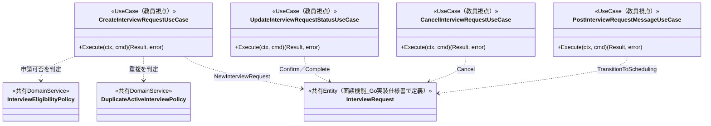
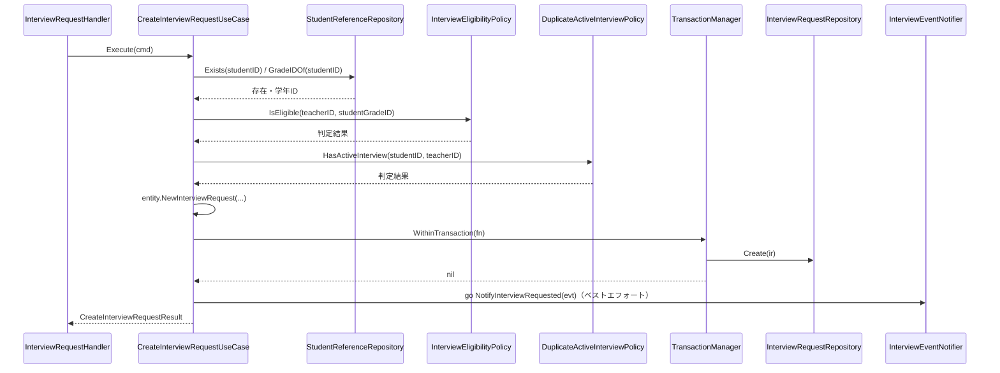
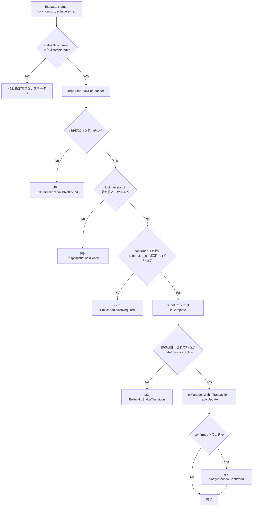

# 教師面談機能 Go実装仕様書

---

# 1. 機能概要

## 機能概要

教師と生徒の間で行われる面談（進路相談・学習相談など）の申請・日程確定・完了・キャンセル、および面談ごとのメッセージのやり取りを管理する機能である。面談は「申請中（requested）→日程調整中（scheduling）→確定（confirmed）→完了（completed）」という状態を進み、いずれの進行中状態からも「キャンセル（cancelled）」へ遷移できる。本書は教師視点の操作（一覧・詳細取得、教師からの新規申請、確定・完了、キャンセル、メッセージ一覧取得・投稿）を対象とする（②「1. 機能概要」）。

**本書の特別な位置づけ**: 本機能（教師面談機能）と面談機能（生徒向け）は、同一のBounded Context（`interview-request`）・同一のAggregate（InterviewRequest）を扱う一体の業務領域である。両②文書は同一のEntity設計・状態遷移ルールを前提とすると明記しており（②「3. Bounded Context」）、実際のGoコードでは同じpackage（`internal/interview/...`）にEntity・Value Object・Repository Interface・Repository実装が1セットのみ存在する。そのDomain層・Infrastructure層（Repository実装）は**面談機能_Go実装仕様書が正の文書として完全に定義済み**であり、本書はそれを再利用する。本書が新規に定義するのは、教員向けのApplication層（UseCase）・Presentation層（Handler/Request/Response/Routing）のみである。

## 採用設計パターンとその理由（②からの要約）

②「4. 設計パターン」により **Domain Model** を採用する。面談機能_Go実装仕様書と同一の判断根拠（状態遷移ルール・楽観ロックによる競合検出・当事者判定という複数の業務ルールがInterviewRequest Entityに関連すること）に基づく（②「4. 設計パターン」判断根拠、面談機能_Go実装仕様書「1. 機能概要」）。Transaction Script／Active Record／Event Sourcingは②「4. 設計パターン」内で不採用と判断されており、本書もその判断を変更しない。

本書は`規約/アーキテクチャ規約.md`「3. 設計パターンごとの構造適用方針」Domain Model節の構造に従う。ただし、Domain層・Infrastructure層は面談機能_Go実装仕様書が既に定義済みであるため、本書はApplication層・Presentation層のみを新規作成する。

## 本書が対象とする実装範囲

- Bounded Context: `interview-request`（面談機能_Go実装仕様書と共通）
- Domain層・Infrastructure層: 対象外（面談機能_Go実装仕様書「3. Domain層設計」「8. Infrastructure層設計」を再利用する。本書では新規作成しない）
- Application層・Presentation層・API仕様: 教員向け7 UseCase（一覧・詳細・新規申請・確定/完了・キャンセル・メッセージ一覧・メッセージ投稿）
- 対象外: 生徒向けUseCase（一覧・詳細・生徒視点の新規申請・取消・メッセージ一覧・メッセージ投稿）のApplication層・Presentation層は面談機能_Go実装仕様書の責務とする
- ①Rails実装の詳細は本タスクでは提供されていないため、参照が必要な箇所は「①未提供のため参照不可」として扱う

---

# 2. ディレクトリ構成

## 対象Bounded Context名

`interview-request`（面談機能_Go実装仕様書と共通。内部ディレクトリ名は同様に`internal/interview`を用いる。面談機能_Go実装仕様書「2. ディレクトリ構成」②からの補足を参照）

## ②で採用した設計パターン

Domain Model（②「4. 設計パターン」）

## 採用パターンに対応する構造

**Domain層・Infrastructure層は本書では新規作成しない。** `internal/interview/domain/` `internal/interview/infrastructure/`配下のEntity・Value Object・Repository Interface・Domain Service・Domain Event・Domain Error・Repository実装は、すべて面談機能_Go実装仕様書「2. ディレクトリ構成」「3. Domain層設計」「8. Infrastructure層設計」で定義済みのものをそのまま利用する。

本書が実際に追加作成するのは、教員向けのApplication層・Presentation層（`internal/interview/application/teacher/` `internal/interview/presentation/teacher/`）のみである。面談機能_Go実装仕様書「2. ディレクトリ構成」の**②からの補足（本書固有の構造判断）**のとおり、同一Aggregateを生徒視点・教員視点の2つのUseCase/Handler群が操作するstruct名の衝突を避けるため、Application層・Presentation層は`student`/`teacher`サブパッケージへ分割されている。本書はそのうち`teacher`サブパッケージを担当する。

## 作成するディレクトリ一覧

```
internal/interview/
├── application/
│   └── teacher/
│       ├── dto/
│       └── usecase/
└── presentation/
    └── teacher/
        ├── handler/
        ├── request/
        ├── response/
        └── routes.go
```

## 作成するファイル一覧

```
internal/interview/application/teacher/dto/list_interview_requests_dto.go
internal/interview/application/teacher/dto/show_interview_request_dto.go
internal/interview/application/teacher/dto/create_interview_request_dto.go
internal/interview/application/teacher/dto/update_interview_request_status_dto.go
internal/interview/application/teacher/dto/cancel_interview_request_dto.go
internal/interview/application/teacher/dto/list_interview_request_messages_dto.go
internal/interview/application/teacher/dto/post_interview_request_message_dto.go
internal/interview/application/teacher/dto/pagination_dto.go

internal/interview/application/teacher/usecase/list_interview_requests_usecase.go
internal/interview/application/teacher/usecase/show_interview_request_usecase.go
internal/interview/application/teacher/usecase/create_interview_request_usecase.go
internal/interview/application/teacher/usecase/update_interview_request_status_usecase.go
internal/interview/application/teacher/usecase/cancel_interview_request_usecase.go
internal/interview/application/teacher/usecase/list_interview_request_messages_usecase.go
internal/interview/application/teacher/usecase/post_interview_request_message_usecase.go
internal/interview/application/teacher/usecase/errors.go
internal/interview/application/teacher/usecase/interview_event_notifier.go

internal/interview/presentation/teacher/handler/interview_request_handler.go
internal/interview/presentation/teacher/handler/interview_request_message_handler.go
internal/interview/presentation/teacher/request/interview_request_request.go
internal/interview/presentation/teacher/response/interview_request_response.go
internal/interview/presentation/teacher/routes.go
```

本書のUseCase群は、面談機能_Go実装仕様書が定義した以下の共有コンポーネントに依存する（新規作成しない）。

- `internal/interview/domain/entity` の`InterviewRequest` / `InterviewRequestMessage`
- `internal/interview/domain/valueobject` の`InterviewRequestStatus` / `ReasonCategory` / `LockVersion`
- `internal/interview/domain/repository` の`InterviewRequestRepository` / `InterviewRequestMessageRepository` / `StudentReferenceRepository` / `TeacherPermissionReferenceRepository`
- `internal/interview/domain/service` の`InterviewRequestStateTransitionPolicy` / `DuplicateActiveInterviewPolicy` / `InterviewEligibilityPolicy`
- `internal/interview/domain/event` の`InterviewRequested` / `InterviewConfirmed` / `InterviewCancelled` / `InterviewRequestMessagePosted`
- `internal/interview/domain/errors` の各Domain Error
- `internal/interview/application` の`TransactionManager`
- `internal/interview/infrastructure/repository` の各Repository実装（`gormrepo`パッケージ）

---

# 3. Domain層設計

**対象外**。Entity・Value Object・Repository Interface・Domain Service・Domain Event・Domain Errorはいずれも面談機能_Go実装仕様書「3. Domain層設計」で定義済みであり、本書では再定義しない。本書のUseCaseが呼び出すDomain層の要素は以下のとおりである（詳細な責務・不変条件は面談機能_Go実装仕様書「3. Domain層設計」を参照）。

|要素|参照先|本書での用途|
|-|-|-|
|`entity.InterviewRequest`|面談機能_Go実装仕様書「3. Domain層設計」Entity|`Confirm(scheduledAt)` / `Complete()` / `Cancel(cancelledByID, reason)` / `TransitionToScheduling()`を教員視点のUseCaseから呼び出す|
|`entity.InterviewRequestMessage`|同上|`NewInterviewRequestMessage`をメッセージ投稿UseCaseから呼び出す|
|`valueobject.InterviewRequestStatus` / `ReasonCategory` / `LockVersion`|面談機能_Go実装仕様書「3. Domain層設計」Value Object|状態絞り込み・lock_version一致確認に利用する|
|`repository.InterviewRequestRepository`|面談機能_Go実装仕様書「3. Domain層設計」Repository Interface|`FindByIDForTeacher` / `FindAllForTeacher` / `Create` / `Update`を利用する（教員スコープのメソッド群）|
|`repository.InterviewRequestMessageRepository`|同上|`FindAllByInterviewRequestID` / `Create`を利用する|
|`repository.StudentReferenceRepository`|同上|新規申請時の対象生徒確認・学年取得に利用する|
|`repository.UserNameReferenceRepository`|同上|一覧・詳細の生徒名・教師名、メッセージの投稿者名の解決に利用する|
|`repository.TeacherPermissionReferenceRepository`|同上|`InterviewEligibilityPolicy`経由で利用する|
|`service.InterviewRequestStateTransitionPolicy`|面談機能_Go実装仕様書「3. Domain層設計」Domain Service|`InterviewRequest`の各遷移メソッド内部から呼び出される（UseCaseから直接は呼び出さない）|
|`service.DuplicateActiveInterviewPolicy`|同上|教員視点の新規申請時に重複確認に利用する|
|`service.InterviewEligibilityPolicy`|同上|教員視点の新規申請時に、対象生徒が閲覧権限範囲内かを確認する|
|`event.InterviewRequested` / `InterviewConfirmed` / `InterviewCancelled` / `InterviewRequestMessagePosted`|面談機能_Go実装仕様書「3. Domain層設計」Domain Event|教員視点の各UseCaseが永続化完了後に発行する（②「18. Domain Event」）|
|`domain/errors`の各Domain Error（`ErrInvalidStatusTransition` / `ErrScheduledAtRequired` / `ErrInterviewNotActive` / `ErrDuplicateActiveInterview` / `ErrStudentOutOfEligibleScope`等）|同上|UseCaseが`errors.Is`で判定し、Application Errorへ変換する|

---

# 4. クラス図

Entity・Value Object・Repository Interface・Domain Serviceのクラス図は面談機能_Go実装仕様書「4. クラス図」を参照する（本書では再掲しない）。本書固有の追加情報として、教員向けUseCaseと共有Domain層の呼び出し関係のみを以下に簡潔に示す。



---

# 5. 状態遷移図

InterviewRequest.statusの状態遷移図は面談機能_Go実装仕様書「5. 状態遷移図」を参照する（両視点の遷移をすべて含む共通の状態遷移図であり、本書では再掲しない）。本書のUseCaseが呼び出す遷移は`Confirm`（`requested`/`scheduling`→`confirmed`）・`Complete`（`confirmed`→`completed`）・`Cancel`（`requested`/`scheduling`/`confirmed`→`cancelled`）・`TransitionToScheduling`（`requested`→`scheduling`、メッセージ投稿契機）の4種類である。

---

# 6. Application層設計

本節は教員向け7 UseCaseのみを記載する。生徒向けUseCaseは面談機能_Go実装仕様書「6. Application層設計」を参照。

## DTO（Command / Query）

`internal/interview/application/teacher/dto/`に配置する。

|struct名|フィールドと型|Command/Query区分|
|-|-|-|
|`ListInterviewRequestsQuery`|`CurrentTeacherID uint`, `Status *string`, `Page dto.PageRequest`|Query|
|`ShowInterviewRequestQuery`|`CurrentTeacherID uint`, `InterviewRequestID uint`|Query|
|`CreateInterviewRequestCommand`|`CurrentTeacherID uint`, `StudentID uint`, `ReasonDetail string`|Command|
|`UpdateInterviewRequestStatusCommand`|`CurrentTeacherID uint`, `InterviewRequestID uint`, `Status string`, `LockVersion int64`, `ScheduledAt *time.Time`|Command|
|`CancelInterviewRequestCommand`|`CurrentTeacherID uint`, `InterviewRequestID uint`, `LockVersion int64`, `Reason string`|Command|
|`ListInterviewRequestMessagesQuery`|`CurrentTeacherID uint`, `InterviewRequestID uint`, `Page dto.PageRequest`|Query|
|`PostInterviewRequestMessageCommand`|`CurrentTeacherID uint`, `InterviewRequestID uint`, `Body string`|Command|
|`PageRequest`|`Page int`, `PerPage int`|Query（一覧系Queryの内包型。面談機能_Go実装仕様書「6. Application層設計」と同一構造）|
|`PageInfo`|`Page int`, `PerPage int`, `TotalCount int`, `TotalPages int`|Query（一覧系Resultの内包型）|
|`InterviewRequestListItem`|`ID uint`, `StudentID uint`, `StudentName string`, `TeacherID uint`, `TeacherName string`, `Status string`, `InitiatorRole string`, `ReasonCategory *string`, `ReasonDetail string`, `ScheduledAt *time.Time`, `CompletedAt *time.Time`, `CancelledAt *time.Time`, `CancelReason string`, `LockVersion int64`, `CreatedAt time.Time`|Query（Result内包型。詳細と同じ項目）|
|`ListInterviewRequestsResult`|`Items []InterviewRequestListItem`, `PageInfo PageInfo`|Query|
|`InterviewRequestDetailResult`|`ID uint`, `StudentID uint`, `StudentName string`, `TeacherID uint`, `TeacherName string`, `Status string`, `InitiatorRole string`, `ReasonCategory *string`, `ReasonDetail string`, `ScheduledAt *time.Time`, `CompletedAt *time.Time`, `CancelledAt *time.Time`, `CancelReason string`, `LockVersion int64`, `CreatedAt time.Time`|Query|
|`CreateInterviewRequestResult`|`ID uint`, `Message string`|Command|
|`UpdateInterviewRequestStatusResult`|`ID uint`, `Status string`, `Message string`|Command|
|`CancelInterviewRequestResult`|`Message string`|Command|
|`InterviewRequestMessageItem`|`ID uint`, `SenderID uint`, `SenderName string`, `Body string`, `CreatedAt time.Time`|Query（Result内包型）|
|`ListInterviewRequestMessagesResult`|`Items []InterviewRequestMessageItem`, `PageInfo PageInfo`|Query|
|`PostInterviewRequestMessageResult`|`ID uint`, `SenderID uint`, `SenderName string`, `Body string`, `CreatedAt time.Time`|Command|

**②からの補足**: フィールド構成は②「12. UseCase設計」の入力・出力記述、②「19. API仕様」の各エンドポイント記述を根拠に具体化した。面談の一覧・詳細（同じ項目）と、メッセージの項目（生徒名・教師名・投稿者名を含む）は、Rails現行の`InterviewRequestSerializer`・`InterviewRequestMessageSerializer`が返す項目、およびRails現行仕様書（教師面談機能）で確認した事実に基づく（推測ではない）。氏名は面談側に持たないため、`UserNameReferenceRepository`で表示時に解決する。

## UseCase

### ListInterviewRequestsUseCase

- struct名: `ListInterviewRequestsUseCase`
- コンストラクタが受け取る依存: `repo repository.InterviewRequestRepository`（面談機能_Go実装仕様書で定義済みのInterfaceをそのまま利用）, `userNameRepo repository.UserNameReferenceRepository`（同）
- 公開メソッドのシグネチャ: `Execute(ctx context.Context, query dto.ListInterviewRequestsQuery) (dto.ListInterviewRequestsResult, error)`
- 処理ステップ:
  1. `query.Status`が指定されていれば`valueobject.NewInterviewRequestStatus`でVOへ変換する
  2. `repo.FindAllForTeacher(ctx, query.CurrentTeacherID, status, query.Page)`を呼び出す（②「11. Repository設計」teacher_idによる絞り込み）
  3. 取得したEntity群の生徒ID・教師IDをまとめて`userNameRepo.FindNamesByIDs`に渡し、氏名を一括で解決する（1件ずつ問い合わせない）
  4. 取得したEntity群と解決した氏名から`dto.ListInterviewRequestsResult`を組み立てて返す
- トランザクション境界: 読み取りのみのためトランザクションは使用しない（②「14. Transaction設計」）
- 発生しうるApplication Error: なし

### ShowInterviewRequestUseCase

- struct名: `ShowInterviewRequestUseCase`
- コンストラクタが受け取る依存: `repo repository.InterviewRequestRepository`, `userNameRepo repository.UserNameReferenceRepository`
- 公開メソッドのシグネチャ: `Execute(ctx context.Context, query dto.ShowInterviewRequestQuery) (dto.InterviewRequestDetailResult, error)`
- 処理ステップ:
  1. `repo.FindByIDForTeacher(ctx, query.InterviewRequestID, query.CurrentTeacherID)`を呼び出す
  2. 取得できなければ`ErrInterviewRequestNotFound`（Application Error）を返す
  3. 生徒ID・教師IDを`userNameRepo.FindNamesByIDs`に渡して氏名を解決する
  4. 取得したEntityと解決した氏名から`dto.InterviewRequestDetailResult`を組み立てて返す
- トランザクション境界: 読み取りのみのためトランザクションは使用しない
- 発生しうるApplication Error: `ErrInterviewRequestNotFound`（対象面談が存在しない、または担当教師でない。②「17. Error設計」）

### CreateInterviewRequestUseCase

- struct名: `CreateInterviewRequestUseCase`
- コンストラクタが受け取る依存: `repo repository.InterviewRequestRepository`, `studentRepo repository.StudentReferenceRepository`, `eligibilityPolicy *service.InterviewEligibilityPolicy`, `dupPolicy *service.DuplicateActiveInterviewPolicy`, `txManager application.TransactionManager`, `notifier InterviewEventNotifier`（本書で定義。後述）
- 公開メソッドのシグネチャ: `Execute(ctx context.Context, cmd dto.CreateInterviewRequestCommand) (dto.CreateInterviewRequestResult, error)`
- 処理ステップ:
  1. `studentRepo.Exists(ctx, cmd.StudentID)`で対象生徒の存在を確認する。存在しなければ`ErrStudentNotFound`（Application Error）を返す
  2. `studentRepo.GradeIDOf(ctx, cmd.StudentID)`で対象生徒の学年を取得する
  3. `eligibilityPolicy.IsEligible(ctx, cmd.CurrentTeacherID, studentGradeID)`で閲覧権限範囲内か確認する。`false`の場合`ErrStudentOutOfEligibleScope`（Domain Error）を返す（②「12. UseCase設計」CreateInterviewRequestUseCase、②「8. Domain Service」InterviewEligibilityPolicy）
  4. `dupPolicy.HasActiveInterview(ctx, cmd.StudentID, cmd.CurrentTeacherID)`で重複を確認する。`true`の場合`ErrDuplicateActiveInterview`（Domain Error）を返す
  5. `entity.NewInterviewRequest(cmd.StudentID, cmd.CurrentTeacherID, cmd.CurrentTeacherID, entity.InitiatorRoleTeacher, nil, cmd.ReasonDetail)`でAggregateを生成する（教員申請のため`reasonCategory`は常に`nil`。面談機能_Go実装仕様書「3. Domain層設計」ReasonCategory独自ルール）
  6. `txManager.WithinTransaction`内で`repo.Create(ctx, ir)`を実行する
  7. トランザクションコミット後、`go func() { notifier.NotifyInterviewRequested(context.Background(), event.InterviewRequested{...}) }()`でベストエフォート通知を行う（規約「13. 非同期ジョブ実行パターン」ベストエフォートで良い処理。②「18. Domain Event」実装方針）
  8. `dto.CreateInterviewRequestResult`を返す
- トランザクション境界: 対象生徒確認・権限範囲確認・重複確認はトランザクション外（読み取りのみ）で行い、InterviewRequestの作成のみを1トランザクションで扱う。通知はトランザクション範囲に含めない（②「14. Transaction設計」理由：通知はベストエフォート処理のため）
- 発生しうるApplication Error: `ErrStudentNotFound`
- 発生しうるDomain Error: `ErrStudentOutOfEligibleScope` / `ErrDuplicateActiveInterview`

### UpdateInterviewRequestStatusUseCase

- struct名: `UpdateInterviewRequestStatusUseCase`
- コンストラクタが受け取る依存: `repo repository.InterviewRequestRepository`, `txManager application.TransactionManager`, `notifier InterviewEventNotifier`
- 公開メソッドのシグネチャ: `Execute(ctx context.Context, cmd dto.UpdateInterviewRequestStatusCommand) (dto.UpdateInterviewRequestStatusResult, error)`
- 処理ステップ:
  1. `repo.FindByIDForTeacher(ctx, cmd.InterviewRequestID, cmd.CurrentTeacherID)`で対象を取得する。取得できなければ`ErrInterviewRequestNotFound`（Application Error）を返す
  2. `ir.LockVersion().Matches(valueobject.NewLockVersion(cmd.LockVersion))`で事前に版数の一致を確認する。不一致の場合は`domainerror.ErrOptimisticLockConflict`を返す
  3. `cmd.Status`が`"confirmed"`の場合: `ir.Confirm(*cmd.ScheduledAt)`を呼び出す（`cmd.ScheduledAt`が`nil`の場合はPresentation層のバリデーションで事前に弾く前提だが、Entity側も`ErrScheduledAtRequired`で二重に検証する。②「6. Entity設計」`confirmed`遷移時は`scheduled_at`の指定を必須とする）
  4. `cmd.Status`が`"completed"`の場合: `ir.Complete()`を呼び出す
  5. 許可されない遷移の場合は`ErrInvalidStatusTransition`（Domain Error）が返る
  6. `txManager.WithinTransaction`内で`repo.Update(ctx, ir)`を実行する
  7. `confirmed`への更新が成功した場合のみ、`go func() { notifier.NotifyInterviewConfirmed(context.Background(), event.InterviewConfirmed{...}) }()`でベストエフォート通知を行う（教師面談機能②「13. シーケンス図・処理フロー図」処理フロー図：confirmedへの更新かどうかで通知要否を分岐）
  8. `dto.UpdateInterviewRequestStatusResult`を返す
- トランザクション境界: 状態確認・版数確認・状態更新を1トランザクションで扱う（②「14. Transaction設計」）。通知はトランザクション範囲に含めない
- 発生しうるApplication Error: `ErrInterviewRequestNotFound`
- 発生しうるDomain Error: `ErrInvalidStatusTransition` / `ErrScheduledAtRequired` / `domainerror.ErrOptimisticLockConflict`

### CancelInterviewRequestUseCase

- struct名: `CancelInterviewRequestUseCase`
- コンストラクタが受け取る依存: `repo repository.InterviewRequestRepository`, `txManager application.TransactionManager`, `notifier InterviewEventNotifier`
- 公開メソッドのシグネチャ: `Execute(ctx context.Context, cmd dto.CancelInterviewRequestCommand) (dto.CancelInterviewRequestResult, error)`
- 処理ステップ:
  1. `repo.FindByIDForTeacher(ctx, cmd.InterviewRequestID, cmd.CurrentTeacherID)`で対象を取得する。取得できなければ`ErrInterviewRequestNotFound`（Application Error）を返す
  2. `ir.LockVersion().Matches(valueobject.NewLockVersion(cmd.LockVersion))`で事前に版数の一致を確認する（②「19. API仕様」DELETE: `lock_version`は必須）。不一致の場合は`domainerror.ErrOptimisticLockConflict`を返す（早期検出。最終的な競合検出は`repo.Update`側の楽観ロック判定（`WHERE lock_version = ?`）で担保する）
  3. `ir.Cancel(cmd.CurrentTeacherID, cmd.Reason)`を呼び出す。進行中でない場合は`ErrInterviewNotActive`（Domain Error）が返る
  4. `txManager.WithinTransaction`内で`repo.Update(ctx, ir)`を実行する
  5. トランザクションコミット後、`go func() { notifier.NotifyInterviewCancelled(context.Background(), event.InterviewCancelled{...}) }()`でベストエフォート通知を行う
  6. `dto.CancelInterviewRequestResult`を返す
- トランザクション境界: 状態確認・状態更新を1トランザクションで扱う（②「14. Transaction設計」）
- 発生しうるApplication Error: `ErrInterviewRequestNotFound`
- 発生しうるDomain Error: `ErrInterviewNotActive` / `domainerror.ErrOptimisticLockConflict`（事前確認、または`repo.Update`側の検出により発生しうる）

### ListInterviewRequestMessagesUseCase

- struct名: `ListInterviewRequestMessagesUseCase`
- コンストラクタが受け取る依存: `interviewRepo repository.InterviewRequestRepository`, `messageRepo repository.InterviewRequestMessageRepository`, `userNameRepo repository.UserNameReferenceRepository`
- 公開メソッドのシグネチャ: `Execute(ctx context.Context, query dto.ListInterviewRequestMessagesQuery) (dto.ListInterviewRequestMessagesResult, error)`
- 処理ステップ:
  1. `interviewRepo.FindByIDForTeacher(ctx, query.InterviewRequestID, query.CurrentTeacherID)`で担当教師確認込みの対象取得を行う。取得できなければ`ErrInterviewRequestNotFound`（Application Error）を返す
  2. `messageRepo.FindAllByInterviewRequestID(ctx, query.InterviewRequestID, query.Page)`でメッセージ一覧を取得する
  3. 投稿者IDをまとめて`userNameRepo.FindNamesByIDs`に渡し、投稿者名を一括で解決する
  4. メッセージと投稿者名から`dto.ListInterviewRequestMessagesResult`を組み立てて返す
- トランザクション境界: 読み取りのみのためトランザクションは使用しない
- 発生しうるApplication Error: `ErrInterviewRequestNotFound`

### PostInterviewRequestMessageUseCase

- struct名: `PostInterviewRequestMessageUseCase`
- コンストラクタが受け取る依存: `interviewRepo repository.InterviewRequestRepository`, `messageRepo repository.InterviewRequestMessageRepository`, `userNameRepo repository.UserNameReferenceRepository`, `txManager application.TransactionManager`, `notifier InterviewEventNotifier`
- 公開メソッドのシグネチャ: `Execute(ctx context.Context, cmd dto.PostInterviewRequestMessageCommand) (dto.PostInterviewRequestMessageResult, error)`
- 処理ステップ:
  1. `interviewRepo.FindByIDForTeacher(ctx, cmd.InterviewRequestID, cmd.CurrentTeacherID)`で担当教師確認込みの対象取得を行う。取得できなければ`ErrInterviewRequestNotFound`（Application Error）を返す
  2. `entity.NewInterviewRequestMessage(cmd.InterviewRequestID, cmd.CurrentTeacherID, cmd.Body)`でメッセージEntityを生成する
  3. `txManager.WithinTransaction`内で以下を行う:
     a. `messageRepo.Create(ctx, msg)`でメッセージを永続化する
     b. `interviewRepo.FindByIDForTeacher(ctx, cmd.InterviewRequestID, cmd.CurrentTeacherID)`で最新の面談を再取得する（トランザクション外で取得した面談が、他の操作により古くなっている可能性があるため。②「12. UseCase設計」PostInterviewRequestMessageUseCase）
     c. 再取得した`ir`に対して`ir.TransitionToScheduling()`を呼び出す。終了状態の場合は`ErrInterviewNotActive`（Domain Error）を返す
     d. 状態が変化した場合のみ`interviewRepo.Update(ctx, ir)`を実行する。`errors.Is(err, domainerror.ErrOptimisticLockConflict)`となった場合（他の操作との競合）は、他の操作で既に状態が進んだものとみなしてエラーを握りつぶし、遷移を行わない。この場合もa.で作成したメッセージは維持し、トランザクションをロールバックしない（面談機能_Go実装仕様書「6. Application層設計」CreateInterviewRequestMessageUseCaseと同じ）
  4. トランザクションコミット後、`go func() { notifier.NotifyInterviewRequestMessagePosted(context.Background(), event.InterviewRequestMessagePosted{...}) }()`でベストエフォート通知を行う
  5. 投稿者（current teacher）の氏名を`userNameRepo.FindNamesByIDs`で解決し（読み取りのみ）、`dto.PostInterviewRequestMessageResult`を返す
- トランザクション境界: 担当教師確認はトランザクション外（読み取りのみ）で行い、メッセージ作成・面談の再取得・状態遷移判定・状態更新を1トランザクションで扱う。状態更新の楽観ロック競合（`ErrOptimisticLockConflict`）は遷移のスキップとして扱い、メッセージ作成は維持してコミットする（②「14. Transaction設計」）
- 発生しうるApplication Error: `ErrInterviewRequestNotFound`
- 発生しうるDomain Error: `ErrInterviewNotActive`

## InterviewEventNotifier（本書固有のApplication層インターフェース）

`internal/interview/application/teacher/usecase/interview_event_notifier.go`に、教員視点の4 UseCaseが利用する通知用インターフェースを定義する（コーディング規約「5. インターフェース」利用側で定義する原則に従う）。

```go
type InterviewEventNotifier interface {
    NotifyInterviewRequested(ctx context.Context, evt event.InterviewRequested) error
    NotifyInterviewConfirmed(ctx context.Context, evt event.InterviewConfirmed) error
    NotifyInterviewCancelled(ctx context.Context, evt event.InterviewCancelled) error
    NotifyInterviewRequestMessagePosted(ctx context.Context, evt event.InterviewRequestMessagePosted) error
}
```

実装は「8. Infrastructure層設計」を参照。②「18. Domain Event」の採用理由（4つの異なる状態変化それぞれに非同期通知が必要）どおり、UseCase内で`event.InterviewRequested`等（面談機能_Go実装仕様書「3. Domain層設計」Domain Eventで定義済み）を組み立て、`InterviewEventNotifier`経由でAnnouncement Context側のお知らせ実体作成処理へ委譲する。

**②からの補足**: `InterviewEventNotifier`という具体的なインターフェース名・メソッドシグネチャは②に明記がなく、②「18. Domain Event」のイベント名・利用目的（Announcement Contextへの通知依頼を同期処理から切り離す）から実装のために補った（推測）。

---

# 7. シーケンス図・処理フロー図

## シーケンス図（CreateInterviewRequestUseCase、教員からの申請）



## 処理フロー図（UpdateInterviewRequestStatusUseCase）



---

# 8. Infrastructure層設計

## Repository実装

**対象外**。`InterviewRequestRepository` / `InterviewRequestMessageRepository` / `StudentReferenceRepository` / `TeacherPermissionReferenceRepository`の実装（`gormrepo`パッケージ）、および`TransactionManager`実装は、すべて面談機能_Go実装仕様書「8. Infrastructure層設計」で定義済みのものをそのまま利用する。本書では新規実装しない。

## 外部連携実装（`InterviewEventNotifier`実装）

- 実装対象: `internal/interview/infrastructure/notification/interview_event_notifier.go`（本書固有の追加ディレクトリ。教師面談機能側のみが利用するため面談機能_Go実装仕様書には含まれない）
- 呼び出し元: `CreateInterviewRequestUseCase` / `UpdateInterviewRequestStatusUseCase` / `CancelInterviewRequestUseCase` / `PostInterviewRequestMessageUseCase`（いずれも教員視点。「6. Application層設計」参照）
- 実装方針: 規約「13. 非同期ジョブ実行パターン（JobQueue）」の「ベストエフォートで良い処理」に分類し、`jobs`テーブルを経由せずUseCaseから直接goroutineを起動する（規約13章の例：`go func() { ctx := context.Background(); ... }()`）。`InterviewEventNotifier`の実装は、Announcement Context（お知らせ機能と共通の仕組み。②「3. Bounded Context」「9. 非同期処理」参照）が公開するお知らせ実体作成処理を呼び出すアダプタとする。アーキテクチャ規約「6. Context間連携ルール」に従い、Announcement Contextの内部Entity・Infrastructure実装には直接依存しない
- 失敗時の扱い: 通知の送達に失敗しても面談自体の状態（申請・確定・キャンセル・メッセージ）は正しく確定しているため、確実な再送（`jobs`テーブルによるリトライ）までは行わない。失敗はログ出力のみとする（②「18. Domain Event」採用理由の推測どおり）

**②からの補足**: 呼び出し先となるAnnouncement Contextの具体的なRepository・関数名は、Announcement Context自身の②/③Go移行・設計仕様書に依存するため、本書では確定できない。①も未提供のため参照不可（推測を含む）。

---

# 9. Presentation層設計

本節は教員向けHandler/Request/Response/Routingのみを記載する。生徒向けは面談機能_Go実装仕様書「9. Presentation層設計」を参照。

## Handler

### InterviewRequestHandler（`internal/interview/presentation/teacher/handler/interview_request_handler.go`）

- struct名: `InterviewRequestHandler`
- 対応する呼び出し先: `ListInterviewRequestsUseCase` / `ShowInterviewRequestUseCase` / `CreateInterviewRequestUseCase` / `UpdateInterviewRequestStatusUseCase` / `CancelInterviewRequestUseCase`
- メソッド一覧:

|メソッド|HTTPメソッド・パス|
|-|-|
|`List`|GET /api/v1/teacher/interview_requests|
|`Show`|GET /api/v1/teacher/interview_requests/:id|
|`Create`|POST /api/v1/teacher/interview_requests|
|`UpdateStatus`|PATCH /api/v1/teacher/interview_requests/:id|
|`Cancel`|DELETE /api/v1/teacher/interview_requests/:id|

- 処理順序（共通パターン）:
  1. 入力バインド（Gin `ShouldBindQuery` / `ShouldBindJSON` / `ShouldBindUri`）
  2. Request DTOのバリデーションタグによる検証
  3. Middlewareで確定済みのcurrent user（teacher）情報をcontextから取得する
  4. 対応するUseCaseのCommand/Queryへ変換して`Execute`を呼び出す
  5. 戻り値のエラーは`c.Error(err)`でgin.Contextへ登録し、共通のエラーハンドリングミドルウェア（Gin規約「8. エラーハンドリングミドルウェア」）に委ねる
  6. 成功時はResult DTOをResponse DTOへ変換してJSONで返す

### InterviewRequestMessageHandler（`internal/interview/presentation/teacher/handler/interview_request_message_handler.go`）

- struct名: `InterviewRequestMessageHandler`
- 対応する呼び出し先: `ListInterviewRequestMessagesUseCase` / `PostInterviewRequestMessageUseCase`
- メソッド一覧:

|メソッド|HTTPメソッド・パス|
|-|-|
|`List`|GET /api/v1/teacher/interview_requests/:interview_request_id/messages|
|`Create`|POST /api/v1/teacher/interview_requests/:interview_request_id/messages|

- 処理順序: `InterviewRequestHandler`と同様の共通パターンに従う

## Request / Response DTO

### Request（`internal/interview/presentation/teacher/request/interview_request_request.go`）

|struct名|フィールドと型|バリデーションタグ／チェック内容|
|-|-|-|
|`ListInterviewRequestsRequest`|`Status string `form:"status"``, `Page int `form:"page"``|`Status`は`binding:"omitempty,oneof=requested scheduling confirmed completed cancelled"`。`Page`は`binding:"omitempty,min=1"`|
|`CreateInterviewRequestRequest`|`StudentID uint `json:"student_id" binding:"required"``, `ReasonDetail string `json:"reason_detail" binding:"required,max=2000"``|`student_id`/`reason_detail`必須、2000文字以内（②「15. Validation設計」バリデーション仕様）|
|`UpdateInterviewRequestStatusRequest`|`Status string `json:"status" binding:"required,oneof=confirmed completed"``, `LockVersion int64 `json:"lock_version" binding:"required"``, `ScheduledAt *time.Time `json:"scheduled_at" binding:"required_if=Status confirmed"``|statusはconfirmed/completedのみ許容、lock_version必須、confirmed指定時はscheduled_at必須（②「15. Validation設計」フォーマットチェック）|
|`CancelInterviewRequestRequest`|`LockVersion int64 `json:"lock_version" binding:"required"``, `Reason string `json:"reason"``|`lock_version`は必須（②「15. Validation設計」lock_version（更新・キャンセル）：Presentation・必須。②「19. API仕様」DELETE）|
|`ListInterviewRequestMessagesRequest`|`Page int `form:"page"``|`Page`は`binding:"omitempty,min=1"`|
|`PostInterviewRequestMessageRequest`|`Body string `json:"body" binding:"required,max=2000"``|`body`必須・2000文字以内|

### Response（`internal/interview/presentation/teacher/response/interview_request_response.go`）

|struct名|フィールドと型|
|-|-|
|`InterviewRequestListItemResponse`|`ID uint`, `StudentID uint`, `StudentName string`, `TeacherID uint`, `TeacherName string`, `Status string`, `InitiatorRole string`, `ReasonCategory *string`, `ReasonDetail string`, `ScheduledAt *time.Time`, `CompletedAt *time.Time`, `CancelledAt *time.Time`, `CancelReason string`, `LockVersion int64`, `CreatedAt time.Time`（詳細と同じ項目）|
|`InterviewRequestListResponse`|`Items []InterviewRequestListItemResponse`, `Page int`, `PerPage int`, `TotalCount int`, `TotalPages int`|
|`InterviewRequestDetailResponse`|`ID uint`, `StudentID uint`, `StudentName string`, `TeacherID uint`, `TeacherName string`, `Status string`, `InitiatorRole string`, `ReasonCategory *string`, `ReasonDetail string`, `ScheduledAt *time.Time`, `CompletedAt *time.Time`, `CancelledAt *time.Time`, `CancelReason string`, `LockVersion int64`, `CreatedAt time.Time`|
|`CreateInterviewRequestResponse`|`Message string`|
|`UpdateInterviewRequestStatusResponse`|`Message string`|
|`CancelInterviewRequestResponse`|`Message string`|
|`InterviewRequestMessageResponse`|`ID uint`, `SenderID uint`, `SenderName string`, `Body string`, `CreatedAt time.Time`|
|`InterviewRequestMessageListResponse`|`Items []InterviewRequestMessageResponse`, `Page int`, `PerPage int`, `TotalCount int`, `TotalPages int`|

EntityであるInterviewRequest／InterviewRequestMessageをそのまま返さず、必ずResponse DTOへ変換する（アーキテクチャ規約「6. データフロー」）。

**②からの補足**: 各Responseの具体的なフィールド構成は、②「19. API仕様」各エンドポイント記述に基づく。面談の一覧・詳細（同じ項目）とメッセージのフィールドは、Rails現行の`InterviewRequestSerializer`（`id` / `status` / `initiator_role` / `reason_category` / `reason_detail` / `scheduled_at` / `completed_at` / `cancelled_at` / `cancel_reason` / `lock_version` / `created_at` / `student_id` / `student_name` / `teacher_id` / `teacher_name`）・`InterviewRequestMessageSerializer`（`id` / `body` / `sender_id` / `sender_name` / `created_at`）と、Rails現行仕様書（教師面談機能）で確認した事実に基づく（推測ではない）。生徒名・教師名・投稿者名は、面談側に複製せず、`UserNameReferenceRepository`（面談機能_Go実装仕様書「3. Domain層設計」で定義済み。User Contextの参照）で表示時に解決して、Response DTOに保持する。

## Routing

`internal/interview/presentation/teacher/routes.go`

|Method|Path|Handler|
|-|-|-|
|GET|/api/v1/teacher/interview_requests|InterviewRequestHandler.List|
|GET|/api/v1/teacher/interview_requests/:id|InterviewRequestHandler.Show|
|POST|/api/v1/teacher/interview_requests|InterviewRequestHandler.Create|
|PATCH|/api/v1/teacher/interview_requests/:id|InterviewRequestHandler.UpdateStatus|
|DELETE|/api/v1/teacher/interview_requests/:id|InterviewRequestHandler.Cancel|
|GET|/api/v1/teacher/interview_requests/:interview_request_id/messages|InterviewRequestMessageHandler.List|
|POST|/api/v1/teacher/interview_requests/:interview_request_id/messages|InterviewRequestMessageHandler.Create|

いずれのルートも認証Middleware（本人確認）・認可Middleware（teacher roleチェック）を経由する（②「16. Authorization設計」Middleware、「13. Authorization実装方針」参照）。

---

# 10. API仕様

②「19. API仕様」に基づき、Rails現行仕様と同一のエンドポイントを維持する（②「19. API仕様」Railsとの差分：変更なし）。

|Method|Path|Handler|Request|Response|Status Code|
|-|-|-|-|-|-|
|GET|/api/v1/teacher/interview_requests|InterviewRequestHandler.List|`ListInterviewRequestsRequest`|`InterviewRequestListResponse`|200|
|GET|/api/v1/teacher/interview_requests/:id|InterviewRequestHandler.Show|パスパラメータ`id`|`InterviewRequestDetailResponse`|200 / 404|
|POST|/api/v1/teacher/interview_requests|InterviewRequestHandler.Create|`CreateInterviewRequestRequest`|`CreateInterviewRequestResponse`|201 / 422|
|PATCH|/api/v1/teacher/interview_requests/:id|InterviewRequestHandler.UpdateStatus|パスパラメータ`id` + `UpdateInterviewRequestStatusRequest`|`UpdateInterviewRequestStatusResponse`|200 / 404 / 409 / 422|
|DELETE|/api/v1/teacher/interview_requests/:id|InterviewRequestHandler.Cancel|パスパラメータ`id` + `CancelInterviewRequestRequest`|`CancelInterviewRequestResponse`|200 / 404 / 409 / 422|
|GET|/api/v1/teacher/interview_requests/:interview_request_id/messages|InterviewRequestMessageHandler.List|パスパラメータ`interview_request_id` + `ListInterviewRequestMessagesRequest`|`InterviewRequestMessageListResponse`|200 / 404|
|POST|/api/v1/teacher/interview_requests/:interview_request_id/messages|InterviewRequestMessageHandler.Create|パスパラメータ`interview_request_id` + `PostInterviewRequestMessageRequest`|`InterviewRequestMessageResponse`|201 / 404 / 422|

上記Status Codeは②「19. API仕様」の各エンドポイント記述をそのまま反映した。

## Errorケース

|条件|Status Code|Error内容|
|-|-|-|
|未認証|401|認証エラー（Middleware）|
|teacher以外のロール|403|認可エラー（Middleware）|
|Request DTOの型・必須・フォーマット不正|422|Presentation Validationエラー|
|対象生徒が閲覧権限範囲外（`ErrStudentOutOfEligibleScope`）|422|業務ルール違反（②「17. Error設計」）|
|同一生徒・教師で進行中の面談が重複（`ErrDuplicateActiveInterview`）|422|業務ルール違反|
|許可されない状態遷移（`ErrInvalidStatusTransition`）|422|業務ルール違反|
|confirmed指定時のscheduled_at未指定（`ErrScheduledAtRequired`）|422|業務ルール違反|
|進行中でない面談のキャンセル（`ErrInterviewNotActive`）|422|業務ルール違反|
|対象面談が存在しない、または担当教師でない（`ErrInterviewRequestNotFound`）|404|②「17. Error設計」|
|lock_versionが最新値と不一致（`domainerror.ErrOptimisticLockConflict`）|409|②「17. Error設計」|
|DB接続失敗等のInfrastructure Error|500|内部エラー|

Error Response方針: 面談機能_Go実装仕様書「10. API仕様」と同一の方針（既存の`errors`形式を踏襲する共通エラーハンドリングミドルウェア）に従う。

---

# 11. Transaction実装方針

②「14. Transaction設計」を、規約「11. Transaction実装パターン（TransactionManager）」に従って実装単位に落とし込む。`TransactionManager`のインターフェース定義・実装は面談機能_Go実装仕様書「8. Infrastructure層設計」で定義済みのものをそのまま利用する（本書では再定義しない）。

## Transaction開始箇所

- 書き込みを伴うUseCase（`CreateInterviewRequestUseCase` / `UpdateInterviewRequestStatusUseCase` / `CancelInterviewRequestUseCase` / `PostInterviewRequestMessageUseCase`）が、対象生徒確認・権限確認・重複確認・担当教師確認等の読み取り処理を終えた後、`TransactionManager.WithinTransaction`を呼び出した時点で開始する
- `ListInterviewRequestsUseCase` / `ShowInterviewRequestUseCase` / `ListInterviewRequestMessagesUseCase`はトランザクションを使用しない（②「14. Transaction設計」）

## Transaction終了箇所

- `CreateInterviewRequestUseCase`: `InterviewRequestRepository.Create`が成功した時点でコミットする
- `UpdateInterviewRequestStatusUseCase` / `CancelInterviewRequestUseCase`: `InterviewRequestRepository.Update`（楽観的排他制御付き）が成功した時点でコミットする
- `PostInterviewRequestMessageUseCase`: `InterviewRequestMessageRepository.Create`・（状態変化時のみ）`InterviewRequestRepository.Update`が成功した時点でコミットする。ただし`InterviewRequestRepository.Update`が`ErrOptimisticLockConflict`を返した場合は、遷移をスキップしたものとして扱い、メッセージ作成は維持したままコミットする（ロールバックしない。他のエラーの場合はロールバックする）

## 複数Repository（またはStore・関数）にまたがる場合の扱い

本Context内でAnnouncement Context以外に書き込みを行うRepositoryは存在しない。`InterviewEventNotifier`による通知は、②「14. Transaction設計」の理由（1回の業務操作に対して状態・楽観ロック・メッセージの整合性を保つことがトランザクションの目的であり、通知はベストエフォート処理であるためトランザクション範囲には含めない）に従い、トランザクションコミット後に非同期（goroutine）で実行する。

---

# 12. Validation実装方針

②「15. Validation設計」を実装レベルに落とし込む。

## Presentation

|フィールド|struct名|バリデーションタグ|エラーメッセージ方針|
|-|-|-|-|
|student_id|CreateInterviewRequestRequest|`binding:"required"`|「生徒を指定してください」相当|
|reason_detail|CreateInterviewRequestRequest|`binding:"required,max=2000"`|「申請理由を入力してください」相当|
|status|UpdateInterviewRequestStatusRequest|`binding:"required,oneof=confirmed completed"`|「指定できないステータスです」|
|lock_version|UpdateInterviewRequestStatusRequest / CancelInterviewRequestRequest|`binding:"required"`|「lock_versionは必須です」|
|scheduled_at|UpdateInterviewRequestStatusRequest|`binding:"required_if=Status confirmed"`|「指定できない操作です」|
|body|PostInterviewRequestMessageRequest|`binding:"required,max=2000"`|「本文を入力してください」相当|

## 業務ルール検証

Domain Model採用のため、以下は共有Domain層（面談機能_Go実装仕様書で定義済み）で検証する。

- `service.InterviewEligibilityPolicy.IsEligible`: 申請先の生徒が教師の閲覧権限範囲内であること
- `service.DuplicateActiveInterviewPolicy.HasActiveInterview`: 同一生徒・教師の組み合わせで進行中の面談が重複していないこと
- `entity.InterviewRequest.Confirm`: confirmed指定時のscheduled_at必須チェック
- `service.InterviewRequestStateTransitionPolicy.CanTransition`（`InterviewRequest`の各遷移メソッド内部から呼び出し）: 状態遷移が許可された組み合わせかどうか
- `valueobject.LockVersion.Matches`: 更新系操作全般のlock_version整合性チェック（早期検出。最終判定はRepository側）

②「15. Validation設計」の責務分離方針（Presentationは形式、Domainは業務的妥当性）をそのまま踏襲する。

---

# 13. Authorization実装方針

②「16. Authorization設計」を実装レベルに落とし込む。

## Middleware

- 認証済みユーザーを特定し、`teacher`ロールであることを確認する（②「16. Authorization設計」Middleware）

## Handler

- ルーティングとHTTP入出力の変換のみを担当し、業務権限判定は持たせない（②「16. Authorization設計」Handler）

## UseCase

- 一覧・詳細・更新・キャンセル・メッセージの閲覧/投稿は、いずれも自身が担当教師（`teacher_id`）である面談のみを対象とする。`InterviewRequestRepository.FindByIDForTeacher`/`FindAllForTeacher`にcurrent userのIDを渡すことで、常に教師スコープでの検索に限定する（②「16. Authorization設計」UseCase）
- 新規申請時、申請先の生徒が閲覧権限範囲内（`InterviewEligibilityPolicy`の判定）かどうかを確認する
- 対象面談が権限範囲外である場合は、存在しない場合と同様に扱う（404）

## Domain

- `entity.InterviewRequest`（共有Entity）が、許可されない状態遷移を拒否する
- `InterviewRequestMessage`投稿時の当事者判定は、`InterviewRequestRepository.FindByIDForTeacher`による教師スコープ検索で担保する（面談機能_Go実装仕様書「3. Domain層設計」の設計判断と同様、Repository側のスコープ付き検索で当事者確認を兼ねる構成）

## 判断理由

「担当教師の面談のみを対象とする」というスコープ制御はUseCase側（Repositoryのスコープ付き検索）で一貫して適用し、状態遷移という具体的な業務ルールはDomain側に配置することで、認可のスコープ判定と業務ルール判定を分離する。確定・完了への変更は教師のみが行える操作であり、本Contextの教師向けUseCase群にのみ実装する（生徒向けの確定・完了操作は面談機能_Go実装仕様書側にも実装されない。②「16. Authorization設計」判断理由）。

---

# 14. Error実装方針

②「17. Error設計」を、規約「12. Error変換パターン（AppError）」に従って実装レベルに落とし込む。

## Domain Error → Application Errorへの変換方針

UseCaseは、共有Domain層（面談機能_Go実装仕様書で定義済み）から返されたエラーを`errors.Is`で判別し、`AppError`を実装した型へ変換して返す（規約「12. Error変換パターン（AppError）」Domain Model採用時の変換）。

## Application Error → HTTPレスポンスへの変換方針（Status Code対応表）

|業務シナリオ|Error変数名／型|発生層|HTTP Status|
|-|-|-|-|
|対象生徒が閲覧権限範囲外|`ErrStudentOutOfEligibleScope`|Domain|422|
|同一生徒・教師で進行中の面談が重複|`ErrDuplicateActiveInterview`|Domain|422|
|許可されない状態遷移|`ErrInvalidStatusTransition`|Domain|422|
|confirmed指定時のscheduled_at未指定|`ErrScheduledAtRequired`|Domain|422|
|進行中でない面談のキャンセル・メッセージ投稿|`ErrInterviewNotActive`|Domain|422|
|対象生徒が存在しない|`ErrStudentNotFound`|Application|422（**②からの補足**。②に個別のStatus Code記載はなく、参照先不存在として面談機能_Go実装仕様書のErrReferenceNotFound相当の分類に倣い422とした。推測）|
|対象面談が存在しない、または担当教師でない|`ErrInterviewRequestNotFound`|Application|404|
|lock_versionが最新値と不一致|`domainerror.ErrOptimisticLockConflict`|Infrastructure（検出）→Application（変換）|409|
|Request DTOバインド／バリデーションエラー|（Ginの`binding`エラー）|Presentation|422|
|未認証|（Middleware）|Presentation|401|
|ロール不一致|（Middleware）|Presentation|403|
|上記以外（DB接続失敗等）|-|Infrastructure|500|

## Infrastructure Errorのハンドリング方針

GORMが返すDB接続エラー等は、Repository実装内（面談機能_Go実装仕様書で定義済み）で`fmt.Errorf("...: %w", err)`によりラップして返される。本書のUseCaseはこれをそのまま呼び出し元へ伝播させ、Domain Error/Application Errorのいずれにも該当しない場合はすべて500として扱う（共通のエラーハンドリングミドルウェアに委ねる）。`InterviewEventNotifier`の失敗はUseCaseの戻り値には含めず、ログ出力のみとする（「8. Infrastructure層設計」失敗時の扱い）。

---

# 15. GORM / DBクエリ設計

**対象外（大部分）**。GORMモデル定義（`InterviewRequestModel` / `InterviewRequestMessageModel`）・テーブル対応・楽観ロック（`lock_version`）の実装方針は、面談機能_Go実装仕様書「15. GORM / DBクエリ設計」で定義済みのものをそのまま利用する。本書では新規のGORMモデルを作成しない。

本書のUseCaseが発行するクエリ（面談機能_Go実装仕様書「8. Infrastructure層設計」で定義済みのRepository実装メソッドを、教師スコープで呼び出すもの）は以下のとおりである。

|Repository|メソッド|対象テーブル|条件|
|-|-|-|-|
|InterviewRequestRepository|FindByIDForTeacher|interview_requests|id, teacher_id|
|InterviewRequestRepository|FindAllForTeacher|interview_requests|teacher_id必須、status任意|
|InterviewRequestRepository|Create|interview_requests|-|
|InterviewRequestRepository|Update|interview_requests|主キー・lock_version条件|
|InterviewRequestMessageRepository|FindAllByInterviewRequestID|interview_request_messages|interview_request_id|
|InterviewRequestMessageRepository|Create|interview_request_messages|-|
|StudentReferenceRepository|Exists / GradeIDOf|（User Context所有テーブル）|student_id|
|TeacherPermissionReferenceRepository|IsOwnGradeScope / OwnGradeID|（Teacher Permission Context所有テーブル）|teacher_id|

②「20. DB設計方針」・面談機能②「20. DB設計方針」いずれも既存Schemaに対する変更提案はなく、本書でも変更は行わない。

---

# 16. テストケース設計

②「22. テスト戦略」を、Domain Model採用時の区分（5区分をそのまま使用）で具体化する。Domain層・Repository層のテストケースは、Entity/Repository自体が面談機能_Go実装仕様書で定義済みのため、同書「16. テストケース設計」のDomain Test / Repository Testを参照する（本書では教員視点の呼び出しに関するUseCase Test / Handler Test / Integration Testのみを記載する）。

## Domain Test

面談機能_Go実装仕様書「16. テストケース設計」Domain Testを参照（`InterviewRequestStateTransitionPolicy`・`DuplicateActiveInterviewPolicy`は生徒視点・教員視点で共有される）。本書固有のDomain Testは以下のとおり。

|対象|テストケース|
|-|-|
|`InterviewRequest.Confirm`|`requested`/`scheduling`から`scheduled_at`指定ありで`confirmed`へ遷移すること／`scheduled_at`未指定で`ErrScheduledAtRequired`となること／`confirmed`/`completed`/`cancelled`から呼び出すと`ErrInvalidStatusTransition`となること|
|`InterviewRequest.Complete`|`confirmed`から`completed`へ遷移し`CompletedAt`が設定されること／`confirmed`以外から呼び出すと`ErrInvalidStatusTransition`となること|
|`InterviewEligibilityPolicy.IsEligible`|`own_grade`権限の教師が自学年の生徒を指定した場合にtrue、自学年以外を指定した場合にfalseを返すこと|

## UseCase Test

|対象|テストケース|
|-|-|
|`ListInterviewRequestsUseCase`|teacher_idスコープでのみ取得されること／生徒名・教師名が一括で解決されて返ること|
|`ShowInterviewRequestUseCase`|担当教師でない場合に`ErrInterviewRequestNotFound`となること／生徒名・教師名が解決されて返ること|
|`CreateInterviewRequestUseCase`|閲覧権限範囲外の生徒指定で`ErrStudentOutOfEligibleScope`となること／重複申請時に`ErrDuplicateActiveInterview`となること／正常系でnotifierが呼び出されること|
|`UpdateInterviewRequestStatusUseCase`|confirmed指定時にscheduled_at未指定で`ErrScheduledAtRequired`となること／lock_version不一致で`ErrOptimisticLockConflict`となること／許可されない遷移で`ErrInvalidStatusTransition`となること|
|`CancelInterviewRequestUseCase`|進行中でない面談で`ErrInterviewNotActive`となること／lock_version不一致で`ErrOptimisticLockConflict`となること|
|`ListInterviewRequestMessagesUseCase`|担当教師以外のアクセスで`ErrInterviewRequestNotFound`となること／投稿者名が解決されて返ること|
|`PostInterviewRequestMessageUseCase`|requested状態への投稿でschedulingへ遷移すること／状態更新が`ErrOptimisticLockConflict`となった場合にエラーにならず、メッセージ作成が維持されること（状態はschedulingへ遷移しないこと）／作成したメッセージの投稿者名が返ること|

## Repository Test

面談機能_Go実装仕様書「16. テストケース設計」Repository Testを参照（`FindAllForTeacher`のteacher_idスコープ・ページネーションのテストケースを含む）。

## Handler Test

|対象|テストケース|
|-|-|
|`InterviewRequestHandler.Create`|student_id/reason_detail欠落時に422が返ること|
|`InterviewRequestHandler.UpdateStatus`|不正なstatus値でバインドエラー（422）になること／lock_version不一致で409が返ること|
|`InterviewRequestHandler.Cancel`|正常系で200が返ること／lock_version未指定で422が返ること／lock_version不一致で409が返ること（②「19. API仕様」DELETE：lock_versionは必須）|
|全Handler|未認証・非teacher roleでのアクセスが401/403となること|

## Integration Test

|対象|テストケース|
|-|-|
|教員による申請〜確定〜完了|一連のエンドポイント呼び出しが正常に完了し、状態遷移（requested→confirmed→completed）が一貫して反映されること|
|生徒視点との整合性|生徒が投稿したメッセージが教員視点の一覧にも反映され、状態遷移（requested→scheduling）が両視点で一貫すること（面談機能_Go実装仕様書との統合確認）|
|他教師による更新試行|担当教師でないユーザーからのPATCH/DELETEが404で拒否されること|

---

# 17. ②からの補足事項

②に明記がなく、実装のために追加で判断した内容を以下に記載する。

|判断した内容|判断理由|推測か否か|
|-|-|-|
|Application層・Presentation層を`teacher`サブパッケージとして、面談機能_Go実装仕様書の`student`サブパッケージと分離した|面談機能_Go実装仕様書「2. ディレクトリ構成」の②からの補足のとおり、同一Aggregateを2つのUseCase/Handler群が操作する構成でstruct名の衝突を避けるため。両書で一貫した構造とする必要があるため、本書でも踏襲した|補足（面談機能_Go実装仕様書の構造判断を踏襲したものであり、②の設計方針自体は変更していない）|
|`InterviewEventNotifier`という具体的なインターフェース名・メソッドシグネチャの新設|②「18. Domain Event」はイベント名・発火タイミング・利用目的のみを明記し、実際にAnnouncement Contextへ通知を委譲するためのGoのインターフェース設計までは記載していないため、コーディング規約「5. インターフェース」に従い実装のために補った|推測|
|`CreateInterviewRequestUseCase`（教員視点）に`ErrStudentNotFound`という対象生徒不存在のApplication Errorを追加した|②「17. Error設計」のエラー仕様表には「対象生徒が存在しない」という個別シナリオの記載がないが、`StudentReferenceRepository.Exists`による存在確認自体は②「11. Repository設計」外部参照Repositoryの責務として明記されているため、確認結果がfalseの場合のエラーハンドリングを③側で補った|推測|
|`UpdateInterviewRequestStatusUseCase`の`confirmed`更新成功時のみ通知を送る（`completed`更新時は通知しない）とした|教師面談機能②「13. シーケンス図・処理フロー図」処理フロー図が「confirmedへの更新か」で通知要否を分岐させる形で明示しているため、そのまま反映した|補足（②の記載をそのまま反映したもの）|
|Response DTOに生徒名・教師名・投稿者名を保持し、`UserNameReferenceRepository`（面談機能_Go実装仕様書で定義）を通じてUser Contextから表示時に解決する構成とした|Rails現行の`InterviewRequestSerializer`が`student_name` / `teacher_name`を、`InterviewRequestMessageSerializer`が`sender_name`を返すことを確認した。②「19. API仕様」は「生徒名・教師名等を含む」「投稿者名」と記載するが、氏名の解決方法（本Context内での非正規化保持か、参照先Context呼び出しによる解決か）を明記していない。本Contextは生徒・教師の氏名データを所有しない（User Contextが真正な情報源。②「3. Bounded Context」の依存）ため、氏名は面談側に複製せず参照によって解決する。`ユーザー基盤機能_Go移行・設計仕様書.md`の集約表は「メッセージ送信者名の表示」のみを挙げているが、生徒名・教師名の表示にも同じ参照手段を用いる|推測（返却項目に氏名を含める点はRails現行のSerializerで確認済み。解決方法は推測）|

