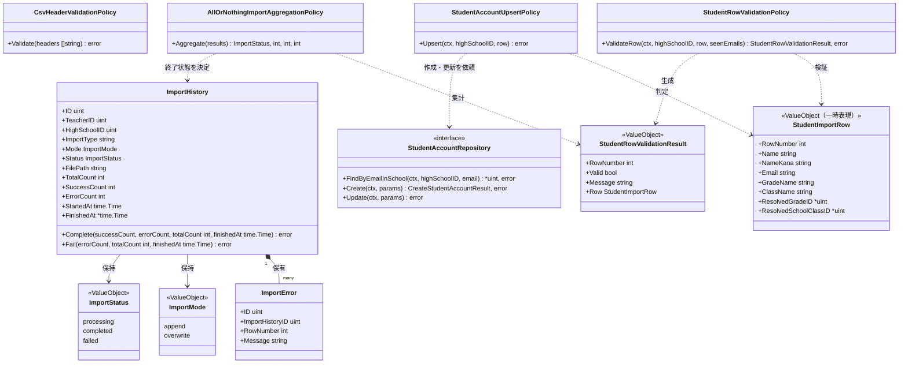
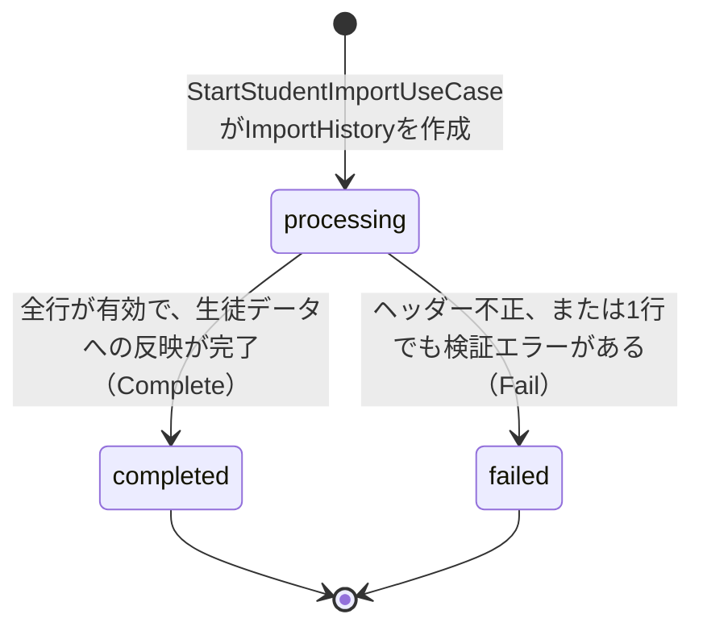
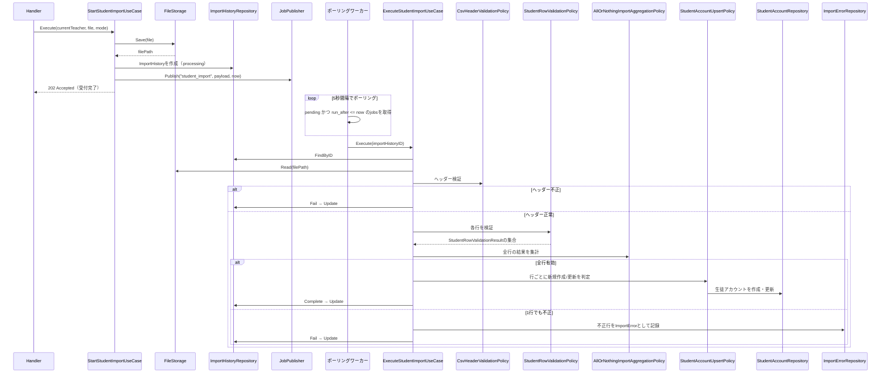
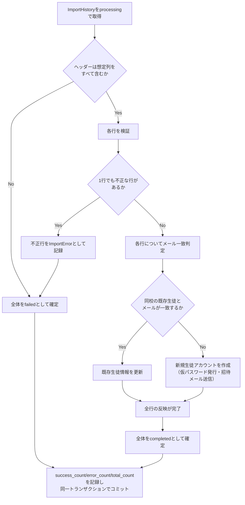

# 生徒CSVインポート機能 Go実装仕様書

---

# 1. 機能概要

## 機能概要

教師がCSVファイルを使って、同校の生徒アカウントをまとめて登録・更新できる機能である。実際のインポート前に内容を検証する事前検証（dry run、同期・DB書き込みなし）と、インポート履歴（ImportHistory）を作成した上で非同期にCSVを処理するインポート実行（202 Accepted）の2操作を提供する。行単位のエラーはImportErrorとして記録される。「1行でも不正な行があれば全体を失敗とし、有効な行についても一切反映しない」という全件成功・全件失敗（all-or-nothing）の業務ルールを持つ。新規作成された生徒アカウントには仮パスワード発行と招待メール送信が行われ、この生徒アカウント作成処理は教師生徒参照機能（`student-directory` Context）の生徒単体新規登録からも共有利用される（②「3. Bounded Context」）。

## 採用設計パターンとその理由（②からの要約）

②「4. 設計パターン」により、本機能は **Domain Model** を採用する。

- ImportHistoryは「processing→completed/failed」という進行状態を持ち、管理者問題インポート機能とは異なり「一部失敗」という中間的な終了状態を持たない全件成功・全件失敗の集計ルールを伴う
- 行ごとに「メールアドレスが同校の既存生徒と一致すれば更新、一致しなければ新規作成」という業務的な判定ロジックが発生する
- 事前検証（dry run）はインポート実行時と同一の検証ロジックを再利用しつつDB書き込みを行わない、検証ロジックと実行ロジックの分離を要求する
- 将来的に他リソースのCSVインポートが増えることを想定すると、進行状態管理ロジックを汎用的なドメイン概念として独立させておく方が拡張しやすい

Transaction Script・Active Record・Event Sourcingは②「4. 設計パターン」「24. 採用しなかった設計」のとおり不採用である。本書はこの判断を変更しない。

## 本書が対象とする実装範囲

- Bounded Context: `student-import`
- 対象UseCase: `DryRunStudentImportUseCase` / `StartStudentImportUseCase` / `ExecuteStudentImportUseCase`
- 本Contextが教師生徒参照機能（`student-directory` Context）へ提供する共通の生徒アカウント作成処理（`StudentAccountRepository`）を含む
- 規約「3. 設計パターンごとの構造適用方針」のDomain Model構造で実装する。非同期実行はアーキテクチャ規約「13. 非同期ジョブ実行パターン（JobQueue）」の「確実に実行したい処理」（`jobs`テーブル＋ポーリングワーカー）で実装する
- ①Rails実装の詳細は本タスクでは提供されておらず、参照が必要な箇所は「①未提供のため参照不可」と明記する

---

# 2. ディレクトリ構成

## 対象Bounded Context名

- Context名（②）: `student-import`
- ディレクトリ名: `internal/student_import`（②からの補足：アーキテクチャ規約「8. 命名規約」に従いkebab-caseをスネークケースへ変換した。推測）

## ②で採用した設計パターン

Domain Model

## 作成するディレクトリ一覧

```
internal/student_import/
├── domain/
│   ├── entity/
│   ├── valueobject/
│   ├── repository/
│   ├── service/
│   ├── event/
│   └── errors/
├── application/
│   ├── dto/
│   └── usecase/
├── infrastructure/
│   ├── persistence/
│   │   └── gorm/
│   ├── repository/
│   ├── storage/
│   └── queue/
└── presentation/
    ├── handler/
    ├── request/
    ├── response/
    └── routes.go
```

- `infrastructure/mail/`・`infrastructure/cache/`: 対象外（招待メール送信は`StudentAccountRepository`実装内部の責務として扱うが、独立したMailパッケージとしては切り出さず、Infrastructure層のRepository実装内に閉じる。②に他の外部連携要件の記載がないため）
- `infrastructure/storage/`: 追加（CSVファイル本体の保存先。②「20. DB設計方針」のSchema変更に伴う実装対象。詳細は8章参照）

## 作成するファイル一覧

```
internal/student_import/domain/entity/import_history.go
internal/student_import/domain/entity/import_error.go

internal/student_import/domain/valueobject/import_mode.go
internal/student_import/domain/valueobject/import_status.go
internal/student_import/domain/valueobject/student_import_row.go
internal/student_import/domain/valueobject/student_row_validation_result.go

internal/student_import/domain/repository/import_history_repository.go
internal/student_import/domain/repository/import_error_repository.go
internal/student_import/domain/repository/grade_class_resolution_repository.go
internal/student_import/domain/repository/student_account_repository.go

internal/student_import/domain/service/csv_header_validation_policy.go
internal/student_import/domain/service/student_row_validation_policy.go
internal/student_import/domain/service/all_or_nothing_import_aggregation_policy.go
internal/student_import/domain/service/student_account_upsert_policy.go

internal/student_import/domain/event/events.go

internal/student_import/domain/errors/errors.go

internal/student_import/application/dto/dry_run_dto.go
internal/student_import/application/dto/start_import_dto.go
internal/student_import/application/dto/execute_import_dto.go

internal/student_import/application/usecase/transaction_manager.go
internal/student_import/application/usecase/job_publisher.go
internal/student_import/application/usecase/file_storage.go
internal/student_import/application/usecase/dry_run_student_import_usecase.go
internal/student_import/application/usecase/start_student_import_usecase.go
internal/student_import/application/usecase/execute_student_import_usecase.go
internal/student_import/application/usecase/errors.go

internal/student_import/infrastructure/persistence/gorm/import_history_model.go
internal/student_import/infrastructure/persistence/gorm/import_error_model.go

internal/student_import/infrastructure/repository/import_history_repository.go
internal/student_import/infrastructure/repository/import_error_repository.go
internal/student_import/infrastructure/repository/grade_class_resolution_repository.go
internal/student_import/infrastructure/repository/student_account_repository.go
internal/student_import/infrastructure/repository/transaction_manager.go

internal/student_import/infrastructure/storage/csv_file_storage.go

internal/student_import/infrastructure/queue/job_publisher.go
internal/student_import/infrastructure/queue/worker_handler.go

internal/student_import/presentation/handler/student_import_handler.go
internal/student_import/presentation/request/student_import_request.go
internal/student_import/presentation/response/student_import_response.go
internal/student_import/presentation/routes.go
```

**②からの補足**: `GradeClassResolutionRepository`はSchool/Grade Context提供・参照専用（②「11. Repository設計」）であり、当該Contextの②/③文書は本タスクでは提供されていないため、実装の正確な参照先は「推測」である。`StudentAccountRepository`は本Context自身が提供し、教師生徒参照機能（`student-directory` Context）からも利用される（②「3. Bounded Context」「11. Repository設計」）。教師生徒参照機能_Go実装仕様書が定義する`StudentAccountCreator`インターフェースとの接続方法は「9. Presentation層設計」直後の「Context間連携」節を参照。

---

# 3. Domain層設計

## Entity

### ImportHistory（`domain/entity/import_history.go`、Aggregate Root）

- struct名: `ImportHistory`
- フィールド:

|フィールド|型|意味|
|-|-|-|
|`ID`|`uint`|インポート履歴ID|
|`TeacherID`|`uint`|実行した教師のユーザーID（`user_id`）|
|`HighSchoolID`|`uint`|実行した教師の所属校ID（対象・作成対象のスコープ。②「16. Authorization設計」）|
|`ImportType`|`string`|固定値`"student"`（`import_histories`テーブルを管理者問題インポート機能と共有するため。②20章）|
|`Mode`|`valueobject.ImportMode`|append/overwrite|
|`Status`|`valueobject.ImportStatus`|processing/completed/failed|
|`FilePath`|`string`|CSVファイルの保存先を表す情報（②20章のSchema変更対象。詳細は8章・15章参照）|
|`TotalCount`|`int`|総行数|
|`SuccessCount`|`int`|成功行数|
|`ErrorCount`|`int`|失敗行数|
|`StartedAt`|`time.Time`|開始日時|
|`FinishedAt`|`*time.Time`|終了日時（processing中は`nil`）|

- 公開メソッド一覧:

|メソッド|引数|戻り値|責務|
|-|-|-|-|
|`NewImportHistory`|`(teacherID uint, highSchoolID uint, mode valueobject.ImportMode, filePath string, startedAt time.Time) (*ImportHistory, error)`|`(*ImportHistory, error)`|`processing`状態のImportHistoryを生成するファクトリ|
|`Complete`|`(successCount, errorCount, totalCount int, finishedAt time.Time) error`|`error`|全行が有効であった場合に`completed`へ遷移させる。`processing`以外からの遷移は`ErrInvalidStatusTransition`を返す|
|`Fail`|`(errorCount, totalCount int, finishedAt time.Time) error`|`error`|1行でも不正な行があった場合、またはヘッダーが不正であった場合に`failed`へ遷移させる。`processing`以外からの遷移は`ErrInvalidStatusTransition`を返す|
|`IsProcessing`|`()`|`bool`|`processing`状態かどうかを判定する|

- 不変条件（ファクトリで保証する内容）: 生成直後の`Status`は常に`processing`。`SuccessCount`/`ErrorCount`/`TotalCount`はいずれも0

### ImportError（`domain/entity/import_error.go`）

- struct名: `ImportError`
- フィールド: `ID uint` / `ImportHistoryID uint` / `RowNumber int` / `Message string`
- 公開メソッド一覧: `NewImportError(importHistoryID uint, rowNumber int, message string) (*ImportError, error)`
- 不変条件: `RowNumber`は1以上であること

## Value Object

### StudentImportRow（`domain/valueobject/student_import_row.go`、一時表現）

- struct名: `StudentImportRow`
- フィールド: `RowNumber int` / `Name string` / `NameKana string` / `Email string` / `GradeName string` / `ClassName string` / `ResolvedGradeID *uint` / `ResolvedSchoolClassID *uint`
- 生成時に検証するルール: なし（CSVパース結果をそのまま保持する。妥当性検証は`StudentRowValidationPolicy`が担う）
- 公開メソッド一覧: `NewStudentImportRow(rowNumber int, name, nameKana, email, gradeName, className string) StudentImportRow`

### ImportMode（`domain/valueobject/import_mode.go`）

- struct名: `ImportMode`（`append` / `overwrite`の2値を持つenum型）
- 生成時に検証するルール: `append`/`overwrite`以外の値は`append`として正規化する（②7章）
- 公開メソッド一覧: `NewImportMode(raw string) ImportMode`（不正値でもエラーを返さずappendへ正規化する。②7章「独自ルール」） / `(m ImportMode) String() string`

### ImportStatus（`domain/valueobject/import_status.go`）

- struct名: `ImportStatus`（`processing` / `completed` / `failed`の3値を持つenum型）
- 生成時に検証するルール: 3値のいずれかであること
- 公開メソッド一覧: `(s ImportStatus) CanTransitionTo(target ImportStatus) bool`（`processing`からのみ遷移可能） / `(s ImportStatus) String() string`

### StudentRowValidationResult（`domain/valueobject/student_row_validation_result.go`）

- struct名: `StudentRowValidationResult`
- フィールド: `RowNumber int` / `Valid bool` / `Message string`（失敗時のみ設定） / `Row StudentImportRow`（成功時、解決済みの学年・クラスIDを含む行データ）
- 生成時に検証するルール: なし（`StudentRowValidationPolicy`の出力として生成される）
- 公開メソッド一覧: なし（データ保持のみ）

## Value Objectを採用しないもの

- ファイル名・ファイルサイズ等: 単純な属性値であり、独自の業務ルールを持たないため（②7章）

## Repository Interface

### ImportHistoryRepository（`domain/repository/import_history_repository.go`）

|メソッド|引数|戻り値|責務|
|-|-|-|-|
|`Create`|`(ctx context.Context, h *entity.ImportHistory)`|`error`|ImportHistoryを新規作成する|
|`Update`|`(ctx context.Context, h *entity.ImportHistory)`|`error`|状態・カウントを更新する|
|`FindByID`|`(ctx context.Context, id uint)`|`(*entity.ImportHistory, error)`|IDによる取得。存在しない場合は`nil, nil`を返す|

### ImportErrorRepository（`domain/repository/import_error_repository.go`）

|メソッド|引数|戻り値|責務|
|-|-|-|-|
|`CreateBatch`|`(ctx context.Context, errs []*entity.ImportError)`|`error`|行単位エラーを一括作成する|
|`FindByImportHistoryID`|`(ctx context.Context, importHistoryID uint)`|`([]*entity.ImportError, error)`|ImportHistory IDによるエラー一覧取得|

### GradeClassResolutionRepository（`domain/repository/grade_class_resolution_repository.go`、School/Grade Context提供・参照専用）

|メソッド|引数|戻り値|責務|
|-|-|-|-|
|`ResolveGrade`|`(ctx context.Context, highSchoolID uint, gradeName string)`|`(*uint, error)`|学年名から`grade_id`を解決する。存在しない場合は`nil, nil`|
|`ResolveClass`|`(ctx context.Context, gradeID uint, className string)`|`(*uint, error)`|指定学年に属する学級名から`school_class_id`を解決する。存在しない場合は`nil, nil`|

### StudentAccountRepository（`domain/repository/student_account_repository.go`、本Context提供・student-directoryからも利用）

|メソッド|引数|戻り値|責務|
|-|-|-|-|
|`FindByEmailInSchool`|`(ctx context.Context, highSchoolID uint, email string)`|`(*uint, error)`|同校内でのメールアドレス一致確認。一致する生徒IDまたは`nil`を返す|
|`Create`|`(ctx context.Context, params CreateStudentAccountParams)`|`(CreateStudentAccountResult, error)`|新規生徒アカウントを作成する（仮パスワード発行・生徒番号採番・招待メール送信を伴う。②「11. Repository設計」）|
|`Update`|`(ctx context.Context, params UpdateStudentAccountParams)`|`error`|既存生徒アカウントを更新する（氏名・氏名カナ・メールアドレス・学年・学級の上書き、招待メールは再送しない）|

`CreateStudentAccountParams`のフィールド: `Name string` / `NameKana string` / `Email string` / `HighSchoolID uint` / `GradeID uint` / `SchoolClassID uint`
`CreateStudentAccountResult`のフィールド: `StudentID uint` / `Name string` / `Email string`
`UpdateStudentAccountParams`のフィールド: `StudentID uint` / `Name string` / `NameKana string` / `Email string` / `GradeID uint` / `SchoolClassID uint`

- 保持しない責務: CSV解析、行単位の検証（`StudentRowValidationPolicy`の責務）（②11章）

## Domain Service

### CsvHeaderValidationPolicy（`domain/service/csv_header_validation_policy.go`）

- struct名: `CsvHeaderValidationPolicy`（状態を持たない）
- 公開メソッド: `(p *CsvHeaderValidationPolicy) Validate(headers []string) error`
- 責務: CSVのヘッダーが氏名・氏名カナ・メール・学年・学級の5列を含んでいるかを判定する。不足がある場合は`domainerrors.ErrInvalidCsvHeader`を返す（②8章）

### StudentRowValidationPolicy（`domain/service/student_row_validation_policy.go`）

- struct名: `StudentRowValidationPolicy`
- コンストラクタ: `NewStudentRowValidationPolicy(gradeClassRepo repository.GradeClassResolutionRepository, accountRepo repository.StudentAccountRepository) *StudentRowValidationPolicy`
- 公開メソッド: `(p *StudentRowValidationPolicy) ValidateRow(ctx context.Context, highSchoolID uint, row valueobject.StudentImportRow, seenEmails map[string]struct{}) (valueobject.StudentRowValidationResult, error)`
- 責務: 氏名・氏名カナ・メールアドレスの形式、学年名・学級名の自校内存在確認（`GradeClassResolutionRepository`経由）、メールアドレスの他校/他ロールでの使用有無（`StudentAccountRepository`経由）、CSV内でのメールアドレス重複の有無（呼び出し元が管理する`seenEmails`との突合）を判定し、`StudentRowValidationResult`を返す（②8章）

### AllOrNothingImportAggregationPolicy（`domain/service/all_or_nothing_import_aggregation_policy.go`）

- struct名: `AllOrNothingImportAggregationPolicy`（状態を持たない）
- 公開メソッド: `(p *AllOrNothingImportAggregationPolicy) Aggregate(results []valueobject.StudentRowValidationResult) (status valueobject.ImportStatus, successCount int, errorCount int, totalCount int)`
- 責務: 全行の検証結果から、1件でも失敗があれば全体を`failed`、全行が有効であれば`completed`とする（②8章。管理者問題インポート機能の「一部失敗」許容ルールとは判定基準が異なる点に注意）

### StudentAccountUpsertPolicy（`domain/service/student_account_upsert_policy.go`）

- struct名: `StudentAccountUpsertPolicy`
- コンストラクタ: `NewStudentAccountUpsertPolicy(accountRepo repository.StudentAccountRepository) *StudentAccountUpsertPolicy`
- 公開メソッド: `(p *StudentAccountUpsertPolicy) Upsert(ctx context.Context, highSchoolID uint, row valueobject.StudentImportRow) error`
- 責務: `StudentAccountRepository.FindByEmailInSchool`で同校の既存生徒と一致するかを確認し、一致すれば`Update`、一致しなければ`Create`を呼び出す（②8章。教師生徒参照機能の生徒単体新規登録は本Policyの「新規作成」経路のみを利用する）

## Domain Event

②「18. Domain Event」により採用する。

### StudentImportRequested（`domain/event/events.go`）

- イベントstruct名: `StudentImportRequested`
- 保持するフィールド: `ImportHistoryID uint` / `HighSchoolID uint` / `TeacherID uint` / `OccurredAt time.Time`
- 発火元: `StartStudentImportUseCase`（ImportHistoryがprocessing状態で作成された直後）

## Domain Error（`domain/errors/errors.go`）

|変数名|発生条件|
|-|-|
|`ErrInvalidCsvHeader`|CSVヘッダーが想定される5列を満たさない|
|`ErrInvalidStatusTransition`|`processing`以外の状態からの`Complete`/`Fail`呼び出し|

---

# 4. クラス図



---

# 5. 状態遷移図



禁止される遷移: `processing`以外からの遷移はすべて`ErrInvalidStatusTransition`を返す。管理者問題インポート機能に存在する「一部失敗」に相当する状態は本機能には存在しない。

---

# 6. Application層設計

## DTO（Command / Query）

|struct名|フィールドと型|区分|
|-|-|-|
|`DryRunStudentImportCommand`|`CurrentTeacherHighSchoolID uint`, `File io.Reader`|Command|
|`DryRunRowResult`|`RowNumber int`, `Severity string`, `Message string`, `Data map[string]string`|出力|
|`DryRunStudentImportResult`|`TotalCount int`, `ValidCount int`, `Rows []DryRunRowResult`（最大100件、②19章）|出力|
|`StartStudentImportCommand`|`CurrentTeacherID uint`, `CurrentTeacherHighSchoolID uint`, `File io.Reader`, `FileName string`, `RawMode string`|Command|
|`StartStudentImportResult`|`ImportHistoryID uint`|出力|
|`ExecuteStudentImportCommand`|`ImportHistoryID uint`|Command|
|`ExecuteStudentImportResult`|`ImportHistoryID uint`, `Status string`, `SuccessCount int`, `ErrorCount int`, `TotalCount int`|出力|

## UseCase

### DryRunStudentImportUseCase（`application/usecase/dry_run_student_import_usecase.go`）

- struct名: `DryRunStudentImportUseCase`
- コンストラクタが受け取る依存: `*service.CsvHeaderValidationPolicy`, `*service.StudentRowValidationPolicy`
- 公開メソッド: `(u *DryRunStudentImportUseCase) Execute(ctx context.Context, cmd dto.DryRunStudentImportCommand) (dto.DryRunStudentImportResult, error)`
- 処理ステップ:
  1. `cmd.File`をCSVとしてパースし、ヘッダー行と各データ行を取得する
  2. `CsvHeaderValidationPolicy.Validate`でヘッダーを検証する。不正な場合は`ErrInvalidCsvHeader`を返す（②19章：dry runの場合422）
  3. 各行を`valueobject.NewStudentImportRow`で`StudentImportRow`へ変換する
  4. 各行について`StudentRowValidationPolicy.ValidateRow`を呼び出す（`seenEmails`で行を跨いだメール重複を検出する）
  5. 検証結果から`TotalCount`・`ValidCount`を集計し、無効な行を`Rows`（最大100件）へ格納する
  6. `DryRunStudentImportResult`を返す
- トランザクション境界: 使用しない（DB書き込みを一切行わない。②14章）
- 発生しうるApplication Error: `ErrInvalidCsvHeader`

### StartStudentImportUseCase（`application/usecase/start_student_import_usecase.go`）

- struct名: `StartStudentImportUseCase`
- コンストラクタが受け取る依存: `ImportHistoryRepository`, `TransactionManager`, `JobPublisher`, `FileStorage`
- 公開メソッド: `(u *StartStudentImportUseCase) Execute(ctx context.Context, cmd dto.StartStudentImportCommand) (dto.StartStudentImportResult, error)`
- 処理ステップ:
  1. `valueobject.NewImportMode(cmd.RawMode)`でモードを正規化する
  2. `FileStorage.Save(ctx, cmd.File, cmd.FileName)`でファイルを保存し、`FilePath`を取得する
  3. `entity.NewImportHistory(cmd.CurrentTeacherID, cmd.CurrentTeacherHighSchoolID, mode, filePath, now)`で`processing`状態のEntityを生成する
  4. `TransactionManager.WithinTransaction`内で、`ImportHistoryRepository.Create`と`JobPublisher.Publish(ctx, "student_import", payload{ImportHistoryID}, now)`を実行する（アーキテクチャ規約13章のTransactional Outboxパターン。業務データ保存とジョブ登録の不整合を防ぐ）
  5. `dto.StartStudentImportResult`に変換して返す
- トランザクション境界: ImportHistoryの作成とジョブ登録を1トランザクションとする（②14章）
- 発生しうるApplication Error: `ErrFileStorageFailed`（ファイル保存失敗。Infrastructure Errorとして扱う場合との違いは14章参照）

### ExecuteStudentImportUseCase（`application/usecase/execute_student_import_usecase.go`）

- struct名: `ExecuteStudentImportUseCase`
- コンストラクタが受け取る依存: `ImportHistoryRepository`, `ImportErrorRepository`, `*service.CsvHeaderValidationPolicy`, `*service.StudentRowValidationPolicy`, `*service.AllOrNothingImportAggregationPolicy`, `*service.StudentAccountUpsertPolicy`, `TransactionManager`, `FileStorage`
- 公開メソッド: `(u *ExecuteStudentImportUseCase) Execute(ctx context.Context, cmd dto.ExecuteStudentImportCommand) (dto.ExecuteStudentImportResult, error)`
- 処理ステップ（`TransactionManager.WithinTransaction`内で3〜8を実行する。②14章：ヘッダー検証・全行検証・生徒データへの反映・ImportHistoryの終了状態更新までを1トランザクションとする）:
  1. `ImportHistoryRepository.FindByID`でImportHistoryを取得する。取得できない場合は`ErrImportHistoryNotFound`を返す
  2. `FileStorage.Read(ctx, importHistory.FilePath)`でCSVを再読み込みし、ヘッダー・全行を取得する
  3. `CsvHeaderValidationPolicy.Validate`でヘッダーを検証する
  4. ヘッダーが不正な場合、`importHistory.Fail(0, 0, now)`を呼び出し、手順8へ進む
  5. ヘッダーが正常な場合、各行について`StudentRowValidationPolicy.ValidateRow`を呼び出し、`StudentRowValidationResult`の集合を得る
  6. `AllOrNothingImportAggregationPolicy.Aggregate`で終了状態とカウントを決定する
  7. 全行有効（`completed`）の場合、各行について`StudentAccountUpsertPolicy.Upsert`を呼び出し生徒データへ反映したうえで`importHistory.Complete(...)`を呼び出す。1行でも不正（`failed`）の場合、不正行を`entity.NewImportError`で生成し`ImportErrorRepository.CreateBatch`で一括保存したうえで`importHistory.Fail(...)`を呼び出す
  8. `ImportHistoryRepository.Update`で最終状態を永続化する
  9. `dto.ExecuteStudentImportResult`に変換して返す
- トランザクション境界: UseCase全体を1トランザクションとする。管理者問題インポート機能が行/バッチ単位に分割するのとは異なり、本機能は全件成功・全件失敗の業務要件そのものがUseCase全体を1トランザクションとすることと合致するため分割しない（②14章）
- 発生しうるApplication Error: `ErrImportHistoryNotFound`
- 発生しうるDomain Error: `ErrInvalidCsvHeader`, `ErrInvalidStatusTransition`

---

# 7. シーケンス図・処理フロー図

## シーケンス図

### StartStudentImportUseCase → ExecuteStudentImportUseCase



## 処理フロー図

### ExecuteStudentImportUseCase



---

# 8. Infrastructure層設計

## Repository実装

### ImportHistoryRepository実装（`infrastructure/repository/import_history_repository.go`）

- 実装struct名: 非公開struct + コンストラクタ`NewImportHistoryRepository`
- 対応するGORMモデル: `gormmodel.ImportHistoryModel`（テーブル`import_histories`、管理者問題インポート機能と共有）
- 各メソッドで発行するクエリ内容:
  - `Create`: `import_histories`へ1件INSERT（`import_type = 'student'`固定）
  - `Update`: id指定で`status`・`success_count`・`error_count`・`total_count`・`finished_at`を更新するUPDATE
  - `FindByID`: `id`一致条件によるSELECT（1件）
- Entity ⇔ GORMモデルの変換方針: 非公開の変換関数（`toEntity`/`fromEntity`）で行う。`Mode`/`Status`（Value Object）⇔文字列カラムの相互変換もこの関数内で行う

### ImportErrorRepository実装（`infrastructure/repository/import_error_repository.go`）

- 実装struct名: 非公開struct + コンストラクタ`NewImportErrorRepository`
- 対応するGORMモデル: `gormmodel.ImportErrorModel`（テーブル`import_errors`、管理者問題インポート機能と共有）
- 各メソッドで発行するクエリ内容:
  - `CreateBatch`: `import_errors`への複数件一括INSERT
  - `FindByImportHistoryID`: `import_history_id`一致条件によるSELECT（複数件、`row_number`昇順。推測）

### GradeClassResolutionRepository実装（`infrastructure/repository/grade_class_resolution_repository.go`）

- 実装struct名: 非公開struct + コンストラクタ`NewGradeClassResolutionRepository`
- 対応するGORMモデル: School/Grade Context側の既存`grades`/`school_classes`テーブルを参照専用で読み取る（本Contextでは新規に所有モデルとして定義しない）
- クエリ内容:
  - `ResolveGrade`: `high_school_id = ? AND (学年名に相当するカラム) = ?`によるSELECT（1件）
  - `ResolveClass`: `grade_id = ? AND name = ?`によるSELECT（1件）

### StudentAccountRepository実装（`infrastructure/repository/student_account_repository.go`）

- 実装struct名: 非公開struct + コンストラクタ`NewStudentAccountRepository`
- 対応するGORMモデル: User Context所有の既存`users`テーブルを参照・更新する（本Contextでは新規に所有モデルとして定義しない）
- 各メソッドで発行するクエリ内容:
  - `FindByEmailInSchool`: `high_school_id = ? AND email = ? AND role = 生徒ロール`によるSELECT（1件）
  - `Create`: `users`へ1件INSERT。仮パスワードの生成（`crypto/rand`、コーディング規約「23. crypto/rand」）・生徒番号の採番・招待メール送信を行う
  - `Update`: `id = ?`条件で氏名・氏名カナ・メールアドレス・学年・学級を更新する（招待メールは再送しない）

## 外部連携実装

|実装対象|呼び出し元|実装方針|
|-|-|-|
|`FileStorage`実装（`infrastructure/storage/csv_file_storage.go`）|`StartStudentImportUseCase.Save`, `ExecuteStudentImportUseCase.Read`|CSVファイル本体をディスクまたはオブジェクトストレージへ保存し、`import_histories.file_path`（②20章のSchema変更対象、15章参照）にキー情報を記録する。具体的な保存先（ローカルディスク／S3等）は②に選定基準の記載がなく、管理者問題インポート機能と共通の変更であるため両機能で同一の実装方針を採る（推測）|
|招待メール送信|`StudentAccountRepository.Create`|独立したMailパッケージとしては切り出さず、`StudentAccountRepository`実装内部から呼び出す（②に該当する外部連携要件以上の記載がないため、最小構成とした）|
|`JobPublisher`実装（`infrastructure/queue/job_publisher.go`）、非同期ワーカー（`infrastructure/queue/worker_handler.go`）|`StartStudentImportUseCase`、`main.go`起動時のワーカー登録|アーキテクチャ規約「13. 非同期ジョブ実行パターン（JobQueue）」の「確実に実行したい処理」として実装する。`jobs`テーブル＋ポーリングワーカーの標準実装を用いる。`jobType = "student_import"`のハンドラを`main.go`のワーカー起動時に登録し、`ExecuteStudentImportUseCase.Execute`を呼び出す|

---

# 9. Presentation層設計

## Handler

### StudentImportHandler（`presentation/handler/student_import_handler.go`）

- struct名: `StudentImportHandler`
- 対応する呼び出し先: `*usecase.DryRunStudentImportUseCase`, `*usecase.StartStudentImportUseCase`
- メソッド一覧:

|メソッド|HTTPメソッド|パス|
|-|-|-|
|`DryRun`|POST|`/api/v1/teacher/import_students/dry_run`|
|`Start`|POST|`/api/v1/teacher/import_students`|

- `DryRun`処理順序: current teacher情報取得 → `request.DryRunStudentImportRequest`へのマルチパートフォームバインド（ファイル必須・CSV形式・5MB以内。②15章「フォーマットチェック」）→ `DryRunStudentImportUseCase.Execute`呼び出し → `response.DryRunStudentImportResponse`へ変換し200を返す。ヘッダー不正時は422（`ErrInvalidCsvHeader`）
- `Start`処理順序: current teacher情報取得 → `request.StartStudentImportRequest`へのバインド（ファイル必須・CSV形式・5MB以内、mode任意）→ `StartStudentImportUseCase.Execute`呼び出し → `response.MessageResponse`へ変換し202を返す。ファイル不正時は422（この場合ImportHistoryは作成されない。②19章）

## Context間連携（StudentAccountCreator、student-directoryへの提供）

- 生徒CSVインポート機能側の`StudentAccountRepository`実装は、教師生徒参照機能_Go実装仕様書が定義する`application.StudentAccountCreator`インターフェース（`CreateStudentAccount(ctx, cmd CreateStudentAccountCommand) (CreateStudentAccountResult, error)`）を、そのままの型では満たさない（Command/Result型がパッケージごとに独立して定義されているため、Goの構造的部分型は同一メソッドシグネチャの型一致を要求する）。
- そのため、DI配線層（アーキテクチャ規約「14. 依存関係の組み立て（DI配線）」の各Contextの組み立て関数、または両Contextを横断する結線を行う箇所）に、`student_import.StudentAccountRepository.Create`を`student_directory.application.StudentAccountCreator`へ変換する薄いアダプタ（`Create`メソッド1つのみを持つラッパー struct）を用意し、フィールド単位で`CreateStudentAccountParams`⇔`CreateStudentAccountCommand`を変換する
- 実装配置場所（アダプタをどちらのContextに置くか、または独立したwiringパッケージに置くか）は②のいずれの文書にも明記がないため「推測」であり、実装時に確定する

---

# 10. API仕様

|Method|Path|Handler|Request|Response|Status Code|
|-|-|-|-|-|-|
|POST|/api/v1/teacher/import_students|StudentImportHandler.Start|file（CSV必須）, mode（任意）|MessageResponse|202 / 422|
|POST|/api/v1/teacher/import_students/dry_run|StudentImportHandler.DryRun|file（CSV必須）|DryRunStudentImportResponse|200 / 422|

## Errorケース

|条件|Status Code|Error内容|
|-|-|-|
|ファイルが存在しない、CSV形式でない、5MB超過（create/dry_run共通）|422|Presentation Validationエラー|
|CSVヘッダーが不正（dry_run）|422|`ErrInvalidCsvHeader`|
|CSVヘッダーが不正（create、非同期判明）|202受付後、履歴がfailedに更新される|-（同期応答はエラーとしない）|
|行内容が不正（dry_run）|200（rowsに含めて返却）|-|
|行内容が不正（create、非同期判明）|202受付後、履歴がfailedに更新される|-|
|未認証|401|-|
|教師以外のアクセス|403|-|

---

# 11. Transaction実装方針

## Transaction開始箇所

アーキテクチャ規約「11. Transaction実装パターン（TransactionManager）」に従い`TransactionManager`（`application/usecase/transaction_manager.go`）を定義する。

- `DryRunStudentImportUseCase`: 使用しない
- `StartStudentImportUseCase`: UseCase開始時（ファイル保存後、ImportHistory生成後）に開始する
- `ExecuteStudentImportUseCase`: UseCase開始時（ImportHistory取得直後）に開始する

## Transaction終了箇所

- `StartStudentImportUseCase`: `ImportHistoryRepository.Create`と`JobPublisher.Publish`（Transactional Outbox、同一トランザクション内でジョブレコードをINSERT）が完了した時点でコミットする
- `ExecuteStudentImportUseCase`: ヘッダー検証・全行検証・（全行有効な場合の）生徒データへの反映・ImportHistoryの終了状態更新までを1つのトランザクションとしてコミットする

## 複数Repositoryにまたがる場合の扱い

`ExecuteStudentImportUseCase`は基本方針どおりUseCase単位でのトランザクション管理とし、管理者問題インポート機能のような行/バッチ単位への分割は行わない。「1行でも不正な行があれば、有効な行についても生徒データへの反映を一切行わない」という全件成功・全件失敗の業務要件そのものが、UseCase全体を1つのトランザクションとすることと合致するためである（②14章）。

---

# 12. Validation実装方針

## Presentation

|フィールド|struct名|バリデーションタグ|エラーメッセージ|
|-|-|-|-|
|`file`|`StartStudentImportRequest` / `DryRunStudentImportRequest`|必須・CSV形式（`text/csv`、拡張子`.csv`）・5MB以内（Ginのマルチパートフォームバインド＋カスタムバリデーション）|`errors`（ファイル不正）|
|`mode`|`StartStudentImportRequest`|任意。append/overwrite以外は後続でappendへ正規化（形式エラーとしない）|なし|

## 業務ルール検証

- `CsvHeaderValidationPolicy.Validate`: CSVヘッダーの構造的妥当性
- `StudentRowValidationPolicy.ValidateRow`: 行内容の業務的妥当性（氏名・氏名カナ・メール形式、学年・学級の自校内存在確認、メールアドレスの他校/他ロール未使用・CSV内重複なし）
- `AllOrNothingImportAggregationPolicy.Aggregate`: 全行の検証結果に基づく終了状態の決定
- `StudentAccountUpsertPolicy.Upsert`: 新規作成/更新の判定

---

# 13. Authorization実装方針

## Middleware

- 認証済みユーザーを特定し、`teacher`ロールであることを確認する

## Handler

- APIエントリポイントで認証失敗時のレスポンスを整える。業務権限の判定は持たせない（本機能は「他職員操作権限」のような追加の業務権限を要求しない。②16章）

## UseCase

- `current teacher`の所属高校を起点に、インポート対象・作成対象の生徒アカウントを常に実行した教師の所属高校に限定する（`StartStudentImportCommand.CurrentTeacherHighSchoolID`・`ImportHistory.HighSchoolID`として保持し、`ExecuteStudentImportUseCase`はこの値をスコープとして各Policy・Repositoryへ渡す）
- リクエストで所属校を明示的に指定するパラメータが送られても無視する（②16章、Rails現行仕様どおり）

## Domain

- `StudentRowValidationPolicy`が、学年・学級の自校内存在確認を行う

---

# 14. Error実装方針

## Domain Error → Application Errorへの変換方針

`ExecuteStudentImportUseCase`は、`domain/errors`のセンチネルエラーを`errors.Is`で判定し、Application Error相当（`AppError`実装型）へ変換する。ヘッダー不正（`ErrInvalidCsvHeader`）は非同期実行中に判明するため、HTTPレスポンスへ直接変換せず、`ImportHistory.Fail`を経由してImportHistoryの状態へ反映する。

## Application Error → HTTPレスポンスへの変換方針

アーキテクチャ規約「12. Error変換パターン（AppError）」に従い、Gin規約「8. エラーハンドリングミドルウェア」の集中エラーハンドリングミドルウェアで変換する。

|業務シナリオ|Error変数名／型|発生層|HTTP Status|
|-|-|-|-|
|ファイルが存在しない、CSV形式でない、5MB超過|Presentation Validationエラー|Presentation|422|
|CSVヘッダーが不正（dry_run）|`ErrInvalidCsvHeader`|Domain|422|
|CSVヘッダーが不正・行内容が不正（create、非同期判明）|`ErrInvalidCsvHeader`等|Domain|202受付後、ImportHistoryがfailedに更新される（HTTPステータスへの直接変換は発生しない）|
|`ImportHistory`が見つからない（ワーカー内部）|`ErrImportHistoryNotFound`|Application|該当なし（ワーカー内部エラーとしてログ出力）|
|未認証|-|Middleware|401|
|教師以外のアクセス|-|Middleware|403|

## Infrastructure Errorのハンドリング方針

ファイルストレージへの保存失敗、非同期ジョブのディスパッチ失敗、DB接続失敗はInfrastructure Errorとして扱い、`fmt.Errorf`でラップして上位層へ伝播させる。`StartStudentImportUseCase`実行中のファイル保存失敗は同期応答として422（または500、原因に応じて）へ変換する。ワーカー内で発生したInfrastructure Errorは、コーディング規約「21. 並行プログラミング」の`recover`方針に従い、当該ジョブの失敗としてログ記録し、アーキテクチャ規約13章のリトライ機構（`attempts`インクリメント）に委ねる。

---

# 15. GORM / DBクエリ設計

## 利用するGORMモデルとテーブルの対応

②「20. DB設計方針」により、既存Rails DBを継続利用しつつ、ファイル参照方法のみSchema変更を行う（管理者問題インポート機能と共通の変更）。

### ImportHistoryModel（`infrastructure/persistence/gorm/import_history_model.go`）

- 対応テーブル: `import_histories`（管理者問題インポート機能と共有）

|フィールド|対応カラム|備考|
|-|-|-|
|`ID`|`id`|主キー|
|`UserID`|`user_id`|実行した教師のID|
|`ImportType`|`import_type`|`'student'`固定（管理者問題インポート機能は`'question'`）|
|`Mode`|`mode`|文字列として保存|
|`Status`|`status`|文字列として保存|
|`FilePath`|`file_path`（新規カラム）|②20章のSchema変更対象。ファイルの保存パス、またはオブジェクトストレージ上のキーに相当する情報（推測。具体的なカラム名・型は本書で`file_path string`と仮定するが確定しない）|
|`TotalCount`|`total_count`||
|`SuccessCount`|`success_count`||
|`ErrorCount`|`error_count`||
|`StartedAt`|`started_at`||
|`FinishedAt`|`finished_at`|NULL許容|

### ImportErrorModel（`infrastructure/persistence/gorm/import_error_model.go`）

- 対応テーブル: `import_errors`（管理者問題インポート機能と共有）

|フィールド|対応カラム|備考|
|-|-|-|
|`ID`|`id`|主キー|
|`ImportHistoryID`|`import_history_id`||
|`RowNumber`|`row_number`||
|`Message`|`message`||

## 主要クエリの条件・ソート・ページネーション方針

|Repository|メソッド|対象テーブル|条件|結合|
|-|-|-|-|-|
|`ImportHistoryRepository`|`Create`/`Update`/`FindByID`|`import_histories`|`id`一致、または`import_type = 'student'`での絞り込み|不要|
|`ImportErrorRepository`|`CreateBatch`/`FindByImportHistoryID`|`import_errors`|`import_history_id`一致|不要|
|`GradeClassResolutionRepository`|`ResolveGrade`/`ResolveClass`|`grades`, `school_classes`|`high_school_id`一致、名称一致、`grade_id`一致|`grades`と`school_classes`の結合（学級が指定学年に属することの確認）|
|`StudentAccountRepository`|`FindByEmailInSchool`/`Create`/`Update`|`users`|`high_school_id`一致、`email`一致、生徒ロール|不要|

SQL文そのものは記載しない。

## 既存Schemaに対する変更

②「20. DB設計方針」で提案されているとおり、`import_histories`テーブルにファイルの保存先を直接表すカラム（`file_path`、推測）を追加する。この変更は管理者問題インポート機能と共有するテーブルへの変更であり、両機能で整合させる必要がある。既存のRails側ActiveStorageデータからのマイグレーション（移行スクリプト）が必要になる。

---

# 16. テストケース設計

②「22. テスト戦略」を、Domain Model採用時の区分のまま、具体的なテストケース単位に落とし込む。

## Domain Test

|対象|テストケース|
|-|-|
|`valueobject.NewImportMode`|`append`/`overwrite`はそのまま採用される／それ以外の値は`append`へ正規化される|
|`entity.ImportHistory.Complete`/`Fail`|`processing`からの遷移が成功する／`processing`以外からの遷移で`ErrInvalidStatusTransition`を返す|
|`CsvHeaderValidationPolicy.Validate`|想定5列すべてを含む場合に成功する／いずれか欠けている場合に`ErrInvalidCsvHeader`を返す|
|`StudentRowValidationPolicy.ValidateRow`|氏名・氏名カナ・メール形式が不正な場合に失敗する／学年・学級が自校に存在しない場合に失敗する／メールアドレスが他校・他ロールで使用済みの場合に失敗する／CSV内でメールアドレスが重複する場合に失敗する／すべて妥当な場合に成功する|
|`AllOrNothingImportAggregationPolicy.Aggregate`|全行有効な場合に`completed`となる／1行でも無効な場合に`failed`となる|
|`StudentAccountUpsertPolicy.Upsert`|メールアドレスが同校の既存生徒と一致する場合に更新が呼ばれる／一致しない場合に新規作成が呼ばれる|

## UseCase Test

|対象|テストケース|
|-|-|
|`DryRunStudentImportUseCase`|DB書き込みを行わずに検証結果（total_count/valid_count/rows）を算出できること／ヘッダー不正時に`ErrInvalidCsvHeader`を返すこと|
|`StartStudentImportUseCase`|ImportHistoryがprocessing状態で作成され、ジョブが同一トランザクションで登録されること|
|`ExecuteStudentImportUseCase`|全行有効な場合に生徒データへ反映されcompletedとなること（新規作成・更新の両パターン）／1行でも不正な場合に生徒データへ一切反映されずfailedとなること（②の重点検証項目）／ヘッダー不正時に即failedとなること|

## Repository Test

|対象|テストケース|
|-|-|
|`ImportHistoryRepository`/`ImportErrorRepository`|永続化・検索の正確性|
|`GradeClassResolutionRepository`|学年名・学級名からの名称解決の正確性（存在しない場合に`nil`を返すこと）|
|`StudentAccountRepository`|作成（仮パスワード発行・招待メール送信を含む）・更新（招待メール再送なし）・メール一致確認の正確性|

## Handler Test

|対象|テストケース|
|-|-|
|`StudentImportHandler.DryRun`|正常なCSVで200とdry run結果が返ること／ファイル不正で422が返ること|
|`StudentImportHandler.Start`|正常なCSVで202が返ること／ファイル不正で422が返ること（ImportHistoryが作成されないこと）|

## Integration Test

|対象|テストケース|
|-|-|
|dry run|検証結果算出が一貫して動作すること|
|アップロード受付〜非同期処理完了|エンドポイント経由でのアップロード受付から、ワーカーによる非同期処理完了後のImportHistory状態・ImportError記録・生徒アカウント反映までを一貫して確認すること（②の重点検証項目：全件成功・全件失敗）|
|student-directoryとの連携|教師生徒参照機能の生徒単体新規登録が、本Contextの`StudentAccountRepository.Create`を正しく呼び出すこと|

---

# 17. ②からの補足事項

|判断した内容|判断理由|推測かどうか|
|-|-|-|
|ディレクトリ名を`internal/student_import`とした|②のContext名`student-import`とディレクトリ名の対応関係が②に明記がない|推測|
|`GradeClassResolutionRepository`・`StudentAccountRepository`実装が参照する他ContextのGORMモデルを本Contextで新規定義せず、既存テーブルを直接参照する構成とした|School/Grade Context・User Context自体の②文書がアーキテクチャ規約「15. 今後の課題」のとおり未整備であるため|推測|
|`ImportHistory`に`HighSchoolID`フィールドを追加した|②の`entity.ImportHistory`クラス図には`highSchoolId`相当のフィールド記載がないが、②「16. Authorization設計」の「インポート対象・作成対象の生徒アカウントは、常に実行した教師の所属高校に限定される」という業務要件を実装するために必要と判断した|推測（②の業務ルール自体は変更していない）|
|`StudentAccountCreator`（教師生徒参照機能側）と`StudentAccountRepository`（本Context）の型不一致をDI配線層の薄いアダプタで解決する構成とした|②はいずれの文書も「本Contextが提供、student-directoryからも利用される」とのみ記載し、Goの型システム上の接続方法までは規定していない|推測|
|`import_histories.file_path`カラムの型・名称を`string`と仮定した|②「20. DB設計方針」は「ファイルの保存パス、またはオブジェクトストレージ上のキーに相当する情報」とのみ記載し、具体的なカラム名・型を確定していない（②自身が「Go実装仕様書で検討する」としている）|推測|
|CSVファイルの保存先（ローカルディスク／オブジェクトストレージ）を確定しなかった|②に選定基準の記載がなく、管理者問題インポート機能と共通の変更であるため、両機能の③文書間で整合させる必要がある|推測|
|`StudentAccountRepository.Create`が仮パスワード生成に`crypto/rand`を用いる方針とした|コーディング規約「23. crypto/rand」の「鍵やトークンなど、セキュリティに関わる乱数生成では`math/rand`を使用しない」方針に従った。②に生成方式の明記はない|推測（規約に基づく判断）|

上記以外の設計判断はすべて②の記載をそのまま踏襲しており、変更・追加した業務ルールはない。
