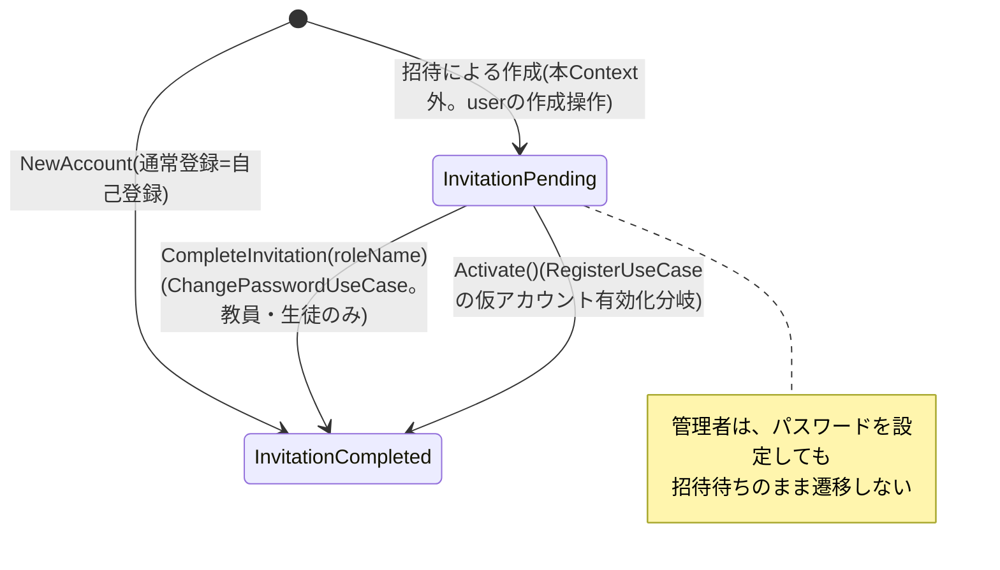
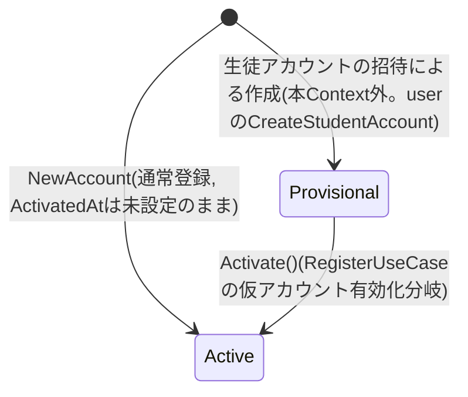
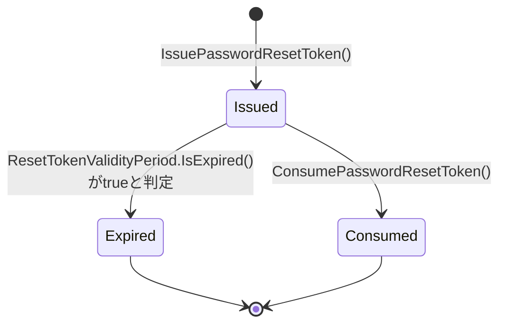
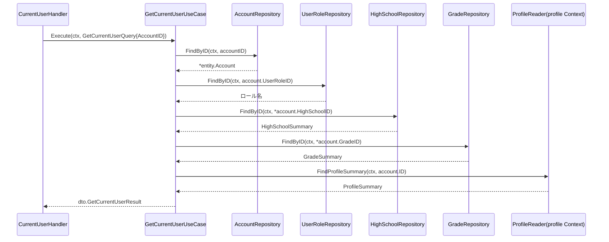
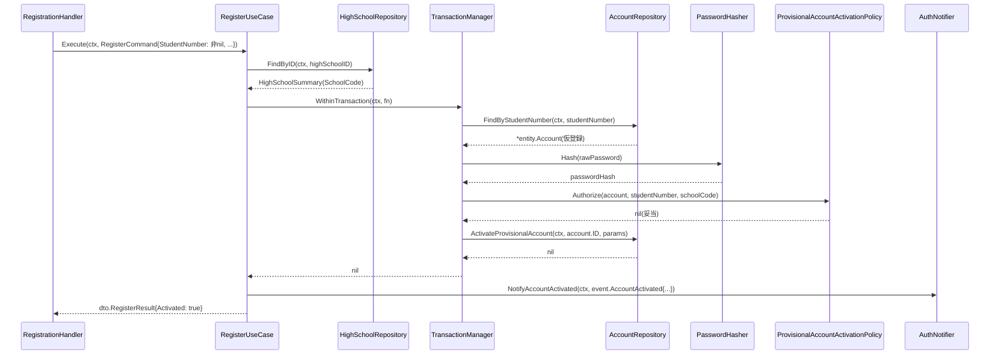

# 認証機能 Go実装仕様書

---

# 1. 機能概要

## 機能概要

ユーザーのログイン・ログアウト・新規登録（student/teacher/admin）・パスワードリセット・ログイン中ユーザー自身の基礎情報取得（`GET /api/v1/me`）を提供し、認証状態（セッションの有効性を表す`jti`、パスワードリセットトークンの有効性、招待状態、仮アカウントの有効化状態）を管理する機能である。JWTをHTTP Only Cookieで、クライアントAPI互換性を維持したまま提供する。新規登録では、生徒が学校発行の生徒コード（`student_number`）を入力した場合、新規アカウント作成の代わりに、`user` Contextの`CreateStudentAccount`が事前に作成した仮アカウント（生徒CSVインポート・教師による生徒の単体登録で作成されたもの）を本人のものとして有効化する分岐を持つ。パスワードリセット対象の検索は、退会（論理削除）済みユーザーを除外して行う。

招待による生徒・教員・管理者アカウントの作成（仮パスワードの発行・招待待ちの初期状態・招待メールの送信依頼）は`user` Contextの責務であり、本機能は招待による作成の起点ではない。本機能が`users`の行を作るのは、本人による自己登録（サインアップ）のみである。一方、招待メールのリンクからのパスワード設定は、パスワードリセットと同じトークンの消費として本機能が受け付け、設定に成功した教員・生徒は招待待ちから招待完了（`password_reset_required`が偽）へ遷移する。管理者は遷移しない（②「3. Bounded Context」「10. 状態遷移図」）。

## 採用設計パターンとその理由（②からの要約）

②Go移行・設計仕様書「4. 設計パターン」により、本機能は **Domain Model** を採用する。

- Account（資格情報・`jti`・招待状態・仮アカウント有効化状態）、PasswordResetToken（発行・有効・期限切れ・消費済み）という状態遷移を持つ概念が中心にあること
- パスワード照合・ロール別登録要件・仮アカウント有効化要件・リセットトークン有効期限判定・退会済みユーザー除外という複数の業務ルールが複数UseCaseにまたがって再利用されること
- セキュリティ上重要なロジックを型・サービスとして明示し、レビュー可能性とテスト容易性を高める必要があること

上記の理由からTransaction Script・Active Record・Event Sourcingは採用せず、Domain Modelを採用している（詳細は②「4. 設計パターン」参照）。

## 本書が対象とする実装範囲

本書は、②で確定した設計（Bounded Context・Aggregate・Entity・Value Object・Repository・UseCase・Transaction境界・Validation方針・Authorization方針・Error設計・Domain Event・API互換方針・DB方針・テスト戦略）を変更せず、Goでの具体的なコード構成（package構成・struct定義・interfaceメソッドシグネチャ・クエリ内容）に落とし込むことを目的とする。②は25節構成へ全面刷新済みであり、本書はその内容（退会済み除外、生徒コード有効化分岐、StudentNumber Value Object、GetCurrentUserUseCase、profile/master-data Contextへの参照）を実装レベルに反映する。

規約`アーキテクチャ規約.md`「3. 設計パターンごとの構造適用方針」の「Domain Model」節に従い、`{context}/domain`・`application`・`infrastructure`・`presentation`のフルレイヤー構成を適用する。TransactionManager・AppErrorの実装パターンは、②個別の推測に頼らず、規約「11. Transaction実装パターン（TransactionManager）」「12. Error変換パターン（AppError）」で標準化された内容にそのまま従う。

①Rails実装詳細は本タスクでは提供されていないため、①の実装コードそのものを根拠とする記載は行わない（①未提供のため参照不可）。②に明記された「Rails現行仕様の要約」の範囲でのみ言及する。

---

# 2. ディレクトリ構成

## 対象Bounded Context名

- Context名（②）: `authentication`
- ディレクトリ名: `internal/auth`

  > **②からの補足**: ②にはディレクトリ名の明記がない。アーキテクチャ規約「8. 命名規約（アーキテクチャレベル）」に従い、Context名`authentication`を英単語1語のディレクトリ名に短縮したものであり、他機能（`internal/task`等）の命名慣習に合わせた実装判断である（推測）。

## ②で採用した設計パターン

Domain Model

## 作成するディレクトリ一覧

```
internal/auth/
├── domain/
│   ├── entity/
│   ├── valueobject/
│   ├── repository/
│   ├── service/
│   ├── event/
│   └── errors/
├── application/
│   ├── dto/
│   └── usecase/
├── infrastructure/
│   ├── persistence/
│   │   └── gorm/
│   ├── repository/
│   ├── security/
│   └── mail/
└── presentation/
    ├── handler/
    ├── request/
    ├── response/
    └── routes.go
```

`domain/specification/`・`infrastructure/cache/`・`infrastructure/queue/`は本機能では対象外（②に該当する業務ルール・キャッシュ要件・独自の非同期実行基盤の必要性の記載がない。非同期送信はアーキテクチャ規約「13. 非同期ジョブ実行パターン（JobQueue）」の「ベストエフォート処理（goroutine起動）」で扱い、`jobs`テーブル基盤は使用しないため`infrastructure/queue/`も不要）。

`infrastructure/security/`は規約の標準ディレクトリ例（`persistence/gorm`, `repository`, `mail`, `cache`, `queue`）には含まれないが、②「23. Railsとの責務対応」の「Devise + warden-jwt → Infrastructure（トークン発行アダプタ）」に基づき、パスワードハッシュ照合・JWT発行という技術アダプタの置き場所として新設する（②からの補足、推測）。

## 作成するファイル一覧

```
internal/auth/domain/entity/account.go
internal/auth/domain/entity/password_reset_token.go

internal/auth/domain/valueobject/email.go
internal/auth/domain/valueobject/raw_password.go
internal/auth/domain/valueobject/reset_token_validity_period.go
internal/auth/domain/valueobject/signup_role_requirement.go
internal/auth/domain/valueobject/student_number.go

internal/auth/domain/repository/account_repository.go
internal/auth/domain/repository/user_role_repository.go
internal/auth/domain/repository/high_school_repository.go
internal/auth/domain/repository/grade_repository.go

internal/auth/domain/service/credential_verification_service.go
internal/auth/domain/service/password_hasher.go
internal/auth/domain/service/registration_eligibility_policy.go
internal/auth/domain/service/provisional_account_activation_policy.go
internal/auth/domain/service/password_reset_lifecycle_policy.go

internal/auth/domain/event/password_reset_token_issued.go
internal/auth/domain/event/account_activated.go

internal/auth/domain/errors/errors.go

internal/auth/application/dto/login_dto.go
internal/auth/application/dto/logout_dto.go
internal/auth/application/dto/register_dto.go
internal/auth/application/dto/password_reset_dto.go
internal/auth/application/dto/get_current_user_dto.go

internal/auth/application/usecase/transaction_manager.go
internal/auth/application/usecase/login_usecase.go
internal/auth/application/usecase/logout_usecase.go
internal/auth/application/usecase/register_usecase.go
internal/auth/application/usecase/request_password_reset_usecase.go
internal/auth/application/usecase/change_password_usecase.go
internal/auth/application/usecase/verify_reset_token_usecase.go
internal/auth/application/usecase/get_current_user_usecase.go

internal/auth/application/apperror/apperror.go

internal/auth/infrastructure/persistence/gorm/user_model.go

internal/auth/infrastructure/repository/account_repository.go
internal/auth/infrastructure/repository/user_role_repository.go
internal/auth/infrastructure/repository/high_school_repository.go
internal/auth/infrastructure/repository/grade_repository.go
internal/auth/infrastructure/repository/transaction_manager.go
internal/auth/infrastructure/repository/profile_reader.go

internal/auth/infrastructure/security/bcrypt_password_hasher.go
internal/auth/infrastructure/security/jwt_token_issuer.go
internal/auth/infrastructure/security/secure_token_generator.go

internal/auth/infrastructure/mail/auth_notifier.go

internal/auth/presentation/handler/session_handler.go
internal/auth/presentation/handler/registration_handler.go
internal/auth/presentation/handler/password_reset_handler.go
internal/auth/presentation/handler/current_user_handler.go

internal/auth/presentation/request/session_request.go
internal/auth/presentation/request/registration_request.go
internal/auth/presentation/request/password_reset_request.go

internal/auth/presentation/response/user_response.go
internal/auth/presentation/response/message_response.go

internal/auth/presentation/routes.go
```

> **②からの補足**: `application/apperror/apperror.go`は、アーキテクチャ規約「12. Error変換パターン（AppError）」が「配置場所はディレクトリ構成確定後に定める。層としてはApplication層に置く」としていることを受け、本機能のapplication層直下に暫定配置する。プロジェクト全体のディレクトリ構成確定後、複数機能で共有される`internal/shared/apperror`等への集約が検討される可能性がある（推測）。`application/usecase/transaction_manager.go`（インターフェース定義）も同様の理由で暫定配置する。

---

# 3. Domain層設計

## Entity

### Account（`domain/entity/account.go`）

- struct名: `Account`
- フィールド:

|フィールド|型|意味|
|-|-|-|
|`ID`|`uint`|アカウント（`users`テーブル行）の識別子|
|`Email`|`valueobject.Email`|ログインに用いるメールアドレス|
|`PasswordHash`|`string`|保存済みパスワードハッシュ（ハッシュアルゴリズム自体はInfrastructure層`PasswordHasher`が担う）|
|`UserRoleID`|`uint`|ロール（student/teacher/admin）を示す識別子|
|`JTI`|`string`|現在有効なセッション識別子|
|`HighSchoolID`|`*uint`|所属高校ID（student/teacherのみ設定、adminはnil）|
|`GradeID`|`*uint`|学年ID（student/teacherかつ生徒コード管理対象校でない場合のみ設定）|
|`StudentNumber`|`*valueobject.StudentNumber`|生徒コード（生徒コード管理対象校の生徒のみ設定、他はnil）|
|`PasswordResetRequired`|`bool`|`true`の間は「招待待ち」、`false`の間は「招待完了」を示す。`true`かつ`ActivatedAt`未設定の間は「仮登録」状態でもある（②「6. Entity設計」「10. 状態遷移図」）|
|`ActivatedAt`|`*time.Time`|仮アカウントが有効化された日時。生徒コードによる仮アカウントの有効化（`Activate`）でのみ設定し、通常登録（自己登録）では設定しない（未設定=nilのまま。Rails現行の自己登録が`activated_at`を設定しないことに合わせる。`user`②「20章」と同じ整理）|
|`DeletedAt`|`*time.Time`|論理削除日時（退会済みの場合に設定。②「11. Repository設計」の退会済み除外判定に用いる）|
|`ResetToken`|`*entity.PasswordResetToken`|発行中のパスワードリセットトークン（未発行時はnil）|

- 公開メソッド一覧（引数・戻り値のみ。ロジックは記述しない）:

|メソッド|引数|戻り値|責務|
|-|-|-|-|
|`NewAccount`|`(id uint, email valueobject.Email, passwordHash string, userRoleID uint, jti string, highSchoolID, gradeID *uint, studentNumber *valueobject.StudentNumber, passwordResetRequired bool, activatedAt *time.Time, deletedAt *time.Time) (*Account, error)`|`(*Account, error)`|不変条件を満たしたAccountを生成するファクトリ|
|`RotateJTI`|`(newJTI string)`|`error`|ログアウト時に`jti`をローテーションし、以前のセッションを無効化する|
|`UpdatePasswordHash`|`(newHash string)`|`error`|パスワードリセット成功時にハッシュを更新する|
|`IssuePasswordResetToken`|`(token string, issuedAt time.Time)`|`error`|リセットトークンを発行し保持する|
|`ConsumePasswordResetToken`|`()`|`error`|リセットトークンを消費済み（nil化）にする|
|`HasResetToken`|`()`|`bool`|リセットトークンが発行済みかを判定する|
|`IsProvisional`|`()`|`bool`|`PasswordResetRequired`が真かつ`ActivatedAt`が未設定かどうかを判定する（②「10. 状態遷移図」の遷移条件をそのまま反映）|
|`IsDeleted`|`()`|`bool`|退会（論理削除）済みかどうかを判定する|
|`IsInvitationPending`|`()`|`bool`|`PasswordResetRequired`が真（招待待ち）かどうかを判定する（②「10. 状態遷移図」の招待状態）|
|`CompleteInvitation`|`(roleName string)`|`error`|パスワードの設定に成功したときに、招待待ちを解消して招待完了へ遷移させる。`roleName`が`teacher`または`student`の場合のみ`PasswordResetRequired`を偽にし、それ以外（`admin`を含む）は変更しない。既に招待完了（偽）の場合も変化しない。`roleName`が空の場合はエラーを返す（②「6. Entity設計」「10. 状態遷移図」）|
|`Activate`|`(now time.Time)`|`error`|仮登録状態から有効化済み状態へ遷移する（`IsProvisional()`が`false`の場合はエラーを返す）。氏名・氏名カナ等プロフィール項目の反映は本メソッドの責務としない（後述の②からの補足を参照）|

- 不変条件（ファクトリで保証する内容）:
  - `Email`は`valueobject.Email`型としてのみ保持され、生成時に形式検証済みであることが保証される
  - `PasswordHash`は空文字を許容しない
  - `UserRoleID`は0を許容しない（登録時にUserRoleRepositoryで存在確認済みの値のみを渡す）
  - `PasswordResetRequired`が`true`かつ`ActivatedAt`が非nilという組み合わせ（有効化済みなのに仮登録要求フラグが残っている状態）は不変条件違反として`NewAccount`がエラーを返す

> **②からの補足**: ②「5. Aggregate設計」はAccountのAggregate境界から「プロフィール情報（氏名・個人情報・住所等）」を明示的に除外している一方、②「6. Entity設計」はAccountの責務として「有効化時に入力内容（氏名・氏名カナ等）で自身を更新する」を挙げており、両者は文言上ややテンションがある。本書ではAggregate境界（5章）の方を優先し、`Account`構造体自体には`Name`/`NameKana`フィールドを持たせない。「自身を更新する」という6章の記述は、`Activate()`によるドメイン状態（`ActivatedAt`・`PasswordResetRequired`）の遷移と、氏名・氏名カナという非Aggregate項目のRepository経由での永続化（`AccountRepository.ActivateProvisionalAccount`の`ActivateAccountParams`、後述）が1つのUseCase処理内で一体的に行われることとして実装する。旧版の`RegisterUseCase`（通常登録）における`CreateAccountParams`と同じ考え方を、仮アカウント有効化にも適用したものであり、②の記載同士（5章のAggregate境界と6章の責務記述）を矛盾なく実装に落とし込むための判断である（推測ではなく、②の記載同士の整合を取るための判断）。

> **②からの補足**: ②「6. Entity設計」「10. 状態遷移図」は、パスワード設定の成功時に、教員・生徒のみ`password_reset_required`を偽にする（管理者は偽にしない）招待待ち→招待完了の遷移を、Accountの責務として定めている。`Account`はロール名ではなく`UserRoleID`のみを保持するため、`CompleteInvitation`はロール名を引数に取り、UseCaseが`UserRoleRepository.FindByID`で取得した値を渡す構成とした。ロール名は`student` / `teacher` / `admin`の文字列（`SignUpRoleRequirement`と同じ値）とする。`Activate`（生徒コードによる有効化）も`PasswordResetRequired`を偽にするが、こちらは仮登録からの遷移としてロールを問わず`IsProvisional()`を前提とし、`CompleteInvitation`とは別の遷移である（②の記載を実装に落とし込むための判断。推測）。

### PasswordResetToken（`domain/entity/password_reset_token.go`）

- struct名: `PasswordResetToken`
- フィールド:

|フィールド|型|意味|
|-|-|-|
|`Token`|`string`|発行されたリセットトークン文字列|
|`IssuedAt`|`time.Time`|トークン発行日時|

- 公開メソッド一覧:

|メソッド|引数|戻り値|責務|
|-|-|-|-|
|`NewPasswordResetToken`|`(token string, issuedAt time.Time) (*PasswordResetToken, error)`|`(*PasswordResetToken, error)`|発行直後のトークンを生成するファクトリ|
|`IsValid`|`(now time.Time, period valueobject.ResetTokenValidityPeriod) bool`|`bool`|現在有効（期限内）かどうかを判定する|

- 不変条件: `Token`は空文字を許容しない。

## Value Object

### Email（`domain/valueobject/email.go`）

- struct名: `Email`
- フィールド: `value string`（非公開）
- 生成時に検証するルール: メールアドレス形式であること
- 公開メソッド: `NewEmail(raw string) (Email, error)` / `(e Email) String() string`

### RawPassword（`domain/valueobject/raw_password.go`）

- struct名: `RawPassword`
- フィールド: `value string`（非公開）
- 生成時に検証するルール: 登録時の最小文字数等のポリシー（②「7. Value Object設計」により、具体的な文字数はRails現行のDevise標準ポリシーを踏襲する前提。②で「推測」と明記されているため本書でも数値を確定しない）
- 公開メソッド: `NewRawPassword(raw string) (RawPassword, error)` / `(p RawPassword) Matches(confirmation RawPassword) bool` / `(p RawPassword) String() string`

> **②からの補足**: 具体的な最小文字数は②でも「推測」とされ確定していない。本書でも数値は確定せず、実装時にRails現行DBのバリデーション実態を別途確認する必要がある旨を明記する（①未提供のため参照不可）。

### ResetTokenValidityPeriod（`domain/valueobject/reset_token_validity_period.go`）

- struct名: `ResetTokenValidityPeriod`
- フィールド: `duration time.Duration`（非公開）
- 生成時に検証するルール: 発行からの有効期間（②により、Devise標準設定を踏襲する前提、具体的な期間は②でも「推測」）
- 公開メソッド: `NewResetTokenValidityPeriod(d time.Duration) ResetTokenValidityPeriod` / `(p ResetTokenValidityPeriod) IsExpired(issuedAt, now time.Time) bool`

> **②からの補足**: 具体的な有効期間の値は②でも未確定（推測）。本書では型・判定メソッドのシグネチャのみを定義し、具体的な時間値は実装時にRails現行設定（`config.reset_password_within`相当）を①側で確認のうえ確定する必要がある（①未提供のため参照不可）。

### SignUpRoleRequirement（`domain/valueobject/signup_role_requirement.go`）

- struct名: `SignUpRoleRequirement`
- フィールド: `roleName string`（非公開）
- 生成時に検証するルール: ロール名（`student`/`teacher`/`admin`）に応じて高校ID・学年ID・生徒コードが必須かを判定するルールを保持する
- 公開メソッド:
  - `NewSignUpRoleRequirement(roleName string) SignUpRoleRequirement`
  - `(r SignUpRoleRequirement) RequiresHighSchool() bool`
  - `(r SignUpRoleRequirement) RequiresGrade(highSchoolIsCSVManaged bool) bool`
  - `(r SignUpRoleRequirement) RequiresStudentNumber(highSchoolIsCSVManaged bool) bool`

> **②からの補足**: ②「7. Value Object設計」は「studentかつ選択した高校が生徒コード管理対象校（`csv_managed`）の場合、`grade_id`の代わりに`student_number`の入力を必須とする分岐を含む」としている。この判定はロール名だけでなく選択高校の`csv_managed`区分（HighSchoolRepository経由で取得する動的な値）にも依存するため、`RequiresGrade` / `RequiresStudentNumber`は`highSchoolIsCSVManaged bool`を引数に取る形とした。②はメソッドシグネチャそのものを規定していないため、引数設計は実装判断である（推測）。

### StudentNumber（`domain/valueobject/student_number.go`）

- struct名: `StudentNumber`
- フィールド: `schoolCode string`（非公開）, `body string`（非公開）
- 生成時に検証するルール: 「学校コード-コード本体」のハイフン区切り形式であること（②「7. Value Object設計」）
- 公開メソッド:
  - `NewStudentNumber(raw string) (StudentNumber, error)`
  - `(s StudentNumber) SchoolCode() string`
  - `(s StudentNumber) String() string`
  - `(s StudentNumber) MatchesSchoolCode(schoolCode string) bool`

> **②からの補足**: ②「15. Validation設計」の「バリデーション仕様」表では、`student_number`のフォーマットチェック自体はPresentation層の責務とされている。本Value Objectは、Presentationのチェックをすり抜けた不正な形式がDomain層に到達しないための多重防御（defense in depth）として、Domain側でも独立して形式検証を行う構成とする。フォーマット不正時のエラーはEmail/RawPasswordと同様、Domain Errorのセンチネル変数としては定義せず、`NewStudentNumber`が返す通常のerrorとして扱う（②に個別のセンチネルエラー名の指定がないため、Email/RawPasswordの既存方針に合わせた実装判断。推測）。

## Value Objectを採用しないもの

②「7. Value Object設計」の方針どおり、`jti`は単なるUUID文字列として`Account.JTI string`にそのまま保持し、Value Object化しない。

## Repository Interface

### AccountRepository（`domain/repository/account_repository.go`）

|メソッド|引数|戻り値|責務|
|-|-|-|-|
|`FindByID`|`(ctx context.Context, id uint)`|`(*entity.Account, error)`|IDによる一意検索（`GetCurrentUserUseCase`用）|
|`FindByEmail`|`(ctx context.Context, email valueobject.Email)`|`(*entity.Account, error)`|メールアドレスによる一意検索（ログイン時。②の方針により退会済みも検索対象に含める、後述の②からの補足参照）|
|`FindByEmailExcludingDeleted`|`(ctx context.Context, email valueobject.Email)`|`(*entity.Account, error)`|メールアドレスによる一意検索（パスワードリセットリクエスト時。退会（論理削除）済みアカウントを除外する。②「11. Repository設計」の退会済み除外方針）|
|`FindByResetToken`|`(ctx context.Context, token string)`|`(*entity.Account, error)`|リセットトークンによる検索（トークン検証・パスワード更新時）|
|`FindByStudentNumber`|`(ctx context.Context, studentNumber string)`|`(*entity.Account, error)`|生徒コードによる仮アカウント検索（新規登録時の仮アカウント特定。②「11. Repository設計」）|
|`Create`|`(ctx context.Context, params CreateAccountParams)`|`(*entity.Account, error)`|アカウントの新規作成（通常登録＝本人による自己登録時。招待による作成は`user` Contextが行い、本メソッドは行わない）。`CreateAccountParams`にName/NameKanaを含む|
|`ActivateProvisionalAccount`|`(ctx context.Context, accountID uint, params ActivateAccountParams)`|`error`|仮アカウントを入力内容で更新し、`activated_at`を設定する（②「12. UseCase設計」の仮アカウント有効化フロー）|
|`UpdateJTI`|`(ctx context.Context, accountID uint, newJTI string)`|`error`|`jti`の更新（ログアウト時）|
|`SaveResetToken`|`(ctx context.Context, accountID uint, token string, issuedAt time.Time)`|`error`|リセットトークン発行情報の保存|
|`UpdatePasswordAndConsumeResetToken`|`(ctx context.Context, accountID uint, newPasswordHash string, passwordResetRequired bool)`|`error`|パスワードハッシュ更新とリセットトークン消費（クリア）に加え、招待状態（`passwordResetRequired`。`Account.CompleteInvitation`適用後の値）の反映を1操作で行う|

`CreateAccountParams`のフィールド: `Email valueobject.Email`, `PasswordHash string`, `UserRoleID uint`, `HighSchoolID *uint`, `GradeID *uint`, `Name string`, `NameKana string`

`ActivateAccountParams`のフィールド: `Email valueobject.Email`, `PasswordHash string`, `Name string`, `NameKana string`, `ActivatedAt time.Time`

### UserRoleRepository（`domain/repository/user_role_repository.go`）

|メソッド|引数|戻り値|責務|
|-|-|-|-|
|`FindByName`|`(ctx context.Context, name string)`|`(id uint, found bool, err error)`|ロール名による存在確認とID取得（登録時）|
|`FindByID`|`(ctx context.Context, id uint)`|`(name string, found bool, err error)`|IDによるロール名取得（`GetCurrentUserUseCase`用）|

### HighSchoolRepository（`domain/repository/high_school_repository.go`）

master-data Contextが公開する参照手段を利用する（アーキテクチャ規約「5. Context間連携ルール」）。

|メソッド|引数|戻り値|責務|
|-|-|-|-|
|`Exists`|`(ctx context.Context, id uint)`|`(bool, error)`|登録時に指定された`high_school_id`の存在確認|
|`FindByID`|`(ctx context.Context, id uint)`|`(*HighSchoolSummary, error)`|`school_code`・名称の取得（仮アカウント有効化時の学校コード整合確認、`GetCurrentUserUseCase`のレスポンス合成に利用）|

`HighSchoolSummary`のフィールド: `ID uint`, `Name string`, `SchoolCode string`, `CSVManaged bool`

### GradeRepository（`domain/repository/grade_repository.go`）

|メソッド|引数|戻り値|責務|
|-|-|-|-|
|`Exists`|`(ctx context.Context, id uint)`|`(bool, error)`|登録時に指定された`grade_id`の存在確認|
|`FindByID`|`(ctx context.Context, id uint)`|`(*GradeSummary, error)`|`GetCurrentUserUseCase`のレスポンス合成に利用|

`GradeSummary`のフィールド: `ID uint`, `Year int`, `DisplayName string`

## Domain Service

### CredentialVerificationService（`domain/service/credential_verification_service.go`）

- struct名: `CredentialVerificationService`
- 依存: `PasswordHasher`（同ファイルまたは`password_hasher.go`で定義するinterface）
- メソッドシグネチャ:
  - `NewCredentialVerificationService(hasher PasswordHasher) *CredentialVerificationService`
  - `(s *CredentialVerificationService) Verify(account *entity.Account, raw valueobject.RawPassword) error`
- 責務: 入力された`RawPassword`とAccountのパスワードハッシュを照合し、失敗時は`domain/errors.ErrInvalidCredentials`相当を返す

### PasswordHasher（`domain/service/password_hasher.go`）

- interface名: `PasswordHasher`
- メソッドシグネチャ:
  - `Hash(raw string) (string, error)`
  - `Verify(hash, raw string) (bool, error)`

> **②からの補足**: コーディング規約「7. インターフェース」の「利用側で定義する」方針に従い、利用側であるdomain/serviceパッケージにinterfaceを定義した（②に配置場所の明記はないため推測）。

### RegistrationEligibilityPolicy（`domain/service/registration_eligibility_policy.go`）

- struct名: `RegistrationEligibilityPolicy`
- メソッドシグネチャ: `(p RegistrationEligibilityPolicy) Validate(requirement valueobject.SignUpRoleRequirement, highSchoolID, gradeID *uint, studentNumber *valueobject.StudentNumber, highSchoolExists bool, gradeExists bool, highSchoolIsCSVManaged bool) error`
- 責務: 通常登録（生徒コード未指定）時、ロール別要件（学生・教員は高校・学年必須、管理者は不要。生徒コード管理対象校のstudentは`grade_id`の代わりに`student_number`が必須）を満たしているかを判定する

### ProvisionalAccountActivationPolicy（`domain/service/provisional_account_activation_policy.go`）

- struct名: `ProvisionalAccountActivationPolicy`
- 依存: なし
- メソッドシグネチャ: `(p ProvisionalAccountActivationPolicy) Authorize(account *entity.Account, studentNumber valueobject.StudentNumber, highSchoolSchoolCode string) error`
- 責務: 生徒コードに一致する仮アカウントが有効化対象として妥当かを判定する（②「8. Domain Service」）
  - `account`が`nil`（該当する仮アカウントが存在しない）の場合、`ErrProvisionalAccountNotFound`を返す
  - `account.IsProvisional()`が`false`（既に有効化済み）の場合、`ErrProvisionalAccountAlreadyActivated`を返す
  - `studentNumber.MatchesSchoolCode(highSchoolSchoolCode)`が`false`（学校コード不一致）の場合、`ErrStudentNumberSchoolMismatch`を返す
  - 上記いずれにも該当しない場合のみ`nil`を返す

> **②からの補足**: ②「8. Domain Service」はメソッドシグネチャを規定していない。`account *entity.Account`を`nil`許容の引数としたのは、「該当する仮アカウントが見つからない」ケースをUseCase側での事前分岐ではなくPolicy内の判定として一元化するための実装判断である（推測）。

### PasswordResetLifecyclePolicy（`domain/service/password_reset_lifecycle_policy.go`）

- struct名: `PasswordResetLifecyclePolicy`
- メソッドシグネチャ: `(p PasswordResetLifecyclePolicy) CanConsume(token *entity.PasswordResetToken, now time.Time, period valueobject.ResetTokenValidityPeriod) error`
- 責務: リセットトークンが現在の状態から見て消費（パスワード更新）可能かを判定する。トークン不一致・未発行・期限切れをそれぞれ区別したDomain Errorを返す

> **②からの補足**: ②「6. Entity設計」の「PasswordResetToken」節は、リセット対象ユーザーの検索において退会済みユーザーを除外することも本Policyの前提条件の一部として言及している。本書では、この退会済み除外は`PasswordResetLifecyclePolicy`の判定メソッド内で行うのではなく、`AccountRepository.FindByEmailExcludingDeleted`によるクエリレベルでのスコープ限定として実装する（③3章のRepository Interface参照）。理由は、退会済み判定はAccountの属性（`DeletedAt`）のみで完結し、GORMの論理削除機構（`gorm.DeletedAt`、Gorm規約「0. 本プロジェクトでの採用方針」）によって検索クエリの時点で自然に除外できるため、Policyに判定ロジックを重複させる必要がないという実装判断である（②の記載同士の整合を取るための判断）。

## Domain Event

### PasswordResetTokenIssued（`domain/event/password_reset_token_issued.go`）

- イベントstruct名: `PasswordResetTokenIssued`
- 保持するフィールド: `AccountID uint`, `Email string`, `Token string`, `IssuedAt time.Time`
- 発火元: `RequestPasswordResetUseCase`（対象ユーザーが存在しリセットトークンが発行された時点）

### AccountActivated（`domain/event/account_activated.go`）

- イベントstruct名: `AccountActivated`
- 保持するフィールド: `AccountID uint`, `Email string`, `ActivatedAt time.Time`
- 発火元: `RegisterUseCase`（生徒コード指定による仮アカウントの有効化が完了した時点。②「18. Domain Event」）

> **②からの補足**: 両イベントの実際のディスパッチ機構は、アーキテクチャ規約「13. 非同期ジョブ実行パターン（JobQueue）」の「処理の分類」表に基づき、パスワードリセットメール送信・有効化完了メール送信はいずれも「ベストエフォートで良い処理」に分類されるため、`jobs`テーブルを経由せず、UseCaseがイベントを構築した後、Infrastructure層のアダプタ（`AuthNotifier`、後述5章）がgoroutineを直接起動して送信する（規約13章「ベストエフォートで良い処理: goroutine起動」の例に準拠）。旧版がイベントバス的な`〇〇EventPublisher`インターフェースを個別に推測していた部分は、規約13章制定に伴い標準パターンへ置き換える。

## Domain Error

`domain/errors/errors.go`に、`errors.New`によるセンチネルエラー変数として定義する（②「17. Error設計」のDomain Errorに対応）。

|変数名|発生条件|
|-|-|
|`ErrInvalidCredentials`|メールアドレスまたはパスワードが不一致（ユーザー不存在の場合も同一エラーとして扱う）|
|`ErrInvalidRole`|指定されたロール名が存在しない|
|`ErrRegistrationRequirementNotMet`|ロール別必須項目（高校・学年・生徒コード）の欠如、または指定IDが実在しない|
|`ErrPasswordConfirmationMismatch`|パスワードと確認用パスワードが一致しない|
|`ErrResetTokenNotFound`|リセットトークンに一致するアカウントが存在しない|
|`ErrResetTokenExpired`|リセットトークンが有効期限切れ|
|`ErrResetTokenNotIssued`|リセットトークンが発行されていない状態での消費操作|
|`ErrProvisionalAccountNotFound`|生徒コードに一致する仮アカウントが存在しない|
|`ErrProvisionalAccountAlreadyActivated`|生徒コードに一致するアカウントが既に有効化済み|
|`ErrStudentNumberSchoolMismatch`|生徒コードに含まれる学校コードが選択高校の`school_code`と不一致|

---

# 4. クラス図

```mermaid
classDiagram
    class Account {
        -uint ID
        -valueobject.Email Email
        -string PasswordHash
        -uint UserRoleID
        -string JTI
        -*uint HighSchoolID
        -*uint GradeID
        -*valueobject.StudentNumber StudentNumber
        -bool PasswordResetRequired
        -*time.Time ActivatedAt
        -*time.Time DeletedAt
        -*entity.PasswordResetToken ResetToken
        +NewAccount(...) (*Account, error)
        +RotateJTI(newJTI string) error
        +UpdatePasswordHash(newHash string) error
        +IssuePasswordResetToken(token string, issuedAt time.Time) error
        +ConsumePasswordResetToken() error
        +HasResetToken() bool
        +IsProvisional() bool
        +IsDeleted() bool
        +IsInvitationPending() bool
        +CompleteInvitation(roleName string) error
        +Activate(now time.Time) error
    }
    class PasswordResetToken {
        -string Token
        -time.Time IssuedAt
        +NewPasswordResetToken(token string, issuedAt time.Time) (*PasswordResetToken, error)
        +IsValid(now time.Time, period ResetTokenValidityPeriod) bool
    }
    class Email {
        <<ValueObject>>
        -string value
        +NewEmail(raw string) (Email, error)
        +String() string
    }
    class RawPassword {
        <<ValueObject>>
        -string value
        +NewRawPassword(raw string) (RawPassword, error)
        +Matches(confirmation RawPassword) bool
    }
    class ResetTokenValidityPeriod {
        <<ValueObject>>
        -time.Duration duration
        +IsExpired(issuedAt, now time.Time) bool
    }
    class SignUpRoleRequirement {
        <<ValueObject>>
        -string roleName
        +RequiresHighSchool() bool
        +RequiresGrade(highSchoolIsCSVManaged bool) bool
        +RequiresStudentNumber(highSchoolIsCSVManaged bool) bool
    }
    class StudentNumber {
        <<ValueObject>>
        -string schoolCode
        -string body
        +NewStudentNumber(raw string) (StudentNumber, error)
        +SchoolCode() string
        +MatchesSchoolCode(schoolCode string) bool
    }
    class AccountRepository {
        <<interface>>
        +FindByID(ctx, id) (*Account, error)
        +FindByEmail(ctx, email) (*Account, error)
        +FindByEmailExcludingDeleted(ctx, email) (*Account, error)
        +FindByResetToken(ctx, token) (*Account, error)
        +FindByStudentNumber(ctx, studentNumber) (*Account, error)
        +Create(ctx, params) (*Account, error)
        +ActivateProvisionalAccount(ctx, accountID, params) error
        +UpdateJTI(ctx, accountID, newJTI) error
        +SaveResetToken(ctx, accountID, token, issuedAt) error
        +UpdatePasswordAndConsumeResetToken(ctx, accountID, newHash, passwordResetRequired) error
    }
    class UserRoleRepository {
        <<interface>>
        +FindByName(ctx, name) (uint, bool, error)
        +FindByID(ctx, id) (string, bool, error)
    }
    class HighSchoolRepository {
        <<interface>>
        +Exists(ctx, id) (bool, error)
        +FindByID(ctx, id) (*HighSchoolSummary, error)
    }
    class GradeRepository {
        <<interface>>
        +Exists(ctx, id) (bool, error)
        +FindByID(ctx, id) (*GradeSummary, error)
    }
    class CredentialVerificationService {
        <<DomainService>>
        +Verify(account, rawPassword) error
    }
    class RegistrationEligibilityPolicy {
        <<DomainService>>
        +Validate(requirement, highSchoolID, gradeID, studentNumber, highSchoolExists, gradeExists, isCSVManaged) error
    }
    class ProvisionalAccountActivationPolicy {
        <<DomainService>>
        +Authorize(account, studentNumber, highSchoolSchoolCode) error
    }
    class PasswordResetLifecyclePolicy {
        <<DomainService>>
        +CanConsume(token, now, period) error
    }

    Account "1" *-- "0..1" PasswordResetToken : 保持
    Account --> Email : 保持
    Account --> StudentNumber : 保持(任意)
    PasswordResetToken --> ResetTokenValidityPeriod : 有効期間を参照
    CredentialVerificationService ..> Account : 照合
    RegistrationEligibilityPolicy ..> SignUpRoleRequirement : 判定に利用
    ProvisionalAccountActivationPolicy ..> StudentNumber : 学校コード照合
    ProvisionalAccountActivationPolicy ..> Account : 仮アカウント状態判定
    PasswordResetLifecyclePolicy ..> PasswordResetToken : 状態判定
    AccountRepository ..> Account : 入出力
```



②のクラス図（②9章）は業務概念の関係を示すのみだが、本図はGoのstruct/interfaceとして実際に定義するフィールド・メソッドシグネチャまで具体化した。UserRole/HighSchool/Grade・profile Context参照（`ProfileReader`）はRepository/Interfaceの依存関係として6章（Application層設計）・8章（Infrastructure層設計）で扱う。

---

# 5. 状態遷移図

## Account（招待状態）



遷移条件:

- `InvitationPending`は`Account.IsInvitationPending()`（`PasswordResetRequired == true`）が`true`であることに対応する。`user` Contextが招待による作成時に設定するものであり、招待による作成の起点は本Contextではない
- `InvitationCompleted`は`PasswordResetRequired == false`であることに対応する。通常登録（自己登録）で作成されたアカウントと、招待待ちにしない指定で`user` Contextが作成した教員は、この状態で始まる
- `InvitationPending`から`InvitationCompleted`への遷移は次の2つである
  - `Account.CompleteInvitation(roleName)`: `ChangePasswordUseCase`が、トークンの有効性判定の後、永続化の前に、アカウントのロール名（`UserRoleRepository.FindByID`で取得）を渡して呼ぶ。`roleName`が`teacher`または`student`の場合のみ`PasswordResetRequired`を偽にし、`admin`の場合は変更しない。結果は`AccountRepository.UpdatePasswordAndConsumeResetToken`の`passwordResetRequired`引数として、パスワードハッシュ更新・トークン消費と同一のトランザクションで永続化される。パスワードリセットと招待メールのリンクからのパスワード設定は同じ操作であるため、どちらの経路でもこの遷移が起きる
  - `Account.Activate(now)`: 下記「Account（仮登録・有効化状態）」の遷移
- `InvitationCompleted`から`InvitationPending`へ戻る遷移はない
- `Provisional`（下記）は、`InvitationPending`のうち`ActivatedAt == nil`のアカウントである。`CompleteInvitation`によって`InvitationCompleted`になったアカウントは、`ActivatedAt == nil`でも`PasswordResetRequired == false`のため`Provisional`ではなく、`ProvisionalAccountActivationPolicy.Authorize`が`ErrProvisionalAccountAlreadyActivated`を返す（②「6. Entity設計」）

## Account（仮登録・有効化状態）



遷移条件:

- `Provisional`は`Account.IsProvisional()`（`PasswordResetRequired == true && ActivatedAt == nil`）が`true`であることに対応する
- `Active`は`Account.IsProvisional()`が`false`であることに対応する。通常登録（自己登録）で作成されたアカウントは`ActivatedAt == nil`のまま`Active`で始まり（`AccountRepository.Create`は`activated_at`を設定しない）、`Activate(now)`を経たアカウントは`ActivatedAt`が設定された`Active`になる。`Active`かどうかを`ActivatedAt`の有無で判定してはならない
- `Provisional`から`Active`への遷移は`Account.Activate(now)`が担い、`ProvisionalAccountActivationPolicy.Authorize`による事前判定（学校コード一致等）を通過した場合のみ呼び出される
- `Provisional`状態のアカウントの作成自体（`[*] --> Provisional`）は本Contextの操作範囲外であり、`user` Contextの`CreateStudentAccount`（生徒CSVインポート・教師による生徒の単体登録が呼ぶ）が担う

## PasswordResetToken



遷移条件:

- `Issued`は`RequestPasswordResetUseCase`が対象アカウントを`AccountRepository.FindByEmailExcludingDeleted`で発見できた場合にのみ`Account.IssuePasswordResetToken`経由で生成される
- `Expired`は`PasswordResetToken.IsValid` / `PasswordResetLifecyclePolicy.CanConsume`が発行から`ResetTokenValidityPeriod`を超えたと判定した時点で扱われる（永続化された専用ステータス値は持たない）
- `Consumed`は`Account.ConsumePasswordResetToken()`によりトークン・発行日時をクリアすることで表現される

`jti`は単純な値のローテーションであり、複数の状態を持つ概念ではないため状態遷移図としては可視化しない。

---

# 6. Application層設計

## DTO（Command / Query）

|struct名|フィールド|区分|
|-|-|-|
|`LoginQuery`|`Email string`, `Password string`|Query|
|`LoginResult`|`AccountID uint`, `Email string`, `UserRoleID uint`, `Token string`, `ExpiresAt time.Time`|出力|
|`LogoutCommand`|`AccountID uint`|Command|
|`LogoutResult`|`Message string`|出力|
|`RegisterCommand`|`Email string`, `Password string`, `PasswordConfirmation string`, `Name string`, `NameKana string`, `RoleName string`, `HighSchoolID *uint`, `GradeID *uint`, `StudentNumber *string`|Command|
|`RegisterResult`|`AccountID uint`, `Email string`, `UserRoleID uint`, `HighSchoolID *uint`, `GradeID *uint`, `Activated bool`（仮アカウント有効化パスで`true`）|出力|
|`RequestPasswordResetCommand`|`Email string`|Command|
|`RequestPasswordResetResult`|`Message string`|出力（常に固定の成功メッセージ）|
|`ChangePasswordCommand`|`ResetPasswordToken string`, `Password string`, `PasswordConfirmation string`|Command|
|`ChangePasswordResult`|`Message string`|出力|
|`VerifyResetTokenQuery`|`ResetPasswordToken string`|Query|
|`VerifyResetTokenResult`|`Valid bool`|出力|
|`GetCurrentUserQuery`|`AccountID uint`|Query|
|`GetCurrentUserResult`|`AccountID uint`, `Name string`, `NameKana string`, `Email string`, `ProfileCompleted bool`, `UserRoleName string`, `HighSchool *dto.HighSchoolInfo`, `Grade *dto.GradeInfo`, `PersonalInfo *dto.PersonalInfoView`, `Address *dto.AddressView`|出力|

`HighSchoolInfo{ID uint, Name string}`, `GradeInfo{ID uint, Year int, DisplayName string}`, `PersonalInfoView`/`AddressView`はprofile Context側の参照結果をそのまま転記する構造（フィールド詳細はprofile Contextの③文書に委ねる）。

## UseCase

### LoginUseCase（`application/usecase/login_usecase.go`）

- struct名: `LoginUseCase`
- コンストラクタが受け取る依存: `AccountRepository`（Interface）, `*service.CredentialVerificationService`, `TokenIssuer`（本ファイル内で定義するInterface）
- 公開メソッド: `(u *LoginUseCase) Execute(ctx context.Context, query dto.LoginQuery) (dto.LoginResult, error)`
- 処理ステップ:
  1. `valueobject.NewEmail` / `NewRawPassword`で入力を検証する
  2. `AccountRepository.FindByEmail`で対象アカウントを取得する（存在しない場合も次のステップで同一エラーに集約する）
  3. `CredentialVerificationService.Verify`で照合する
  4. `TokenIssuer.Issue`でJWTを発行する
  5. `LoginResult`を組み立てて返す
- トランザクション境界: なし（②「14. Transaction設計」により読み取りのみ）
- 発生しうるApplication Error: `ErrInvalidCredentials`（アカウント不存在・パスワード不一致のいずれも同一エラーとして扱い、ユーザー列挙を防ぐ）

> **②からの補足**: `TokenIssuer`はJWT発行という技術的関心事のためのInterfaceであり、利用側（`LoginUseCase`）で定義する（コーディング規約「7. インターフェース」準拠）。メソッドシグネチャ: `Issue(ctx context.Context, accountID uint, jti string, userRoleID uint) (token string, expiresAt time.Time, err error)`。実装は`infrastructure/security/jwt_token_issuer.go`に置く。②「11. Repository設計」により、`FindByEmail`は退会済みアカウントも検索対象に含める（ログイン時の除外要否は②に明記がなく、本機能では退会済み除外はパスワードリセット対象検索に限定する方針。9章のGORM設計を参照）。

### LogoutUseCase（`application/usecase/logout_usecase.go`）

- struct名: `LogoutUseCase`
- コンストラクタが受け取る依存: `AccountRepository`, `JTIGenerator`（Interface、後述）, `TransactionManager`（アーキテクチャ規約「11. Transaction実装パターン」）
- 公開メソッド: `(u *LogoutUseCase) Execute(ctx context.Context, cmd dto.LogoutCommand) (dto.LogoutResult, error)`
- 処理ステップ:
  1. `JTIGenerator.Generate`で新しい`jti`を生成する
  2. `TransactionManager.WithinTransaction`内で`AccountRepository.UpdateJTI`を実行する
  3. `LogoutResult`を返す
- トランザクション境界: `UpdateJTI`実行を1トランザクションとする（②「14. Transaction設計」）
- 発生しうるApplication Error: Infrastructure Error（DB更新失敗）

### RegisterUseCase（`application/usecase/register_usecase.go`）

- struct名: `RegisterUseCase`
- コンストラクタが受け取る依存: `UserRoleRepository`, `HighSchoolRepository`, `GradeRepository`, `AccountRepository`, `*service.RegistrationEligibilityPolicy`, `*service.ProvisionalAccountActivationPolicy`, `PasswordHasher`, `TransactionManager`, `AuthNotifier`（Interface、後述8章）
- 公開メソッド: `(u *RegisterUseCase) Execute(ctx context.Context, cmd dto.RegisterCommand) (dto.RegisterResult, error)`
- 処理ステップ（②「13. シーケンス図・処理フロー図」のフローチャートに対応、分岐は`cmd.StudentNumber`の有無）:
  1. `valueobject.NewEmail` / `NewRawPassword`で入力形式を検証し、`RawPassword.Matches`でパスワード確認一致を検証する
  2. `UserRoleRepository.FindByName`でロールの存在確認・ID取得を行う（不正時は`ErrInvalidRole`）
  3. `cmd.StudentNumber`が指定されている場合（仮アカウント有効化パス）:
     1. `valueobject.NewStudentNumber(*cmd.StudentNumber)`で形式検証する
     2. `HighSchoolRepository.FindByID(cmd.HighSchoolID)`で選択高校の`SchoolCode`を取得する
     3. `TransactionManager.WithinTransaction`内で以下を実行する
        1. `AccountRepository.FindByStudentNumber`で仮アカウントを検索する
        2. `PasswordHasher.Hash`で新パスワードをハッシュ化する
        3. `ProvisionalAccountActivationPolicy.Authorize(account, studentNumber, highSchool.SchoolCode)`で有効化可否を判定する
        4. `account.Activate(now)`でドメイン状態を遷移させる
        5. `AccountRepository.ActivateProvisionalAccount(ctx, account.ID, params)`で永続化する
     4. `AuthNotifier.NotifyAccountActivated(ctx, event.AccountActivated{...})`を呼び出す（トランザクション確定後、ベストエフォート送信）
  4. `cmd.StudentNumber`が未指定の場合（通常登録パス）:
     1. `valueobject.NewSignUpRoleRequirement(cmd.RoleName)`でロール別要件を取得する
     2. 必要に応じて`HighSchoolRepository.Exists` / `FindByID`（`csv_managed`判定用）・`GradeRepository.Exists`を呼び出す
     3. `RegistrationEligibilityPolicy.Validate`で登録要件充足を判定する
     4. `PasswordHasher.Hash`でパスワードをハッシュ化する
     5. `TransactionManager.WithinTransaction`内で`AccountRepository.Create`を実行する
  5. `RegisterResult`を返す
- トランザクション境界: 分岐ごとに11章で詳述
- 発生しうるApplication Error: `ErrInvalidRole`, `ErrRegistrationRequirementNotMet`, `ErrPasswordConfirmationMismatch`, `ErrProvisionalAccountNotFound`, `ErrProvisionalAccountAlreadyActivated`, `ErrStudentNumberSchoolMismatch`

### RequestPasswordResetUseCase（`application/usecase/request_password_reset_usecase.go`）

- struct名: `RequestPasswordResetUseCase`
- コンストラクタが受け取る依存: `AccountRepository`, `ResetTokenGenerator`（Interface、後述）, `TransactionManager`, `AuthNotifier`
- 公開メソッド: `(u *RequestPasswordResetUseCase) Execute(ctx context.Context, cmd dto.RequestPasswordResetCommand) (dto.RequestPasswordResetResult, error)`
- 処理ステップ:
  1. `valueobject.NewEmail`で入力形式を検証する
  2. `AccountRepository.FindByEmailExcludingDeleted`で対象アカウントを検索する（退会済みは対象外、②「11. Repository設計」）
  3. 存在する場合のみ、`ResetTokenGenerator.Generate`でトークンを生成し、`TransactionManager.WithinTransaction`内で`AccountRepository.SaveResetToken`を実行する
  4. 存在する場合、`AuthNotifier.NotifyPasswordResetRequested(ctx, event.PasswordResetTokenIssued{...})`を呼び出す
  5. 存在有無に関わらず、常に同一の`RequestPasswordResetResult{Message: "..."}`を返す
- トランザクション境界: ユーザーが存在する場合のみ、トークン発行を1トランザクションとする
- 発生しうるApplication Error: なし（②の方針により、内部的な失敗理由は外部に露出させず常に成功として扱う。Infrastructure Errorのみ5xxとして伝播する）

> **②からの補足**: `ResetTokenGenerator`はセキュリティ用途の乱数生成であり、コーディング規約「23. `crypto/rand`」に従い`crypto/rand`ベースで実装する（`infrastructure/security/secure_token_generator.go`）。

### ChangePasswordUseCase（`application/usecase/change_password_usecase.go`）

- struct名: `ChangePasswordUseCase`
- コンストラクタが受け取る依存: `AccountRepository`, `UserRoleRepository`, `*service.PasswordResetLifecyclePolicy`, `PasswordHasher`, `TransactionManager`
- 公開メソッド: `(u *ChangePasswordUseCase) Execute(ctx context.Context, cmd dto.ChangePasswordCommand) (dto.ChangePasswordResult, error)`
- 処理ステップ:
  1. `valueobject.NewRawPassword`で入力を検証し、確認用パスワードとの一致を検証する
  2. `AccountRepository.FindByResetToken`で対象アカウントを検索する
  3. `PasswordResetLifecyclePolicy.CanConsume`でトークンの有効性を判定する
  4. `UserRoleRepository.FindByID(ctx, account.UserRoleID)`でアカウントのロール名を取得する（ロールが見つからない場合はInfrastructure Error扱い。アカウントのロールIDはマスタに存在する前提）
  5. `PasswordHasher.Hash`で新パスワードをハッシュ化する
  6. `account.CompleteInvitation(roleName)`で招待待ちを解消する（教員・生徒のみ`PasswordResetRequired`が偽になる。管理者は変更されない）
  7. `TransactionManager.WithinTransaction`内で`AccountRepository.UpdatePasswordAndConsumeResetToken(ctx, account.ID, newPasswordHash, account.PasswordResetRequired)`を実行する（パスワードハッシュ更新・トークン消費・招待状態の反映を1操作で行う）
  8. `ChangePasswordResult`を返す
- トランザクション境界: トークン検証からパスワード更新・トークン消費・招待待ちの解消（教員・生徒の場合）までを1トランザクションとする
- 発生しうるApplication Error: `ErrResetTokenNotFound`, `ErrResetTokenExpired`, `ErrResetTokenNotIssued`, `ErrPasswordConfirmationMismatch`

> **②からの補足**: 招待メールのリンクからのパスワード設定は、パスワードリセットと同じトークンの消費であるため、`ChangePasswordUseCase`が招待待ち→招待完了の遷移を担う（②「10. 状態遷移図」「12. UseCase設計」）。招待待ちの解消の対象ロールは、Rails現行の`Auth::ChangePasswordService`に従い教員・生徒のみである（管理者は偽にならない）。既に招待完了のアカウント（招待とは無関係の通常のパスワードリセット）では、`PasswordResetRequired`は偽のまま変化しない。②の「トークン有効性検証からパスワード更新・トークン消費までを1トランザクション」という記載は、招待待ちの解消を含む範囲として実装する。新たなDomain Errorは追加しない。

### VerifyResetTokenUseCase（`application/usecase/verify_reset_token_usecase.go`）

- struct名: `VerifyResetTokenUseCase`
- コンストラクタが受け取る依存: `AccountRepository`, `*service.PasswordResetLifecyclePolicy`
- 公開メソッド: `(u *VerifyResetTokenUseCase) Execute(ctx context.Context, query dto.VerifyResetTokenQuery) (dto.VerifyResetTokenResult, error)`
- 処理ステップ:
  1. `AccountRepository.FindByResetToken`で対象アカウントを検索する
  2. 見つからない場合は`Valid: false`を返す
  3. 見つかった場合、`PasswordResetLifecyclePolicy.CanConsume`相当の読み取り専用判定を行う
  4. `VerifyResetTokenResult`を返す
- トランザクション境界: なし（読み取りのみ）
- 発生しうるApplication Error: なし（不正・期限切れは`Valid: false`として結果に含める）

### GetCurrentUserUseCase（`application/usecase/get_current_user_usecase.go`）

- struct名: `GetCurrentUserUseCase`
- コンストラクタが受け取る依存: `AccountRepository`, `UserRoleRepository`, `HighSchoolRepository`, `GradeRepository`, `ProfileReader`（Interface、後述）
- 公開メソッド: `(u *GetCurrentUserUseCase) Execute(ctx context.Context, query dto.GetCurrentUserQuery) (dto.GetCurrentUserResult, error)`
- 処理ステップ（②「13. シーケンス図」の`GetCurrentUserUseCase`シーケンス図に対応）:
  1. `AccountRepository.FindByID(ctx, query.AccountID)`でアカウント基礎情報を取得する
  2. `UserRoleRepository.FindByID(ctx, account.UserRoleID)`でロール名を取得する
  3. `account.HighSchoolID` / `account.GradeID`が設定されている場合のみ`HighSchoolRepository.FindByID` / `GradeRepository.FindByID`を呼び出す
  4. `ProfileReader.FindProfileSummary(ctx, account.ID)`で氏名・氏名カナ・個人情報・住所・`profile_completed`を取得する（profile Contextが公開する参照手段、アーキテクチャ規約「5. Context間連携ルール」）
  5. 取得結果を合成し`GetCurrentUserResult`を返す
- トランザクション境界: なし（読み取りのみ）
- 発生しうるApplication Error: なし（本人確認済みセッションからのみ呼び出される前提。対象アカウント不存在はInfrastructure Errorとして扱う）

> **②からの補足**: `ProfileReader`は②「6. Entity設計」「11. Repository設計」が「profile Contextが所有・更新するデータを参照専用で組み込む」「profile Context参照（Repositoryとしては持たない）」としていることを踏まえ、application層で定義する利用側インターフェースとした（コーディング規約「7. インターフェース」準拠）。メソッドシグネチャ: `FindProfileSummary(ctx context.Context, userID uint) (ProfileSummary, error)`。`ProfileSummary`のフィールド: `Name string`, `NameKana string`, `PhoneNumber *string`, `Birthday *time.Time`, `Gender *string`, `Address *AddressView`, `ProfileCompleted bool`。実装（`infrastructure/repository/profile_reader.go`）はprofile Context側が公開するStoreの参照メソッドを呼び出すアダプタとする（詳細は8章）。旧版が「概念のみに留め確定させない」としていた`UserProfileReader`を、profile Context側の②③文書が整備されたことを受けて本書で具体化したものである（②からの補足、profile Context側の③文書と合わせて実装する）。

---

# 7. シーケンス図・処理フロー図

## シーケンス図（GetCurrentUserUseCase）



## シーケンス図（RegisterUseCase、仮アカウント有効化パス）



## 処理フロー図（RegisterUseCase）

②「13. シーケンス図・処理フロー図」のフローチャートを、実際に定義したstruct/メソッド名で具体化する。

```mermaid
flowchart TD
    A[Execute呼び出し] --> B{UserRoleRepository.FindByNameでロールは実在するか}
    B -- No --> Z1[ErrInvalidRole]
    B -- Yes --> C{cmd.StudentNumberが指定されているか}
    C -- Yes --> D[valueobject.NewStudentNumberで形式検証]
    D --> E[HighSchoolRepository.FindByIDでSchoolCode取得]
    E --> F[AccountRepository.FindByStudentNumberで仮アカウント検索]
    F --> G[ProvisionalAccountActivationPolicy.Authorize]
    G -- エラー --> Z2["ErrProvisionalAccountNotFound / ErrProvisionalAccountAlreadyActivated / ErrStudentNumberSchoolMismatch"]
    G -- nil --> H["account.Activate(now)"]
    H --> I[AccountRepository.ActivateProvisionalAccountで永続化]
    I --> J[AuthNotifier.NotifyAccountActivated]
    J --> K[RegisterResultを返す]
    C -- No --> L["valueobject.NewSignUpRoleRequirement(cmd.RoleName)"]
    L --> M{ロール要件(高校・学年 or 生徒コード必須)を満たすか}
    M -- No --> Z3[ErrRegistrationRequirementNotMet]
    M -- Yes --> N[AccountRepository.Createで新規作成]
    N --> K
```

---

# 8. Infrastructure層設計

## Repository実装

### AccountRepositoryImpl（`infrastructure/repository/account_repository.go`）

- 実装struct名: 非公開struct（例: `accountRepository`）+ コンストラクタ`NewAccountRepository(db *gorm.DB) repository.AccountRepository`（規約「8. 命名規約（アーキテクチャレベル）」により`Impl`接尾辞を付けない）
- 対応するGORMモデル: `gormmodel.UserModel`（`infrastructure/persistence/gorm/user_model.go`）
- 各メソッドで発行するクエリ内容:

|メソッド|条件|備考|
|-|-|-|
|`FindByID`|`id = ?`で1件検索|
|`FindByEmail`|`email = ?`で1件検索|論理削除済み行も対象に含めるため`Unscoped()`を明示的に付与する（後述の②からの補足参照）|
|`FindByEmailExcludingDeleted`|`email = ?`で1件検索|`Unscoped()`を付けない（GORM標準の`gorm.DeletedAt`により`deleted_at IS NULL`が自動付与され、退会済みが自然に除外される）|
|`FindByResetToken`|`reset_password_token = ?`で1件検索|
|`FindByStudentNumber`|`student_number = ?`で1件検索|
|`Create`|`users`テーブルへ1件INSERT相当の作成|`CreateAccountParams`の全フィールドを反映する。`activated_at`は設定しない（未設定のまま作成する）。自己登録のみで使用する（招待による作成は`user` Contextが行う）|
|`ActivateProvisionalAccount`|`id = ?`条件で`email`・`encrypted_password`・`name`・`name_kana`・`activated_at`・`password_reset_required`（falseへ）を更新|
|`UpdateJTI`|`id = ?`条件で`jti`カラムのみ更新|
|`SaveResetToken`|`id = ?`条件で`reset_password_token`, `reset_password_sent_at`を更新|
|`UpdatePasswordAndConsumeResetToken`|`id = ?`条件で`encrypted_password`を更新し、同時に`reset_password_token`, `reset_password_sent_at`をNULLへ更新し、引数`passwordResetRequired`の値を`password_reset_required`へ反映する|`ChangePasswordUseCase`が`Account.CompleteInvitation`適用後の値を渡す（教員・生徒は偽。管理者は現在の値のまま）。3つの更新は1回のUPDATEで行う|

- Entity ⇔ GORMモデルの変換方針: `gormmodel.UserModel`から`entity.Account` / `entity.PasswordResetToken`への変換関数（`toEntity`）、逆方向の変換関数（`toModel`）をrepository実装内の非公開関数として用意する。`Email`変換時は`valueobject.NewEmail`、`StudentNumber`変換時は`valueobject.NewStudentNumber`を通し、DBに不正な形式が入っていた場合はInfrastructure Errorとして扱う。

> **②からの補足**: ログイン用`FindByEmail`が退会済みアカウントを対象に含めるかどうかは②「11. Repository設計」でも明確化されていない（「ログイン時の検索についても同様に退会済みを除外すべきかは現行仕様書に明記がないため、本書ではパスワードリセット対象検索に限定して扱う」）。本書では、Gorm規約「0. 本プロジェクトでの採用方針」の論理削除方針（`gorm.DeletedAt`によりFind系は標準で`deleted_at IS NULL`を自動付与）を踏まえ、ログイン検索は現状の挙動（退会済みを対象から除外しない）を変更しないために`Unscoped()`を明示的に付与し、パスワードリセット対象検索（`FindByEmailExcludingDeleted`）のみGORM標準の自動除外に委ねる設計とした。これは②が意図的に未決定としている論点にGo実装として最小限の解を与えるための判断であり、①未提供のため最終的な挙動確認はできない（推測）。

### UserRoleRepositoryImpl

- 対応するGORMモデル: `gormmodel.UserRoleModel`（本Contextが所有する`user_roles`テーブル）に対し、`id = ?`（または`name = ?`）による存在確認・ロール名取得クエリのみを発行する。業務ルール判定は持たない。

### HighSchoolRepositoryImpl / GradeRepositoryImpl

`high_schools` / `grades`テーブルは master-data Context（共通マスタ参照機能）が正規の所有者であるため（共通マスタ参照機能_Go実装仕様書「15. GORM / DBクエリ設計」参照）、本Contextでは`HighSchoolModel` / `GradeModel`に相当するGORMモデルを独自定義せず、`HighSchoolRepositoryImpl` / `GradeRepositoryImpl`はmaster-data Contextが公開するapplication層関数を呼び出すラッパーとして実装する（アーキテクチャ規約「5. Context間連携ルール」の「相手Contextが公開する参照手段を呼び出す」方針）。

- `HighSchoolRepositoryImpl.Exists(ctx, id)`: `masterdata.ExistsHighSchool(ctx, db, id)`（共通マスタ参照機能_Go実装仕様書「6. Application層設計」）を呼び出し、結果をそのまま返す
- `HighSchoolRepositoryImpl.FindByID(ctx, id)`: `masterdata.FindHighSchoolByID(ctx, db, id)`を呼び出し、戻り値の`*masterdata.HighSchoolDetail`（`ID` / `Name` / `SchoolCode` / `CSVManaged`）を本Contextの`HighSchoolSummary`へ変換する
- `GradeRepositoryImpl.Exists(ctx, id)`: `masterdata.ExistsGrade(ctx, db, id)`を呼び出し、結果をそのまま返す
- `GradeRepositoryImpl.FindByID(ctx, id)`: `masterdata.FindGradeByID(ctx, db, id)`を呼び出し、戻り値の`*masterdata.Grade`（`ID` / `Year` / `DisplayName`）を本Contextの`GradeSummary`へ変換する

> **②からの補足**: HighSchoolRepository/GradeRepositoryの実装先は、本タスクで並行して確定した共通マスタ参照機能_Go実装仕様書が公開する`ExistsHighSchool` / `FindHighSchoolByID` / `ExistsGrade` / `FindGradeByID`（いずれも`internal/master_data/application`直下の関数）とした。これらはauthentication Contextからの実在確認・詳細取得要求（②「3. Bounded Context」「他Contextとの依存関係」）を満たすために共通マスタ参照機能_Go実装仕様書側で定義された関数であり、②の設計判断を変更するものではなく、②が既に想定している依存を具体的な関数シグネチャへ落とし込んだものである（②からの補足）。

### ProfileReaderImpl（`infrastructure/repository/profile_reader.go`）

- 実装struct名: 非公開struct（例: `profileReader`）+ コンストラクタ`NewProfileReader(...) usecase.ProfileReader`
- 責務: profile Context（プロフィール管理機能、Active Record採用）が公開する`ProfileAccountStore` / `PersonalInfoStore`相当の参照メソッドを呼び出し、`ProfileSummary`へ変換する
- 判断根拠: アーキテクチャ規約「5. Context間連携ルール」により、他Contextの内部実装（GORMモデル等）に直接依存せず、相手Contextが公開する参照手段のみを利用する

> **②からの補足**: profile Context側は本タスクで新規作成する`プロフィール管理機能_Go実装仕様書.md`でActive Recordの構造（`model.go`・`store.go`）として定義される。本Contextの`ProfileReaderImpl`は、profile Context側が公開するコンストラクタ（例: `profile.NewContext(db, logger)`が返す参照用関数、または個別にexportされたStoreの参照メソッド）を呼び出す想定だが、具体的な公開シグネチャはプロジェクト全体のDI配線（アーキテクチャ規約「14. 依存関係の組み立て」）確定後にprofile Context側と合わせて確定する（推測）。

## 外部連携実装

### 認証技術アダプタ

|実装対象|呼び出し元|実装方針|
|-|-|-|
|`BcryptPasswordHasher`（`infrastructure/security/bcrypt_password_hasher.go`）|`domain/service.CredentialVerificationService`、`RegisterUseCase`、`ChangePasswordUseCase`|`domain/service.PasswordHasher`インターフェースを実装する。ハッシュアルゴリズムの選定（bcrypt等）は①未提供のため参照不可。既存ユーザーの再ログインに影響しないよう、Rails現行のハッシュ方式と一致させる必要がある|
|`JWTTokenIssuer`（`infrastructure/security/jwt_token_issuer.go`）|`LoginUseCase`|`application/usecase.TokenIssuer`インターフェースを実装する。JWTのクレーム（`sub`, `jti`, `role`等）・署名鍵管理は②「19. API仕様」のCookie仕様と整合させる|
|`SecureTokenGenerator`（`infrastructure/security/secure_token_generator.go`）|`RequestPasswordResetUseCase`（`ResetTokenGenerator`）、`LogoutUseCase`（`JTIGenerator`）|コーディング規約「23. `crypto/rand`」に従い`crypto/rand`を用いる|

### 通知（`infrastructure/mail/auth_notifier.go`）

- struct名: `AuthNotifier`（`application/usecase`層で定義するインターフェースの実装）
- インターフェース定義（`application/usecase`層、利用側で定義。コーディング規約「7. インターフェース」）:

```go
type AuthNotifier interface {
    NotifyPasswordResetRequested(ctx context.Context, evt event.PasswordResetTokenIssued) error
    NotifyAccountActivated(ctx context.Context, evt event.AccountActivated) error
}
```

- 実装方針: アーキテクチャ規約「13. 非同期ジョブ実行パターン（JobQueue）」の「ベストエフォートで良い処理」区分に従い、`jobs`テーブルを経由せず、各メソッド内で`go func() { ... }()`によりgoroutineを直接起動してNotification Context（メール送信基盤）が公開する参照手段を呼び出す。`ctx`はリクエストの生存期間に紐づけず`context.Background()`を使用する（規約13章の例に準拠）。送信失敗はログ出力のみで、呼び出し元（UseCase）へはエラーを伝播させない

`cache/`・`queue/`は対象外（②に該当要件の記載なし。非同期メール送信は上記のとおり規約13章の「ベストエフォート処理」で扱うため`jobs`テーブル基盤は不要）。

---

# 9. Presentation層設計

## Handler

### SessionHandler（`presentation/handler/session_handler.go`）

- struct名: `SessionHandler`
- 対応する呼び出し先: `*usecase.LoginUseCase`, `*usecase.LogoutUseCase`
- メソッド一覧:

|メソッド|HTTPメソッド|パス|
|-|-|-|
|`Login`|POST|`/api/v1/user/login`|
|`Logout`|DELETE|`/api/v1/user/logout`|

- `Login`処理順序: リクエストバインド（`request.LoginRequest`）→ Presentation Validation（`binding`タグによる型・必須・メール形式チェック）→ `LoginUseCase.Execute`呼び出し → 成功時、Cookie（`access_token`）を`httponly`/`secure`/`same_site: lax`/`path: /`/有効期限1日で設定 → `response.UserResponse`へ変換して返却
- `Logout`処理順序: Middlewareで設定済みの`current_user`（AccountID）を取得 → `LogoutUseCase.Execute`呼び出し → Cookie（`access_token`）削除 → `response.MessageResponse`を返却

### RegistrationHandler（`presentation/handler/registration_handler.go`）

- struct名: `RegistrationHandler`
- 対応する呼び出し先: `*usecase.RegisterUseCase`
- メソッド一覧:

|メソッド|HTTPメソッド|パス|ロール（固定値としてUseCaseへ渡す）|
|-|-|-|-|
|`SignUpStudent`|POST|`/api/v1/student/signup`|`student`|
|`SignUpTeacher`|POST|`/api/v1/teacher/signup`|`teacher`|
|`SignUpAdmin`|POST|`/api/v1/admin/signup`|`admin`|

- 処理順序（3メソッド共通）: リクエストバインド（`request.SignUpRequest`、ネストされた`user`キー構造を維持）→ Presentation Validation（`binding`タグによる型・必須チェック、`student_number`のハイフン区切り形式チェックを含む。`high_school_id`/`grade_id`/`student_number`のロール別必須判定は本来UseCase内の`RegistrationEligibilityPolicy`が担うため、Handlerでは追加の必須判定を行わない）→ ロール名を固定値として`dto.RegisterCommand`に設定し`RegisterUseCase.Execute`呼び出し → `response.UserResponse`へ変換して返却（Status 201）

> **②からの補足**: `student_number`のフォーマットチェック（②「15. Validation設計」の「バリデーション仕様」表でPresentation層の責務とされている）は、Ginの標準`binding`タグでは「ハイフン区切りの2セグメント」という形式を直接表現できないため、`binding:"omitempty"`による任意項目チェックに加え、Requestの非公開バリデーションメソッド、またはvalidator.v10のカスタムバリデータ登録のいずれかで実装する（②に具体的な実装機構の指定はないため推測）。

### PasswordResetHandler（`presentation/handler/password_reset_handler.go`）

- struct名: `PasswordResetHandler`
- 対応する呼び出し先: `*usecase.RequestPasswordResetUseCase`, `*usecase.ChangePasswordUseCase`, `*usecase.VerifyResetTokenUseCase`
- メソッド一覧:

|メソッド|HTTPメソッド|パス|
|-|-|-|
|`RequestReset`|POST|`/api/v1/password/reset/request`|
|`ChangePassword`|PATCH|`/api/v1/password/reset`|
|`VerifyResetToken`|POST|`/api/v1/password/verify`|

- 各メソッド処理順序: リクエストバインド → Presentation Validation（型・必須・メール形式チェック）→ 対応するUseCase呼び出し → `response.MessageResponse`（または`VerifyResetToken`用レスポンス）へ変換して返却

### CurrentUserHandler（`presentation/handler/current_user_handler.go`）

- struct名: `CurrentUserHandler`
- 対応する呼び出し先: `*usecase.GetCurrentUserUseCase`
- メソッド一覧:

|メソッド|HTTPメソッド|パス|
|-|-|-|
|`GetCurrentUser`|GET|`/api/v1/me`|

- 処理順序: Middlewareで設定済みの`current_user`（AccountID）を取得（未設定時はMiddleware側で401、②「16. Authorization設計」）→ `dto.GetCurrentUserQuery{AccountID: ...}`を組み立て`GetCurrentUserUseCase.Execute`呼び出し → `response.UserResponse`へ変換して返却（Status 200）

## Request / Response DTO

### Request（`presentation/request/`）

|struct名|フィールドと型|バリデーションタグ／チェック内容|
|-|-|-|
|`LoginRequest`|`Email string`, `Password string`|`binding:"required,email"` / `binding:"required"`|
|`SignUpRequest`|`User SignUpUserParams`|`binding:"required"`|
|`SignUpUserParams`|`Email string`, `Password string`, `PasswordConfirmation string`, `Name string`, `NameKana string`, `HighSchoolID *uint`, `GradeID *uint`, `StudentNumber *string`|`Email`: `binding:"required,email"`。`Password`/`PasswordConfirmation`/`Name`/`NameKana`: `binding:"required"`。`HighSchoolID`/`GradeID`/`StudentNumber`: ロール別必須判定はDomain層（`RegistrationEligibilityPolicy`）に委ねるため型チェックのみ。`StudentNumber`は指定時のみハイフン区切り形式を検証する|
|`PasswordResetRequestRequest`|`Email string`|`binding:"required,email"`|
|`ChangePasswordRequest`|`ResetPasswordToken string`, `Password string`, `PasswordConfirmation string`|`binding:"required"`|
|`VerifyResetTokenRequest`|`ResetPasswordToken string`|`binding:"required"`|

`GetCurrentUser`（`GET /api/v1/me`）はパラメータを持たないためRequest DTOを設けない。

### Response（`presentation/response/`）

|struct名|フィールドと型|
|-|-|
|`UserResponse`|`ID uint`, `Name string`, `NameKana string`, `Email string`, `ProfileCompleted bool`, `UserPersonalInfo any`, `UserRole any`, `HighSchool any`, `Address any`, `Grade any`（②「19. API仕様」のレスポンス構造を維持。ログイン・登録・`GET /api/v1/me`のすべてで共通のレスポンス構造として利用する。ネストされた各フィールドの具体的な型はprofile/master-data各Contextの③文書と合わせて確定する）|
|`MessageResponse`|`Message string`|

> **②からの補足**: 旧版は`LoginResponse` / `RegisterResponse`を別structとして定義していたが、②「19. API仕様」が「ログイン・登録・`GET /api/v1/me`のResponseはすべて同形式のユーザー情報一式」と明記しているため、`UserResponse`という単一のstructに統合した（②の記載をより正確に反映するための実装判断）。

## Routing（`presentation/routes.go`）

|Method|Path|Handler|
|-|-|-|
|POST|`/api/v1/user/login`|`SessionHandler.Login`|
|DELETE|`/api/v1/user/logout`|`SessionHandler.Logout`（認証Middleware必須）|
|POST|`/api/v1/student/signup`|`RegistrationHandler.SignUpStudent`|
|POST|`/api/v1/teacher/signup`|`RegistrationHandler.SignUpTeacher`|
|POST|`/api/v1/admin/signup`|`RegistrationHandler.SignUpAdmin`|
|POST|`/api/v1/password/reset/request`|`PasswordResetHandler.RequestReset`|
|PATCH|`/api/v1/password/reset`|`PasswordResetHandler.ChangePassword`|
|POST|`/api/v1/password/verify`|`PasswordResetHandler.VerifyResetToken`|
|GET|`/api/v1/me`|`CurrentUserHandler.GetCurrentUser`（認証Middleware必須）|

---

# 10. API仕様

|Method|Path|Handler|Request|Response|Status Code|
|-|-|-|-|-|-|
|POST|/api/v1/user/login|SessionHandler.Login|LoginRequest|UserResponse|200|
|DELETE|/api/v1/user/logout|SessionHandler.Logout|-（Cookie経由）|MessageResponse|200|
|POST|/api/v1/student/signup|RegistrationHandler.SignUpStudent|SignUpRequest|UserResponse|201|
|POST|/api/v1/teacher/signup|RegistrationHandler.SignUpTeacher|SignUpRequest|UserResponse|201|
|POST|/api/v1/admin/signup|RegistrationHandler.SignUpAdmin|SignUpRequest|UserResponse|201|
|POST|/api/v1/password/reset/request|PasswordResetHandler.RequestReset|PasswordResetRequestRequest|MessageResponse|200|
|PATCH|/api/v1/password/reset|PasswordResetHandler.ChangePassword|ChangePasswordRequest|MessageResponse|200|
|POST|/api/v1/password/verify|PasswordResetHandler.VerifyResetToken|VerifyResetTokenRequest|MessageResponse|200|
|GET|/api/v1/me|CurrentUserHandler.GetCurrentUser|-（Cookie経由）|UserResponse|200|

## Errorケース

|Endpoint|条件|Status Code|Error内容|
|-|-|-|-|
|login|メールアドレス/パスワード不一致・アカウント不存在|401|`ErrInvalidCredentials`（同一メッセージ）|
|login|入力形式不正|422|Request DTOバリデーションエラー|
|logout|`current_user`未設定（未認証）|401|Middlewareレベルで拒否|
|signup（全ロール）|登録要件違反（ロール不正・高校/学年/生徒コード未指定または不実在）|422|`ErrInvalidRole` / `ErrRegistrationRequirementNotMet`|
|signup（全ロール）|パスワード確認不一致|422|`ErrPasswordConfirmationMismatch`|
|signup（生徒コード指定時）|仮アカウントが存在しない|422|`ErrProvisionalAccountNotFound`|
|signup（生徒コード指定時）|仮アカウントが既に有効化済み|422|`ErrProvisionalAccountAlreadyActivated`|
|signup（生徒コード指定時）|学校コード不一致|422|`ErrStudentNumberSchoolMismatch`|
|signup（全ロール）|予期せぬエラー|500|Infrastructure Error|
|password/reset/request|任意（常に同一成功レスポンス）|200|-（②の方針によりユーザー存在有無・退会有無を問わず成功として扱う）|
|password/reset（PATCH）|トークン不正・未発行|422|`ErrResetTokenNotFound` / `ErrResetTokenNotIssued`|
|password/reset（PATCH）|トークン期限切れ|422|`ErrResetTokenExpired`|
|password/reset（PATCH）|パスワード確認不一致|422|`ErrPasswordConfirmationMismatch`|
|password/verify|トークン不正・期限切れ|200|`Valid: false`をレスポンスに含める（②に個別エラーコードの記載がないため、成功レスポンス内で真偽値として表現する。推測）|
|`GET /api/v1/me`|`current_user`未設定（未認証）|401|Middlewareレベルで拒否（②「17. Error設計」エラー仕様表）|

---

# 11. Transaction実装方針

## Transaction開始箇所

②「14. Transaction設計」により、UseCaseの開始時（読み取り専用UseCaseを除く）にトランザクションを開始する。実装機構はアーキテクチャ規約「11. Transaction実装パターン（TransactionManager）」の標準パターンにそのまま従う（本機能個別の推測を要しない）。

- interface名: `TransactionManager`（`application/usecase/transaction_manager.go`）
- メソッドシグネチャ: `WithinTransaction(ctx context.Context, fn func(ctx context.Context) error) error`
- 実装: `infrastructure/repository/transaction_manager.go`でGORMの`*gorm.DB.Transaction`を用いて実装し、`fn`に渡す`ctx`にトランザクション用の`*gorm.DB`を保持させる（各Repository実装はこの`ctx`からトランザクション用DBを取得する）

## Transaction終了箇所（Commit / Rollback条件）

|UseCase|終了箇所|
|-|-|
|LogoutUseCase|`AccountRepository.UpdateJTI`完了時点でCommit、エラー時Rollback|
|RegisterUseCase（通常登録パス）|`AccountRepository.Create`完了時点でCommit、途中の存在確認失敗・作成失敗時はRollback|
|RegisterUseCase（仮アカウント有効化パス）|`AccountRepository.ActivateProvisionalAccount`完了時点でCommit、`ProvisionalAccountActivationPolicy.Authorize`違反・対象未検出時はRollback（`AuthNotifier`呼び出しはCommit後に行い、トランザクションのスコープ外とする）|
|RequestPasswordResetUseCase|`AccountRepository.SaveResetToken`完了時点でCommit（対象ユーザーが存在する場合のみトランザクションを使用）|
|ChangePasswordUseCase|`AccountRepository.UpdatePasswordAndConsumeResetToken`（パスワードハッシュ更新・トークン消費・招待状態の反映）完了時点でCommit、トークン検証失敗時はトランザクションを開始しない|
|LoginUseCase / VerifyResetTokenUseCase / GetCurrentUserUseCase|トランザクションを使用しない（読み取りのみ）|

## 複数Repositoryにまたがる場合の扱い

- RegisterUseCase（通常登録パス）は`UserRoleRepository` / `HighSchoolRepository` / `GradeRepository`（参照系、トランザクション不要）と`AccountRepository.Create`（書き込み）を扱うが、参照確認から作成までを1つの`TransactionManager.WithinTransaction`スコープ内で実行し、途中の不整合（不正なロール・高校・学年の組み合わせでの作成）を防ぐ
- RegisterUseCase（仮アカウント有効化パス）は`HighSchoolRepository.FindByID`（学校コード取得、トランザクション不要な参照）を先に実行した上で、`AccountRepository.FindByStudentNumber`から`ActivateProvisionalAccount`までを1つの`TransactionManager.WithinTransaction`スコープ内で実行する
- ChangePasswordUseCaseは`UserRoleRepository.FindByID`（ロール名の取得、参照のためトランザクション不要）を先に実行し、`account.CompleteInvitation`の結果を、`AccountRepository.UpdatePasswordAndConsumeResetToken`の1回の呼び出しでパスワードハッシュ更新・トークン消費とともに永続化する。`users`への書き込みは1操作であるため、パスワードだけが更新され招待待ちが残る中間状態は生じない

---

# 12. Validation実装方針

## Presentation

|フィールド|struct名|バリデーションタグ|エラーメッセージ方針|
|-|-|-|-|
|`Email`|`LoginRequest`|`binding:"required,email"`|「入力内容を確認してください」|
|`Password`|`LoginRequest`|`binding:"required"`|「入力内容を確認してください」|
|`Email`|`SignUpUserParams`|`binding:"required,email"`|「メールアドレスの形式が不正です」|
|`Password`/`PasswordConfirmation`/`Name`/`NameKana`|`SignUpUserParams`|`binding:"required"`|「入力内容を確認してください」|
|`StudentNumber`|`SignUpUserParams`|`binding:"omitempty"`＋カスタム形式チェック|「生徒コードの形式が不正です」|
|`Email`|`PasswordResetRequestRequest`|`binding:"required,email"`|「メールアドレスの形式が不正です」|
|`ResetPasswordToken`/`Password`/`PasswordConfirmation`|`ChangePasswordRequest`|`binding:"required"`|「入力内容を確認してください」|
|`ResetPasswordToken`|`VerifyResetTokenRequest`|`binding:"required"`|「入力内容を確認してください」|

## 業務ルール検証

- Entity／Value Object生成時に検証する内容: `valueobject.NewEmail`（形式）、`valueobject.NewRawPassword`（最小文字数等）、`valueobject.NewStudentNumber`（ハイフン区切り形式）、`entity.NewAccount`（不変条件）
- UseCase内で判定する業務ルール:
  - `RegisterUseCase`（通常登録）: `RegistrationEligibilityPolicy.Validate`によるロール別必須項目（高校・学年・生徒コード）の判定
  - `RegisterUseCase`（仮アカウント有効化）: `ProvisionalAccountActivationPolicy.Authorize`による有効化可否判定
  - `ChangePasswordUseCase` / `VerifyResetTokenUseCase`: `PasswordResetLifecyclePolicy.CanConsume`によるトークン有効性判定
  - 全登録・リセット系: `RawPassword.Matches`によるパスワード確認一致判定

---

# 13. Authorization実装方針

②「16. Authorization設計」をそのまま実装レベルに落とし込む。

## Middleware

- Cookie（`access_token`）からJWTを取得し、署名検証・`jti`の一致確認を行って`current_user`（AccountID等）をGinの`*gin.Context`に設定する
- ログイン・登録（student/teacher/admin）・パスワードリセット系（request/reset/verify）エンドポイントは認証チェック対象外とする（Ginのルートグループを分離し、Middlewareを適用しない）
- ログアウト・`GET /api/v1/me`のエンドポイントのみ、`current_user`の存在を前提とするMiddlewareを適用する

## Handler

- Cookie（`access_token`）のHTTP Only Cookie設定・削除操作を担当する
- 資格情報の照合、トークンの有効性判定、仮アカウント有効化可否判定は持たせない（UseCaseへ委譲する）

## UseCase

- `LogoutUseCase`は`current_user`（AccountID）が存在することを前提としてセッション無効化を実行する
- `RegisterUseCase` / パスワードリセット系UseCaseは、認証済みユーザーの有無に依存しない業務ルールの検証のみを行う
- `GetCurrentUserUseCase`は`current_user`を前提とし、常に本人自身の情報のみを取得対象とする（他ユーザーの情報は取得できない）

## Domain

- `Account` / `PasswordResetToken`が、資格情報照合・セッション無効化・トークン消費・仮アカウント有効化可否という「本人確認そのもの」に関わる判定を担う（`CredentialVerificationService`, `PasswordResetLifecyclePolicy`, `ProvisionalAccountActivationPolicy`経由）

---

# 14. Error実装方針

## Domain Error → Application Errorへの変換方針

アーキテクチャ規約「12. Error変換パターン（AppError）」の標準パターンに従う。各UseCaseは、`domain/errors`のセンチネルエラーを`errors.Is`で判定し、`application/apperror`の`AppError`を実装した型へ変換して返す。Domain Error自体にStatusCode/LogLevelを持たせない。`RequestPasswordResetUseCase`のみ、内部的な「対象ユーザー不存在」を外部エラーとして伝播させず、常に固定の成功結果（`dto.RequestPasswordResetResult`）に変換する（②「17. Error設計」のApplication Errorの方針どおり）。

## Application Error → HTTPレスポンスへの変換方針

Gin規約「8. エラーハンドリングミドルウェア」の集中エラーハンドリングミドルウェアに変換ロジックを集約する。Handlerは`c.Error(err)`でエラーを登録するのみとし、個々のHandlerでStatus Codeを判定しない。

|Error種別|発生層|HTTP Status|
|-|-|-|
|`ErrInvalidCredentials`|Domain|401|
|`ErrInvalidRole`|Domain|422|
|`ErrRegistrationRequirementNotMet`|Domain|422|
|`ErrPasswordConfirmationMismatch`|Domain|422|
|`ErrResetTokenNotFound`|Domain|422|
|`ErrResetTokenExpired`|Domain|422|
|`ErrResetTokenNotIssued`|Domain|422|
|`ErrProvisionalAccountNotFound`|Domain|422|
|`ErrProvisionalAccountAlreadyActivated`|Domain|422|
|`ErrStudentNumberSchoolMismatch`|Domain|422|
|`current_user`未設定（`GET /api/v1/me`・logout）|Middleware|401|
|Request DTOバリデーションエラー|Presentation|422|
|DB接続失敗・クエリ失敗|Infrastructure|500|
|JWT署名・発行失敗|Infrastructure|500|
|メール送信基盤連携失敗（`AuthNotifier`）|Infrastructure|非同期処理のためHTTPレスポンスには影響させない（規約13章のベストエフォート方針。エラーはログ出力のみ）|

## Infrastructure Errorのハンドリング方針

Infrastructure層（Repository実装・security・mail）で発生したエラーは、`fmt.Errorf`でラップしてApplication層へ伝播させ、Presentation層側の集中エラーハンドリングミドルウェアで未分類のエラーとして500に変換する。業務エラー（Domain Error）と技術的障害（Infrastructure Error）を`errors.Is` / `errors.As`で明確に区別する（コーディング規約「18. エラーハンドリング」）。

---

# 15. GORM / DBクエリ設計

②「20. DB設計方針」により、既存Rails DBをそのまま継続利用し、スキーマ変更は行わない。

## 利用するGORMモデルとテーブルの対応

### UserModel（`infrastructure/persistence/gorm/user_model.go`）

- 対応テーブル: `users`（既存Railsスキーマ）

|フィールド|対応カラム|備考|
|-|-|-|
|`ID`|`id`|主キー（Gorm規約のデフォルト`ID`フィールドをそのまま利用）|
|`Email`|`email`|
|`EncryptedPassword`|`encrypted_password`|Rails Devise由来のカラム名をそのまま踏襲するため、フィールド名と規約上のsnake_case変換結果が一致する|
|`JTI`|`jti`|Gorm規約のデフォルトsnake_case変換では連続大文字の扱いが曖昧になり得るため、`gorm:"column:jti"`タグで明示的に指定する|
|`ResetPasswordToken`|`reset_password_token`|
|`ResetPasswordSentAt`|`reset_password_sent_at`|
|`UserRoleID`|`user_role_id`|
|`HighSchoolID`|`high_school_id`|
|`GradeID`|`grade_id`|
|`StudentNumber`|`student_number`|`*string`（未設定時NULL）|
|`PasswordResetRequired`|`password_reset_required`|`bool`|
|`ActivatedAt`|`activated_at`|`*time.Time`|
|`Name`|`name`|
|`NameKana`|`name_kana`|
|`DeletedAt`|`deleted_at`|`gorm.DeletedAt`型。Gorm規約「0. 本プロジェクトでの採用方針」の論理削除方針に従う|
|`CreatedAt`|`created_at`|Gorm規約のタイムスタンプ自動トラッキングに従う|
|`UpdatedAt`|`updated_at`|同上|

- テーブル名: 構造体名`UserModel`はGorm規約のデフォルト複数形変換では`user_models`となり実テーブル名`users`と一致しないため、`Tabler`インターフェース（`func (UserModel) TableName() string { return "users" }`）を実装してテーブル名を明示的に指定する。

### UserRoleModel

- `UserRoleModel`は`user_roles`テーブル（存在確認・ロール名取得のみに利用するため`ID`, `Name`程度の最小フィールドで定義する）。`high_schools` / `grades`テーブルに対応するGORMモデルは、master-data Contextが正規の所有者であるため本Contextでは定義しない（8章参照）。

## 主要クエリの条件・ソート・ページネーション方針

|Repository/Store|メソッド|対象テーブル|条件|結合|
|-|-|-|-|-|
|AccountRepository|`FindByID`|users|`id = ?`|なし|
|AccountRepository|`FindByEmail`|users|`email = ?`（`Unscoped()`付与、退会済みも対象）|なし|
|AccountRepository|`FindByEmailExcludingDeleted`|users|`email = ?`（GORM標準の`deleted_at IS NULL`自動付与）|なし|
|AccountRepository|`FindByResetToken`|users|`reset_password_token = ?`|なし|
|AccountRepository|`FindByStudentNumber`|users|`student_number = ?`|なし|
|UserRoleRepository|`FindByName` / `FindByID`|user_roles|`name = ?` / `id = ?`|なし|
|HighSchoolRepository / GradeRepository|`Exists` / `FindByID`|（master-data Context経由。本Contextはhigh_schools / gradesへ直接クエリしない）|`masterdata.ExistsHighSchool` / `masterdata.FindHighSchoolByID` / `masterdata.ExistsGrade` / `masterdata.FindGradeByID`の呼び出し|なし|

AccountRepository・UserRoleRepositoryはいずれも一意検索または存在確認のみであり、ページネーション・ソートは不要（本機能に一覧取得・集計クエリは存在しない）。HighSchoolRepository / GradeRepositoryはSQLを直接発行せず、master-data Context側のapplication層関数呼び出しに委譲する。

## 既存Schemaへの変更

②「20. DB設計方針」により変更なし。SQL文そのものは本書に記載しない。

---

# 16. テストケース設計

②「22. テスト戦略」をDomain Model採用時の区分のまま、具体的なテストケース単位に落とし込む。

## Domain Test

|対象|テストケース|
|-|-|
|`CredentialVerificationService.Verify`|パスワード一致時に成功する／不一致時に`ErrInvalidCredentials`相当を返す|
|`PasswordResetToken.IsValid`|発行直後は有効／有効期間経過後は無効と判定する|
|`ResetTokenValidityPeriod.IsExpired`|境界値（有効期間ちょうど）での判定|
|`RegistrationEligibilityPolicy.Validate`|student/teacherで高校・学年未指定時にエラー、adminで高校・学年未指定でも成功する、生徒コード管理対象校のstudentで`grade_id`の代わりに`student_number`が必須になる|
|`SignUpRoleRequirement.RequiresHighSchool` / `RequiresGrade` / `RequiresStudentNumber`|ロール・`csv_managed`区分ごとの真偽値が②の要件どおりであること|
|`StudentNumber.NewStudentNumber` / `MatchesSchoolCode`|ハイフン区切り形式の正当性判定、学校コードの一致／不一致判定|
|`RawPassword.Matches`|一致／不一致の判定|
|`Email.NewEmail`|不正な形式でエラーになること|
|`PasswordResetLifecyclePolicy.CanConsume`|未発行・期限切れ・有効の3状態での判定|
|`Account.IsProvisional`|`PasswordResetRequired`と`ActivatedAt`の組み合わせによる判定|
|`Account.Activate`|仮登録状態からの遷移成功／既に有効化済みの場合はエラーになること|
|`Account.IsInvitationPending`|`PasswordResetRequired`が真で`true`、偽で`false`を返すこと|
|`Account.CompleteInvitation`|`teacher` / `student`で`PasswordResetRequired`が偽になる／`admin`では真のまま変化しない／既に偽の場合は偽のまま変化しない／`roleName`が空の場合はエラーになる／`ActivatedAt`は変更されない|
|`ProvisionalAccountActivationPolicy.Authorize`|仮アカウント不存在・既に有効化済み・学校コード不一致のそれぞれでエラーが区別されること|

## UseCase Test

|対象|テストケース|
|-|-|
|`LoginUseCase`|正しい資格情報でトークンが発行される／誤ったパスワードで`ErrInvalidCredentials`になる／存在しないメールアドレスでも同一エラーになる|
|`LogoutUseCase`|`jti`が更新されること|
|`RegisterUseCase`（通常登録）|student/teacherで高校・学年ID不足時にエラーになる／adminで高校・学年ID未指定でも成功する／ロール不正時にエラーになる／作成されたアカウントの`activated_at`が未設定である|
|`RegisterUseCase`（仮アカウント有効化）|生徒コードに一致する仮アカウントが有効化される（氏名・氏名カナ・パスワードが反映され`activated_at`が設定される）／仮アカウントが存在しない場合`ErrProvisionalAccountNotFound`になる／既に有効化済みの場合`ErrProvisionalAccountAlreadyActivated`になる／学校コード不一致の場合`ErrStudentNumberSchoolMismatch`になる|
|`RequestPasswordResetUseCase`|ユーザーが存在する場合にトークンが発行されイベントが発行される／存在しない場合・退会済みの場合でも同一の成功結果が返る（②の重点検証項目）|
|`ChangePasswordUseCase`|有効なトークンでパスワードが更新されトークンが消費される／期限切れトークンでエラーになる／トークン不一致でエラーになる／教員・生徒の招待待ちのアカウントで、`AccountRepository.UpdatePasswordAndConsumeResetToken`へ`passwordResetRequired`が偽で渡される（招待完了になる）／管理者の招待待ちのアカウントで、`passwordResetRequired`が真のまま渡される（招待待ちのまま）／既に招待完了のアカウント（通常のパスワードリセット）で偽のまま渡される／`UserRoleRepository.FindByID`が失敗した場合にパスワードが更新されない|
|`VerifyResetTokenUseCase`|有効トークンで`Valid: true`／無効・期限切れで`Valid: false`|
|`GetCurrentUserUseCase`|アカウント基礎情報・ロール・所属高校/学年・profile Context由来の個人情報/住所/`profile_completed`が正しく合成されること／高校・学年未設定（admin）の場合にnilを許容すること|

## Repository Test

|対象|テストケース|
|-|-|
|`AccountRepositoryImpl.FindByEmail`|退会済みアカウントも検索対象に含まれること|
|`AccountRepositoryImpl.FindByEmailExcludingDeleted`|退会済みアカウントが検索対象から除外されること|
|`AccountRepositoryImpl.FindByStudentNumber`|存在する/しない生徒コードでの検索結果|
|`AccountRepositoryImpl.ActivateProvisionalAccount`|氏名・氏名カナ・パスワードハッシュ・`activated_at`・`password_reset_required`が正しく更新されること|
|`AccountRepositoryImpl.UpdateJTI`|更新後に`jti`が反映されること|
|`AccountRepositoryImpl.UpdatePasswordAndConsumeResetToken`|パスワードハッシュ更新とトークンクリアが同時に反映されること／`passwordResetRequired`に偽を渡した場合に`password_reset_required`が偽へ更新され、真を渡した場合は真のまま維持されること|
|`UserRoleRepositoryImpl.FindByName` / `FindByID`、`HighSchoolRepositoryImpl.Exists` / `FindByID`、`GradeRepositoryImpl.Exists` / `FindByID`|存在する/しないIDでの判定結果|

## Handler Test

|対象|テストケース|
|-|-|
|`SessionHandler.Login`|バリデーションエラー時に422を返す／成功時にCookieが設定され200を返す|
|`SessionHandler.Logout`|未認証時に401を返す／成功時にCookieが削除され200を返す|
|`RegistrationHandler.SignUp*`|各ロールで必須項目欠如時に422を返す／成功時に201を返す／生徒コード指定時に仮アカウント有効化が行われ201を返す|
|`PasswordResetHandler.RequestReset`|存在しないメールアドレスでも200・固定メッセージを返す|
|`PasswordResetHandler.ChangePassword`|不正トークンで422を返す／成功時に200を返す|
|`PasswordResetHandler.VerifyResetToken`|有効/無効トークンでの`Valid`値の違い|
|`CurrentUserHandler.GetCurrentUser`|未認証時に401を返す／成功時に200と`UserResponse`を返す|

## Integration Test

|対象|テストケース|
|-|-|
|ログイン→Cookie発行→ログアウト|ログアウト後、同一JWTでの再アクセスが認証エラーになること（`jti`不一致の確認）|
|ロール別登録（通常）|student/teacher/adminそれぞれで正常に登録が完了すること|
|生徒コードによる仮アカウント有効化|`user` Contextの`CreateStudentAccount`（生徒CSVインポート等）で事前作成された仮アカウントが、生徒コード指定の登録リクエストにより有効化されること、有効化後は通常のログインが可能になること|
|招待メールのリンクからのパスワード設定|`user` Contextが招待待ちで作成した教員・生徒のアカウントが、`PATCH /api/v1/password/reset`でのパスワード設定により招待完了（`password_reset_required`が偽）になること／管理者のアカウントは、パスワードを設定できるが`password_reset_required`が真のまま変わらないこと／パスワード設定で招待完了になった生徒アカウント（`activated_at`は未設定）に、生徒コード指定の登録リクエストを行うと`ErrProvisionalAccountAlreadyActivated`（422）になること|
|パスワードリセット一連フロー|リクエスト→トークン検証→変更の一連の流れが正常に完了し、消費済みトークンの再利用が拒否されること、退会済みユーザーに対してはトークンが発行されないこと|
|`GET /api/v1/me`|ログイン中ユーザー自身の情報が、profile Context由来の情報（氏名・個人情報・住所）を含めて正しく返却されること|

---

# 17. ②からの補足事項

②に明記がなく、実装のために追加で判断した内容を以下に列挙する。

|判断した内容|判断理由|推測かどうか|
|-|-|-|
|ディレクトリ名を`internal/auth`とした|②のContext名は`authentication`のみで、ディレクトリ名の明記がない。アーキテクチャ規約「8. 命名規約」に従い短縮した|推測|
|Account Entityに`Name`/`NameKana`を持たせず、Repository作成・有効化入力（`CreateAccountParams` / `ActivateAccountParams`）のみで受け渡す構成とした|②「5. Aggregate設計」がプロフィール情報をAggregate外としている方針と、②「6. Entity設計」の「有効化時に入力内容で自身を更新する」という責務記述の両方を、矛盾なく実装に落とし込むための判断|②の記載同士の整合を取るための判断（推測ではない）|
|`SignUpRoleRequirement.RequiresGrade` / `RequiresStudentNumber`が`highSchoolIsCSVManaged bool`を引数に取る構成とした|②「7. Value Object設計」の「生徒コード管理対象校の場合、`grade_id`の代わりに`student_number`を必須とする」分岐を表現するために必要だが、②はメソッドシグネチャまでは規定していない|推測|
|`StudentNumber`の形式不正をDomain Errorのセンチネル変数ではなく通常のerrorとして扱った|②「15. Validation設計」がフォーマットチェックをPresentation層の責務としており、Domain側は多重防御として位置づけたため。既存の`Email`/`RawPassword`の扱いと一貫させた|推測|
|`ProvisionalAccountActivationPolicy.Authorize`が`account *entity.Account`の`nil`を許容する引数設計とした|「該当する仮アカウントが見つからない」ケースの判定をPolicy内に一元化するための実装判断。②「8. Domain Service」はシグネチャを規定していない|推測|
|`PasswordResetTokenIssued` / `AccountActivated`イベントの実際のディスパッチを、`jobs`テーブルではなくgoroutine直接起動（`AuthNotifier`）で実装した|アーキテクチャ規約「13. 非同期ジョブ実行パターン（JobQueue）」の「処理の分類」表が、パスワードリセットメール送信・有効化完了メール送信を「ベストエフォートで良い処理」に分類しているため、規約が定める標準パターンにそのまま従った|規約に基づく判断（推測ではない）|
|`TransactionManager` / `AppError`の実装パターンを個別に推測せず、アーキテクチャ規約「11章」「12章」の標準パターンをそのまま採用した|規約制定（2026-08）により、旧版が個別に「推測」としていた内容がプロジェクト全体の標準として確定したため|規約に基づく判断（推測ではない）|
|`RawPassword`の最小文字数、`ResetTokenValidityPeriod`の具体的な有効期間の値を確定しなかった|②自身がこれらを「推測」と明記し、Devise標準ポリシーを踏襲する前提としているのみで具体的な数値がない。①未提供のため、本書でも数値を確定できない|①未提供のため参照不可（②の推測を維持）|
|ログイン用`FindByEmail`は退会済みアカウントも対象に含め（`Unscoped()`使用）、パスワードリセット用`FindByEmailExcludingDeleted`のみGORM標準の論理削除自動除外に委ねる設計とした|②「11. Repository設計」がログイン時の退会済み除外要否を明示的に未決定としているため、現状の挙動を変えない（除外しない）解釈を採用した|推測|
|`ProfileReader`インターフェース（profile Context参照）を`application/usecase`層に具体的なメソッドシグネチャとして定義した|旧版は「概念のみに留め確定させない」としていたが、本タスクで並行してprofile Context側の③文書（プロフィール管理機能_Go実装仕様書）を作成するため、参照可能なデータ構造を踏まえて具体化した|推測（profile Context側の③文書と合わせて最終確定する）|
|HighSchoolRepositoryImpl / GradeRepositoryImplを、GORMモデルの直接参照ではなくmaster-data Context（共通マスタ参照機能）が公開する`ExistsHighSchool` / `FindHighSchoolByID` / `ExistsGrade` / `FindGradeByID`関数の呼び出しとして実装した|②「11. Repository設計」はHighSchool/GradeRepositoryを「参照専用」とするのみで実装方式までは指定していない。アーキテクチャ規約「5. Context間連携ルール」の「相手Contextが公開する参照手段を呼び出す」方針に従い、本タスクで並行して確定した共通マスタ参照機能_Go実装仕様書側の関数シグネチャに合わせて実装方式を確定した|②からの補足（③間の整合を取るための具体化であり、新しい業務ルールの追加ではない）|
|`Account.CompleteInvitation`が`roleName string`を引数に取り、`ChangePasswordUseCase`が`UserRoleRepository.FindByID`で取得したロール名を渡す構成とした|②「6. Entity設計」「10. 状態遷移図」が、パスワード設定の成功時に教員・生徒のみ招待待ちを解消する（管理者は解消しない）遷移をAccountの責務と定めているが、`Account`は`UserRoleID`のみを保持し、②はメソッドシグネチャを規定していないため|推測（②の遷移規則を実装に落とし込むための判断）|
|`AccountRepository.UpdatePasswordAndConsumeResetToken`が`passwordResetRequired bool`引数を受け取り、パスワードハッシュ更新・トークン消費・招待状態の反映を1操作とした（`NewAccount`も`passwordResetRequired`引数を受け取る）|②「5. Aggregate設計」「14. Transaction設計」が、パスワード更新・トークン消費・招待待ちの解消を1トランザクションと定めているため。Account EntityのフィールドにあるPasswordResetRequiredを、ファクトリと永続化の双方で受け渡す必要がある|②の記載を実装に落とし込むための判断（推測）|
|`VerifyResetToken`のレスポンスを個別エラーコードではなく`Valid: bool`を含む200レスポンスとした|②のStatus Code一覧に`password/verify`固有のエラーステータスの明記がないため、既存の確認系エンドポイントの一般的な設計として判断した|推測|
|`LoginResponse` / `RegisterResponse`を`UserResponse`という単一structに統合した|②「19. API仕様」がログイン・登録・`GET /api/v1/me`のレスポンスをすべて同形式としているため、旧版の別struct定義を統合した|②の記載をより正確に反映するための判断（推測ではない）|

上記以外の設計判断（Bounded Context・Aggregate・Entity・Value Object・Repository・UseCase・Transaction境界・Validation方針・Authorization方針・Error設計・Domain Event・API互換方針・DB方針・テスト戦略の基本方針）はすべて②の記載をそのまま踏襲しており、変更・追加した業務ルールはない。
