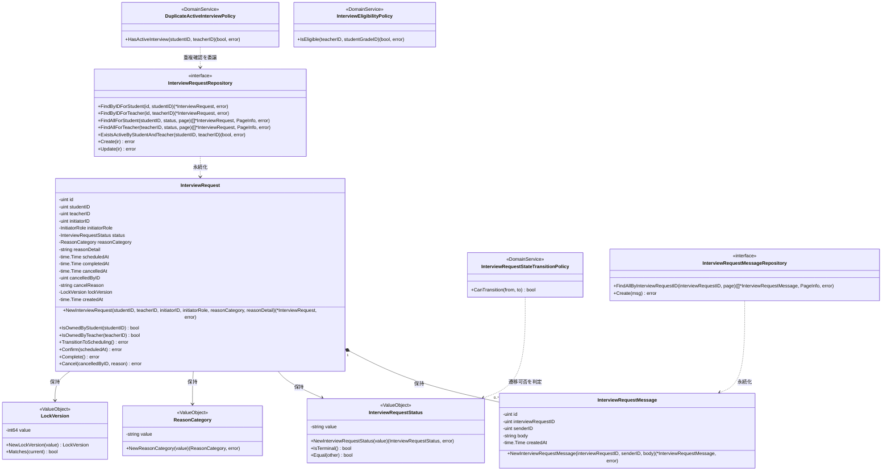
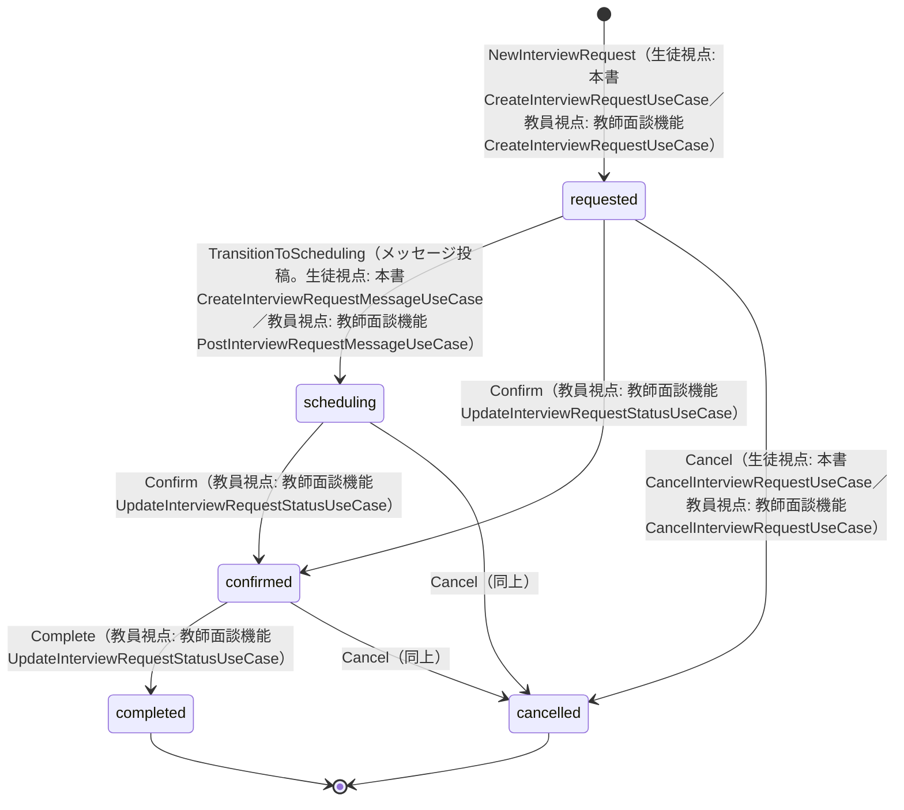
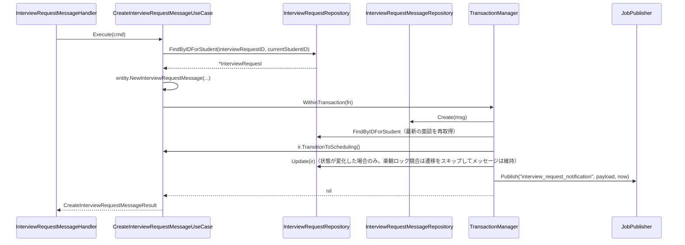
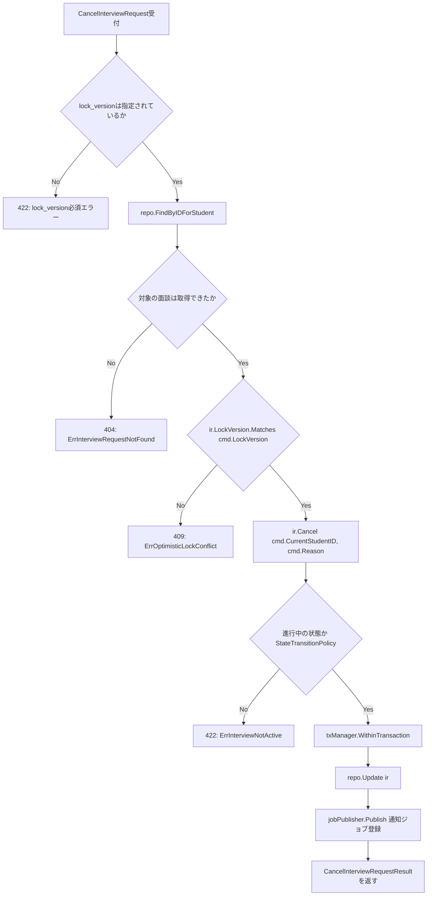

# 面談機能 Go実装仕様書

---

# 1. 機能概要

## 機能概要

生徒が担当教員に対して面談を申請し、教員とのメッセージのやり取りを通じて面談の実施を進める機能である。生徒視点で提供するのは、面談申請の一覧・詳細取得、新規申請、取り消し、メッセージの一覧・投稿の6操作である（②「1. 機能概要」）。

**本書の特別な位置づけ**: 本機能（面談機能）と教師面談機能は、同一のBounded Context（`interview-request`）・同一のAggregate（InterviewRequest）を扱う一体の業務領域である。②面談機能・②教師面談機能のいずれも同一のEntity設計・状態遷移ルールを前提とすると明記している（②「3. Bounded Context」「23. Railsとの責務対応」）ため、実際のGoコードでは同じpackage（`internal/interview/...`）にEntity・Value Object・Repository Interface・Repository実装が1セットのみ存在し、生徒向けUseCase/Handler（本書）と教師向けUseCase/Handler（教師面談機能_Go実装仕様書）がこれを共有する。そのため本書は、Domain層（Entity・Value Object・Repository Interface・Domain Service・Domain Event・Domain Error）とInfrastructure層（Repository実装）を、生徒視点・教員視点の両方の操作を包含する形で**正の文書として完全に定義する**。教師面談機能_Go実装仕様書は、本書で定義したDomain層・Infrastructure層をそのまま再利用し、教員向けのApplication層・Presentation層のみを追加で定義する。

## 採用設計パターンとその理由（②からの要約）

②「4. 設計パターン」により **Domain Model** を採用する。

- InterviewRequestは`requested`/`scheduling`/`confirmed`/`completed`/`cancelled`という5状態を持ち、許可される遷移の組み合わせが厳密に定義されている
- 楽観的排他制御（`lock_version`）による更新競合の検出、当事者制限、進行中面談の重複申請禁止など、複数の業務ルールがEntityに関連する
- 状態遷移ルールを生徒視点（本機能）・教員視点（教師面談機能）の双方から一貫して参照できるよう、ルールをEntity・Domain Serviceに集約する（②「4. 設計パターン」判断根拠、②「8. Domain Service」InterviewRequestStateTransitionPolicy）

Transaction Script／Active Record／Event Sourcingは②「4. 設計パターン」内で不採用と判断されており、本書もその判断を変更しない。

本書は、`規約/アーキテクチャ規約.md`「3. 設計パターンごとの構造適用方針」の **Domain Model** 節の構造（domain/application/infrastructure/presentationのフルレイヤー構成）に従って実装レベルへ落とし込む。

## 本書が対象とする実装範囲

- Bounded Context: `interview-request`（②「3. Bounded Context」）
- Domain層・Infrastructure層: 生徒視点・教員視点の両方の操作を包含する完全な定義（本書が正）
- Application層・Presentation層・API仕様: 生徒向け6 UseCase（一覧・詳細・新規申請・取消・メッセージ一覧・メッセージ投稿）のみ
- 対象外: 教員向けUseCase（確定・完了・教員視点の新規申請・キャンセル・メッセージ投稿）のApplication層・Presentation層は教師面談機能_Go実装仕様書の責務とする
- ①Rails実装の詳細は本タスクでは提供されていないため、参照が必要な箇所は「①未提供のため参照不可」として扱う

---

# 2. ディレクトリ構成

## 対象Bounded Context名

`interview-request`

## ②で採用した設計パターン

Domain Model（②「4. 設計パターン」）

## 採用パターンに対応する構造

`規約/アーキテクチャ規約.md`「3. 設計パターンごとの構造適用方針」Domain Model節、および「2. レイヤー責務と依存方向」に従い、標準のフルレイヤー構成（domain/application/infrastructure/presentation）を適用する。ただし本機能で不要なディレクトリは作成しない（具体的なディレクトリ構成は未定。アーキテクチャ規約「1. 全体方針」の注記を参照）。

- `domain/specification/`: 対象外（②に該当する記載がなく、Repository Interfaceの検索条件・Domain Serviceで業務ルールを表現できるため）
- `infrastructure/mail/` `infrastructure/cache/` `infrastructure/queue/`: 対象外。通知連携は規約「13. 非同期ジョブ実行パターン（JobQueue）」の共通基盤（`internal/shared/jobqueue`、本Context外）を利用するため、本Context配下には作成しない（詳細は「8. Infrastructure層設計」外部連携実装を参照）

**②からの補足（推測）**: Context名`interview-request`に対応する内部ディレクトリ名は②に明記がなく、アーキテクチャ規約側もディレクトリ構成が未定（アーキテクチャ規約「1. 全体方針」注記）である。既存③文書（タスク管理機能③）が`task-management`→`internal/task`のように2語目を省略した暫定名を採用した前例に倣い、本書でも`interview-request`→`internal/interview`を暫定的に採用する（詳細は「17. ②からの補足事項」参照）。

**②からの補足（本書固有の構造判断）**: 本機能は、同一Aggregate（InterviewRequest）を生徒視点（本書）・教員視点（教師面談機能）という2つの異なるUseCase/Handler群が操作するという、他の既存機能にはない構成を持つ。Application層・Presentation層をどちらか一方のpackageにまとめると、Go言語のstruct名重複（例：生徒視点・教員視点いずれも`CreateInterviewRequestUseCase`という名前が自然）が生じる。これを避けるため、Application層・Presentation層を`student`/`teacher`のサブパッケージへ分割する（詳細は「17. ②からの補足事項」参照）。Domain層・Infrastructure層は生徒視点・教員視点で共有するため分割しない。

## 作成するディレクトリ一覧

```
internal/interview/
├── domain/
│   ├── entity/
│   ├── valueobject/
│   ├── repository/
│   ├── service/
│   ├── event/
│   └── errors/
├── application/
│   ├── transaction_manager.go     # TransactionManager interface（生徒・教員向け両UseCaseが共有）
│   └── student/
│       ├── dto/
│       └── usecase/
├── infrastructure/
│   ├── persistence/
│   │   └── gorm/
│   └── repository/
└── presentation/
    └── student/
        ├── handler/
        ├── request/
        ├── response/
        └── routes.go
```

`application/teacher/`・`presentation/teacher/`は教師面談機能_Go実装仕様書が作成する（本書では作成しない）。

## 作成するファイル一覧

```
internal/interview/domain/entity/interview_request.go
internal/interview/domain/entity/interview_request_message.go

internal/interview/domain/valueobject/interview_request_status.go
internal/interview/domain/valueobject/reason_category.go
internal/interview/domain/valueobject/lock_version.go

internal/interview/domain/repository/interview_request_repository.go
internal/interview/domain/repository/interview_request_message_repository.go
internal/interview/domain/repository/teacher_assignment_repository.go
internal/interview/domain/repository/student_reference_repository.go
internal/interview/domain/repository/user_name_reference_repository.go
internal/interview/domain/repository/teacher_permission_reference_repository.go

internal/interview/domain/service/interview_request_state_transition_policy.go
internal/interview/domain/service/duplicate_active_interview_policy.go
internal/interview/domain/service/interview_eligibility_policy.go

internal/interview/domain/event/interview_requested.go
internal/interview/domain/event/interview_confirmed.go
internal/interview/domain/event/interview_cancelled.go
internal/interview/domain/event/interview_request_message_posted.go

internal/interview/domain/errors/errors.go

internal/interview/application/transaction_manager.go

internal/interview/application/student/dto/list_interview_requests_dto.go
internal/interview/application/student/dto/show_interview_request_dto.go
internal/interview/application/student/dto/create_interview_request_dto.go
internal/interview/application/student/dto/cancel_interview_request_dto.go
internal/interview/application/student/dto/list_interview_request_messages_dto.go
internal/interview/application/student/dto/create_interview_request_message_dto.go
internal/interview/application/student/dto/pagination_dto.go

internal/interview/application/student/usecase/list_interview_requests_usecase.go
internal/interview/application/student/usecase/show_interview_request_usecase.go
internal/interview/application/student/usecase/create_interview_request_usecase.go
internal/interview/application/student/usecase/cancel_interview_request_usecase.go
internal/interview/application/student/usecase/list_interview_request_messages_usecase.go
internal/interview/application/student/usecase/create_interview_request_message_usecase.go
internal/interview/application/student/usecase/errors.go

internal/interview/infrastructure/persistence/gorm/interview_request_model.go
internal/interview/infrastructure/persistence/gorm/interview_request_message_model.go

internal/interview/infrastructure/repository/interview_request_repository.go
internal/interview/infrastructure/repository/interview_request_message_repository.go
internal/interview/infrastructure/repository/teacher_assignment_repository.go
internal/interview/infrastructure/repository/student_reference_repository.go
internal/interview/infrastructure/repository/user_name_reference_repository.go
internal/interview/infrastructure/repository/teacher_permission_reference_repository.go
internal/interview/infrastructure/repository/transaction_manager.go

internal/interview/presentation/student/handler/interview_request_handler.go
internal/interview/presentation/student/handler/interview_request_message_handler.go
internal/interview/presentation/student/request/interview_request_request.go
internal/interview/presentation/student/response/interview_request_response.go
internal/interview/presentation/student/routes.go
```

---

# 3. Domain層設計

## Entity

### InterviewRequest（Aggregate Root）

②「6. Entity設計」InterviewRequestの責務を、生徒視点（本書）・教員視点（教師面談機能）双方の操作を反映して定義する。

- struct名: `InterviewRequest`
- 保持するフィールドと型:

|フィールド|型|意味|
|-|-|-|
|id|uint|面談申請ID|
|studentID|uint|対象生徒のユーザーID|
|teacherID|uint|対象教員のユーザーID|
|initiatorID|uint|申請者（生徒または教員）のユーザーID|
|initiatorRole|InitiatorRole|申請者区分（`student`/`teacher`。同一ファイル内で定義する軽量な独自型。②からの補足：型の具体的な表現は②に明記がないため本書で判断した。「17. ②からの補足事項」参照）|
|status|valueobject.InterviewRequestStatus|現在の状態|
|reasonCategory|*valueobject.ReasonCategory|相談理由の種別（生徒申請時のみ設定。教員申請時はnil）|
|reasonDetail|string|相談理由・申請理由の詳細|
|scheduledAt|*time.Time|面談予定日時（`confirmed`遷移時に設定）|
|completedAt|*time.Time|完了日時（`completed`のときのみ設定）|
|cancelledAt|*time.Time|取り消し日時（`cancelled`のときのみ設定）|
|cancelledByID|*uint|取り消しを行ったユーザーID|
|cancelReason|string|取り消し理由|
|lockVersion|valueobject.LockVersion|楽観的排他制御用の版数|
|createdAt|time.Time|作成日時（GORM自動設定。Gorm規約「タイムスタンプのトラッキング」）|

- 公開method一覧（実装ロジックは記載しない）:

|メソッド|引数|戻り値|責務|
|-|-|-|-|
|`NewInterviewRequest`|`(studentID, teacherID, initiatorID uint, initiatorRole InitiatorRole, reasonCategory *valueobject.ReasonCategory, reasonDetail string)`|`(*InterviewRequest, error)`|新規申請時の不変条件（申請者区分に応じた相談理由の要否、初期status=requested）を保証するファクトリ（両②「6. Entity設計」ライフサイクル: 作成（requested）→…、②「7. Value Object設計」ReasonCategory独自ルール）|
|`ID` / `StudentID` / `TeacherID` / `InitiatorID` / `InitiatorRole` / `Status` / `ReasonCategory` / `ReasonDetail` / `ScheduledAt` / `CompletedAt` / `CancelledAt` / `CancelledByID` / `CancelReason` / `LockVersion` / `CreatedAt`|なし|各フィールドの型|各フィールドの参照系アクセサ|
|`IsOwnedByStudent`|`studentID uint`|`bool`|指定ユーザーが対象生徒本人かどうかを判定する（面談機能②「16. Authorization設計」UseCase：当事者制限）|
|`IsOwnedByTeacher`|`teacherID uint`|`bool`|指定ユーザーが担当教員本人かどうかを判定する（教師面談機能②「16. Authorization設計」UseCase：担当教師スコープ）|
|`TransitionToScheduling`|なし|`error`|メッセージ投稿を契機に`requested`→`scheduling`へ遷移する。`InterviewRequestStateTransitionPolicy`で許可判定を行い、許可されない場合（`requested`以外からの呼び出し等）は何もしない（冪等）。生徒・教員いずれの視点からのメッセージ投稿でも共通して呼び出される（両②「6. Entity設計」状態変化）|
|`Confirm`|`scheduledAt time.Time`|`error`|`requested`/`scheduling`→`confirmed`へ遷移し、`ScheduledAt`を設定する。`InterviewRequestStateTransitionPolicy`による遷移可否判定を行う（教師面談機能②「6. Entity設計」`confirmed`遷移時は`scheduled_at`の指定を必須とする）。教員視点の操作からのみ呼び出される想定（呼び出し元の権限確認は教師面談機能側のUseCaseが担う）|
|`Complete`|なし|`error`|`confirmed`→`completed`へ遷移し、`CompletedAt`に現在時刻を設定する。`InterviewRequestStateTransitionPolicy`による遷移可否判定を行う。教員視点の操作からのみ呼び出される想定|
|`Cancel`|`cancelledByID uint, reason string`|`error`|`requested`/`scheduling`/`confirmed`→`cancelled`へ遷移し、`CancelledAt`に現在時刻・`CancelledByID`・`CancelReason`を設定する。`InterviewRequestStateTransitionPolicy`による遷移可否判定を行う。生徒視点（本書）・教員視点（教師面談機能）いずれからも呼び出される共通メソッド（両②「10. 状態遷移図」`requested`/`scheduling`/`confirmed`→`cancelled`）|

- 不変条件（`NewInterviewRequest`で保証する内容）:
  - StudentID・TeacherID・InitiatorIDは0を許容しない
  - `initiatorRole`が`student`の場合、`reasonCategory`は必須（面談機能②「7. Value Object設計」ReasonCategory独自ルール）
  - `initiatorRole`が`teacher`の場合、`reasonCategory`はnilでなければならない（教師面談機能②「7. Value Object設計」ReasonCategory独自ルール：「`initiator_role=teacher`の場合は値を持たない」）
  - 生成直後のStatusは常に`InterviewRequestStatus`の`requested`
  - 生成直後のScheduledAt・CompletedAt・CancelledAt・CancelledByIDは常にnil
  - 生成直後のLockVersionは初期値（0または1。「17. ②からの補足事項」参照）

`InitiatorRole`は`interview_request.go`内で以下のように定義する（②に明記のない軽量な独自型としての実装判断。**②からの補足**）。

```go
type InitiatorRole string

const (
    InitiatorRoleStudent InitiatorRole = "student"
    InitiatorRoleTeacher InitiatorRole = "teacher"
)
```

### InterviewRequestMessage（Aggregate内Entity）

②「6. Entity設計」InterviewRequestMessageの責務を反映する。

- struct名: `InterviewRequestMessage`
- 保持するフィールドと型:

|フィールド|型|意味|
|-|-|-|
|id|uint|メッセージID|
|interviewRequestID|uint|従属するInterviewRequestのID|
|senderID|uint|送信者（生徒または教員）のユーザーID|
|body|string|本文|
|createdAt|time.Time|投稿日時（GORM自動設定）|

- 公開method一覧:

|メソッド|引数|戻り値|責務|
|-|-|-|-|
|`NewInterviewRequestMessage`|`(interviewRequestID, senderID uint, body string)`|`(*InterviewRequestMessage, error)`|新規メッセージ生成時の不変条件（本文非空）を保証するファクトリ|
|`ID` / `InterviewRequestID` / `SenderID` / `Body` / `CreatedAt`|なし|各フィールドの型|各フィールドの参照系アクセサ|

- 不変条件（`NewInterviewRequestMessage`で保証する内容）: `body`は空文字列を許容しない。文字数上限（2000文字以内）はPresentation層で検証するため、Entity側は非空チェックのみを行う（両②「15. Validation設計」バリデーション仕様: `body`はPresentation層で必須・2000文字以内を検証）。送信者・投稿対象がAggregateの当事者であることは、生成前にUseCase側（当事者確認済みのInterviewRequestを取得した上でのみ呼び出す構造）で担保するため、Entity自体は検証しない（両②「6. Entity設計」ライフサイクル: 作成のみ）

## Value Object

### InterviewRequestStatus

- struct名: `InterviewRequestStatus`（内部は`string`をラップ）
- 保持するフィールド: 内部値（`requested`/`scheduling`/`confirmed`/`completed`/`cancelled`のいずれか）
- 生成時に検証するルール: `NewInterviewRequestStatus(value string) (InterviewRequestStatus, error)`で、5つの定義済み値のいずれか以外はDomain Errorとする（両②「7. Value Object設計」InterviewRequestStatus）
- 公開method一覧:

|メソッド|引数|戻り値|責務|
|-|-|-|-|
|`String`|なし|`string`|文字列表現を返す|
|`IsTerminal`|なし|`bool`|`completed`/`cancelled`（終了状態）かどうかを返す（両②「10. 状態遷移図」禁止される組み合わせ：終了状態からの遷移は一切許可されない）|
|`Equal`|`other InterviewRequestStatus`|`bool`|同一の状態かどうかを比較する|

パッケージレベルの定数的な値として`StatusRequested` / `StatusScheduling` / `StatusConfirmed` / `StatusCompleted` / `StatusCancelled`（いずれも`InterviewRequestStatus`型の値を返す関数、または生成済みの値）を公開し、Entity・Domain Serviceから参照する。

### ReasonCategory

- struct名: `ReasonCategory`（内部は`string`をラップ）
- 保持するフィールド: 内部値（`study_method`/`study_plan`/`academic_performance`/`career`/`school_life`/`mental`/`other`のいずれか）
- 生成時に検証するルール: `NewReasonCategory(value string) (ReasonCategory, error)`で、7つの定義済み種別のいずれか以外はDomain Errorとする（両②「7. Value Object設計」ReasonCategory）。「生徒申請時は必須・教員申請時は指定不可」という申請者区分に応じたルールは、VO自体ではなく`InterviewRequest.NewInterviewRequest`（Entityファクトリ）側で検証する（VOは値そのものの妥当性のみを担当し、Entity側でどのフィールドと組み合わせて使うかを判定する責務分離。両②「7. Value Object設計」Entity属性ではなくValue Objectにする理由を踏まえた実装判断）
- 公開method一覧: `String() string`

### LockVersion

- struct名: `LockVersion`（内部は`int64`をラップ）
- 保持するフィールド: 内部値（版数）
- 生成時に検証するルール: `NewLockVersion(value int64) LockVersion`は負数を許容しない。楽観的排他制御の判定は`Matches`メソッドで表現する（両②「7. Value Object設計」LockVersion）
- 公開method一覧:

|メソッド|引数|戻り値|責務|
|-|-|-|-|
|`Value`|なし|`int64`|内部値を返す|
|`Matches`|`current LockVersion`|`bool`|自身（クライアントから提示された版数）が、現在の版数（引数）と一致するかどうかを判定する（両②「7. Value Object設計」LockVersion独自ルール：「表示時点の版数と現在の版数が一致するか」）|

Gorm規約「12. 楽観ロック（Optimistic Locking）」の「Domain EntityとGORMモデルの分離」により、Domain層は`optimisticlock.Version`型（GORM依存）を直接保持せず、上記のプレーンな`LockVersion`型で保持する。Repository実装側で相互変換する（「8. Infrastructure層設計」参照）。

## Value Objectを採用しないもの

- 相談理由の詳細（`reason_detail`）・メッセージ本文（`body`）: 文字数制限（2000文字以内）はあるが、表示用の文字列そのものであり独自の比較・変換ロジックを持たないためValue Object化は不要とする（両②「7. Value Object設計」Value Objectを採用しないもの）

## Repository Interface

### InterviewRequestRepository

②「11. Repository設計」InterviewRequestRepository（面談機能②）・InterviewRequestRepository（教師面談機能②）の責務を、生徒視点・教員視点双方の検索条件を含めて統合する。

- interface名: `InterviewRequestRepository`
- メソッドシグネチャ一覧:

```go
type InterviewRequestRepository interface {
    FindByIDForStudent(ctx context.Context, id, studentID uint) (*entity.InterviewRequest, error)
    FindByIDForTeacher(ctx context.Context, id, teacherID uint) (*entity.InterviewRequest, error)
    FindAllForStudent(ctx context.Context, studentID uint, status *valueobject.InterviewRequestStatus, page dto.PageRequest) ([]*entity.InterviewRequest, dto.PageInfo, error)
    FindAllForTeacher(ctx context.Context, teacherID uint, status *valueobject.InterviewRequestStatus, page dto.PageRequest) ([]*entity.InterviewRequest, dto.PageInfo, error)
    ExistsActiveByStudentAndTeacher(ctx context.Context, studentID, teacherID uint) (bool, error)
    Create(ctx context.Context, ir *entity.InterviewRequest) error
    Update(ctx context.Context, ir *entity.InterviewRequest) error
}
```

- 各メソッドの責務:

|メソッド|責務|
|-|-|
|FindByIDForStudent|対象生徒が当事者となっている面談申請を単一取得する（面談機能②「11. Repository設計」所有者スコープ、②「12. UseCase設計」ShowInterviewRequest/CancelInterviewRequest/CreateInterviewRequestMessage等の入口）。該当しない場合はApplication Error（「6. Application層設計」参照）に変換する前提で、Repository自体はnotfound相当のエラーを返す|
|FindByIDForTeacher|対象教員が担当教員となっている面談申請を単一取得する（教師面談機能②「11. Repository設計」）|
|FindAllForStudent|`student_id`一致、`status`指定時のみ絞り込み、作成日時降順、ページネーション（面談機能②「11. Repository設計」保持する検索機能）|
|FindAllForTeacher|`teacher_id`一致、`status`指定時のみ絞り込み、申請日時降順、ページネーション（教師面談機能②「11. Repository設計」保持する検索機能）|
|ExistsActiveByStudentAndTeacher|`student_id` + `teacher_id` + 進行中状態（`requested`/`scheduling`/`confirmed`）による重複確認（両②「11. Repository設計」重複確認検索。`DuplicateActiveInterviewPolicy`から呼び出される）|
|Create|新規InterviewRequestを永続化する|
|Update|状態・日程・完了日時・取り消し情報・版数を楽観的排他制御付きで更新する（Gorm規約「12. 楽観ロック」の`RowsAffected == 0`判定により`domainerror.ErrOptimisticLockConflict`を返す）|

- 保持しない責務: 状態遷移の許可判定（`InterviewRequestStateTransitionPolicy`の責務）、当事者判定そのもの（Entityの責務。Repositoryは検索条件としてIDスコープを付与するのみ）（両②「11. Repository設計」保持しない責務）

### InterviewRequestMessageRepository

- interface名: `InterviewRequestMessageRepository`
- メソッドシグネチャ一覧:

```go
type InterviewRequestMessageRepository interface {
    FindAllByInterviewRequestID(ctx context.Context, interviewRequestID uint, page dto.PageRequest) ([]*entity.InterviewRequestMessage, dto.PageInfo, error)
    Create(ctx context.Context, msg *entity.InterviewRequestMessage) error
}
```

- 各メソッドの責務:

|メソッド|責務|
|-|-|
|FindAllByInterviewRequestID|`interview_request_id`一致、投稿日時昇順、ページネーション（両②「11. Repository設計」）|
|Create|新規メッセージを永続化する|

- 保持しない責務: メッセージ投稿に伴う面談状態の更新（UseCase・InterviewRequestの責務。両②「11. Repository設計」）

### TeacherAssignmentRepository（参照用、School Context）

- interface名: `TeacherAssignmentRepository`
- メソッドシグネチャ一覧:

```go
type TeacherAssignmentRepository interface {
    IsAssignedToStudent(ctx context.Context, teacherID, studentID uint) (bool, error)
}
```

- 責務: 指定教員が指定生徒の所属クラスを担当しているかどうかを確認する（面談機能②「11. Repository設計」TeacherAssignmentRepository）。生徒視点の新規申請（本書）から利用する。教員情報自体の作成・更新は保持しない

### StudentReferenceRepository（参照用、User Context）

- interface名: `StudentReferenceRepository`
- メソッドシグネチャ一覧:

```go
type StudentReferenceRepository interface {
    Exists(ctx context.Context, studentID uint) (bool, error)
    GradeIDOf(ctx context.Context, studentID uint) (uint, error)
}
```

- 責務: 教員視点の新規申請時に、対象生徒の存在確認・学年情報の取得を提供する（教師面談機能②「11. Repository設計」外部参照Repository（Student / TeacherPermission）、教師面談機能②「12. UseCase設計」CreateInterviewRequestUseCase）。教員視点でのみ利用するが、Domain層は生徒視点・教員視点で共有するため本書で定義する

### UserNameReferenceRepository（参照用、User Context）

- interface名: `UserNameReferenceRepository`
- メソッドシグネチャ一覧:

```go
type UserNameReferenceRepository interface {
    FindNamesByIDs(ctx context.Context, userIDs []uint) (map[uint]string, error)
}
```

- 責務: 面談の一覧・詳細に含める生徒名・教員名、およびメッセージの送信者名を、ユーザーIDから解決して返す（氏名は面談側に複製せず、表示時に解決する。②「3. Bounded Context」の「User Context」への依存。`ユーザー基盤機能_Go移行・設計仕様書.md`「3. Bounded Context」の集約表で、面談・教師面談が「メッセージ送信者名の表示」のために`GetUserAttributes`（複数ID）を参照するとされているものと同じ参照手段を、生徒名・教員名の表示にも用いる）。存在しないIDは結果に含めない。生徒視点・教員視点の双方から利用する

### TeacherPermissionReferenceRepository（参照用、Teacher Permission Context）

- interface名: `TeacherPermissionReferenceRepository`
- メソッドシグネチャ一覧:

```go
type TeacherPermissionReferenceRepository interface {
    IsOwnGradeScope(ctx context.Context, teacherID uint) (bool, error)
    OwnGradeID(ctx context.Context, teacherID uint) (uint, error)
}
```

- 責務: 教員が担当学年制限（`own_grade`）を持つかどうか、持つ場合の担当学年IDを取得する（教師面談機能②「11. Repository設計」、教師面談機能②「8. Domain Service」InterviewEligibilityPolicy）。教員視点でのみ利用する

**②からの補足（推測）**: 上記4つの参照用Repository（TeacherAssignmentRepository / StudentReferenceRepository / UserNameReferenceRepository / TeacherPermissionReferenceRepository）の具体的なメソッド名・シグネチャは、いずれの②にも責務の記載のみで明記がないため、コーディング規約「5. インターフェース」（利用側で定義する）・アーキテクチャ規約「6. Context間連携ルール」に従って実装のために補った。

## Domain Service

### InterviewRequestStateTransitionPolicy

- struct名: `InterviewRequestStateTransitionPolicy`
- コンストラクタ: `NewInterviewRequestStateTransitionPolicy() *InterviewRequestStateTransitionPolicy`（依存を持たない）
- メソッドシグネチャ:

```go
func (p *InterviewRequestStateTransitionPolicy) CanTransition(from, to valueobject.InterviewRequestStatus) bool
```

- 責務: 現在の状態と遷移先の状態の組み合わせが許可されるかどうかを判定する（両②「10. 状態遷移図」の遷移条件・禁止される組み合わせを集約する）。許可される組み合わせ: `requested→scheduling`、`requested/scheduling→confirmed`、`confirmed→completed`、`requested/scheduling/confirmed→cancelled`。それ以外はすべて`false`を返す
- 判断根拠: 面談機能②「8. Domain Service」のとおり、遷移ルールが生徒視点・教員視点それぞれの操作から呼び出される横断的な業務ルールであり、どちらか一方の機能に暗黙的に埋め込むと、もう一方の機能でルールが食い違うリスクがあるため独立させる
- 利用方法: `InterviewRequest`の`TransitionToScheduling` / `Confirm` / `Complete` / `Cancel`メソッド内部から、同一`domain`パッケージ内の依存として呼び出す（Domain層内部の依存であり、アーキテクチャ規約「2. レイヤー責務と依存方向」の禁止事項（Domainが外部レイヤーに依存すること）には抵触しない）

### DuplicateActiveInterviewPolicy

- struct名: `DuplicateActiveInterviewPolicy`
- コンストラクタ: `NewDuplicateActiveInterviewPolicy(repo repository.InterviewRequestRepository) *DuplicateActiveInterviewPolicy`
- メソッドシグネチャ:

```go
func (p *DuplicateActiveInterviewPolicy) HasActiveInterview(ctx context.Context, studentID, teacherID uint) (bool, error)
```

- 責務: 同じ生徒・教員の組み合わせで、進行中（`requested`/`scheduling`/`confirmed`）の面談が既に存在しないかを判定する（両②「8. Domain Service」DuplicateActiveInterviewPolicy）。内部で`InterviewRequestRepository.ExistsActiveByStudentAndTeacher`を呼び出す
- 判断根拠: 判定には対象の生徒・教員に紐づく他のInterviewRequestの検索結果が必要であり、単一のInterviewRequestの属性だけでは完結しないため（両②「8. Domain Service」）。生徒視点（本書）・教員視点（教師面談機能）いずれの新規申請UseCaseからも呼び出される共通ルールとして一箇所に集約する

### InterviewEligibilityPolicy

- struct名: `InterviewEligibilityPolicy`
- コンストラクタ: `NewInterviewEligibilityPolicy(permissionRepo repository.TeacherPermissionReferenceRepository) *InterviewEligibilityPolicy`
- メソッドシグネチャ:

```go
func (p *InterviewEligibilityPolicy) IsEligible(ctx context.Context, teacherID, studentGradeID uint) (bool, error)
```

- 責務: 教員が新規申請できる相手の生徒かどうか（教員の閲覧権限範囲内の生徒か）を判定する（教師面談機能②「8. Domain Service」InterviewEligibilityPolicy）。`own_grade`権限制約を持つ教員が、自身の担当学年以外の生徒を指定していないかを判定する
- 判断根拠: 判定には教員の権限情報（Teacher Permission Context）という、InterviewRequest単体では保持しない外部情報が必要なため（教師面談機能②「8. Domain Service」）。教員視点の新規申請（教師面談機能）でのみ利用するが、Domain層は生徒視点・教員視点で共有するため本書で定義する

## クラス図

「4. クラス図」を参照。

## Domain Event

両②で採否が分かれるため、それぞれの機能の操作単位で明記する。

- 生徒視点の本書が扱う6 UseCase（ListInterviewRequests / ShowInterviewRequest / CreateInterviewRequest / CancelInterviewRequest / ListInterviewRequestMessages / CreateInterviewRequestMessage）は、面談機能②「18. Domain Event」のとおりDomain Eventを**採用しない**。相手方への通知は規約「13. 非同期ジョブ実行パターン（JobQueue）」に従い、UseCaseから`JobPublisher`を直接呼び出す（「6. Application層設計」「8. Infrastructure層設計」参照）
- 教員視点の操作（教師面談機能が扱う7 UseCase）は、教師面談機能②「18. Domain Event」のとおりDomain Eventを**採用する**。理由は、申請・確定・キャンセル・メッセージ投稿という4つの異なる状態変化それぞれについて非同期通知が必要であり、規約「13. 非同期ジョブ実行パターン」の「ベストエフォートで良い処理」（ゴルーチン起動）で実現するためである（教師面談機能②「18. Domain Event」採用理由）

Domain Model採用時のドメイン層（`domain/event/`）は生徒視点・教員視点で共有されるディレクトリであるため、教員視点が必要とするイベントstructの定義は本書で行う（発火・購読の実装自体は教師面談機能_Go実装仕様書の責務）。

|イベントstruct名|保持するフィールド|発火元|
|-|-|-|
|`InterviewRequested`|`InterviewRequestID uint`, `StudentID uint`, `TeacherID uint`, `InitiatorRole string`, `OccurredAt time.Time`|教師面談機能側`CreateInterviewRequestUseCase`（教員による新規申請の永続化完了直後）|
|`InterviewConfirmed`|`InterviewRequestID uint`, `StudentID uint`, `TeacherID uint`, `ScheduledAt time.Time`, `OccurredAt time.Time`|教師面談機能側`UpdateInterviewRequestStatusUseCase`（`confirmed`への更新完了直後）|
|`InterviewCancelled`|`InterviewRequestID uint`, `StudentID uint`, `TeacherID uint`, `CancelledByID uint`, `OccurredAt time.Time`|教師面談機能側`CancelInterviewRequestUseCase`（キャンセル完了直後）|
|`InterviewRequestMessagePosted`|`InterviewRequestID uint`, `SenderID uint`, `RecipientID uint`, `OccurredAt time.Time`|教師面談機能側`PostInterviewRequestMessageUseCase`（メッセージ作成完了直後）|

**②からの補足**: 各イベントの保持フィールドは、教師面談機能②「19. API仕様」・「3. Bounded Context」で記載された通知先情報（相手方生徒・お知らせ実体作成に必要な当事者情報）から実装のために補った（②はイベント名・発火タイミング・利用目的のみを明記しており、フィールド構成までは明記していない。推測）。

## Domain Error

`domain/errors/errors.go`に、`errors.New`によるセンチネルエラー変数として定義する（コーディング規約の`errors.New`利用方針、既存③文書の実装パターンに準拠）。楽観的排他制御の競合エラーは、Gorm規約「12. 楽観ロック（Optimistic Locking）」の方針により共有の`domainerror.ErrOptimisticLockConflict`（配置例: `internal/shared/domainerror`）を用い、本Contextでは独自定義しない。

|変数名|発生条件|対応する②の記載|
|-|-|-|
|`ErrInvalidStatusTransition`|`InterviewRequestStateTransitionPolicy.CanTransition`が許可しない状態遷移が`TransitionToScheduling`/`Confirm`/`Complete`/`Cancel`で試みられた場合|両②「17. Error設計」不正な状態遷移|
|`ErrScheduledAtRequired`|`Confirm`呼び出し時に`scheduledAt`のゼロ値が渡された場合|教師面談機能②「17. Error設計」confirmed遷移時のscheduled_at未指定|
|`ErrInterviewNotActive`|進行中（`requested`/`scheduling`/`confirmed`）でない面談に対して`Cancel`、またはメッセージ投稿（`TransitionToScheduling`の前提となる投稿可否判定）が試みられた場合|面談機能②「17. Error設計」進行中でない面談を取り消そうとした・終了済みの面談にメッセージを投稿しようとした、教師面談機能②「17. Error設計」進行中でない面談のキャンセル・メッセージ投稿における進行中判定|
|`ErrDuplicateActiveInterview`|`DuplicateActiveInterviewPolicy.HasActiveInterview`が`true`を返した状態で新規申請が試みられた場合|両②「17. Error設計」進行中の面談が既に存在する・同一生徒・教師で進行中の面談が重複|
|`ErrTeacherNotAssigned`|生徒視点の新規申請で、指定教員が生徒の所属クラスの担当教員でない場合|面談機能②「17. Error設計」申請先教員が担当教員でない|
|`ErrStudentOutOfEligibleScope`|教員視点の新規申請で、`InterviewEligibilityPolicy.IsEligible`が`false`を返した場合|教師面談機能②「17. Error設計」閲覧権限範囲外の生徒への新規申請|
|`ErrReasonCategoryRequirementViolation`|`NewInterviewRequest`で、`initiatorRole=student`のとき`reasonCategory`が未指定、または`initiatorRole=teacher`のとき`reasonCategory`が指定されていた場合|両②「7. Value Object設計」ReasonCategory独自ルール|
|`ErrInvalidReasonCategory`|`NewReasonCategory`で定義済み7種別以外の値が指定された場合|両②「7. Value Object設計」ReasonCategory|
|`ErrInvalidInterviewRequestStatus`|`NewInterviewRequestStatus`で定義済み5状態以外の値が指定された場合|両②「7. Value Object設計」InterviewRequestStatus|

---

# 4. クラス図



「3. Domain層設計」のstruct/interface定義をそのまま反映した。両②「9. クラス図」より具体化し、教員視点の操作（Confirm/Complete）を含めてEntityのメソッドとして統合している。

---

# 5. 状態遷移図

InterviewRequest.statusは以下の状態を持つ（両②「10. 状態遷移図」を統合したもの）。生徒視点の本書で実行される遷移と、教員視点（教師面談機能）で実行される遷移の両方を、実際に定義したEntityメソッド名で示す。



`InterviewRequestStateTransitionPolicy.CanTransition`が上記の遷移パターンのみを許可し、`completed`・`cancelled`（終了状態）からの遷移は一切許可しない（両②「10. 状態遷移図」禁止される組み合わせ）。本書（生徒向け）が実際に呼び出すのは`NewInterviewRequest`・`TransitionToScheduling`・`Cancel`のみであり、`Confirm`・`Complete`は教師面談機能側のUseCaseからのみ呼び出される。

---

# 6. Application層設計

本節は生徒向け6 UseCaseのみを記載する。教員向けUseCaseは教師面談機能_Go実装仕様書「6. Application層設計」を参照。

## DTO（Command / Query）

`internal/interview/application/student/dto/`に配置する。

|struct名|フィールドと型|Command/Query区分|
|-|-|-|
|`ListInterviewRequestsQuery`|`CurrentStudentID uint`, `Status *string`, `Page dto.PageRequest`|Query|
|`ShowInterviewRequestQuery`|`CurrentStudentID uint`, `InterviewRequestID uint`|Query|
|`CreateInterviewRequestCommand`|`CurrentStudentID uint`, `TeacherID uint`, `ReasonCategory string`, `ReasonDetail string`|Command|
|`CancelInterviewRequestCommand`|`CurrentStudentID uint`, `InterviewRequestID uint`, `LockVersion int64`, `Reason string`|Command|
|`ListInterviewRequestMessagesQuery`|`CurrentStudentID uint`, `InterviewRequestID uint`, `Page dto.PageRequest`|Query|
|`CreateInterviewRequestMessageCommand`|`CurrentStudentID uint`, `InterviewRequestID uint`, `Body string`|Command|
|`PageRequest`|`Page int`, `PerPage int`|Query（一覧系Queryの内包型）|
|`PageInfo`|`Page int`, `PerPage int`, `TotalCount int`, `TotalPages int`|Query（一覧系Resultの内包型）|
|`InterviewRequestListItem`|`ID uint`, `StudentID uint`, `StudentName string`, `TeacherID uint`, `TeacherName string`, `Status string`, `ReasonCategory *string`, `ScheduledAt *time.Time`, `CreatedAt time.Time`|Query（Result内包型）|
|`ListInterviewRequestsResult`|`Items []InterviewRequestListItem`, `PageInfo PageInfo`|Query|
|`InterviewRequestDetailResult`|`ID uint`, `StudentID uint`, `StudentName string`, `TeacherID uint`, `TeacherName string`, `Status string`, `ReasonCategory *string`, `ReasonDetail string`, `ScheduledAt *time.Time`, `CompletedAt *time.Time`, `CancelledAt *time.Time`, `CancelReason string`, `LockVersion int64`, `CreatedAt time.Time`|Query|
|`CreateInterviewRequestResult`|`ID uint`, `Message string`|Command|
|`CancelInterviewRequestResult`|`Message string`|Command|
|`InterviewRequestMessageItem`|`ID uint`, `SenderID uint`, `SenderName string`, `Body string`, `CreatedAt time.Time`|Query（Result内包型）|
|`ListInterviewRequestMessagesResult`|`Items []InterviewRequestMessageItem`, `PageInfo PageInfo`|Query|
|`CreateInterviewRequestMessageResult`|`ID uint`, `SenderID uint`, `SenderName string`, `Body string`, `CreatedAt time.Time`|Command|

**②からの補足**: フィールド構成は面談機能②「12. UseCase設計」の入力・出力記述、②「19. API仕様」のリクエスト・レスポンス記述を根拠に具体化した（推測。①未提供のため参照不可）。ただし、生徒名・教員名・送信者名（`StudentName` / `TeacherName` / `SenderName`）を保持する点は、Rails現行の`InterviewRequestSerializer`（`student_id` / `student_name` / `teacher_id` / `teacher_name`を返す）・`InterviewRequestMessageSerializer`（`sender_id` / `sender_name`を返す）で確認した事実に基づく（推測ではない）。氏名は`UserNameReferenceRepository`で表示時に解決する。

## UseCase

### ListInterviewRequestsUseCase

- struct名: `ListInterviewRequestsUseCase`
- コンストラクタが受け取る依存: `repo repository.InterviewRequestRepository`, `userNameRepo repository.UserNameReferenceRepository`
- 公開メソッドのシグネチャ: `Execute(ctx context.Context, query dto.ListInterviewRequestsQuery) (dto.ListInterviewRequestsResult, error)`
- 処理ステップ:
  1. `query.Status`が指定されていれば`valueobject.NewInterviewRequestStatus`でVOへ変換する
  2. `repo.FindAllForStudent(ctx, query.CurrentStudentID, status, query.Page)`を呼び出す
  3. 取得したEntity群の生徒ID・教員IDをまとめて`userNameRepo.FindNamesByIDs`に渡し、氏名を一括で解決する（1件ずつ問い合わせない）
  4. 取得したEntity群と解決した氏名から`dto.ListInterviewRequestsResult`を組み立てて返す
- トランザクション境界: 読み取りのみのためトランザクションは使用しない（面談機能②「14. Transaction設計」）
- 発生しうるApplication Error: なし（一覧取得自体は失敗しない前提。Infrastructure Errorはそのまま上位へ伝播する）

### ShowInterviewRequestUseCase

- struct名: `ShowInterviewRequestUseCase`
- コンストラクタが受け取る依存: `repo repository.InterviewRequestRepository`, `userNameRepo repository.UserNameReferenceRepository`
- 公開メソッドのシグネチャ: `Execute(ctx context.Context, query dto.ShowInterviewRequestQuery) (dto.InterviewRequestDetailResult, error)`
- 処理ステップ:
  1. `repo.FindByIDForStudent(ctx, query.InterviewRequestID, query.CurrentStudentID)`を呼び出す
  2. 取得できなければ`ErrInterviewRequestNotFound`（Application Error）を返す
  3. 生徒ID・教員IDを`userNameRepo.FindNamesByIDs`に渡して氏名を解決する
  4. 取得したEntityと解決した氏名から`dto.InterviewRequestDetailResult`を組み立てて返す
- トランザクション境界: 読み取りのみのためトランザクションは使用しない
- 発生しうるApplication Error: `ErrInterviewRequestNotFound`（対象面談が存在しない、または自分が当事者でない）

### CreateInterviewRequestUseCase

- struct名: `CreateInterviewRequestUseCase`
- コンストラクタが受け取る依存: `repo repository.InterviewRequestRepository`, `teacherAssignmentRepo repository.TeacherAssignmentRepository`, `dupPolicy *service.DuplicateActiveInterviewPolicy`, `txManager application.TransactionManager`, `jobPublisher jobqueue.JobPublisher`（規約「13. 非同期ジョブ実行パターン」。配置は「8. Infrastructure層設計」参照）
- 公開メソッドのシグネチャ: `Execute(ctx context.Context, cmd dto.CreateInterviewRequestCommand) (dto.CreateInterviewRequestResult, error)`
- 処理ステップ:
  1. `teacherAssignmentRepo.IsAssignedToStudent(ctx, cmd.TeacherID, cmd.CurrentStudentID)`で指定教員が担当教員か確認する。`false`の場合`ErrTeacherNotAssigned`（Domain Error）を返す（面談機能②「12. UseCase設計」CreateInterviewRequest呼び出すRepository: TeacherAssignmentRepository）
  2. `valueobject.NewReasonCategory(cmd.ReasonCategory)`でVOを生成する
  3. `dupPolicy.HasActiveInterview(ctx, cmd.CurrentStudentID, cmd.TeacherID)`で重複を確認する。`true`の場合`ErrDuplicateActiveInterview`（Domain Error）を返す
  4. `entity.NewInterviewRequest(cmd.CurrentStudentID, cmd.TeacherID, cmd.CurrentStudentID, entity.InitiatorRoleStudent, &reasonCategory, cmd.ReasonDetail)`でAggregateを生成する
  5. `txManager.WithinTransaction`内で、`repo.Create(ctx, ir)`による永続化と、`jobPublisher.Publish(ctx, "interview_request_notification", payload, time.Now())`によるジョブ登録を行う（規約「13. 非同期ジョブ実行パターン」Transactional Outboxパターン。面談機能②「14. Transaction設計」相手方への通知は業務データの書き込みと同一トランザクション内でジョブとして登録する）
  6. `dto.CreateInterviewRequestResult`を返す
- トランザクション境界: 担当教員確認・重複申請確認はトランザクション外（読み取りのみ）で行い、InterviewRequestの作成とジョブ登録を1トランザクションで扱う（面談機能②「14. Transaction設計」）
- 発生しうるDomain Error: `ErrTeacherNotAssigned` / `ErrDuplicateActiveInterview` / `ErrReasonCategoryRequirementViolation` / `ErrInvalidReasonCategory`

### CancelInterviewRequestUseCase

- struct名: `CancelInterviewRequestUseCase`
- コンストラクタが受け取る依存: `repo repository.InterviewRequestRepository`, `txManager application.TransactionManager`, `jobPublisher jobqueue.JobPublisher`
- 公開メソッドのシグネチャ: `Execute(ctx context.Context, cmd dto.CancelInterviewRequestCommand) (dto.CancelInterviewRequestResult, error)`
- 処理ステップ:
  1. `repo.FindByIDForStudent(ctx, cmd.InterviewRequestID, cmd.CurrentStudentID)`で対象を取得する。取得できなければ`ErrInterviewRequestNotFound`（Application Error）を返す
  2. `ir.LockVersion().Matches(valueobject.NewLockVersion(cmd.LockVersion))`で事前に版数の一致を確認する。不一致の場合は`domainerror.ErrOptimisticLockConflict`を返す（早期検出。最終的な競合検出はGorm規約「12. 楽観ロック」の`Update`側`RowsAffected`判定で担保する）
  3. `ir.Cancel(cmd.CurrentStudentID, cmd.Reason)`を呼び出す。進行中でない場合は`ErrInterviewNotActive`（Domain Error）、許可されない遷移の場合は`ErrInvalidStatusTransition`（Domain Error）が返る
  4. `txManager.WithinTransaction`内で、`repo.Update(ctx, ir)`による更新と、`jobPublisher.Publish`によるジョブ登録を行う
  5. `dto.CancelInterviewRequestResult`を返す
- トランザクション境界: 状態確認・版数確認・状態更新・ジョブ登録を1トランザクションで扱う（面談機能②「14. Transaction設計」）
- 発生しうるApplication Error: `ErrInterviewRequestNotFound`
- 発生しうるDomain Error: `ErrInterviewNotActive` / `ErrInvalidStatusTransition` / `domainerror.ErrOptimisticLockConflict`

### ListInterviewRequestMessagesUseCase

- struct名: `ListInterviewRequestMessagesUseCase`
- コンストラクタが受け取る依存: `interviewRepo repository.InterviewRequestRepository`, `messageRepo repository.InterviewRequestMessageRepository`, `userNameRepo repository.UserNameReferenceRepository`
- 公開メソッドのシグネチャ: `Execute(ctx context.Context, query dto.ListInterviewRequestMessagesQuery) (dto.ListInterviewRequestMessagesResult, error)`
- 処理ステップ:
  1. `interviewRepo.FindByIDForStudent(ctx, query.InterviewRequestID, query.CurrentStudentID)`で当事者確認込みの対象取得を行う。取得できなければ`ErrInterviewRequestNotFound`（Application Error）を返す
  2. `messageRepo.FindAllByInterviewRequestID(ctx, query.InterviewRequestID, query.Page)`でメッセージ一覧を取得する
  3. 送信者IDをまとめて`userNameRepo.FindNamesByIDs`に渡し、送信者名を一括で解決する
  4. メッセージと送信者名から`dto.ListInterviewRequestMessagesResult`を組み立てて返す
- トランザクション境界: 読み取りのみのためトランザクションは使用しない
- 発生しうるApplication Error: `ErrInterviewRequestNotFound`（当事者以外のメッセージ閲覧を防ぐため、面談側の当事者確認を経由する。面談機能②「12. UseCase設計」ListInterviewRequestMessages判断根拠）

### CreateInterviewRequestMessageUseCase

- struct名: `CreateInterviewRequestMessageUseCase`
- コンストラクタが受け取る依存: `interviewRepo repository.InterviewRequestRepository`, `messageRepo repository.InterviewRequestMessageRepository`, `userNameRepo repository.UserNameReferenceRepository`, `txManager application.TransactionManager`, `jobPublisher jobqueue.JobPublisher`
- 公開メソッドのシグネチャ: `Execute(ctx context.Context, cmd dto.CreateInterviewRequestMessageCommand) (dto.CreateInterviewRequestMessageResult, error)`
- 処理ステップ:
  1. `interviewRepo.FindByIDForStudent(ctx, cmd.InterviewRequestID, cmd.CurrentStudentID)`で当事者確認込みの対象取得を行う。取得できなければ`ErrInterviewRequestNotFound`（Application Error）を返す
  2. `entity.NewInterviewRequestMessage(cmd.InterviewRequestID, cmd.CurrentStudentID, cmd.Body)`でメッセージEntityを生成する
  3. `txManager.WithinTransaction`内で以下を行う:
     a. `messageRepo.Create(ctx, msg)`でメッセージを永続化する
     b. `interviewRepo.FindByIDForStudent(ctx, cmd.InterviewRequestID, cmd.CurrentStudentID)`で最新の面談を再取得する（トランザクション外で取得した面談が、他の操作により古くなっている可能性があるため。面談機能②「12. UseCase設計」CreateInterviewRequestMessage）
     c. 再取得した`ir`に対して`ir.TransitionToScheduling()`を呼び出す。終了状態（`completed`/`cancelled`）の場合は`ErrInterviewNotActive`（Domain Error）を返す。`requested`状態であれば`scheduling`へ遷移し、それ以外の進行中状態（`scheduling`/`confirmed`）では状態を変更しない（冪等）
     d. 状態が変化した場合のみ`interviewRepo.Update(ctx, ir)`を実行する。`errors.Is(err, domainerror.ErrOptimisticLockConflict)`となった場合（他の操作との競合）は、他の操作で既に状態が進んだものとみなしてエラーを握りつぶし、遷移を行わない。この場合もa.で作成したメッセージは維持し、トランザクションをロールバックしない（面談機能②「12. UseCase設計」）
     e. `jobPublisher.Publish`でメッセージ着信通知のジョブを登録する
  4. トランザクション後、送信者の氏名を`userNameRepo.FindNamesByIDs`で解決し（読み取りのみ。トランザクション外）、`dto.CreateInterviewRequestMessageResult`を返す
- トランザクション境界: 当事者確認はトランザクション外（読み取りのみ）で行い、メッセージ作成・面談の再取得・状態遷移判定・状態更新・ジョブ登録を1トランザクションで扱う。状態更新の楽観ロック競合（`ErrOptimisticLockConflict`）は遷移のスキップとして扱い、メッセージ作成・ジョブ登録は維持してコミットする（面談機能②「14. Transaction設計」）
- 発生しうるApplication Error: `ErrInterviewRequestNotFound`
- 発生しうるDomain Error: `ErrInterviewNotActive`

---

# 7. シーケンス図・処理フロー図

## シーケンス図（CreateInterviewRequestMessageUseCase）



## 処理フロー図（CancelInterviewRequestUseCase）

進行中判定・楽観的排他制御の分岐が多いため、フローチャートで可視化する（面談機能②「13. シーケンス図・処理フロー図」処理フロー図を実際のstruct/メソッド名で具体化）。



---

# 8. Infrastructure層設計

## Repository実装（Domain Model / Event Sourcing採用時）

Domain層・Infrastructure層は生徒視点・教員視点で共有するため、本書が正の実装として定義する。

### infrastructure/repository.InterviewRequestRepository（package名: `gormrepo`）

- 実装struct名: `InterviewRequestRepositoryImpl`とせず、package名`gormrepo`内の`InterviewRequestRepository`とする（アーキテクチャ規約「9. 命名規約」実装側は接尾辞を付けずpackage名で区別する）
- 対応するGORMモデル: `persistence/gorm.InterviewRequestModel`（テーブル`interview_requests`）
- 各メソッドで発行するクエリ内容:

|メソッド|条件・ソート・ページネーション|
|-|-|
|FindByIDForStudent|`id = ?`かつ`student_id = ?`|
|FindByIDForTeacher|`id = ?`かつ`teacher_id = ?`|
|FindAllForStudent|`student_id = ?`必須、`status`指定時のみ絞り込み、`created_at`降順、`page.Page`/`page.PerPage`によるOFFSET/LIMIT。件数取得はCOUNTクエリを別途発行する|
|FindAllForTeacher|`teacher_id = ?`必須、`status`指定時のみ絞り込み、`created_at`降順、OFFSET/LIMIT|
|ExistsActiveByStudentAndTeacher|`student_id = ?`かつ`teacher_id = ?`かつ`status IN (requested, scheduling, confirmed)`の存在確認（`EXISTS`または`COUNT`）|
|Create|`interview_requests`へ1件INSERT|
|Update|`status` / `reason_category` / `reason_detail` / `scheduled_at` / `completed_at` / `cancelled_at` / `cancelled_by_id` / `cancel_reason`をUPDATEし、`optimisticlock.Version`（カラム`lock_version`）による楽観ロック付き更新を行う（Gorm規約「12. 楽観ロック」）。`RowsAffected == 0`の場合は`domainerror.ErrOptimisticLockConflict`を返す|

- Entity ⇔ GORMモデルの変換方針: `infrastructure/repository`内に非公開の変換関数（`toEntity(m gorm.InterviewRequestModel) (*entity.InterviewRequest, error)` / `fromEntity(ir *entity.InterviewRequest) gorm.InterviewRequestModel`）を置く。`valueobject.InterviewRequestStatus` ⇔ `string`、`valueobject.ReasonCategory` ⇔ `*string`、`valueobject.LockVersion`（`int64`） ⇔ `optimisticlock.Version`の相互変換もこの関数内で行う（Gorm規約「12. 楽観ロック」Domain EntityとGORMモデルの分離）

### infrastructure/repository.InterviewRequestMessageRepository（package名: `gormrepo`）

- 実装struct名: `gormrepo`内の`InterviewRequestMessageRepository`
- 対応するGORMモデル: `persistence/gorm.InterviewRequestMessageModel`（テーブル`interview_request_messages`）
- 各メソッドで発行するクエリ内容:

|メソッド|条件・ソート・ページネーション|
|-|-|
|FindAllByInterviewRequestID|`interview_request_id = ?`、`created_at`昇順、OFFSET/LIMIT|
|Create|`interview_request_messages`へ1件INSERT|

- Entity ⇔ GORMモデルの変換方針: 単純なフィールド対応のため、非公開の変換関数で相互変換する（Value Objectを持たないため変換は単純な代入のみ）

### infrastructure/repository.TeacherAssignmentRepository / StudentReferenceRepository / UserNameReferenceRepository / TeacherPermissionReferenceRepository

- 実装方針: 各Contextが公開するRepository（School Context・User Context・Teacher Permission Context）を呼び出すアダプタとして実装する。アーキテクチャ規約「6. Context間連携ルール」に従い、他Contextの内部Entity・Infrastructure実装には直接依存しない
- **②からの補足**: 呼び出し先となる各Contextの具体的なRepository・メソッド名は、各Context自身の②/③Go移行・設計仕様書に依存するため、本書では確定できない。①も未提供のため参照不可。実装時に該当Contextの②/③文書を参照して確定する必要がある（推測を含む）

## TransactionManager実装

`internal/interview/application/transaction_manager.go`に、規約「11. Transaction実装パターン（TransactionManager）」に定義されたインターフェースをそのまま配置する。

```go
type TransactionManager interface {
    WithinTransaction(ctx context.Context, fn func(ctx context.Context) error) error
}
```

実装は`internal/interview/infrastructure/repository/transaction_manager.go`に、規約「11. Transaction実装パターン」の標準実装（GORMの`*gorm.DB.Transaction`、`context.WithValue`による`tx`の伝搬）をそのまま適用する。生徒向け・教員向けいずれのUseCase（本書・教師面談機能）もこの単一実装を共有する。

## 外部連携実装

### JobPublisher（規約「13. 非同期ジョブ実行パターン」確実に実行したい処理）

- 実装対象: 本Context自体では実装しない。規約「13. 非同期ジョブ実行パターン（JobQueue）」で定義された共通基盤（`jobs`テーブル + ポーリングワーカー、配置例: `internal/shared/jobqueue`）を利用する
- 呼び出し元: `CreateInterviewRequestUseCase` / `CancelInterviewRequestUseCase` / `CreateInterviewRequestMessageUseCase`（いずれも生徒視点。面談機能②「14. Transaction設計」相手方への通知は業務データの書き込みと同一トランザクション内でジョブとして登録する）
- 実装方針: `jobType`を`"interview_request_notification"`とし、`payload`に通知種別（申請/取消/メッセージ投稿）・面談ID・通知先教員IDを含めるJSONペイロードを渡す。ワーカー側のハンドラ登録（`main.go`の`HandlerMap`）で、Announcement Context（またはNotification Context）へのお知らせ実体作成を行う。具体的な通知先Context・実体作成処理は本Contextのスコープ外とする（規約「13. 非同期ジョブ実行パターン」の適用範囲、面談機能②「3. Bounded Context」Notification Contextへの依存）

**②からの補足**: 面談機能②「3. Bounded Context」は依存先を「Notification Context」と表記するが、教師面談機能②「3. Bounded Context」は依存先を「Announcement Context（`announcement`）」と表記しており、両②文書で通知連携先のContext名の表記が異なる。本書ではいずれのContextも指すジョブ種別（`"interview_request_notification"`）として抽象化し、実際の通知先Context解決はワーカー側のハンドラ実装に委ねる（推測。実装時に該当Contextの②/③文書を参照して確定する必要がある）。

Mail・Cache・Queue（`infrastructure/mail` `infrastructure/cache` `infrastructure/queue`）としての本Context固有実装は「対象外」とする。

---

# 9. Presentation層設計

本節は生徒向けHandler/Request/Response/Routingのみを記載する。教員向けは教師面談機能_Go実装仕様書「9. Presentation層設計」を参照。

## Handler

### InterviewRequestHandler（`internal/interview/presentation/student/handler/interview_request_handler.go`）

- struct名: `InterviewRequestHandler`
- 対応する呼び出し先: `ListInterviewRequestsUseCase` / `ShowInterviewRequestUseCase` / `CreateInterviewRequestUseCase` / `CancelInterviewRequestUseCase`
- メソッド一覧:

|メソッド|HTTPメソッド・パス|
|-|-|
|`List`|GET /api/v1/student/interview_requests|
|`Show`|GET /api/v1/student/interview_requests/:id|
|`Create`|POST /api/v1/student/interview_requests|
|`Cancel`|DELETE /api/v1/student/interview_requests/:id|

- 処理順序（共通パターン）:
  1. 入力バインド（Gin `ShouldBindQuery` / `ShouldBindJSON` / `ShouldBindUri`）
  2. Request DTOのバリデーションタグによる検証（失敗時は`c.Error`でValidation Errorを登録する）
  3. Middlewareで確定済みのcurrent user（student）情報をcontextから取得する
  4. 対応するUseCaseのCommand/Queryへ変換して`Execute`を呼び出す
  5. 戻り値のエラーは`c.Error(err)`でgin.Contextへ登録し、共通のエラーハンドリングミドルウェア（Gin規約「8. エラーハンドリングミドルウェア」）に委ねる
  6. 成功時はResult DTOをResponse DTOへ変換してJSONで返す

### InterviewRequestMessageHandler（`internal/interview/presentation/student/handler/interview_request_message_handler.go`）

- struct名: `InterviewRequestMessageHandler`
- 対応する呼び出し先: `ListInterviewRequestMessagesUseCase` / `CreateInterviewRequestMessageUseCase`
- メソッド一覧:

|メソッド|HTTPメソッド・パス|
|-|-|
|`List`|GET /api/v1/student/interview_requests/:interview_request_id/messages|
|`Create`|POST /api/v1/student/interview_requests/:interview_request_id/messages|

- 処理順序: `InterviewRequestHandler`と同様の共通パターンに従う

## Request / Response DTO

### Request（`internal/interview/presentation/student/request/interview_request_request.go`）

|struct名|フィールドと型|バリデーションタグ／チェック内容|
|-|-|-|
|`ListInterviewRequestsRequest`|`Status string `form:"status"``, `Page int `form:"page"``|`Status`は`binding:"omitempty,oneof=requested scheduling confirmed completed cancelled"`。`Page`は`binding:"omitempty,min=1"`（面談機能②「15. Validation設計」バリデーション仕様に対応する形式チェック）|
|`CreateInterviewRequestRequest`|`TeacherID uint `json:"teacher_id" binding:"required"``, `ReasonCategory string `json:"reason_category" binding:"required"``, `ReasonDetail string `json:"reason_detail" binding:"required,max=2000"``|`teacher_id`/`reason_category`/`reason_detail`必須、`reason_detail`は2000文字以内（面談機能②「15. Validation設計」バリデーション仕様）|
|`CancelInterviewRequestRequest`|`LockVersion int64 `json:"lock_version" binding:"required"``, `Reason string `json:"reason"``|`lock_version`必須（面談機能②「15. Validation設計」lock_version：Presentation・必須）|
|`ListInterviewRequestMessagesRequest`|`Page int `form:"page"``|`Page`は`binding:"omitempty,min=1"`|
|`CreateInterviewRequestMessageRequest`|`Body string `json:"body" binding:"required,max=2000"``|`body`必須・2000文字以内（面談機能②「15. Validation設計」バリデーション仕様）|

### Response（`internal/interview/presentation/student/response/interview_request_response.go`）

|struct名|フィールドと型|
|-|-|
|`InterviewRequestListItemResponse`|`ID uint`, `StudentID uint`, `StudentName string`, `TeacherID uint`, `TeacherName string`, `Status string`, `ReasonCategory *string`, `ScheduledAt *time.Time`, `CreatedAt time.Time`|
|`InterviewRequestListResponse`|`Items []InterviewRequestListItemResponse`, `Page int`, `PerPage int`, `TotalCount int`, `TotalPages int`|
|`InterviewRequestDetailResponse`|`ID uint`, `StudentID uint`, `StudentName string`, `TeacherID uint`, `TeacherName string`, `Status string`, `ReasonCategory *string`, `ReasonDetail string`, `ScheduledAt *time.Time`, `CompletedAt *time.Time`, `CancelledAt *time.Time`, `CancelReason string`, `LockVersion int64`, `CreatedAt time.Time`|
|`CreateInterviewRequestResponse`|`Message string`|
|`CancelInterviewRequestResponse`|`Message string`|
|`InterviewRequestMessageResponse`|`ID uint`, `SenderID uint`, `SenderName string`, `Body string`, `CreatedAt time.Time`|
|`InterviewRequestMessageListResponse`|`Items []InterviewRequestMessageResponse`, `Page int`, `PerPage int`, `TotalCount int`, `TotalPages int`|

EntityであるInterviewRequest／InterviewRequestMessageをそのまま返さず、必ずResponse DTOへ変換する（アーキテクチャ規約「6. データフロー」）。

**②からの補足**: 各Responseの具体的なフィールド構成は、面談機能②「19. API仕様」の記載（「レスポンスは面談申請一覧」等の概要記述）から実装のために補った（推測。①未提供のため参照不可。実装時にフロントエンド互換性の観点で最終確認が必要）。ただし、生徒名・教員名・送信者名（`StudentName` / `TeacherName` / `SenderName`）を返す点は、Rails現行のSerializerで確認した事実に基づく（推測ではない。「6. Application層設計」DTOの補足を参照）。

## Routing

`internal/interview/presentation/student/routes.go`

|Method|Path|Handler|
|-|-|-|
|GET|/api/v1/student/interview_requests|InterviewRequestHandler.List|
|GET|/api/v1/student/interview_requests/:id|InterviewRequestHandler.Show|
|POST|/api/v1/student/interview_requests|InterviewRequestHandler.Create|
|DELETE|/api/v1/student/interview_requests/:id|InterviewRequestHandler.Cancel|
|GET|/api/v1/student/interview_requests/:interview_request_id/messages|InterviewRequestMessageHandler.List|
|POST|/api/v1/student/interview_requests/:interview_request_id/messages|InterviewRequestMessageHandler.Create|

いずれのルートも認証Middleware（本人確認）・認可Middleware（student roleチェック）を経由する（面談機能②「16. Authorization設計」Middleware、「13. Authorization実装方針」参照）。

---

# 10. API仕様

②「19. API仕様」に基づき、Rails現行仕様と同一のエンドポイントを維持する（面談機能②「19. API仕様」Railsとの差分：変更なし）。

|Method|Path|Handler|Request|Response|Status Code|
|-|-|-|-|-|-|
|GET|/api/v1/student/interview_requests|InterviewRequestHandler.List|`ListInterviewRequestsRequest`|`InterviewRequestListResponse`|200|
|GET|/api/v1/student/interview_requests/:id|InterviewRequestHandler.Show|パスパラメータ`id`|`InterviewRequestDetailResponse`|200|
|POST|/api/v1/student/interview_requests|InterviewRequestHandler.Create|`CreateInterviewRequestRequest`|`CreateInterviewRequestResponse`|201（面談機能②「19. API仕様」Status Codeの記載は「201/200: メッセージ作成・面談申請作成成功の扱いは既存仕様に合わせて統一する」と曖昧であり、①未提供のため参照不可。REST慣例に基づき作成=201と推測。「17. ②からの補足事項」参照）|
|DELETE|/api/v1/student/interview_requests/:id|InterviewRequestHandler.Cancel|パスパラメータ`id` + `CancelInterviewRequestRequest`|`CancelInterviewRequestResponse`|200|
|GET|/api/v1/student/interview_requests/:interview_request_id/messages|InterviewRequestMessageHandler.List|パスパラメータ`interview_request_id` + `ListInterviewRequestMessagesRequest`|`InterviewRequestMessageListResponse`|200|
|POST|/api/v1/student/interview_requests/:interview_request_id/messages|InterviewRequestMessageHandler.Create|パスパラメータ`interview_request_id` + `CreateInterviewRequestMessageRequest`|`InterviewRequestMessageResponse`|201（同上、作成系のため201と推測）|

## Errorケース

|条件|Status Code|Error内容|
|-|-|-|
|未認証|401|認証エラー（Middleware）|
|student以外のロール|403|認可エラー（Middleware）|
|Request DTOの型・必須・フォーマット不正|422|Presentation Validationエラー|
|申請先教員が担当教員でない（`ErrTeacherNotAssigned`）|422|業務ルール違反（面談機能②「17. Error設計」）|
|進行中の面談が既に存在する（`ErrDuplicateActiveInterview`）|422|業務ルール違反|
|進行中でない面談の取消／終了済み面談へのメッセージ投稿（`ErrInterviewNotActive`）|422|業務ルール違反|
|不正な状態遷移（`ErrInvalidStatusTransition`）|422|業務ルール違反|
|対象面談が存在しない、または自分が当事者でない（`ErrInterviewRequestNotFound`）|404|面談機能②「17. Error設計」|
|lock_versionが最新と一致しない（`domainerror.ErrOptimisticLockConflict`）|409|面談機能②「17. Error設計」|
|DB接続失敗等のInfrastructure Error|500|内部エラー|

Error Response方針: 面談機能②「19. API仕様」の「既存のerrors形式をそのまま踏襲し、フロントエンド互換性を優先する」に従う。実際のJSONレスポンス整形は共通のエラーハンドリングミドルウェア（Gin規約「8. エラーハンドリングミドルウェア」）で1箇所に集約されるため、本書では個別Handlerごとのレスポンス整形コードは持たない。ミドルウェア自体の具体的なJSONフィールド名（Gin規約の例は`message`/`fields`）を、既存フロントエンドが期待する`errors`形式へどう適合させるかは、本Context固有の設計事項ではなく全19機能共通のレスポンスenvelope形式の課題である（アーキテクチャ規約「16. 今後の課題」参照）。本書では、共通ミドルウェアが最終的に`errors`形式互換のレスポンスを返す前提とし、本Contextからは`AppError`を実装したエラーを返すことのみに責務を限定する（**②からの補足**。推測）。

---

# 11. Transaction実装方針

面談機能②「14. Transaction設計」を、規約「11. Transaction実装パターン（TransactionManager）」に従って実装単位に落とし込む。

## Transaction開始箇所

- 書き込みを伴うUseCase（`CreateInterviewRequestUseCase` / `CancelInterviewRequestUseCase` / `CreateInterviewRequestMessageUseCase`）が、担当教員確認・重複確認・当事者確認等の読み取り処理を終えた後、`TransactionManager.WithinTransaction`を呼び出した時点で開始する
- `ListInterviewRequestsUseCase` / `ShowInterviewRequestUseCase` / `ListInterviewRequestMessagesUseCase`はトランザクションを使用しない（面談機能②「14. Transaction設計」）

## Transaction終了箇所（Commit / Rollback条件）

- `CreateInterviewRequestUseCase`: `InterviewRequestRepository.Create`と`JobPublisher.Publish`（ジョブ登録）がいずれも成功した時点でコミットする。いずれかが失敗した場合はロールバックする
- `CancelInterviewRequestUseCase`: `InterviewRequestRepository.Update`（楽観的排他制御付き）と`JobPublisher.Publish`がいずれも成功した時点でコミットする。`Update`の`RowsAffected == 0`（版数競合）の場合もロールバックする
- `CreateInterviewRequestMessageUseCase`: `InterviewRequestMessageRepository.Create`・（状態変化時のみ）`InterviewRequestRepository.Update`・`JobPublisher.Publish`が成功した時点でコミットする。ただし`InterviewRequestRepository.Update`が`ErrOptimisticLockConflict`を返した場合は、遷移をスキップしたものとして扱い、メッセージ作成・ジョブ登録は維持したままコミットする（ロールバックしない。他のエラーの場合はロールバックする）

## 複数Repositoryにまたがる場合の扱い

`WithinTransaction`のクロージャに渡される`ctx`から、規約「11. Transaction実装パターン」の`dbFromContext`関数経由でトランザクション用の`*gorm.DB`を取得し、`InterviewRequestRepository` / `InterviewRequestMessageRepository` / `JobPublisher`（jobsテーブルへの書き込み）が同一トランザクション内で実行されるようにする。`TeacherAssignmentRepository` / `DuplicateActiveInterviewPolicy`（内部で`ExistsActiveByStudentAndTeacher`を呼ぶ）による確認は読み取り専用であり、トランザクション開始前（UseCase冒頭）で完了させる。

---

# 12. Validation実装方針

面談機能②「15. Validation設計」を実装レベルに落とし込む。

## Presentation

|フィールド|struct名|バリデーションタグ|エラーメッセージ方針|
|-|-|-|-|
|teacher_id|CreateInterviewRequestRequest|`binding:"required"`|「申請先教員を指定してください」|
|reason_category|CreateInterviewRequestRequest|`binding:"required"`|「相談理由の種別を選択してください」|
|reason_detail|CreateInterviewRequestRequest|`binding:"required,max=2000"`|「相談理由を入力してください」|
|lock_version|CancelInterviewRequestRequest|`binding:"required"`|「版数を指定してください」|
|body|CreateInterviewRequestMessageRequest|`binding:"required,max=2000"`|「メッセージを入力してください」|
|status（クエリ）|ListInterviewRequestsRequest|`binding:"omitempty,oneof=requested scheduling confirmed completed cancelled"`|（クエリ絞り込みのため未指定時は無視。不正値のみ422）|

## 業務ルール検証

Domain Model採用のため、以下はDomain（Entity／Value Object／Domain Service）で検証する。

- `valueobject.NewReasonCategory`: 定義済み7種別のいずれかであること
- `entity.NewInterviewRequest`: 申請者区分に応じた相談理由の要否（面談機能②「7. Value Object設計」ReasonCategory独自ルール）
- `service.DuplicateActiveInterviewPolicy.HasActiveInterview`: 同一生徒・教員間で進行中の面談が重複していないこと
- `service.InterviewRequestStateTransitionPolicy.CanTransition`（`InterviewRequest.Cancel`/`TransitionToScheduling`内部から呼び出し）: 取消可能な状態（進行中）であること、メッセージ投稿可能な状態（未終了）であること
- `valueobject.LockVersion.Matches`: 取り消し時のlock_version一致（Repository側の`RowsAffected`判定と二重で検出する。「11. Transaction実装方針」参照）
- `TeacherAssignmentRepository.IsAssignedToStudent`（Domain Serviceではなく参照Repositoryだが、業務ルール判定の入力として`CreateInterviewRequestUseCase`から利用）: 指定教員が生徒の所属クラスの担当教員であること

面談機能②「15. Validation設計」の責務分離方針（Presentationは形式、Domainは業務的妥当性）をそのまま踏襲する。

---

# 13. Authorization実装方針

面談機能②「16. Authorization設計」を実装レベルに落とし込む。

## Middleware

- JWT等の検証を行い、current userをcontextに格納する（規約「7. 横断的関心事の置き場所」認証）
- ロールがstudentであることを確認する（面談機能②「16. Authorization設計」Middleware）

## Handler

- ルーティングとHTTP入出力の変換のみを担当し、業務権限判定は持たせない（面談機能②「16. Authorization設計」Handler）

## UseCase

- current userが当事者（申請した生徒本人）となっている面談申請のみを対象とする。`InterviewRequestRepository.FindByIDForStudent`/`FindAllForStudent`にcurrent userのIDを渡すことで、常に生徒スコープでの検索に限定する（面談機能②「16. Authorization設計」UseCase）
- 面談の確定・完了操作は本書のUseCaseには実装しない（教師面談機能側の責務。面談機能②「16. Authorization設計」UseCase）

## Domain

- `InterviewRequest.IsOwnedByStudent`が当事者確認の材料を提供する
- `InterviewRequestStateTransitionPolicy`が、生徒視点で許可されない遷移（`confirmed`・`completed`への遷移）を、`InterviewRequest`が`Confirm`/`Complete`メソッドを持ちながらも本書のUseCaseからは一切呼び出されないという構成で防ぐ（面談機能②「16. Authorization設計」Domain）

## 判断理由

認証はMiddleware、「自分が当事者か」というデータアクセス制御はUseCase（Repositoryのスコープ付き検索）、「その状態遷移が許可されるか」という業務ルールはDomainで扱うことで、生徒視点・教員視点の機能が同じEntityを扱いながらも、それぞれの操作範囲を超えないようにする（面談機能②「16. Authorization設計」判断理由）。

---

# 14. Error実装方針

面談機能②「17. Error設計」を、規約「12. Error変換パターン（AppError）」に従って実装レベルに落とし込む。

## Domain Error → Application Errorへの変換方針

UseCaseは、Repository/Domainから返されたエラーを`errors.Is`で判別し、`AppError`を実装した型（`apperror`パッケージ、本Context固有の設計事項ではないため配置場所は共通基盤に委ねる）に変換して返す。Domain Error自体にStatusCode/LogLevelを持たせない（規約「12. Error変換パターン（AppError）」Domain Model採用時の変換）。

## Application Error → HTTPレスポンスへの変換方針（Status Code対応表）

|業務シナリオ|Error変数名／型|発生層|HTTP Status|
|-|-|-|-|
|申請先教員が担当教員でない|`ErrTeacherNotAssigned`|Domain|422|
|進行中の面談が既に存在する|`ErrDuplicateActiveInterview`|Domain|422|
|進行中でない面談の取消／終了済み面談へのメッセージ投稿|`ErrInterviewNotActive`|Domain|422|
|不正な状態遷移|`ErrInvalidStatusTransition`|Domain|422|
|相談理由の申請者区分不整合|`ErrReasonCategoryRequirementViolation`|Domain|422|
|相談理由の種別不正|`ErrInvalidReasonCategory`|Domain|422|
|対象面談が存在しない、または自分が当事者でない|`ErrInterviewRequestNotFound`|Application|404|
|lock_versionが最新と一致しない|`domainerror.ErrOptimisticLockConflict`|Infrastructure（Gorm規約「12. 楽観ロック」の検出箇所）→Application（AppError変換）|409|
|Request DTOバインド／バリデーションエラー|（Ginの`binding`エラー）|Presentation|422|
|未認証|（Middleware）|Presentation|401|
|ロール不一致|（Middleware）|Presentation|403|
|上記以外（DB接続失敗等）|-|Infrastructure|500|

Presentation層（Gin規約「8. エラーハンドリングミドルウェア」）は、UseCaseから返されたエラーに対して`errors.As(err, &appErr)`を1回だけ呼び出し、`StatusCode()`でHTTPステータスを決定する。個々のsentinel errorをHandler側で列挙して判定しない（規約「12. Error変換パターン（AppError）」）。

## Infrastructure Errorのハンドリング方針

GORMが返すDB接続エラー等は、Repository実装内で`fmt.Errorf("...: %w", err)`によりラップしてUseCaseへ返す。UseCase・Handlerでは、Domain Error/Application Errorのいずれにも該当しないエラーはすべて500として扱う（共通のエラーハンドリングミドルウェアに委ねる）。

---

# 15. GORM / DBクエリ設計

面談機能②「20. DB設計方針」により、既存Rails DBをそのまま継続利用し、Schema変更は行わない。

## 利用するGORMモデルとテーブルの対応

|Goモデル|テーブル名|備考|
|-|-|-|
|`persistence/gorm.InterviewRequestModel`|`interview_requests`|構造体名に`Model`サフィックスを付与しているため、GORMのデフォルト複数形規則では`interview_request_models`となり不一致が生じる。`Tabler`インターフェース（`func (InterviewRequestModel) TableName() string { return "interview_requests" }`）による明示的な上書きが必要（Gorm規約「2. 複数形のテーブル名」テーブル名。**②からの補足**：②はテーブル名を明記しているのみで、Go構造体の命名との不一致には触れていないため、③側で明示した）|
|`persistence/gorm.InterviewRequestMessageModel`|`interview_request_messages`|同上の理由により`TableName()`の明示的な上書きが必要|

`InterviewRequestModel`は`Version optimisticlock.Version`フィールドを持ち、`gorm:"column:lock_version"`タグで既存カラム名`lock_version`にマッピングする（Gorm規約「12. 楽観ロック」使用方法。既存Rails DBのカラム名が規約標準の`version`ではなく`lock_version`であるため、列名タグでの明示的な対応が必要。**②からの補足**：面談機能②「7. Value Object設計」LockVersionは対応カラム名を明記していないが、両②「20/21. DB設計方針・DB操作仕様」の記載からRails現行仕様の`lock_version`カラムをそのまま継続利用すると判断した）。

`InterviewRequestModel`・`InterviewRequestMessageModel`ともに`CreatedAt`フィールドを保持し、GORMの自動タイムスタンプ機能に委ねる（Gorm規約「4. タイムスタンプのトラッキング」）。`InterviewRequestModel`は`UpdatedAt`も保持するが、`InterviewRequestMessageModel`は更新を行わない設計（両②「6. Entity設計」ライフサイクル: 作成のみ）のため`UpdatedAt`は保持しない。

## 主要クエリの条件・ソート・ページネーション方針

|Repository|メソッド|対象テーブル|条件|結合|
|-|-|-|-|-|
|InterviewRequestRepository|FindByIDForStudent|interview_requests|id, student_id|なし|
|InterviewRequestRepository|FindByIDForTeacher|interview_requests|id, teacher_id|なし|
|InterviewRequestRepository|FindAllForStudent|interview_requests|student_id必須、status任意|なし|
|InterviewRequestRepository|FindAllForTeacher|interview_requests|teacher_id必須、status任意|なし|
|InterviewRequestRepository|ExistsActiveByStudentAndTeacher|interview_requests|student_id, teacher_id, status IN (requested, scheduling, confirmed)|なし|
|InterviewRequestRepository|Create/Update|interview_requests|主キー（Update時はlock_versionも条件に含む）|なし|
|InterviewRequestMessageRepository|FindAllByInterviewRequestID|interview_request_messages|interview_request_id|なし|
|InterviewRequestMessageRepository|Create|interview_request_messages|-|なし|
|TeacherAssignmentRepository|IsAssignedToStudent|（School Context所有テーブル）|teacher_id、生徒の所属クラスID|クラス担当情報との結合が必要|
|StudentReferenceRepository|Exists / GradeIDOf|（User Context所有テーブル）|student_id|なし|
|UserNameReferenceRepository|FindNamesByIDs|（User Context所有テーブル）|user_idの集合（IN条件）|なし|
|TeacherPermissionReferenceRepository|IsOwnGradeScope / OwnGradeID|（Teacher Permission Context所有テーブル）|teacher_id|なし|

SQL文そのものは記載しない。

## 既存Schemaに対する変更

面談機能②「20. DB設計方針」・教師面談機能②「20. DB設計方針」いずれも変更提案はなく、本書でも既存Schemaに対する変更は行わない。

---

# 16. テストケース設計

面談機能②「22. テスト戦略」を、Domain Model採用時の区分（規約の指示どおり5区分をそのまま使用）で具体化する。教員視点の操作に対するテストケースは教師面談機能_Go実装仕様書「16. テストケース設計」に記載する。

## Domain Test

|対象|テストケース|
|-|-|
|`InterviewRequestStateTransitionPolicy.CanTransition`|`requested→scheduling`/`requested・scheduling→confirmed`/`confirmed→completed`/`requested・scheduling・confirmed→cancelled`が許可されること／終了状態（completed/cancelled）からの遷移がすべて拒否されること|
|`DuplicateActiveInterviewPolicy.HasActiveInterview`|進行中状態（requested/scheduling/confirmed）の面談が存在する場合にtrueを返すこと／完了・取消済みのみの場合にfalseを返すこと|
|`valueobject.LockVersion.Matches`|一致する版数でtrue、不一致でfalseを返すこと|
|`entity.NewInterviewRequest`|生徒申請（initiatorRole=student）でreasonCategory未指定の場合に`ErrReasonCategoryRequirementViolation`となること／教員申請（initiatorRole=teacher）でreasonCategory指定時に同エラーとなること|
|`InterviewRequest.Cancel`|進行中状態からの取消でstatus=cancelled・CancelledAt等が設定されること／終了状態からの取消で`ErrInterviewNotActive`となること|
|`InterviewRequest.TransitionToScheduling`|requested状態でscheduling遷移すること／scheduling・confirmed状態では変化しないこと（冪等）／終了状態で`ErrInterviewNotActive`となること|

## UseCase Test

|対象|テストケース|
|-|-|
|`ListInterviewRequestsUseCase`|status絞り込み・ページネーションが正しく機能すること|
|`ShowInterviewRequestUseCase`|当事者以外のIDでは`ErrInterviewRequestNotFound`となること|
|`CreateInterviewRequestUseCase`|担当教員でない場合に`ErrTeacherNotAssigned`となること／重複申請時に`ErrDuplicateActiveInterview`となること／正常系でjobPublisherが呼び出されること|
|`CancelInterviewRequestUseCase`|lock_version不一致で`ErrOptimisticLockConflict`となること／進行中でない面談で`ErrInterviewNotActive`となること|
|`ListInterviewRequestMessagesUseCase`|当事者以外のアクセスで`ErrInterviewRequestNotFound`となること|
|`ListInterviewRequestsUseCase` / `ShowInterviewRequestUseCase`|生徒名・教員名が解決されて返ること（氏名の解決を、面談の件数によらず一括で行うこと）|
|`ListInterviewRequestMessagesUseCase`|送信者名が解決されて返ること|
|`CreateInterviewRequestMessageUseCase`|requested状態への投稿でschedulingへ遷移すること／終了状態への投稿で`ErrInterviewNotActive`となること／状態更新が`ErrOptimisticLockConflict`となった場合にエラーにならず、メッセージ作成とジョブ登録が維持されること（状態はschedulingへ遷移しないこと）／作成したメッセージの送信者名が返ること|

## Repository Test

|対象|テストケース|
|-|-|
|`InterviewRequestRepository.FindAllForStudent`|status絞り込み・作成日時降順・ページネーションが正しく機能すること|
|`InterviewRequestRepository.ExistsActiveByStudentAndTeacher`|進行中状態のみを対象とし、完了・取消済みを除外すること|
|`InterviewRequestRepository.Update`|楽観的排他制御により、版数不一致時に`domainerror.ErrOptimisticLockConflict`を返すこと|
|`InterviewRequestMessageRepository.FindAllByInterviewRequestID`|投稿日時昇順・ページネーションが正しく機能すること|

## Handler Test

|対象|テストケース|
|-|-|
|`InterviewRequestHandler.Create`|必須項目欠落時に422が返ること|
|`InterviewRequestHandler.Cancel`|lock_version不一致時に409が返ること|
|全Handler|未認証・非student roleでのアクセスが401/403となること|

## Integration Test

|対象|テストケース|
|-|-|
|面談申請〜メッセージ投稿〜取消|一連のエンドポイント呼び出しが正常に完了し、状態遷移（requested→scheduling→cancelled）が一貫して反映されること（面談機能②「22. テスト戦略」Integration Test）|
|他生徒の面談へのアクセス|他生徒が当事者となっている面談へのアクセスが404で拒否されること|

---

# 17. ②からの補足事項

②に明記がなく、実装のために追加で判断した内容を以下に記載する。

|判断した内容|判断理由|推測か否か|
|-|-|-|
|Bounded Context `interview-request` の内部ディレクトリ名を`internal/interview`とした|②はContext名（interview-request）のみを記載し、内部ディレクトリ名を明記していない。アーキテクチャ規約のディレクトリ構成は未定（アーキテクチャ規約「1. 全体方針」注記）のため、既存③文書（タスク管理機能③）の`task-management`→`internal/task`という前例に倣い、2語目を省略した|推測（アーキテクチャ規約のディレクトリ構成確定後に見直しが必要な暫定案）|
|Application層・Presentation層を`student`/`teacher`サブパッケージへ分割した|本機能は同一Aggregateを生徒視点（本書）・教員視点（教師面談機能）という2つのUseCase/Handler群が操作するという構成を持つため、同名struct（例：両視点の`CreateInterviewRequestUseCase`）の衝突を避ける必要がある。既存の他機能③文書にはこの構成が存在しないため、本書で新たに構造を定めた|補足（規約に反しない範囲での構造上の判断であり、②の設計方針自体は変更していない）|
|`InitiatorRole`という軽量な独自型（`string`基底、Value Objectとしては定義しない）を新設した|②はEntity設計上`initiator_role`フィールドの存在を前提とするが、Goでの具体的な型表現（`string`のまま扱うか独自型にするか）を明記していない。`status`のようにVOへ昇格するほどの業務ルール（許容値以上の遷移ルール等）を②は要求していないため、軽量な独自型で表現した|推測|
|`ReasonCategory`VOと申請者区分（`initiator_role`）の整合性検証を、VO自体ではなく`InterviewRequest.NewInterviewRequest`（Entityファクトリ）側に置いた|両②「7. Value Object設計」はReasonCategoryのルールとして「生徒申請時は必須・教員申請時は指定不可」を明記するが、これはReasonCategory単体の妥当性ではなく他フィールド（initiator_role）との組み合わせルールである。VOは自己完結した値の妥当性検証に限定し、複数フィールドの整合性はEntityファクトリの責務とする（コーディング規約「9. 関数・メソッド設計」入力検証とドメイン検証の責務分離の考え方を参考にした）|補足（規約適用に基づく実装上の判断）|
|`InterviewRequest.Confirm`/`Complete`を、権限チェックなしにEntityの公開メソッドとして定義した（呼び出し元の権限確認はUseCase側の責務とした）|両②「16. Authorization設計」は「認可（所有権・業務権限）はUseCase」「業務ルール判定はDomain」と責務を分離しており、「誰が呼び出せるか」はEntity自身の責務ではない。本書（生徒視点）のUseCaseは`Confirm`/`Complete`を一切呼び出さないことで、生徒視点からの誤用を構造的に防止する|補足（アーキテクチャ規約「7. 横断的関心事の置き場所」の責務分離方針の適用）|
|生徒視点の通知を規約「13. 非同期ジョブ実行パターン」の「確実に実行したい処理」（jobsテーブル）に、教員視点の通知を「ベストエフォートで良い処理」（ゴルーチン）に分類した|面談機能②「14. Transaction設計」は「業務データの書き込みと同一トランザクション内でジョブとして登録する（Transactional Outboxパターン）」と明記しており、規約13章の「確実に実行したい処理」に該当する。教師面談機能②「18. Domain Event」は「ベストエフォートで良い処理に分類する」と明記しており、両②で意図的に異なる非同期処理方式が選択されている。③では両者の記載をそのまま実装方針に反映した|補足（②の記載をそのまま反映したものであり、③独自の判断ではない）|
|新規申請時のHTTP Status Codeを201とした|②「19. API仕様」Status Codeの記載が「201/200: メッセージ作成・面談申請作成成功の扱いは既存仕様に合わせて統一する」と曖昧であり、①未提供のため実際のRails挙動を参照できない。REST慣例に基づき作成=201と仮置きした|推測（実装着手前にRails現行仕様の確認を推奨）|
|`LockVersion`の初期値（新規作成時）を0または1のいずれにするかは本書で確定しなかった|②はLockVersionの競合判定ルールのみを記載し、初期値を明記していない。GORMの`optimisticlock.Version`はゼロ値から開始し初回更新時に1へインクリメントされる標準的な挙動に委ねるのが妥当だが、①未提供のため実際のRails（`lock_version`のデフォルト値）との整合性は実装時に確認が必要である|推測|
|通知連携先Contextの表記（Notification Context／Announcement Context）の不一致をジョブ種別文字列で抽象化した|面談機能②「3. Bounded Context」はNotification Context、教師面談機能②「3. Bounded Context」はAnnouncement Contextと表記しており、②間で通知先Contextの名称が一致していない。③ではこの差異を解決せず、ジョブ種別・ワーカーハンドラの実装側で吸収する方針とした|推測（②間の表記差異そのものは③の責務で解決できないため、実装時に該当Contextの最新②/③文書を参照して確定する必要がある）|
|生徒名・教員名・送信者名を、面談側に複製せず、`UserNameReferenceRepository`（User Contextの参照）で表示時に解決する構成とした|Rails現行のSerializerが`student_name` / `teacher_name` / `sender_name`を返すことを確認した。②は氏名の解決方法を明記していないが、②「3. Bounded Context」がUser Contextへの依存（メッセージ送信者名の表示）を定めており、氏名を面談のテーブルに持たない現行DBとも整合する。`ユーザー基盤機能_Go移行・設計仕様書.md`の集約表は「メッセージ送信者名の表示」のみを挙げているが、生徒名・教員名の表示にも同じ参照手段（`GetUserAttributes`の複数ID指定に相当）を用いる|推測（返却項目に氏名を含める点はRails現行のSerializerで確認済み。解決方法は推測）|
|メッセージ投稿時の状態遷移を、面談を再取得したうえで行い、楽観ロック競合を遷移のスキップとして扱う（メッセージ作成は維持する）構成とした|面談機能②「12. UseCase設計」・「14. Transaction設計」の記載（Rails現行の`Common::PostInterviewRequestMessageService`が、状態更新をメッセージ作成から独立させ、競合を無視する挙動）を実装単位に落とし込んだ。1つのトランザクション内で、`Update`が競合（`RowsAffected == 0`）を返しても、メッセージ作成・ジョブ登録はコミットされる|②の記載どおり|

